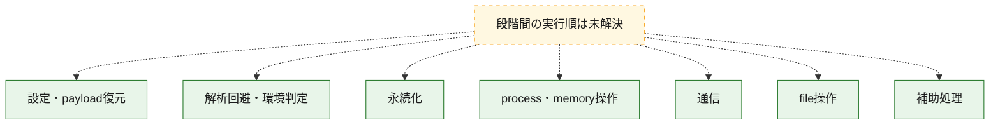
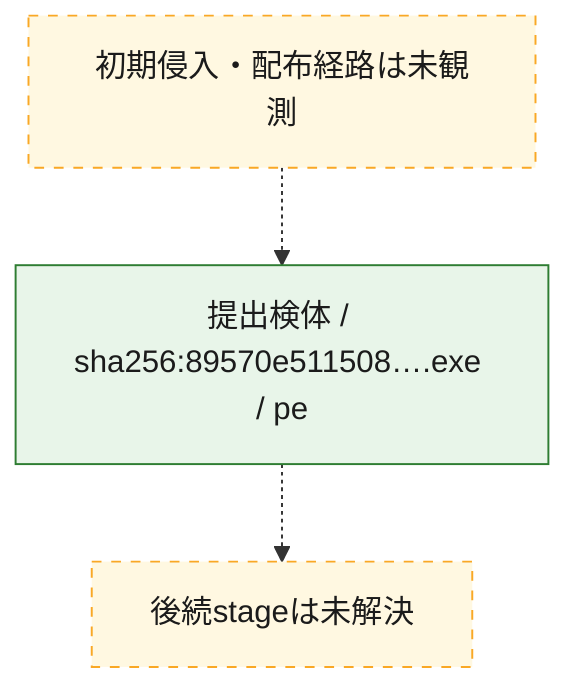
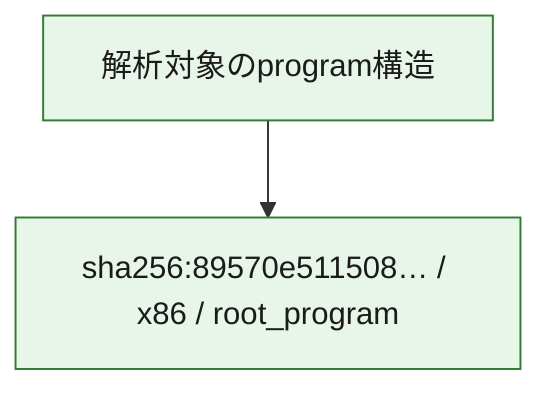

# 全体ロジック：89570e511508e037fb79e2382704a3c07f9552f1b9a1e50c7722cf22fa477e48

代表関数の静的証跡から、設定・payload復元、解析回避・環境判定、永続化、process・memory操作、通信、file操作の処理群を確認しました。

## 読み方

- phaseの掲載順は解析上の整理順です。observed_call_edgesがない段階間の実行順を断定しません。
- 図の実線は静的に観測した関係、点線と黄色のノードは未観測・未解決の関係を示します。
- 図は静的な要約であり、動的実行を再現するものではありません。
- 詳細な関数解説とfingerprintは[STATIC-LOGIC.md](STATIC-LOGIC.md)を参照してください。

## 静的可視化

### 実行フロー

### 感染チェーン

### モジュール関係

## 処理段階

### 1. 設定・payload復元

設定、resource、payload、暗号化データの復元・変換を確認します。
確度: `confirmed_static_function_evidence`

- `89570e511508e037fb79e2382704a3c07f9552f1b9a1e50c7722cf22fa477e48:ghidra:140004900` — 暗号、hash、encoding、または復号処理に関係する関数です。 状態: `succeeded`、選定理由: `meaningful_symbol_name`, `reviewed_call_centrality:4`, `role:cryptographic_transform`
- `89570e511508e037fb79e2382704a3c07f9552f1b9a1e50c7722cf22fa477e48:ghidra:140006700` — 暗号、hash、encoding、または復号処理に関係する関数です。 状態: `succeeded`、選定理由: `meaningful_symbol_name`, `reviewed_call_centrality:4`, `role:cryptographic_transform`
- `89570e511508e037fb79e2382704a3c07f9552f1b9a1e50c7722cf22fa477e48:ghidra:140009540` — 暗号、hash、encoding、または復号処理に関係する関数です。 状態: `succeeded`、選定理由: `meaningful_symbol_name`, `reviewed_call_centrality:5`, `role:cryptographic_transform`
- `89570e511508e037fb79e2382704a3c07f9552f1b9a1e50c7722cf22fa477e48:ghidra:140009f80` — 暗号、hash、encoding、または復号処理に関係する関数です。 状態: `succeeded`、選定理由: `meaningful_symbol_name`, `reviewed_call_centrality:6`, `role:cryptographic_transform`
- `89570e511508e037fb79e2382704a3c07f9552f1b9a1e50c7722cf22fa477e48:ghidra:14000a460` — 暗号、hash、encoding、または復号処理に関係する関数です。 状態: `succeeded`、選定理由: `meaningful_symbol_name`, `reviewed_call_centrality:3`, `role:cryptographic_transform`
- `89570e511508e037fb79e2382704a3c07f9552f1b9a1e50c7722cf22fa477e48:ghidra:14000a500` — 暗号、hash、encoding、または復号処理に関係する関数です。 状態: `succeeded`、選定理由: `meaningful_symbol_name`, `reviewed_call_centrality:3`, `role:cryptographic_transform`
- `89570e511508e037fb79e2382704a3c07f9552f1b9a1e50c7722cf22fa477e48:ghidra:14000a5e0` — 暗号、hash、encoding、または復号処理に関係する関数です。 状態: `succeeded`、選定理由: `meaningful_symbol_name`, `reviewed_call_centrality:4`, `role:cryptographic_transform`
- `89570e511508e037fb79e2382704a3c07f9552f1b9a1e50c7722cf22fa477e48:ghidra:14000a6e0` — 暗号、hash、encoding、または復号処理に関係する関数です。 状態: `succeeded`、選定理由: `meaningful_symbol_name`, `reviewed_call_centrality:1`, `role:cryptographic_transform`
- `89570e511508e037fb79e2382704a3c07f9552f1b9a1e50c7722cf22fa477e48:ghidra:14000aca0` — 暗号、hash、encoding、または復号処理に関係する関数です。 状態: `succeeded`、選定理由: `meaningful_symbol_name`, `reviewed_call_centrality:3`, `role:cryptographic_transform`
- `89570e511508e037fb79e2382704a3c07f9552f1b9a1e50c7722cf22fa477e48:ghidra:14000ae80` — 暗号、hash、encoding、または復号処理に関係する関数です。 状態: `succeeded`、選定理由: `meaningful_symbol_name`, `reviewed_call_centrality:3`, `role:cryptographic_transform`
- `89570e511508e037fb79e2382704a3c07f9552f1b9a1e50c7722cf22fa477e48:ghidra:14000aec0` — 暗号、hash、encoding、または復号処理に関係する関数です。 状態: `succeeded`、選定理由: `meaningful_symbol_name`, `reviewed_call_centrality:3`, `role:cryptographic_transform`
- `89570e511508e037fb79e2382704a3c07f9552f1b9a1e50c7722cf22fa477e48:ghidra:14000af00` — 暗号、hash、encoding、または復号処理に関係する関数です。 状態: `succeeded`、選定理由: `meaningful_symbol_name`, `reviewed_call_centrality:5`, `role:cryptographic_transform`
- `89570e511508e037fb79e2382704a3c07f9552f1b9a1e50c7722cf22fa477e48:ghidra:14000afc0` — 暗号、hash、encoding、または復号処理に関係する関数です。 状態: `succeeded`、選定理由: `meaningful_symbol_name`, `reviewed_call_centrality:5`, `role:cryptographic_transform`
- `89570e511508e037fb79e2382704a3c07f9552f1b9a1e50c7722cf22fa477e48:ghidra:14000b080` — 暗号、hash、encoding、または復号処理に関係する関数です。 状態: `succeeded`、選定理由: `meaningful_symbol_name`, `reviewed_call_centrality:3`, `role:cryptographic_transform`
- `89570e511508e037fb79e2382704a3c07f9552f1b9a1e50c7722cf22fa477e48:ghidra:14000b0e0` — 暗号、hash、encoding、または復号処理に関係する関数です。 状態: `succeeded`、選定理由: `meaningful_symbol_name`, `reviewed_call_centrality:3`, `role:cryptographic_transform`
- `89570e511508e037fb79e2382704a3c07f9552f1b9a1e50c7722cf22fa477e48:ghidra:14000b140` — 暗号、hash、encoding、または復号処理に関係する関数です。 状態: `succeeded`、選定理由: `meaningful_symbol_name`, `reviewed_call_centrality:8`, `role:cryptographic_transform`

### 2. 解析回避・環境判定

debugger、sandbox、仮想環境、時間差などの判定を確認します。
確度: `confirmed_static_function_evidence`

- `89570e511508e037fb79e2382704a3c07f9552f1b9a1e50c7722cf22fa477e48:ghidra:140009680` — debugger、仮想環境、sandbox、または時間差の確認に関係する関数です。 状態: `succeeded`、選定理由: `meaningful_symbol_name`, `reviewed_call_centrality:3`, `role:anti_analysis`

### 3. 永続化

自動起動や永続化に関係する設定変更を確認します。
確度: `confirmed_static_function_evidence`

- `89570e511508e037fb79e2382704a3c07f9552f1b9a1e50c7722cf22fa477e48:ghidra:1400157e0` — 自動起動または永続化に関係する処理を含む関数です。 状態: `succeeded`、選定理由: `meaningful_symbol_name`, `reviewed_call_centrality:2`, `role:persistence`

### 4. process・memory操作

process、thread、module、memory操作と実行移行を確認します。
確度: `confirmed_static_function_evidence`

- `89570e511508e037fb79e2382704a3c07f9552f1b9a1e50c7722cf22fa477e48:ghidra:140001b00` — process、thread、module、またはmemory操作に関係する関数です。 状態: `succeeded`、選定理由: `meaningful_symbol_name`, `reviewed_call_centrality:11`, `role:process_or_memory_operation`

### 5. 通信

通信初期化、endpoint処理、送受信の役割を確認します。
確度: `confirmed_static_function_evidence`

- `89570e511508e037fb79e2382704a3c07f9552f1b9a1e50c7722cf22fa477e48:ghidra:14000c440` — 通信初期化、送受信、またはendpoint処理に関係する関数です。 状態: `succeeded`、選定理由: `meaningful_symbol_name`, `reviewed_call_centrality:2`, `role:network_communication`
- `89570e511508e037fb79e2382704a3c07f9552f1b9a1e50c7722cf22fa477e48:ghidra:14000c460` — 通信初期化、送受信、またはendpoint処理に関係する関数です。 状態: `succeeded`、選定理由: `meaningful_symbol_name`, `reviewed_call_centrality:23`, `role:network_communication`
- `89570e511508e037fb79e2382704a3c07f9552f1b9a1e50c7722cf22fa477e48:ghidra:14000ca40` — 通信初期化、送受信、またはendpoint処理に関係する関数です。 状態: `succeeded`、選定理由: `meaningful_symbol_name`, `reviewed_call_centrality:3`, `role:network_communication`
- `89570e511508e037fb79e2382704a3c07f9552f1b9a1e50c7722cf22fa477e48:ghidra:14000ca80` — 通信初期化、送受信、またはendpoint処理に関係する関数です。 状態: `succeeded`、選定理由: `meaningful_symbol_name`, `reviewed_call_centrality:8`, `role:network_communication`
- `89570e511508e037fb79e2382704a3c07f9552f1b9a1e50c7722cf22fa477e48:ghidra:14000cc40` — 通信初期化、送受信、またはendpoint処理に関係する関数です。 状態: `succeeded`、選定理由: `meaningful_symbol_name`, `reviewed_call_centrality:3`, `role:network_communication`
- `89570e511508e037fb79e2382704a3c07f9552f1b9a1e50c7722cf22fa477e48:ghidra:14000cd40` — 通信初期化、送受信、またはendpoint処理に関係する関数です。 状態: `succeeded`、選定理由: `meaningful_symbol_name`, `reviewed_call_centrality:4`, `role:network_communication`
- `89570e511508e037fb79e2382704a3c07f9552f1b9a1e50c7722cf22fa477e48:ghidra:14000cdc0` — 通信初期化、送受信、またはendpoint処理に関係する関数です。 状態: `succeeded`、選定理由: `meaningful_symbol_name`, `reviewed_call_centrality:4`, `role:network_communication`
- `89570e511508e037fb79e2382704a3c07f9552f1b9a1e50c7722cf22fa477e48:ghidra:14000d380` — 通信初期化、送受信、またはendpoint処理に関係する関数です。 状態: `succeeded`、選定理由: `meaningful_symbol_name`, `reviewed_call_centrality:2`, `role:network_communication`
- `89570e511508e037fb79e2382704a3c07f9552f1b9a1e50c7722cf22fa477e48:ghidra:14000d3a0` — 通信初期化、送受信、またはendpoint処理に関係する関数です。 状態: `succeeded`、選定理由: `meaningful_symbol_name`, `reviewed_call_centrality:28`, `role:network_communication`
- `89570e511508e037fb79e2382704a3c07f9552f1b9a1e50c7722cf22fa477e48:ghidra:14000da40` — 通信初期化、送受信、またはendpoint処理に関係する関数です。 状態: `succeeded`、選定理由: `meaningful_symbol_name`, `reviewed_call_centrality:3`, `role:network_communication`
- `89570e511508e037fb79e2382704a3c07f9552f1b9a1e50c7722cf22fa477e48:ghidra:14000da80` — 通信初期化、送受信、またはendpoint処理に関係する関数です。 状態: `succeeded`、選定理由: `meaningful_symbol_name`, `reviewed_call_centrality:9`, `role:network_communication`

### 6. file操作

fileやdirectoryの作成、読書き、削除を確認します。
確度: `confirmed_static_function_evidence`

- `89570e511508e037fb79e2382704a3c07f9552f1b9a1e50c7722cf22fa477e48:ghidra:1400155e0` — fileまたはdirectoryの読書き・管理に関係する関数です。 状態: `succeeded`、選定理由: `meaningful_symbol_name`, `reviewed_call_centrality:5`, `role:file_operation`

### 7. 補助処理

主要処理を支える一般内部関数またはlibrary処理を確認します。
確度: `confirmed_static_function_evidence`

- `89570e511508e037fb79e2382704a3c07f9552f1b9a1e50c7722cf22fa477e48:ghidra:1400010a0` — 検体内部の一般処理を実装する関数です。 状態: `succeeded`、選定理由: `meaningful_symbol_name`, `reviewed_call_centrality:3`

## 観測したcall関係

- 代表関数間で直接解決できた呼出関係はありません。

## 解析範囲と制約

- 選定外関数は全体inventoryへ残しますが、関数本体の個別解説対象にはしていません。
- indirect call、難読化、packer、VM、壊れたcontrol flowによりcall関係が欠落する場合があります。
- 文書は静的解析に基づき、検体実行や外部通信による動的確認は行っていません。
