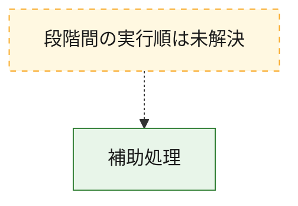
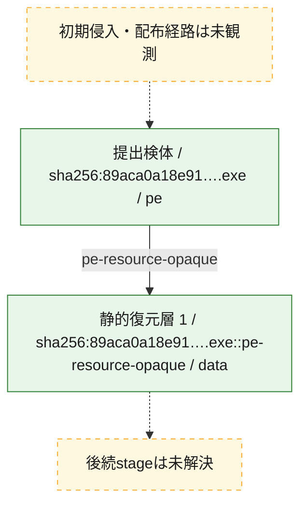
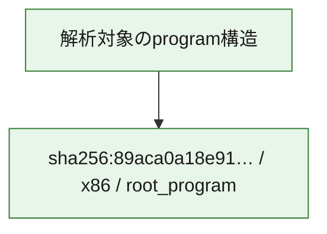

# 全体ロジック：89aca0a18e915ebaf8dfebfe0320260f358774ebfa83f1cdbcd25fe988ce06b7

代表関数から主要なmalware処理段階を自動分類できませんでした。

## 読み方

- phaseの掲載順は解析上の整理順です。observed_call_edgesがない段階間の実行順を断定しません。
- 図の実線は静的に観測した関係、点線と黄色のノードは未観測・未解決の関係を示します。
- 図は静的な要約であり、動的実行を再現するものではありません。
- 詳細な関数解説とfingerprintは[STATIC-LOGIC.md](STATIC-LOGIC.md)を参照してください。

## 静的可視化

### 実行フロー

### 感染チェーン

### モジュール関係

## 処理段階

### 1. 補助処理

主要処理を支える一般内部関数またはlibrary処理を確認します。
確度: `confirmed_static_function_evidence`

- `89aca0a18e915ebaf8dfebfe0320260f358774ebfa83f1cdbcd25fe988ce06b7:ghidra:0040100b` — 検体内部の一般処理を実装する関数です。 状態: `succeeded`、選定理由: `context_representative`, `small_program_complete_context`
- `89aca0a18e915ebaf8dfebfe0320260f358774ebfa83f1cdbcd25fe988ce06b7:ghidra:0040108f` — 検体内部の一般処理を実装する関数です。 状態: `succeeded`、選定理由: `context_representative`, `reviewed_call_centrality:2`, `small_program_complete_context`
- `89aca0a18e915ebaf8dfebfe0320260f358774ebfa83f1cdbcd25fe988ce06b7:ghidra:0040160d` — 検体内部の一般処理を実装する関数です。 状態: `succeeded`、選定理由: `context_representative`, `reviewed_call_centrality:4`, `small_program_complete_context`
- `89aca0a18e915ebaf8dfebfe0320260f358774ebfa83f1cdbcd25fe988ce06b7:ghidra:00401719` — 検体内部の一般処理を実装する関数です。 状態: `succeeded`、選定理由: `context_representative`, `reviewed_call_centrality:6`, `small_program_complete_context`
- `89aca0a18e915ebaf8dfebfe0320260f358774ebfa83f1cdbcd25fe988ce06b7:ghidra:0040181e` — 検体内部の一般処理を実装する関数です。 状態: `succeeded`、選定理由: `context_representative`, `reviewed_call_centrality:1`, `small_program_complete_context`
- `89aca0a18e915ebaf8dfebfe0320260f358774ebfa83f1cdbcd25fe988ce06b7:ghidra:0040184b` — 検体内部の一般処理を実装する関数です。 状態: `succeeded`、選定理由: `context_representative`, `reviewed_call_centrality:7`, `small_program_complete_context`
- `89aca0a18e915ebaf8dfebfe0320260f358774ebfa83f1cdbcd25fe988ce06b7:ghidra:00401993` — 検体内部の一般処理を実装する関数です。 状態: `succeeded`、選定理由: `context_representative`, `reviewed_call_centrality:4`, `small_program_complete_context`
- `89aca0a18e915ebaf8dfebfe0320260f358774ebfa83f1cdbcd25fe988ce06b7:ghidra:00401a52` — 検体内部の一般処理を実装する関数です。 状態: `succeeded`、選定理由: `context_representative`, `reviewed_call_centrality:1`, `small_program_complete_context`

## 観測したcall関係

- `ghidra-function:15c9e580d3ba99d23634aba6` → `ghidra-external:2e5754feefbea8cb0c13e365` （`unclassified` → `unclassified`）
- `ghidra-function:15c9e580d3ba99d23634aba6` → `ghidra-external:b45ee7ab61ce6599c9eeb570` （`unclassified` → `unclassified`）
- `ghidra-function:1ce142802287f6b624616817` → `ghidra-external:748d5deccd407715b7a4d537` （`unclassified` → `unclassified`）
- `ghidra-function:933f8263e81222136f1568ed` → `ghidra-external:37cf0a66e6937aa8311f52db` （`unclassified` → `unclassified`）
- `ghidra-function:933f8263e81222136f1568ed` → `ghidra-external:a773422d36b82e2266289dd4` （`unclassified` → `unclassified`）
- `ghidra-function:933f8263e81222136f1568ed` → `ghidra-external:ab162444fbb7ef1692c375ef` （`unclassified` → `unclassified`）
- `ghidra-function:933f8263e81222136f1568ed` → `ghidra-external:af1bc3ba3457c4f6e09becea` （`unclassified` → `unclassified`）
- `ghidra-function:9936220ca16d166309f4bab1` → `ghidra-external:3ee347df5f3e28e3e14bc204` （`unclassified` → `unclassified`）
- `ghidra-function:9936220ca16d166309f4bab1` → `ghidra-external:748d5deccd407715b7a4d537` （`unclassified` → `unclassified`）
- `ghidra-function:9936220ca16d166309f4bab1` → `ghidra-external:8fa6ff3e449cfb9540de74db` （`unclassified` → `unclassified`）
- `ghidra-function:9936220ca16d166309f4bab1` → `ghidra-external:925c757923215c7b0333a6e0` （`unclassified` → `unclassified`）
- `ghidra-function:9f38b3e56438f29b77e53c6e` → `ghidra-external:23dfac272f0d46b0e529aef0` （`unclassified` → `unclassified`）
- `ghidra-function:a71621228093a37ae8c484db` → `ghidra-external:4b768d9a16c7c634bda27b2a` （`unclassified` → `unclassified`）
- `ghidra-function:a71621228093a37ae8c484db` → `ghidra-external:994a0d2d17714fd885b163cd` （`unclassified` → `unclassified`）
- `ghidra-function:a71621228093a37ae8c484db` → `ghidra-external:ca4019ac53adf38d03370b23` （`unclassified` → `unclassified`）
- `ghidra-function:a71621228093a37ae8c484db` → `ghidra-external:cd9b97c4a1fa377bcc2d9c34` （`unclassified` → `unclassified`）
- `ghidra-function:a71621228093a37ae8c484db` → `ghidra-external:d5c8a908dd45cc63dc8a9bd7` （`unclassified` → `unclassified`）
- `ghidra-function:a71621228093a37ae8c484db` → `ghidra-external:ea52749af8559f7611ae2a67` （`unclassified` → `unclassified`）
- `ghidra-function:f9cbbc7cd97b151a96bbcc4d` → `ghidra-external:2a058a39e81579fae400154c` （`unclassified` → `unclassified`）
- `ghidra-function:f9cbbc7cd97b151a96bbcc4d` → `ghidra-external:2e5754feefbea8cb0c13e365` （`unclassified` → `unclassified`）
- `ghidra-function:f9cbbc7cd97b151a96bbcc4d` → `ghidra-external:72426dbf11128441a8ffbf34` （`unclassified` → `unclassified`）
- `ghidra-function:f9cbbc7cd97b151a96bbcc4d` → `ghidra-external:791d6e95355d4caefc5e789e` （`unclassified` → `unclassified`）
- `ghidra-function:f9cbbc7cd97b151a96bbcc4d` → `ghidra-external:83477b48cb7d5d43a4bdb419` （`unclassified` → `unclassified`）
- `ghidra-function:f9cbbc7cd97b151a96bbcc4d` → `ghidra-external:a78a08487d6793e0ee1c7574` （`unclassified` → `unclassified`）
- `ghidra-function:f9cbbc7cd97b151a96bbcc4d` → `ghidra-external:d8cdf8e3a36ba845a1dcb506` （`unclassified` → `unclassified`）

## 解析範囲と制約

- 選定外関数は全体inventoryへ残しますが、関数本体の個別解説対象にはしていません。
- indirect call、難読化、packer、VM、壊れたcontrol flowによりcall関係が欠落する場合があります。
- 文書は静的解析に基づき、検体実行や外部通信による動的確認は行っていません。
