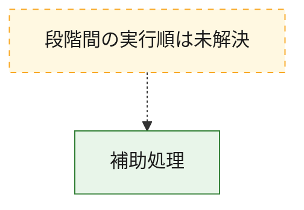
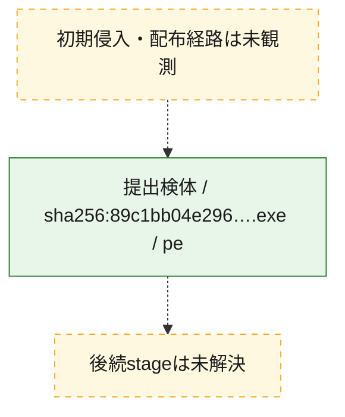
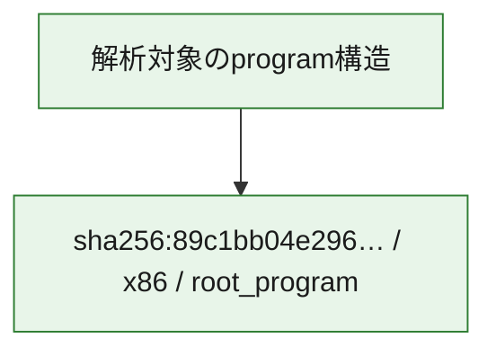

# 全体ロジック：89c1bb04e296b0084b118a07f80316b5f694d7460ab13afc216c5bacc787d236

代表関数から主要なmalware処理段階を自動分類できませんでした。

## 読み方

- phaseの掲載順は解析上の整理順です。observed_call_edgesがない段階間の実行順を断定しません。
- 図の実線は静的に観測した関係、点線と黄色のノードは未観測・未解決の関係を示します。
- 図は静的な要約であり、動的実行を再現するものではありません。
- 詳細な関数解説とfingerprintは[STATIC-LOGIC.md](STATIC-LOGIC.md)を参照してください。

## 静的可視化

### 実行フロー

### 感染チェーン

### モジュール関係

## 処理段階

### 1. 補助処理

主要処理を支える一般内部関数またはlibrary処理を確認します。
確度: `confirmed_static_function_evidence`

- `89c1bb04e296b0084b118a07f80316b5f694d7460ab13afc216c5bacc787d236:ghidra:140001000` — 検体内部の一般処理を実装する関数です。 状態: `succeeded`、選定理由: `context_representative`, `reviewed_call_centrality:8`
- `89c1bb04e296b0084b118a07f80316b5f694d7460ab13afc216c5bacc787d236:ghidra:1400012a0` — 検体内部の一般処理を実装する関数です。 状態: `succeeded`、選定理由: `context_representative`, `reviewed_call_centrality:3`
- `89c1bb04e296b0084b118a07f80316b5f694d7460ab13afc216c5bacc787d236:ghidra:140001320` — 検体内部の一般処理を実装する関数です。 状態: `succeeded`、選定理由: `context_representative`, `reviewed_call_centrality:3`
- `89c1bb04e296b0084b118a07f80316b5f694d7460ab13afc216c5bacc787d236:ghidra:140001380` — 検体内部の一般処理を実装する関数です。 状態: `succeeded`、選定理由: `context_representative`, `reviewed_call_centrality:2`
- `89c1bb04e296b0084b118a07f80316b5f694d7460ab13afc216c5bacc787d236:ghidra:1400013c0` — 検体内部の一般処理を実装する関数です。 状態: `succeeded`、選定理由: `context_representative`, `reviewed_call_centrality:4`
- `89c1bb04e296b0084b118a07f80316b5f694d7460ab13afc216c5bacc787d236:ghidra:140001540` — 検体内部の一般処理を実装する関数です。 状態: `succeeded`、選定理由: `context_representative`, `reviewed_call_centrality:2`
- `89c1bb04e296b0084b118a07f80316b5f694d7460ab13afc216c5bacc787d236:ghidra:140001620` — 検体内部の一般処理を実装する関数です。 状態: `succeeded`、選定理由: `context_representative`, `reviewed_call_centrality:5`
- `89c1bb04e296b0084b118a07f80316b5f694d7460ab13afc216c5bacc787d236:ghidra:1400019e0` — 検体内部の一般処理を実装する関数です。 状態: `succeeded`、選定理由: `context_representative`, `reviewed_call_centrality:2`
- `89c1bb04e296b0084b118a07f80316b5f694d7460ab13afc216c5bacc787d236:ghidra:140001a60` — 検体内部の一般処理を実装する関数です。 状態: `succeeded`、選定理由: `context_representative`, `reviewed_call_centrality:1`
- `89c1bb04e296b0084b118a07f80316b5f694d7460ab13afc216c5bacc787d236:ghidra:140001ae0` — 検体内部の一般処理を実装する関数です。 状態: `succeeded`、選定理由: `context_representative`, `reviewed_call_centrality:2`
- `89c1bb04e296b0084b118a07f80316b5f694d7460ab13afc216c5bacc787d236:ghidra:140001ba0` — 検体内部の一般処理を実装する関数です。 状態: `succeeded`、選定理由: `context_representative`, `reviewed_call_centrality:2`
- `89c1bb04e296b0084b118a07f80316b5f694d7460ab13afc216c5bacc787d236:ghidra:140001d00` — 検体内部の一般処理を実装する関数です。 状態: `succeeded`、選定理由: `context_representative`, `reviewed_call_centrality:2`
- `89c1bb04e296b0084b118a07f80316b5f694d7460ab13afc216c5bacc787d236:ghidra:140001d60` — 検体内部の一般処理を実装する関数です。 状態: `succeeded`、選定理由: `context_representative`, `reviewed_call_centrality:4`
- `89c1bb04e296b0084b118a07f80316b5f694d7460ab13afc216c5bacc787d236:ghidra:140001de0` — 検体内部の一般処理を実装する関数です。 状態: `succeeded`、選定理由: `context_representative`, `reviewed_call_centrality:5`
- `89c1bb04e296b0084b118a07f80316b5f694d7460ab13afc216c5bacc787d236:ghidra:140001e80` — 検体内部の一般処理を実装する関数です。 状態: `succeeded`、選定理由: `context_representative`, `reviewed_call_centrality:5`
- `89c1bb04e296b0084b118a07f80316b5f694d7460ab13afc216c5bacc787d236:ghidra:140001f80` — 検体内部の一般処理を実装する関数です。 状態: `succeeded`、選定理由: `context_representative`, `reviewed_call_centrality:7`
- `89c1bb04e296b0084b118a07f80316b5f694d7460ab13afc216c5bacc787d236:ghidra:1400023e0` — 検体内部の一般処理を実装する関数です。 状態: `succeeded`、選定理由: `context_representative`, `reviewed_call_centrality:3`
- `89c1bb04e296b0084b118a07f80316b5f694d7460ab13afc216c5bacc787d236:ghidra:140002440` — 検体内部の一般処理を実装する関数です。 状態: `succeeded`、選定理由: `context_representative`, `reviewed_call_centrality:2`
- `89c1bb04e296b0084b118a07f80316b5f694d7460ab13afc216c5bacc787d236:ghidra:140002460` — 検体内部の一般処理を実装する関数です。 状態: `succeeded`、選定理由: `context_representative`, `reviewed_call_centrality:2`
- `89c1bb04e296b0084b118a07f80316b5f694d7460ab13afc216c5bacc787d236:ghidra:140002480` — 検体内部の一般処理を実装する関数です。 状態: `succeeded`、選定理由: `context_representative`, `reviewed_call_centrality:2`
- `89c1bb04e296b0084b118a07f80316b5f694d7460ab13afc216c5bacc787d236:ghidra:1400024a0` — 検体内部の一般処理を実装する関数です。 状態: `succeeded`、選定理由: `context_representative`, `reviewed_call_centrality:3`
- `89c1bb04e296b0084b118a07f80316b5f694d7460ab13afc216c5bacc787d236:ghidra:1400024e0` — 検体内部の一般処理を実装する関数です。 状態: `succeeded`、選定理由: `context_representative`, `reviewed_call_centrality:2`
- `89c1bb04e296b0084b118a07f80316b5f694d7460ab13afc216c5bacc787d236:ghidra:140002500` — 検体内部の一般処理を実装する関数です。 状態: `succeeded`、選定理由: `context_representative`, `reviewed_call_centrality:2`
- `89c1bb04e296b0084b118a07f80316b5f694d7460ab13afc216c5bacc787d236:ghidra:140002520` — 検体内部の一般処理を実装する関数です。 状態: `succeeded`、選定理由: `context_representative`, `reviewed_call_centrality:3`
- `89c1bb04e296b0084b118a07f80316b5f694d7460ab13afc216c5bacc787d236:ghidra:140002560` — 検体内部の一般処理を実装する関数です。 状態: `succeeded`、選定理由: `context_representative`, `reviewed_call_centrality:3`
- `89c1bb04e296b0084b118a07f80316b5f694d7460ab13afc216c5bacc787d236:ghidra:1400025e0` — 検体内部の一般処理を実装する関数です。 状態: `succeeded`、選定理由: `context_representative`, `reviewed_call_centrality:3`
- `89c1bb04e296b0084b118a07f80316b5f694d7460ab13afc216c5bacc787d236:ghidra:140002760` — 検体内部の一般処理を実装する関数です。 状態: `succeeded`、選定理由: `context_representative`, `reviewed_call_centrality:5`
- `89c1bb04e296b0084b118a07f80316b5f694d7460ab13afc216c5bacc787d236:ghidra:140002ae0` — 検体内部の一般処理を実装する関数です。 状態: `succeeded`、選定理由: `context_representative`, `reviewed_call_centrality:5`
- `89c1bb04e296b0084b118a07f80316b5f694d7460ab13afc216c5bacc787d236:ghidra:140002e40` — 検体内部の一般処理を実装する関数です。 状態: `succeeded`、選定理由: `context_representative`, `reviewed_call_centrality:5`
- `89c1bb04e296b0084b118a07f80316b5f694d7460ab13afc216c5bacc787d236:ghidra:140003200` — 検体内部の一般処理を実装する関数です。 状態: `succeeded`、選定理由: `context_representative`, `reviewed_call_centrality:5`
- `89c1bb04e296b0084b118a07f80316b5f694d7460ab13afc216c5bacc787d236:ghidra:1400035e0` — 検体内部の一般処理を実装する関数です。 状態: `succeeded`、選定理由: `context_representative`, `reviewed_call_centrality:5`
- `89c1bb04e296b0084b118a07f80316b5f694d7460ab13afc216c5bacc787d236:ghidra:140003940` — 検体内部の一般処理を実装する関数です。 状態: `succeeded`、選定理由: `context_representative`, `reviewed_call_centrality:5`

## 観測したcall関係

- `89c1bb04e296b0084b118a07f80316b5f694d7460ab13afc216c5bacc787d236:ghidra:1400024a0` → `89c1bb04e296b0084b118a07f80316b5f694d7460ab13afc216c5bacc787d236:ghidra:140001d60` （`support` → `support`）
- `89c1bb04e296b0084b118a07f80316b5f694d7460ab13afc216c5bacc787d236:ghidra:140002520` → `89c1bb04e296b0084b118a07f80316b5f694d7460ab13afc216c5bacc787d236:ghidra:140001de0` （`support` → `support`）
- `89c1bb04e296b0084b118a07f80316b5f694d7460ab13afc216c5bacc787d236:ghidra:1400025e0` → `89c1bb04e296b0084b118a07f80316b5f694d7460ab13afc216c5bacc787d236:ghidra:140001e80` （`support` → `support`）
- `ghidra-function:04598fc9082d5359ce8355b3` → `ghidra-external:587c3ea02b0bb46755095d5b` （`unclassified` → `unclassified`）
- `ghidra-function:04598fc9082d5359ce8355b3` → `ghidra-function:46cd8b5af4cc0d8a82186237` （`unclassified` → `unclassified`）
- `ghidra-function:0d4984f124bc01c4057d2d52` → `ghidra-external:587c3ea02b0bb46755095d5b` （`unclassified` → `unclassified`）
- `ghidra-function:0d4984f124bc01c4057d2d52` → `ghidra-function:23a317fd44a065467e17e4db` （`unclassified` → `unclassified`）
- `ghidra-function:0f91e48e568c8dc6be276312` → `ghidra-external:ba1e06c5934857d3561167c7` （`unclassified` → `unclassified`）
- `ghidra-function:0f91e48e568c8dc6be276312` → `ghidra-function:12ab13c6b62e714f0f47c297` （`unclassified` → `unclassified`）
- `ghidra-function:0f91e48e568c8dc6be276312` → `ghidra-function:23a317fd44a065467e17e4db` （`unclassified` → `unclassified`）
- `ghidra-function:0f91e48e568c8dc6be276312` → `ghidra-function:6bda6295dae0095f795a5c58` （`unclassified` → `unclassified`）
- `ghidra-function:0f91e48e568c8dc6be276312` → `ghidra-function:dcacdc0ba7eb6bc0cdc685d5` （`unclassified` → `unclassified`）
- `ghidra-function:209d5f8d49476f1aae30e109` → `ghidra-external:3d327b56678442108715c861` （`unclassified` → `unclassified`）
- `ghidra-function:209d5f8d49476f1aae30e109` → `ghidra-external:ba1e06c5934857d3561167c7` （`unclassified` → `unclassified`）
- `ghidra-function:209d5f8d49476f1aae30e109` → `ghidra-function:23a317fd44a065467e17e4db` （`unclassified` → `unclassified`）
- `ghidra-function:209d5f8d49476f1aae30e109` → `ghidra-function:6bda6295dae0095f795a5c58` （`unclassified` → `unclassified`）
- `ghidra-function:209d5f8d49476f1aae30e109` → `ghidra-function:71a9f89a8aba263614ac5daa` （`unclassified` → `unclassified`）
- `ghidra-function:209d5f8d49476f1aae30e109` → `ghidra-function:ddd37414bfad9b5a20aac614` （`unclassified` → `unclassified`）
- `ghidra-function:209d5f8d49476f1aae30e109` → `ghidra-function:f8c801bab464a191d22798ec` （`unclassified` → `unclassified`）
- `ghidra-function:28a3dea564caff3ec7681d4d` → `ghidra-external:ba1e06c5934857d3561167c7` （`unclassified` → `unclassified`）
- `ghidra-function:28a3dea564caff3ec7681d4d` → `ghidra-function:12ab13c6b62e714f0f47c297` （`unclassified` → `unclassified`）
- `ghidra-function:28a3dea564caff3ec7681d4d` → `ghidra-function:23a317fd44a065467e17e4db` （`unclassified` → `unclassified`）
- `ghidra-function:28a3dea564caff3ec7681d4d` → `ghidra-function:6bda6295dae0095f795a5c58` （`unclassified` → `unclassified`）
- `ghidra-function:28a3dea564caff3ec7681d4d` → `ghidra-function:dcacdc0ba7eb6bc0cdc685d5` （`unclassified` → `unclassified`）
- `ghidra-function:2a709633e5578a6597b1d156` → `ghidra-external:587c3ea02b0bb46755095d5b` （`unclassified` → `unclassified`）
- `ghidra-function:2a709633e5578a6597b1d156` → `ghidra-function:23a317fd44a065467e17e4db` （`unclassified` → `unclassified`）
- `ghidra-function:2a709633e5578a6597b1d156` → `ghidra-function:46cd8b5af4cc0d8a82186237` （`unclassified` → `unclassified`）
- `ghidra-function:301e8b2d135fc7fb0ede8c71` → `ghidra-function:23a317fd44a065467e17e4db` （`unclassified` → `unclassified`）
- `ghidra-function:31c307b0187e32703b128a32` → `ghidra-external:ba1e06c5934857d3561167c7` （`unclassified` → `unclassified`）
- `ghidra-function:31c307b0187e32703b128a32` → `ghidra-function:23a317fd44a065467e17e4db` （`unclassified` → `unclassified`）
- `ghidra-function:31c307b0187e32703b128a32` → `ghidra-function:6bda6295dae0095f795a5c58` （`unclassified` → `unclassified`）
- `ghidra-function:43dd3bc45e145aa056481eaa` → `ghidra-external:ba1e06c5934857d3561167c7` （`unclassified` → `unclassified`）
- `ghidra-function:43dd3bc45e145aa056481eaa` → `ghidra-function:0e2c5912b832661a18551c32` （`unclassified` → `unclassified`）
- `ghidra-function:43dd3bc45e145aa056481eaa` → `ghidra-function:954cf1f18eb6711a790352bc` （`unclassified` → `unclassified`）
- `ghidra-function:4e460909353effbbed41bfd1` → `ghidra-external:587c3ea02b0bb46755095d5b` （`unclassified` → `unclassified`）
- `ghidra-function:4e460909353effbbed41bfd1` → `ghidra-function:0e2c5912b832661a18551c32` （`unclassified` → `unclassified`）
- `ghidra-function:534b80972534dd36f315d5af` → `ghidra-external:ba1e06c5934857d3561167c7` （`unclassified` → `unclassified`）
- `ghidra-function:534b80972534dd36f315d5af` → `ghidra-external:cafbb261787e0b439a9d283e` （`unclassified` → `unclassified`）
- `ghidra-function:572a9e6d87984cdf5ff4eb6f` → `ghidra-external:587c3ea02b0bb46755095d5b` （`unclassified` → `unclassified`）
- `ghidra-function:572a9e6d87984cdf5ff4eb6f` → `ghidra-function:0e2c5912b832661a18551c32` （`unclassified` → `unclassified`）
- `ghidra-function:572a9e6d87984cdf5ff4eb6f` → `ghidra-function:46cd8b5af4cc0d8a82186237` （`unclassified` → `unclassified`）
- `ghidra-function:5e32739e115f784da0fbdae6` → `ghidra-external:0eb62f85c20f69086b4bcf06` （`unclassified` → `unclassified`）
- `ghidra-function:5e32739e115f784da0fbdae6` → `ghidra-external:ba1e06c5934857d3561167c7` （`unclassified` → `unclassified`）
- `ghidra-function:5e32739e115f784da0fbdae6` → `ghidra-function:46cd8b5af4cc0d8a82186237` （`unclassified` → `unclassified`）
- `ghidra-function:5e32739e115f784da0fbdae6` → `ghidra-function:6acdd8af334e9ce76ad6c537` （`unclassified` → `unclassified`）
- `ghidra-function:6320d49e665d36862c8afa0d` → `ghidra-external:ba1e06c5934857d3561167c7` （`unclassified` → `unclassified`）
- `ghidra-function:6320d49e665d36862c8afa0d` → `ghidra-function:7b3ded316db85b9d45244385` （`unclassified` → `unclassified`）
- `ghidra-function:6320d49e665d36862c8afa0d` → `ghidra-function:937d3c9cce8ef95f0f971d39` （`unclassified` → `unclassified`）
- `ghidra-function:6320d49e665d36862c8afa0d` → `ghidra-function:a44d847ee6356dbab01d9886` （`unclassified` → `unclassified`）
- `ghidra-function:6320d49e665d36862c8afa0d` → `ghidra-function:b633f63e2ca3ffbf15cb88ca` （`unclassified` → `unclassified`）
- `ghidra-function:6320d49e665d36862c8afa0d` → `ghidra-function:c6b6afcd7527f8e3f7e1f111` （`unclassified` → `unclassified`）
- `ghidra-function:6320d49e665d36862c8afa0d` → `ghidra-function:f5e70d5db4f987ec4c6d0bcb` （`unclassified` → `unclassified`）
- `ghidra-function:6320d49e665d36862c8afa0d` → `ghidra-function:fdbcf72942683bf88b771106` （`unclassified` → `unclassified`）
- `ghidra-function:652f266c6af14c1c73a95efd` → `ghidra-external:ba1e06c5934857d3561167c7` （`unclassified` → `unclassified`）
- `ghidra-function:652f266c6af14c1c73a95efd` → `ghidra-function:12ab13c6b62e714f0f47c297` （`unclassified` → `unclassified`）
- `ghidra-function:652f266c6af14c1c73a95efd` → `ghidra-function:23a317fd44a065467e17e4db` （`unclassified` → `unclassified`）
- `ghidra-function:652f266c6af14c1c73a95efd` → `ghidra-function:6bda6295dae0095f795a5c58` （`unclassified` → `unclassified`）
- `ghidra-function:652f266c6af14c1c73a95efd` → `ghidra-function:dcacdc0ba7eb6bc0cdc685d5` （`unclassified` → `unclassified`）
- `ghidra-function:6c4874208309c70982562df0` → `ghidra-external:587c3ea02b0bb46755095d5b` （`unclassified` → `unclassified`）
- `ghidra-function:6c4874208309c70982562df0` → `ghidra-function:0e2c5912b832661a18551c32` （`unclassified` → `unclassified`）
- `ghidra-function:7940c05da6f630db3ede2316` → `ghidra-external:ba1e06c5934857d3561167c7` （`unclassified` → `unclassified`）
- `ghidra-function:7940c05da6f630db3ede2316` → `ghidra-function:0e2c5912b832661a18551c32` （`unclassified` → `unclassified`）
- `ghidra-function:7940c05da6f630db3ede2316` → `ghidra-function:5e32739e115f784da0fbdae6` （`unclassified` → `unclassified`）
- `ghidra-function:829a0de47523726b42550706` → `ghidra-external:ba1e06c5934857d3561167c7` （`unclassified` → `unclassified`）
- `ghidra-function:829a0de47523726b42550706` → `ghidra-function:12ab13c6b62e714f0f47c297` （`unclassified` → `unclassified`）
- `ghidra-function:829a0de47523726b42550706` → `ghidra-function:23a317fd44a065467e17e4db` （`unclassified` → `unclassified`）
- `ghidra-function:829a0de47523726b42550706` → `ghidra-function:6bda6295dae0095f795a5c58` （`unclassified` → `unclassified`）
- `ghidra-function:829a0de47523726b42550706` → `ghidra-function:dcacdc0ba7eb6bc0cdc685d5` （`unclassified` → `unclassified`）
- `ghidra-function:8507245c91bb9f8c3be5ed6d` → `ghidra-external:0eb62f85c20f69086b4bcf06` （`unclassified` → `unclassified`）
- `ghidra-function:8507245c91bb9f8c3be5ed6d` → `ghidra-external:ba1e06c5934857d3561167c7` （`unclassified` → `unclassified`）
- `ghidra-function:8507245c91bb9f8c3be5ed6d` → `ghidra-function:46cd8b5af4cc0d8a82186237` （`unclassified` → `unclassified`）
- `ghidra-function:8507245c91bb9f8c3be5ed6d` → `ghidra-function:6acdd8af334e9ce76ad6c537` （`unclassified` → `unclassified`）
- `ghidra-function:9004b7da446728569e97c0cb` → `ghidra-external:587c3ea02b0bb46755095d5b` （`unclassified` → `unclassified`）
- `ghidra-function:9004b7da446728569e97c0cb` → `ghidra-function:0e2c5912b832661a18551c32` （`unclassified` → `unclassified`）
- `ghidra-function:9004b7da446728569e97c0cb` → `ghidra-function:23a317fd44a065467e17e4db` （`unclassified` → `unclassified`）
- `ghidra-function:954cf1f18eb6711a790352bc` → `ghidra-external:587c3ea02b0bb46755095d5b` （`unclassified` → `unclassified`）
- `ghidra-function:954cf1f18eb6711a790352bc` → `ghidra-external:f92ea92c898a1ef9e641dd95` （`unclassified` → `unclassified`）
- `ghidra-function:954cf1f18eb6711a790352bc` → `ghidra-function:46cd8b5af4cc0d8a82186237` （`unclassified` → `unclassified`）
- `ghidra-function:a3e0068f1264a6274a60407a` → `ghidra-external:587c3ea02b0bb46755095d5b` （`unclassified` → `unclassified`）
- `ghidra-function:a3e0068f1264a6274a60407a` → `ghidra-function:0e2c5912b832661a18551c32` （`unclassified` → `unclassified`）
- `ghidra-function:ba96457663083260e218c2a3` → `ghidra-external:0457b42585ccb0d8fd3249c8` （`unclassified` → `unclassified`）
- `ghidra-function:ba96457663083260e218c2a3` → `ghidra-external:ba1e06c5934857d3561167c7` （`unclassified` → `unclassified`）
- `ghidra-function:ba96457663083260e218c2a3` → `ghidra-external:f87589e230cd8efed929a47b` （`unclassified` → `unclassified`）
- `ghidra-function:ba96457663083260e218c2a3` → `ghidra-function:6bda6295dae0095f795a5c58` （`unclassified` → `unclassified`）
- `ghidra-function:d3e561a929d397c79550df61` → `ghidra-external:587c3ea02b0bb46755095d5b` （`unclassified` → `unclassified`）
- `ghidra-function:d3e561a929d397c79550df61` → `ghidra-function:23a317fd44a065467e17e4db` （`unclassified` → `unclassified`）
- `ghidra-function:d631d0584c2b3a3b15675ca3` → `ghidra-external:587c3ea02b0bb46755095d5b` （`unclassified` → `unclassified`）
- `ghidra-function:d631d0584c2b3a3b15675ca3` → `ghidra-function:46cd8b5af4cc0d8a82186237` （`unclassified` → `unclassified`）
- `ghidra-function:d63fd9234fa4632b7208c65e` → `ghidra-external:587c3ea02b0bb46755095d5b` （`unclassified` → `unclassified`）
- `ghidra-function:d63fd9234fa4632b7208c65e` → `ghidra-function:23a317fd44a065467e17e4db` （`unclassified` → `unclassified`）
- `ghidra-function:e33d4a52056a40ec74f98b1f` → `ghidra-external:ba1e06c5934857d3561167c7` （`unclassified` → `unclassified`）
- `ghidra-function:e33d4a52056a40ec74f98b1f` → `ghidra-function:0e2c5912b832661a18551c32` （`unclassified` → `unclassified`）
- `ghidra-function:e33d4a52056a40ec74f98b1f` → `ghidra-function:8507245c91bb9f8c3be5ed6d` （`unclassified` → `unclassified`）
- `ghidra-function:e5759f3e129795ce0f9fa551` → `ghidra-external:587c3ea02b0bb46755095d5b` （`unclassified` → `unclassified`）
- `ghidra-function:e5759f3e129795ce0f9fa551` → `ghidra-function:0e2c5912b832661a18551c32` （`unclassified` → `unclassified`）
- `ghidra-function:e734e66286d45d2b45c171c5` → `ghidra-external:587c3ea02b0bb46755095d5b` （`unclassified` → `unclassified`）
- `ghidra-function:e734e66286d45d2b45c171c5` → `ghidra-function:0e2c5912b832661a18551c32` （`unclassified` → `unclassified`）
- `ghidra-function:fb4796867902ceaa1d60572e` → `ghidra-external:ba1e06c5934857d3561167c7` （`unclassified` → `unclassified`）
- `ghidra-function:fb4796867902ceaa1d60572e` → `ghidra-function:12ab13c6b62e714f0f47c297` （`unclassified` → `unclassified`）
- `ghidra-function:fb4796867902ceaa1d60572e` → `ghidra-function:23a317fd44a065467e17e4db` （`unclassified` → `unclassified`）
- `ghidra-function:fb4796867902ceaa1d60572e` → `ghidra-function:6bda6295dae0095f795a5c58` （`unclassified` → `unclassified`）
- `ghidra-function:fb4796867902ceaa1d60572e` → `ghidra-function:dcacdc0ba7eb6bc0cdc685d5` （`unclassified` → `unclassified`）
- `ghidra-function:fc0eacd632cfbcf167f3a7e0` → `ghidra-external:ba1e06c5934857d3561167c7` （`unclassified` → `unclassified`）
- `ghidra-function:fc0eacd632cfbcf167f3a7e0` → `ghidra-function:12ab13c6b62e714f0f47c297` （`unclassified` → `unclassified`）
- `ghidra-function:fc0eacd632cfbcf167f3a7e0` → `ghidra-function:23a317fd44a065467e17e4db` （`unclassified` → `unclassified`）
- `ghidra-function:fc0eacd632cfbcf167f3a7e0` → `ghidra-function:6bda6295dae0095f795a5c58` （`unclassified` → `unclassified`）
- `ghidra-function:fc0eacd632cfbcf167f3a7e0` → `ghidra-function:dcacdc0ba7eb6bc0cdc685d5` （`unclassified` → `unclassified`）
- `ghidra-function:fdc46c8bdfc0b114557466dd` → `ghidra-external:ba1e06c5934857d3561167c7` （`unclassified` → `unclassified`）
- `ghidra-function:fdc46c8bdfc0b114557466dd` → `ghidra-function:12ab13c6b62e714f0f47c297` （`unclassified` → `unclassified`）
- `ghidra-function:fdc46c8bdfc0b114557466dd` → `ghidra-function:23a317fd44a065467e17e4db` （`unclassified` → `unclassified`）
- `ghidra-function:fdc46c8bdfc0b114557466dd` → `ghidra-function:6bda6295dae0095f795a5c58` （`unclassified` → `unclassified`）
- `ghidra-function:fdc46c8bdfc0b114557466dd` → `ghidra-function:dcacdc0ba7eb6bc0cdc685d5` （`unclassified` → `unclassified`）

## 解析範囲と制約

- 選定外関数は全体inventoryへ残しますが、関数本体の個別解説対象にはしていません。
- indirect call、難読化、packer、VM、壊れたcontrol flowによりcall関係が欠落する場合があります。
- 文書は静的解析に基づき、検体実行や外部通信による動的確認は行っていません。
