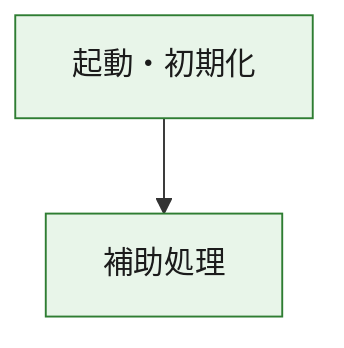
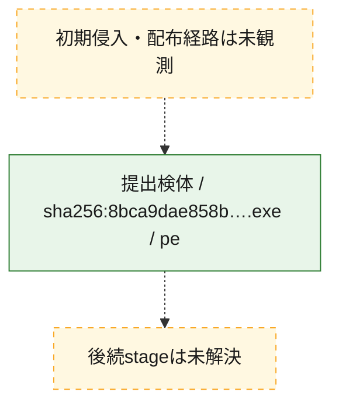
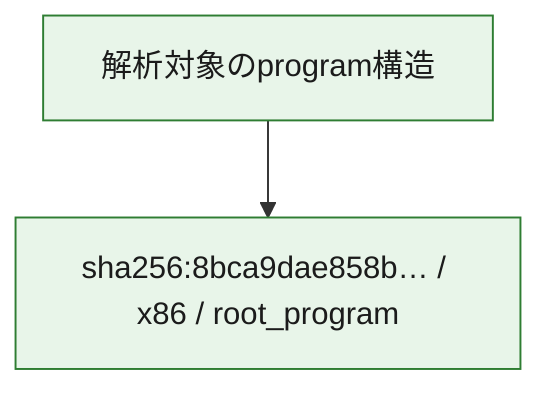

# 全体ロジック：8bca9dae858b5f859dfe7e2b196d9abf874ab6c2cc99ae2fdb645d8efba54ccb

代表関数の静的証跡から、起動・初期化の処理群を確認しました。

## 読み方

- phaseの掲載順は解析上の整理順です。observed_call_edgesがない段階間の実行順を断定しません。
- 図の実線は静的に観測した関係、点線と黄色のノードは未観測・未解決の関係を示します。
- 図は静的な要約であり、動的実行を再現するものではありません。
- 詳細な関数解説とfingerprintは[STATIC-LOGIC.md](STATIC-LOGIC.md)を参照してください。

## 静的可視化

### 実行フロー

### 感染チェーン

### モジュール関係

## 処理段階

### 1. 起動・初期化

entry pointから初期化と後続処理への移行を確認します。
確度: `confirmed_static_function_evidence`

- `8bca9dae858b5f859dfe7e2b196d9abf874ab6c2cc99ae2fdb645d8efba54ccb:ghidra:180001010` — 初期化と主要処理への分岐を行う入口関数です。 状態: `succeeded`、選定理由: `entry_point`, `meaningful_symbol_name`, `reviewed_call_centrality:22`, `role:entrypoint`, `small_program_complete_context`

### 2. 補助処理

主要処理を支える一般内部関数またはlibrary処理を確認します。
確度: `confirmed_static_function_evidence`

- `8bca9dae858b5f859dfe7e2b196d9abf874ab6c2cc99ae2fdb645d8efba54ccb:ghidra:180001240` — 検体内部の一般処理を実装する関数です。 状態: `succeeded`、選定理由: `context_representative`, `reviewed_call_centrality:2`, `small_program_complete_context`
- `8bca9dae858b5f859dfe7e2b196d9abf874ab6c2cc99ae2fdb645d8efba54ccb:ghidra:180001350` — 検体内部の一般処理を実装する関数です。 状態: `succeeded`、選定理由: `context_representative`, `reviewed_call_centrality:25`, `small_program_complete_context`
- `8bca9dae858b5f859dfe7e2b196d9abf874ab6c2cc99ae2fdb645d8efba54ccb:ghidra:180003780` — 検体内部の一般処理を実装する関数です。 状態: `succeeded`、選定理由: `context_representative`, `reviewed_call_centrality:2`, `small_program_complete_context`
- `8bca9dae858b5f859dfe7e2b196d9abf874ab6c2cc99ae2fdb645d8efba54ccb:ghidra:1800038e0` — 検体内部の一般処理を実装する関数です。 状態: `succeeded`、選定理由: `context_representative`, `reviewed_call_centrality:2`, `small_program_complete_context`

## 観測したcall関係

- `8bca9dae858b5f859dfe7e2b196d9abf874ab6c2cc99ae2fdb645d8efba54ccb:ghidra:180001010` → `8bca9dae858b5f859dfe7e2b196d9abf874ab6c2cc99ae2fdb645d8efba54ccb:ghidra:180001240` （`startup` → `support`）
- `8bca9dae858b5f859dfe7e2b196d9abf874ab6c2cc99ae2fdb645d8efba54ccb:ghidra:180001010` → `8bca9dae858b5f859dfe7e2b196d9abf874ab6c2cc99ae2fdb645d8efba54ccb:ghidra:180001350` （`startup` → `support`）
- `8bca9dae858b5f859dfe7e2b196d9abf874ab6c2cc99ae2fdb645d8efba54ccb:ghidra:180001350` → `8bca9dae858b5f859dfe7e2b196d9abf874ab6c2cc99ae2fdb645d8efba54ccb:ghidra:180001240` （`support` → `support`）
- `8bca9dae858b5f859dfe7e2b196d9abf874ab6c2cc99ae2fdb645d8efba54ccb:ghidra:180001350` → `8bca9dae858b5f859dfe7e2b196d9abf874ab6c2cc99ae2fdb645d8efba54ccb:ghidra:180003780` （`support` → `support`）
- `8bca9dae858b5f859dfe7e2b196d9abf874ab6c2cc99ae2fdb645d8efba54ccb:ghidra:180001350` → `8bca9dae858b5f859dfe7e2b196d9abf874ab6c2cc99ae2fdb645d8efba54ccb:ghidra:1800038e0` （`support` → `support`）
- `8bca9dae858b5f859dfe7e2b196d9abf874ab6c2cc99ae2fdb645d8efba54ccb:ghidra:180003780` → `8bca9dae858b5f859dfe7e2b196d9abf874ab6c2cc99ae2fdb645d8efba54ccb:ghidra:1800038e0` （`support` → `support`）
- `ghidra-function:7faa1a121be2378ff93c669a` → `ghidra-function:d91df4e35cb796b9e969e245` （`unclassified` → `unclassified`）
- `ghidra-function:d6ab9bd3d44f6c74ef2baf1d` → `ghidra-function:1a49aff4919d6a18598d2bec` （`unclassified` → `unclassified`）
- `ghidra-function:d6ab9bd3d44f6c74ef2baf1d` → `ghidra-function:2b5c4b54b38bf919bb175e49` （`unclassified` → `unclassified`）
- `ghidra-function:d6ab9bd3d44f6c74ef2baf1d` → `ghidra-function:30077f68f1f5c0a95a1215ce` （`unclassified` → `unclassified`）
- `ghidra-function:d6ab9bd3d44f6c74ef2baf1d` → `ghidra-function:42606ed331de54042e6cd6d3` （`unclassified` → `unclassified`）
- `ghidra-function:d6ab9bd3d44f6c74ef2baf1d` → `ghidra-function:9475cf9b4c429ac03fe71972` （`unclassified` → `unclassified`）
- `ghidra-function:d6ab9bd3d44f6c74ef2baf1d` → `ghidra-function:a7d44b268c38d9d8e58f9e56` （`unclassified` → `unclassified`）
- `ghidra-function:d6ab9bd3d44f6c74ef2baf1d` → `ghidra-function:ad49d65bc7cc6984052a2216` （`unclassified` → `unclassified`）
- `ghidra-function:d6ab9bd3d44f6c74ef2baf1d` → `ghidra-function:ad6e45e160337f6b67a76828` （`unclassified` → `unclassified`）
- `ghidra-function:d6ab9bd3d44f6c74ef2baf1d` → `ghidra-function:d6a5a1865958a3282454fd4a` （`unclassified` → `unclassified`）
- `ghidra-function:d6ab9bd3d44f6c74ef2baf1d` → `ghidra-function:d7840e4ede4ca0e4d7bda06a` （`unclassified` → `unclassified`）
- `ghidra-function:d6ab9bd3d44f6c74ef2baf1d` → `ghidra-function:dbcd6a00d46ee79009366aac` （`unclassified` → `unclassified`）
- `ghidra-function:d6ab9bd3d44f6c74ef2baf1d` → `ghidra-function:dbdd5896cff3bbeeeeef6cb2` （`unclassified` → `unclassified`）
- `ghidra-function:dbcd6a00d46ee79009366aac` → `ghidra-external:1937953c9e6452a73e7feb66` （`unclassified` → `unclassified`）
- `ghidra-function:dbcd6a00d46ee79009366aac` → `ghidra-external:44c52645aa15248c7c437c87` （`unclassified` → `unclassified`）
- `ghidra-function:dbcd6a00d46ee79009366aac` → `ghidra-external:500c2e7b3df038da55b1811d` （`unclassified` → `unclassified`）
- `ghidra-function:dbcd6a00d46ee79009366aac` → `ghidra-external:625c33919cb5b13716cea59c` （`unclassified` → `unclassified`）
- `ghidra-function:dbcd6a00d46ee79009366aac` → `ghidra-external:6911664389d9daec1b8ca87d` （`unclassified` → `unclassified`）
- `ghidra-function:dbcd6a00d46ee79009366aac` → `ghidra-external:6d57103b378304ff3e7cab3a` （`unclassified` → `unclassified`）
- `ghidra-function:dbcd6a00d46ee79009366aac` → `ghidra-external:6fe006d53c6947e35c051b24` （`unclassified` → `unclassified`）
- `ghidra-function:dbcd6a00d46ee79009366aac` → `ghidra-external:750e6733b5efa8e6ffcb997c` （`unclassified` → `unclassified`）
- `ghidra-function:dbcd6a00d46ee79009366aac` → `ghidra-external:7e454850d31594e9d036d8cd` （`unclassified` → `unclassified`）
- `ghidra-function:dbcd6a00d46ee79009366aac` → `ghidra-external:8047bca862d6fd37c5b3ba1a` （`unclassified` → `unclassified`）
- `ghidra-function:dbcd6a00d46ee79009366aac` → `ghidra-external:82f4859fbc34ee3250602a59` （`unclassified` → `unclassified`）
- `ghidra-function:dbcd6a00d46ee79009366aac` → `ghidra-external:89b046d4590deb8a83b4977c` （`unclassified` → `unclassified`）
- `ghidra-function:dbcd6a00d46ee79009366aac` → `ghidra-external:a3bb9315b6509d522e8362bf` （`unclassified` → `unclassified`）
- `ghidra-function:dbcd6a00d46ee79009366aac` → `ghidra-external:b124c15f059a79666c8e9732` （`unclassified` → `unclassified`）
- `ghidra-function:dbcd6a00d46ee79009366aac` → `ghidra-external:c1b25111d6e2e87feac8f270` （`unclassified` → `unclassified`）
- `ghidra-function:dbcd6a00d46ee79009366aac` → `ghidra-external:c280f0869038897ebe5783bf` （`unclassified` → `unclassified`）
- `ghidra-function:dbcd6a00d46ee79009366aac` → `ghidra-external:c5b94fae4ca28c62b7a7f44c` （`unclassified` → `unclassified`）
- `ghidra-function:dbcd6a00d46ee79009366aac` → `ghidra-external:dc5608b86d179777200ffc81` （`unclassified` → `unclassified`）
- `ghidra-function:dbcd6a00d46ee79009366aac` → `ghidra-external:e5a63e6529c5f47575b73c8c` （`unclassified` → `unclassified`）
- `ghidra-function:dbcd6a00d46ee79009366aac` → `ghidra-external:e853ee1e64188dfe2644c570` （`unclassified` → `unclassified`）
- `ghidra-function:dbcd6a00d46ee79009366aac` → `ghidra-external:eeabab90463f0755c7b99471` （`unclassified` → `unclassified`）
- `ghidra-function:dbcd6a00d46ee79009366aac` → `ghidra-function:7faa1a121be2378ff93c669a` （`unclassified` → `unclassified`）
- `ghidra-function:dbcd6a00d46ee79009366aac` → `ghidra-function:d91df4e35cb796b9e969e245` （`unclassified` → `unclassified`）
- `ghidra-function:dbcd6a00d46ee79009366aac` → `ghidra-function:dbdd5896cff3bbeeeeef6cb2` （`unclassified` → `unclassified`）

## 解析範囲と制約

- 選定外関数は全体inventoryへ残しますが、関数本体の個別解説対象にはしていません。
- indirect call、難読化、packer、VM、壊れたcontrol flowによりcall関係が欠落する場合があります。
- 文書は静的解析に基づき、検体実行や外部通信による動的確認は行っていません。
