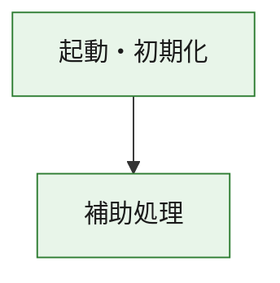
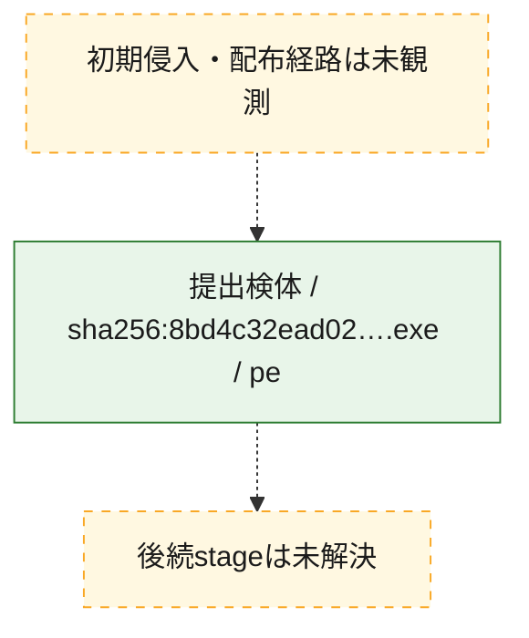
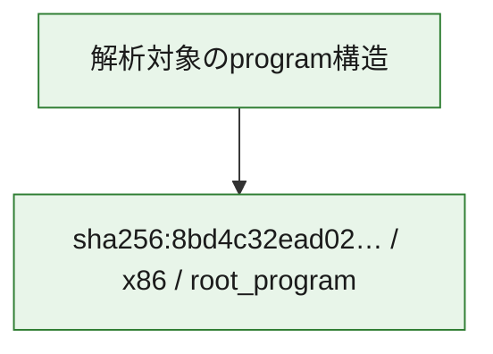

# 全体ロジック：8bd4c32ead02a8e67b9d5d73a22f08e1e610fdce823071d64d645d81e60efaea

代表関数の静的証跡から、起動・初期化の処理群を確認しました。

## 読み方

- phaseの掲載順は解析上の整理順です。observed_call_edgesがない段階間の実行順を断定しません。
- 図の実線は静的に観測した関係、点線と黄色のノードは未観測・未解決の関係を示します。
- 図は静的な要約であり、動的実行を再現するものではありません。
- 詳細な関数解説とfingerprintは[STATIC-LOGIC.md](STATIC-LOGIC.md)を参照してください。

## 静的可視化

### 実行フロー

### 感染チェーン

### モジュール関係

## 処理段階

### 1. 起動・初期化

entry pointから初期化と後続処理への移行を確認します。
確度: `confirmed_static_function_evidence`

- `8bd4c32ead02a8e67b9d5d73a22f08e1e610fdce823071d64d645d81e60efaea:ghidra:180001010` — 初期化と主要処理への分岐を行う入口関数です。 状態: `succeeded`、選定理由: `entry_point`, `meaningful_symbol_name`, `reviewed_call_centrality:22`, `role:entrypoint`, `small_program_complete_context`

### 2. 補助処理

主要処理を支える一般内部関数またはlibrary処理を確認します。
確度: `confirmed_static_function_evidence`

- `8bd4c32ead02a8e67b9d5d73a22f08e1e610fdce823071d64d645d81e60efaea:ghidra:180001240` — 検体内部の一般処理を実装する関数です。 状態: `succeeded`、選定理由: `context_representative`, `reviewed_call_centrality:2`, `small_program_complete_context`
- `8bd4c32ead02a8e67b9d5d73a22f08e1e610fdce823071d64d645d81e60efaea:ghidra:180001350` — 検体内部の一般処理を実装する関数です。 状態: `succeeded`、選定理由: `context_representative`, `reviewed_call_centrality:25`, `small_program_complete_context`
- `8bd4c32ead02a8e67b9d5d73a22f08e1e610fdce823071d64d645d81e60efaea:ghidra:180003780` — 検体内部の一般処理を実装する関数です。 状態: `succeeded`、選定理由: `context_representative`, `reviewed_call_centrality:2`, `small_program_complete_context`
- `8bd4c32ead02a8e67b9d5d73a22f08e1e610fdce823071d64d645d81e60efaea:ghidra:1800038e0` — 検体内部の一般処理を実装する関数です。 状態: `succeeded`、選定理由: `context_representative`, `reviewed_call_centrality:2`, `small_program_complete_context`

## 観測したcall関係

- `8bd4c32ead02a8e67b9d5d73a22f08e1e610fdce823071d64d645d81e60efaea:ghidra:180001010` → `8bd4c32ead02a8e67b9d5d73a22f08e1e610fdce823071d64d645d81e60efaea:ghidra:180001240` （`startup` → `support`）
- `8bd4c32ead02a8e67b9d5d73a22f08e1e610fdce823071d64d645d81e60efaea:ghidra:180001010` → `8bd4c32ead02a8e67b9d5d73a22f08e1e610fdce823071d64d645d81e60efaea:ghidra:180001350` （`startup` → `support`）
- `8bd4c32ead02a8e67b9d5d73a22f08e1e610fdce823071d64d645d81e60efaea:ghidra:180001350` → `8bd4c32ead02a8e67b9d5d73a22f08e1e610fdce823071d64d645d81e60efaea:ghidra:180001240` （`support` → `support`）
- `8bd4c32ead02a8e67b9d5d73a22f08e1e610fdce823071d64d645d81e60efaea:ghidra:180001350` → `8bd4c32ead02a8e67b9d5d73a22f08e1e610fdce823071d64d645d81e60efaea:ghidra:180003780` （`support` → `support`）
- `8bd4c32ead02a8e67b9d5d73a22f08e1e610fdce823071d64d645d81e60efaea:ghidra:180001350` → `8bd4c32ead02a8e67b9d5d73a22f08e1e610fdce823071d64d645d81e60efaea:ghidra:1800038e0` （`support` → `support`）
- `8bd4c32ead02a8e67b9d5d73a22f08e1e610fdce823071d64d645d81e60efaea:ghidra:180003780` → `8bd4c32ead02a8e67b9d5d73a22f08e1e610fdce823071d64d645d81e60efaea:ghidra:1800038e0` （`support` → `support`）
- `ghidra-function:4b20317fe82050393e6a1db7` → `ghidra-function:2869e0f1d95c722e24e016ba` （`unclassified` → `unclassified`）
- `ghidra-function:4b20317fe82050393e6a1db7` → `ghidra-function:2913f4c636df9394a6aee7a5` （`unclassified` → `unclassified`）
- `ghidra-function:4b20317fe82050393e6a1db7` → `ghidra-function:50d53daaec1525a41944debb` （`unclassified` → `unclassified`）
- `ghidra-function:4b20317fe82050393e6a1db7` → `ghidra-function:59140b882971534f0fe3d426` （`unclassified` → `unclassified`）
- `ghidra-function:4b20317fe82050393e6a1db7` → `ghidra-function:60b8c807715ead41ead89da1` （`unclassified` → `unclassified`）
- `ghidra-function:4b20317fe82050393e6a1db7` → `ghidra-function:6c9e3039997d9d816d1ecf87` （`unclassified` → `unclassified`）
- `ghidra-function:4b20317fe82050393e6a1db7` → `ghidra-function:87112fd4e571b1d0f804bdd5` （`unclassified` → `unclassified`）
- `ghidra-function:4b20317fe82050393e6a1db7` → `ghidra-function:8b5cd000a5f477f27fb0f8c5` （`unclassified` → `unclassified`）
- `ghidra-function:4b20317fe82050393e6a1db7` → `ghidra-function:8df154b58679227616e81018` （`unclassified` → `unclassified`）
- `ghidra-function:4b20317fe82050393e6a1db7` → `ghidra-function:93cc370f3f54921c5dc80fda` （`unclassified` → `unclassified`）
- `ghidra-function:4b20317fe82050393e6a1db7` → `ghidra-function:aa0f60a00a896c2e2c8cb854` （`unclassified` → `unclassified`）
- `ghidra-function:4b20317fe82050393e6a1db7` → `ghidra-function:af1f778cd0d34f7c0304552f` （`unclassified` → `unclassified`）
- `ghidra-function:87112fd4e571b1d0f804bdd5` → `ghidra-external:03b5b9d559ea5de30b78d86b` （`unclassified` → `unclassified`）
- `ghidra-function:87112fd4e571b1d0f804bdd5` → `ghidra-external:10af7c78df81fa881b0f2fab` （`unclassified` → `unclassified`）
- `ghidra-function:87112fd4e571b1d0f804bdd5` → `ghidra-external:22399bb1bbf32fc266cac812` （`unclassified` → `unclassified`）
- `ghidra-function:87112fd4e571b1d0f804bdd5` → `ghidra-external:24e81402202e8576497470e9` （`unclassified` → `unclassified`）
- `ghidra-function:87112fd4e571b1d0f804bdd5` → `ghidra-external:2871928dbdb1c44c8e0bfd71` （`unclassified` → `unclassified`）
- `ghidra-function:87112fd4e571b1d0f804bdd5` → `ghidra-external:3e085e55757c0d673073ef3e` （`unclassified` → `unclassified`）
- `ghidra-function:87112fd4e571b1d0f804bdd5` → `ghidra-external:3fbcaa96a5ac8bd286e797de` （`unclassified` → `unclassified`）
- `ghidra-function:87112fd4e571b1d0f804bdd5` → `ghidra-external:44d080539e81ca1fb24032c3` （`unclassified` → `unclassified`）
- `ghidra-function:87112fd4e571b1d0f804bdd5` → `ghidra-external:478d8b417b68f87c490cc1d5` （`unclassified` → `unclassified`）
- `ghidra-function:87112fd4e571b1d0f804bdd5` → `ghidra-external:5547819a8232c5bf9ef523d7` （`unclassified` → `unclassified`）
- `ghidra-function:87112fd4e571b1d0f804bdd5` → `ghidra-external:6200d8da074f8162cc900c5f` （`unclassified` → `unclassified`）
- `ghidra-function:87112fd4e571b1d0f804bdd5` → `ghidra-external:6fb0ee8fd0c8ec758c3c8663` （`unclassified` → `unclassified`）
- `ghidra-function:87112fd4e571b1d0f804bdd5` → `ghidra-external:72036e805b3e128c9a3a2f7c` （`unclassified` → `unclassified`）
- `ghidra-function:87112fd4e571b1d0f804bdd5` → `ghidra-external:7a7646a25f2a2ce1871b5f4a` （`unclassified` → `unclassified`）
- `ghidra-function:87112fd4e571b1d0f804bdd5` → `ghidra-external:a6fe41831ed74f440ce8821a` （`unclassified` → `unclassified`）
- `ghidra-function:87112fd4e571b1d0f804bdd5` → `ghidra-external:aaff936cc80a159796909007` （`unclassified` → `unclassified`）
- `ghidra-function:87112fd4e571b1d0f804bdd5` → `ghidra-external:b56601c334728937e014df95` （`unclassified` → `unclassified`）
- `ghidra-function:87112fd4e571b1d0f804bdd5` → `ghidra-external:bea11a0a7705ab061f274962` （`unclassified` → `unclassified`）
- `ghidra-function:87112fd4e571b1d0f804bdd5` → `ghidra-external:c211e87c94c43f591d124899` （`unclassified` → `unclassified`）
- `ghidra-function:87112fd4e571b1d0f804bdd5` → `ghidra-external:d0503124909d07d81bd182cb` （`unclassified` → `unclassified`）
- `ghidra-function:87112fd4e571b1d0f804bdd5` → `ghidra-external:e2db52e75812957429f17d53` （`unclassified` → `unclassified`）
- `ghidra-function:87112fd4e571b1d0f804bdd5` → `ghidra-function:50d53daaec1525a41944debb` （`unclassified` → `unclassified`）
- `ghidra-function:87112fd4e571b1d0f804bdd5` → `ghidra-function:747ac31267007f0d029f6ec1` （`unclassified` → `unclassified`）
- `ghidra-function:87112fd4e571b1d0f804bdd5` → `ghidra-function:99c923660e229289b828579c` （`unclassified` → `unclassified`）
- `ghidra-function:99c923660e229289b828579c` → `ghidra-function:747ac31267007f0d029f6ec1` （`unclassified` → `unclassified`）

## 解析範囲と制約

- 選定外関数は全体inventoryへ残しますが、関数本体の個別解説対象にはしていません。
- indirect call、難読化、packer、VM、壊れたcontrol flowによりcall関係が欠落する場合があります。
- 文書は静的解析に基づき、検体実行や外部通信による動的確認は行っていません。
