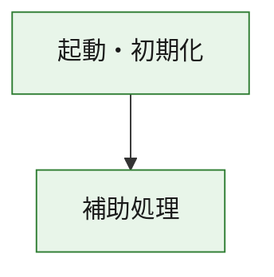
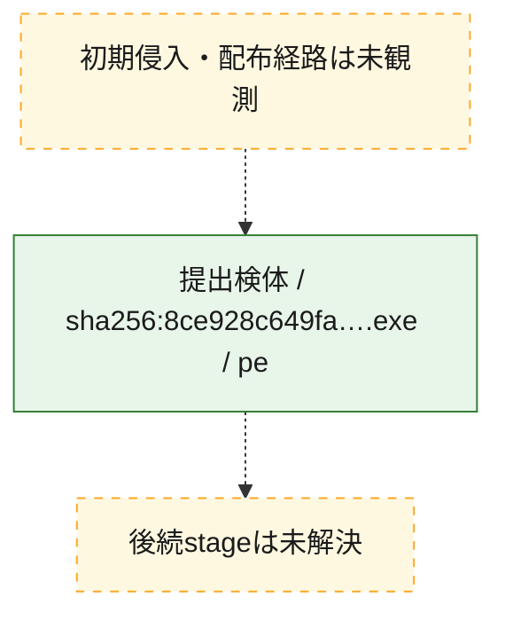
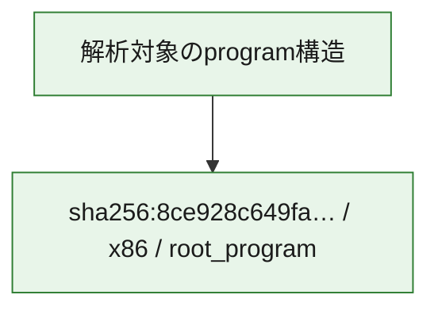

# 全体ロジック：8ce928c649fa4fc2d6ec086db294504613f9067c26048d74b81628d52f6b6c8f

代表関数の静的証跡から、起動・初期化の処理群を確認しました。

## 読み方

- phaseの掲載順は解析上の整理順です。observed_call_edgesがない段階間の実行順を断定しません。
- 図の実線は静的に観測した関係、点線と黄色のノードは未観測・未解決の関係を示します。
- 図は静的な要約であり、動的実行を再現するものではありません。
- 詳細な関数解説とfingerprintは[STATIC-LOGIC.md](STATIC-LOGIC.md)を参照してください。

## 静的可視化

### 実行フロー

### 感染チェーン

### モジュール関係

## 処理段階

### 1. 起動・初期化

entry pointから初期化と後続処理への移行を確認します。
確度: `confirmed_static_function_evidence`

- `8ce928c649fa4fc2d6ec086db294504613f9067c26048d74b81628d52f6b6c8f:ghidra:180001010` — 初期化と主要処理への分岐を行う入口関数です。 状態: `succeeded`、選定理由: `entry_point`, `meaningful_symbol_name`, `reviewed_call_centrality:22`, `role:entrypoint`, `small_program_complete_context`

### 2. 補助処理

主要処理を支える一般内部関数またはlibrary処理を確認します。
確度: `confirmed_static_function_evidence`

- `8ce928c649fa4fc2d6ec086db294504613f9067c26048d74b81628d52f6b6c8f:ghidra:180001240` — 検体内部の一般処理を実装する関数です。 状態: `succeeded`、選定理由: `context_representative`, `reviewed_call_centrality:2`, `small_program_complete_context`
- `8ce928c649fa4fc2d6ec086db294504613f9067c26048d74b81628d52f6b6c8f:ghidra:180001350` — 検体内部の一般処理を実装する関数です。 状態: `succeeded`、選定理由: `context_representative`, `reviewed_call_centrality:25`, `small_program_complete_context`
- `8ce928c649fa4fc2d6ec086db294504613f9067c26048d74b81628d52f6b6c8f:ghidra:180003780` — 検体内部の一般処理を実装する関数です。 状態: `succeeded`、選定理由: `context_representative`, `reviewed_call_centrality:2`, `small_program_complete_context`
- `8ce928c649fa4fc2d6ec086db294504613f9067c26048d74b81628d52f6b6c8f:ghidra:1800038e0` — 検体内部の一般処理を実装する関数です。 状態: `succeeded`、選定理由: `context_representative`, `reviewed_call_centrality:2`, `small_program_complete_context`

## 観測したcall関係

- `8ce928c649fa4fc2d6ec086db294504613f9067c26048d74b81628d52f6b6c8f:ghidra:180001010` → `8ce928c649fa4fc2d6ec086db294504613f9067c26048d74b81628d52f6b6c8f:ghidra:180001240` （`startup` → `support`）
- `8ce928c649fa4fc2d6ec086db294504613f9067c26048d74b81628d52f6b6c8f:ghidra:180001010` → `8ce928c649fa4fc2d6ec086db294504613f9067c26048d74b81628d52f6b6c8f:ghidra:180001350` （`startup` → `support`）
- `8ce928c649fa4fc2d6ec086db294504613f9067c26048d74b81628d52f6b6c8f:ghidra:180001350` → `8ce928c649fa4fc2d6ec086db294504613f9067c26048d74b81628d52f6b6c8f:ghidra:180001240` （`support` → `support`）
- `8ce928c649fa4fc2d6ec086db294504613f9067c26048d74b81628d52f6b6c8f:ghidra:180001350` → `8ce928c649fa4fc2d6ec086db294504613f9067c26048d74b81628d52f6b6c8f:ghidra:180003780` （`support` → `support`）
- `8ce928c649fa4fc2d6ec086db294504613f9067c26048d74b81628d52f6b6c8f:ghidra:180001350` → `8ce928c649fa4fc2d6ec086db294504613f9067c26048d74b81628d52f6b6c8f:ghidra:1800038e0` （`support` → `support`）
- `8ce928c649fa4fc2d6ec086db294504613f9067c26048d74b81628d52f6b6c8f:ghidra:180003780` → `8ce928c649fa4fc2d6ec086db294504613f9067c26048d74b81628d52f6b6c8f:ghidra:1800038e0` （`support` → `support`）
- `ghidra-function:09c6997ea20a9545bc929d64` → `ghidra-function:bb3bb13ba3b7bae0f90b2130` （`unclassified` → `unclassified`）
- `ghidra-function:4c8ceb3cef22ebd51b807a70` → `ghidra-function:1725f8fb47f0eb086d805d64` （`unclassified` → `unclassified`）
- `ghidra-function:4c8ceb3cef22ebd51b807a70` → `ghidra-function:2b247822e1ea1ca4a2fec3e5` （`unclassified` → `unclassified`）
- `ghidra-function:4c8ceb3cef22ebd51b807a70` → `ghidra-function:2f2146a0dbb937662f0baa77` （`unclassified` → `unclassified`）
- `ghidra-function:4c8ceb3cef22ebd51b807a70` → `ghidra-function:65a1efeadd94bb03989600a9` （`unclassified` → `unclassified`）
- `ghidra-function:4c8ceb3cef22ebd51b807a70` → `ghidra-function:8d7980038ba2b3574a7b0412` （`unclassified` → `unclassified`）
- `ghidra-function:4c8ceb3cef22ebd51b807a70` → `ghidra-function:ac7c4257ec28f3aa2de6ba20` （`unclassified` → `unclassified`）
- `ghidra-function:4c8ceb3cef22ebd51b807a70` → `ghidra-function:c3319ce3fabb161983d7336f` （`unclassified` → `unclassified`）
- `ghidra-function:4c8ceb3cef22ebd51b807a70` → `ghidra-function:c6f5c387d0a01ea7d4b3b072` （`unclassified` → `unclassified`）
- `ghidra-function:4c8ceb3cef22ebd51b807a70` → `ghidra-function:c968653583174ffb5ccb8b61` （`unclassified` → `unclassified`）
- `ghidra-function:4c8ceb3cef22ebd51b807a70` → `ghidra-function:d4d0ee23d0cc322469c83e02` （`unclassified` → `unclassified`）
- `ghidra-function:4c8ceb3cef22ebd51b807a70` → `ghidra-function:e04c6072e97cbf175bb5d8e8` （`unclassified` → `unclassified`）
- `ghidra-function:4c8ceb3cef22ebd51b807a70` → `ghidra-function:e6a314e1096733e632c87ad1` （`unclassified` → `unclassified`）
- `ghidra-function:8d7980038ba2b3574a7b0412` → `ghidra-external:1390d1fd69f8a45657875dc5` （`unclassified` → `unclassified`）
- `ghidra-function:8d7980038ba2b3574a7b0412` → `ghidra-external:2056da74b2562c693fc0373b` （`unclassified` → `unclassified`）
- `ghidra-function:8d7980038ba2b3574a7b0412` → `ghidra-external:3b4d128bce5e6384d09e3d69` （`unclassified` → `unclassified`）
- `ghidra-function:8d7980038ba2b3574a7b0412` → `ghidra-external:4b36f23e354a132c3fe9e830` （`unclassified` → `unclassified`）
- `ghidra-function:8d7980038ba2b3574a7b0412` → `ghidra-external:5cb94664cab38bbf8497f351` （`unclassified` → `unclassified`）
- `ghidra-function:8d7980038ba2b3574a7b0412` → `ghidra-external:6334888f98e4d38e6d850bf8` （`unclassified` → `unclassified`）
- `ghidra-function:8d7980038ba2b3574a7b0412` → `ghidra-external:6b329c1ce751f4b14c648f3a` （`unclassified` → `unclassified`）
- `ghidra-function:8d7980038ba2b3574a7b0412` → `ghidra-external:7901f1fbf7894b2e3d5a90a5` （`unclassified` → `unclassified`）
- `ghidra-function:8d7980038ba2b3574a7b0412` → `ghidra-external:7b90007e6d4e31dbfbe5f8f6` （`unclassified` → `unclassified`）
- `ghidra-function:8d7980038ba2b3574a7b0412` → `ghidra-external:7de17ca7a25112d6db1f270a` （`unclassified` → `unclassified`）
- `ghidra-function:8d7980038ba2b3574a7b0412` → `ghidra-external:824cca2bee71f6cc688d53e8` （`unclassified` → `unclassified`）
- `ghidra-function:8d7980038ba2b3574a7b0412` → `ghidra-external:84f4f1eb9ccd91a9db57b404` （`unclassified` → `unclassified`）
- `ghidra-function:8d7980038ba2b3574a7b0412` → `ghidra-external:9d708b2d2e7079adadd712fd` （`unclassified` → `unclassified`）
- `ghidra-function:8d7980038ba2b3574a7b0412` → `ghidra-external:a8f74b63660c53b6a7aa81aa` （`unclassified` → `unclassified`）
- `ghidra-function:8d7980038ba2b3574a7b0412` → `ghidra-external:c064d69b150eb19caff0b766` （`unclassified` → `unclassified`）
- `ghidra-function:8d7980038ba2b3574a7b0412` → `ghidra-external:ce36763ebfa3459177a733c2` （`unclassified` → `unclassified`）
- `ghidra-function:8d7980038ba2b3574a7b0412` → `ghidra-external:de66f9ffc33875e8149608f5` （`unclassified` → `unclassified`）
- `ghidra-function:8d7980038ba2b3574a7b0412` → `ghidra-external:de942600182033c9005fcd70` （`unclassified` → `unclassified`）
- `ghidra-function:8d7980038ba2b3574a7b0412` → `ghidra-external:e5ac625ad80c358b90b65d3b` （`unclassified` → `unclassified`）
- `ghidra-function:8d7980038ba2b3574a7b0412` → `ghidra-external:ecfed410b1ac501854ad7ccd` （`unclassified` → `unclassified`）
- `ghidra-function:8d7980038ba2b3574a7b0412` → `ghidra-external:ff2c99c9b372cd0ee3ceccc0` （`unclassified` → `unclassified`）
- `ghidra-function:8d7980038ba2b3574a7b0412` → `ghidra-function:09c6997ea20a9545bc929d64` （`unclassified` → `unclassified`）
- `ghidra-function:8d7980038ba2b3574a7b0412` → `ghidra-function:bb3bb13ba3b7bae0f90b2130` （`unclassified` → `unclassified`）
- `ghidra-function:8d7980038ba2b3574a7b0412` → `ghidra-function:c3319ce3fabb161983d7336f` （`unclassified` → `unclassified`）

## 解析範囲と制約

- 選定外関数は全体inventoryへ残しますが、関数本体の個別解説対象にはしていません。
- indirect call、難読化、packer、VM、壊れたcontrol flowによりcall関係が欠落する場合があります。
- 文書は静的解析に基づき、検体実行や外部通信による動的確認は行っていません。
