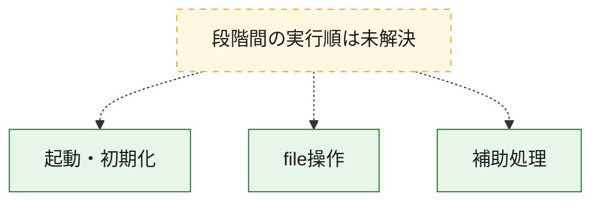
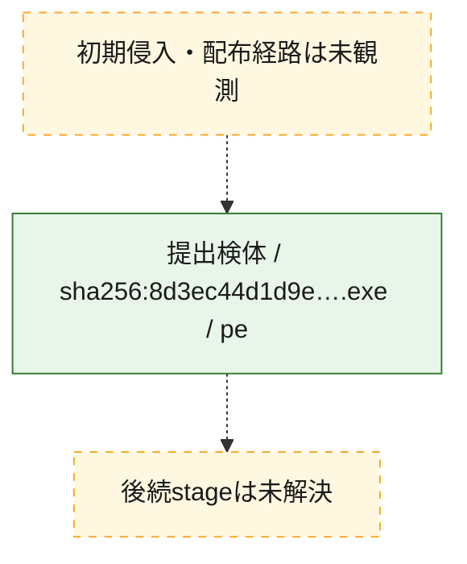
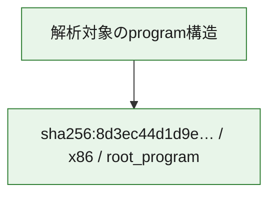

# 全体ロジック：8d3ec44d1d9e8b5e0ce534c639d071b41356d0b153dcc399d03d34284fd4e555

代表関数の静的証跡から、起動・初期化、file操作の処理群を確認しました。

## 読み方

- phaseの掲載順は解析上の整理順です。observed_call_edgesがない段階間の実行順を断定しません。
- 図の実線は静的に観測した関係、点線と黄色のノードは未観測・未解決の関係を示します。
- 図は静的な要約であり、動的実行を再現するものではありません。
- 詳細な関数解説とfingerprintは[STATIC-LOGIC.md](STATIC-LOGIC.md)を参照してください。

## 静的可視化

### 実行フロー

### 感染チェーン

### モジュール関係

## 処理段階

### 1. 起動・初期化

entry pointから初期化と後続処理への移行を確認します。
確度: `confirmed_static_function_evidence`

- `8d3ec44d1d9e8b5e0ce534c639d071b41356d0b153dcc399d03d34284fd4e555:ghidra:140016e00` — 初期化と主要処理への分岐を行う入口関数です。 状態: `succeeded`、選定理由: `entry_point`, `meaningful_symbol_name`, `reviewed_call_centrality:21`, `role:entrypoint`

### 2. file操作

fileやdirectoryの作成、読書き、削除を確認します。
確度: `confirmed_static_function_evidence`

- `8d3ec44d1d9e8b5e0ce534c639d071b41356d0b153dcc399d03d34284fd4e555:ghidra:140001000` — fileまたはdirectoryの読書き・管理に関係する関数です。 状態: `succeeded`、選定理由: `context_representative`, `reviewed_call_centrality:4`, `role:file_operation`
- `8d3ec44d1d9e8b5e0ce534c639d071b41356d0b153dcc399d03d34284fd4e555:ghidra:1400010b0` — fileまたはdirectoryの読書き・管理に関係する関数です。 状態: `succeeded`、選定理由: `context_representative`, `reviewed_call_centrality:4`, `role:file_operation`

### 3. 補助処理

主要処理を支える一般内部関数またはlibrary処理を確認します。
確度: `confirmed_static_function_evidence`

- `8d3ec44d1d9e8b5e0ce534c639d071b41356d0b153dcc399d03d34284fd4e555:ghidra:1400012e0` — 検体内部の一般処理を実装する関数です。 状態: `succeeded`、選定理由: `context_representative`, `reviewed_call_centrality:16`
- `8d3ec44d1d9e8b5e0ce534c639d071b41356d0b153dcc399d03d34284fd4e555:ghidra:1400013c0` — 検体内部の一般処理を実装する関数です。 状態: `succeeded`、選定理由: `context_representative`, `reviewed_call_centrality:6`
- `8d3ec44d1d9e8b5e0ce534c639d071b41356d0b153dcc399d03d34284fd4e555:ghidra:1400014d0` — 検体内部の一般処理を実装する関数です。 状態: `succeeded`、選定理由: `context_representative`, `reviewed_call_centrality:7`
- `8d3ec44d1d9e8b5e0ce534c639d071b41356d0b153dcc399d03d34284fd4e555:ghidra:140001640` — 検体内部の一般処理を実装する関数です。 状態: `succeeded`、選定理由: `context_representative`, `reviewed_call_centrality:1`
- `8d3ec44d1d9e8b5e0ce534c639d071b41356d0b153dcc399d03d34284fd4e555:ghidra:140001660` — 検体内部の一般処理を実装する関数です。 状態: `succeeded`、選定理由: `context_representative`, `reviewed_call_centrality:3`
- `8d3ec44d1d9e8b5e0ce534c639d071b41356d0b153dcc399d03d34284fd4e555:ghidra:140001910` — 検体内部の一般処理を実装する関数です。 状態: `succeeded`、選定理由: `context_representative`, `reviewed_call_centrality:1`
- `8d3ec44d1d9e8b5e0ce534c639d071b41356d0b153dcc399d03d34284fd4e555:ghidra:140001940` — 検体内部の一般処理を実装する関数です。 状態: `succeeded`、選定理由: `context_representative`, `reviewed_call_centrality:3`
- `8d3ec44d1d9e8b5e0ce534c639d071b41356d0b153dcc399d03d34284fd4e555:ghidra:1400019a0` — 検体内部の一般処理を実装する関数です。 状態: `succeeded`、選定理由: `context_representative`, `reviewed_call_centrality:9`
- `8d3ec44d1d9e8b5e0ce534c639d071b41356d0b153dcc399d03d34284fd4e555:ghidra:140001a00` — 検体内部の一般処理を実装する関数です。 状態: `succeeded`、選定理由: `context_representative`
- `8d3ec44d1d9e8b5e0ce534c639d071b41356d0b153dcc399d03d34284fd4e555:ghidra:140001a20` — 検体内部の一般処理を実装する関数です。 状態: `succeeded`、選定理由: `context_representative`, `reviewed_call_centrality:1`
- `8d3ec44d1d9e8b5e0ce534c639d071b41356d0b153dcc399d03d34284fd4e555:ghidra:140001a40` — 検体内部の一般処理を実装する関数です。 状態: `succeeded`、選定理由: `context_representative`, `reviewed_call_centrality:2`
- `8d3ec44d1d9e8b5e0ce534c639d071b41356d0b153dcc399d03d34284fd4e555:ghidra:140001a70` — 検体内部の一般処理を実装する関数です。 状態: `succeeded`、選定理由: `context_representative`, `reviewed_call_centrality:3`
- `8d3ec44d1d9e8b5e0ce534c639d071b41356d0b153dcc399d03d34284fd4e555:ghidra:140001ab0` — 検体内部の一般処理を実装する関数です。 状態: `succeeded`、選定理由: `context_representative`, `reviewed_call_centrality:1`
- `8d3ec44d1d9e8b5e0ce534c639d071b41356d0b153dcc399d03d34284fd4e555:ghidra:140001af0` — 検体内部の一般処理を実装する関数です。 状態: `succeeded`、選定理由: `context_representative`, `reviewed_call_centrality:3`
- `8d3ec44d1d9e8b5e0ce534c639d071b41356d0b153dcc399d03d34284fd4e555:ghidra:140001ee0` — 検体内部の一般処理を実装する関数です。 状態: `succeeded`、選定理由: `context_representative`, `reviewed_call_centrality:3`
- `8d3ec44d1d9e8b5e0ce534c639d071b41356d0b153dcc399d03d34284fd4e555:ghidra:140001f40` — 検体内部の一般処理を実装する関数です。 状態: `succeeded`、選定理由: `context_representative`, `reviewed_call_centrality:1`
- `8d3ec44d1d9e8b5e0ce534c639d071b41356d0b153dcc399d03d34284fd4e555:ghidra:140001fd0` — 検体内部の一般処理を実装する関数です。 状態: `succeeded`、選定理由: `context_representative`, `reviewed_call_centrality:1`
- `8d3ec44d1d9e8b5e0ce534c639d071b41356d0b153dcc399d03d34284fd4e555:ghidra:140002060` — 検体内部の一般処理を実装する関数です。 状態: `succeeded`、選定理由: `context_representative`, `reviewed_call_centrality:2`
- `8d3ec44d1d9e8b5e0ce534c639d071b41356d0b153dcc399d03d34284fd4e555:ghidra:140002110` — 検体内部の一般処理を実装する関数です。 状態: `succeeded`、選定理由: `context_representative`, `reviewed_call_centrality:1`
- `8d3ec44d1d9e8b5e0ce534c639d071b41356d0b153dcc399d03d34284fd4e555:ghidra:1400021b0` — 検体内部の一般処理を実装する関数です。 状態: `succeeded`、選定理由: `context_representative`, `reviewed_call_centrality:2`
- `8d3ec44d1d9e8b5e0ce534c639d071b41356d0b153dcc399d03d34284fd4e555:ghidra:140002200` — 検体内部の一般処理を実装する関数です。 状態: `succeeded`、選定理由: `context_representative`, `reviewed_call_centrality:6`
- `8d3ec44d1d9e8b5e0ce534c639d071b41356d0b153dcc399d03d34284fd4e555:ghidra:140002290` — 検体内部の一般処理を実装する関数です。 状態: `succeeded`、選定理由: `context_representative`, `reviewed_call_centrality:8`
- `8d3ec44d1d9e8b5e0ce534c639d071b41356d0b153dcc399d03d34284fd4e555:ghidra:1400023e0` — 検体内部の一般処理を実装する関数です。 状態: `succeeded`、選定理由: `context_representative`, `reviewed_call_centrality:3`
- `8d3ec44d1d9e8b5e0ce534c639d071b41356d0b153dcc399d03d34284fd4e555:ghidra:1400024b0` — 検体内部の一般処理を実装する関数です。 状態: `succeeded`、選定理由: `context_representative`, `reviewed_call_centrality:2`
- `8d3ec44d1d9e8b5e0ce534c639d071b41356d0b153dcc399d03d34284fd4e555:ghidra:140002510` — 検体内部の一般処理を実装する関数です。 状態: `succeeded`、選定理由: `meaningful_symbol_name`
- `8d3ec44d1d9e8b5e0ce534c639d071b41356d0b153dcc399d03d34284fd4e555:ghidra:140002520` — 検体内部の一般処理を実装する関数です。 状態: `succeeded`、選定理由: `context_representative`, `reviewed_call_centrality:3`
- `8d3ec44d1d9e8b5e0ce534c639d071b41356d0b153dcc399d03d34284fd4e555:ghidra:140002800` — 検体内部の一般処理を実装する関数です。 状態: `succeeded`、選定理由: `context_representative`, `reviewed_call_centrality:1`
- `8d3ec44d1d9e8b5e0ce534c639d071b41356d0b153dcc399d03d34284fd4e555:ghidra:140002820` — 検体内部の一般処理を実装する関数です。 状態: `succeeded`、選定理由: `context_representative`, `reviewed_call_centrality:1`
- `8d3ec44d1d9e8b5e0ce534c639d071b41356d0b153dcc399d03d34284fd4e555:ghidra:140016ab0` — compiler生成処理または汎用library処理とみられる関数です。 状態: `succeeded`、選定理由: `entry_point`, `meaningful_symbol_name`, `reviewed_call_centrality:1`

## 観測したcall関係

- 代表関数間で直接解決できた呼出関係はありません。

## 解析範囲と制約

- 選定外関数は全体inventoryへ残しますが、関数本体の個別解説対象にはしていません。
- indirect call、難読化、packer、VM、壊れたcontrol flowによりcall関係が欠落する場合があります。
- 文書は静的解析に基づき、検体実行や外部通信による動的確認は行っていません。
