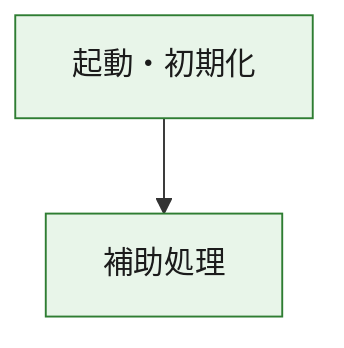
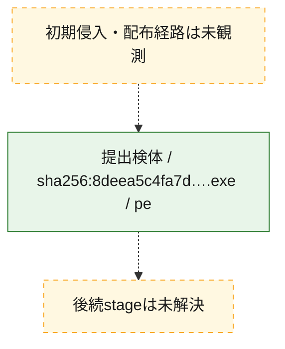
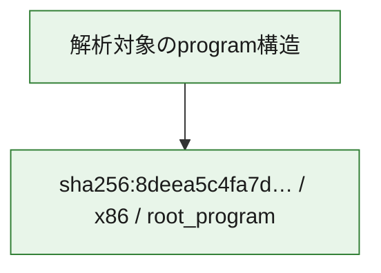

# 全体ロジック：8deea5c4fa7db2cd891a04348cc80465ed78ae836e7d0f9f404603db8a040a1c

代表関数の静的証跡から、起動・初期化の処理群を確認しました。

## 読み方

- phaseの掲載順は解析上の整理順です。observed_call_edgesがない段階間の実行順を断定しません。
- 図の実線は静的に観測した関係、点線と黄色のノードは未観測・未解決の関係を示します。
- 図は静的な要約であり、動的実行を再現するものではありません。
- 詳細な関数解説とfingerprintは[STATIC-LOGIC.md](STATIC-LOGIC.md)を参照してください。

## 静的可視化

### 実行フロー

### 感染チェーン

### モジュール関係

## 処理段階

### 1. 起動・初期化

entry pointから初期化と後続処理への移行を確認します。
確度: `confirmed_static_function_evidence`

- `8deea5c4fa7db2cd891a04348cc80465ed78ae836e7d0f9f404603db8a040a1c:ghidra:180001010` — 初期化と主要処理への分岐を行う入口関数です。 状態: `succeeded`、選定理由: `entry_point`, `meaningful_symbol_name`, `reviewed_call_centrality:22`, `role:entrypoint`, `small_program_complete_context`

### 2. 補助処理

主要処理を支える一般内部関数またはlibrary処理を確認します。
確度: `confirmed_static_function_evidence`

- `8deea5c4fa7db2cd891a04348cc80465ed78ae836e7d0f9f404603db8a040a1c:ghidra:180001240` — 検体内部の一般処理を実装する関数です。 状態: `succeeded`、選定理由: `context_representative`, `reviewed_call_centrality:2`, `small_program_complete_context`
- `8deea5c4fa7db2cd891a04348cc80465ed78ae836e7d0f9f404603db8a040a1c:ghidra:180001350` — 検体内部の一般処理を実装する関数です。 状態: `succeeded`、選定理由: `context_representative`, `reviewed_call_centrality:25`, `small_program_complete_context`
- `8deea5c4fa7db2cd891a04348cc80465ed78ae836e7d0f9f404603db8a040a1c:ghidra:180003780` — 検体内部の一般処理を実装する関数です。 状態: `succeeded`、選定理由: `context_representative`, `reviewed_call_centrality:2`, `small_program_complete_context`
- `8deea5c4fa7db2cd891a04348cc80465ed78ae836e7d0f9f404603db8a040a1c:ghidra:1800038e0` — 検体内部の一般処理を実装する関数です。 状態: `succeeded`、選定理由: `context_representative`, `reviewed_call_centrality:2`, `small_program_complete_context`

## 観測したcall関係

- `8deea5c4fa7db2cd891a04348cc80465ed78ae836e7d0f9f404603db8a040a1c:ghidra:180001010` → `8deea5c4fa7db2cd891a04348cc80465ed78ae836e7d0f9f404603db8a040a1c:ghidra:180001240` （`startup` → `support`）
- `8deea5c4fa7db2cd891a04348cc80465ed78ae836e7d0f9f404603db8a040a1c:ghidra:180001010` → `8deea5c4fa7db2cd891a04348cc80465ed78ae836e7d0f9f404603db8a040a1c:ghidra:180001350` （`startup` → `support`）
- `8deea5c4fa7db2cd891a04348cc80465ed78ae836e7d0f9f404603db8a040a1c:ghidra:180001350` → `8deea5c4fa7db2cd891a04348cc80465ed78ae836e7d0f9f404603db8a040a1c:ghidra:180001240` （`support` → `support`）
- `8deea5c4fa7db2cd891a04348cc80465ed78ae836e7d0f9f404603db8a040a1c:ghidra:180001350` → `8deea5c4fa7db2cd891a04348cc80465ed78ae836e7d0f9f404603db8a040a1c:ghidra:180003780` （`support` → `support`）
- `8deea5c4fa7db2cd891a04348cc80465ed78ae836e7d0f9f404603db8a040a1c:ghidra:180001350` → `8deea5c4fa7db2cd891a04348cc80465ed78ae836e7d0f9f404603db8a040a1c:ghidra:1800038e0` （`support` → `support`）
- `8deea5c4fa7db2cd891a04348cc80465ed78ae836e7d0f9f404603db8a040a1c:ghidra:180003780` → `8deea5c4fa7db2cd891a04348cc80465ed78ae836e7d0f9f404603db8a040a1c:ghidra:1800038e0` （`support` → `support`）
- `ghidra-function:070bafb432663c703ad52c2d` → `ghidra-function:1ec38b6c74d230efd68f0b75` （`unclassified` → `unclassified`）
- `ghidra-function:070bafb432663c703ad52c2d` → `ghidra-function:1efd292d85eff522b6ddc9b7` （`unclassified` → `unclassified`）
- `ghidra-function:070bafb432663c703ad52c2d` → `ghidra-function:1f14097c5034e5a261d4e869` （`unclassified` → `unclassified`）
- `ghidra-function:070bafb432663c703ad52c2d` → `ghidra-function:20a165a46e639144bfa96f22` （`unclassified` → `unclassified`）
- `ghidra-function:070bafb432663c703ad52c2d` → `ghidra-function:35509a050ccf5f8e3ec501d2` （`unclassified` → `unclassified`）
- `ghidra-function:070bafb432663c703ad52c2d` → `ghidra-function:393555f42fe878ede81e166d` （`unclassified` → `unclassified`）
- `ghidra-function:070bafb432663c703ad52c2d` → `ghidra-function:3df7dd3cd91f29513cbb3eed` （`unclassified` → `unclassified`）
- `ghidra-function:070bafb432663c703ad52c2d` → `ghidra-function:5c93d2e00d246fb17cba7dc7` （`unclassified` → `unclassified`）
- `ghidra-function:070bafb432663c703ad52c2d` → `ghidra-function:7a11c8ac97cdbf9ac80b83a0` （`unclassified` → `unclassified`）
- `ghidra-function:070bafb432663c703ad52c2d` → `ghidra-function:9ba3816b0d4688b35c59ac90` （`unclassified` → `unclassified`）
- `ghidra-function:070bafb432663c703ad52c2d` → `ghidra-function:b48623a4b268f393144a5289` （`unclassified` → `unclassified`）
- `ghidra-function:070bafb432663c703ad52c2d` → `ghidra-function:dc1282e78778c5f218a95ee6` （`unclassified` → `unclassified`）
- `ghidra-function:184a233edc127c9fe83d8c87` → `ghidra-function:f58f4db079f3c54cb7425f77` （`unclassified` → `unclassified`）
- `ghidra-function:3df7dd3cd91f29513cbb3eed` → `ghidra-external:05bae76b052c918d987749a2` （`unclassified` → `unclassified`）
- `ghidra-function:3df7dd3cd91f29513cbb3eed` → `ghidra-external:423e09195899892bda1176cf` （`unclassified` → `unclassified`）
- `ghidra-function:3df7dd3cd91f29513cbb3eed` → `ghidra-external:438b7f081619260d0311a05c` （`unclassified` → `unclassified`）
- `ghidra-function:3df7dd3cd91f29513cbb3eed` → `ghidra-external:53d478394e6ea0849142606b` （`unclassified` → `unclassified`）
- `ghidra-function:3df7dd3cd91f29513cbb3eed` → `ghidra-external:583782bd442f227298bfb61f` （`unclassified` → `unclassified`）
- `ghidra-function:3df7dd3cd91f29513cbb3eed` → `ghidra-external:5a3c18b3a39b2d4966607bee` （`unclassified` → `unclassified`）
- `ghidra-function:3df7dd3cd91f29513cbb3eed` → `ghidra-external:5a9688ac195d4d612d3075bd` （`unclassified` → `unclassified`）
- `ghidra-function:3df7dd3cd91f29513cbb3eed` → `ghidra-external:5b8ab92dc34076f705a4b136` （`unclassified` → `unclassified`）
- `ghidra-function:3df7dd3cd91f29513cbb3eed` → `ghidra-external:6a3ba7863825a63e5208a4ca` （`unclassified` → `unclassified`）
- `ghidra-function:3df7dd3cd91f29513cbb3eed` → `ghidra-external:9248232aecf7c4e261145f86` （`unclassified` → `unclassified`）
- `ghidra-function:3df7dd3cd91f29513cbb3eed` → `ghidra-external:937474b1bcebe61f355b8816` （`unclassified` → `unclassified`）
- `ghidra-function:3df7dd3cd91f29513cbb3eed` → `ghidra-external:9599fbf96a929d20d5d379b3` （`unclassified` → `unclassified`）
- `ghidra-function:3df7dd3cd91f29513cbb3eed` → `ghidra-external:97ac3794c2038351a796752b` （`unclassified` → `unclassified`）
- `ghidra-function:3df7dd3cd91f29513cbb3eed` → `ghidra-external:ad7fb50be20bed99f8b2a315` （`unclassified` → `unclassified`）
- `ghidra-function:3df7dd3cd91f29513cbb3eed` → `ghidra-external:aefc28133cbe7e765decbefb` （`unclassified` → `unclassified`）
- `ghidra-function:3df7dd3cd91f29513cbb3eed` → `ghidra-external:b382b694bd61f3e4764168ef` （`unclassified` → `unclassified`）
- `ghidra-function:3df7dd3cd91f29513cbb3eed` → `ghidra-external:b51b205c09934f9ca75ec0db` （`unclassified` → `unclassified`）
- `ghidra-function:3df7dd3cd91f29513cbb3eed` → `ghidra-external:b936bbd22ed697919d22e933` （`unclassified` → `unclassified`）
- `ghidra-function:3df7dd3cd91f29513cbb3eed` → `ghidra-external:f0b76db8ddf5ce55602e07fd` （`unclassified` → `unclassified`）
- `ghidra-function:3df7dd3cd91f29513cbb3eed` → `ghidra-external:f23aa4f6d4a09d378dd4ba47` （`unclassified` → `unclassified`）
- `ghidra-function:3df7dd3cd91f29513cbb3eed` → `ghidra-external:f2e9e153102a9d68f5893dce` （`unclassified` → `unclassified`）
- `ghidra-function:3df7dd3cd91f29513cbb3eed` → `ghidra-function:184a233edc127c9fe83d8c87` （`unclassified` → `unclassified`）
- `ghidra-function:3df7dd3cd91f29513cbb3eed` → `ghidra-function:1f14097c5034e5a261d4e869` （`unclassified` → `unclassified`）
- `ghidra-function:3df7dd3cd91f29513cbb3eed` → `ghidra-function:f58f4db079f3c54cb7425f77` （`unclassified` → `unclassified`）

## 解析範囲と制約

- 選定外関数は全体inventoryへ残しますが、関数本体の個別解説対象にはしていません。
- indirect call、難読化、packer、VM、壊れたcontrol flowによりcall関係が欠落する場合があります。
- 文書は静的解析に基づき、検体実行や外部通信による動的確認は行っていません。
