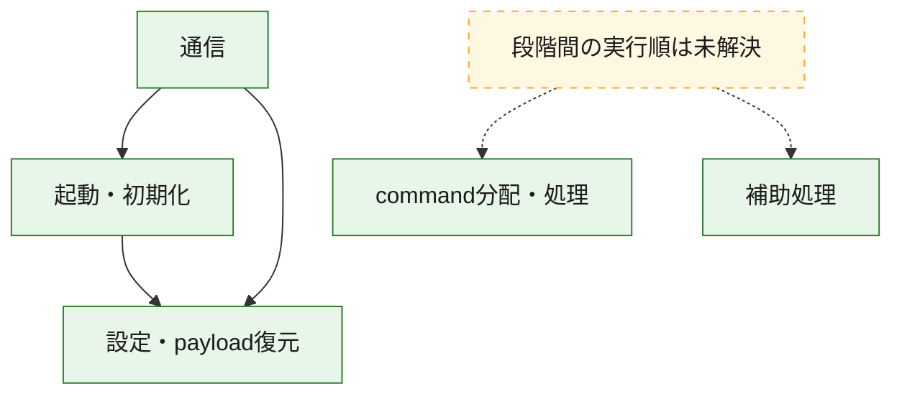
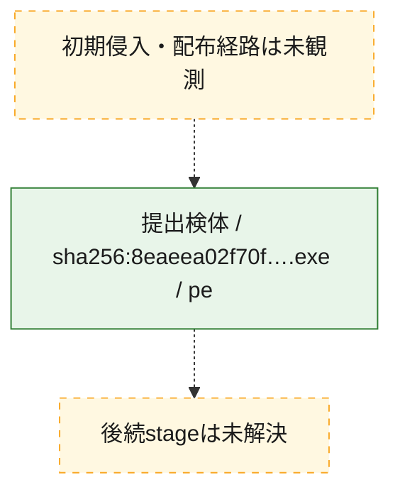
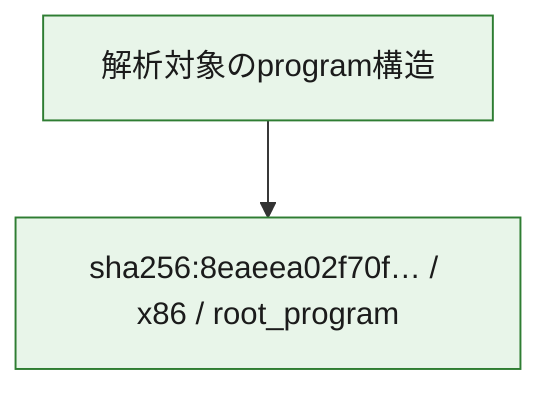

# 全体ロジック：8eaeea02f70fa219e4d887ec921ca1cce4283f40256f5920db2d8dbb895c2aec

代表関数の静的証跡から、起動・初期化、設定・payload復元、通信、command分配・処理の処理群を確認しました。

## 読み方

- phaseの掲載順は解析上の整理順です。observed_call_edgesがない段階間の実行順を断定しません。
- 図の実線は静的に観測した関係、点線と黄色のノードは未観測・未解決の関係を示します。
- 図は静的な要約であり、動的実行を再現するものではありません。
- 詳細な関数解説とfingerprintは[STATIC-LOGIC.md](STATIC-LOGIC.md)を参照してください。

## 静的可視化

### 実行フロー

### 感染チェーン

### モジュール関係

## 処理段階

### 1. 起動・初期化

entry pointから初期化と後続処理への移行を確認します。
確度: `confirmed_static_function_evidence`

- `8eaeea02f70fa219e4d887ec921ca1cce4283f40256f5920db2d8dbb895c2aec:ghidra:140009bb7` — 初期化と主要処理への分岐を行う入口関数です。 状態: `succeeded`、選定理由: `entry_point`, `meaningful_symbol_name`, `reviewed_call_centrality:7`, `role:entrypoint`
- `8eaeea02f70fa219e4d887ec921ca1cce4283f40256f5920db2d8dbb895c2aec:ghidra:140011210` — 初期化と主要処理への分岐を行う入口関数です。 状態: `succeeded`、選定理由: `entry_point`, `meaningful_symbol_name`, `probable_go_main_user_code`, `reviewed_call_centrality:23`, `role:entrypoint`

### 2. 設定・payload復元

設定、resource、payload、暗号化データの復元・変換を確認します。
確度: `confirmed_static_function_evidence`

- `8eaeea02f70fa219e4d887ec921ca1cce4283f40256f5920db2d8dbb895c2aec:ghidra:1400016e1` — 設定、resource、payloadなどの解析・変換を行う関数です。 状態: `succeeded`、選定理由: `meaningful_symbol_name`, `reviewed_call_centrality:1`, `role:config_or_data_transform`
- `8eaeea02f70fa219e4d887ec921ca1cce4283f40256f5920db2d8dbb895c2aec:ghidra:140001c94` — 設定、resource、payloadなどの解析・変換を行う関数です。 状態: `succeeded`、選定理由: `meaningful_symbol_name`, `reviewed_call_centrality:1`, `role:config_or_data_transform`
- `8eaeea02f70fa219e4d887ec921ca1cce4283f40256f5920db2d8dbb895c2aec:ghidra:1400022ae` — 暗号、hash、encoding、または復号処理に関係する関数です。 状態: `succeeded`、選定理由: `meaningful_symbol_name`, `reviewed_call_centrality:4`, `role:cryptographic_transform`
- `8eaeea02f70fa219e4d887ec921ca1cce4283f40256f5920db2d8dbb895c2aec:ghidra:140002ecc` — 暗号、hash、encoding、または復号処理に関係する関数です。 状態: `succeeded`、選定理由: `meaningful_symbol_name`, `reviewed_call_centrality:4`, `role:cryptographic_transform`
- `8eaeea02f70fa219e4d887ec921ca1cce4283f40256f5920db2d8dbb895c2aec:ghidra:140002fb6` — 暗号、hash、encoding、または復号処理に関係する関数です。 状態: `succeeded`、選定理由: `meaningful_symbol_name`, `reviewed_call_centrality:12`, `role:cryptographic_transform`
- `8eaeea02f70fa219e4d887ec921ca1cce4283f40256f5920db2d8dbb895c2aec:ghidra:1400031e9` — 設定、resource、payloadなどの解析・変換を行う関数です。 状態: `succeeded`、選定理由: `meaningful_symbol_name`, `reviewed_call_centrality:13`, `role:config_or_data_transform`
- `8eaeea02f70fa219e4d887ec921ca1cce4283f40256f5920db2d8dbb895c2aec:ghidra:140003c95` — 設定、resource、payloadなどの解析・変換を行う関数です。 状態: `succeeded`、選定理由: `meaningful_symbol_name`, `reviewed_call_centrality:1`, `role:config_or_data_transform`
- `8eaeea02f70fa219e4d887ec921ca1cce4283f40256f5920db2d8dbb895c2aec:ghidra:140005261` — 設定、resource、payloadなどの解析・変換を行う関数です。 状態: `succeeded`、選定理由: `meaningful_symbol_name`, `reviewed_call_centrality:2`, `role:config_or_data_transform`
- `8eaeea02f70fa219e4d887ec921ca1cce4283f40256f5920db2d8dbb895c2aec:ghidra:140005dfb` — 暗号、hash、encoding、または復号処理に関係する関数です。 状態: `succeeded`、選定理由: `meaningful_symbol_name`, `reviewed_call_centrality:2`, `role:cryptographic_transform`
- `8eaeea02f70fa219e4d887ec921ca1cce4283f40256f5920db2d8dbb895c2aec:ghidra:140005f7d` — 設定、resource、payloadなどの解析・変換を行う関数です。 状態: `succeeded`、選定理由: `meaningful_symbol_name`, `reviewed_call_centrality:12`, `role:config_or_data_transform`
- `8eaeea02f70fa219e4d887ec921ca1cce4283f40256f5920db2d8dbb895c2aec:ghidra:1400064c3` — 設定、resource、payloadなどの解析・変換を行う関数です。 状態: `succeeded`、選定理由: `meaningful_symbol_name`, `reviewed_call_centrality:9`, `role:config_or_data_transform`
- `8eaeea02f70fa219e4d887ec921ca1cce4283f40256f5920db2d8dbb895c2aec:ghidra:140008307` — 設定、resource、payloadなどの解析・変換を行う関数です。 状態: `succeeded`、選定理由: `meaningful_symbol_name`, `reviewed_call_centrality:1`, `role:config_or_data_transform`
- `8eaeea02f70fa219e4d887ec921ca1cce4283f40256f5920db2d8dbb895c2aec:ghidra:14000a76a` — 設定、resource、payloadなどの解析・変換を行う関数です。 状態: `succeeded`、選定理由: `meaningful_symbol_name`, `reviewed_call_centrality:7`, `role:config_or_data_transform`

### 3. 通信

通信初期化、endpoint処理、送受信の役割を確認します。
確度: `confirmed_static_function_evidence`

- `8eaeea02f70fa219e4d887ec921ca1cce4283f40256f5920db2d8dbb895c2aec:ghidra:140005b93` — 通信初期化、送受信、またはendpoint処理に関係する関数です。 状態: `succeeded`、選定理由: `meaningful_symbol_name`, `reviewed_call_centrality:3`, `role:network_communication`
- `8eaeea02f70fa219e4d887ec921ca1cce4283f40256f5920db2d8dbb895c2aec:ghidra:140006ad1` — 通信初期化、送受信、またはendpoint処理に関係する関数です。 状態: `succeeded`、選定理由: `meaningful_symbol_name`, `reviewed_call_centrality:3`, `role:network_communication`
- `8eaeea02f70fa219e4d887ec921ca1cce4283f40256f5920db2d8dbb895c2aec:ghidra:140007711` — 通信初期化、送受信、またはendpoint処理に関係する関数です。 状態: `succeeded`、選定理由: `meaningful_symbol_name`, `reviewed_call_centrality:3`, `role:network_communication`
- `8eaeea02f70fa219e4d887ec921ca1cce4283f40256f5920db2d8dbb895c2aec:ghidra:1400090f9` — 通信初期化、送受信、またはendpoint処理に関係する関数です。 状態: `succeeded`、選定理由: `meaningful_symbol_name`, `reviewed_call_centrality:20`, `role:network_communication`
- `8eaeea02f70fa219e4d887ec921ca1cce4283f40256f5920db2d8dbb895c2aec:ghidra:140009339` — 通信初期化、送受信、またはendpoint処理に関係する関数です。 状態: `succeeded`、選定理由: `meaningful_symbol_name`, `reviewed_call_centrality:6`, `role:network_communication`
- `8eaeea02f70fa219e4d887ec921ca1cce4283f40256f5920db2d8dbb895c2aec:ghidra:140009696` — 通信初期化、送受信、またはendpoint処理に関係する関数です。 状態: `succeeded`、選定理由: `meaningful_symbol_name`, `reviewed_call_centrality:3`, `role:network_communication`
- `8eaeea02f70fa219e4d887ec921ca1cce4283f40256f5920db2d8dbb895c2aec:ghidra:1400096f5` — 通信初期化、送受信、またはendpoint処理に関係する関数です。 状態: `succeeded`、選定理由: `meaningful_symbol_name`, `reviewed_call_centrality:5`, `role:network_communication`
- `8eaeea02f70fa219e4d887ec921ca1cce4283f40256f5920db2d8dbb895c2aec:ghidra:140009831` — 通信初期化、送受信、またはendpoint処理に関係する関数です。 状態: `succeeded`、選定理由: `meaningful_symbol_name`, `reviewed_call_centrality:10`, `role:network_communication`
- `8eaeea02f70fa219e4d887ec921ca1cce4283f40256f5920db2d8dbb895c2aec:ghidra:140009fa5` — 通信初期化、送受信、またはendpoint処理に関係する関数です。 状態: `succeeded`、選定理由: `meaningful_symbol_name`, `reviewed_call_centrality:3`, `role:network_communication`
- `8eaeea02f70fa219e4d887ec921ca1cce4283f40256f5920db2d8dbb895c2aec:ghidra:14000a099` — 通信初期化、送受信、またはendpoint処理に関係する関数です。 状態: `succeeded`、選定理由: `meaningful_symbol_name`, `reviewed_call_centrality:16`, `role:network_communication`
- `8eaeea02f70fa219e4d887ec921ca1cce4283f40256f5920db2d8dbb895c2aec:ghidra:14000b607` — 通信初期化、送受信、またはendpoint処理に関係する関数です。 状態: `succeeded`、選定理由: `meaningful_symbol_name`, `reviewed_call_centrality:15`, `role:network_communication`
- `8eaeea02f70fa219e4d887ec921ca1cce4283f40256f5920db2d8dbb895c2aec:ghidra:14000b910` — 通信初期化、送受信、またはendpoint処理に関係する関数です。 状態: `succeeded`、選定理由: `meaningful_symbol_name`, `reviewed_call_centrality:12`, `role:network_communication`

### 4. command分配・処理

受信commandやtaskの解釈、分配、個別handlerへの移行を確認します。
確度: `confirmed_static_function_evidence`

- `8eaeea02f70fa219e4d887ec921ca1cce4283f40256f5920db2d8dbb895c2aec:ghidra:14000af49` — commandの解釈、分配、または個別処理を担当する関数です。 状態: `succeeded`、選定理由: `meaningful_symbol_name`, `reviewed_call_centrality:5`, `role:command_dispatch_or_handler`
- `8eaeea02f70fa219e4d887ec921ca1cce4283f40256f5920db2d8dbb895c2aec:ghidra:14000bc5a` — commandの解釈、分配、または個別処理を担当する関数です。 状態: `succeeded`、選定理由: `meaningful_symbol_name`, `reviewed_call_centrality:5`, `role:command_dispatch_or_handler`

### 5. 補助処理

主要処理を支える一般内部関数またはlibrary処理を確認します。
確度: `confirmed_static_function_evidence`

- `8eaeea02f70fa219e4d887ec921ca1cce4283f40256f5920db2d8dbb895c2aec:ghidra:140001410` — 検体内部の一般処理を実装する関数です。 状態: `succeeded`、選定理由: `entry_point`, `meaningful_symbol_name`, `reviewed_call_centrality:1`
- `8eaeea02f70fa219e4d887ec921ca1cce4283f40256f5920db2d8dbb895c2aec:ghidra:140013bc0` — compiler生成処理または汎用library処理とみられる関数です。 状態: `succeeded`、選定理由: `entry_point`, `meaningful_symbol_name`, `reviewed_call_centrality:1`
- `8eaeea02f70fa219e4d887ec921ca1cce4283f40256f5920db2d8dbb895c2aec:ghidra:140013bf0` — compiler生成処理または汎用library処理とみられる関数です。 状態: `succeeded`、選定理由: `entry_point`, `meaningful_symbol_name`, `reviewed_call_centrality:2`

## 観測したcall関係

- `8eaeea02f70fa219e4d887ec921ca1cce4283f40256f5920db2d8dbb895c2aec:ghidra:140002fb6` → `8eaeea02f70fa219e4d887ec921ca1cce4283f40256f5920db2d8dbb895c2aec:ghidra:140002ecc` （`configuration` → `configuration`）
- `8eaeea02f70fa219e4d887ec921ca1cce4283f40256f5920db2d8dbb895c2aec:ghidra:1400031e9` → `8eaeea02f70fa219e4d887ec921ca1cce4283f40256f5920db2d8dbb895c2aec:ghidra:140002ecc` （`configuration` → `configuration`）
- `8eaeea02f70fa219e4d887ec921ca1cce4283f40256f5920db2d8dbb895c2aec:ghidra:140005dfb` → `8eaeea02f70fa219e4d887ec921ca1cce4283f40256f5920db2d8dbb895c2aec:ghidra:1400022ae` （`configuration` → `configuration`）
- `8eaeea02f70fa219e4d887ec921ca1cce4283f40256f5920db2d8dbb895c2aec:ghidra:1400064c3` → `8eaeea02f70fa219e4d887ec921ca1cce4283f40256f5920db2d8dbb895c2aec:ghidra:1400031e9` （`configuration` → `configuration`）
- `8eaeea02f70fa219e4d887ec921ca1cce4283f40256f5920db2d8dbb895c2aec:ghidra:1400064c3` → `8eaeea02f70fa219e4d887ec921ca1cce4283f40256f5920db2d8dbb895c2aec:ghidra:140005f7d` （`configuration` → `configuration`）
- `8eaeea02f70fa219e4d887ec921ca1cce4283f40256f5920db2d8dbb895c2aec:ghidra:140006ad1` → `8eaeea02f70fa219e4d887ec921ca1cce4283f40256f5920db2d8dbb895c2aec:ghidra:140005b93` （`communication` → `communication`）
- `8eaeea02f70fa219e4d887ec921ca1cce4283f40256f5920db2d8dbb895c2aec:ghidra:140009339` → `8eaeea02f70fa219e4d887ec921ca1cce4283f40256f5920db2d8dbb895c2aec:ghidra:1400090f9` （`communication` → `communication`）
- `8eaeea02f70fa219e4d887ec921ca1cce4283f40256f5920db2d8dbb895c2aec:ghidra:140009831` → `8eaeea02f70fa219e4d887ec921ca1cce4283f40256f5920db2d8dbb895c2aec:ghidra:140002fb6` （`communication` → `configuration`）
- `8eaeea02f70fa219e4d887ec921ca1cce4283f40256f5920db2d8dbb895c2aec:ghidra:140009831` → `8eaeea02f70fa219e4d887ec921ca1cce4283f40256f5920db2d8dbb895c2aec:ghidra:140009696` （`communication` → `communication`）
- `8eaeea02f70fa219e4d887ec921ca1cce4283f40256f5920db2d8dbb895c2aec:ghidra:14000a099` → `8eaeea02f70fa219e4d887ec921ca1cce4283f40256f5920db2d8dbb895c2aec:ghidra:140009bb7` （`communication` → `startup`）
- `8eaeea02f70fa219e4d887ec921ca1cce4283f40256f5920db2d8dbb895c2aec:ghidra:14000a099` → `8eaeea02f70fa219e4d887ec921ca1cce4283f40256f5920db2d8dbb895c2aec:ghidra:140009fa5` （`communication` → `communication`）
- `8eaeea02f70fa219e4d887ec921ca1cce4283f40256f5920db2d8dbb895c2aec:ghidra:14000b607` → `8eaeea02f70fa219e4d887ec921ca1cce4283f40256f5920db2d8dbb895c2aec:ghidra:140009339` （`communication` → `communication`）
- `8eaeea02f70fa219e4d887ec921ca1cce4283f40256f5920db2d8dbb895c2aec:ghidra:14000b607` → `8eaeea02f70fa219e4d887ec921ca1cce4283f40256f5920db2d8dbb895c2aec:ghidra:1400096f5` （`communication` → `communication`）
- `8eaeea02f70fa219e4d887ec921ca1cce4283f40256f5920db2d8dbb895c2aec:ghidra:14000b607` → `8eaeea02f70fa219e4d887ec921ca1cce4283f40256f5920db2d8dbb895c2aec:ghidra:140009831` （`communication` → `communication`）
- `8eaeea02f70fa219e4d887ec921ca1cce4283f40256f5920db2d8dbb895c2aec:ghidra:14000b607` → `8eaeea02f70fa219e4d887ec921ca1cce4283f40256f5920db2d8dbb895c2aec:ghidra:14000a099` （`communication` → `communication`）
- `8eaeea02f70fa219e4d887ec921ca1cce4283f40256f5920db2d8dbb895c2aec:ghidra:14000b910` → `8eaeea02f70fa219e4d887ec921ca1cce4283f40256f5920db2d8dbb895c2aec:ghidra:14000a099` （`communication` → `communication`）
- `8eaeea02f70fa219e4d887ec921ca1cce4283f40256f5920db2d8dbb895c2aec:ghidra:14000b910` → `8eaeea02f70fa219e4d887ec921ca1cce4283f40256f5920db2d8dbb895c2aec:ghidra:14000b607` （`communication` → `communication`）
- `8eaeea02f70fa219e4d887ec921ca1cce4283f40256f5920db2d8dbb895c2aec:ghidra:140011210` → `8eaeea02f70fa219e4d887ec921ca1cce4283f40256f5920db2d8dbb895c2aec:ghidra:1400064c3` （`startup` → `configuration`）
- `ghidra-function:145c32eb298fda66d35fecfa` → `ghidra-external:0ff0ade5423bc70b4c4d1915` （`unclassified` → `unclassified`）
- `ghidra-function:145c32eb298fda66d35fecfa` → `ghidra-external:d3fe2e77599d789237af5938` （`unclassified` → `unclassified`）
- `ghidra-function:17571bec546e2efdfb73137d` → `ghidra-external:d0023551af00e17f76ab6e22` （`unclassified` → `unclassified`）
- `ghidra-function:17571bec546e2efdfb73137d` → `ghidra-function:0b7915841d0f58dfa3a52e38` （`unclassified` → `unclassified`）
- `ghidra-function:17571bec546e2efdfb73137d` → `ghidra-function:346cbb413bdde7f896d018d4` （`unclassified` → `unclassified`）
- `ghidra-function:17571bec546e2efdfb73137d` → `ghidra-function:42a55f524b9929cceb290715` （`unclassified` → `unclassified`）
- `ghidra-function:17571bec546e2efdfb73137d` → `ghidra-function:4fcfc03e149e33c0a4c3e05a` （`unclassified` → `unclassified`）
- `ghidra-function:17571bec546e2efdfb73137d` → `ghidra-function:56711f9d266bd3b61e8c0084` （`unclassified` → `unclassified`）
- `ghidra-function:17571bec546e2efdfb73137d` → `ghidra-function:5797747534fb4c41a90d2f76` （`unclassified` → `unclassified`）
- `ghidra-function:17571bec546e2efdfb73137d` → `ghidra-function:8ae09f34ae5706b57087359a` （`unclassified` → `unclassified`）
- `ghidra-function:17571bec546e2efdfb73137d` → `ghidra-function:cc6f572f218507788cd469bb` （`unclassified` → `unclassified`）
- `ghidra-function:22cfa6181aa8592428beb0b9` → `ghidra-external:b88ea1e22950f71e99d22dee` （`unclassified` → `unclassified`）
- `ghidra-function:22cfa6181aa8592428beb0b9` → `ghidra-external:d3fe2e77599d789237af5938` （`unclassified` → `unclassified`）
- `ghidra-function:22cfa6181aa8592428beb0b9` → `ghidra-function:af11d0eff3699778e0461e58` （`unclassified` → `unclassified`）
- `ghidra-function:22cfa6181aa8592428beb0b9` → `ghidra-function:be8df0f161123e0b9cac7290` （`unclassified` → `unclassified`）
- `ghidra-function:22cfa6181aa8592428beb0b9` → `ghidra-function:f8f74328b68d6cbf917161f9` （`unclassified` → `unclassified`）
- `ghidra-function:2566b99403218a9004e5a49c` → `ghidra-function:e89adc296f865a8193afadfc` （`unclassified` → `unclassified`）
- `ghidra-function:2bec27214388a14dadc80372` → `ghidra-function:f2de59d1a84c12a3c6717016` （`unclassified` → `unclassified`）
- `ghidra-function:36ee60a2cd42d93f2e8a5ba6` → `ghidra-external:3b855d3a7733183344b93e39` （`unclassified` → `unclassified`）
- `ghidra-function:36ee60a2cd42d93f2e8a5ba6` → `ghidra-external:d0023551af00e17f76ab6e22` （`unclassified` → `unclassified`）
- `ghidra-function:36ee60a2cd42d93f2e8a5ba6` → `ghidra-external:e00fceb125bd28ea8c798b6e` （`unclassified` → `unclassified`）
- `ghidra-function:36ee60a2cd42d93f2e8a5ba6` → `ghidra-function:13fa949ea637fe697cb9912a` （`unclassified` → `unclassified`）
- `ghidra-function:42a55f524b9929cceb290715` → `ghidra-external:b9a14d67dafa2a10209df870` （`unclassified` → `unclassified`）
- `ghidra-function:42a55f524b9929cceb290715` → `ghidra-function:ab34d69a18ec6292d5b11be7` （`unclassified` → `unclassified`）
- `ghidra-function:4642c81dafb443b7033ca154` → `ghidra-external:d3fe2e77599d789237af5938` （`unclassified` → `unclassified`）
- `ghidra-function:4642c81dafb443b7033ca154` → `ghidra-external:e00fceb125bd28ea8c798b6e` （`unclassified` → `unclassified`）
- `ghidra-function:4642c81dafb443b7033ca154` → `ghidra-function:aef911b8ca50c637c0ae3e96` （`unclassified` → `unclassified`）
- `ghidra-function:49686286b14cf3c3bd7b95f4` → `ghidra-external:b88ea1e22950f71e99d22dee` （`unclassified` → `unclassified`）
- `ghidra-function:49686286b14cf3c3bd7b95f4` → `ghidra-external:d3fe2e77599d789237af5938` （`unclassified` → `unclassified`）
- `ghidra-function:49686286b14cf3c3bd7b95f4` → `ghidra-function:014e5c5be7e410dccece11aa` （`unclassified` → `unclassified`）
- `ghidra-function:49686286b14cf3c3bd7b95f4` → `ghidra-function:af11d0eff3699778e0461e58` （`unclassified` → `unclassified`）
- `ghidra-function:49686286b14cf3c3bd7b95f4` → `ghidra-function:be8df0f161123e0b9cac7290` （`unclassified` → `unclassified`）
- `ghidra-function:4c1061f8ec5dd6f05984772b` → `ghidra-function:49e2bf12e554e2e7f8ce11cc` （`unclassified` → `unclassified`）
- `ghidra-function:4c1061f8ec5dd6f05984772b` → `ghidra-function:bf8907c40d55452c5ca22364` （`unclassified` → `unclassified`）
- `ghidra-function:4c649060a4da6a23d4e178f1` → `ghidra-external:e2f93ff927a0960bdebca14c` （`unclassified` → `unclassified`）
- `ghidra-function:56711f9d266bd3b61e8c0084` → `ghidra-external:0c9df6ad7d62689bb1586547` （`unclassified` → `unclassified`）
- `ghidra-function:56711f9d266bd3b61e8c0084` → `ghidra-external:286671e4a488d0ef649ef514` （`unclassified` → `unclassified`）
- `ghidra-function:56711f9d266bd3b61e8c0084` → `ghidra-external:29db2212b9a40549cad29af1` （`unclassified` → `unclassified`）
- `ghidra-function:56711f9d266bd3b61e8c0084` → `ghidra-external:357c9d11554b35ec28eb1705` （`unclassified` → `unclassified`）
- `ghidra-function:56711f9d266bd3b61e8c0084` → `ghidra-external:e00fceb125bd28ea8c798b6e` （`unclassified` → `unclassified`）
- `ghidra-function:56711f9d266bd3b61e8c0084` → `ghidra-function:2c8d9fdea9aae8b805c90c93` （`unclassified` → `unclassified`）
- `ghidra-function:56711f9d266bd3b61e8c0084` → `ghidra-function:49e2bf12e554e2e7f8ce11cc` （`unclassified` → `unclassified`）
- `ghidra-function:56711f9d266bd3b61e8c0084` → `ghidra-function:4c1061f8ec5dd6f05984772b` （`unclassified` → `unclassified`）
- `ghidra-function:56711f9d266bd3b61e8c0084` → `ghidra-function:88b4b3dc3646f02ca380a95d` （`unclassified` → `unclassified`）
- `ghidra-function:56711f9d266bd3b61e8c0084` → `ghidra-function:bf8907c40d55452c5ca22364` （`unclassified` → `unclassified`）
- `ghidra-function:56711f9d266bd3b61e8c0084` → `ghidra-function:d3da422d0d14b8ddf6f44116` （`unclassified` → `unclassified`）
- `ghidra-function:5fede9b90870a152fb8ae687` → `ghidra-external:2b748bba3697941f81f86da1` （`unclassified` → `unclassified`）
- `ghidra-function:5fede9b90870a152fb8ae687` → `ghidra-function:21090401bc23153f88f48b10` （`unclassified` → `unclassified`）
- `ghidra-function:5fede9b90870a152fb8ae687` → `ghidra-function:2160305559db49c2f729000b` （`unclassified` → `unclassified`）
- `ghidra-function:5fede9b90870a152fb8ae687` → `ghidra-function:9a645b5b47a75c9b8011bbac` （`unclassified` → `unclassified`）
- `ghidra-function:646307d653c339e191517252` → `ghidra-external:0c9df6ad7d62689bb1586547` （`unclassified` → `unclassified`）
- `ghidra-function:646307d653c339e191517252` → `ghidra-external:286671e4a488d0ef649ef514` （`unclassified` → `unclassified`）
- `ghidra-function:646307d653c339e191517252` → `ghidra-external:29db2212b9a40549cad29af1` （`unclassified` → `unclassified`）
- `ghidra-function:646307d653c339e191517252` → `ghidra-external:357c9d11554b35ec28eb1705` （`unclassified` → `unclassified`）
- `ghidra-function:646307d653c339e191517252` → `ghidra-external:d3fe2e77599d789237af5938` （`unclassified` → `unclassified`）
- `ghidra-function:646307d653c339e191517252` → `ghidra-external:e00fceb125bd28ea8c798b6e` （`unclassified` → `unclassified`）
- `ghidra-function:646307d653c339e191517252` → `ghidra-external:efa78e62f59cb536bdf6c7f0` （`unclassified` → `unclassified`）
- `ghidra-function:646307d653c339e191517252` → `ghidra-function:2c8d9fdea9aae8b805c90c93` （`unclassified` → `unclassified`）
- `ghidra-function:646307d653c339e191517252` → `ghidra-function:49e2bf12e554e2e7f8ce11cc` （`unclassified` → `unclassified`）
- `ghidra-function:646307d653c339e191517252` → `ghidra-function:4c1061f8ec5dd6f05984772b` （`unclassified` → `unclassified`）
- `ghidra-function:646307d653c339e191517252` → `ghidra-function:bf8907c40d55452c5ca22364` （`unclassified` → `unclassified`）
- `ghidra-function:646307d653c339e191517252` → `ghidra-function:d3da422d0d14b8ddf6f44116` （`unclassified` → `unclassified`）
- `ghidra-function:6b74655f0000f72694ebf009` → `ghidra-external:9960f4cc9cbcdc0cdb7aebff` （`unclassified` → `unclassified`）
- `ghidra-function:6b74655f0000f72694ebf009` → `ghidra-function:1910e5832782d65d81238754` （`unclassified` → `unclassified`）
- `ghidra-function:6b9f7f67cf65416c49152c78` → `ghidra-function:31d58b27f3094549fdcbeb43` （`unclassified` → `unclassified`）
- `ghidra-function:6b9f7f67cf65416c49152c78` → `ghidra-function:346cbb413bdde7f896d018d4` （`unclassified` → `unclassified`）
- `ghidra-function:6b9f7f67cf65416c49152c78` → `ghidra-function:3dd250d2f3c0ffc9b1bc9a47` （`unclassified` → `unclassified`）
- `ghidra-function:6b9f7f67cf65416c49152c78` → `ghidra-function:4fcfc03e149e33c0a4c3e05a` （`unclassified` → `unclassified`）
- `ghidra-function:6b9f7f67cf65416c49152c78` → `ghidra-function:5797747534fb4c41a90d2f76` （`unclassified` → `unclassified`）
- `ghidra-function:6b9f7f67cf65416c49152c78` → `ghidra-function:87f0ccbb105324b0d62da9c8` （`unclassified` → `unclassified`）
- `ghidra-function:6b9f7f67cf65416c49152c78` → `ghidra-function:8ae09f34ae5706b57087359a` （`unclassified` → `unclassified`）
- `ghidra-function:6b9f7f67cf65416c49152c78` → `ghidra-function:a49a73ec2ace07cbd474abb1` （`unclassified` → `unclassified`）
- `ghidra-function:6b9f7f67cf65416c49152c78` → `ghidra-function:bd723cdca6179e119044b02f` （`unclassified` → `unclassified`）
- `ghidra-function:6b9f7f67cf65416c49152c78` → `ghidra-function:be130d20676654bcda5f170d` （`unclassified` → `unclassified`）
- `ghidra-function:6b9f7f67cf65416c49152c78` → `ghidra-function:bebeb7d05f6d67393b3b0a39` （`unclassified` → `unclassified`）
- `ghidra-function:6b9f7f67cf65416c49152c78` → `ghidra-function:f82f84478e65243262add820` （`unclassified` → `unclassified`）
- `ghidra-function:6bf87a357d7da5943f9de09c` → `ghidra-function:08f88447aa5e46c75f74fece` （`unclassified` → `unclassified`）
- `ghidra-function:6bf87a357d7da5943f9de09c` → `ghidra-function:5da72332e276d99a39cd8eaf` （`unclassified` → `unclassified`）
- `ghidra-function:6bf87a357d7da5943f9de09c` → `ghidra-function:eaa05d563a112c70ac3fbb04` （`unclassified` → `unclassified`）
- `ghidra-function:72b8a2b04b8bd2045b5af41e` → `ghidra-function:1910e5832782d65d81238754` （`unclassified` → `unclassified`）
- `ghidra-function:780e2346e9741a3fd9316c24` → `ghidra-function:463ebc6b754a6b6831c9cccd` （`unclassified` → `unclassified`）
- `ghidra-function:87f0ccbb105324b0d62da9c8` → `ghidra-external:07bb937ee6b28f6196145407` （`unclassified` → `unclassified`）
- `ghidra-function:87f0ccbb105324b0d62da9c8` → `ghidra-external:2b748bba3697941f81f86da1` （`unclassified` → `unclassified`）
- `ghidra-function:87f0ccbb105324b0d62da9c8` → `ghidra-external:9599708a432f8f61f9355182` （`unclassified` → `unclassified`）
- `ghidra-function:87f0ccbb105324b0d62da9c8` → `ghidra-external:bf5748669c59a683c84b096b` （`unclassified` → `unclassified`）
- `ghidra-function:87f0ccbb105324b0d62da9c8` → `ghidra-external:c743829bf3de64c7887bde8d` （`unclassified` → `unclassified`）
- `ghidra-function:87f0ccbb105324b0d62da9c8` → `ghidra-external:d0023551af00e17f76ab6e22` （`unclassified` → `unclassified`）
- `ghidra-function:87f0ccbb105324b0d62da9c8` → `ghidra-external:d3fe2e77599d789237af5938` （`unclassified` → `unclassified`）
- `ghidra-function:87f0ccbb105324b0d62da9c8` → `ghidra-external:e00fceb125bd28ea8c798b6e` （`unclassified` → `unclassified`）
- `ghidra-function:87f0ccbb105324b0d62da9c8` → `ghidra-function:2160305559db49c2f729000b` （`unclassified` → `unclassified`）
- `ghidra-function:87f0ccbb105324b0d62da9c8` → `ghidra-function:741680248827d5628d695837` （`unclassified` → `unclassified`）
- `ghidra-function:87f0ccbb105324b0d62da9c8` → `ghidra-function:7d8f3be7ec5402187b336540` （`unclassified` → `unclassified`）
- `ghidra-function:87f0ccbb105324b0d62da9c8` → `ghidra-function:afa6033cc0f492a557a8a236` （`unclassified` → `unclassified`）
- `ghidra-function:87f0ccbb105324b0d62da9c8` → `ghidra-function:b5b6e167046d50e82bb8a4cc` （`unclassified` → `unclassified`）
- `ghidra-function:8abd9d4fd30c90982e2f0cb5` → `ghidra-function:6bf87a357d7da5943f9de09c` （`unclassified` → `unclassified`）
- `ghidra-function:8abd9d4fd30c90982e2f0cb5` → `ghidra-function:7b87cb14bdb973b5af397dd6` （`unclassified` → `unclassified`）
- `ghidra-function:9476546e6c64d4a3da9bd851` → `ghidra-function:d523c9cae5977cf65193ba41` （`unclassified` → `unclassified`）
- `ghidra-function:9476546e6c64d4a3da9bd851` → `ghidra-function:f9b00aa708a3f671d9e5c77a` （`unclassified` → `unclassified`）
- `ghidra-function:9a645b5b47a75c9b8011bbac` → `ghidra-external:1dea6414b730050c3d1a1fa8` （`unclassified` → `unclassified`）
- `ghidra-function:9a645b5b47a75c9b8011bbac` → `ghidra-external:2b748bba3697941f81f86da1` （`unclassified` → `unclassified`）
- `ghidra-function:9a645b5b47a75c9b8011bbac` → `ghidra-external:787a41ad080f351b3ec7f586` （`unclassified` → `unclassified`）
- `ghidra-function:9a645b5b47a75c9b8011bbac` → `ghidra-external:be5c1b2ba567ec0ed35482f1` （`unclassified` → `unclassified`）
- `ghidra-function:9a645b5b47a75c9b8011bbac` → `ghidra-external:ff3cc8b1731c26f7164398b5` （`unclassified` → `unclassified`）
- `ghidra-function:9a645b5b47a75c9b8011bbac` → `ghidra-function:27e01016d8c767d5cce40cf1` （`unclassified` → `unclassified`）
- `ghidra-function:9a645b5b47a75c9b8011bbac` → `ghidra-function:3008db4e5cfe01673f81039d` （`unclassified` → `unclassified`）
- `ghidra-function:9a645b5b47a75c9b8011bbac` → `ghidra-function:408e1e97d1e193a398c952ae` （`unclassified` → `unclassified`）
- `ghidra-function:9a645b5b47a75c9b8011bbac` → `ghidra-function:44f2e659ac60a50dcc1b34b5` （`unclassified` → `unclassified`）
- `ghidra-function:9a645b5b47a75c9b8011bbac` → `ghidra-function:728a4e2380d3745498625a2d` （`unclassified` → `unclassified`）
- `ghidra-function:9a645b5b47a75c9b8011bbac` → `ghidra-function:c4e2874561798247daee3d0e` （`unclassified` → `unclassified`）
- `ghidra-function:9a645b5b47a75c9b8011bbac` → `ghidra-function:f06569ebc183b661519499f6` （`unclassified` → `unclassified`）
- `ghidra-function:9fe02bcc4ac0c705ae8fc068` → `ghidra-external:2b748bba3697941f81f86da1` （`unclassified` → `unclassified`）
- `ghidra-function:9fe02bcc4ac0c705ae8fc068` → `ghidra-external:9211b52525ba874d1c657f4c` （`unclassified` → `unclassified`）
- `ghidra-function:9fe02bcc4ac0c705ae8fc068` → `ghidra-external:a51a50b81b81f6c3fcd9e48f` （`unclassified` → `unclassified`）
- `ghidra-function:9fe02bcc4ac0c705ae8fc068` → `ghidra-external:b88ea1e22950f71e99d22dee` （`unclassified` → `unclassified`）
- `ghidra-function:9fe02bcc4ac0c705ae8fc068` → `ghidra-external:d3fe2e77599d789237af5938` （`unclassified` → `unclassified`）
- `ghidra-function:9fe02bcc4ac0c705ae8fc068` → `ghidra-function:014e5c5be7e410dccece11aa` （`unclassified` → `unclassified`）
- `ghidra-function:9fe02bcc4ac0c705ae8fc068` → `ghidra-function:7347ea5018e000bad0934d01` （`unclassified` → `unclassified`）
- `ghidra-function:9fe02bcc4ac0c705ae8fc068` → `ghidra-function:af11d0eff3699778e0461e58` （`unclassified` → `unclassified`）
- `ghidra-function:9fe02bcc4ac0c705ae8fc068` → `ghidra-function:be8df0f161123e0b9cac7290` （`unclassified` → `unclassified`）
- `ghidra-function:9fe02bcc4ac0c705ae8fc068` → `ghidra-function:dcb7a4563aa43d6eb546a86c` （`unclassified` → `unclassified`）
- `ghidra-function:9fe02bcc4ac0c705ae8fc068` → `ghidra-function:f8f74328b68d6cbf917161f9` （`unclassified` → `unclassified`）
- `ghidra-function:afa6033cc0f492a557a8a236` → `ghidra-external:be5c1b2ba567ec0ed35482f1` （`unclassified` → `unclassified`）
- `ghidra-function:afa6033cc0f492a557a8a236` → `ghidra-external:d0023551af00e17f76ab6e22` （`unclassified` → `unclassified`）
- `ghidra-function:b1150c68da252387ea0e1111` → `ghidra-external:2b748bba3697941f81f86da1` （`unclassified` → `unclassified`）
- `ghidra-function:b1150c68da252387ea0e1111` → `ghidra-external:9211b52525ba874d1c657f4c` （`unclassified` → `unclassified`）
- `ghidra-function:b1150c68da252387ea0e1111` → `ghidra-external:a51a50b81b81f6c3fcd9e48f` （`unclassified` → `unclassified`）
- `ghidra-function:b1150c68da252387ea0e1111` → `ghidra-external:a8291780c7ddb0c0edfd9524` （`unclassified` → `unclassified`）
- `ghidra-function:b1150c68da252387ea0e1111` → `ghidra-function:07475e69dbcd0142c09265da` （`unclassified` → `unclassified`）
- `ghidra-function:b1150c68da252387ea0e1111` → `ghidra-function:118f0d86d1621d26810d9be4` （`unclassified` → `unclassified`）
- `ghidra-function:b1150c68da252387ea0e1111` → `ghidra-function:1cdddd861b74f88643859ea1` （`unclassified` → `unclassified`）
- `ghidra-function:b1150c68da252387ea0e1111` → `ghidra-function:3e3468a69b80f63047634c22` （`unclassified` → `unclassified`）
- `ghidra-function:b1150c68da252387ea0e1111` → `ghidra-function:40eb11609c092fdde63d84ed` （`unclassified` → `unclassified`）
- `ghidra-function:b1150c68da252387ea0e1111` → `ghidra-function:4112a4bebce9b6b698d7ea01` （`unclassified` → `unclassified`）
- `ghidra-function:b1150c68da252387ea0e1111` → `ghidra-function:6b77e5c778bb446293910e86` （`unclassified` → `unclassified`）
- `ghidra-function:b1150c68da252387ea0e1111` → `ghidra-function:8470d9029d1835de00c63dee` （`unclassified` → `unclassified`）
- `ghidra-function:b1150c68da252387ea0e1111` → `ghidra-function:88b4b3dc3646f02ca380a95d` （`unclassified` → `unclassified`）
- `ghidra-function:b1150c68da252387ea0e1111` → `ghidra-function:8ae09f34ae5706b57087359a` （`unclassified` → `unclassified`）
- `ghidra-function:b1150c68da252387ea0e1111` → `ghidra-function:b9816acb69999038d92c6399` （`unclassified` → `unclassified`）
- `ghidra-function:b1150c68da252387ea0e1111` → `ghidra-function:c19df87a3500068272456fe7` （`unclassified` → `unclassified`）
- `ghidra-function:b1150c68da252387ea0e1111` → `ghidra-function:d91df40b35d01a7f3939c5d4` （`unclassified` → `unclassified`）
- `ghidra-function:b1150c68da252387ea0e1111` → `ghidra-function:ddc47946e12d12d40776afee` （`unclassified` → `unclassified`）
- `ghidra-function:b1150c68da252387ea0e1111` → `ghidra-function:e543d785726162864866f34c` （`unclassified` → `unclassified`）
- `ghidra-function:b1150c68da252387ea0e1111` → `ghidra-function:feddd895beca2284f2037dd9` （`unclassified` → `unclassified`）
- `ghidra-function:b5b6e167046d50e82bb8a4cc` → `ghidra-external:0ff0ade5423bc70b4c4d1915` （`unclassified` → `unclassified`）
- `ghidra-function:b5b6e167046d50e82bb8a4cc` → `ghidra-external:ca136462e021b64f418637fb` （`unclassified` → `unclassified`）
- `ghidra-function:b5b6e167046d50e82bb8a4cc` → `ghidra-external:d3fe2e77599d789237af5938` （`unclassified` → `unclassified`）
- `ghidra-function:b5b6e167046d50e82bb8a4cc` → `ghidra-external:f164a2ccec0a048a01d23f92` （`unclassified` → `unclassified`）
- `ghidra-function:b5b6e167046d50e82bb8a4cc` → `ghidra-function:0d488ad602774d0c2b78d9c9` （`unclassified` → `unclassified`）
- `ghidra-function:b5b6e167046d50e82bb8a4cc` → `ghidra-function:239602ab0075b045d4c3d2bd` （`unclassified` → `unclassified`）
- `ghidra-function:bebeb7d05f6d67393b3b0a39` → `ghidra-external:d0023551af00e17f76ab6e22` （`unclassified` → `unclassified`）
- `ghidra-function:bebeb7d05f6d67393b3b0a39` → `ghidra-function:17571bec546e2efdfb73137d` （`unclassified` → `unclassified`）
- `ghidra-function:bebeb7d05f6d67393b3b0a39` → `ghidra-function:346cbb413bdde7f896d018d4` （`unclassified` → `unclassified`）
- `ghidra-function:bebeb7d05f6d67393b3b0a39` → `ghidra-function:364be6ee20ba0d7d0f652c3e` （`unclassified` → `unclassified`）
- `ghidra-function:bebeb7d05f6d67393b3b0a39` → `ghidra-function:36ee60a2cd42d93f2e8a5ba6` （`unclassified` → `unclassified`）
- `ghidra-function:bebeb7d05f6d67393b3b0a39` → `ghidra-function:4fcfc03e149e33c0a4c3e05a` （`unclassified` → `unclassified`）
- `ghidra-function:bebeb7d05f6d67393b3b0a39` → `ghidra-function:5797747534fb4c41a90d2f76` （`unclassified` → `unclassified`）
- `ghidra-function:bebeb7d05f6d67393b3b0a39` → `ghidra-function:5fede9b90870a152fb8ae687` （`unclassified` → `unclassified`）
- `ghidra-function:bebeb7d05f6d67393b3b0a39` → `ghidra-function:6a78e4c4ab85ba476e956604` （`unclassified` → `unclassified`）
- `ghidra-function:bebeb7d05f6d67393b3b0a39` → `ghidra-function:87f0ccbb105324b0d62da9c8` （`unclassified` → `unclassified`）
- `ghidra-function:bebeb7d05f6d67393b3b0a39` → `ghidra-function:8ae09f34ae5706b57087359a` （`unclassified` → `unclassified`）
- `ghidra-function:bebeb7d05f6d67393b3b0a39` → `ghidra-function:be130d20676654bcda5f170d` （`unclassified` → `unclassified`）
- `ghidra-function:bebeb7d05f6d67393b3b0a39` → `ghidra-function:c4e2874561798247daee3d0e` （`unclassified` → `unclassified`）
- `ghidra-function:c19df87a3500068272456fe7` → `ghidra-external:2b748bba3697941f81f86da1` （`unclassified` → `unclassified`）
- `ghidra-function:c19df87a3500068272456fe7` → `ghidra-external:be5c1b2ba567ec0ed35482f1` （`unclassified` → `unclassified`）
- `ghidra-function:c19df87a3500068272456fe7` → `ghidra-external:d0023551af00e17f76ab6e22` （`unclassified` → `unclassified`）
- `ghidra-function:c19df87a3500068272456fe7` → `ghidra-function:21090401bc23153f88f48b10` （`unclassified` → `unclassified`）
- `ghidra-function:c19df87a3500068272456fe7` → `ghidra-function:2160305559db49c2f729000b` （`unclassified` → `unclassified`）
- `ghidra-function:c19df87a3500068272456fe7` → `ghidra-function:646307d653c339e191517252` （`unclassified` → `unclassified`）
- `ghidra-function:c19df87a3500068272456fe7` → `ghidra-function:9fe02bcc4ac0c705ae8fc068` （`unclassified` → `unclassified`）
- `ghidra-function:d119b251cbc3dba5086277a9` → `ghidra-external:9211b52525ba874d1c657f4c` （`unclassified` → `unclassified`）
- `ghidra-function:d119b251cbc3dba5086277a9` → `ghidra-function:5e6ec26569d5935b2043adeb` （`unclassified` → `unclassified`）
- `ghidra-function:d119b251cbc3dba5086277a9` → `ghidra-function:9476546e6c64d4a3da9bd851` （`unclassified` → `unclassified`）
- `ghidra-function:d2b3c1d4170c700c241b8d9f` → `ghidra-function:b93f34e8ae7aba9bd7e24dc5` （`unclassified` → `unclassified`）
- `ghidra-function:ff88e6ef7333147cf541b41f` → `ghidra-external:1dea6414b730050c3d1a1fa8` （`unclassified` → `unclassified`）
- `ghidra-function:ff88e6ef7333147cf541b41f` → `ghidra-external:2b748bba3697941f81f86da1` （`unclassified` → `unclassified`）
- `ghidra-function:ff88e6ef7333147cf541b41f` → `ghidra-external:3162753341c565d424d7db3d` （`unclassified` → `unclassified`）
- `ghidra-function:ff88e6ef7333147cf541b41f` → `ghidra-external:787a41ad080f351b3ec7f586` （`unclassified` → `unclassified`）
- `ghidra-function:ff88e6ef7333147cf541b41f` → `ghidra-external:d3fe2e77599d789237af5938` （`unclassified` → `unclassified`）
- `ghidra-function:ff88e6ef7333147cf541b41f` → `ghidra-external:e2f93ff927a0960bdebca14c` （`unclassified` → `unclassified`）
- `ghidra-function:ff88e6ef7333147cf541b41f` → `ghidra-external:e890cfea246831da153d2a10` （`unclassified` → `unclassified`）

## 解析範囲と制約

- 選定外関数は全体inventoryへ残しますが、関数本体の個別解説対象にはしていません。
- indirect call、難読化、packer、VM、壊れたcontrol flowによりcall関係が欠落する場合があります。
- 文書は静的解析に基づき、検体実行や外部通信による動的確認は行っていません。
