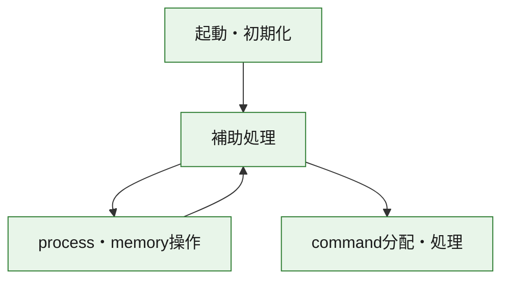
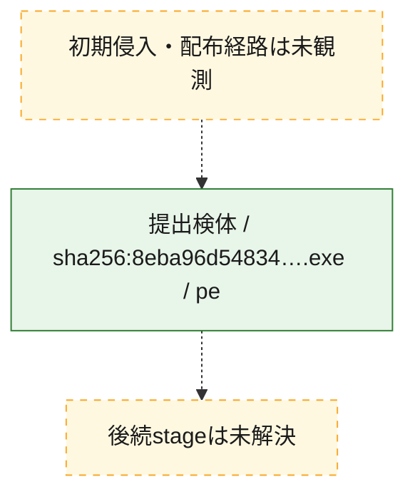
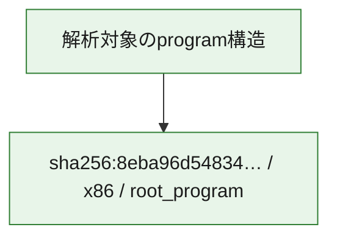

# 全体ロジック：8eba96d54834a8220c57584421bd4eeb506fc316d879368c0026b87c71f77c0d

代表関数の静的証跡から、起動・初期化、process・memory操作、command分配・処理の処理群を確認しました。

## 読み方

- phaseの掲載順は解析上の整理順です。observed_call_edgesがない段階間の実行順を断定しません。
- 図の実線は静的に観測した関係、点線と黄色のノードは未観測・未解決の関係を示します。
- 図は静的な要約であり、動的実行を再現するものではありません。
- 詳細な関数解説とfingerprintは[STATIC-LOGIC.md](STATIC-LOGIC.md)を参照してください。

## 静的可視化

### 実行フロー

### 感染チェーン

### モジュール関係

## 処理段階

### 1. 起動・初期化

entry pointから初期化と後続処理への移行を確認します。
確度: `confirmed_static_function_evidence`

- `8eba96d54834a8220c57584421bd4eeb506fc316d879368c0026b87c71f77c0d:ghidra:180003120` — 初期化と主要処理への分岐を行う入口関数です。 状態: `succeeded`、選定理由: `entry_point`, `meaningful_symbol_name`, `reviewed_call_centrality:5`, `role:entrypoint`

### 2. process・memory操作

process、thread、module、memory操作と実行移行を確認します。
確度: `confirmed_static_function_evidence`

- `8eba96d54834a8220c57584421bd4eeb506fc316d879368c0026b87c71f77c0d:ghidra:180001ae0` — process、thread、module、またはmemory操作に関係する関数です。 状態: `succeeded`、選定理由: `context_representative`, `reviewed_call_centrality:15`, `role:process_or_memory_operation`
- `8eba96d54834a8220c57584421bd4eeb506fc316d879368c0026b87c71f77c0d:ghidra:180001fe0` — process、thread、module、またはmemory操作に関係する関数です。 状態: `succeeded`、選定理由: `context_representative`, `reviewed_call_centrality:11`, `role:process_or_memory_operation`

### 3. command分配・処理

受信commandやtaskの解釈、分配、個別handlerへの移行を確認します。
確度: `confirmed_static_function_evidence_with_limits`

- `8eba96d54834a8220c57584421bd4eeb506fc316d879368c0026b87c71f77c0d:ghidra:180012960` — commandの解釈、分配、または個別処理を担当する関数です。 状態: `limited_bad_instruction_or_flow`、選定理由: `meaningful_symbol_name`, `reviewed_call_centrality:2`, `role:command_dispatch_or_handler`

### 4. 補助処理

主要処理を支える一般内部関数またはlibrary処理を確認します。
確度: `confirmed_static_function_evidence`

- `8eba96d54834a8220c57584421bd4eeb506fc316d879368c0026b87c71f77c0d:ghidra:180001000` — 検体内部の一般処理を実装する関数です。 状態: `succeeded`、選定理由: `context_representative`, `reviewed_call_centrality:1`
- `8eba96d54834a8220c57584421bd4eeb506fc316d879368c0026b87c71f77c0d:ghidra:180001060` — 検体内部の一般処理を実装する関数です。 状態: `succeeded`、選定理由: `context_representative`, `reviewed_call_centrality:2`
- `8eba96d54834a8220c57584421bd4eeb506fc316d879368c0026b87c71f77c0d:ghidra:180001100` — 検体内部の一般処理を実装する関数です。 状態: `succeeded`、選定理由: `context_representative`, `reviewed_call_centrality:9`
- `8eba96d54834a8220c57584421bd4eeb506fc316d879368c0026b87c71f77c0d:ghidra:180001120` — 検体内部の一般処理を実装する関数です。 状態: `succeeded`、選定理由: `context_representative`, `reviewed_call_centrality:1`
- `8eba96d54834a8220c57584421bd4eeb506fc316d879368c0026b87c71f77c0d:ghidra:180001160` — 検体内部の一般処理を実装する関数です。 状態: `succeeded`、選定理由: `context_representative`, `reviewed_call_centrality:1`
- `8eba96d54834a8220c57584421bd4eeb506fc316d879368c0026b87c71f77c0d:ghidra:1800011a0` — 検体内部の一般処理を実装する関数です。 状態: `succeeded`、選定理由: `context_representative`, `reviewed_call_centrality:6`
- `8eba96d54834a8220c57584421bd4eeb506fc316d879368c0026b87c71f77c0d:ghidra:1800011c0` — 検体内部の一般処理を実装する関数です。 状態: `succeeded`、選定理由: `context_representative`, `reviewed_call_centrality:12`
- `8eba96d54834a8220c57584421bd4eeb506fc316d879368c0026b87c71f77c0d:ghidra:1800016f0` — 検体内部の一般処理を実装する関数です。 状態: `succeeded`、選定理由: `context_representative`, `reviewed_call_centrality:18`
- `8eba96d54834a8220c57584421bd4eeb506fc316d879368c0026b87c71f77c0d:ghidra:180002140` — 検体内部の一般処理を実装する関数です。 状態: `succeeded`、選定理由: `context_representative`, `reviewed_call_centrality:5`
- `8eba96d54834a8220c57584421bd4eeb506fc316d879368c0026b87c71f77c0d:ghidra:1800022e0` — 検体内部の一般処理を実装する関数です。 状態: `succeeded`、選定理由: `context_representative`, `reviewed_call_centrality:15`
- `8eba96d54834a8220c57584421bd4eeb506fc316d879368c0026b87c71f77c0d:ghidra:180002510` — 検体内部の一般処理を実装する関数です。 状態: `succeeded`、選定理由: `entry_point`, `meaningful_symbol_name`, `reviewed_call_centrality:24`
- `8eba96d54834a8220c57584421bd4eeb506fc316d879368c0026b87c71f77c0d:ghidra:1800025c0` — 検体内部の一般処理を実装する関数です。 状態: `succeeded`、選定理由: `entry_point`, `meaningful_symbol_name`
- `8eba96d54834a8220c57584421bd4eeb506fc316d879368c0026b87c71f77c0d:ghidra:1800025e0` — 検体内部の一般処理を実装する関数です。 状態: `succeeded`、選定理由: `context_representative`, `reviewed_call_centrality:3`
- `8eba96d54834a8220c57584421bd4eeb506fc316d879368c0026b87c71f77c0d:ghidra:180002650` — 検体内部の一般処理を実装する関数です。 状態: `succeeded`、選定理由: `context_representative`, `reviewed_call_centrality:3`
- `8eba96d54834a8220c57584421bd4eeb506fc316d879368c0026b87c71f77c0d:ghidra:1800026c0` — 検体内部の一般処理を実装する関数です。 状態: `succeeded`、選定理由: `context_representative`, `reviewed_call_centrality:3`
- `8eba96d54834a8220c57584421bd4eeb506fc316d879368c0026b87c71f77c0d:ghidra:180002740` — 検体内部の一般処理を実装する関数です。 状態: `succeeded`、選定理由: `context_representative`, `reviewed_call_centrality:8`
- `8eba96d54834a8220c57584421bd4eeb506fc316d879368c0026b87c71f77c0d:ghidra:1800028a0` — 検体内部の一般処理を実装する関数です。 状態: `succeeded`、選定理由: `context_representative`, `reviewed_call_centrality:8`
- `8eba96d54834a8220c57584421bd4eeb506fc316d879368c0026b87c71f77c0d:ghidra:180002a40` — 検体内部の一般処理を実装する関数です。 状態: `succeeded`、選定理由: `context_representative`, `reviewed_call_centrality:9`
- `8eba96d54834a8220c57584421bd4eeb506fc316d879368c0026b87c71f77c0d:ghidra:180002c10` — 検体内部の一般処理を実装する関数です。 状態: `succeeded`、選定理由: `context_representative`, `reviewed_call_centrality:5`
- `8eba96d54834a8220c57584421bd4eeb506fc316d879368c0026b87c71f77c0d:ghidra:180002cb8` — 検体内部の一般処理を実装する関数です。 状態: `succeeded`、選定理由: `context_representative`, `reviewed_call_centrality:1`
- `8eba96d54834a8220c57584421bd4eeb506fc316d879368c0026b87c71f77c0d:ghidra:180002cf4` — 検体内部の一般処理を実装する関数です。 状態: `succeeded`、選定理由: `context_representative`, `reviewed_call_centrality:2`
- `8eba96d54834a8220c57584421bd4eeb506fc316d879368c0026b87c71f77c0d:ghidra:180002d3c` — 検体内部の一般処理を実装する関数です。 状態: `succeeded`、選定理由: `context_representative`, `reviewed_call_centrality:1`
- `8eba96d54834a8220c57584421bd4eeb506fc316d879368c0026b87c71f77c0d:ghidra:180002d78` — 検体内部の一般処理を実装する関数です。 状態: `succeeded`、選定理由: `context_representative`, `reviewed_call_centrality:4`
- `8eba96d54834a8220c57584421bd4eeb506fc316d879368c0026b87c71f77c0d:ghidra:180002d9c` — 検体内部の一般処理を実装する関数です。 状態: `succeeded`、選定理由: `context_representative`, `reviewed_call_centrality:11`
- `8eba96d54834a8220c57584421bd4eeb506fc316d879368c0026b87c71f77c0d:ghidra:180002de0` — 検体内部の一般処理を実装する関数です。 状態: `succeeded`、選定理由: `context_representative`, `reviewed_call_centrality:1`
- `8eba96d54834a8220c57584421bd4eeb506fc316d879368c0026b87c71f77c0d:ghidra:180002e0c` — 検体内部の一般処理を実装する関数です。 状態: `succeeded`、選定理由: `context_representative`, `reviewed_call_centrality:24`
- `8eba96d54834a8220c57584421bd4eeb506fc316d879368c0026b87c71f77c0d:ghidra:180002e5c` — 検体内部の一般処理を実装する関数です。 状態: `succeeded`、選定理由: `context_representative`, `reviewed_call_centrality:15`
- `8eba96d54834a8220c57584421bd4eeb506fc316d879368c0026b87c71f77c0d:ghidra:180002f74` — 検体内部の一般処理を実装する関数です。 状態: `succeeded`、選定理由: `context_representative`, `reviewed_call_centrality:10`

## 観測したcall関係

- `8eba96d54834a8220c57584421bd4eeb506fc316d879368c0026b87c71f77c0d:ghidra:1800011a0` → `8eba96d54834a8220c57584421bd4eeb506fc316d879368c0026b87c71f77c0d:ghidra:180002d78` （`support` → `support`）
- `8eba96d54834a8220c57584421bd4eeb506fc316d879368c0026b87c71f77c0d:ghidra:1800011c0` → `8eba96d54834a8220c57584421bd4eeb506fc316d879368c0026b87c71f77c0d:ghidra:180002c10` （`support` → `support`）
- `8eba96d54834a8220c57584421bd4eeb506fc316d879368c0026b87c71f77c0d:ghidra:1800011c0` → `8eba96d54834a8220c57584421bd4eeb506fc316d879368c0026b87c71f77c0d:ghidra:180002d9c` （`support` → `support`）
- `8eba96d54834a8220c57584421bd4eeb506fc316d879368c0026b87c71f77c0d:ghidra:1800016f0` → `8eba96d54834a8220c57584421bd4eeb506fc316d879368c0026b87c71f77c0d:ghidra:180002740` （`support` → `support`）
- `8eba96d54834a8220c57584421bd4eeb506fc316d879368c0026b87c71f77c0d:ghidra:1800016f0` → `8eba96d54834a8220c57584421bd4eeb506fc316d879368c0026b87c71f77c0d:ghidra:1800028a0` （`support` → `support`）
- `8eba96d54834a8220c57584421bd4eeb506fc316d879368c0026b87c71f77c0d:ghidra:1800016f0` → `8eba96d54834a8220c57584421bd4eeb506fc316d879368c0026b87c71f77c0d:ghidra:180002a40` （`support` → `support`）
- `8eba96d54834a8220c57584421bd4eeb506fc316d879368c0026b87c71f77c0d:ghidra:180001ae0` → `8eba96d54834a8220c57584421bd4eeb506fc316d879368c0026b87c71f77c0d:ghidra:180001100` （`execution` → `support`）
- `8eba96d54834a8220c57584421bd4eeb506fc316d879368c0026b87c71f77c0d:ghidra:180001ae0` → `8eba96d54834a8220c57584421bd4eeb506fc316d879368c0026b87c71f77c0d:ghidra:1800011a0` （`execution` → `support`）
- `8eba96d54834a8220c57584421bd4eeb506fc316d879368c0026b87c71f77c0d:ghidra:180001ae0` → `8eba96d54834a8220c57584421bd4eeb506fc316d879368c0026b87c71f77c0d:ghidra:180002740` （`execution` → `support`）
- `8eba96d54834a8220c57584421bd4eeb506fc316d879368c0026b87c71f77c0d:ghidra:180001ae0` → `8eba96d54834a8220c57584421bd4eeb506fc316d879368c0026b87c71f77c0d:ghidra:180002a40` （`execution` → `support`）
- `8eba96d54834a8220c57584421bd4eeb506fc316d879368c0026b87c71f77c0d:ghidra:180001ae0` → `8eba96d54834a8220c57584421bd4eeb506fc316d879368c0026b87c71f77c0d:ghidra:180002d9c` （`execution` → `support`）
- `8eba96d54834a8220c57584421bd4eeb506fc316d879368c0026b87c71f77c0d:ghidra:180002140` → `8eba96d54834a8220c57584421bd4eeb506fc316d879368c0026b87c71f77c0d:ghidra:180001fe0` （`support` → `execution`）
- `8eba96d54834a8220c57584421bd4eeb506fc316d879368c0026b87c71f77c0d:ghidra:1800022e0` → `8eba96d54834a8220c57584421bd4eeb506fc316d879368c0026b87c71f77c0d:ghidra:1800011c0` （`support` → `support`）
- `8eba96d54834a8220c57584421bd4eeb506fc316d879368c0026b87c71f77c0d:ghidra:1800022e0` → `8eba96d54834a8220c57584421bd4eeb506fc316d879368c0026b87c71f77c0d:ghidra:1800016f0` （`support` → `support`）
- `8eba96d54834a8220c57584421bd4eeb506fc316d879368c0026b87c71f77c0d:ghidra:1800022e0` → `8eba96d54834a8220c57584421bd4eeb506fc316d879368c0026b87c71f77c0d:ghidra:180001ae0` （`support` → `execution`）
- `8eba96d54834a8220c57584421bd4eeb506fc316d879368c0026b87c71f77c0d:ghidra:1800022e0` → `8eba96d54834a8220c57584421bd4eeb506fc316d879368c0026b87c71f77c0d:ghidra:180002140` （`support` → `support`）
- `8eba96d54834a8220c57584421bd4eeb506fc316d879368c0026b87c71f77c0d:ghidra:180002510` → `8eba96d54834a8220c57584421bd4eeb506fc316d879368c0026b87c71f77c0d:ghidra:1800011c0` （`support` → `support`）
- `8eba96d54834a8220c57584421bd4eeb506fc316d879368c0026b87c71f77c0d:ghidra:180002510` → `8eba96d54834a8220c57584421bd4eeb506fc316d879368c0026b87c71f77c0d:ghidra:1800016f0` （`support` → `support`）
- `8eba96d54834a8220c57584421bd4eeb506fc316d879368c0026b87c71f77c0d:ghidra:180002510` → `8eba96d54834a8220c57584421bd4eeb506fc316d879368c0026b87c71f77c0d:ghidra:180001ae0` （`support` → `execution`）
- `8eba96d54834a8220c57584421bd4eeb506fc316d879368c0026b87c71f77c0d:ghidra:180002510` → `8eba96d54834a8220c57584421bd4eeb506fc316d879368c0026b87c71f77c0d:ghidra:180002140` （`support` → `support`）
- `8eba96d54834a8220c57584421bd4eeb506fc316d879368c0026b87c71f77c0d:ghidra:180002740` → `8eba96d54834a8220c57584421bd4eeb506fc316d879368c0026b87c71f77c0d:ghidra:180001100` （`support` → `support`）
- `8eba96d54834a8220c57584421bd4eeb506fc316d879368c0026b87c71f77c0d:ghidra:180002740` → `8eba96d54834a8220c57584421bd4eeb506fc316d879368c0026b87c71f77c0d:ghidra:1800011a0` （`support` → `support`）
- `8eba96d54834a8220c57584421bd4eeb506fc316d879368c0026b87c71f77c0d:ghidra:180002740` → `8eba96d54834a8220c57584421bd4eeb506fc316d879368c0026b87c71f77c0d:ghidra:180002d9c` （`support` → `support`）
- `8eba96d54834a8220c57584421bd4eeb506fc316d879368c0026b87c71f77c0d:ghidra:1800028a0` → `8eba96d54834a8220c57584421bd4eeb506fc316d879368c0026b87c71f77c0d:ghidra:180001100` （`support` → `support`）
- `8eba96d54834a8220c57584421bd4eeb506fc316d879368c0026b87c71f77c0d:ghidra:1800028a0` → `8eba96d54834a8220c57584421bd4eeb506fc316d879368c0026b87c71f77c0d:ghidra:1800011a0` （`support` → `support`）
- `8eba96d54834a8220c57584421bd4eeb506fc316d879368c0026b87c71f77c0d:ghidra:1800028a0` → `8eba96d54834a8220c57584421bd4eeb506fc316d879368c0026b87c71f77c0d:ghidra:180002d9c` （`support` → `support`）
- `8eba96d54834a8220c57584421bd4eeb506fc316d879368c0026b87c71f77c0d:ghidra:180002a40` → `8eba96d54834a8220c57584421bd4eeb506fc316d879368c0026b87c71f77c0d:ghidra:180001100` （`support` → `support`）
- `8eba96d54834a8220c57584421bd4eeb506fc316d879368c0026b87c71f77c0d:ghidra:180002a40` → `8eba96d54834a8220c57584421bd4eeb506fc316d879368c0026b87c71f77c0d:ghidra:1800011a0` （`support` → `support`）
- `8eba96d54834a8220c57584421bd4eeb506fc316d879368c0026b87c71f77c0d:ghidra:180002a40` → `8eba96d54834a8220c57584421bd4eeb506fc316d879368c0026b87c71f77c0d:ghidra:180002d9c` （`support` → `support`）
- `8eba96d54834a8220c57584421bd4eeb506fc316d879368c0026b87c71f77c0d:ghidra:180002c10` → `8eba96d54834a8220c57584421bd4eeb506fc316d879368c0026b87c71f77c0d:ghidra:180001100` （`support` → `support`）
- `8eba96d54834a8220c57584421bd4eeb506fc316d879368c0026b87c71f77c0d:ghidra:180002c10` → `8eba96d54834a8220c57584421bd4eeb506fc316d879368c0026b87c71f77c0d:ghidra:180002d9c` （`support` → `support`）
- `8eba96d54834a8220c57584421bd4eeb506fc316d879368c0026b87c71f77c0d:ghidra:180002d78` → `8eba96d54834a8220c57584421bd4eeb506fc316d879368c0026b87c71f77c0d:ghidra:180002cf4` （`support` → `support`）
- `8eba96d54834a8220c57584421bd4eeb506fc316d879368c0026b87c71f77c0d:ghidra:180002d9c` → `8eba96d54834a8220c57584421bd4eeb506fc316d879368c0026b87c71f77c0d:ghidra:180001100` （`support` → `support`）
- `8eba96d54834a8220c57584421bd4eeb506fc316d879368c0026b87c71f77c0d:ghidra:180002e0c` → `8eba96d54834a8220c57584421bd4eeb506fc316d879368c0026b87c71f77c0d:ghidra:180012960` （`support` → `dispatch`）
- `8eba96d54834a8220c57584421bd4eeb506fc316d879368c0026b87c71f77c0d:ghidra:180002e5c` → `8eba96d54834a8220c57584421bd4eeb506fc316d879368c0026b87c71f77c0d:ghidra:180012960` （`support` → `dispatch`）
- `8eba96d54834a8220c57584421bd4eeb506fc316d879368c0026b87c71f77c0d:ghidra:180003120` → `8eba96d54834a8220c57584421bd4eeb506fc316d879368c0026b87c71f77c0d:ghidra:180002e0c` （`startup` → `support`）
- `8eba96d54834a8220c57584421bd4eeb506fc316d879368c0026b87c71f77c0d:ghidra:180003120` → `8eba96d54834a8220c57584421bd4eeb506fc316d879368c0026b87c71f77c0d:ghidra:180002f74` （`startup` → `support`）
- `ghidra-function:082dce446d7c5fedf0d6d1b1` → `ghidra-function:fa7594e5e7c5a204fa30c7a4` （`unclassified` → `unclassified`）
- `ghidra-function:096d5a4b1688128b638ad6e3` → `ghidra-function:fa7594e5e7c5a204fa30c7a4` （`unclassified` → `unclassified`）
- `ghidra-function:0ed8acbeaa42fdca3c1b4456` → `ghidra-external:a457a3044ec4b91b4c90ed6e` （`unclassified` → `unclassified`）
- `ghidra-function:0ed8acbeaa42fdca3c1b4456` → `ghidra-function:0090b4c67d071cafdb633302` （`unclassified` → `unclassified`）
- `ghidra-function:0ed8acbeaa42fdca3c1b4456` → `ghidra-function:5285b9d1d0ba708f0fde03ca` （`unclassified` → `unclassified`）
- `ghidra-function:0ed8acbeaa42fdca3c1b4456` → `ghidra-function:b9c696f361464e346ecb0814` （`unclassified` → `unclassified`）
- `ghidra-function:12b0a4bdfb76dd9b36890b85` → `ghidra-external:a457a3044ec4b91b4c90ed6e` （`unclassified` → `unclassified`）
- `ghidra-function:12b0a4bdfb76dd9b36890b85` → `ghidra-function:c1dfef41194fc81deab74b6a` （`unclassified` → `unclassified`）
- `ghidra-function:248df4026a03ac52bb47352c` → `ghidra-external:6c539df1c9900c51711beb4b` （`unclassified` → `unclassified`）
- `ghidra-function:248df4026a03ac52bb47352c` → `ghidra-external:a457a3044ec4b91b4c90ed6e` （`unclassified` → `unclassified`）
- `ghidra-function:248df4026a03ac52bb47352c` → `ghidra-function:0090b4c67d071cafdb633302` （`unclassified` → `unclassified`）
- `ghidra-function:248df4026a03ac52bb47352c` → `ghidra-function:12b0a4bdfb76dd9b36890b85` （`unclassified` → `unclassified`）
- `ghidra-function:248df4026a03ac52bb47352c` → `ghidra-function:4f0c4e3437174c79f6f713b6` （`unclassified` → `unclassified`）
- `ghidra-function:248df4026a03ac52bb47352c` → `ghidra-function:5285b9d1d0ba708f0fde03ca` （`unclassified` → `unclassified`）
- `ghidra-function:248df4026a03ac52bb47352c` → `ghidra-function:b9c696f361464e346ecb0814` （`unclassified` → `unclassified`）
- `ghidra-function:2da24d1668d5f11cbca06e82` → `ghidra-external:6c539df1c9900c51711beb4b` （`unclassified` → `unclassified`）
- `ghidra-function:2da24d1668d5f11cbca06e82` → `ghidra-external:77325944022af857b33cfffa` （`unclassified` → `unclassified`）
- `ghidra-function:2da24d1668d5f11cbca06e82` → `ghidra-external:a457a3044ec4b91b4c90ed6e` （`unclassified` → `unclassified`）
- `ghidra-function:2da24d1668d5f11cbca06e82` → `ghidra-function:0090b4c67d071cafdb633302` （`unclassified` → `unclassified`）
- `ghidra-function:2da24d1668d5f11cbca06e82` → `ghidra-function:3961f65fec3181594bbe6346` （`unclassified` → `unclassified`）
- `ghidra-function:2da24d1668d5f11cbca06e82` → `ghidra-function:4b45f05788dcb78f8ac2c229` （`unclassified` → `unclassified`）
- `ghidra-function:2da24d1668d5f11cbca06e82` → `ghidra-function:4dfe4ddf19a9cbf9b77ce1b7` （`unclassified` → `unclassified`）
- `ghidra-function:2da24d1668d5f11cbca06e82` → `ghidra-function:6dbfc37d7f9ed5f93e481391` （`unclassified` → `unclassified`）
- `ghidra-function:2da24d1668d5f11cbca06e82` → `ghidra-function:8739d02c5f97ddcc6b44d454` （`unclassified` → `unclassified`）
- `ghidra-function:2da24d1668d5f11cbca06e82` → `ghidra-function:a84d8ef5259a45af9ba17102` （`unclassified` → `unclassified`）
- `ghidra-function:2da24d1668d5f11cbca06e82` → `ghidra-function:b84c2547a3e3759fe90ce4f3` （`unclassified` → `unclassified`）
- `ghidra-function:2da24d1668d5f11cbca06e82` → `ghidra-function:eeffad24c39dac99e6948160` （`unclassified` → `unclassified`）
- `ghidra-function:2da24d1668d5f11cbca06e82` → `ghidra-function:fb8e706ded38f06c8770f645` （`unclassified` → `unclassified`）
- `ghidra-function:2eca0e9e11e485d212f614f8` → `ghidra-external:7e58af61c10d55e7a4be02cb` （`unclassified` → `unclassified`）
- `ghidra-function:2eca0e9e11e485d212f614f8` → `ghidra-external:807cea5af2d461a65ffc2970` （`unclassified` → `unclassified`）
- `ghidra-function:2eca0e9e11e485d212f614f8` → `ghidra-external:936ea45543429a7c792343b3` （`unclassified` → `unclassified`）
- `ghidra-function:2eca0e9e11e485d212f614f8` → `ghidra-external:96fee984ea9401b66da0fbcb` （`unclassified` → `unclassified`）
- `ghidra-function:2eca0e9e11e485d212f614f8` → `ghidra-external:a457a3044ec4b91b4c90ed6e` （`unclassified` → `unclassified`）
- `ghidra-function:2eca0e9e11e485d212f614f8` → `ghidra-function:0e272fcff46c50120592aeb4` （`unclassified` → `unclassified`）
- `ghidra-function:2eca0e9e11e485d212f614f8` → `ghidra-function:1db48afcc9263973ee45edfd` （`unclassified` → `unclassified`）
- `ghidra-function:2eca0e9e11e485d212f614f8` → `ghidra-function:22b9e56870a11e38416b7fe2` （`unclassified` → `unclassified`）
- `ghidra-function:2eca0e9e11e485d212f614f8` → `ghidra-function:27f1c5d0014edaffa5deda66` （`unclassified` → `unclassified`）
- `ghidra-function:2eca0e9e11e485d212f614f8` → `ghidra-function:320afa750b95f63a4494f25a` （`unclassified` → `unclassified`）
- `ghidra-function:2eca0e9e11e485d212f614f8` → `ghidra-function:3a153e71b7a6df3cb1c38bb0` （`unclassified` → `unclassified`）
- `ghidra-function:2eca0e9e11e485d212f614f8` → `ghidra-function:4d390db6a6f9d7ce91ea9e3c` （`unclassified` → `unclassified`）
- `ghidra-function:2eca0e9e11e485d212f614f8` → `ghidra-function:58e4f273053adb0c4756db35` （`unclassified` → `unclassified`）
- `ghidra-function:2eca0e9e11e485d212f614f8` → `ghidra-function:61132587f1ee07ab72978d67` （`unclassified` → `unclassified`）
- `ghidra-function:2eca0e9e11e485d212f614f8` → `ghidra-function:7dcc23dd8568f8f4d79ee1e7` （`unclassified` → `unclassified`）
- `ghidra-function:2eca0e9e11e485d212f614f8` → `ghidra-function:9885756d745e78bebda07c12` （`unclassified` → `unclassified`）
- `ghidra-function:2eca0e9e11e485d212f614f8` → `ghidra-function:a5c5253fc10150f3ea9306b3` （`unclassified` → `unclassified`）
- `ghidra-function:2eca0e9e11e485d212f614f8` → `ghidra-function:aaed073ef5493aaeca06275e` （`unclassified` → `unclassified`）
- `ghidra-function:2eca0e9e11e485d212f614f8` → `ghidra-function:af04ee56aefdc62564e25309` （`unclassified` → `unclassified`）
- `ghidra-function:2eca0e9e11e485d212f614f8` → `ghidra-function:cd9fab77ed9fd607e1b8d0e0` （`unclassified` → `unclassified`）
- `ghidra-function:2eca0e9e11e485d212f614f8` → `ghidra-function:e5cbbcffcf4ffd299dc0ce04` （`unclassified` → `unclassified`）
- `ghidra-function:2eca0e9e11e485d212f614f8` → `ghidra-function:f9f18643669c66eadc95966f` （`unclassified` → `unclassified`）
- `ghidra-function:2eca0e9e11e485d212f614f8` → `ghidra-function:fe7db973581db97fd320f00c` （`unclassified` → `unclassified`）
- `ghidra-function:3626c97d0ae268a48d4fe29f` → `ghidra-external:a457a3044ec4b91b4c90ed6e` （`unclassified` → `unclassified`）
- `ghidra-function:3626c97d0ae268a48d4fe29f` → `ghidra-function:0090b4c67d071cafdb633302` （`unclassified` → `unclassified`）
- `ghidra-function:3626c97d0ae268a48d4fe29f` → `ghidra-function:12b0a4bdfb76dd9b36890b85` （`unclassified` → `unclassified`）
- `ghidra-function:3626c97d0ae268a48d4fe29f` → `ghidra-function:4f0c4e3437174c79f6f713b6` （`unclassified` → `unclassified`）
- `ghidra-function:3626c97d0ae268a48d4fe29f` → `ghidra-function:5285b9d1d0ba708f0fde03ca` （`unclassified` → `unclassified`）
- `ghidra-function:3626c97d0ae268a48d4fe29f` → `ghidra-function:b9c696f361464e346ecb0814` （`unclassified` → `unclassified`）
- `ghidra-function:4b45f05788dcb78f8ac2c229` → `ghidra-function:8063043e8821149520866c67` （`unclassified` → `unclassified`）
- `ghidra-function:4b45f05788dcb78f8ac2c229` → `ghidra-function:c9a71ddb782626cdd45b64c1` （`unclassified` → `unclassified`）
- `ghidra-function:4b9107ed3b85aec689feed71` → `ghidra-external:6c539df1c9900c51711beb4b` （`unclassified` → `unclassified`）
- `ghidra-function:4b9107ed3b85aec689feed71` → `ghidra-external:a457a3044ec4b91b4c90ed6e` （`unclassified` → `unclassified`）
- `ghidra-function:4b9107ed3b85aec689feed71` → `ghidra-function:0090b4c67d071cafdb633302` （`unclassified` → `unclassified`）
- `ghidra-function:5285b9d1d0ba708f0fde03ca` → `ghidra-external:4972012ba443862d66972731` （`unclassified` → `unclassified`）
- `ghidra-function:5285b9d1d0ba708f0fde03ca` → `ghidra-external:a457a3044ec4b91b4c90ed6e` （`unclassified` → `unclassified`）
- `ghidra-function:5285b9d1d0ba708f0fde03ca` → `ghidra-function:9ead8d788ae9204827365b18` （`unclassified` → `unclassified`）
- `ghidra-function:5285b9d1d0ba708f0fde03ca` → `ghidra-function:b9c696f361464e346ecb0814` （`unclassified` → `unclassified`）
- `ghidra-function:5285b9d1d0ba708f0fde03ca` → `ghidra-function:badb8ab92800d25c3ec99fe6` （`unclassified` → `unclassified`）
- `ghidra-function:5c9933c04dbc9e8b3539a551` → `ghidra-function:fa7594e5e7c5a204fa30c7a4` （`unclassified` → `unclassified`）
- `ghidra-function:6dbfc37d7f9ed5f93e481391` → `ghidra-external:247f09385707bdba1a94afbd` （`unclassified` → `unclassified`）
- `ghidra-function:6dbfc37d7f9ed5f93e481391` → `ghidra-external:6c539df1c9900c51711beb4b` （`unclassified` → `unclassified`）
- `ghidra-function:6dbfc37d7f9ed5f93e481391` → `ghidra-external:a00a31887d473bcc340a68ec` （`unclassified` → `unclassified`）
- `ghidra-function:6dbfc37d7f9ed5f93e481391` → `ghidra-external:a457a3044ec4b91b4c90ed6e` （`unclassified` → `unclassified`）
- `ghidra-function:6dbfc37d7f9ed5f93e481391` → `ghidra-external:d185753f62976760efe76792` （`unclassified` → `unclassified`）
- `ghidra-function:6dbfc37d7f9ed5f93e481391` → `ghidra-function:0090b4c67d071cafdb633302` （`unclassified` → `unclassified`）
- `ghidra-function:6dbfc37d7f9ed5f93e481391` → `ghidra-function:0103b20093e44d423e83ea1c` （`unclassified` → `unclassified`）
- `ghidra-function:6dbfc37d7f9ed5f93e481391` → `ghidra-function:120fac60dc1ce4a156541e60` （`unclassified` → `unclassified`）
- `ghidra-function:6dbfc37d7f9ed5f93e481391` → `ghidra-function:248df4026a03ac52bb47352c` （`unclassified` → `unclassified`）
- `ghidra-function:6dbfc37d7f9ed5f93e481391` → `ghidra-function:3626c97d0ae268a48d4fe29f` （`unclassified` → `unclassified`）
- `ghidra-function:6dbfc37d7f9ed5f93e481391` → `ghidra-function:4f0c4e3437174c79f6f713b6` （`unclassified` → `unclassified`）
- `ghidra-function:6dbfc37d7f9ed5f93e481391` → `ghidra-function:5135194afffa9cf3090ec81d` （`unclassified` → `unclassified`）
- `ghidra-function:6dbfc37d7f9ed5f93e481391` → `ghidra-function:f673807632013e30f42eb8dc` （`unclassified` → `unclassified`）
- `ghidra-function:6dbfc37d7f9ed5f93e481391` → `ghidra-function:fffc334b7c7dbc09f6610ca0` （`unclassified` → `unclassified`）
- `ghidra-function:77319a328f1425553ded5f36` → `ghidra-external:6c539df1c9900c51711beb4b` （`unclassified` → `unclassified`）
- `ghidra-function:77319a328f1425553ded5f36` → `ghidra-external:a457a3044ec4b91b4c90ed6e` （`unclassified` → `unclassified`）
- `ghidra-function:77319a328f1425553ded5f36` → `ghidra-function:0090b4c67d071cafdb633302` （`unclassified` → `unclassified`）
- `ghidra-function:7ef1f5c0f929f205bad5409c` → `ghidra-external:6c539df1c9900c51711beb4b` （`unclassified` → `unclassified`）
- `ghidra-function:7ef1f5c0f929f205bad5409c` → `ghidra-external:a457a3044ec4b91b4c90ed6e` （`unclassified` → `unclassified`）
- `ghidra-function:7ef1f5c0f929f205bad5409c` → `ghidra-function:0090b4c67d071cafdb633302` （`unclassified` → `unclassified`）
- `ghidra-function:8b4d647fd9d441c6a106e88d` → `ghidra-function:fa7594e5e7c5a204fa30c7a4` （`unclassified` → `unclassified`）
- `ghidra-function:8dfdda639521c9898487c782` → `ghidra-external:96fee984ea9401b66da0fbcb` （`unclassified` → `unclassified`）
- `ghidra-function:8dfdda639521c9898487c782` → `ghidra-external:a457a3044ec4b91b4c90ed6e` （`unclassified` → `unclassified`）
- `ghidra-function:8dfdda639521c9898487c782` → `ghidra-function:0e272fcff46c50120592aeb4` （`unclassified` → `unclassified`）
- `ghidra-function:8dfdda639521c9898487c782` → `ghidra-function:27f1c5d0014edaffa5deda66` （`unclassified` → `unclassified`）
- `ghidra-function:8dfdda639521c9898487c782` → `ghidra-function:3a153e71b7a6df3cb1c38bb0` （`unclassified` → `unclassified`）
- `ghidra-function:8dfdda639521c9898487c782` → `ghidra-function:7dcc23dd8568f8f4d79ee1e7` （`unclassified` → `unclassified`）
- `ghidra-function:8dfdda639521c9898487c782` → `ghidra-function:a5c5253fc10150f3ea9306b3` （`unclassified` → `unclassified`）
- `ghidra-function:8dfdda639521c9898487c782` → `ghidra-function:af04ee56aefdc62564e25309` （`unclassified` → `unclassified`）
- `ghidra-function:8dfdda639521c9898487c782` → `ghidra-function:cd9fab77ed9fd607e1b8d0e0` （`unclassified` → `unclassified`）
- `ghidra-function:90f5dc0f968dabe8d40f0226` → `ghidra-external:807cea5af2d461a65ffc2970` （`unclassified` → `unclassified`）
- `ghidra-function:90f5dc0f968dabe8d40f0226` → `ghidra-external:936ea45543429a7c792343b3` （`unclassified` → `unclassified`）
- `ghidra-function:90f5dc0f968dabe8d40f0226` → `ghidra-external:a457a3044ec4b91b4c90ed6e` （`unclassified` → `unclassified`）
- `ghidra-function:90f5dc0f968dabe8d40f0226` → `ghidra-function:0e272fcff46c50120592aeb4` （`unclassified` → `unclassified`）
- `ghidra-function:90f5dc0f968dabe8d40f0226` → `ghidra-function:1db48afcc9263973ee45edfd` （`unclassified` → `unclassified`）
- `ghidra-function:90f5dc0f968dabe8d40f0226` → `ghidra-function:22b9e56870a11e38416b7fe2` （`unclassified` → `unclassified`）
- `ghidra-function:90f5dc0f968dabe8d40f0226` → `ghidra-function:320afa750b95f63a4494f25a` （`unclassified` → `unclassified`）
- `ghidra-function:90f5dc0f968dabe8d40f0226` → `ghidra-function:4d390db6a6f9d7ce91ea9e3c` （`unclassified` → `unclassified`）
- `ghidra-function:90f5dc0f968dabe8d40f0226` → `ghidra-function:9885756d745e78bebda07c12` （`unclassified` → `unclassified`）
- `ghidra-function:90f5dc0f968dabe8d40f0226` → `ghidra-function:a5c5253fc10150f3ea9306b3` （`unclassified` → `unclassified`）
- `ghidra-function:90f5dc0f968dabe8d40f0226` → `ghidra-function:aaed073ef5493aaeca06275e` （`unclassified` → `unclassified`）
- `ghidra-function:90f5dc0f968dabe8d40f0226` → `ghidra-function:cd9fab77ed9fd607e1b8d0e0` （`unclassified` → `unclassified`）
- `ghidra-function:90f5dc0f968dabe8d40f0226` → `ghidra-function:e5cbbcffcf4ffd299dc0ce04` （`unclassified` → `unclassified`）
- `ghidra-function:90f5dc0f968dabe8d40f0226` → `ghidra-function:f9f18643669c66eadc95966f` （`unclassified` → `unclassified`）
- `ghidra-function:90f5dc0f968dabe8d40f0226` → `ghidra-function:fe7db973581db97fd320f00c` （`unclassified` → `unclassified`）
- `ghidra-function:9189032dc000176266141a74` → `ghidra-function:fa7594e5e7c5a204fa30c7a4` （`unclassified` → `unclassified`）
- `ghidra-function:a3a65c8de01c4277f97ec277` → `ghidra-external:6c539df1c9900c51711beb4b` （`unclassified` → `unclassified`）
- `ghidra-function:a3a65c8de01c4277f97ec277` → `ghidra-function:077aa55457301f8f45fb2ef7` （`unclassified` → `unclassified`）
- `ghidra-function:a5ccfb61fd84942d2a1ac4bd` → `ghidra-external:6c539df1c9900c51711beb4b` （`unclassified` → `unclassified`）
- `ghidra-function:b9c696f361464e346ecb0814` → `ghidra-external:9e63070a45242fae507558cd` （`unclassified` → `unclassified`）
- `ghidra-function:b9c696f361464e346ecb0814` → `ghidra-external:a457a3044ec4b91b4c90ed6e` （`unclassified` → `unclassified`）
- `ghidra-function:b9c696f361464e346ecb0814` → `ghidra-function:7f909a0465c87bdc275ca37c` （`unclassified` → `unclassified`）
- `ghidra-function:c1dfef41194fc81deab74b6a` → `ghidra-external:a457a3044ec4b91b4c90ed6e` （`unclassified` → `unclassified`）
- `ghidra-function:c1dfef41194fc81deab74b6a` → `ghidra-function:7f909a0465c87bdc275ca37c` （`unclassified` → `unclassified`）
- `ghidra-function:c1dfef41194fc81deab74b6a` → `ghidra-function:f27428a1f4059e7529b80877` （`unclassified` → `unclassified`）
- `ghidra-function:c9a71ddb782626cdd45b64c1` → `ghidra-function:28a27c64b8545d4339566938` （`unclassified` → `unclassified`）
- `ghidra-function:c9a71ddb782626cdd45b64c1` → `ghidra-function:44f9607202fd0de6753be8b5` （`unclassified` → `unclassified`）
- `ghidra-function:c9a71ddb782626cdd45b64c1` → `ghidra-function:8063043e8821149520866c67` （`unclassified` → `unclassified`）
- `ghidra-function:c9a71ddb782626cdd45b64c1` → `ghidra-function:c47d595df3d7d9347876e89c` （`unclassified` → `unclassified`）
- `ghidra-function:c9a71ddb782626cdd45b64c1` → `ghidra-function:e6501ac2a166cf6ced4fc2c9` （`unclassified` → `unclassified`）
- `ghidra-function:eeffad24c39dac99e6948160` → `ghidra-external:3a706bc6a944beb625a804b9` （`unclassified` → `unclassified`）
- `ghidra-function:eeffad24c39dac99e6948160` → `ghidra-external:46b63bb4284231389c03273d` （`unclassified` → `unclassified`）
- `ghidra-function:eeffad24c39dac99e6948160` → `ghidra-external:6c539df1c9900c51711beb4b` （`unclassified` → `unclassified`）
- `ghidra-function:eeffad24c39dac99e6948160` → `ghidra-external:a457a3044ec4b91b4c90ed6e` （`unclassified` → `unclassified`）
- `ghidra-function:eeffad24c39dac99e6948160` → `ghidra-external:aad3edc72bba37b93e8fba7e` （`unclassified` → `unclassified`）
- `ghidra-function:eeffad24c39dac99e6948160` → `ghidra-function:0090b4c67d071cafdb633302` （`unclassified` → `unclassified`）
- `ghidra-function:eeffad24c39dac99e6948160` → `ghidra-function:03473fd904a7634352a6f7dd` （`unclassified` → `unclassified`）
- `ghidra-function:eeffad24c39dac99e6948160` → `ghidra-function:0ed8acbeaa42fdca3c1b4456` （`unclassified` → `unclassified`）
- `ghidra-function:eeffad24c39dac99e6948160` → `ghidra-function:4f0c4e3437174c79f6f713b6` （`unclassified` → `unclassified`）
- `ghidra-function:eeffad24c39dac99e6948160` → `ghidra-function:5285b9d1d0ba708f0fde03ca` （`unclassified` → `unclassified`）
- `ghidra-function:f27428a1f4059e7529b80877` → `ghidra-function:fa7594e5e7c5a204fa30c7a4` （`unclassified` → `unclassified`）
- `ghidra-function:fb8e706ded38f06c8770f645` → `ghidra-external:6c539df1c9900c51711beb4b` （`unclassified` → `unclassified`）
- `ghidra-function:fb8e706ded38f06c8770f645` → `ghidra-external:a457a3044ec4b91b4c90ed6e` （`unclassified` → `unclassified`）
- `ghidra-function:fb8e706ded38f06c8770f645` → `ghidra-function:0090b4c67d071cafdb633302` （`unclassified` → `unclassified`）
- `ghidra-function:fb8e706ded38f06c8770f645` → `ghidra-function:12b0a4bdfb76dd9b36890b85` （`unclassified` → `unclassified`）
- `ghidra-function:fb8e706ded38f06c8770f645` → `ghidra-function:28a27c64b8545d4339566938` （`unclassified` → `unclassified`）
- `ghidra-function:fb8e706ded38f06c8770f645` → `ghidra-function:3626c97d0ae268a48d4fe29f` （`unclassified` → `unclassified`）
- `ghidra-function:fb8e706ded38f06c8770f645` → `ghidra-function:4f0c4e3437174c79f6f713b6` （`unclassified` → `unclassified`）
- `ghidra-function:fb8e706ded38f06c8770f645` → `ghidra-function:5285b9d1d0ba708f0fde03ca` （`unclassified` → `unclassified`）
- `ghidra-function:fb8e706ded38f06c8770f645` → `ghidra-function:54ded5deb7b5a92b6f4c3318` （`unclassified` → `unclassified`）
- `ghidra-function:fb8e706ded38f06c8770f645` → `ghidra-function:b9c696f361464e346ecb0814` （`unclassified` → `unclassified`）
- `ghidra-function:fb8e706ded38f06c8770f645` → `ghidra-function:fffc334b7c7dbc09f6610ca0` （`unclassified` → `unclassified`）
- `ghidra-function:fbf3d469e75e7d65d4f7ad33` → `ghidra-external:77325944022af857b33cfffa` （`unclassified` → `unclassified`）
- `ghidra-function:fbf3d469e75e7d65d4f7ad33` → `ghidra-external:8266a622c19e006a8d69b0e0` （`unclassified` → `unclassified`）
- `ghidra-function:fbf3d469e75e7d65d4f7ad33` → `ghidra-function:2a9f0a0b95222aa048b46c77` （`unclassified` → `unclassified`）
- `ghidra-function:fbf3d469e75e7d65d4f7ad33` → `ghidra-function:2eca0e9e11e485d212f614f8` （`unclassified` → `unclassified`）
- `ghidra-function:fbf3d469e75e7d65d4f7ad33` → `ghidra-function:8dfdda639521c9898487c782` （`unclassified` → `unclassified`）
- `ghidra-function:ff2b77971fd5c17bace6e0ff` → `ghidra-external:482a195bbbcda7f2941094c1` （`unclassified` → `unclassified`）
- `ghidra-function:ff2b77971fd5c17bace6e0ff` → `ghidra-external:6c539df1c9900c51711beb4b` （`unclassified` → `unclassified`）
- `ghidra-function:ff2b77971fd5c17bace6e0ff` → `ghidra-external:77325944022af857b33cfffa` （`unclassified` → `unclassified`）
- `ghidra-function:ff2b77971fd5c17bace6e0ff` → `ghidra-external:a457a3044ec4b91b4c90ed6e` （`unclassified` → `unclassified`）
- `ghidra-function:ff2b77971fd5c17bace6e0ff` → `ghidra-function:0090b4c67d071cafdb633302` （`unclassified` → `unclassified`）
- `ghidra-function:ff2b77971fd5c17bace6e0ff` → `ghidra-function:17935f91f4f1a8edc8f4fac0` （`unclassified` → `unclassified`）
- `ghidra-function:ff2b77971fd5c17bace6e0ff` → `ghidra-function:3961f65fec3181594bbe6346` （`unclassified` → `unclassified`）
- `ghidra-function:ff2b77971fd5c17bace6e0ff` → `ghidra-function:4b45f05788dcb78f8ac2c229` （`unclassified` → `unclassified`）
- 残り17件は`static-logic.json`に記録しています。

## 解析範囲と制約

- 選定外関数は全体inventoryへ残しますが、関数本体の個別解説対象にはしていません。
- indirect call、難読化、packer、VM、壊れたcontrol flowによりcall関係が欠落する場合があります。
- 文書は静的解析に基づき、検体実行や外部通信による動的確認は行っていません。
