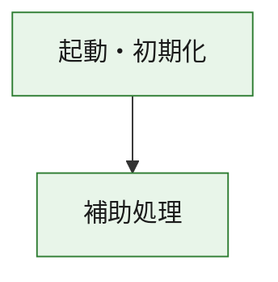
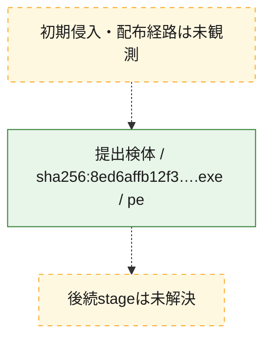
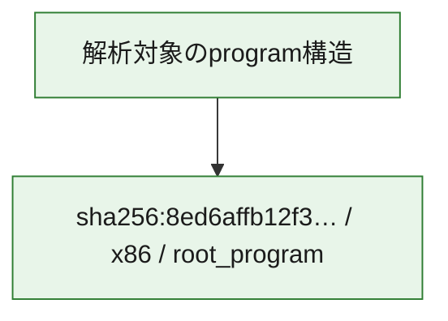

# 全体ロジック：8ed6affb12f3a7e7d642b04231bba72587091537213722ed944702a9a6471f79

代表関数の静的証跡から、起動・初期化の処理群を確認しました。

## 読み方

- phaseの掲載順は解析上の整理順です。observed_call_edgesがない段階間の実行順を断定しません。
- 図の実線は静的に観測した関係、点線と黄色のノードは未観測・未解決の関係を示します。
- 図は静的な要約であり、動的実行を再現するものではありません。
- 詳細な関数解説とfingerprintは[STATIC-LOGIC.md](STATIC-LOGIC.md)を参照してください。

## 静的可視化

### 実行フロー

### 感染チェーン

### モジュール関係

## 処理段階

### 1. 起動・初期化

entry pointから初期化と後続処理への移行を確認します。
確度: `confirmed_static_function_evidence`

- `8ed6affb12f3a7e7d642b04231bba72587091537213722ed944702a9a6471f79:ghidra:180001010` — 初期化と主要処理への分岐を行う入口関数です。 状態: `succeeded`、選定理由: `entry_point`, `meaningful_symbol_name`, `reviewed_call_centrality:22`, `role:entrypoint`, `small_program_complete_context`

### 2. 補助処理

主要処理を支える一般内部関数またはlibrary処理を確認します。
確度: `confirmed_static_function_evidence`

- `8ed6affb12f3a7e7d642b04231bba72587091537213722ed944702a9a6471f79:ghidra:180001240` — 検体内部の一般処理を実装する関数です。 状態: `succeeded`、選定理由: `context_representative`, `reviewed_call_centrality:2`, `small_program_complete_context`
- `8ed6affb12f3a7e7d642b04231bba72587091537213722ed944702a9a6471f79:ghidra:180001350` — 検体内部の一般処理を実装する関数です。 状態: `succeeded`、選定理由: `context_representative`, `reviewed_call_centrality:25`, `small_program_complete_context`
- `8ed6affb12f3a7e7d642b04231bba72587091537213722ed944702a9a6471f79:ghidra:180003780` — 検体内部の一般処理を実装する関数です。 状態: `succeeded`、選定理由: `context_representative`, `reviewed_call_centrality:2`, `small_program_complete_context`
- `8ed6affb12f3a7e7d642b04231bba72587091537213722ed944702a9a6471f79:ghidra:1800038e0` — 検体内部の一般処理を実装する関数です。 状態: `succeeded`、選定理由: `context_representative`, `reviewed_call_centrality:2`, `small_program_complete_context`

## 観測したcall関係

- `8ed6affb12f3a7e7d642b04231bba72587091537213722ed944702a9a6471f79:ghidra:180001010` → `8ed6affb12f3a7e7d642b04231bba72587091537213722ed944702a9a6471f79:ghidra:180001240` （`startup` → `support`）
- `8ed6affb12f3a7e7d642b04231bba72587091537213722ed944702a9a6471f79:ghidra:180001010` → `8ed6affb12f3a7e7d642b04231bba72587091537213722ed944702a9a6471f79:ghidra:180001350` （`startup` → `support`）
- `8ed6affb12f3a7e7d642b04231bba72587091537213722ed944702a9a6471f79:ghidra:180001350` → `8ed6affb12f3a7e7d642b04231bba72587091537213722ed944702a9a6471f79:ghidra:180001240` （`support` → `support`）
- `8ed6affb12f3a7e7d642b04231bba72587091537213722ed944702a9a6471f79:ghidra:180001350` → `8ed6affb12f3a7e7d642b04231bba72587091537213722ed944702a9a6471f79:ghidra:180003780` （`support` → `support`）
- `8ed6affb12f3a7e7d642b04231bba72587091537213722ed944702a9a6471f79:ghidra:180001350` → `8ed6affb12f3a7e7d642b04231bba72587091537213722ed944702a9a6471f79:ghidra:1800038e0` （`support` → `support`）
- `8ed6affb12f3a7e7d642b04231bba72587091537213722ed944702a9a6471f79:ghidra:180003780` → `8ed6affb12f3a7e7d642b04231bba72587091537213722ed944702a9a6471f79:ghidra:1800038e0` （`support` → `support`）
- `ghidra-function:25cf1316a1d930b867bda58b` → `ghidra-external:054012fc02646b84bcde7979` （`unclassified` → `unclassified`）
- `ghidra-function:25cf1316a1d930b867bda58b` → `ghidra-external:08cb2924bc810962263ce780` （`unclassified` → `unclassified`）
- `ghidra-function:25cf1316a1d930b867bda58b` → `ghidra-external:0fd632f2c0512fffbf391401` （`unclassified` → `unclassified`）
- `ghidra-function:25cf1316a1d930b867bda58b` → `ghidra-external:1195c4501fce9793bc5c72f9` （`unclassified` → `unclassified`）
- `ghidra-function:25cf1316a1d930b867bda58b` → `ghidra-external:1caa2a84d3f2c08dac5646fa` （`unclassified` → `unclassified`）
- `ghidra-function:25cf1316a1d930b867bda58b` → `ghidra-external:234e736cc098ceccbdc79718` （`unclassified` → `unclassified`）
- `ghidra-function:25cf1316a1d930b867bda58b` → `ghidra-external:3396f9421a27466a29fe058b` （`unclassified` → `unclassified`）
- `ghidra-function:25cf1316a1d930b867bda58b` → `ghidra-external:34f906bbebc85138ecf0684d` （`unclassified` → `unclassified`）
- `ghidra-function:25cf1316a1d930b867bda58b` → `ghidra-external:54365f7f4bac1c46d914b490` （`unclassified` → `unclassified`）
- `ghidra-function:25cf1316a1d930b867bda58b` → `ghidra-external:7f3f06338be6d2cc36c74f93` （`unclassified` → `unclassified`）
- `ghidra-function:25cf1316a1d930b867bda58b` → `ghidra-external:8d0cbc600e854405a3be6f84` （`unclassified` → `unclassified`）
- `ghidra-function:25cf1316a1d930b867bda58b` → `ghidra-external:9264c92454a38695ba46daaa` （`unclassified` → `unclassified`）
- `ghidra-function:25cf1316a1d930b867bda58b` → `ghidra-external:9868d8639e6fd9d07613f6e1` （`unclassified` → `unclassified`）
- `ghidra-function:25cf1316a1d930b867bda58b` → `ghidra-external:9ef34ae142ac4274c1028c35` （`unclassified` → `unclassified`）
- `ghidra-function:25cf1316a1d930b867bda58b` → `ghidra-external:b0dfe00d15616aa21f651025` （`unclassified` → `unclassified`）
- `ghidra-function:25cf1316a1d930b867bda58b` → `ghidra-external:b4008457d451bcc8eb5bae2e` （`unclassified` → `unclassified`）
- `ghidra-function:25cf1316a1d930b867bda58b` → `ghidra-external:ba292545eec42176b7e642f9` （`unclassified` → `unclassified`）
- `ghidra-function:25cf1316a1d930b867bda58b` → `ghidra-external:e1e203054775806c84ed3bf5` （`unclassified` → `unclassified`）
- `ghidra-function:25cf1316a1d930b867bda58b` → `ghidra-external:e5001bae8273cb81db47dab6` （`unclassified` → `unclassified`）
- `ghidra-function:25cf1316a1d930b867bda58b` → `ghidra-external:f8aab43c7d02c532a7affaa0` （`unclassified` → `unclassified`）
- `ghidra-function:25cf1316a1d930b867bda58b` → `ghidra-external:f9b94de029b2bc6954d2be6a` （`unclassified` → `unclassified`）
- `ghidra-function:25cf1316a1d930b867bda58b` → `ghidra-function:4eb8a0fd69bf76a3b3d4ef04` （`unclassified` → `unclassified`）
- `ghidra-function:25cf1316a1d930b867bda58b` → `ghidra-function:96fed0015fbebbdd01028dfd` （`unclassified` → `unclassified`）
- `ghidra-function:25cf1316a1d930b867bda58b` → `ghidra-function:ea78c6addc3fd114074f44a5` （`unclassified` → `unclassified`）
- `ghidra-function:81b8773ce6e4e50471e451ca` → `ghidra-function:186aa3991b9ee30e169eff56` （`unclassified` → `unclassified`）
- `ghidra-function:81b8773ce6e4e50471e451ca` → `ghidra-function:25cf1316a1d930b867bda58b` （`unclassified` → `unclassified`）
- `ghidra-function:81b8773ce6e4e50471e451ca` → `ghidra-function:2fc37fa7a2f2020cd7dd98b6` （`unclassified` → `unclassified`）
- `ghidra-function:81b8773ce6e4e50471e451ca` → `ghidra-function:4eb8a0fd69bf76a3b3d4ef04` （`unclassified` → `unclassified`）
- `ghidra-function:81b8773ce6e4e50471e451ca` → `ghidra-function:5418b2d18b62b5a32ac02fe1` （`unclassified` → `unclassified`）
- `ghidra-function:81b8773ce6e4e50471e451ca` → `ghidra-function:9f6ff2258cb9b0f40ade3381` （`unclassified` → `unclassified`）
- `ghidra-function:81b8773ce6e4e50471e451ca` → `ghidra-function:b1e6d55af448633383a03419` （`unclassified` → `unclassified`）
- `ghidra-function:81b8773ce6e4e50471e451ca` → `ghidra-function:b7b5b479d8b405209c8a5c60` （`unclassified` → `unclassified`）
- `ghidra-function:81b8773ce6e4e50471e451ca` → `ghidra-function:df72291fc2ca3bf5023c5bbd` （`unclassified` → `unclassified`）
- `ghidra-function:81b8773ce6e4e50471e451ca` → `ghidra-function:e49d01d9ebd59a25037eaf54` （`unclassified` → `unclassified`）
- `ghidra-function:81b8773ce6e4e50471e451ca` → `ghidra-function:e54c4feeec3cebd48598305f` （`unclassified` → `unclassified`）
- `ghidra-function:81b8773ce6e4e50471e451ca` → `ghidra-function:f604e079cb3a0d05183a5d44` （`unclassified` → `unclassified`）
- `ghidra-function:ea78c6addc3fd114074f44a5` → `ghidra-function:96fed0015fbebbdd01028dfd` （`unclassified` → `unclassified`）

## 解析範囲と制約

- 選定外関数は全体inventoryへ残しますが、関数本体の個別解説対象にはしていません。
- indirect call、難読化、packer、VM、壊れたcontrol flowによりcall関係が欠落する場合があります。
- 文書は静的解析に基づき、検体実行や外部通信による動的確認は行っていません。
