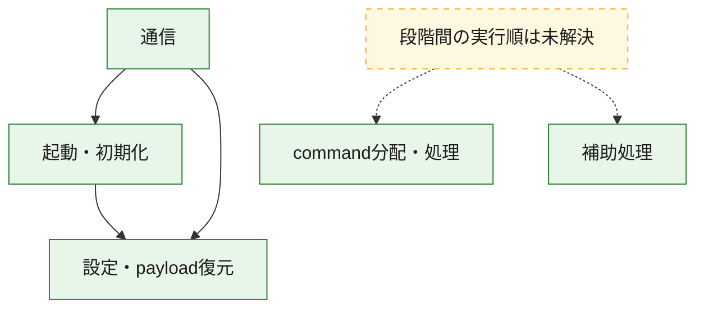
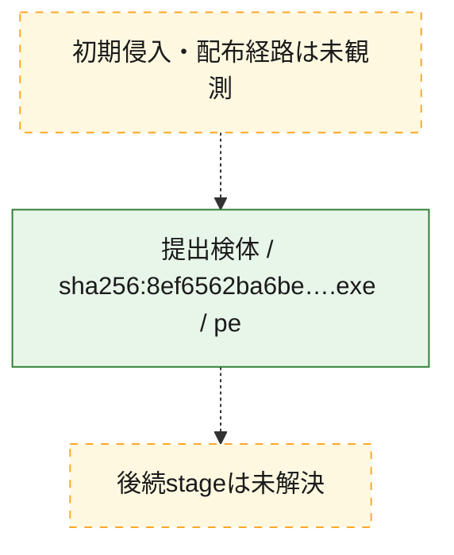
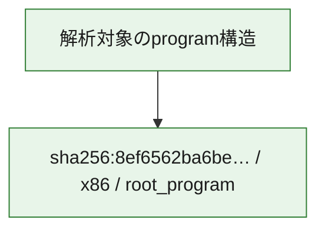

# 全体ロジック：8ef6562ba6bed3b0ffd3b21774e50dc8013fad49b66eb02b355f6b42a704a463

代表関数の静的証跡から、起動・初期化、設定・payload復元、通信、command分配・処理の処理群を確認しました。

## 読み方

- phaseの掲載順は解析上の整理順です。observed_call_edgesがない段階間の実行順を断定しません。
- 図の実線は静的に観測した関係、点線と黄色のノードは未観測・未解決の関係を示します。
- 図は静的な要約であり、動的実行を再現するものではありません。
- 詳細な関数解説とfingerprintは[STATIC-LOGIC.md](STATIC-LOGIC.md)を参照してください。

## 静的可視化

### 実行フロー

### 感染チェーン

### モジュール関係

## 処理段階

### 1. 起動・初期化

entry pointから初期化と後続処理への移行を確認します。
確度: `confirmed_static_function_evidence`

- `8ef6562ba6bed3b0ffd3b21774e50dc8013fad49b66eb02b355f6b42a704a463:ghidra:140009957` — 初期化と主要処理への分岐を行う入口関数です。 状態: `succeeded`、選定理由: `entry_point`, `meaningful_symbol_name`, `reviewed_call_centrality:7`, `role:entrypoint`
- `8ef6562ba6bed3b0ffd3b21774e50dc8013fad49b66eb02b355f6b42a704a463:ghidra:14000fd04` — 初期化と主要処理への分岐を行う入口関数です。 状態: `succeeded`、選定理由: `entry_point`, `meaningful_symbol_name`, `probable_go_main_user_code`, `reviewed_call_centrality:23`, `role:entrypoint`

### 2. 設定・payload復元

設定、resource、payload、暗号化データの復元・変換を確認します。
確度: `confirmed_static_function_evidence`

- `8ef6562ba6bed3b0ffd3b21774e50dc8013fad49b66eb02b355f6b42a704a463:ghidra:1400016e1` — 設定、resource、payloadなどの解析・変換を行う関数です。 状態: `succeeded`、選定理由: `meaningful_symbol_name`, `reviewed_call_centrality:1`, `role:config_or_data_transform`
- `8ef6562ba6bed3b0ffd3b21774e50dc8013fad49b66eb02b355f6b42a704a463:ghidra:140001c94` — 設定、resource、payloadなどの解析・変換を行う関数です。 状態: `succeeded`、選定理由: `meaningful_symbol_name`, `reviewed_call_centrality:1`, `role:config_or_data_transform`
- `8ef6562ba6bed3b0ffd3b21774e50dc8013fad49b66eb02b355f6b42a704a463:ghidra:1400022ae` — 暗号、hash、encoding、または復号処理に関係する関数です。 状態: `succeeded`、選定理由: `meaningful_symbol_name`, `reviewed_call_centrality:4`, `role:cryptographic_transform`
- `8ef6562ba6bed3b0ffd3b21774e50dc8013fad49b66eb02b355f6b42a704a463:ghidra:140002ecc` — 暗号、hash、encoding、または復号処理に関係する関数です。 状態: `succeeded`、選定理由: `meaningful_symbol_name`, `reviewed_call_centrality:4`, `role:cryptographic_transform`
- `8ef6562ba6bed3b0ffd3b21774e50dc8013fad49b66eb02b355f6b42a704a463:ghidra:140002fb6` — 暗号、hash、encoding、または復号処理に関係する関数です。 状態: `succeeded`、選定理由: `meaningful_symbol_name`, `reviewed_call_centrality:12`, `role:cryptographic_transform`
- `8ef6562ba6bed3b0ffd3b21774e50dc8013fad49b66eb02b355f6b42a704a463:ghidra:1400031e9` — 設定、resource、payloadなどの解析・変換を行う関数です。 状態: `succeeded`、選定理由: `meaningful_symbol_name`, `reviewed_call_centrality:13`, `role:config_or_data_transform`
- `8ef6562ba6bed3b0ffd3b21774e50dc8013fad49b66eb02b355f6b42a704a463:ghidra:140003c95` — 設定、resource、payloadなどの解析・変換を行う関数です。 状態: `succeeded`、選定理由: `meaningful_symbol_name`, `reviewed_call_centrality:1`, `role:config_or_data_transform`
- `8ef6562ba6bed3b0ffd3b21774e50dc8013fad49b66eb02b355f6b42a704a463:ghidra:140005261` — 設定、resource、payloadなどの解析・変換を行う関数です。 状態: `succeeded`、選定理由: `meaningful_symbol_name`, `reviewed_call_centrality:2`, `role:config_or_data_transform`
- `8ef6562ba6bed3b0ffd3b21774e50dc8013fad49b66eb02b355f6b42a704a463:ghidra:140005dfb` — 暗号、hash、encoding、または復号処理に関係する関数です。 状態: `succeeded`、選定理由: `meaningful_symbol_name`, `reviewed_call_centrality:2`, `role:cryptographic_transform`
- `8ef6562ba6bed3b0ffd3b21774e50dc8013fad49b66eb02b355f6b42a704a463:ghidra:140005f7d` — 設定、resource、payloadなどの解析・変換を行う関数です。 状態: `succeeded`、選定理由: `meaningful_symbol_name`, `reviewed_call_centrality:12`, `role:config_or_data_transform`
- `8ef6562ba6bed3b0ffd3b21774e50dc8013fad49b66eb02b355f6b42a704a463:ghidra:1400064c3` — 設定、resource、payloadなどの解析・変換を行う関数です。 状態: `succeeded`、選定理由: `meaningful_symbol_name`, `reviewed_call_centrality:9`, `role:config_or_data_transform`
- `8ef6562ba6bed3b0ffd3b21774e50dc8013fad49b66eb02b355f6b42a704a463:ghidra:1400080a7` — 設定、resource、payloadなどの解析・変換を行う関数です。 状態: `succeeded`、選定理由: `meaningful_symbol_name`, `reviewed_call_centrality:1`, `role:config_or_data_transform`
- `8ef6562ba6bed3b0ffd3b21774e50dc8013fad49b66eb02b355f6b42a704a463:ghidra:14000a50a` — 設定、resource、payloadなどの解析・変換を行う関数です。 状態: `succeeded`、選定理由: `meaningful_symbol_name`, `reviewed_call_centrality:7`, `role:config_or_data_transform`

### 3. 通信

通信初期化、endpoint処理、送受信の役割を確認します。
確度: `confirmed_static_function_evidence`

- `8ef6562ba6bed3b0ffd3b21774e50dc8013fad49b66eb02b355f6b42a704a463:ghidra:140005b93` — 通信初期化、送受信、またはendpoint処理に関係する関数です。 状態: `succeeded`、選定理由: `meaningful_symbol_name`, `reviewed_call_centrality:3`, `role:network_communication`
- `8ef6562ba6bed3b0ffd3b21774e50dc8013fad49b66eb02b355f6b42a704a463:ghidra:140006a82` — 通信初期化、送受信、またはendpoint処理に関係する関数です。 状態: `succeeded`、選定理由: `meaningful_symbol_name`, `reviewed_call_centrality:3`, `role:network_communication`
- `8ef6562ba6bed3b0ffd3b21774e50dc8013fad49b66eb02b355f6b42a704a463:ghidra:140007539` — 通信初期化、送受信、またはendpoint処理に関係する関数です。 状態: `succeeded`、選定理由: `meaningful_symbol_name`, `reviewed_call_centrality:3`, `role:network_communication`
- `8ef6562ba6bed3b0ffd3b21774e50dc8013fad49b66eb02b355f6b42a704a463:ghidra:140008e99` — 通信初期化、送受信、またはendpoint処理に関係する関数です。 状態: `succeeded`、選定理由: `meaningful_symbol_name`, `reviewed_call_centrality:20`, `role:network_communication`
- `8ef6562ba6bed3b0ffd3b21774e50dc8013fad49b66eb02b355f6b42a704a463:ghidra:1400090d9` — 通信初期化、送受信、またはendpoint処理に関係する関数です。 状態: `succeeded`、選定理由: `meaningful_symbol_name`, `reviewed_call_centrality:5`, `role:network_communication`
- `8ef6562ba6bed3b0ffd3b21774e50dc8013fad49b66eb02b355f6b42a704a463:ghidra:140009436` — 通信初期化、送受信、またはendpoint処理に関係する関数です。 状態: `succeeded`、選定理由: `meaningful_symbol_name`, `reviewed_call_centrality:3`, `role:network_communication`
- `8ef6562ba6bed3b0ffd3b21774e50dc8013fad49b66eb02b355f6b42a704a463:ghidra:140009495` — 通信初期化、送受信、またはendpoint処理に関係する関数です。 状態: `succeeded`、選定理由: `meaningful_symbol_name`, `reviewed_call_centrality:4`, `role:network_communication`
- `8ef6562ba6bed3b0ffd3b21774e50dc8013fad49b66eb02b355f6b42a704a463:ghidra:1400095d1` — 通信初期化、送受信、またはendpoint処理に関係する関数です。 状態: `succeeded`、選定理由: `meaningful_symbol_name`, `reviewed_call_centrality:9`, `role:network_communication`
- `8ef6562ba6bed3b0ffd3b21774e50dc8013fad49b66eb02b355f6b42a704a463:ghidra:140009d45` — 通信初期化、送受信、またはendpoint処理に関係する関数です。 状態: `succeeded`、選定理由: `meaningful_symbol_name`, `reviewed_call_centrality:3`, `role:network_communication`
- `8ef6562ba6bed3b0ffd3b21774e50dc8013fad49b66eb02b355f6b42a704a463:ghidra:140009e39` — 通信初期化、送受信、またはendpoint処理に関係する関数です。 状態: `succeeded`、選定理由: `meaningful_symbol_name`, `reviewed_call_centrality:15`, `role:network_communication`
- `8ef6562ba6bed3b0ffd3b21774e50dc8013fad49b66eb02b355f6b42a704a463:ghidra:14000b3a7` — 通信初期化、送受信、またはendpoint処理に関係する関数です。 状態: `succeeded`、選定理由: `meaningful_symbol_name`, `reviewed_call_centrality:11`, `role:network_communication`

### 4. command分配・処理

受信commandやtaskの解釈、分配、個別handlerへの移行を確認します。
確度: `confirmed_static_function_evidence`

- `8ef6562ba6bed3b0ffd3b21774e50dc8013fad49b66eb02b355f6b42a704a463:ghidra:14000ace9` — commandの解釈、分配、または個別処理を担当する関数です。 状態: `succeeded`、選定理由: `meaningful_symbol_name`, `reviewed_call_centrality:5`, `role:command_dispatch_or_handler`
- `8ef6562ba6bed3b0ffd3b21774e50dc8013fad49b66eb02b355f6b42a704a463:ghidra:14000b564` — commandの解釈、分配、または個別処理を担当する関数です。 状態: `succeeded`、選定理由: `meaningful_symbol_name`, `reviewed_call_centrality:5`, `role:command_dispatch_or_handler`
- `8ef6562ba6bed3b0ffd3b21774e50dc8013fad49b66eb02b355f6b42a704a463:ghidra:14000b96b` — commandの解釈、分配、または個別処理を担当する関数です。 状態: `succeeded`、選定理由: `meaningful_symbol_name`, `reviewed_call_centrality:7`, `role:command_dispatch_or_handler`

### 5. 補助処理

主要処理を支える一般内部関数またはlibrary処理を確認します。
確度: `confirmed_static_function_evidence`

- `8ef6562ba6bed3b0ffd3b21774e50dc8013fad49b66eb02b355f6b42a704a463:ghidra:140001410` — 検体内部の一般処理を実装する関数です。 状態: `succeeded`、選定理由: `entry_point`, `meaningful_symbol_name`, `reviewed_call_centrality:1`
- `8ef6562ba6bed3b0ffd3b21774e50dc8013fad49b66eb02b355f6b42a704a463:ghidra:1400104a0` — compiler生成処理または汎用library処理とみられる関数です。 状態: `succeeded`、選定理由: `entry_point`, `meaningful_symbol_name`, `reviewed_call_centrality:1`
- `8ef6562ba6bed3b0ffd3b21774e50dc8013fad49b66eb02b355f6b42a704a463:ghidra:1400104d0` — compiler生成処理または汎用library処理とみられる関数です。 状態: `succeeded`、選定理由: `entry_point`, `meaningful_symbol_name`, `reviewed_call_centrality:2`

## 観測したcall関係

- `8ef6562ba6bed3b0ffd3b21774e50dc8013fad49b66eb02b355f6b42a704a463:ghidra:140002fb6` → `8ef6562ba6bed3b0ffd3b21774e50dc8013fad49b66eb02b355f6b42a704a463:ghidra:140002ecc` （`configuration` → `configuration`）
- `8ef6562ba6bed3b0ffd3b21774e50dc8013fad49b66eb02b355f6b42a704a463:ghidra:1400031e9` → `8ef6562ba6bed3b0ffd3b21774e50dc8013fad49b66eb02b355f6b42a704a463:ghidra:140002ecc` （`configuration` → `configuration`）
- `8ef6562ba6bed3b0ffd3b21774e50dc8013fad49b66eb02b355f6b42a704a463:ghidra:140005dfb` → `8ef6562ba6bed3b0ffd3b21774e50dc8013fad49b66eb02b355f6b42a704a463:ghidra:1400022ae` （`configuration` → `configuration`）
- `8ef6562ba6bed3b0ffd3b21774e50dc8013fad49b66eb02b355f6b42a704a463:ghidra:1400064c3` → `8ef6562ba6bed3b0ffd3b21774e50dc8013fad49b66eb02b355f6b42a704a463:ghidra:1400031e9` （`configuration` → `configuration`）
- `8ef6562ba6bed3b0ffd3b21774e50dc8013fad49b66eb02b355f6b42a704a463:ghidra:1400064c3` → `8ef6562ba6bed3b0ffd3b21774e50dc8013fad49b66eb02b355f6b42a704a463:ghidra:140005f7d` （`configuration` → `configuration`）
- `8ef6562ba6bed3b0ffd3b21774e50dc8013fad49b66eb02b355f6b42a704a463:ghidra:140006a82` → `8ef6562ba6bed3b0ffd3b21774e50dc8013fad49b66eb02b355f6b42a704a463:ghidra:140005b93` （`communication` → `communication`）
- `8ef6562ba6bed3b0ffd3b21774e50dc8013fad49b66eb02b355f6b42a704a463:ghidra:1400090d9` → `8ef6562ba6bed3b0ffd3b21774e50dc8013fad49b66eb02b355f6b42a704a463:ghidra:140008e99` （`communication` → `communication`）
- `8ef6562ba6bed3b0ffd3b21774e50dc8013fad49b66eb02b355f6b42a704a463:ghidra:1400095d1` → `8ef6562ba6bed3b0ffd3b21774e50dc8013fad49b66eb02b355f6b42a704a463:ghidra:140002fb6` （`communication` → `configuration`）
- `8ef6562ba6bed3b0ffd3b21774e50dc8013fad49b66eb02b355f6b42a704a463:ghidra:1400095d1` → `8ef6562ba6bed3b0ffd3b21774e50dc8013fad49b66eb02b355f6b42a704a463:ghidra:140009436` （`communication` → `communication`）
- `8ef6562ba6bed3b0ffd3b21774e50dc8013fad49b66eb02b355f6b42a704a463:ghidra:140009e39` → `8ef6562ba6bed3b0ffd3b21774e50dc8013fad49b66eb02b355f6b42a704a463:ghidra:140009957` （`communication` → `startup`）
- `8ef6562ba6bed3b0ffd3b21774e50dc8013fad49b66eb02b355f6b42a704a463:ghidra:140009e39` → `8ef6562ba6bed3b0ffd3b21774e50dc8013fad49b66eb02b355f6b42a704a463:ghidra:140009d45` （`communication` → `communication`）
- `8ef6562ba6bed3b0ffd3b21774e50dc8013fad49b66eb02b355f6b42a704a463:ghidra:14000b3a7` → `8ef6562ba6bed3b0ffd3b21774e50dc8013fad49b66eb02b355f6b42a704a463:ghidra:140009e39` （`communication` → `communication`）
- `8ef6562ba6bed3b0ffd3b21774e50dc8013fad49b66eb02b355f6b42a704a463:ghidra:14000fd04` → `8ef6562ba6bed3b0ffd3b21774e50dc8013fad49b66eb02b355f6b42a704a463:ghidra:1400064c3` （`startup` → `configuration`）
- `ghidra-function:046bc1557a518a88172cc173` → `ghidra-external:4e3931f17ed3e879408acb00` （`unclassified` → `unclassified`）
- `ghidra-function:046bc1557a518a88172cc173` → `ghidra-external:d621ce155059febfbec13c9f` （`unclassified` → `unclassified`）
- `ghidra-function:046bc1557a518a88172cc173` → `ghidra-function:183f7748a3c10278ee6f54cf` （`unclassified` → `unclassified`）
- `ghidra-function:046bc1557a518a88172cc173` → `ghidra-function:2b50a3e091e1649b0bc29940` （`unclassified` → `unclassified`）
- `ghidra-function:046bc1557a518a88172cc173` → `ghidra-function:b2b981790ceb671eeeb465ea` （`unclassified` → `unclassified`）
- `ghidra-function:166d19631be44a346576694e` → `ghidra-function:1f93ba1dd4359abbaf783ac6` （`unclassified` → `unclassified`）
- `ghidra-function:166d19631be44a346576694e` → `ghidra-function:4b7866822398f0a161349427` （`unclassified` → `unclassified`）
- `ghidra-function:166d19631be44a346576694e` → `ghidra-function:75d32905a28ad87e0dcb43ac` （`unclassified` → `unclassified`）
- `ghidra-function:166d19631be44a346576694e` → `ghidra-function:7b39bb0ea1bf37bffc793464` （`unclassified` → `unclassified`）
- `ghidra-function:166d19631be44a346576694e` → `ghidra-function:7b40b9d99452c6549fb61c24` （`unclassified` → `unclassified`）
- `ghidra-function:166d19631be44a346576694e` → `ghidra-function:a53b1270d577825b51602ec2` （`unclassified` → `unclassified`）
- `ghidra-function:166d19631be44a346576694e` → `ghidra-function:af74a06bf42171c8a1a99de9` （`unclassified` → `unclassified`）
- `ghidra-function:166d19631be44a346576694e` → `ghidra-function:bb953abccc7ebc780d98d939` （`unclassified` → `unclassified`）
- `ghidra-function:166d19631be44a346576694e` → `ghidra-function:e45f2706d5966efab6259205` （`unclassified` → `unclassified`）
- `ghidra-function:166d19631be44a346576694e` → `ghidra-function:f4f50c1f998c35435c023366` （`unclassified` → `unclassified`）
- `ghidra-function:166d19631be44a346576694e` → `ghidra-function:f7c31d8ab00c2af1de19cce5` （`unclassified` → `unclassified`）
- `ghidra-function:290edb47fe37afd6bf1dc1ef` → `ghidra-external:02aa4043d22e5ba6ed4f8f5a` （`unclassified` → `unclassified`）
- `ghidra-function:290edb47fe37afd6bf1dc1ef` → `ghidra-external:d621ce155059febfbec13c9f` （`unclassified` → `unclassified`）
- `ghidra-function:290edb47fe37afd6bf1dc1ef` → `ghidra-function:ccff0086c9a5ef0c1efe547b` （`unclassified` → `unclassified`）
- `ghidra-function:31ded7e16b9e2d0072c13aa3` → `ghidra-external:02aa4043d22e5ba6ed4f8f5a` （`unclassified` → `unclassified`）
- `ghidra-function:31ded7e16b9e2d0072c13aa3` → `ghidra-external:587b24922f42bc72276ba785` （`unclassified` → `unclassified`）
- `ghidra-function:31ded7e16b9e2d0072c13aa3` → `ghidra-external:ca8821e2f408550f3c891087` （`unclassified` → `unclassified`）
- `ghidra-function:31ded7e16b9e2d0072c13aa3` → `ghidra-function:1133d233a6eef30dee2792db` （`unclassified` → `unclassified`）
- `ghidra-function:42f94750fbf6184c17ab6531` → `ghidra-function:1f93ba1dd4359abbaf783ac6` （`unclassified` → `unclassified`）
- `ghidra-function:42f94750fbf6184c17ab6531` → `ghidra-function:75d32905a28ad87e0dcb43ac` （`unclassified` → `unclassified`）
- `ghidra-function:42f94750fbf6184c17ab6531` → `ghidra-function:7b40b9d99452c6549fb61c24` （`unclassified` → `unclassified`）
- `ghidra-function:42f94750fbf6184c17ab6531` → `ghidra-function:9b115e73af188292775323b2` （`unclassified` → `unclassified`）
- `ghidra-function:42f94750fbf6184c17ab6531` → `ghidra-function:a53b1270d577825b51602ec2` （`unclassified` → `unclassified`）
- `ghidra-function:42f94750fbf6184c17ab6531` → `ghidra-function:af74a06bf42171c8a1a99de9` （`unclassified` → `unclassified`）
- `ghidra-function:42f94750fbf6184c17ab6531` → `ghidra-function:f7c31d8ab00c2af1de19cce5` （`unclassified` → `unclassified`）
- `ghidra-function:49f3b6b8d2f8c330bceb89ac` → `ghidra-function:e9ca0ab186b0cc4072b3481b` （`unclassified` → `unclassified`）
- `ghidra-function:53101a6afb4541e9df36af04` → `ghidra-external:4e3931f17ed3e879408acb00` （`unclassified` → `unclassified`）
- `ghidra-function:53101a6afb4541e9df36af04` → `ghidra-external:d621ce155059febfbec13c9f` （`unclassified` → `unclassified`）
- `ghidra-function:53101a6afb4541e9df36af04` → `ghidra-function:13605d8bf693bef7f57bfed4` （`unclassified` → `unclassified`）
- `ghidra-function:53101a6afb4541e9df36af04` → `ghidra-function:183f7748a3c10278ee6f54cf` （`unclassified` → `unclassified`）
- `ghidra-function:53101a6afb4541e9df36af04` → `ghidra-function:b2b981790ceb671eeeb465ea` （`unclassified` → `unclassified`）
- `ghidra-function:57da55b66ff6527c3c7b7345` → `ghidra-external:ca8821e2f408550f3c891087` （`unclassified` → `unclassified`）
- `ghidra-function:57da55b66ff6527c3c7b7345` → `ghidra-function:175e55e067303aa642661e30` （`unclassified` → `unclassified`）
- `ghidra-function:57da55b66ff6527c3c7b7345` → `ghidra-function:1f93ba1dd4359abbaf783ac6` （`unclassified` → `unclassified`）
- `ghidra-function:57da55b66ff6527c3c7b7345` → `ghidra-function:64b3d01e3c326fdbf67e1dd4` （`unclassified` → `unclassified`）
- `ghidra-function:57da55b66ff6527c3c7b7345` → `ghidra-function:75d32905a28ad87e0dcb43ac` （`unclassified` → `unclassified`）
- `ghidra-function:57da55b66ff6527c3c7b7345` → `ghidra-function:88165a2cea0d9e14e6693d99` （`unclassified` → `unclassified`）
- `ghidra-function:57da55b66ff6527c3c7b7345` → `ghidra-function:952e37a55c5459627f96c45e` （`unclassified` → `unclassified`）
- `ghidra-function:57da55b66ff6527c3c7b7345` → `ghidra-function:af74a06bf42171c8a1a99de9` （`unclassified` → `unclassified`）
- `ghidra-function:57da55b66ff6527c3c7b7345` → `ghidra-function:f7c31d8ab00c2af1de19cce5` （`unclassified` → `unclassified`）
- `ghidra-function:5bf3c5db5ec943eb3aa445d1` → `ghidra-external:4728cc448cf3dd08a3d2332e` （`unclassified` → `unclassified`）
- `ghidra-function:5bf3c5db5ec943eb3aa445d1` → `ghidra-function:be95f398338b19cfcc85ab71` （`unclassified` → `unclassified`）
- `ghidra-function:5bf3c5db5ec943eb3aa445d1` → `ghidra-function:ec5fc521dbe03ffd5597ccf6` （`unclassified` → `unclassified`）
- `ghidra-function:5cfde59ada387cbd397fb629` → `ghidra-external:1566b124d39319d1f93c0cfc` （`unclassified` → `unclassified`）
- `ghidra-function:5cfde59ada387cbd397fb629` → `ghidra-external:3c7ec05181878f305dd03080` （`unclassified` → `unclassified`）
- `ghidra-function:5cfde59ada387cbd397fb629` → `ghidra-external:604735fddd4aed63a5e3011d` （`unclassified` → `unclassified`）
- `ghidra-function:5cfde59ada387cbd397fb629` → `ghidra-external:77477758b1955bfc50559d13` （`unclassified` → `unclassified`）
- `ghidra-function:5cfde59ada387cbd397fb629` → `ghidra-external:7e38c5ad53288d48b99c1b8d` （`unclassified` → `unclassified`）
- `ghidra-function:5cfde59ada387cbd397fb629` → `ghidra-function:1f795778dad0eab9663bac48` （`unclassified` → `unclassified`）
- `ghidra-function:5cfde59ada387cbd397fb629` → `ghidra-function:4787e0043ab3afec65423e36` （`unclassified` → `unclassified`）
- `ghidra-function:5cfde59ada387cbd397fb629` → `ghidra-function:5b73a1bfd43d339c3b54abb0` （`unclassified` → `unclassified`）
- `ghidra-function:5cfde59ada387cbd397fb629` → `ghidra-function:5f165b9fe737b15aaf5ab706` （`unclassified` → `unclassified`）
- `ghidra-function:5cfde59ada387cbd397fb629` → `ghidra-function:7220687e30e6f66c891497ba` （`unclassified` → `unclassified`）
- `ghidra-function:5cfde59ada387cbd397fb629` → `ghidra-function:a2df3354414c96aa72950ba1` （`unclassified` → `unclassified`）
- `ghidra-function:5cfde59ada387cbd397fb629` → `ghidra-function:c5b97b1cd2b28efe1b53296a` （`unclassified` → `unclassified`）
- `ghidra-function:666572c08e01616da4f48c30` → `ghidra-external:77477758b1955bfc50559d13` （`unclassified` → `unclassified`）
- `ghidra-function:666572c08e01616da4f48c30` → `ghidra-external:ca8821e2f408550f3c891087` （`unclassified` → `unclassified`）
- `ghidra-function:6e053dd35880f67c3d685e20` → `ghidra-external:d621ce155059febfbec13c9f` （`unclassified` → `unclassified`）
- `ghidra-function:6e053dd35880f67c3d685e20` → `ghidra-external:dbb0956a6196b6cf6bd257d6` （`unclassified` → `unclassified`）
- `ghidra-function:7988ddffa17aa58a67f78fb9` → `ghidra-external:1566b124d39319d1f93c0cfc` （`unclassified` → `unclassified`）
- `ghidra-function:7988ddffa17aa58a67f78fb9` → `ghidra-external:4728cc448cf3dd08a3d2332e` （`unclassified` → `unclassified`）
- `ghidra-function:7988ddffa17aa58a67f78fb9` → `ghidra-external:52b0ffea3ee02102a66683ee` （`unclassified` → `unclassified`）
- `ghidra-function:7988ddffa17aa58a67f78fb9` → `ghidra-external:7d4acba3a442d505d435a2f3` （`unclassified` → `unclassified`）
- `ghidra-function:7988ddffa17aa58a67f78fb9` → `ghidra-function:0eb9d9366d2cc7a03f7966d5` （`unclassified` → `unclassified`）
- `ghidra-function:7988ddffa17aa58a67f78fb9` → `ghidra-function:48cd6477d9b632e3fc7f35dc` （`unclassified` → `unclassified`）
- `ghidra-function:7988ddffa17aa58a67f78fb9` → `ghidra-function:600fea32d7c5722c2a79d968` （`unclassified` → `unclassified`）
- `ghidra-function:7988ddffa17aa58a67f78fb9` → `ghidra-function:7b6f7695e20080158d3784bb` （`unclassified` → `unclassified`）
- `ghidra-function:7988ddffa17aa58a67f78fb9` → `ghidra-function:80e58f71e9fa6d89121ae96f` （`unclassified` → `unclassified`）
- `ghidra-function:7988ddffa17aa58a67f78fb9` → `ghidra-function:81b6fc66adc5b7fb4c177771` （`unclassified` → `unclassified`）
- `ghidra-function:7988ddffa17aa58a67f78fb9` → `ghidra-function:831ba50a7e4b36d347a878c1` （`unclassified` → `unclassified`）
- `ghidra-function:7988ddffa17aa58a67f78fb9` → `ghidra-function:8d56eb2882e6c3fbcaaabd3a` （`unclassified` → `unclassified`）
- `ghidra-function:7988ddffa17aa58a67f78fb9` → `ghidra-function:91ab5177092d2858c6879472` （`unclassified` → `unclassified`）
- `ghidra-function:7988ddffa17aa58a67f78fb9` → `ghidra-function:a979bf5459e0a5bfd1f095e7` （`unclassified` → `unclassified`）
- `ghidra-function:7988ddffa17aa58a67f78fb9` → `ghidra-function:bdbf4036977eee05d59428fb` （`unclassified` → `unclassified`）
- `ghidra-function:7988ddffa17aa58a67f78fb9` → `ghidra-function:c5384f4d498f374316cd0879` （`unclassified` → `unclassified`）
- `ghidra-function:7988ddffa17aa58a67f78fb9` → `ghidra-function:da519fc66d25400bcf60bda5` （`unclassified` → `unclassified`）
- `ghidra-function:7988ddffa17aa58a67f78fb9` → `ghidra-function:df2efb05ba883508f7cdd837` （`unclassified` → `unclassified`）
- `ghidra-function:7988ddffa17aa58a67f78fb9` → `ghidra-function:eb5b5e5009acb41fad47b2f1` （`unclassified` → `unclassified`）
- `ghidra-function:7988ddffa17aa58a67f78fb9` → `ghidra-function:f7c31d8ab00c2af1de19cce5` （`unclassified` → `unclassified`）
- `ghidra-function:7b58494983969faef9cd4bb3` → `ghidra-function:86d3b17d5dcf621035de29c9` （`unclassified` → `unclassified`）
- `ghidra-function:87f815d74fce693d6b6f4cac` → `ghidra-function:42622fd673204490b33e12b8` （`unclassified` → `unclassified`）
- `ghidra-function:87f815d74fce693d6b6f4cac` → `ghidra-function:63a48397ce0270d93a2e7886` （`unclassified` → `unclassified`）
- `ghidra-function:87f815d74fce693d6b6f4cac` → `ghidra-function:b6b0c865f50aa9332c55eb9b` （`unclassified` → `unclassified`）
- `ghidra-function:88165a2cea0d9e14e6693d99` → `ghidra-external:1e2e17f02f587db3b63433da` （`unclassified` → `unclassified`）
- `ghidra-function:88165a2cea0d9e14e6693d99` → `ghidra-function:d9df42bee57bd349b298da05` （`unclassified` → `unclassified`）
- `ghidra-function:8fc831152d3f0cad0a6f9172` → `ghidra-function:cdbcbc1b3a85c2d5500f0ed0` （`unclassified` → `unclassified`）
- `ghidra-function:952e37a55c5459627f96c45e` → `ghidra-external:02aa4043d22e5ba6ed4f8f5a` （`unclassified` → `unclassified`）
- `ghidra-function:952e37a55c5459627f96c45e` → `ghidra-external:1d48cf56d2eabac120cf2424` （`unclassified` → `unclassified`）
- `ghidra-function:952e37a55c5459627f96c45e` → `ghidra-external:67b77b320718b6f175698c6c` （`unclassified` → `unclassified`）
- `ghidra-function:952e37a55c5459627f96c45e` → `ghidra-external:c25f57c696113004f3b70a36` （`unclassified` → `unclassified`）
- `ghidra-function:952e37a55c5459627f96c45e` → `ghidra-external:fc7a9923feaf5d20fb56b81e` （`unclassified` → `unclassified`）
- `ghidra-function:952e37a55c5459627f96c45e` → `ghidra-function:4790d5891a25d08bd423eac7` （`unclassified` → `unclassified`）
- `ghidra-function:952e37a55c5459627f96c45e` → `ghidra-function:81b6fc66adc5b7fb4c177771` （`unclassified` → `unclassified`）
- `ghidra-function:952e37a55c5459627f96c45e` → `ghidra-function:903b5314d2ed1a738d6b0a79` （`unclassified` → `unclassified`）
- `ghidra-function:952e37a55c5459627f96c45e` → `ghidra-function:95e7c007d0f2be54d234b888` （`unclassified` → `unclassified`）
- `ghidra-function:952e37a55c5459627f96c45e` → `ghidra-function:99a258dc9fce18448ce78af6` （`unclassified` → `unclassified`）
- `ghidra-function:952e37a55c5459627f96c45e` → `ghidra-function:cd47b07a85487055a955d9a4` （`unclassified` → `unclassified`）
- `ghidra-function:95e7c007d0f2be54d234b888` → `ghidra-function:99a258dc9fce18448ce78af6` （`unclassified` → `unclassified`）
- `ghidra-function:95e7c007d0f2be54d234b888` → `ghidra-function:cd47b07a85487055a955d9a4` （`unclassified` → `unclassified`）
- `ghidra-function:9ca24f960deddb897c1ec633` → `ghidra-external:b302fab24c94e4c24a1308bd` （`unclassified` → `unclassified`）
- `ghidra-function:9ca24f960deddb897c1ec633` → `ghidra-function:722f5b7b039c604978a69b81` （`unclassified` → `unclassified`）
- `ghidra-function:a293821c5712f9546b2dcfc0` → `ghidra-function:3dc3594788b8e812b64fd86c` （`unclassified` → `unclassified`）
- `ghidra-function:a293821c5712f9546b2dcfc0` → `ghidra-function:87f815d74fce693d6b6f4cac` （`unclassified` → `unclassified`）
- `ghidra-function:a7dbfcd28a916b06d6981327` → `ghidra-external:7c3814b8ecb306975bc88bfa` （`unclassified` → `unclassified`）
- `ghidra-function:a7dbfcd28a916b06d6981327` → `ghidra-external:82df007ade630a1c9b1d8295` （`unclassified` → `unclassified`）
- `ghidra-function:a7dbfcd28a916b06d6981327` → `ghidra-external:d621ce155059febfbec13c9f` （`unclassified` → `unclassified`）
- `ghidra-function:a7dbfcd28a916b06d6981327` → `ghidra-external:dbb0956a6196b6cf6bd257d6` （`unclassified` → `unclassified`）
- `ghidra-function:a7dbfcd28a916b06d6981327` → `ghidra-function:b5a1cfbeb4742df191d50420` （`unclassified` → `unclassified`）
- `ghidra-function:a7dbfcd28a916b06d6981327` → `ghidra-function:ed63fa3bfcb084671a23eb60` （`unclassified` → `unclassified`）
- `ghidra-function:afd9745915cd354528ee3e37` → `ghidra-external:1566b124d39319d1f93c0cfc` （`unclassified` → `unclassified`）
- `ghidra-function:afd9745915cd354528ee3e37` → `ghidra-external:3c7ec05181878f305dd03080` （`unclassified` → `unclassified`）
- `ghidra-function:afd9745915cd354528ee3e37` → `ghidra-external:604735fddd4aed63a5e3011d` （`unclassified` → `unclassified`）
- `ghidra-function:afd9745915cd354528ee3e37` → `ghidra-external:6ca7fc2d3a6d2304a8e7bdc2` （`unclassified` → `unclassified`）
- `ghidra-function:afd9745915cd354528ee3e37` → `ghidra-external:88ebd6ad42158cd48c45a2f8` （`unclassified` → `unclassified`）
- `ghidra-function:afd9745915cd354528ee3e37` → `ghidra-external:c945882a9b79dc95a3c42033` （`unclassified` → `unclassified`）
- `ghidra-function:afd9745915cd354528ee3e37` → `ghidra-external:d621ce155059febfbec13c9f` （`unclassified` → `unclassified`）
- `ghidra-function:bdbf4036977eee05d59428fb` → `ghidra-external:1566b124d39319d1f93c0cfc` （`unclassified` → `unclassified`）
- `ghidra-function:bdbf4036977eee05d59428fb` → `ghidra-external:77477758b1955bfc50559d13` （`unclassified` → `unclassified`）
- `ghidra-function:bdbf4036977eee05d59428fb` → `ghidra-external:ca8821e2f408550f3c891087` （`unclassified` → `unclassified`）
- `ghidra-function:bdbf4036977eee05d59428fb` → `ghidra-function:1953ec1739d43dc90ae0d00d` （`unclassified` → `unclassified`）
- `ghidra-function:bdbf4036977eee05d59428fb` → `ghidra-function:c244dd96438ce2bce292f8ef` （`unclassified` → `unclassified`）
- `ghidra-function:bdbf4036977eee05d59428fb` → `ghidra-function:e20fac3c5de2a15a19878513` （`unclassified` → `unclassified`）
- `ghidra-function:bdbf4036977eee05d59428fb` → `ghidra-function:ef0b1923afb123a1bc398707` （`unclassified` → `unclassified`）
- `ghidra-function:be95f398338b19cfcc85ab71` → `ghidra-function:2197daff9e99ba4539113772` （`unclassified` → `unclassified`）
- `ghidra-function:be95f398338b19cfcc85ab71` → `ghidra-function:e8f1d8f70043c575bc95ebdf` （`unclassified` → `unclassified`）
- `ghidra-function:c244dd96438ce2bce292f8ef` → `ghidra-external:02aa4043d22e5ba6ed4f8f5a` （`unclassified` → `unclassified`）
- `ghidra-function:c244dd96438ce2bce292f8ef` → `ghidra-external:1d48cf56d2eabac120cf2424` （`unclassified` → `unclassified`）
- `ghidra-function:c244dd96438ce2bce292f8ef` → `ghidra-external:67b77b320718b6f175698c6c` （`unclassified` → `unclassified`）
- `ghidra-function:c244dd96438ce2bce292f8ef` → `ghidra-external:953d29496b21e966f00fa0f7` （`unclassified` → `unclassified`）
- `ghidra-function:c244dd96438ce2bce292f8ef` → `ghidra-external:c25f57c696113004f3b70a36` （`unclassified` → `unclassified`）
- `ghidra-function:c244dd96438ce2bce292f8ef` → `ghidra-external:d621ce155059febfbec13c9f` （`unclassified` → `unclassified`）
- `ghidra-function:c244dd96438ce2bce292f8ef` → `ghidra-external:fc7a9923feaf5d20fb56b81e` （`unclassified` → `unclassified`）
- `ghidra-function:c244dd96438ce2bce292f8ef` → `ghidra-function:4790d5891a25d08bd423eac7` （`unclassified` → `unclassified`）
- `ghidra-function:c244dd96438ce2bce292f8ef` → `ghidra-function:903b5314d2ed1a738d6b0a79` （`unclassified` → `unclassified`）
- `ghidra-function:c244dd96438ce2bce292f8ef` → `ghidra-function:95e7c007d0f2be54d234b888` （`unclassified` → `unclassified`）
- `ghidra-function:c244dd96438ce2bce292f8ef` → `ghidra-function:99a258dc9fce18448ce78af6` （`unclassified` → `unclassified`）
- `ghidra-function:c244dd96438ce2bce292f8ef` → `ghidra-function:cd47b07a85487055a955d9a4` （`unclassified` → `unclassified`）
- `ghidra-function:c73760fa48095bf7a87f5192` → `ghidra-function:722f5b7b039c604978a69b81` （`unclassified` → `unclassified`）
- `ghidra-function:c760a958c31e6db8caabef1f` → `ghidra-function:539bf82d080eb27ee2f51b72` （`unclassified` → `unclassified`）
- `ghidra-function:d525d6a888d12c798a4ea3c2` → `ghidra-external:6ca7fc2d3a6d2304a8e7bdc2` （`unclassified` → `unclassified`）
- `ghidra-function:ef0b1923afb123a1bc398707` → `ghidra-external:1566b124d39319d1f93c0cfc` （`unclassified` → `unclassified`）
- `ghidra-function:ef0b1923afb123a1bc398707` → `ghidra-external:4728cc448cf3dd08a3d2332e` （`unclassified` → `unclassified`）
- `ghidra-function:ef0b1923afb123a1bc398707` → `ghidra-external:4e3931f17ed3e879408acb00` （`unclassified` → `unclassified`）
- `ghidra-function:ef0b1923afb123a1bc398707` → `ghidra-external:7d4acba3a442d505d435a2f3` （`unclassified` → `unclassified`）
- `ghidra-function:ef0b1923afb123a1bc398707` → `ghidra-external:d621ce155059febfbec13c9f` （`unclassified` → `unclassified`）
- `ghidra-function:ef0b1923afb123a1bc398707` → `ghidra-function:13605d8bf693bef7f57bfed4` （`unclassified` → `unclassified`）
- `ghidra-function:ef0b1923afb123a1bc398707` → `ghidra-function:183f7748a3c10278ee6f54cf` （`unclassified` → `unclassified`）
- `ghidra-function:ef0b1923afb123a1bc398707` → `ghidra-function:2b50a3e091e1649b0bc29940` （`unclassified` → `unclassified`）
- `ghidra-function:ef0b1923afb123a1bc398707` → `ghidra-function:3df153670dd8b0bbfa7db31d` （`unclassified` → `unclassified`）
- `ghidra-function:ef0b1923afb123a1bc398707` → `ghidra-function:b2b981790ceb671eeeb465ea` （`unclassified` → `unclassified`）
- `ghidra-function:ef0b1923afb123a1bc398707` → `ghidra-function:bc83e5e44c6774d584b75798` （`unclassified` → `unclassified`）
- `ghidra-function:f4f50c1f998c35435c023366` → `ghidra-external:02aa4043d22e5ba6ed4f8f5a` （`unclassified` → `unclassified`）
- `ghidra-function:f4f50c1f998c35435c023366` → `ghidra-external:0f750f4058a7f6221b410ef9` （`unclassified` → `unclassified`）
- `ghidra-function:f4f50c1f998c35435c023366` → `ghidra-external:1566b124d39319d1f93c0cfc` （`unclassified` → `unclassified`）
- `ghidra-function:f4f50c1f998c35435c023366` → `ghidra-external:3cd7f98c48bf5ff7f9d2817a` （`unclassified` → `unclassified`）
- `ghidra-function:f4f50c1f998c35435c023366` → `ghidra-external:b9d38e6e24d91382b36e863c` （`unclassified` → `unclassified`）
- `ghidra-function:f4f50c1f998c35435c023366` → `ghidra-external:ca8821e2f408550f3c891087` （`unclassified` → `unclassified`）
- `ghidra-function:f4f50c1f998c35435c023366` → `ghidra-external:d621ce155059febfbec13c9f` （`unclassified` → `unclassified`）
- `ghidra-function:f4f50c1f998c35435c023366` → `ghidra-external:f90288c65cd19b91264718fc` （`unclassified` → `unclassified`）
- `ghidra-function:f4f50c1f998c35435c023366` → `ghidra-function:31b4d337e9dfa10889501fe6` （`unclassified` → `unclassified`）
- `ghidra-function:f4f50c1f998c35435c023366` → `ghidra-function:666572c08e01616da4f48c30` （`unclassified` → `unclassified`）
- `ghidra-function:f4f50c1f998c35435c023366` → `ghidra-function:a7dbfcd28a916b06d6981327` （`unclassified` → `unclassified`）
- `ghidra-function:f4f50c1f998c35435c023366` → `ghidra-function:be66e7fd140dd8e248021c6a` （`unclassified` → `unclassified`）
- `ghidra-function:f4f50c1f998c35435c023366` → `ghidra-function:e20fac3c5de2a15a19878513` （`unclassified` → `unclassified`）
- `ghidra-function:f62ceb542b9e8ab56082b804` → `ghidra-external:1566b124d39319d1f93c0cfc` （`unclassified` → `unclassified`）
- `ghidra-function:f62ceb542b9e8ab56082b804` → `ghidra-function:1953ec1739d43dc90ae0d00d` （`unclassified` → `unclassified`）
- `ghidra-function:f62ceb542b9e8ab56082b804` → `ghidra-function:5cfde59ada387cbd397fb629` （`unclassified` → `unclassified`）
- `ghidra-function:f62ceb542b9e8ab56082b804` → `ghidra-function:e20fac3c5de2a15a19878513` （`unclassified` → `unclassified`）

## 解析範囲と制約

- 選定外関数は全体inventoryへ残しますが、関数本体の個別解説対象にはしていません。
- indirect call、難読化、packer、VM、壊れたcontrol flowによりcall関係が欠落する場合があります。
- 文書は静的解析に基づき、検体実行や外部通信による動的確認は行っていません。
