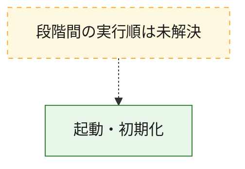
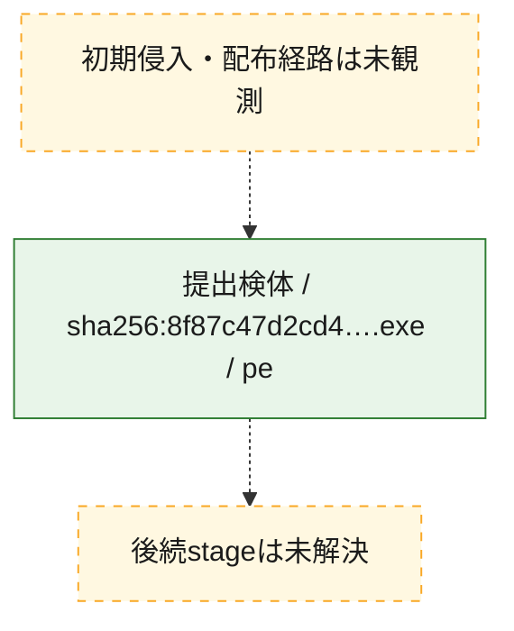
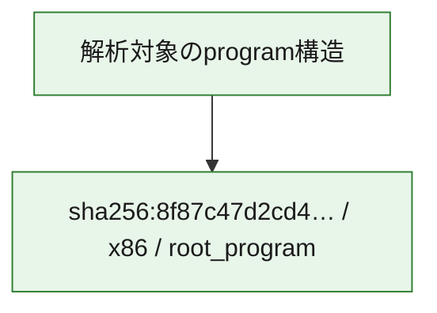

# 全体ロジック：8f87c47d2cd49eb5d0cc2dbcedf9822c74dcb8e87670ed3f1ec9f5a0d0a74844

代表関数の静的証跡から、起動・初期化の処理群を確認しました。

## 読み方

- phaseの掲載順は解析上の整理順です。observed_call_edgesがない段階間の実行順を断定しません。
- 図の実線は静的に観測した関係、点線と黄色のノードは未観測・未解決の関係を示します。
- 図は静的な要約であり、動的実行を再現するものではありません。
- 詳細な関数解説とfingerprintは[STATIC-LOGIC.md](STATIC-LOGIC.md)を参照してください。

## 静的可視化

### 実行フロー

### 感染チェーン

### モジュール関係

## 処理段階

### 1. 起動・初期化

entry pointから初期化と後続処理への移行を確認します。
確度: `confirmed_static_function_evidence_with_limits`

- `8f87c47d2cd49eb5d0cc2dbcedf9822c74dcb8e87670ed3f1ec9f5a0d0a74844:ghidra:0041946f` — 初期化と主要処理への分岐を行う入口関数です。 状態: `limited_bad_instruction_or_flow`、選定理由: `entry_point`, `large_function:instructions=64`, `meaningful_symbol_name`, `reviewed_call_centrality:55`, `role:entrypoint`, `small_program_complete_context`

## 観測したcall関係

- `ghidra-function:46cfc21882f1e10329d305e6` → `ghidra-external:5d08c46347c39812e87f9324` （`unclassified` → `unclassified`）
- `ghidra-function:46cfc21882f1e10329d305e6` → `ghidra-external:7a043dd92ca6a7aa04069567` （`unclassified` → `unclassified`）
- `ghidra-function:46cfc21882f1e10329d305e6` → `ghidra-external:c930f9cd0ae8bc7b51520ba8` （`unclassified` → `unclassified`）
- `ghidra-function:46cfc21882f1e10329d305e6` → `ghidra-external:da38cdfdd873f48acde71ed5` （`unclassified` → `unclassified`）
- `ghidra-function:46cfc21882f1e10329d305e6` → `ghidra-external:e04c29f412cd214cf171f405` （`unclassified` → `unclassified`）
- `ghidra-function:46cfc21882f1e10329d305e6` → `ghidra-function:0b10e674db98c7a5d2e37ec0` （`unclassified` → `unclassified`）
- `ghidra-function:46cfc21882f1e10329d305e6` → `ghidra-function:1355a51de78a69093aabedad` （`unclassified` → `unclassified`）
- `ghidra-function:46cfc21882f1e10329d305e6` → `ghidra-function:34af7136924e2daf46a7a4dc` （`unclassified` → `unclassified`）
- `ghidra-function:46cfc21882f1e10329d305e6` → `ghidra-function:34b9303f0fd86dc5f5aebc23` （`unclassified` → `unclassified`）
- `ghidra-function:46cfc21882f1e10329d305e6` → `ghidra-function:35d101456e2255e4e6e15f6f` （`unclassified` → `unclassified`）
- `ghidra-function:46cfc21882f1e10329d305e6` → `ghidra-function:36047518cab7e3cdeb9eb397` （`unclassified` → `unclassified`）
- `ghidra-function:46cfc21882f1e10329d305e6` → `ghidra-function:5a2321d86010491c6a1b4424` （`unclassified` → `unclassified`）
- `ghidra-function:46cfc21882f1e10329d305e6` → `ghidra-function:5f767fbf3a253817680e1fa4` （`unclassified` → `unclassified`）
- `ghidra-function:46cfc21882f1e10329d305e6` → `ghidra-function:6072da10caa861f7a38e16c7` （`unclassified` → `unclassified`）
- `ghidra-function:46cfc21882f1e10329d305e6` → `ghidra-function:6469432246b8b673b63bcc68` （`unclassified` → `unclassified`）
- `ghidra-function:46cfc21882f1e10329d305e6` → `ghidra-function:6a432ed259a7c719f21eb28e` （`unclassified` → `unclassified`）
- `ghidra-function:46cfc21882f1e10329d305e6` → `ghidra-function:8ba37720650c4ee420e075d5` （`unclassified` → `unclassified`）
- `ghidra-function:46cfc21882f1e10329d305e6` → `ghidra-function:940568b58ef14d6a1c8a55bc` （`unclassified` → `unclassified`）
- `ghidra-function:46cfc21882f1e10329d305e6` → `ghidra-function:95747c769c244e1090f2b081` （`unclassified` → `unclassified`）
- `ghidra-function:46cfc21882f1e10329d305e6` → `ghidra-function:99b4769db414bd4cfceb265c` （`unclassified` → `unclassified`）
- `ghidra-function:46cfc21882f1e10329d305e6` → `ghidra-function:a0b0052a382f7531a62c1bea` （`unclassified` → `unclassified`）
- `ghidra-function:46cfc21882f1e10329d305e6` → `ghidra-function:b4a62bffd5a47adb11010e9e` （`unclassified` → `unclassified`）
- `ghidra-function:46cfc21882f1e10329d305e6` → `ghidra-function:b5ebbe410231d013aef5c983` （`unclassified` → `unclassified`）
- `ghidra-function:46cfc21882f1e10329d305e6` → `ghidra-function:b6777645f1fa0568b61c3cd3` （`unclassified` → `unclassified`）
- `ghidra-function:46cfc21882f1e10329d305e6` → `ghidra-function:c94a169e683e040f3f02432c` （`unclassified` → `unclassified`）
- `ghidra-function:46cfc21882f1e10329d305e6` → `ghidra-function:cf0d666c6be93bed4092cda9` （`unclassified` → `unclassified`）
- `ghidra-function:46cfc21882f1e10329d305e6` → `ghidra-function:d2c17d90774655f291976fbc` （`unclassified` → `unclassified`）
- `ghidra-function:46cfc21882f1e10329d305e6` → `ghidra-function:d4fbfd7c75f75a702fb8b4bb` （`unclassified` → `unclassified`）
- `ghidra-function:46cfc21882f1e10329d305e6` → `ghidra-function:f4c9b7483494b3e8b67dc3af` （`unclassified` → `unclassified`）
- `ghidra-function:46cfc21882f1e10329d305e6` → `ghidra-function:f5f964dd80dc0b1514d5db42` （`unclassified` → `unclassified`）

## 解析範囲と制約

- 選定外関数は全体inventoryへ残しますが、関数本体の個別解説対象にはしていません。
- indirect call、難読化、packer、VM、壊れたcontrol flowによりcall関係が欠落する場合があります。
- 文書は静的解析に基づき、検体実行や外部通信による動的確認は行っていません。
