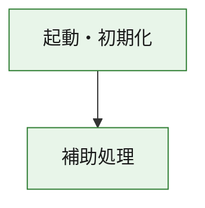
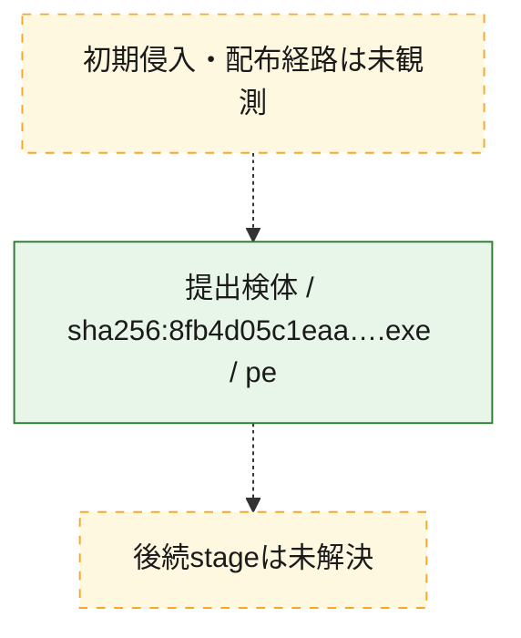
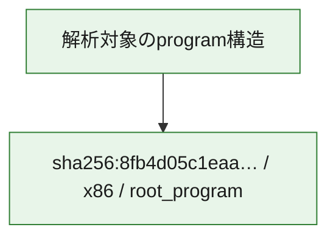

# 全体ロジック：8fb4d05c1eaa4eccc7425100a42a54ec2ce906f2c4aa85d0d2f108b0f62c8fd2

代表関数の静的証跡から、起動・初期化の処理群を確認しました。

## 読み方

- phaseの掲載順は解析上の整理順です。observed_call_edgesがない段階間の実行順を断定しません。
- 図の実線は静的に観測した関係、点線と黄色のノードは未観測・未解決の関係を示します。
- 図は静的な要約であり、動的実行を再現するものではありません。
- 詳細な関数解説とfingerprintは[STATIC-LOGIC.md](STATIC-LOGIC.md)を参照してください。

## 静的可視化

### 実行フロー

### 感染チェーン

### モジュール関係

## 処理段階

### 1. 起動・初期化

entry pointから初期化と後続処理への移行を確認します。
確度: `confirmed_static_function_evidence`

- `8fb4d05c1eaa4eccc7425100a42a54ec2ce906f2c4aa85d0d2f108b0f62c8fd2:ghidra:180001010` — 初期化と主要処理への分岐を行う入口関数です。 状態: `succeeded`、選定理由: `entry_point`, `meaningful_symbol_name`, `reviewed_call_centrality:22`, `role:entrypoint`, `small_program_complete_context`

### 2. 補助処理

主要処理を支える一般内部関数またはlibrary処理を確認します。
確度: `confirmed_static_function_evidence`

- `8fb4d05c1eaa4eccc7425100a42a54ec2ce906f2c4aa85d0d2f108b0f62c8fd2:ghidra:180001240` — 検体内部の一般処理を実装する関数です。 状態: `succeeded`、選定理由: `context_representative`, `reviewed_call_centrality:2`, `small_program_complete_context`
- `8fb4d05c1eaa4eccc7425100a42a54ec2ce906f2c4aa85d0d2f108b0f62c8fd2:ghidra:180001350` — 検体内部の一般処理を実装する関数です。 状態: `succeeded`、選定理由: `context_representative`, `reviewed_call_centrality:25`, `small_program_complete_context`
- `8fb4d05c1eaa4eccc7425100a42a54ec2ce906f2c4aa85d0d2f108b0f62c8fd2:ghidra:180003780` — 検体内部の一般処理を実装する関数です。 状態: `succeeded`、選定理由: `context_representative`, `reviewed_call_centrality:2`, `small_program_complete_context`
- `8fb4d05c1eaa4eccc7425100a42a54ec2ce906f2c4aa85d0d2f108b0f62c8fd2:ghidra:1800038e0` — 検体内部の一般処理を実装する関数です。 状態: `succeeded`、選定理由: `context_representative`, `reviewed_call_centrality:2`, `small_program_complete_context`

## 観測したcall関係

- `8fb4d05c1eaa4eccc7425100a42a54ec2ce906f2c4aa85d0d2f108b0f62c8fd2:ghidra:180001010` → `8fb4d05c1eaa4eccc7425100a42a54ec2ce906f2c4aa85d0d2f108b0f62c8fd2:ghidra:180001240` （`startup` → `support`）
- `8fb4d05c1eaa4eccc7425100a42a54ec2ce906f2c4aa85d0d2f108b0f62c8fd2:ghidra:180001010` → `8fb4d05c1eaa4eccc7425100a42a54ec2ce906f2c4aa85d0d2f108b0f62c8fd2:ghidra:180001350` （`startup` → `support`）
- `8fb4d05c1eaa4eccc7425100a42a54ec2ce906f2c4aa85d0d2f108b0f62c8fd2:ghidra:180001350` → `8fb4d05c1eaa4eccc7425100a42a54ec2ce906f2c4aa85d0d2f108b0f62c8fd2:ghidra:180001240` （`support` → `support`）
- `8fb4d05c1eaa4eccc7425100a42a54ec2ce906f2c4aa85d0d2f108b0f62c8fd2:ghidra:180001350` → `8fb4d05c1eaa4eccc7425100a42a54ec2ce906f2c4aa85d0d2f108b0f62c8fd2:ghidra:180003780` （`support` → `support`）
- `8fb4d05c1eaa4eccc7425100a42a54ec2ce906f2c4aa85d0d2f108b0f62c8fd2:ghidra:180001350` → `8fb4d05c1eaa4eccc7425100a42a54ec2ce906f2c4aa85d0d2f108b0f62c8fd2:ghidra:1800038e0` （`support` → `support`）
- `8fb4d05c1eaa4eccc7425100a42a54ec2ce906f2c4aa85d0d2f108b0f62c8fd2:ghidra:180003780` → `8fb4d05c1eaa4eccc7425100a42a54ec2ce906f2c4aa85d0d2f108b0f62c8fd2:ghidra:1800038e0` （`support` → `support`）
- `ghidra-function:1bebfeba2feb9c539ab6f1bb` → `ghidra-external:0f7eca0e0bd2d9894209d4c6` （`unclassified` → `unclassified`）
- `ghidra-function:1bebfeba2feb9c539ab6f1bb` → `ghidra-external:1289ff1a323e953693321e0e` （`unclassified` → `unclassified`）
- `ghidra-function:1bebfeba2feb9c539ab6f1bb` → `ghidra-external:1f50ede2be079608af11e386` （`unclassified` → `unclassified`）
- `ghidra-function:1bebfeba2feb9c539ab6f1bb` → `ghidra-external:4340f3edac09fd1cf52b962f` （`unclassified` → `unclassified`）
- `ghidra-function:1bebfeba2feb9c539ab6f1bb` → `ghidra-external:50f6d1a18946f42a0f37a19c` （`unclassified` → `unclassified`）
- `ghidra-function:1bebfeba2feb9c539ab6f1bb` → `ghidra-external:514acc454fcc815a5ac315d5` （`unclassified` → `unclassified`）
- `ghidra-function:1bebfeba2feb9c539ab6f1bb` → `ghidra-external:55c613aa0f7ef265474ad147` （`unclassified` → `unclassified`）
- `ghidra-function:1bebfeba2feb9c539ab6f1bb` → `ghidra-external:68c8c124dd8553069ea3e04c` （`unclassified` → `unclassified`）
- `ghidra-function:1bebfeba2feb9c539ab6f1bb` → `ghidra-external:7ee24c44c6c10c766017c7bd` （`unclassified` → `unclassified`）
- `ghidra-function:1bebfeba2feb9c539ab6f1bb` → `ghidra-external:820d4c01b8a465e6c4824ff4` （`unclassified` → `unclassified`）
- `ghidra-function:1bebfeba2feb9c539ab6f1bb` → `ghidra-external:8d9ec2581d9c5ef1464c1d71` （`unclassified` → `unclassified`）
- `ghidra-function:1bebfeba2feb9c539ab6f1bb` → `ghidra-external:980bc306b11027db7a7edc42` （`unclassified` → `unclassified`）
- `ghidra-function:1bebfeba2feb9c539ab6f1bb` → `ghidra-external:9dfa2e96a94aef0bde7b6638` （`unclassified` → `unclassified`）
- `ghidra-function:1bebfeba2feb9c539ab6f1bb` → `ghidra-external:a626783b867d9e5c428fc3e2` （`unclassified` → `unclassified`）
- `ghidra-function:1bebfeba2feb9c539ab6f1bb` → `ghidra-external:ae1d9fafd5d0413e2da7e8d0` （`unclassified` → `unclassified`）
- `ghidra-function:1bebfeba2feb9c539ab6f1bb` → `ghidra-external:af0abf251eecfa7e12ec6af8` （`unclassified` → `unclassified`）
- `ghidra-function:1bebfeba2feb9c539ab6f1bb` → `ghidra-external:d14ac90ce0390caa4dffc364` （`unclassified` → `unclassified`）
- `ghidra-function:1bebfeba2feb9c539ab6f1bb` → `ghidra-external:ddb41343f40b8f25c1d97529` （`unclassified` → `unclassified`）
- `ghidra-function:1bebfeba2feb9c539ab6f1bb` → `ghidra-external:e1074945b30c746d46f3a885` （`unclassified` → `unclassified`）
- `ghidra-function:1bebfeba2feb9c539ab6f1bb` → `ghidra-external:e1b2932f4ba8cff376a3e258` （`unclassified` → `unclassified`）
- `ghidra-function:1bebfeba2feb9c539ab6f1bb` → `ghidra-external:fa81c3c143c8e9ded3d7b49e` （`unclassified` → `unclassified`）
- `ghidra-function:1bebfeba2feb9c539ab6f1bb` → `ghidra-function:224c6be7334431bcdc292a78` （`unclassified` → `unclassified`）
- `ghidra-function:1bebfeba2feb9c539ab6f1bb` → `ghidra-function:c540a5a747bf39d94a45d3d5` （`unclassified` → `unclassified`）
- `ghidra-function:1bebfeba2feb9c539ab6f1bb` → `ghidra-function:d048837e4c67b1e959c23228` （`unclassified` → `unclassified`）
- `ghidra-function:224c6be7334431bcdc292a78` → `ghidra-function:c540a5a747bf39d94a45d3d5` （`unclassified` → `unclassified`）
- `ghidra-function:914590867313154f8fcff718` → `ghidra-function:128e13d44f40f6f60a1e1900` （`unclassified` → `unclassified`）
- `ghidra-function:914590867313154f8fcff718` → `ghidra-function:1bebfeba2feb9c539ab6f1bb` （`unclassified` → `unclassified`）
- `ghidra-function:914590867313154f8fcff718` → `ghidra-function:2f0413905bb748d85a1e6acb` （`unclassified` → `unclassified`）
- `ghidra-function:914590867313154f8fcff718` → `ghidra-function:30564df38ccdc16feb8890ab` （`unclassified` → `unclassified`）
- `ghidra-function:914590867313154f8fcff718` → `ghidra-function:39aabe0963cd043cb5ba3761` （`unclassified` → `unclassified`）
- `ghidra-function:914590867313154f8fcff718` → `ghidra-function:8c15d29248255f9d700ad6a3` （`unclassified` → `unclassified`）
- `ghidra-function:914590867313154f8fcff718` → `ghidra-function:a12ca4b20d0645d383e4b18c` （`unclassified` → `unclassified`）
- `ghidra-function:914590867313154f8fcff718` → `ghidra-function:a6c8d49383dac4eb5d8c67ce` （`unclassified` → `unclassified`）
- `ghidra-function:914590867313154f8fcff718` → `ghidra-function:ac74a0c727343552391aa5e1` （`unclassified` → `unclassified`）
- `ghidra-function:914590867313154f8fcff718` → `ghidra-function:c13f7ac6436fbda38d7f59f9` （`unclassified` → `unclassified`）
- `ghidra-function:914590867313154f8fcff718` → `ghidra-function:d048837e4c67b1e959c23228` （`unclassified` → `unclassified`）
- `ghidra-function:914590867313154f8fcff718` → `ghidra-function:d9cb38f63af0079e463ed633` （`unclassified` → `unclassified`）

## 解析範囲と制約

- 選定外関数は全体inventoryへ残しますが、関数本体の個別解説対象にはしていません。
- indirect call、難読化、packer、VM、壊れたcontrol flowによりcall関係が欠落する場合があります。
- 文書は静的解析に基づき、検体実行や外部通信による動的確認は行っていません。
