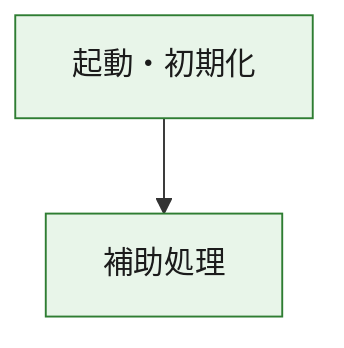
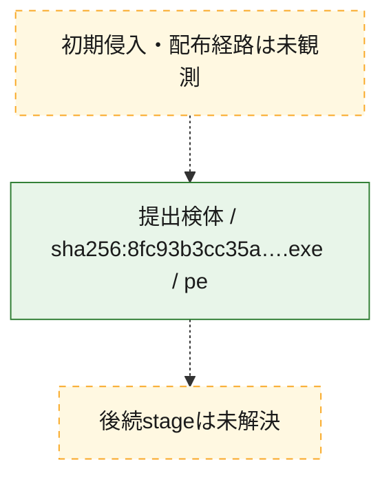
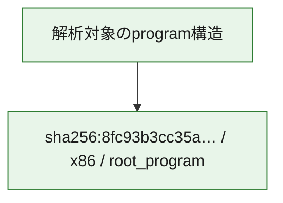

# 全体ロジック：8fc93b3cc35aa2f29cfbe87021df20ad33f3be9a06613c1bdadb9746980b9a23

代表関数の静的証跡から、起動・初期化の処理群を確認しました。

## 読み方

- phaseの掲載順は解析上の整理順です。observed_call_edgesがない段階間の実行順を断定しません。
- 図の実線は静的に観測した関係、点線と黄色のノードは未観測・未解決の関係を示します。
- 図は静的な要約であり、動的実行を再現するものではありません。
- 詳細な関数解説とfingerprintは[STATIC-LOGIC.md](STATIC-LOGIC.md)を参照してください。

## 静的可視化

### 実行フロー

### 感染チェーン

### モジュール関係

## 処理段階

### 1. 起動・初期化

entry pointから初期化と後続処理への移行を確認します。
確度: `confirmed_static_function_evidence`

- `8fc93b3cc35aa2f29cfbe87021df20ad33f3be9a06613c1bdadb9746980b9a23:ghidra:180001010` — 初期化と主要処理への分岐を行う入口関数です。 状態: `succeeded`、選定理由: `entry_point`, `meaningful_symbol_name`, `reviewed_call_centrality:22`, `role:entrypoint`, `small_program_complete_context`

### 2. 補助処理

主要処理を支える一般内部関数またはlibrary処理を確認します。
確度: `confirmed_static_function_evidence`

- `8fc93b3cc35aa2f29cfbe87021df20ad33f3be9a06613c1bdadb9746980b9a23:ghidra:180001240` — 検体内部の一般処理を実装する関数です。 状態: `succeeded`、選定理由: `context_representative`, `reviewed_call_centrality:2`, `small_program_complete_context`
- `8fc93b3cc35aa2f29cfbe87021df20ad33f3be9a06613c1bdadb9746980b9a23:ghidra:180001350` — 検体内部の一般処理を実装する関数です。 状態: `succeeded`、選定理由: `context_representative`, `reviewed_call_centrality:25`, `small_program_complete_context`
- `8fc93b3cc35aa2f29cfbe87021df20ad33f3be9a06613c1bdadb9746980b9a23:ghidra:180003780` — 検体内部の一般処理を実装する関数です。 状態: `succeeded`、選定理由: `context_representative`, `reviewed_call_centrality:2`, `small_program_complete_context`
- `8fc93b3cc35aa2f29cfbe87021df20ad33f3be9a06613c1bdadb9746980b9a23:ghidra:1800038e0` — 検体内部の一般処理を実装する関数です。 状態: `succeeded`、選定理由: `context_representative`, `reviewed_call_centrality:2`, `small_program_complete_context`

## 観測したcall関係

- `8fc93b3cc35aa2f29cfbe87021df20ad33f3be9a06613c1bdadb9746980b9a23:ghidra:180001010` → `8fc93b3cc35aa2f29cfbe87021df20ad33f3be9a06613c1bdadb9746980b9a23:ghidra:180001240` （`startup` → `support`）
- `8fc93b3cc35aa2f29cfbe87021df20ad33f3be9a06613c1bdadb9746980b9a23:ghidra:180001010` → `8fc93b3cc35aa2f29cfbe87021df20ad33f3be9a06613c1bdadb9746980b9a23:ghidra:180001350` （`startup` → `support`）
- `8fc93b3cc35aa2f29cfbe87021df20ad33f3be9a06613c1bdadb9746980b9a23:ghidra:180001350` → `8fc93b3cc35aa2f29cfbe87021df20ad33f3be9a06613c1bdadb9746980b9a23:ghidra:180001240` （`support` → `support`）
- `8fc93b3cc35aa2f29cfbe87021df20ad33f3be9a06613c1bdadb9746980b9a23:ghidra:180001350` → `8fc93b3cc35aa2f29cfbe87021df20ad33f3be9a06613c1bdadb9746980b9a23:ghidra:180003780` （`support` → `support`）
- `8fc93b3cc35aa2f29cfbe87021df20ad33f3be9a06613c1bdadb9746980b9a23:ghidra:180001350` → `8fc93b3cc35aa2f29cfbe87021df20ad33f3be9a06613c1bdadb9746980b9a23:ghidra:1800038e0` （`support` → `support`）
- `8fc93b3cc35aa2f29cfbe87021df20ad33f3be9a06613c1bdadb9746980b9a23:ghidra:180003780` → `8fc93b3cc35aa2f29cfbe87021df20ad33f3be9a06613c1bdadb9746980b9a23:ghidra:1800038e0` （`support` → `support`）
- `ghidra-function:2ceb6826bc69b471744d6980` → `ghidra-function:7d381cccd91a10d3847fd480` （`unclassified` → `unclassified`）
- `ghidra-function:3b3340d44b23405bef8a7082` → `ghidra-function:13fa754e3dd4ae77f4b1e6c4` （`unclassified` → `unclassified`）
- `ghidra-function:3b3340d44b23405bef8a7082` → `ghidra-function:2cf3b23cbdad5894c4328498` （`unclassified` → `unclassified`）
- `ghidra-function:3b3340d44b23405bef8a7082` → `ghidra-function:43873f2caa90faea8d380403` （`unclassified` → `unclassified`）
- `ghidra-function:3b3340d44b23405bef8a7082` → `ghidra-function:476b081e8a3f4114996f7b61` （`unclassified` → `unclassified`）
- `ghidra-function:3b3340d44b23405bef8a7082` → `ghidra-function:4c8863eb58fe014c975c6bf3` （`unclassified` → `unclassified`）
- `ghidra-function:3b3340d44b23405bef8a7082` → `ghidra-function:71f64e27da8d01072d39dc69` （`unclassified` → `unclassified`）
- `ghidra-function:3b3340d44b23405bef8a7082` → `ghidra-function:a8726a11df5a163413ae7d96` （`unclassified` → `unclassified`）
- `ghidra-function:3b3340d44b23405bef8a7082` → `ghidra-function:b179559e626fdeba93157b4c` （`unclassified` → `unclassified`）
- `ghidra-function:3b3340d44b23405bef8a7082` → `ghidra-function:b56d01f05732c149ffbbfab5` （`unclassified` → `unclassified`）
- `ghidra-function:3b3340d44b23405bef8a7082` → `ghidra-function:cc2bdd8e5f0403f4dcb048bf` （`unclassified` → `unclassified`）
- `ghidra-function:3b3340d44b23405bef8a7082` → `ghidra-function:e938a0dd03cd01f24d018634` （`unclassified` → `unclassified`）
- `ghidra-function:3b3340d44b23405bef8a7082` → `ghidra-function:fa1e1728563d1399907e9259` （`unclassified` → `unclassified`）
- `ghidra-function:e938a0dd03cd01f24d018634` → `ghidra-external:00c136c29277142b7912d4b7` （`unclassified` → `unclassified`）
- `ghidra-function:e938a0dd03cd01f24d018634` → `ghidra-external:0631f5dffa6b785fc5081304` （`unclassified` → `unclassified`）
- `ghidra-function:e938a0dd03cd01f24d018634` → `ghidra-external:352af17aa63cb21d25f332de` （`unclassified` → `unclassified`）
- `ghidra-function:e938a0dd03cd01f24d018634` → `ghidra-external:368b0e7f2bd09a5f49aeaabb` （`unclassified` → `unclassified`）
- `ghidra-function:e938a0dd03cd01f24d018634` → `ghidra-external:40ccc01720275dd50b1aed19` （`unclassified` → `unclassified`）
- `ghidra-function:e938a0dd03cd01f24d018634` → `ghidra-external:42a5931619334f6f0f7d4f5b` （`unclassified` → `unclassified`）
- `ghidra-function:e938a0dd03cd01f24d018634` → `ghidra-external:4673f8935258f7cfb5514012` （`unclassified` → `unclassified`）
- `ghidra-function:e938a0dd03cd01f24d018634` → `ghidra-external:4a6987999462362c42177d81` （`unclassified` → `unclassified`）
- `ghidra-function:e938a0dd03cd01f24d018634` → `ghidra-external:53b6b03b30a6dafc9ae72ce6` （`unclassified` → `unclassified`）
- `ghidra-function:e938a0dd03cd01f24d018634` → `ghidra-external:6f7fb839ba5f04311fa19b72` （`unclassified` → `unclassified`）
- `ghidra-function:e938a0dd03cd01f24d018634` → `ghidra-external:7e31b058330d893e7ff934d2` （`unclassified` → `unclassified`）
- `ghidra-function:e938a0dd03cd01f24d018634` → `ghidra-external:95bbbe93aefcd735b3134079` （`unclassified` → `unclassified`）
- `ghidra-function:e938a0dd03cd01f24d018634` → `ghidra-external:963e83381941e2455cfddf37` （`unclassified` → `unclassified`）
- `ghidra-function:e938a0dd03cd01f24d018634` → `ghidra-external:97caac926a2b286fa2af3d24` （`unclassified` → `unclassified`）
- `ghidra-function:e938a0dd03cd01f24d018634` → `ghidra-external:a0d3b63e8703ea6a4152efe1` （`unclassified` → `unclassified`）
- `ghidra-function:e938a0dd03cd01f24d018634` → `ghidra-external:ad53a78ef79097a0f6cb485b` （`unclassified` → `unclassified`）
- `ghidra-function:e938a0dd03cd01f24d018634` → `ghidra-external:c01edf03d67c1414f822ea06` （`unclassified` → `unclassified`）
- `ghidra-function:e938a0dd03cd01f24d018634` → `ghidra-external:c5bcafbcf73bdc475de2ac3d` （`unclassified` → `unclassified`）
- `ghidra-function:e938a0dd03cd01f24d018634` → `ghidra-external:ca5f09d2278ba77e87e3c45e` （`unclassified` → `unclassified`）
- `ghidra-function:e938a0dd03cd01f24d018634` → `ghidra-external:ebafe92206e848207a3050bc` （`unclassified` → `unclassified`）
- `ghidra-function:e938a0dd03cd01f24d018634` → `ghidra-external:ed8fee035d7b37252d809fb3` （`unclassified` → `unclassified`）
- `ghidra-function:e938a0dd03cd01f24d018634` → `ghidra-function:2ceb6826bc69b471744d6980` （`unclassified` → `unclassified`）
- `ghidra-function:e938a0dd03cd01f24d018634` → `ghidra-function:7d381cccd91a10d3847fd480` （`unclassified` → `unclassified`）
- `ghidra-function:e938a0dd03cd01f24d018634` → `ghidra-function:b179559e626fdeba93157b4c` （`unclassified` → `unclassified`）

## 解析範囲と制約

- 選定外関数は全体inventoryへ残しますが、関数本体の個別解説対象にはしていません。
- indirect call、難読化、packer、VM、壊れたcontrol flowによりcall関係が欠落する場合があります。
- 文書は静的解析に基づき、検体実行や外部通信による動的確認は行っていません。
