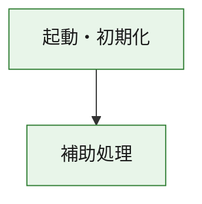
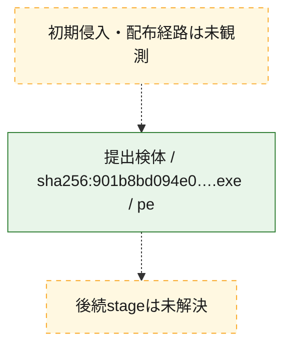
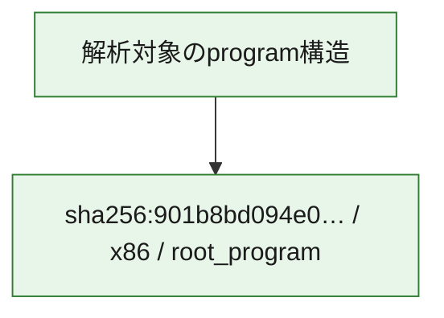

# 全体ロジック：901b8bd094e039839ec9422630d8cebe0e8dcb923e094c73090af64d26ceac1d

代表関数の静的証跡から、起動・初期化の処理群を確認しました。

## 読み方

- phaseの掲載順は解析上の整理順です。observed_call_edgesがない段階間の実行順を断定しません。
- 図の実線は静的に観測した関係、点線と黄色のノードは未観測・未解決の関係を示します。
- 図は静的な要約であり、動的実行を再現するものではありません。
- 詳細な関数解説とfingerprintは[STATIC-LOGIC.md](STATIC-LOGIC.md)を参照してください。

## 静的可視化

### 実行フロー

### 感染チェーン

### モジュール関係

## 処理段階

### 1. 起動・初期化

entry pointから初期化と後続処理への移行を確認します。
確度: `confirmed_static_function_evidence`

- `901b8bd094e039839ec9422630d8cebe0e8dcb923e094c73090af64d26ceac1d:ghidra:180001010` — 初期化と主要処理への分岐を行う入口関数です。 状態: `succeeded`、選定理由: `entry_point`, `meaningful_symbol_name`, `reviewed_call_centrality:22`, `role:entrypoint`, `small_program_complete_context`

### 2. 補助処理

主要処理を支える一般内部関数またはlibrary処理を確認します。
確度: `confirmed_static_function_evidence`

- `901b8bd094e039839ec9422630d8cebe0e8dcb923e094c73090af64d26ceac1d:ghidra:180001240` — 検体内部の一般処理を実装する関数です。 状態: `succeeded`、選定理由: `context_representative`, `reviewed_call_centrality:2`, `small_program_complete_context`
- `901b8bd094e039839ec9422630d8cebe0e8dcb923e094c73090af64d26ceac1d:ghidra:180001350` — 検体内部の一般処理を実装する関数です。 状態: `succeeded`、選定理由: `context_representative`, `reviewed_call_centrality:25`, `small_program_complete_context`
- `901b8bd094e039839ec9422630d8cebe0e8dcb923e094c73090af64d26ceac1d:ghidra:180003780` — 検体内部の一般処理を実装する関数です。 状態: `succeeded`、選定理由: `context_representative`, `reviewed_call_centrality:2`, `small_program_complete_context`
- `901b8bd094e039839ec9422630d8cebe0e8dcb923e094c73090af64d26ceac1d:ghidra:1800038e0` — 検体内部の一般処理を実装する関数です。 状態: `succeeded`、選定理由: `context_representative`, `reviewed_call_centrality:2`, `small_program_complete_context`

## 観測したcall関係

- `901b8bd094e039839ec9422630d8cebe0e8dcb923e094c73090af64d26ceac1d:ghidra:180001010` → `901b8bd094e039839ec9422630d8cebe0e8dcb923e094c73090af64d26ceac1d:ghidra:180001240` （`startup` → `support`）
- `901b8bd094e039839ec9422630d8cebe0e8dcb923e094c73090af64d26ceac1d:ghidra:180001010` → `901b8bd094e039839ec9422630d8cebe0e8dcb923e094c73090af64d26ceac1d:ghidra:180001350` （`startup` → `support`）
- `901b8bd094e039839ec9422630d8cebe0e8dcb923e094c73090af64d26ceac1d:ghidra:180001350` → `901b8bd094e039839ec9422630d8cebe0e8dcb923e094c73090af64d26ceac1d:ghidra:180001240` （`support` → `support`）
- `901b8bd094e039839ec9422630d8cebe0e8dcb923e094c73090af64d26ceac1d:ghidra:180001350` → `901b8bd094e039839ec9422630d8cebe0e8dcb923e094c73090af64d26ceac1d:ghidra:180003780` （`support` → `support`）
- `901b8bd094e039839ec9422630d8cebe0e8dcb923e094c73090af64d26ceac1d:ghidra:180001350` → `901b8bd094e039839ec9422630d8cebe0e8dcb923e094c73090af64d26ceac1d:ghidra:1800038e0` （`support` → `support`）
- `901b8bd094e039839ec9422630d8cebe0e8dcb923e094c73090af64d26ceac1d:ghidra:180003780` → `901b8bd094e039839ec9422630d8cebe0e8dcb923e094c73090af64d26ceac1d:ghidra:1800038e0` （`support` → `support`）
- `ghidra-function:75184b1a144d75f572910a73` → `ghidra-function:e1d6ac764eec2763fcf410ba` （`unclassified` → `unclassified`）
- `ghidra-function:939b25b3c76300ce4bc2e80a` → `ghidra-external:0b5cb03f4a6d58d81a6e2974` （`unclassified` → `unclassified`）
- `ghidra-function:939b25b3c76300ce4bc2e80a` → `ghidra-external:29e0157a96071c2768db3ffc` （`unclassified` → `unclassified`）
- `ghidra-function:939b25b3c76300ce4bc2e80a` → `ghidra-external:33a2b95b27e2f9fecdbbe831` （`unclassified` → `unclassified`）
- `ghidra-function:939b25b3c76300ce4bc2e80a` → `ghidra-external:34fc9cd8fd1cdea1af9c5508` （`unclassified` → `unclassified`）
- `ghidra-function:939b25b3c76300ce4bc2e80a` → `ghidra-external:511d31680cd446f629a3f00e` （`unclassified` → `unclassified`）
- `ghidra-function:939b25b3c76300ce4bc2e80a` → `ghidra-external:536e6980a9e73b7517486aa1` （`unclassified` → `unclassified`）
- `ghidra-function:939b25b3c76300ce4bc2e80a` → `ghidra-external:5931efe0e3ae7cfff7e45c5d` （`unclassified` → `unclassified`）
- `ghidra-function:939b25b3c76300ce4bc2e80a` → `ghidra-external:59cde689a9bcb6c1d75e0334` （`unclassified` → `unclassified`）
- `ghidra-function:939b25b3c76300ce4bc2e80a` → `ghidra-external:5f3bf6c613e60fffa5cb120e` （`unclassified` → `unclassified`）
- `ghidra-function:939b25b3c76300ce4bc2e80a` → `ghidra-external:7006d8cf8f219eb33ebca4da` （`unclassified` → `unclassified`）
- `ghidra-function:939b25b3c76300ce4bc2e80a` → `ghidra-external:732f3a55119a9a87d8a04053` （`unclassified` → `unclassified`）
- `ghidra-function:939b25b3c76300ce4bc2e80a` → `ghidra-external:78f39dac2e5112f190147149` （`unclassified` → `unclassified`）
- `ghidra-function:939b25b3c76300ce4bc2e80a` → `ghidra-external:a5d44ad0d1eb514675171611` （`unclassified` → `unclassified`）
- `ghidra-function:939b25b3c76300ce4bc2e80a` → `ghidra-external:b748f85bacb0e923e5b05d02` （`unclassified` → `unclassified`）
- `ghidra-function:939b25b3c76300ce4bc2e80a` → `ghidra-external:cca0ba93b2aea2a7debe836d` （`unclassified` → `unclassified`）
- `ghidra-function:939b25b3c76300ce4bc2e80a` → `ghidra-external:d28050afa4e3f183a5589aaa` （`unclassified` → `unclassified`）
- `ghidra-function:939b25b3c76300ce4bc2e80a` → `ghidra-external:d337917651d44fc322712543` （`unclassified` → `unclassified`）
- `ghidra-function:939b25b3c76300ce4bc2e80a` → `ghidra-external:dc16d559780fc6d6fdc024c9` （`unclassified` → `unclassified`）
- `ghidra-function:939b25b3c76300ce4bc2e80a` → `ghidra-external:eeffad55f388870bd54eca33` （`unclassified` → `unclassified`）
- `ghidra-function:939b25b3c76300ce4bc2e80a` → `ghidra-external:f41f9bfb202fcf8d21d71765` （`unclassified` → `unclassified`）
- `ghidra-function:939b25b3c76300ce4bc2e80a` → `ghidra-external:f4e4e1df3cc1e16734c15c56` （`unclassified` → `unclassified`）
- `ghidra-function:939b25b3c76300ce4bc2e80a` → `ghidra-function:75184b1a144d75f572910a73` （`unclassified` → `unclassified`）
- `ghidra-function:939b25b3c76300ce4bc2e80a` → `ghidra-function:d2e064cd18b0b21a8ef62fbc` （`unclassified` → `unclassified`）
- `ghidra-function:939b25b3c76300ce4bc2e80a` → `ghidra-function:e1d6ac764eec2763fcf410ba` （`unclassified` → `unclassified`）
- `ghidra-function:cfbc177ef88b6233a992b9ca` → `ghidra-function:2a840493cb3b206b7d92f102` （`unclassified` → `unclassified`）
- `ghidra-function:cfbc177ef88b6233a992b9ca` → `ghidra-function:4719e7da0c0598cf808d49e2` （`unclassified` → `unclassified`）
- `ghidra-function:cfbc177ef88b6233a992b9ca` → `ghidra-function:4a4af692d393be8dc99f17df` （`unclassified` → `unclassified`）
- `ghidra-function:cfbc177ef88b6233a992b9ca` → `ghidra-function:543bff1f20aa804e25990b94` （`unclassified` → `unclassified`）
- `ghidra-function:cfbc177ef88b6233a992b9ca` → `ghidra-function:782b6d1adec9de99e1edfff2` （`unclassified` → `unclassified`）
- `ghidra-function:cfbc177ef88b6233a992b9ca` → `ghidra-function:7b6759c067e9e14c52364b80` （`unclassified` → `unclassified`）
- `ghidra-function:cfbc177ef88b6233a992b9ca` → `ghidra-function:939b25b3c76300ce4bc2e80a` （`unclassified` → `unclassified`）
- `ghidra-function:cfbc177ef88b6233a992b9ca` → `ghidra-function:9862a1f30f861d1f8e3c8035` （`unclassified` → `unclassified`）
- `ghidra-function:cfbc177ef88b6233a992b9ca` → `ghidra-function:aafb0c288dcd7596bf47cc51` （`unclassified` → `unclassified`）
- `ghidra-function:cfbc177ef88b6233a992b9ca` → `ghidra-function:afdbbab1528d1d7bd68a373a` （`unclassified` → `unclassified`）
- `ghidra-function:cfbc177ef88b6233a992b9ca` → `ghidra-function:b9b31eacc178ec8993b17084` （`unclassified` → `unclassified`）
- `ghidra-function:cfbc177ef88b6233a992b9ca` → `ghidra-function:d2e064cd18b0b21a8ef62fbc` （`unclassified` → `unclassified`）

## 解析範囲と制約

- 選定外関数は全体inventoryへ残しますが、関数本体の個別解説対象にはしていません。
- indirect call、難読化、packer、VM、壊れたcontrol flowによりcall関係が欠落する場合があります。
- 文書は静的解析に基づき、検体実行や外部通信による動的確認は行っていません。
