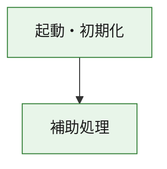
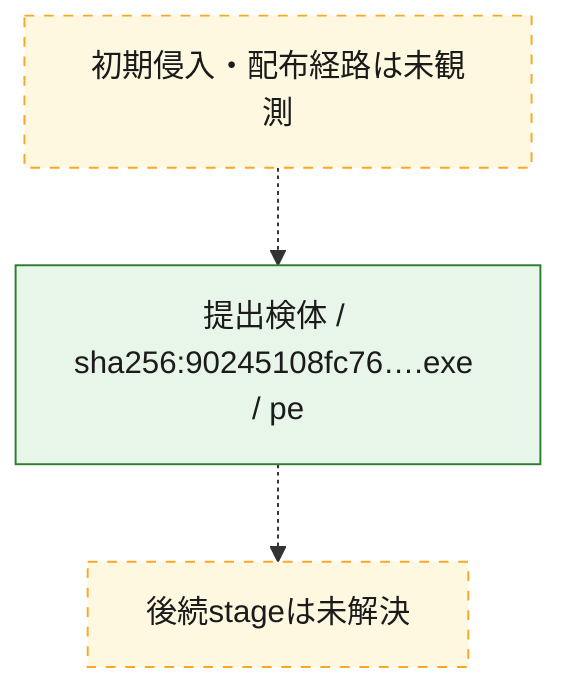
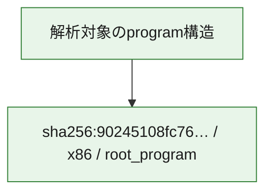

# 全体ロジック：90245108fc7685d642bc598f3fe334e6ac4d7a62eff924a5618d4d839a4e23d2

代表関数の静的証跡から、起動・初期化の処理群を確認しました。

## 読み方

- phaseの掲載順は解析上の整理順です。observed_call_edgesがない段階間の実行順を断定しません。
- 図の実線は静的に観測した関係、点線と黄色のノードは未観測・未解決の関係を示します。
- 図は静的な要約であり、動的実行を再現するものではありません。
- 詳細な関数解説とfingerprintは[STATIC-LOGIC.md](STATIC-LOGIC.md)を参照してください。

## 静的可視化

### 実行フロー

### 感染チェーン

### モジュール関係

## 処理段階

### 1. 起動・初期化

entry pointから初期化と後続処理への移行を確認します。
確度: `confirmed_static_function_evidence`

- `90245108fc7685d642bc598f3fe334e6ac4d7a62eff924a5618d4d839a4e23d2:ghidra:180001010` — 初期化と主要処理への分岐を行う入口関数です。 状態: `succeeded`、選定理由: `entry_point`, `meaningful_symbol_name`, `reviewed_call_centrality:22`, `role:entrypoint`, `small_program_complete_context`

### 2. 補助処理

主要処理を支える一般内部関数またはlibrary処理を確認します。
確度: `confirmed_static_function_evidence`

- `90245108fc7685d642bc598f3fe334e6ac4d7a62eff924a5618d4d839a4e23d2:ghidra:180001240` — 検体内部の一般処理を実装する関数です。 状態: `succeeded`、選定理由: `context_representative`, `reviewed_call_centrality:2`, `small_program_complete_context`
- `90245108fc7685d642bc598f3fe334e6ac4d7a62eff924a5618d4d839a4e23d2:ghidra:180001350` — 検体内部の一般処理を実装する関数です。 状態: `succeeded`、選定理由: `context_representative`, `reviewed_call_centrality:25`, `small_program_complete_context`
- `90245108fc7685d642bc598f3fe334e6ac4d7a62eff924a5618d4d839a4e23d2:ghidra:180003780` — 検体内部の一般処理を実装する関数です。 状態: `succeeded`、選定理由: `context_representative`, `reviewed_call_centrality:2`, `small_program_complete_context`
- `90245108fc7685d642bc598f3fe334e6ac4d7a62eff924a5618d4d839a4e23d2:ghidra:1800038e0` — 検体内部の一般処理を実装する関数です。 状態: `succeeded`、選定理由: `context_representative`, `reviewed_call_centrality:2`, `small_program_complete_context`

## 観測したcall関係

- `90245108fc7685d642bc598f3fe334e6ac4d7a62eff924a5618d4d839a4e23d2:ghidra:180001010` → `90245108fc7685d642bc598f3fe334e6ac4d7a62eff924a5618d4d839a4e23d2:ghidra:180001240` （`startup` → `support`）
- `90245108fc7685d642bc598f3fe334e6ac4d7a62eff924a5618d4d839a4e23d2:ghidra:180001010` → `90245108fc7685d642bc598f3fe334e6ac4d7a62eff924a5618d4d839a4e23d2:ghidra:180001350` （`startup` → `support`）
- `90245108fc7685d642bc598f3fe334e6ac4d7a62eff924a5618d4d839a4e23d2:ghidra:180001350` → `90245108fc7685d642bc598f3fe334e6ac4d7a62eff924a5618d4d839a4e23d2:ghidra:180001240` （`support` → `support`）
- `90245108fc7685d642bc598f3fe334e6ac4d7a62eff924a5618d4d839a4e23d2:ghidra:180001350` → `90245108fc7685d642bc598f3fe334e6ac4d7a62eff924a5618d4d839a4e23d2:ghidra:180003780` （`support` → `support`）
- `90245108fc7685d642bc598f3fe334e6ac4d7a62eff924a5618d4d839a4e23d2:ghidra:180001350` → `90245108fc7685d642bc598f3fe334e6ac4d7a62eff924a5618d4d839a4e23d2:ghidra:1800038e0` （`support` → `support`）
- `90245108fc7685d642bc598f3fe334e6ac4d7a62eff924a5618d4d839a4e23d2:ghidra:180003780` → `90245108fc7685d642bc598f3fe334e6ac4d7a62eff924a5618d4d839a4e23d2:ghidra:1800038e0` （`support` → `support`）
- `ghidra-function:1850f2accd612f1927f10d67` → `ghidra-external:01af79b276404f591d6fbf30` （`unclassified` → `unclassified`）
- `ghidra-function:1850f2accd612f1927f10d67` → `ghidra-external:187c63ea6817e2237b2c49d0` （`unclassified` → `unclassified`）
- `ghidra-function:1850f2accd612f1927f10d67` → `ghidra-external:2d973fbf18c496b1fa2bfb47` （`unclassified` → `unclassified`）
- `ghidra-function:1850f2accd612f1927f10d67` → `ghidra-external:2f639ae77018117e9e6236b0` （`unclassified` → `unclassified`）
- `ghidra-function:1850f2accd612f1927f10d67` → `ghidra-external:397651b8bd2b58e2b851ad06` （`unclassified` → `unclassified`）
- `ghidra-function:1850f2accd612f1927f10d67` → `ghidra-external:3a65e5a64cfa6bf7954844e6` （`unclassified` → `unclassified`）
- `ghidra-function:1850f2accd612f1927f10d67` → `ghidra-external:47231748824ee5ecb9d6069d` （`unclassified` → `unclassified`）
- `ghidra-function:1850f2accd612f1927f10d67` → `ghidra-external:507e1b1dcc85412539bfc1e7` （`unclassified` → `unclassified`）
- `ghidra-function:1850f2accd612f1927f10d67` → `ghidra-external:74a096b7d28ca2d5b3ded0f6` （`unclassified` → `unclassified`）
- `ghidra-function:1850f2accd612f1927f10d67` → `ghidra-external:7c7a88041742c17f60753201` （`unclassified` → `unclassified`）
- `ghidra-function:1850f2accd612f1927f10d67` → `ghidra-external:7d32e1f2c6f47a0eed69bf76` （`unclassified` → `unclassified`）
- `ghidra-function:1850f2accd612f1927f10d67` → `ghidra-external:8335400da889ce45e07627f8` （`unclassified` → `unclassified`）
- `ghidra-function:1850f2accd612f1927f10d67` → `ghidra-external:a828ff904ba8011a5f89ebf5` （`unclassified` → `unclassified`）
- `ghidra-function:1850f2accd612f1927f10d67` → `ghidra-external:cb8c5790b54a971ea616d43f` （`unclassified` → `unclassified`）
- `ghidra-function:1850f2accd612f1927f10d67` → `ghidra-external:ce8a1f4a8cc43b48831744a2` （`unclassified` → `unclassified`）
- `ghidra-function:1850f2accd612f1927f10d67` → `ghidra-external:dc96d094581b459a5a0446c8` （`unclassified` → `unclassified`）
- `ghidra-function:1850f2accd612f1927f10d67` → `ghidra-external:e004d3edd1be71ae5a0cb23f` （`unclassified` → `unclassified`）
- `ghidra-function:1850f2accd612f1927f10d67` → `ghidra-external:eeb24d0dc4233d468149d7b2` （`unclassified` → `unclassified`）
- `ghidra-function:1850f2accd612f1927f10d67` → `ghidra-external:fb0448b14064426ef724836a` （`unclassified` → `unclassified`）
- `ghidra-function:1850f2accd612f1927f10d67` → `ghidra-external:fb267bb7cb972d99cce42417` （`unclassified` → `unclassified`）
- `ghidra-function:1850f2accd612f1927f10d67` → `ghidra-external:fce934a99dbe66fe1654290b` （`unclassified` → `unclassified`）
- `ghidra-function:1850f2accd612f1927f10d67` → `ghidra-function:674dc725cadb3e4cac55aa3a` （`unclassified` → `unclassified`）
- `ghidra-function:1850f2accd612f1927f10d67` → `ghidra-function:8232192ecebb0025465cc8a2` （`unclassified` → `unclassified`）
- `ghidra-function:1850f2accd612f1927f10d67` → `ghidra-function:b3f279926bf6d4c5b2023e79` （`unclassified` → `unclassified`）
- `ghidra-function:b3f279926bf6d4c5b2023e79` → `ghidra-function:674dc725cadb3e4cac55aa3a` （`unclassified` → `unclassified`）
- `ghidra-function:d8c5963ee1caf46040f3d6ca` → `ghidra-function:0638a9fab13c924e3eff6673` （`unclassified` → `unclassified`）
- `ghidra-function:d8c5963ee1caf46040f3d6ca` → `ghidra-function:1850f2accd612f1927f10d67` （`unclassified` → `unclassified`）
- `ghidra-function:d8c5963ee1caf46040f3d6ca` → `ghidra-function:407f4dd9fd9c115943853fa5` （`unclassified` → `unclassified`）
- `ghidra-function:d8c5963ee1caf46040f3d6ca` → `ghidra-function:52a873a314754261003dca46` （`unclassified` → `unclassified`）
- `ghidra-function:d8c5963ee1caf46040f3d6ca` → `ghidra-function:54bf986e739d34911237c1d9` （`unclassified` → `unclassified`）
- `ghidra-function:d8c5963ee1caf46040f3d6ca` → `ghidra-function:8232192ecebb0025465cc8a2` （`unclassified` → `unclassified`）
- `ghidra-function:d8c5963ee1caf46040f3d6ca` → `ghidra-function:8ec8fa8264516cb7febc0d57` （`unclassified` → `unclassified`）
- `ghidra-function:d8c5963ee1caf46040f3d6ca` → `ghidra-function:aa69ca95e6addfad460c9efd` （`unclassified` → `unclassified`）
- `ghidra-function:d8c5963ee1caf46040f3d6ca` → `ghidra-function:acb16277d510de8808e4eb56` （`unclassified` → `unclassified`）
- `ghidra-function:d8c5963ee1caf46040f3d6ca` → `ghidra-function:c0f93b4ca9909344cc2f47d7` （`unclassified` → `unclassified`）
- `ghidra-function:d8c5963ee1caf46040f3d6ca` → `ghidra-function:d9cae3bf58d506ec7eda5e6b` （`unclassified` → `unclassified`）
- `ghidra-function:d8c5963ee1caf46040f3d6ca` → `ghidra-function:f2f998be24307bdd6b13daed` （`unclassified` → `unclassified`）

## 解析範囲と制約

- 選定外関数は全体inventoryへ残しますが、関数本体の個別解説対象にはしていません。
- indirect call、難読化、packer、VM、壊れたcontrol flowによりcall関係が欠落する場合があります。
- 文書は静的解析に基づき、検体実行や外部通信による動的確認は行っていません。
