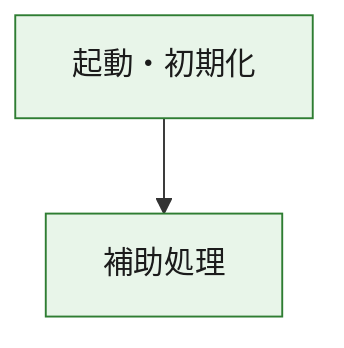
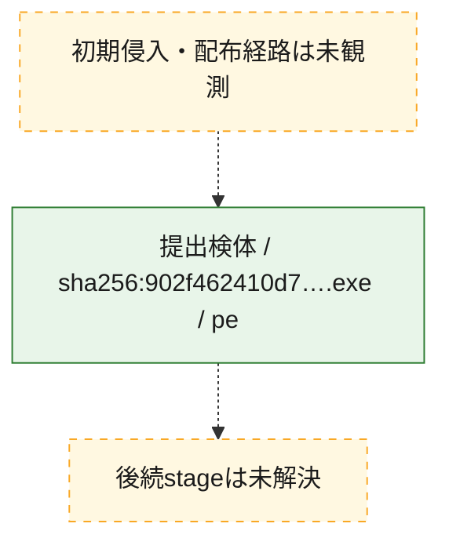
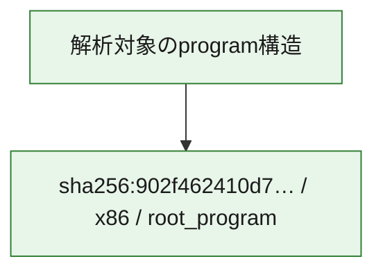

# 全体ロジック：902f462410d7b2ae86c2eccb2d248797d6abe2c36c7a4c0dcaf3cbbb7a80c697

代表関数の静的証跡から、起動・初期化の処理群を確認しました。

## 読み方

- phaseの掲載順は解析上の整理順です。observed_call_edgesがない段階間の実行順を断定しません。
- 図の実線は静的に観測した関係、点線と黄色のノードは未観測・未解決の関係を示します。
- 図は静的な要約であり、動的実行を再現するものではありません。
- 詳細な関数解説とfingerprintは[STATIC-LOGIC.md](STATIC-LOGIC.md)を参照してください。

## 静的可視化

### 実行フロー

### 感染チェーン

### モジュール関係

## 処理段階

### 1. 起動・初期化

entry pointから初期化と後続処理への移行を確認します。
確度: `confirmed_static_function_evidence`

- `902f462410d7b2ae86c2eccb2d248797d6abe2c36c7a4c0dcaf3cbbb7a80c697:ghidra:1400013e0` — 初期化と主要処理への分岐を行う入口関数です。 状態: `succeeded`、選定理由: `entry_point`, `meaningful_symbol_name`, `reviewed_call_centrality:1`, `role:entrypoint`

### 2. 補助処理

主要処理を支える一般内部関数またはlibrary処理を確認します。
確度: `confirmed_static_function_evidence`

- `902f462410d7b2ae86c2eccb2d248797d6abe2c36c7a4c0dcaf3cbbb7a80c697:ghidra:140001000` — 検体内部の一般処理を実装する関数です。 状態: `succeeded`、選定理由: `context_representative`
- `902f462410d7b2ae86c2eccb2d248797d6abe2c36c7a4c0dcaf3cbbb7a80c697:ghidra:140001010` — 検体内部の一般処理を実装する関数です。 状態: `succeeded`、選定理由: `context_representative`, `reviewed_call_centrality:6`
- `902f462410d7b2ae86c2eccb2d248797d6abe2c36c7a4c0dcaf3cbbb7a80c697:ghidra:140001140` — 検体内部の一般処理を実装する関数です。 状態: `succeeded`、選定理由: `context_representative`, `reviewed_call_centrality:1`
- `902f462410d7b2ae86c2eccb2d248797d6abe2c36c7a4c0dcaf3cbbb7a80c697:ghidra:140001190` — 検体内部の一般処理を実装する関数です。 状態: `succeeded`、選定理由: `context_representative`, `reviewed_call_centrality:21`
- `902f462410d7b2ae86c2eccb2d248797d6abe2c36c7a4c0dcaf3cbbb7a80c697:ghidra:140001410` — 検体内部の一般処理を実装する関数です。 状態: `succeeded`、選定理由: `context_representative`, `reviewed_call_centrality:1`
- `902f462410d7b2ae86c2eccb2d248797d6abe2c36c7a4c0dcaf3cbbb7a80c697:ghidra:140001440` — 検体内部の一般処理を実装する関数です。 状態: `succeeded`、選定理由: `context_representative`, `reviewed_call_centrality:1`
- `902f462410d7b2ae86c2eccb2d248797d6abe2c36c7a4c0dcaf3cbbb7a80c697:ghidra:140001460` — 検体内部の一般処理を実装する関数です。 状態: `succeeded`、選定理由: `context_representative`, `reviewed_call_centrality:1`
- `902f462410d7b2ae86c2eccb2d248797d6abe2c36c7a4c0dcaf3cbbb7a80c697:ghidra:140001470` — 検体内部の一般処理を実装する関数です。 状態: `succeeded`、選定理由: `context_representative`
- `902f462410d7b2ae86c2eccb2d248797d6abe2c36c7a4c0dcaf3cbbb7a80c697:ghidra:140001480` — 検体内部の一般処理を実装する関数です。 状態: `succeeded`、選定理由: `context_representative`, `reviewed_call_centrality:3`
- `902f462410d7b2ae86c2eccb2d248797d6abe2c36c7a4c0dcaf3cbbb7a80c697:ghidra:1400014a2` — 検体内部の一般処理を実装する関数です。 状態: `succeeded`、選定理由: `context_representative`, `reviewed_call_centrality:2`
- `902f462410d7b2ae86c2eccb2d248797d6abe2c36c7a4c0dcaf3cbbb7a80c697:ghidra:1400014c8` — 検体内部の一般処理を実装する関数です。 状態: `succeeded`、選定理由: `context_representative`, `reviewed_call_centrality:2`
- `902f462410d7b2ae86c2eccb2d248797d6abe2c36c7a4c0dcaf3cbbb7a80c697:ghidra:1400014fa` — 検体内部の一般処理を実装する関数です。 状態: `succeeded`、選定理由: `context_representative`
- `902f462410d7b2ae86c2eccb2d248797d6abe2c36c7a4c0dcaf3cbbb7a80c697:ghidra:140001528` — 検体内部の一般処理を実装する関数です。 状態: `succeeded`、選定理由: `context_representative`, `reviewed_call_centrality:1`
- `902f462410d7b2ae86c2eccb2d248797d6abe2c36c7a4c0dcaf3cbbb7a80c697:ghidra:140001571` — 検体内部の一般処理を実装する関数です。 状態: `succeeded`、選定理由: `context_representative`, `reviewed_call_centrality:2`
- `902f462410d7b2ae86c2eccb2d248797d6abe2c36c7a4c0dcaf3cbbb7a80c697:ghidra:140001626` — 検体内部の一般処理を実装する関数です。 状態: `succeeded`、選定理由: `context_representative`, `reviewed_call_centrality:3`
- `902f462410d7b2ae86c2eccb2d248797d6abe2c36c7a4c0dcaf3cbbb7a80c697:ghidra:14000169d` — 検体内部の一般処理を実装する関数です。 状態: `succeeded`、選定理由: `context_representative`, `reviewed_call_centrality:1`
- `902f462410d7b2ae86c2eccb2d248797d6abe2c36c7a4c0dcaf3cbbb7a80c697:ghidra:1400016ca` — 検体内部の一般処理を実装する関数です。 状態: `succeeded`、選定理由: `context_representative`
- `902f462410d7b2ae86c2eccb2d248797d6abe2c36c7a4c0dcaf3cbbb7a80c697:ghidra:1400016e1` — 検体内部の一般処理を実装する関数です。 状態: `succeeded`、選定理由: `context_representative`, `reviewed_call_centrality:1`
- `902f462410d7b2ae86c2eccb2d248797d6abe2c36c7a4c0dcaf3cbbb7a80c697:ghidra:14000184e` — 検体内部の一般処理を実装する関数です。 状態: `succeeded`、選定理由: `context_representative`
- `902f462410d7b2ae86c2eccb2d248797d6abe2c36c7a4c0dcaf3cbbb7a80c697:ghidra:1400018fe` — 検体内部の一般処理を実装する関数です。 状態: `succeeded`、選定理由: `context_representative`
- `902f462410d7b2ae86c2eccb2d248797d6abe2c36c7a4c0dcaf3cbbb7a80c697:ghidra:140001c2b` — 検体内部の一般処理を実装する関数です。 状態: `succeeded`、選定理由: `context_representative`, `reviewed_call_centrality:1`
- `902f462410d7b2ae86c2eccb2d248797d6abe2c36c7a4c0dcaf3cbbb7a80c697:ghidra:140001c94` — 検体内部の一般処理を実装する関数です。 状態: `succeeded`、選定理由: `context_representative`, `reviewed_call_centrality:1`
- `902f462410d7b2ae86c2eccb2d248797d6abe2c36c7a4c0dcaf3cbbb7a80c697:ghidra:140001da0` — 検体内部の一般処理を実装する関数です。 状態: `succeeded`、選定理由: `context_representative`, `reviewed_call_centrality:1`
- `902f462410d7b2ae86c2eccb2d248797d6abe2c36c7a4c0dcaf3cbbb7a80c697:ghidra:140001ded` — 検体内部の一般処理を実装する関数です。 状態: `succeeded`、選定理由: `context_representative`, `reviewed_call_centrality:1`
- `902f462410d7b2ae86c2eccb2d248797d6abe2c36c7a4c0dcaf3cbbb7a80c697:ghidra:140001e3c` — 検体内部の一般処理を実装する関数です。 状態: `succeeded`、選定理由: `context_representative`, `reviewed_call_centrality:2`
- `902f462410d7b2ae86c2eccb2d248797d6abe2c36c7a4c0dcaf3cbbb7a80c697:ghidra:1400022ae` — 検体内部の一般処理を実装する関数です。 状態: `succeeded`、選定理由: `context_representative`, `reviewed_call_centrality:3`
- `902f462410d7b2ae86c2eccb2d248797d6abe2c36c7a4c0dcaf3cbbb7a80c697:ghidra:140002498` — 検体内部の一般処理を実装する関数です。 状態: `succeeded`、選定理由: `context_representative`, `reviewed_call_centrality:1`
- `902f462410d7b2ae86c2eccb2d248797d6abe2c36c7a4c0dcaf3cbbb7a80c697:ghidra:1400024c0` — 検体内部の一般処理を実装する関数です。 状態: `succeeded`、選定理由: `context_representative`
- `902f462410d7b2ae86c2eccb2d248797d6abe2c36c7a4c0dcaf3cbbb7a80c697:ghidra:1400026fa` — 検体内部の一般処理を実装する関数です。 状態: `succeeded`、選定理由: `context_representative`, `reviewed_call_centrality:1`
- `902f462410d7b2ae86c2eccb2d248797d6abe2c36c7a4c0dcaf3cbbb7a80c697:ghidra:14000f580` — compiler生成処理または汎用library処理とみられる関数です。 状態: `succeeded`、選定理由: `entry_point`, `meaningful_symbol_name`, `reviewed_call_centrality:1`
- `902f462410d7b2ae86c2eccb2d248797d6abe2c36c7a4c0dcaf3cbbb7a80c697:ghidra:14000f5b0` — compiler生成処理または汎用library処理とみられる関数です。 状態: `succeeded`、選定理由: `entry_point`, `meaningful_symbol_name`, `reviewed_call_centrality:3`

## 観測したcall関係

- `902f462410d7b2ae86c2eccb2d248797d6abe2c36c7a4c0dcaf3cbbb7a80c697:ghidra:140001190` → `902f462410d7b2ae86c2eccb2d248797d6abe2c36c7a4c0dcaf3cbbb7a80c697:ghidra:14000f5b0` （`support` → `support`）
- `902f462410d7b2ae86c2eccb2d248797d6abe2c36c7a4c0dcaf3cbbb7a80c697:ghidra:1400013e0` → `902f462410d7b2ae86c2eccb2d248797d6abe2c36c7a4c0dcaf3cbbb7a80c697:ghidra:140001190` （`startup` → `support`）
- `902f462410d7b2ae86c2eccb2d248797d6abe2c36c7a4c0dcaf3cbbb7a80c697:ghidra:140001410` → `902f462410d7b2ae86c2eccb2d248797d6abe2c36c7a4c0dcaf3cbbb7a80c697:ghidra:140001190` （`support` → `support`）
- `902f462410d7b2ae86c2eccb2d248797d6abe2c36c7a4c0dcaf3cbbb7a80c697:ghidra:1400014c8` → `902f462410d7b2ae86c2eccb2d248797d6abe2c36c7a4c0dcaf3cbbb7a80c697:ghidra:140001480` （`support` → `support`）
- `902f462410d7b2ae86c2eccb2d248797d6abe2c36c7a4c0dcaf3cbbb7a80c697:ghidra:1400014c8` → `902f462410d7b2ae86c2eccb2d248797d6abe2c36c7a4c0dcaf3cbbb7a80c697:ghidra:1400014a2` （`support` → `support`）
- `902f462410d7b2ae86c2eccb2d248797d6abe2c36c7a4c0dcaf3cbbb7a80c697:ghidra:140001626` → `902f462410d7b2ae86c2eccb2d248797d6abe2c36c7a4c0dcaf3cbbb7a80c697:ghidra:140001571` （`support` → `support`）
- `902f462410d7b2ae86c2eccb2d248797d6abe2c36c7a4c0dcaf3cbbb7a80c697:ghidra:14000169d` → `902f462410d7b2ae86c2eccb2d248797d6abe2c36c7a4c0dcaf3cbbb7a80c697:ghidra:140001626` （`support` → `support`）
- `902f462410d7b2ae86c2eccb2d248797d6abe2c36c7a4c0dcaf3cbbb7a80c697:ghidra:140001c94` → `902f462410d7b2ae86c2eccb2d248797d6abe2c36c7a4c0dcaf3cbbb7a80c697:ghidra:140001c2b` （`support` → `support`）
- `902f462410d7b2ae86c2eccb2d248797d6abe2c36c7a4c0dcaf3cbbb7a80c697:ghidra:1400022ae` → `902f462410d7b2ae86c2eccb2d248797d6abe2c36c7a4c0dcaf3cbbb7a80c697:ghidra:140001da0` （`support` → `support`）
- `902f462410d7b2ae86c2eccb2d248797d6abe2c36c7a4c0dcaf3cbbb7a80c697:ghidra:1400022ae` → `902f462410d7b2ae86c2eccb2d248797d6abe2c36c7a4c0dcaf3cbbb7a80c697:ghidra:140001ded` （`support` → `support`）
- `902f462410d7b2ae86c2eccb2d248797d6abe2c36c7a4c0dcaf3cbbb7a80c697:ghidra:1400022ae` → `902f462410d7b2ae86c2eccb2d248797d6abe2c36c7a4c0dcaf3cbbb7a80c697:ghidra:140001e3c` （`support` → `support`）
- `902f462410d7b2ae86c2eccb2d248797d6abe2c36c7a4c0dcaf3cbbb7a80c697:ghidra:1400026fa` → `902f462410d7b2ae86c2eccb2d248797d6abe2c36c7a4c0dcaf3cbbb7a80c697:ghidra:140002498` （`support` → `support`）
- `ghidra-function:1abb65a0d2612691995603db` → `ghidra-external:f7396b4a26139659ac210ef1` （`unclassified` → `unclassified`）
- `ghidra-function:1abb65a0d2612691995603db` → `ghidra-function:82661cc9343d8364d85d6aa2` （`unclassified` → `unclassified`）
- `ghidra-function:1edfd1859b8729f3db464551` → `ghidra-function:cb2a74399583df56168c2621` （`unclassified` → `unclassified`）
- `ghidra-function:36faaaecdf4e5eae3dc6ad4e` → `ghidra-external:6d5eeed4ae208ae4eed8e21e` （`unclassified` → `unclassified`）
- `ghidra-function:36faaaecdf4e5eae3dc6ad4e` → `ghidra-function:f01b3160d7e804393a4ab71e` （`unclassified` → `unclassified`）
- `ghidra-function:3e3ea9812c06bc099fc1914d` → `ghidra-function:f01b3160d7e804393a4ab71e` （`unclassified` → `unclassified`）
- `ghidra-function:537e108a82dc457e88e43b06` → `ghidra-external:1fc8d7df4df08bcb117d7230` （`unclassified` → `unclassified`）
- `ghidra-function:577d34f629d577b035a9c3af` → `ghidra-function:1edfd1859b8729f3db464551` （`unclassified` → `unclassified`）
- `ghidra-function:577d34f629d577b035a9c3af` → `ghidra-function:e5028abd9355e69612614591` （`unclassified` → `unclassified`）
- `ghidra-function:5a68f5ab9b4939d998d2a397` → `ghidra-external:b6b04854cb12fb87c226633e` （`unclassified` → `unclassified`）
- `ghidra-function:5aab40474470a4107153a4b1` → `ghidra-external:1fc8d7df4df08bcb117d7230` （`unclassified` → `unclassified`）
- `ghidra-function:6ba8ff3e7570de6ca71aa077` → `ghidra-function:7c948630fd1b97aea55c089c` （`unclassified` → `unclassified`）
- `ghidra-function:7c45aad63cb2f896d24a9905` → `ghidra-external:6a2988737976100ce6b9b9d6` （`unclassified` → `unclassified`）
- `ghidra-function:7c45aad63cb2f896d24a9905` → `ghidra-external:6d5eeed4ae208ae4eed8e21e` （`unclassified` → `unclassified`）
- `ghidra-function:7c45aad63cb2f896d24a9905` → `ghidra-function:1537fc6a9153dde42ce9bd95` （`unclassified` → `unclassified`）
- `ghidra-function:7c45aad63cb2f896d24a9905` → `ghidra-function:3a4b8a524d234bf8a62ab9ef` （`unclassified` → `unclassified`）
- `ghidra-function:7c45aad63cb2f896d24a9905` → `ghidra-function:67a023f5fc2024b2a8e38b80` （`unclassified` → `unclassified`）
- `ghidra-function:7c45aad63cb2f896d24a9905` → `ghidra-function:e52c34c4f98fb0edcd9f2ed6` （`unclassified` → `unclassified`）
- `ghidra-function:7c948630fd1b97aea55c089c` → `ghidra-external:2196e83b9d1d4b4872a88309` （`unclassified` → `unclassified`）
- `ghidra-function:7c948630fd1b97aea55c089c` → `ghidra-external:46acd9c540c0a8f1acc9115b` （`unclassified` → `unclassified`）
- `ghidra-function:7c948630fd1b97aea55c089c` → `ghidra-external:5301b67df4e4e395690eabef` （`unclassified` → `unclassified`）
- `ghidra-function:7c948630fd1b97aea55c089c` → `ghidra-external:769c388646bbe592928a52c6` （`unclassified` → `unclassified`）
- `ghidra-function:7c948630fd1b97aea55c089c` → `ghidra-external:92463720a269aa55d6667169` （`unclassified` → `unclassified`）
- `ghidra-function:7c948630fd1b97aea55c089c` → `ghidra-external:a8d441e268e29eb963c93a1d` （`unclassified` → `unclassified`）
- `ghidra-function:7c948630fd1b97aea55c089c` → `ghidra-external:c6c1716235a02c8820cf1259` （`unclassified` → `unclassified`）
- `ghidra-function:7c948630fd1b97aea55c089c` → `ghidra-external:cca524c4318e9c00c20968f9` （`unclassified` → `unclassified`）
- `ghidra-function:7c948630fd1b97aea55c089c` → `ghidra-external:f7396b4a26139659ac210ef1` （`unclassified` → `unclassified`）
- `ghidra-function:7c948630fd1b97aea55c089c` → `ghidra-function:1110dbb55b6b8f018e063402` （`unclassified` → `unclassified`）
- `ghidra-function:7c948630fd1b97aea55c089c` → `ghidra-function:36faaaecdf4e5eae3dc6ad4e` （`unclassified` → `unclassified`）
- `ghidra-function:7c948630fd1b97aea55c089c` → `ghidra-function:3d1d18f2c126367e9b41ca59` （`unclassified` → `unclassified`）
- `ghidra-function:7c948630fd1b97aea55c089c` → `ghidra-function:500d60127ddbc99021a1a765` （`unclassified` → `unclassified`）
- `ghidra-function:7c948630fd1b97aea55c089c` → `ghidra-function:67271d0fb908ea34a17d5d0f` （`unclassified` → `unclassified`）
- `ghidra-function:7c948630fd1b97aea55c089c` → `ghidra-function:bf11365370b75cd65593deab` （`unclassified` → `unclassified`）
- `ghidra-function:7c948630fd1b97aea55c089c` → `ghidra-function:e4ac436b0af875a2654a8a30` （`unclassified` → `unclassified`）
- `ghidra-function:7c948630fd1b97aea55c089c` → `ghidra-function:f5b4245d614c043e6193ff7e` （`unclassified` → `unclassified`）
- `ghidra-function:81b865c5d947d24e2cad0c2a` → `ghidra-function:8c0f4cf0c64a2586374e07f9` （`unclassified` → `unclassified`）
- `ghidra-function:82661cc9343d8364d85d6aa2` → `ghidra-external:ecc73bb8c88145330827009d` （`unclassified` → `unclassified`）
- `ghidra-function:8a4dcf1d1211adc4fd175e19` → `ghidra-function:1abb65a0d2612691995603db` （`unclassified` → `unclassified`）
- `ghidra-function:97995dcade094b6177bcaa1d` → `ghidra-external:fb1159bd7eca30df585ab33a` （`unclassified` → `unclassified`）
- `ghidra-function:9b1fc5eeb0b4fb98f659d03e` → `ghidra-function:7c948630fd1b97aea55c089c` （`unclassified` → `unclassified`）
- `ghidra-function:a8b98377a7db5961f0c24608` → `ghidra-external:a8d441e268e29eb963c93a1d` （`unclassified` → `unclassified`）
- `ghidra-function:de28513c4fa38caf82556de2` → `ghidra-function:2535273efd5f6a99ac25f35d` （`unclassified` → `unclassified`）
- `ghidra-function:df6b8aed32ebe8d189cd966f` → `ghidra-function:c3cd8ac83efbc74922e66836` （`unclassified` → `unclassified`）
- `ghidra-function:df6b8aed32ebe8d189cd966f` → `ghidra-function:e1d6ddb4f4f1c0f9161ba8a6` （`unclassified` → `unclassified`）
- `ghidra-function:df6b8aed32ebe8d189cd966f` → `ghidra-function:f75e879e43a83846c919f799` （`unclassified` → `unclassified`）
- `ghidra-function:e5028abd9355e69612614591` → `ghidra-function:217314ae260b54abec0e18e0` （`unclassified` → `unclassified`）
- `ghidra-function:f75e879e43a83846c919f799` → `ghidra-external:f7396b4a26139659ac210ef1` （`unclassified` → `unclassified`）

## 解析範囲と制約

- 選定外関数は全体inventoryへ残しますが、関数本体の個別解説対象にはしていません。
- indirect call、難読化、packer、VM、壊れたcontrol flowによりcall関係が欠落する場合があります。
- 文書は静的解析に基づき、検体実行や外部通信による動的確認は行っていません。
