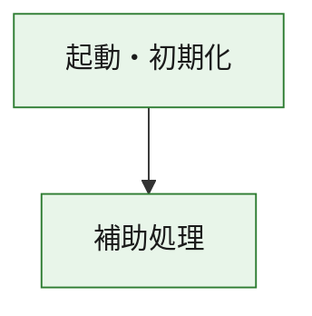
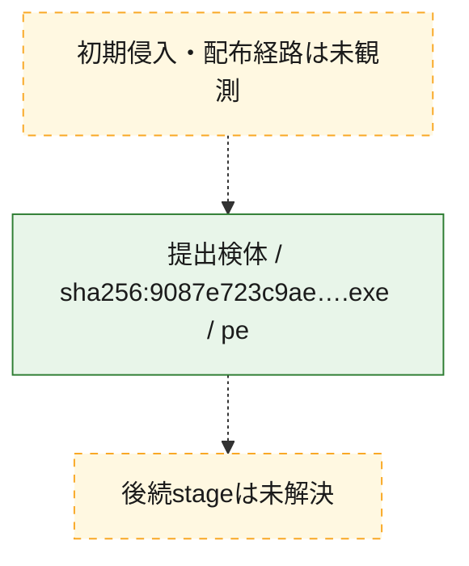
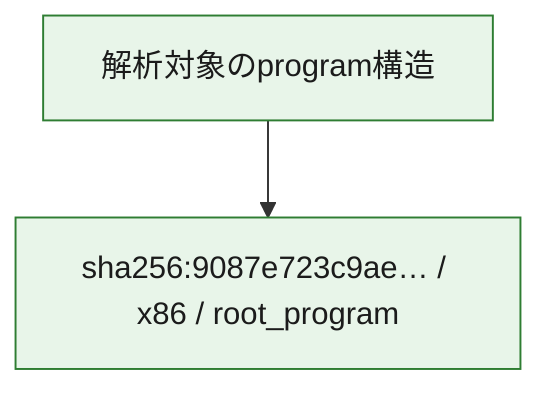

# 全体ロジック：9087e723c9aea3ec4d8fca4c410fe41941b8eb158dccff432b8973332ed51ddc

代表関数の静的証跡から、起動・初期化の処理群を確認しました。

## 読み方

- phaseの掲載順は解析上の整理順です。observed_call_edgesがない段階間の実行順を断定しません。
- 図の実線は静的に観測した関係、点線と黄色のノードは未観測・未解決の関係を示します。
- 図は静的な要約であり、動的実行を再現するものではありません。
- 詳細な関数解説とfingerprintは[STATIC-LOGIC.md](STATIC-LOGIC.md)を参照してください。

## 静的可視化

### 実行フロー

### 感染チェーン

### モジュール関係

## 処理段階

### 1. 起動・初期化

entry pointから初期化と後続処理への移行を確認します。
確度: `confirmed_static_function_evidence`

- `9087e723c9aea3ec4d8fca4c410fe41941b8eb158dccff432b8973332ed51ddc:ghidra:180001010` — 初期化と主要処理への分岐を行う入口関数です。 状態: `succeeded`、選定理由: `entry_point`, `meaningful_symbol_name`, `reviewed_call_centrality:22`, `role:entrypoint`, `small_program_complete_context`

### 2. 補助処理

主要処理を支える一般内部関数またはlibrary処理を確認します。
確度: `confirmed_static_function_evidence`

- `9087e723c9aea3ec4d8fca4c410fe41941b8eb158dccff432b8973332ed51ddc:ghidra:180001240` — 検体内部の一般処理を実装する関数です。 状態: `succeeded`、選定理由: `context_representative`, `reviewed_call_centrality:2`, `small_program_complete_context`
- `9087e723c9aea3ec4d8fca4c410fe41941b8eb158dccff432b8973332ed51ddc:ghidra:180001350` — 検体内部の一般処理を実装する関数です。 状態: `succeeded`、選定理由: `context_representative`, `reviewed_call_centrality:25`, `small_program_complete_context`
- `9087e723c9aea3ec4d8fca4c410fe41941b8eb158dccff432b8973332ed51ddc:ghidra:180003780` — 検体内部の一般処理を実装する関数です。 状態: `succeeded`、選定理由: `context_representative`, `reviewed_call_centrality:2`, `small_program_complete_context`
- `9087e723c9aea3ec4d8fca4c410fe41941b8eb158dccff432b8973332ed51ddc:ghidra:1800038e0` — 検体内部の一般処理を実装する関数です。 状態: `succeeded`、選定理由: `context_representative`, `reviewed_call_centrality:2`, `small_program_complete_context`

## 観測したcall関係

- `9087e723c9aea3ec4d8fca4c410fe41941b8eb158dccff432b8973332ed51ddc:ghidra:180001010` → `9087e723c9aea3ec4d8fca4c410fe41941b8eb158dccff432b8973332ed51ddc:ghidra:180001240` （`startup` → `support`）
- `9087e723c9aea3ec4d8fca4c410fe41941b8eb158dccff432b8973332ed51ddc:ghidra:180001010` → `9087e723c9aea3ec4d8fca4c410fe41941b8eb158dccff432b8973332ed51ddc:ghidra:180001350` （`startup` → `support`）
- `9087e723c9aea3ec4d8fca4c410fe41941b8eb158dccff432b8973332ed51ddc:ghidra:180001350` → `9087e723c9aea3ec4d8fca4c410fe41941b8eb158dccff432b8973332ed51ddc:ghidra:180001240` （`support` → `support`）
- `9087e723c9aea3ec4d8fca4c410fe41941b8eb158dccff432b8973332ed51ddc:ghidra:180001350` → `9087e723c9aea3ec4d8fca4c410fe41941b8eb158dccff432b8973332ed51ddc:ghidra:180003780` （`support` → `support`）
- `9087e723c9aea3ec4d8fca4c410fe41941b8eb158dccff432b8973332ed51ddc:ghidra:180001350` → `9087e723c9aea3ec4d8fca4c410fe41941b8eb158dccff432b8973332ed51ddc:ghidra:1800038e0` （`support` → `support`）
- `9087e723c9aea3ec4d8fca4c410fe41941b8eb158dccff432b8973332ed51ddc:ghidra:180003780` → `9087e723c9aea3ec4d8fca4c410fe41941b8eb158dccff432b8973332ed51ddc:ghidra:1800038e0` （`support` → `support`）
- `ghidra-function:760c63dfceaf0b9873507d19` → `ghidra-external:2baae676976b31f9a963a6f9` （`unclassified` → `unclassified`）
- `ghidra-function:760c63dfceaf0b9873507d19` → `ghidra-external:3d245bf494e56bee32238fe7` （`unclassified` → `unclassified`）
- `ghidra-function:760c63dfceaf0b9873507d19` → `ghidra-external:436d42c03000010745c4f504` （`unclassified` → `unclassified`）
- `ghidra-function:760c63dfceaf0b9873507d19` → `ghidra-external:514fc114f71896196bb79466` （`unclassified` → `unclassified`）
- `ghidra-function:760c63dfceaf0b9873507d19` → `ghidra-external:642e3ac46d71b115bf04f845` （`unclassified` → `unclassified`）
- `ghidra-function:760c63dfceaf0b9873507d19` → `ghidra-external:66086a18a32499589e8528e6` （`unclassified` → `unclassified`）
- `ghidra-function:760c63dfceaf0b9873507d19` → `ghidra-external:68445efdf9b4dfeb7bbc8cb6` （`unclassified` → `unclassified`）
- `ghidra-function:760c63dfceaf0b9873507d19` → `ghidra-external:6e5975fc5ba2180285c5d47a` （`unclassified` → `unclassified`）
- `ghidra-function:760c63dfceaf0b9873507d19` → `ghidra-external:7afb07e3357fcb7cf3e2b537` （`unclassified` → `unclassified`）
- `ghidra-function:760c63dfceaf0b9873507d19` → `ghidra-external:8074cad0aa7f44cd3c6f312a` （`unclassified` → `unclassified`）
- `ghidra-function:760c63dfceaf0b9873507d19` → `ghidra-external:850c704ea016a0d24c99fb52` （`unclassified` → `unclassified`）
- `ghidra-function:760c63dfceaf0b9873507d19` → `ghidra-external:86e9c532e06d0abae18cfced` （`unclassified` → `unclassified`）
- `ghidra-function:760c63dfceaf0b9873507d19` → `ghidra-external:93b4883aa57aac4e0d551461` （`unclassified` → `unclassified`）
- `ghidra-function:760c63dfceaf0b9873507d19` → `ghidra-external:94161c1fff39d2ce456db591` （`unclassified` → `unclassified`）
- `ghidra-function:760c63dfceaf0b9873507d19` → `ghidra-external:96e296c3617f1392fdd56481` （`unclassified` → `unclassified`）
- `ghidra-function:760c63dfceaf0b9873507d19` → `ghidra-external:9a24a20ce62079101c365fc5` （`unclassified` → `unclassified`）
- `ghidra-function:760c63dfceaf0b9873507d19` → `ghidra-external:c4cba192e5f162ccd18d816f` （`unclassified` → `unclassified`）
- `ghidra-function:760c63dfceaf0b9873507d19` → `ghidra-external:cab0831470962e48169f91fa` （`unclassified` → `unclassified`）
- `ghidra-function:760c63dfceaf0b9873507d19` → `ghidra-external:e3c9f4bf0e6020a8b0c76950` （`unclassified` → `unclassified`）
- `ghidra-function:760c63dfceaf0b9873507d19` → `ghidra-external:e859573d9f7f5350d54624ea` （`unclassified` → `unclassified`）
- `ghidra-function:760c63dfceaf0b9873507d19` → `ghidra-external:f162aaab653f704103d13f73` （`unclassified` → `unclassified`）
- `ghidra-function:760c63dfceaf0b9873507d19` → `ghidra-function:278cb09c45de1b0bec2c5c8f` （`unclassified` → `unclassified`）
- `ghidra-function:760c63dfceaf0b9873507d19` → `ghidra-function:bc11cb91ec30ce1e6574c8fb` （`unclassified` → `unclassified`）
- `ghidra-function:760c63dfceaf0b9873507d19` → `ghidra-function:d13984ab29de9b48d271fd0a` （`unclassified` → `unclassified`）
- `ghidra-function:91abb3ea10f5a533cc32de6d` → `ghidra-function:031b881252af133675acfee9` （`unclassified` → `unclassified`）
- `ghidra-function:91abb3ea10f5a533cc32de6d` → `ghidra-function:06ef8bb31af2da329a2ab24b` （`unclassified` → `unclassified`）
- `ghidra-function:91abb3ea10f5a533cc32de6d` → `ghidra-function:22efc50586be568265d346f3` （`unclassified` → `unclassified`）
- `ghidra-function:91abb3ea10f5a533cc32de6d` → `ghidra-function:48f17cbbb6e5ea9ea71cc394` （`unclassified` → `unclassified`）
- `ghidra-function:91abb3ea10f5a533cc32de6d` → `ghidra-function:5831098bae654a9d63b4b042` （`unclassified` → `unclassified`）
- `ghidra-function:91abb3ea10f5a533cc32de6d` → `ghidra-function:760c63dfceaf0b9873507d19` （`unclassified` → `unclassified`）
- `ghidra-function:91abb3ea10f5a533cc32de6d` → `ghidra-function:791d0c222fba92eb59446259` （`unclassified` → `unclassified`）
- `ghidra-function:91abb3ea10f5a533cc32de6d` → `ghidra-function:7c4f8053ee7abcd0e9989659` （`unclassified` → `unclassified`）
- `ghidra-function:91abb3ea10f5a533cc32de6d` → `ghidra-function:ae1c1c1d452f522e1ac7b038` （`unclassified` → `unclassified`）
- `ghidra-function:91abb3ea10f5a533cc32de6d` → `ghidra-function:ae84bf31467b81d771ce611c` （`unclassified` → `unclassified`）
- `ghidra-function:91abb3ea10f5a533cc32de6d` → `ghidra-function:cc58a383bf7b852e472eca31` （`unclassified` → `unclassified`）
- `ghidra-function:91abb3ea10f5a533cc32de6d` → `ghidra-function:d13984ab29de9b48d271fd0a` （`unclassified` → `unclassified`）
- `ghidra-function:bc11cb91ec30ce1e6574c8fb` → `ghidra-function:278cb09c45de1b0bec2c5c8f` （`unclassified` → `unclassified`）

## 解析範囲と制約

- 選定外関数は全体inventoryへ残しますが、関数本体の個別解説対象にはしていません。
- indirect call、難読化、packer、VM、壊れたcontrol flowによりcall関係が欠落する場合があります。
- 文書は静的解析に基づき、検体実行や外部通信による動的確認は行っていません。
