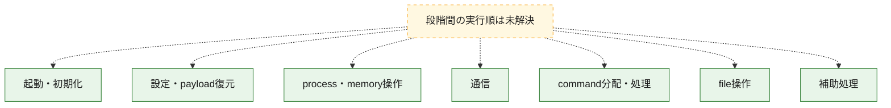
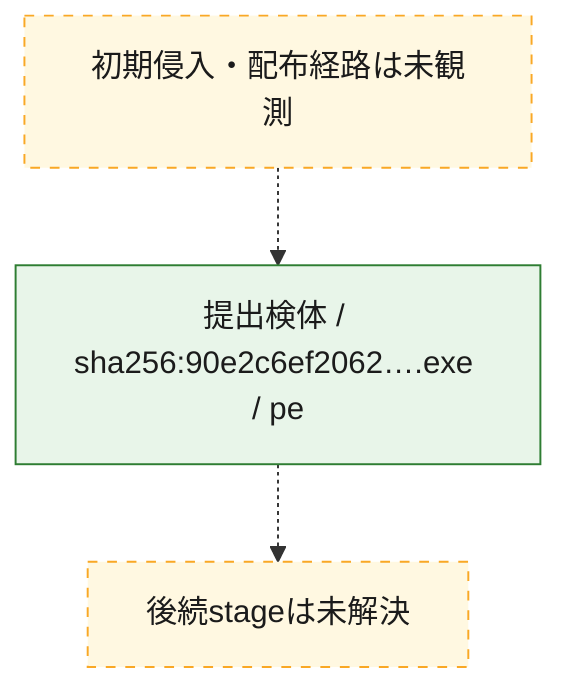
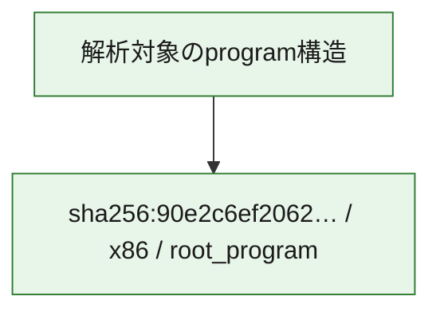

# 全体ロジック：90e2c6ef2062148c89b4b66d3cfbf75012a273ff9ec5bc1a6a88215ac4b340fd

代表関数の静的証跡から、起動・初期化、設定・payload復元、process・memory操作、通信、command分配・処理、file操作の処理群を確認しました。

## 読み方

- phaseの掲載順は解析上の整理順です。observed_call_edgesがない段階間の実行順を断定しません。
- 図の実線は静的に観測した関係、点線と黄色のノードは未観測・未解決の関係を示します。
- 図は静的な要約であり、動的実行を再現するものではありません。
- 詳細な関数解説とfingerprintは[STATIC-LOGIC.md](STATIC-LOGIC.md)を参照してください。

## 静的可視化

### 実行フロー

### 感染チェーン

### モジュール関係

## 処理段階

### 1. 起動・初期化

entry pointから初期化と後続処理への移行を確認します。
確度: `confirmed_static_function_evidence_with_limits`

- `90e2c6ef2062148c89b4b66d3cfbf75012a273ff9ec5bc1a6a88215ac4b340fd:ghidra:1400acf60` — 初期化と主要処理への分岐を行う入口関数です。 状態: `succeeded`、選定理由: `entry_point`, `meaningful_symbol_name`, `probable_go_main_user_code`, `reviewed_call_centrality:5`, `role:entrypoint`
- `90e2c6ef2062148c89b4b66d3cfbf75012a273ff9ec5bc1a6a88215ac4b340fd:ghidra:1400ad120` — 初期化と主要処理への分岐を行う入口関数です。 状態: `succeeded`、選定理由: `entry_point`, `meaningful_symbol_name`, `probable_go_main_user_code`, `reviewed_call_centrality:10`, `role:entrypoint`
- `90e2c6ef2062148c89b4b66d3cfbf75012a273ff9ec5bc1a6a88215ac4b340fd:ghidra:1400b19a0` — 初期化と主要処理への分岐を行う入口関数です。 状態: `succeeded`、選定理由: `entry_point`, `meaningful_symbol_name`, `probable_go_main_user_code`, `reviewed_call_centrality:11`, `role:entrypoint`
- `90e2c6ef2062148c89b4b66d3cfbf75012a273ff9ec5bc1a6a88215ac4b340fd:ghidra:1400b4ca0` — 初期化と主要処理への分岐を行う入口関数です。 状態: `succeeded`、選定理由: `entry_point`, `meaningful_symbol_name`, `probable_go_main_user_code`, `reviewed_call_centrality:11`, `role:entrypoint`
- `90e2c6ef2062148c89b4b66d3cfbf75012a273ff9ec5bc1a6a88215ac4b340fd:ghidra:1400b9520` — 初期化と主要処理への分岐を行う入口関数です。 状態: `failed`、選定理由: `entry_point`, `meaningful_symbol_name`, `probable_go_main_user_code`, `role:entrypoint`
- `90e2c6ef2062148c89b4b66d3cfbf75012a273ff9ec5bc1a6a88215ac4b340fd:ghidra:1400c0a80` — 初期化と主要処理への分岐を行う入口関数です。 状態: `succeeded`、選定理由: `entry_point`, `meaningful_symbol_name`, `probable_go_main_user_code`, `reviewed_call_centrality:11`, `role:entrypoint`
- `90e2c6ef2062148c89b4b66d3cfbf75012a273ff9ec5bc1a6a88215ac4b340fd:ghidra:1400c2800` — 初期化と主要処理への分岐を行う入口関数です。 状態: `succeeded`、選定理由: `entry_point`, `meaningful_symbol_name`, `probable_go_main_user_code`, `reviewed_call_centrality:10`, `role:entrypoint`
- `90e2c6ef2062148c89b4b66d3cfbf75012a273ff9ec5bc1a6a88215ac4b340fd:ghidra:1400c4c20` — 初期化と主要処理への分岐を行う入口関数です。 状態: `succeeded`、選定理由: `entry_point`, `meaningful_symbol_name`, `probable_go_main_user_code`, `reviewed_call_centrality:11`, `role:entrypoint`
- `90e2c6ef2062148c89b4b66d3cfbf75012a273ff9ec5bc1a6a88215ac4b340fd:ghidra:1400c6200` — 初期化と主要処理への分岐を行う入口関数です。 状態: `succeeded`、選定理由: `entry_point`, `meaningful_symbol_name`, `probable_go_main_user_code`, `reviewed_call_centrality:14`, `role:entrypoint`
- `90e2c6ef2062148c89b4b66d3cfbf75012a273ff9ec5bc1a6a88215ac4b340fd:ghidra:1400cb940` — 初期化と主要処理への分岐を行う入口関数です。 状態: `failed`、選定理由: `entry_point`, `meaningful_symbol_name`, `probable_go_main_user_code`, `role:entrypoint`
- `90e2c6ef2062148c89b4b66d3cfbf75012a273ff9ec5bc1a6a88215ac4b340fd:ghidra:1400e8280` — 初期化と主要処理への分岐を行う入口関数です。 状態: `succeeded`、選定理由: `entry_point`, `meaningful_symbol_name`, `probable_go_main_user_code`, `reviewed_call_centrality:11`, `role:entrypoint`
- `90e2c6ef2062148c89b4b66d3cfbf75012a273ff9ec5bc1a6a88215ac4b340fd:ghidra:1400ea6e0` — 初期化と主要処理への分岐を行う入口関数です。 状態: `succeeded`、選定理由: `entry_point`, `meaningful_symbol_name`, `probable_go_main_user_code`, `reviewed_call_centrality:12`, `role:entrypoint`
- `90e2c6ef2062148c89b4b66d3cfbf75012a273ff9ec5bc1a6a88215ac4b340fd:ghidra:1400ecb00` — 初期化と主要処理への分岐を行う入口関数です。 状態: `succeeded`、選定理由: `entry_point`, `meaningful_symbol_name`, `probable_go_main_user_code`, `reviewed_call_centrality:13`, `role:entrypoint`
- `90e2c6ef2062148c89b4b66d3cfbf75012a273ff9ec5bc1a6a88215ac4b340fd:ghidra:1400ef720` — 初期化と主要処理への分岐を行う入口関数です。 状態: `succeeded`、選定理由: `entry_point`, `meaningful_symbol_name`, `probable_go_main_user_code`, `reviewed_call_centrality:11`, `role:entrypoint`
- `90e2c6ef2062148c89b4b66d3cfbf75012a273ff9ec5bc1a6a88215ac4b340fd:ghidra:1400f1400` — 初期化と主要処理への分岐を行う入口関数です。 状態: `succeeded`、選定理由: `entry_point`, `meaningful_symbol_name`, `probable_go_main_user_code`, `reviewed_call_centrality:11`, `role:entrypoint`
- `90e2c6ef2062148c89b4b66d3cfbf75012a273ff9ec5bc1a6a88215ac4b340fd:ghidra:1400f3800` — 初期化と主要処理への分岐を行う入口関数です。 状態: `succeeded`、選定理由: `entry_point`, `meaningful_symbol_name`, `probable_go_main_user_code`, `reviewed_call_centrality:12`, `role:entrypoint`
- `90e2c6ef2062148c89b4b66d3cfbf75012a273ff9ec5bc1a6a88215ac4b340fd:ghidra:1400f6b00` — 初期化と主要処理への分岐を行う入口関数です。 状態: `succeeded`、選定理由: `entry_point`, `meaningful_symbol_name`, `probable_go_main_user_code`, `reviewed_call_centrality:16`, `role:entrypoint`
- `90e2c6ef2062148c89b4b66d3cfbf75012a273ff9ec5bc1a6a88215ac4b340fd:ghidra:1400f96a0` — 初期化と主要処理への分岐を行う入口関数です。 状態: `succeeded`、選定理由: `entry_point`, `meaningful_symbol_name`, `probable_go_main_user_code`, `reviewed_call_centrality:12`, `role:entrypoint`
- `90e2c6ef2062148c89b4b66d3cfbf75012a273ff9ec5bc1a6a88215ac4b340fd:ghidra:1400fbb20` — 初期化と主要処理への分岐を行う入口関数です。 状態: `succeeded`、選定理由: `entry_point`, `meaningful_symbol_name`, `probable_go_main_user_code`, `reviewed_call_centrality:11`, `role:entrypoint`
- `90e2c6ef2062148c89b4b66d3cfbf75012a273ff9ec5bc1a6a88215ac4b340fd:ghidra:1400fd840` — 初期化と主要処理への分岐を行う入口関数です。 状態: `failed`、選定理由: `entry_point`, `meaningful_symbol_name`, `probable_go_main_user_code`, `role:entrypoint`
- `90e2c6ef2062148c89b4b66d3cfbf75012a273ff9ec5bc1a6a88215ac4b340fd:ghidra:140107120` — 初期化と主要処理への分岐を行う入口関数です。 状態: `succeeded`、選定理由: `entry_point`, `meaningful_symbol_name`, `probable_go_main_user_code`, `reviewed_call_centrality:11`, `role:entrypoint`
- `90e2c6ef2062148c89b4b66d3cfbf75012a273ff9ec5bc1a6a88215ac4b340fd:ghidra:14010b980` — 初期化と主要処理への分岐を行う入口関数です。 状態: `succeeded`、選定理由: `entry_point`, `meaningful_symbol_name`, `probable_go_main_user_code`, `reviewed_call_centrality:11`, `role:entrypoint`
- `90e2c6ef2062148c89b4b66d3cfbf75012a273ff9ec5bc1a6a88215ac4b340fd:ghidra:14010fb60` — 初期化と主要処理への分岐を行う入口関数です。 状態: `succeeded`、選定理由: `entry_point`, `meaningful_symbol_name`, `probable_go_main_user_code`, `reviewed_call_centrality:12`, `role:entrypoint`
- `90e2c6ef2062148c89b4b66d3cfbf75012a273ff9ec5bc1a6a88215ac4b340fd:ghidra:140112f80` — 初期化と主要処理への分岐を行う入口関数です。 状態: `succeeded`、選定理由: `entry_point`, `meaningful_symbol_name`, `probable_go_main_user_code`, `reviewed_call_centrality:14`, `role:entrypoint`
- `90e2c6ef2062148c89b4b66d3cfbf75012a273ff9ec5bc1a6a88215ac4b340fd:ghidra:140117f80` — 初期化と主要処理への分岐を行う入口関数です。 状態: `failed`、選定理由: `entry_point`, `meaningful_symbol_name`, `probable_go_main_user_code`, `role:entrypoint`

### 2. 設定・payload復元

設定、resource、payload、暗号化データの復元・変換を確認します。
確度: `confirmed_static_function_evidence`

- `90e2c6ef2062148c89b4b66d3cfbf75012a273ff9ec5bc1a6a88215ac4b340fd:ghidra:1400894c0` — 設定、resource、payloadなどの解析・変換を行う関数です。 状態: `succeeded`、選定理由: `meaningful_symbol_name`, `reviewed_call_centrality:4`, `role:config_or_data_transform`

### 3. process・memory操作

process、thread、module、memory操作と実行移行を確認します。
確度: `confirmed_static_function_evidence`

- `90e2c6ef2062148c89b4b66d3cfbf75012a273ff9ec5bc1a6a88215ac4b340fd:ghidra:140097b20` — process、thread、module、またはmemory操作に関係する関数です。 状態: `succeeded`、選定理由: `meaningful_symbol_name`, `reviewed_call_centrality:6`, `role:process_or_memory_operation`

### 4. 通信

通信初期化、endpoint処理、送受信の役割を確認します。
確度: `confirmed_static_function_evidence`

- `90e2c6ef2062148c89b4b66d3cfbf75012a273ff9ec5bc1a6a88215ac4b340fd:ghidra:140098400` — 通信初期化、送受信、またはendpoint処理に関係する関数です。 状態: `succeeded`、選定理由: `meaningful_symbol_name`, `reviewed_call_centrality:6`, `role:network_communication`

### 5. command分配・処理

受信commandやtaskの解釈、分配、個別handlerへの移行を確認します。
確度: `confirmed_static_function_evidence`

- `90e2c6ef2062148c89b4b66d3cfbf75012a273ff9ec5bc1a6a88215ac4b340fd:ghidra:140097660` — commandの解釈、分配、または個別処理を担当する関数です。 状態: `succeeded`、選定理由: `meaningful_symbol_name`, `reviewed_call_centrality:5`, `role:command_dispatch_or_handler`

### 6. file操作

fileやdirectoryの作成、読書き、削除を確認します。
確度: `confirmed_static_function_evidence`

- `90e2c6ef2062148c89b4b66d3cfbf75012a273ff9ec5bc1a6a88215ac4b340fd:ghidra:140097fe0` — fileまたはdirectoryの読書き・管理に関係する関数です。 状態: `succeeded`、選定理由: `meaningful_symbol_name`, `reviewed_call_centrality:6`, `role:file_operation`

### 7. 補助処理

主要処理を支える一般内部関数またはlibrary処理を確認します。
確度: `confirmed_static_function_evidence`

- `90e2c6ef2062148c89b4b66d3cfbf75012a273ff9ec5bc1a6a88215ac4b340fd:ghidra:140001080` — compiler生成処理または汎用library処理とみられる関数です。 状態: `succeeded`、選定理由: `meaningful_symbol_name`, `reviewed_call_centrality:5`
- `90e2c6ef2062148c89b4b66d3cfbf75012a273ff9ec5bc1a6a88215ac4b340fd:ghidra:140072a20` — 検体内部の一般処理を実装する関数です。 状態: `succeeded`、選定理由: `meaningful_symbol_name`, `reviewed_call_centrality:3`

## 観測したcall関係

- `ghidra-function:1f160239103c86be4ad9c449` → `ghidra-external:2461540622f4082fa0e32abb` （`unclassified` → `unclassified`）
- `ghidra-function:1f160239103c86be4ad9c449` → `ghidra-external:3f6d61d4cd7bfd8db7ffb3cd` （`unclassified` → `unclassified`）
- `ghidra-function:1f160239103c86be4ad9c449` → `ghidra-external:442523c2ab873af5be6cf011` （`unclassified` → `unclassified`）
- `ghidra-function:1f160239103c86be4ad9c449` → `ghidra-external:7669c79b5c243b2b06c87a35` （`unclassified` → `unclassified`）
- `ghidra-function:1f160239103c86be4ad9c449` → `ghidra-external:a3fcf5daa507b7a721d1c1f8` （`unclassified` → `unclassified`）
- `ghidra-function:1f160239103c86be4ad9c449` → `ghidra-external:aca31b93c3c34a576880ea87` （`unclassified` → `unclassified`）
- `ghidra-function:210a3514c4bb1f10faf97ba2` → `ghidra-external:2461540622f4082fa0e32abb` （`unclassified` → `unclassified`）
- `ghidra-function:210a3514c4bb1f10faf97ba2` → `ghidra-external:3f6d61d4cd7bfd8db7ffb3cd` （`unclassified` → `unclassified`）
- `ghidra-function:210a3514c4bb1f10faf97ba2` → `ghidra-external:442523c2ab873af5be6cf011` （`unclassified` → `unclassified`）
- `ghidra-function:210a3514c4bb1f10faf97ba2` → `ghidra-external:aca31b93c3c34a576880ea87` （`unclassified` → `unclassified`）
- `ghidra-function:210a3514c4bb1f10faf97ba2` → `ghidra-external:f2eb2e046bc25b8bdab0f038` （`unclassified` → `unclassified`）
- `ghidra-function:2a860538ae7481e89bc6ba78` → `ghidra-external:2461540622f4082fa0e32abb` （`unclassified` → `unclassified`）
- `ghidra-function:2a860538ae7481e89bc6ba78` → `ghidra-external:25862ebf3acc9f4217400b80` （`unclassified` → `unclassified`）
- `ghidra-function:2a860538ae7481e89bc6ba78` → `ghidra-external:3f6d61d4cd7bfd8db7ffb3cd` （`unclassified` → `unclassified`）
- `ghidra-function:2a860538ae7481e89bc6ba78` → `ghidra-external:4a838955ae4f211e716b44e2` （`unclassified` → `unclassified`）
- `ghidra-function:2a860538ae7481e89bc6ba78` → `ghidra-external:8a6d2041a77cfabaf6252e2e` （`unclassified` → `unclassified`）
- `ghidra-function:3521dbe330526a3c788e47aa` → `ghidra-external:06a6e33f78a281216280fb91` （`unclassified` → `unclassified`）
- `ghidra-function:3521dbe330526a3c788e47aa` → `ghidra-external:23d2382ead296bb87eaae7bb` （`unclassified` → `unclassified`）
- `ghidra-function:3521dbe330526a3c788e47aa` → `ghidra-external:2461540622f4082fa0e32abb` （`unclassified` → `unclassified`）
- `ghidra-function:3521dbe330526a3c788e47aa` → `ghidra-external:255eeab968668df1a8857c78` （`unclassified` → `unclassified`）
- `ghidra-function:3521dbe330526a3c788e47aa` → `ghidra-external:32817ae122db4b98dab9705a` （`unclassified` → `unclassified`）
- `ghidra-function:3521dbe330526a3c788e47aa` → `ghidra-external:409807a71ce5e5fc04436c81` （`unclassified` → `unclassified`）
- `ghidra-function:3521dbe330526a3c788e47aa` → `ghidra-external:41e2fdd57a58e9d9acf6e0a6` （`unclassified` → `unclassified`）
- `ghidra-function:3521dbe330526a3c788e47aa` → `ghidra-external:491938cbbcfee3a7e11f18e1` （`unclassified` → `unclassified`）
- `ghidra-function:3521dbe330526a3c788e47aa` → `ghidra-external:4a838955ae4f211e716b44e2` （`unclassified` → `unclassified`）
- `ghidra-function:3521dbe330526a3c788e47aa` → `ghidra-external:5c041ecd74daccac12a6e5b1` （`unclassified` → `unclassified`）
- `ghidra-function:3521dbe330526a3c788e47aa` → `ghidra-external:ba81b877e6a1a34f4b2f83ed` （`unclassified` → `unclassified`）
- `ghidra-function:3521dbe330526a3c788e47aa` → `ghidra-external:ed65f2929dde33e278f9c488` （`unclassified` → `unclassified`）
- `ghidra-function:3948eceec270b35900725256` → `ghidra-external:06a6e33f78a281216280fb91` （`unclassified` → `unclassified`）
- `ghidra-function:3948eceec270b35900725256` → `ghidra-external:2461540622f4082fa0e32abb` （`unclassified` → `unclassified`）
- `ghidra-function:3948eceec270b35900725256` → `ghidra-external:255eeab968668df1a8857c78` （`unclassified` → `unclassified`）
- `ghidra-function:3948eceec270b35900725256` → `ghidra-external:2f7b78c62a1e8233a182ae7b` （`unclassified` → `unclassified`）
- `ghidra-function:3948eceec270b35900725256` → `ghidra-external:32817ae122db4b98dab9705a` （`unclassified` → `unclassified`）
- `ghidra-function:3948eceec270b35900725256` → `ghidra-external:356420176234c42b0c5c9ed3` （`unclassified` → `unclassified`）
- `ghidra-function:3948eceec270b35900725256` → `ghidra-external:409807a71ce5e5fc04436c81` （`unclassified` → `unclassified`）
- `ghidra-function:3948eceec270b35900725256` → `ghidra-external:41e2fdd57a58e9d9acf6e0a6` （`unclassified` → `unclassified`）
- `ghidra-function:3948eceec270b35900725256` → `ghidra-external:4a838955ae4f211e716b44e2` （`unclassified` → `unclassified`）
- `ghidra-function:3948eceec270b35900725256` → `ghidra-external:59052c61fe889383b4ca8177` （`unclassified` → `unclassified`）
- `ghidra-function:3948eceec270b35900725256` → `ghidra-external:6c346b4f4077f1e2dc1b582a` （`unclassified` → `unclassified`）
- `ghidra-function:3948eceec270b35900725256` → `ghidra-external:9635c9806fda3c3c4065de62` （`unclassified` → `unclassified`）
- `ghidra-function:3948eceec270b35900725256` → `ghidra-external:ba81b877e6a1a34f4b2f83ed` （`unclassified` → `unclassified`）
- `ghidra-function:3948eceec270b35900725256` → `ghidra-external:ed65f2929dde33e278f9c488` （`unclassified` → `unclassified`）
- `ghidra-function:4055de43d63ac2a9e5b388d5` → `ghidra-external:06a6e33f78a281216280fb91` （`unclassified` → `unclassified`）
- `ghidra-function:4055de43d63ac2a9e5b388d5` → `ghidra-external:2461540622f4082fa0e32abb` （`unclassified` → `unclassified`）
- `ghidra-function:4055de43d63ac2a9e5b388d5` → `ghidra-external:255eeab968668df1a8857c78` （`unclassified` → `unclassified`）
- `ghidra-function:4055de43d63ac2a9e5b388d5` → `ghidra-external:32817ae122db4b98dab9705a` （`unclassified` → `unclassified`）
- `ghidra-function:4055de43d63ac2a9e5b388d5` → `ghidra-external:409807a71ce5e5fc04436c81` （`unclassified` → `unclassified`）
- `ghidra-function:4055de43d63ac2a9e5b388d5` → `ghidra-external:41e2fdd57a58e9d9acf6e0a6` （`unclassified` → `unclassified`）
- `ghidra-function:4055de43d63ac2a9e5b388d5` → `ghidra-external:4a838955ae4f211e716b44e2` （`unclassified` → `unclassified`）
- `ghidra-function:4055de43d63ac2a9e5b388d5` → `ghidra-external:75cce1ed0d884b8f164b6aa8` （`unclassified` → `unclassified`）
- `ghidra-function:4055de43d63ac2a9e5b388d5` → `ghidra-external:ae256c8459a52af056e593fc` （`unclassified` → `unclassified`）
- `ghidra-function:4055de43d63ac2a9e5b388d5` → `ghidra-external:ba81b877e6a1a34f4b2f83ed` （`unclassified` → `unclassified`）
- `ghidra-function:4055de43d63ac2a9e5b388d5` → `ghidra-external:ecf536f59a75681fab732fc4` （`unclassified` → `unclassified`）
- `ghidra-function:4055de43d63ac2a9e5b388d5` → `ghidra-external:ed65f2929dde33e278f9c488` （`unclassified` → `unclassified`）
- `ghidra-function:41a28e02fdac7b74dd1a9d08` → `ghidra-external:06a6e33f78a281216280fb91` （`unclassified` → `unclassified`）
- `ghidra-function:41a28e02fdac7b74dd1a9d08` → `ghidra-external:2461540622f4082fa0e32abb` （`unclassified` → `unclassified`）
- `ghidra-function:41a28e02fdac7b74dd1a9d08` → `ghidra-external:255eeab968668df1a8857c78` （`unclassified` → `unclassified`）
- `ghidra-function:41a28e02fdac7b74dd1a9d08` → `ghidra-external:32817ae122db4b98dab9705a` （`unclassified` → `unclassified`）
- `ghidra-function:41a28e02fdac7b74dd1a9d08` → `ghidra-external:409807a71ce5e5fc04436c81` （`unclassified` → `unclassified`）
- `ghidra-function:41a28e02fdac7b74dd1a9d08` → `ghidra-external:41e2fdd57a58e9d9acf6e0a6` （`unclassified` → `unclassified`）
- `ghidra-function:41a28e02fdac7b74dd1a9d08` → `ghidra-external:4a838955ae4f211e716b44e2` （`unclassified` → `unclassified`）
- `ghidra-function:41a28e02fdac7b74dd1a9d08` → `ghidra-external:6bf7b124446350083ac03136` （`unclassified` → `unclassified`）
- `ghidra-function:41a28e02fdac7b74dd1a9d08` → `ghidra-external:ba81b877e6a1a34f4b2f83ed` （`unclassified` → `unclassified`）
- `ghidra-function:41a28e02fdac7b74dd1a9d08` → `ghidra-external:ed65f2929dde33e278f9c488` （`unclassified` → `unclassified`）
- `ghidra-function:4830fd51f489363fbdf0d6c2` → `ghidra-external:06a6e33f78a281216280fb91` （`unclassified` → `unclassified`）
- `ghidra-function:4830fd51f489363fbdf0d6c2` → `ghidra-external:2461540622f4082fa0e32abb` （`unclassified` → `unclassified`）
- `ghidra-function:4830fd51f489363fbdf0d6c2` → `ghidra-external:255eeab968668df1a8857c78` （`unclassified` → `unclassified`）
- `ghidra-function:4830fd51f489363fbdf0d6c2` → `ghidra-external:32817ae122db4b98dab9705a` （`unclassified` → `unclassified`）
- `ghidra-function:4830fd51f489363fbdf0d6c2` → `ghidra-external:409807a71ce5e5fc04436c81` （`unclassified` → `unclassified`）
- `ghidra-function:4830fd51f489363fbdf0d6c2` → `ghidra-external:41e2fdd57a58e9d9acf6e0a6` （`unclassified` → `unclassified`）
- `ghidra-function:4830fd51f489363fbdf0d6c2` → `ghidra-external:4a838955ae4f211e716b44e2` （`unclassified` → `unclassified`）
- `ghidra-function:4830fd51f489363fbdf0d6c2` → `ghidra-external:9c4bf67462820d5d1735822e` （`unclassified` → `unclassified`）
- `ghidra-function:4830fd51f489363fbdf0d6c2` → `ghidra-external:b4e88a6c40cdbc4846030d84` （`unclassified` → `unclassified`）
- `ghidra-function:4830fd51f489363fbdf0d6c2` → `ghidra-external:ba81b877e6a1a34f4b2f83ed` （`unclassified` → `unclassified`）
- `ghidra-function:4830fd51f489363fbdf0d6c2` → `ghidra-external:ed65f2929dde33e278f9c488` （`unclassified` → `unclassified`）
- `ghidra-function:619c5616222a684d5e4ccfea` → `ghidra-external:1c8a3f6141db9cdfe2edd958` （`unclassified` → `unclassified`）
- `ghidra-function:619c5616222a684d5e4ccfea` → `ghidra-external:2461540622f4082fa0e32abb` （`unclassified` → `unclassified`）
- `ghidra-function:619c5616222a684d5e4ccfea` → `ghidra-external:3f6d61d4cd7bfd8db7ffb3cd` （`unclassified` → `unclassified`）
- `ghidra-function:619c5616222a684d5e4ccfea` → `ghidra-external:442523c2ab873af5be6cf011` （`unclassified` → `unclassified`）
- `ghidra-function:619c5616222a684d5e4ccfea` → `ghidra-external:7669c79b5c243b2b06c87a35` （`unclassified` → `unclassified`）
- `ghidra-function:619c5616222a684d5e4ccfea` → `ghidra-external:aca31b93c3c34a576880ea87` （`unclassified` → `unclassified`）
- `ghidra-function:684943791660a59a88900362` → `ghidra-external:06a6e33f78a281216280fb91` （`unclassified` → `unclassified`）
- `ghidra-function:684943791660a59a88900362` → `ghidra-external:1bf28f2825f82305cac758cf` （`unclassified` → `unclassified`）
- `ghidra-function:684943791660a59a88900362` → `ghidra-external:2461540622f4082fa0e32abb` （`unclassified` → `unclassified`）
- `ghidra-function:684943791660a59a88900362` → `ghidra-external:255eeab968668df1a8857c78` （`unclassified` → `unclassified`）
- `ghidra-function:684943791660a59a88900362` → `ghidra-external:32817ae122db4b98dab9705a` （`unclassified` → `unclassified`）
- `ghidra-function:684943791660a59a88900362` → `ghidra-external:409807a71ce5e5fc04436c81` （`unclassified` → `unclassified`）
- `ghidra-function:684943791660a59a88900362` → `ghidra-external:41e2fdd57a58e9d9acf6e0a6` （`unclassified` → `unclassified`）
- `ghidra-function:684943791660a59a88900362` → `ghidra-external:442523c2ab873af5be6cf011` （`unclassified` → `unclassified`）
- `ghidra-function:684943791660a59a88900362` → `ghidra-external:4a838955ae4f211e716b44e2` （`unclassified` → `unclassified`）
- `ghidra-function:684943791660a59a88900362` → `ghidra-external:75cce1ed0d884b8f164b6aa8` （`unclassified` → `unclassified`）
- `ghidra-function:684943791660a59a88900362` → `ghidra-external:ae256c8459a52af056e593fc` （`unclassified` → `unclassified`）
- `ghidra-function:684943791660a59a88900362` → `ghidra-external:ba81b877e6a1a34f4b2f83ed` （`unclassified` → `unclassified`）
- `ghidra-function:684943791660a59a88900362` → `ghidra-external:ed65f2929dde33e278f9c488` （`unclassified` → `unclassified`）
- `ghidra-function:684943791660a59a88900362` → `ghidra-external:f8dece8d9773816dc10bc29c` （`unclassified` → `unclassified`）
- `ghidra-function:6c9415daf03e111731d95e48` → `ghidra-external:06a6e33f78a281216280fb91` （`unclassified` → `unclassified`）
- `ghidra-function:6c9415daf03e111731d95e48` → `ghidra-external:2461540622f4082fa0e32abb` （`unclassified` → `unclassified`）
- `ghidra-function:6c9415daf03e111731d95e48` → `ghidra-external:255eeab968668df1a8857c78` （`unclassified` → `unclassified`）
- `ghidra-function:6c9415daf03e111731d95e48` → `ghidra-external:32817ae122db4b98dab9705a` （`unclassified` → `unclassified`）
- `ghidra-function:6c9415daf03e111731d95e48` → `ghidra-external:409807a71ce5e5fc04436c81` （`unclassified` → `unclassified`）
- `ghidra-function:6c9415daf03e111731d95e48` → `ghidra-external:41e2fdd57a58e9d9acf6e0a6` （`unclassified` → `unclassified`）
- `ghidra-function:6c9415daf03e111731d95e48` → `ghidra-external:4a838955ae4f211e716b44e2` （`unclassified` → `unclassified`）
- `ghidra-function:6c9415daf03e111731d95e48` → `ghidra-external:7f318eda64ffdc8c722baea5` （`unclassified` → `unclassified`）
- `ghidra-function:6c9415daf03e111731d95e48` → `ghidra-external:ae256c8459a52af056e593fc` （`unclassified` → `unclassified`）
- `ghidra-function:6c9415daf03e111731d95e48` → `ghidra-external:ba81b877e6a1a34f4b2f83ed` （`unclassified` → `unclassified`）
- `ghidra-function:6c9415daf03e111731d95e48` → `ghidra-external:ed65f2929dde33e278f9c488` （`unclassified` → `unclassified`）
- `ghidra-function:6c9415daf03e111731d95e48` → `ghidra-external:f74f209a77ece223ec3cc93f` （`unclassified` → `unclassified`）
- `ghidra-function:73160f0808d6597d5c7f5fd8` → `ghidra-external:2461540622f4082fa0e32abb` （`unclassified` → `unclassified`）
- `ghidra-function:73160f0808d6597d5c7f5fd8` → `ghidra-external:6d0a2294c5a4c05345307dfd` （`unclassified` → `unclassified`）
- `ghidra-function:73160f0808d6597d5c7f5fd8` → `ghidra-external:adb7f9c95d0b9dcb048c6219` （`unclassified` → `unclassified`）
- `ghidra-function:73160f0808d6597d5c7f5fd8` → `ghidra-external:b4e88a6c40cdbc4846030d84` （`unclassified` → `unclassified`）
- `ghidra-function:73160f0808d6597d5c7f5fd8` → `ghidra-external:d7223f31832f80c67e411c9a` （`unclassified` → `unclassified`）
- `ghidra-function:80d0631daecd3633725021cc` → `ghidra-external:06a6e33f78a281216280fb91` （`unclassified` → `unclassified`）
- `ghidra-function:80d0631daecd3633725021cc` → `ghidra-external:138a2157199da5ec46250cd3` （`unclassified` → `unclassified`）
- `ghidra-function:80d0631daecd3633725021cc` → `ghidra-external:16d497b0ba379394f2edabe1` （`unclassified` → `unclassified`）
- `ghidra-function:80d0631daecd3633725021cc` → `ghidra-external:2461540622f4082fa0e32abb` （`unclassified` → `unclassified`）
- `ghidra-function:80d0631daecd3633725021cc` → `ghidra-external:255eeab968668df1a8857c78` （`unclassified` → `unclassified`）
- `ghidra-function:80d0631daecd3633725021cc` → `ghidra-external:32817ae122db4b98dab9705a` （`unclassified` → `unclassified`）
- `ghidra-function:80d0631daecd3633725021cc` → `ghidra-external:3f6d61d4cd7bfd8db7ffb3cd` （`unclassified` → `unclassified`）
- `ghidra-function:80d0631daecd3633725021cc` → `ghidra-external:409807a71ce5e5fc04436c81` （`unclassified` → `unclassified`）
- `ghidra-function:80d0631daecd3633725021cc` → `ghidra-external:41e2fdd57a58e9d9acf6e0a6` （`unclassified` → `unclassified`）
- `ghidra-function:80d0631daecd3633725021cc` → `ghidra-external:442523c2ab873af5be6cf011` （`unclassified` → `unclassified`）
- `ghidra-function:80d0631daecd3633725021cc` → `ghidra-external:4a838955ae4f211e716b44e2` （`unclassified` → `unclassified`）
- `ghidra-function:80d0631daecd3633725021cc` → `ghidra-external:7669c79b5c243b2b06c87a35` （`unclassified` → `unclassified`）
- `ghidra-function:80d0631daecd3633725021cc` → `ghidra-external:aca31b93c3c34a576880ea87` （`unclassified` → `unclassified`）
- `ghidra-function:80d0631daecd3633725021cc` → `ghidra-external:ba81b877e6a1a34f4b2f83ed` （`unclassified` → `unclassified`）
- `ghidra-function:80d0631daecd3633725021cc` → `ghidra-external:e2b55b451322311fb3193aae` （`unclassified` → `unclassified`）
- `ghidra-function:80d0631daecd3633725021cc` → `ghidra-external:ed65f2929dde33e278f9c488` （`unclassified` → `unclassified`）
- `ghidra-function:837b8eac067243836b4621f1` → `ghidra-external:06a6e33f78a281216280fb91` （`unclassified` → `unclassified`）
- `ghidra-function:837b8eac067243836b4621f1` → `ghidra-external:2461540622f4082fa0e32abb` （`unclassified` → `unclassified`）
- `ghidra-function:837b8eac067243836b4621f1` → `ghidra-external:255eeab968668df1a8857c78` （`unclassified` → `unclassified`）
- `ghidra-function:837b8eac067243836b4621f1` → `ghidra-external:282f9d84ca724785e76f43ab` （`unclassified` → `unclassified`）
- `ghidra-function:837b8eac067243836b4621f1` → `ghidra-external:32817ae122db4b98dab9705a` （`unclassified` → `unclassified`）
- `ghidra-function:837b8eac067243836b4621f1` → `ghidra-external:409807a71ce5e5fc04436c81` （`unclassified` → `unclassified`）
- `ghidra-function:837b8eac067243836b4621f1` → `ghidra-external:41e2fdd57a58e9d9acf6e0a6` （`unclassified` → `unclassified`）
- `ghidra-function:837b8eac067243836b4621f1` → `ghidra-external:4a838955ae4f211e716b44e2` （`unclassified` → `unclassified`）
- `ghidra-function:837b8eac067243836b4621f1` → `ghidra-external:4dd66a7b0192b43724bce755` （`unclassified` → `unclassified`）
- `ghidra-function:837b8eac067243836b4621f1` → `ghidra-external:ba81b877e6a1a34f4b2f83ed` （`unclassified` → `unclassified`）
- `ghidra-function:837b8eac067243836b4621f1` → `ghidra-external:ed65f2929dde33e278f9c488` （`unclassified` → `unclassified`）
- `ghidra-function:8ae7fd05cd84c4fc30b42a07` → `ghidra-external:192127f74bd126978c24a314` （`unclassified` → `unclassified`）
- `ghidra-function:8ae7fd05cd84c4fc30b42a07` → `ghidra-external:23d2382ead296bb87eaae7bb` （`unclassified` → `unclassified`）
- `ghidra-function:8ae7fd05cd84c4fc30b42a07` → `ghidra-external:3125fa65b1329a8d280de8e1` （`unclassified` → `unclassified`）
- `ghidra-function:8ae7fd05cd84c4fc30b42a07` → `ghidra-external:ba81b877e6a1a34f4b2f83ed` （`unclassified` → `unclassified`）
- `ghidra-function:8e3c9d30c1ce7a571d18c96c` → `ghidra-external:2844f00cba686a25d8741ee1` （`unclassified` → `unclassified`）
- `ghidra-function:8e3c9d30c1ce7a571d18c96c` → `ghidra-external:59437438035f96eb1913b442` （`unclassified` → `unclassified`）
- `ghidra-function:8e3c9d30c1ce7a571d18c96c` → `ghidra-external:d685cf94be8f533bc70819b4` （`unclassified` → `unclassified`）
- `ghidra-function:90e1d81879abc2939eed53a5` → `ghidra-external:06a6e33f78a281216280fb91` （`unclassified` → `unclassified`）
- `ghidra-function:90e1d81879abc2939eed53a5` → `ghidra-external:23d2382ead296bb87eaae7bb` （`unclassified` → `unclassified`）
- `ghidra-function:90e1d81879abc2939eed53a5` → `ghidra-external:2461540622f4082fa0e32abb` （`unclassified` → `unclassified`）
- `ghidra-function:90e1d81879abc2939eed53a5` → `ghidra-external:255eeab968668df1a8857c78` （`unclassified` → `unclassified`）
- `ghidra-function:90e1d81879abc2939eed53a5` → `ghidra-external:32817ae122db4b98dab9705a` （`unclassified` → `unclassified`）
- `ghidra-function:90e1d81879abc2939eed53a5` → `ghidra-external:409807a71ce5e5fc04436c81` （`unclassified` → `unclassified`）
- `ghidra-function:90e1d81879abc2939eed53a5` → `ghidra-external:41e2fdd57a58e9d9acf6e0a6` （`unclassified` → `unclassified`）
- `ghidra-function:90e1d81879abc2939eed53a5` → `ghidra-external:4a838955ae4f211e716b44e2` （`unclassified` → `unclassified`）
- `ghidra-function:90e1d81879abc2939eed53a5` → `ghidra-external:ba81b877e6a1a34f4b2f83ed` （`unclassified` → `unclassified`）
- `ghidra-function:90e1d81879abc2939eed53a5` → `ghidra-external:da6ef33438f689e167b8fbee` （`unclassified` → `unclassified`）
- `ghidra-function:90e1d81879abc2939eed53a5` → `ghidra-external:ed65f2929dde33e278f9c488` （`unclassified` → `unclassified`）
- `ghidra-function:9282aea7e9b6b6c55e0947be` → `ghidra-external:06a6e33f78a281216280fb91` （`unclassified` → `unclassified`）
- `ghidra-function:9282aea7e9b6b6c55e0947be` → `ghidra-external:23d2382ead296bb87eaae7bb` （`unclassified` → `unclassified`）
- `ghidra-function:9282aea7e9b6b6c55e0947be` → `ghidra-external:2461540622f4082fa0e32abb` （`unclassified` → `unclassified`）
- `ghidra-function:9282aea7e9b6b6c55e0947be` → `ghidra-external:255eeab968668df1a8857c78` （`unclassified` → `unclassified`）
- `ghidra-function:9282aea7e9b6b6c55e0947be` → `ghidra-external:32817ae122db4b98dab9705a` （`unclassified` → `unclassified`）
- `ghidra-function:9282aea7e9b6b6c55e0947be` → `ghidra-external:409807a71ce5e5fc04436c81` （`unclassified` → `unclassified`）
- `ghidra-function:9282aea7e9b6b6c55e0947be` → `ghidra-external:41e2fdd57a58e9d9acf6e0a6` （`unclassified` → `unclassified`）
- `ghidra-function:9282aea7e9b6b6c55e0947be` → `ghidra-external:4a838955ae4f211e716b44e2` （`unclassified` → `unclassified`）
- `ghidra-function:9282aea7e9b6b6c55e0947be` → `ghidra-external:ba81b877e6a1a34f4b2f83ed` （`unclassified` → `unclassified`）
- `ghidra-function:9282aea7e9b6b6c55e0947be` → `ghidra-external:d59a241e148c4803eff49588` （`unclassified` → `unclassified`）
- `ghidra-function:9282aea7e9b6b6c55e0947be` → `ghidra-external:ed65f2929dde33e278f9c488` （`unclassified` → `unclassified`）
- `ghidra-function:9282aea7e9b6b6c55e0947be` → `ghidra-external:f8dece8d9773816dc10bc29c` （`unclassified` → `unclassified`）
- `ghidra-function:9f2a55c9a8f57618c90328ac` → `ghidra-external:06a6e33f78a281216280fb91` （`unclassified` → `unclassified`）
- `ghidra-function:9f2a55c9a8f57618c90328ac` → `ghidra-external:23d2382ead296bb87eaae7bb` （`unclassified` → `unclassified`）
- `ghidra-function:9f2a55c9a8f57618c90328ac` → `ghidra-external:2461540622f4082fa0e32abb` （`unclassified` → `unclassified`）
- `ghidra-function:9f2a55c9a8f57618c90328ac` → `ghidra-external:255eeab968668df1a8857c78` （`unclassified` → `unclassified`）
- `ghidra-function:9f2a55c9a8f57618c90328ac` → `ghidra-external:32817ae122db4b98dab9705a` （`unclassified` → `unclassified`）
- `ghidra-function:9f2a55c9a8f57618c90328ac` → `ghidra-external:409807a71ce5e5fc04436c81` （`unclassified` → `unclassified`）
- `ghidra-function:9f2a55c9a8f57618c90328ac` → `ghidra-external:41e2fdd57a58e9d9acf6e0a6` （`unclassified` → `unclassified`）
- `ghidra-function:9f2a55c9a8f57618c90328ac` → `ghidra-external:4a838955ae4f211e716b44e2` （`unclassified` → `unclassified`）
- `ghidra-function:9f2a55c9a8f57618c90328ac` → `ghidra-external:b9355987fb2cddbee595981e` （`unclassified` → `unclassified`）
- `ghidra-function:9f2a55c9a8f57618c90328ac` → `ghidra-external:ba81b877e6a1a34f4b2f83ed` （`unclassified` → `unclassified`）
- `ghidra-function:9f2a55c9a8f57618c90328ac` → `ghidra-external:ed65f2929dde33e278f9c488` （`unclassified` → `unclassified`）
- `ghidra-function:c3bfa4adf4864b265e2a6b31` → `ghidra-external:06a6e33f78a281216280fb91` （`unclassified` → `unclassified`）
- `ghidra-function:c3bfa4adf4864b265e2a6b31` → `ghidra-external:2461540622f4082fa0e32abb` （`unclassified` → `unclassified`）
- `ghidra-function:c3bfa4adf4864b265e2a6b31` → `ghidra-external:255eeab968668df1a8857c78` （`unclassified` → `unclassified`）
- `ghidra-function:c3bfa4adf4864b265e2a6b31` → `ghidra-external:29f305c4e5691440bf2b74b4` （`unclassified` → `unclassified`）
- `ghidra-function:c3bfa4adf4864b265e2a6b31` → `ghidra-external:32817ae122db4b98dab9705a` （`unclassified` → `unclassified`）
- `ghidra-function:c3bfa4adf4864b265e2a6b31` → `ghidra-external:409807a71ce5e5fc04436c81` （`unclassified` → `unclassified`）
- `ghidra-function:c3bfa4adf4864b265e2a6b31` → `ghidra-external:41e2fdd57a58e9d9acf6e0a6` （`unclassified` → `unclassified`）
- `ghidra-function:c3bfa4adf4864b265e2a6b31` → `ghidra-external:4a838955ae4f211e716b44e2` （`unclassified` → `unclassified`）
- `ghidra-function:c3bfa4adf4864b265e2a6b31` → `ghidra-external:7f318eda64ffdc8c722baea5` （`unclassified` → `unclassified`）
- `ghidra-function:c3bfa4adf4864b265e2a6b31` → `ghidra-external:ba81b877e6a1a34f4b2f83ed` （`unclassified` → `unclassified`）
- `ghidra-function:c3bfa4adf4864b265e2a6b31` → `ghidra-external:ed65f2929dde33e278f9c488` （`unclassified` → `unclassified`）
- `ghidra-function:d14d616e8ecc8f303304980e` → `ghidra-external:23d2382ead296bb87eaae7bb` （`unclassified` → `unclassified`）
- `ghidra-function:d14d616e8ecc8f303304980e` → `ghidra-external:2461540622f4082fa0e32abb` （`unclassified` → `unclassified`）
- `ghidra-function:d14d616e8ecc8f303304980e` → `ghidra-external:25333cc1b94d9807db39f101` （`unclassified` → `unclassified`）
- `ghidra-function:d14d616e8ecc8f303304980e` → `ghidra-external:7871c4c6d1fe4c5890ee992c` （`unclassified` → `unclassified`）
- `ghidra-function:d14d616e8ecc8f303304980e` → `ghidra-external:8434a4affc01d04d911d5d2e` （`unclassified` → `unclassified`）
- `ghidra-function:d14d616e8ecc8f303304980e` → `ghidra-external:e2b55b451322311fb3193aae` （`unclassified` → `unclassified`）
- `ghidra-function:d90464c00b96a7f5831df622` → `ghidra-external:06a6e33f78a281216280fb91` （`unclassified` → `unclassified`）
- `ghidra-function:d90464c00b96a7f5831df622` → `ghidra-external:16d497b0ba379394f2edabe1` （`unclassified` → `unclassified`）
- `ghidra-function:d90464c00b96a7f5831df622` → `ghidra-external:2461540622f4082fa0e32abb` （`unclassified` → `unclassified`）
- 残り75件は`static-logic.json`に記録しています。

## 解析範囲と制約

- 選定外関数は全体inventoryへ残しますが、関数本体の個別解説対象にはしていません。
- indirect call、難読化、packer、VM、壊れたcontrol flowによりcall関係が欠落する場合があります。
- 文書は静的解析に基づき、検体実行や外部通信による動的確認は行っていません。
