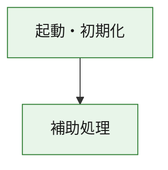
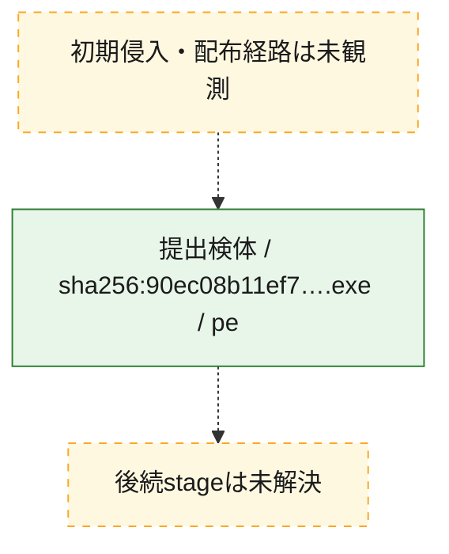
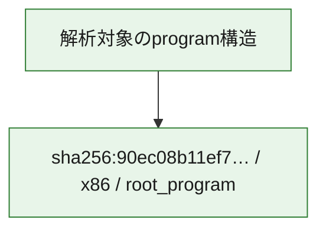

# 全体ロジック：90ec08b11ef7fe170adcd007b2a8f58c4d3faedcb9ce0988f63f6e9179a13e71

代表関数の静的証跡から、起動・初期化の処理群を確認しました。

## 読み方

- phaseの掲載順は解析上の整理順です。observed_call_edgesがない段階間の実行順を断定しません。
- 図の実線は静的に観測した関係、点線と黄色のノードは未観測・未解決の関係を示します。
- 図は静的な要約であり、動的実行を再現するものではありません。
- 詳細な関数解説とfingerprintは[STATIC-LOGIC.md](STATIC-LOGIC.md)を参照してください。

## 静的可視化

### 実行フロー

### 感染チェーン

### モジュール関係

## 処理段階

### 1. 起動・初期化

entry pointから初期化と後続処理への移行を確認します。
確度: `confirmed_static_function_evidence`

- `90ec08b11ef7fe170adcd007b2a8f58c4d3faedcb9ce0988f63f6e9179a13e71:ghidra:180001010` — 初期化と主要処理への分岐を行う入口関数です。 状態: `succeeded`、選定理由: `entry_point`, `meaningful_symbol_name`, `reviewed_call_centrality:22`, `role:entrypoint`, `small_program_complete_context`

### 2. 補助処理

主要処理を支える一般内部関数またはlibrary処理を確認します。
確度: `confirmed_static_function_evidence`

- `90ec08b11ef7fe170adcd007b2a8f58c4d3faedcb9ce0988f63f6e9179a13e71:ghidra:180001240` — 検体内部の一般処理を実装する関数です。 状態: `succeeded`、選定理由: `context_representative`, `reviewed_call_centrality:2`, `small_program_complete_context`
- `90ec08b11ef7fe170adcd007b2a8f58c4d3faedcb9ce0988f63f6e9179a13e71:ghidra:180001350` — 検体内部の一般処理を実装する関数です。 状態: `succeeded`、選定理由: `context_representative`, `reviewed_call_centrality:25`, `small_program_complete_context`
- `90ec08b11ef7fe170adcd007b2a8f58c4d3faedcb9ce0988f63f6e9179a13e71:ghidra:180003780` — 検体内部の一般処理を実装する関数です。 状態: `succeeded`、選定理由: `context_representative`, `reviewed_call_centrality:2`, `small_program_complete_context`
- `90ec08b11ef7fe170adcd007b2a8f58c4d3faedcb9ce0988f63f6e9179a13e71:ghidra:1800038e0` — 検体内部の一般処理を実装する関数です。 状態: `succeeded`、選定理由: `context_representative`, `reviewed_call_centrality:2`, `small_program_complete_context`

## 観測したcall関係

- `90ec08b11ef7fe170adcd007b2a8f58c4d3faedcb9ce0988f63f6e9179a13e71:ghidra:180001010` → `90ec08b11ef7fe170adcd007b2a8f58c4d3faedcb9ce0988f63f6e9179a13e71:ghidra:180001240` （`startup` → `support`）
- `90ec08b11ef7fe170adcd007b2a8f58c4d3faedcb9ce0988f63f6e9179a13e71:ghidra:180001010` → `90ec08b11ef7fe170adcd007b2a8f58c4d3faedcb9ce0988f63f6e9179a13e71:ghidra:180001350` （`startup` → `support`）
- `90ec08b11ef7fe170adcd007b2a8f58c4d3faedcb9ce0988f63f6e9179a13e71:ghidra:180001350` → `90ec08b11ef7fe170adcd007b2a8f58c4d3faedcb9ce0988f63f6e9179a13e71:ghidra:180001240` （`support` → `support`）
- `90ec08b11ef7fe170adcd007b2a8f58c4d3faedcb9ce0988f63f6e9179a13e71:ghidra:180001350` → `90ec08b11ef7fe170adcd007b2a8f58c4d3faedcb9ce0988f63f6e9179a13e71:ghidra:180003780` （`support` → `support`）
- `90ec08b11ef7fe170adcd007b2a8f58c4d3faedcb9ce0988f63f6e9179a13e71:ghidra:180001350` → `90ec08b11ef7fe170adcd007b2a8f58c4d3faedcb9ce0988f63f6e9179a13e71:ghidra:1800038e0` （`support` → `support`）
- `90ec08b11ef7fe170adcd007b2a8f58c4d3faedcb9ce0988f63f6e9179a13e71:ghidra:180003780` → `90ec08b11ef7fe170adcd007b2a8f58c4d3faedcb9ce0988f63f6e9179a13e71:ghidra:1800038e0` （`support` → `support`）
- `ghidra-function:1ef2c6aaa5bb61b00429eb8b` → `ghidra-function:0466391f7e4e14430e6665ce` （`unclassified` → `unclassified`）
- `ghidra-function:1ef2c6aaa5bb61b00429eb8b` → `ghidra-function:24f1ae889491237d1d266a2f` （`unclassified` → `unclassified`）
- `ghidra-function:1ef2c6aaa5bb61b00429eb8b` → `ghidra-function:29673283fb77d2d31482b6fd` （`unclassified` → `unclassified`）
- `ghidra-function:1ef2c6aaa5bb61b00429eb8b` → `ghidra-function:4246af9d50fef3e07cbb8135` （`unclassified` → `unclassified`）
- `ghidra-function:1ef2c6aaa5bb61b00429eb8b` → `ghidra-function:4d6a0b78d0a1fc1780f7abef` （`unclassified` → `unclassified`）
- `ghidra-function:1ef2c6aaa5bb61b00429eb8b` → `ghidra-function:5bed93e3709e4d5c0b60913b` （`unclassified` → `unclassified`）
- `ghidra-function:1ef2c6aaa5bb61b00429eb8b` → `ghidra-function:6697b8df198b4eb9ea011e1e` （`unclassified` → `unclassified`）
- `ghidra-function:1ef2c6aaa5bb61b00429eb8b` → `ghidra-function:7857a6ac8e1d08b366f0ea4e` （`unclassified` → `unclassified`）
- `ghidra-function:1ef2c6aaa5bb61b00429eb8b` → `ghidra-function:9fb8fb233bbbc07e9b165f98` （`unclassified` → `unclassified`）
- `ghidra-function:1ef2c6aaa5bb61b00429eb8b` → `ghidra-function:bec8fb5fc34ad97b318cca1d` （`unclassified` → `unclassified`）
- `ghidra-function:1ef2c6aaa5bb61b00429eb8b` → `ghidra-function:fe4bf1787fae57a3d14ec90d` （`unclassified` → `unclassified`）
- `ghidra-function:1ef2c6aaa5bb61b00429eb8b` → `ghidra-function:ff4aeda3e2fb27fb8aa52b57` （`unclassified` → `unclassified`）
- `ghidra-function:7857a6ac8e1d08b366f0ea4e` → `ghidra-external:0dcdea529680dbb9218e1851` （`unclassified` → `unclassified`）
- `ghidra-function:7857a6ac8e1d08b366f0ea4e` → `ghidra-external:180d147784b01afab4cf697c` （`unclassified` → `unclassified`）
- `ghidra-function:7857a6ac8e1d08b366f0ea4e` → `ghidra-external:1fe7c47d154bc052c430abcf` （`unclassified` → `unclassified`）
- `ghidra-function:7857a6ac8e1d08b366f0ea4e` → `ghidra-external:2f39a1ab7b6c5926f00eb9c0` （`unclassified` → `unclassified`）
- `ghidra-function:7857a6ac8e1d08b366f0ea4e` → `ghidra-external:3796a70edbcd71d2aa0bcc2c` （`unclassified` → `unclassified`）
- `ghidra-function:7857a6ac8e1d08b366f0ea4e` → `ghidra-external:523f7f24051d3681316bbe9a` （`unclassified` → `unclassified`）
- `ghidra-function:7857a6ac8e1d08b366f0ea4e` → `ghidra-external:62c5cd8cf092440868318e87` （`unclassified` → `unclassified`）
- `ghidra-function:7857a6ac8e1d08b366f0ea4e` → `ghidra-external:63d51dea686a1e619bcdf455` （`unclassified` → `unclassified`）
- `ghidra-function:7857a6ac8e1d08b366f0ea4e` → `ghidra-external:6930688975c9912530363977` （`unclassified` → `unclassified`）
- `ghidra-function:7857a6ac8e1d08b366f0ea4e` → `ghidra-external:6c703d4ed1bd95e6a8f2c6af` （`unclassified` → `unclassified`）
- `ghidra-function:7857a6ac8e1d08b366f0ea4e` → `ghidra-external:8300c80b3a9e2cf2e4683ce3` （`unclassified` → `unclassified`）
- `ghidra-function:7857a6ac8e1d08b366f0ea4e` → `ghidra-external:92e79643c1b4b94c1789dd09` （`unclassified` → `unclassified`）
- `ghidra-function:7857a6ac8e1d08b366f0ea4e` → `ghidra-external:961924cfb8e684f1aedb2578` （`unclassified` → `unclassified`）
- `ghidra-function:7857a6ac8e1d08b366f0ea4e` → `ghidra-external:98a2f49451e234322a3a6a6a` （`unclassified` → `unclassified`）
- `ghidra-function:7857a6ac8e1d08b366f0ea4e` → `ghidra-external:b07b6e0ecbda9f11c4bea7bd` （`unclassified` → `unclassified`）
- `ghidra-function:7857a6ac8e1d08b366f0ea4e` → `ghidra-external:ca6574071e1ad15181de6209` （`unclassified` → `unclassified`）
- `ghidra-function:7857a6ac8e1d08b366f0ea4e` → `ghidra-external:d04e68055024a0f79416ee16` （`unclassified` → `unclassified`）
- `ghidra-function:7857a6ac8e1d08b366f0ea4e` → `ghidra-external:d6ccf51658aa83b59182abe9` （`unclassified` → `unclassified`）
- `ghidra-function:7857a6ac8e1d08b366f0ea4e` → `ghidra-external:f090018f8dc3b08f7e52483d` （`unclassified` → `unclassified`）
- `ghidra-function:7857a6ac8e1d08b366f0ea4e` → `ghidra-external:f951218d4ee43d98efe1e175` （`unclassified` → `unclassified`）
- `ghidra-function:7857a6ac8e1d08b366f0ea4e` → `ghidra-external:febb9714276237606b69739c` （`unclassified` → `unclassified`）
- `ghidra-function:7857a6ac8e1d08b366f0ea4e` → `ghidra-function:4246af9d50fef3e07cbb8135` （`unclassified` → `unclassified`）
- `ghidra-function:7857a6ac8e1d08b366f0ea4e` → `ghidra-function:7bd3f00b42d9e8f11df35556` （`unclassified` → `unclassified`）
- `ghidra-function:7857a6ac8e1d08b366f0ea4e` → `ghidra-function:fb6f2e568efe74d91267010e` （`unclassified` → `unclassified`）
- `ghidra-function:fb6f2e568efe74d91267010e` → `ghidra-function:7bd3f00b42d9e8f11df35556` （`unclassified` → `unclassified`）

## 解析範囲と制約

- 選定外関数は全体inventoryへ残しますが、関数本体の個別解説対象にはしていません。
- indirect call、難読化、packer、VM、壊れたcontrol flowによりcall関係が欠落する場合があります。
- 文書は静的解析に基づき、検体実行や外部通信による動的確認は行っていません。
