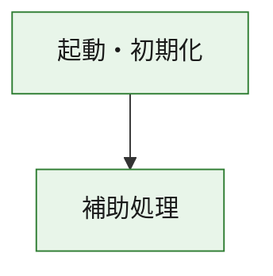
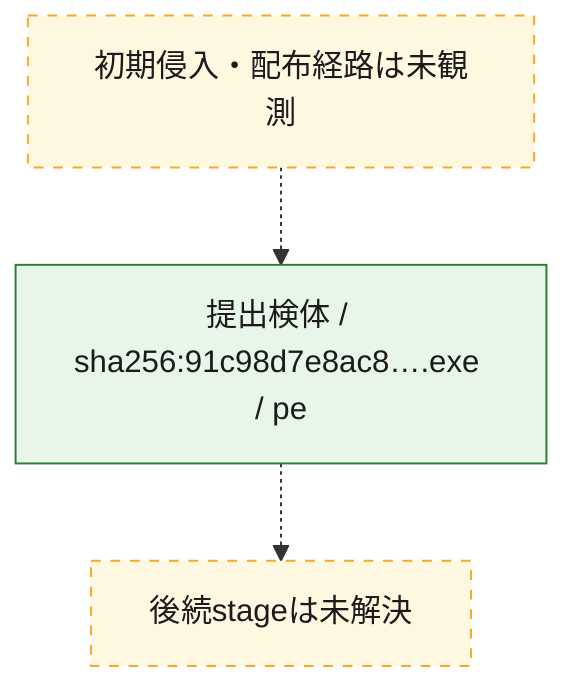
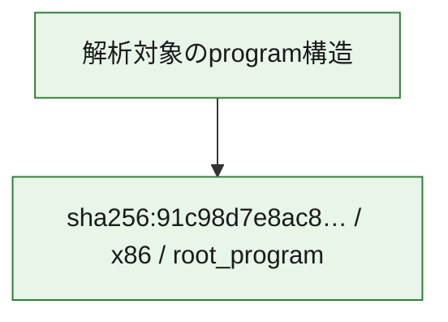

# 全体ロジック：91c98d7e8ac829e97876decf4f3a2a4bd699f96abf8a937c2b2d9afbaa3686e4

代表関数の静的証跡から、起動・初期化の処理群を確認しました。

## 読み方

- phaseの掲載順は解析上の整理順です。observed_call_edgesがない段階間の実行順を断定しません。
- 図の実線は静的に観測した関係、点線と黄色のノードは未観測・未解決の関係を示します。
- 図は静的な要約であり、動的実行を再現するものではありません。
- 詳細な関数解説とfingerprintは[STATIC-LOGIC.md](STATIC-LOGIC.md)を参照してください。

## 静的可視化

### 実行フロー

### 感染チェーン

### モジュール関係

## 処理段階

### 1. 起動・初期化

entry pointから初期化と後続処理への移行を確認します。
確度: `confirmed_static_function_evidence`

- `91c98d7e8ac829e97876decf4f3a2a4bd699f96abf8a937c2b2d9afbaa3686e4:ghidra:180001010` — 初期化と主要処理への分岐を行う入口関数です。 状態: `succeeded`、選定理由: `entry_point`, `meaningful_symbol_name`, `reviewed_call_centrality:22`, `role:entrypoint`, `small_program_complete_context`

### 2. 補助処理

主要処理を支える一般内部関数またはlibrary処理を確認します。
確度: `confirmed_static_function_evidence`

- `91c98d7e8ac829e97876decf4f3a2a4bd699f96abf8a937c2b2d9afbaa3686e4:ghidra:180001240` — 検体内部の一般処理を実装する関数です。 状態: `succeeded`、選定理由: `context_representative`, `reviewed_call_centrality:2`, `small_program_complete_context`
- `91c98d7e8ac829e97876decf4f3a2a4bd699f96abf8a937c2b2d9afbaa3686e4:ghidra:180001350` — 検体内部の一般処理を実装する関数です。 状態: `succeeded`、選定理由: `context_representative`, `reviewed_call_centrality:25`, `small_program_complete_context`
- `91c98d7e8ac829e97876decf4f3a2a4bd699f96abf8a937c2b2d9afbaa3686e4:ghidra:180003780` — 検体内部の一般処理を実装する関数です。 状態: `succeeded`、選定理由: `context_representative`, `reviewed_call_centrality:2`, `small_program_complete_context`
- `91c98d7e8ac829e97876decf4f3a2a4bd699f96abf8a937c2b2d9afbaa3686e4:ghidra:1800038e0` — 検体内部の一般処理を実装する関数です。 状態: `succeeded`、選定理由: `context_representative`, `reviewed_call_centrality:2`, `small_program_complete_context`

## 観測したcall関係

- `91c98d7e8ac829e97876decf4f3a2a4bd699f96abf8a937c2b2d9afbaa3686e4:ghidra:180001010` → `91c98d7e8ac829e97876decf4f3a2a4bd699f96abf8a937c2b2d9afbaa3686e4:ghidra:180001240` （`startup` → `support`）
- `91c98d7e8ac829e97876decf4f3a2a4bd699f96abf8a937c2b2d9afbaa3686e4:ghidra:180001010` → `91c98d7e8ac829e97876decf4f3a2a4bd699f96abf8a937c2b2d9afbaa3686e4:ghidra:180001350` （`startup` → `support`）
- `91c98d7e8ac829e97876decf4f3a2a4bd699f96abf8a937c2b2d9afbaa3686e4:ghidra:180001350` → `91c98d7e8ac829e97876decf4f3a2a4bd699f96abf8a937c2b2d9afbaa3686e4:ghidra:180001240` （`support` → `support`）
- `91c98d7e8ac829e97876decf4f3a2a4bd699f96abf8a937c2b2d9afbaa3686e4:ghidra:180001350` → `91c98d7e8ac829e97876decf4f3a2a4bd699f96abf8a937c2b2d9afbaa3686e4:ghidra:180003780` （`support` → `support`）
- `91c98d7e8ac829e97876decf4f3a2a4bd699f96abf8a937c2b2d9afbaa3686e4:ghidra:180001350` → `91c98d7e8ac829e97876decf4f3a2a4bd699f96abf8a937c2b2d9afbaa3686e4:ghidra:1800038e0` （`support` → `support`）
- `91c98d7e8ac829e97876decf4f3a2a4bd699f96abf8a937c2b2d9afbaa3686e4:ghidra:180003780` → `91c98d7e8ac829e97876decf4f3a2a4bd699f96abf8a937c2b2d9afbaa3686e4:ghidra:1800038e0` （`support` → `support`）
- `ghidra-function:421f08a622c187f5b87d614e` → `ghidra-function:edaabf5cd9635af1deccf5cf` （`unclassified` → `unclassified`）
- `ghidra-function:74509c8423b024fc33234720` → `ghidra-external:14e5998c2a0633f6075cbabb` （`unclassified` → `unclassified`）
- `ghidra-function:74509c8423b024fc33234720` → `ghidra-external:2b9c0dc5d031a383d2e54f5b` （`unclassified` → `unclassified`）
- `ghidra-function:74509c8423b024fc33234720` → `ghidra-external:396938601796f91aedb7d7cc` （`unclassified` → `unclassified`）
- `ghidra-function:74509c8423b024fc33234720` → `ghidra-external:539716cbd7eacd1568b45938` （`unclassified` → `unclassified`）
- `ghidra-function:74509c8423b024fc33234720` → `ghidra-external:55ebf388190a421e71219bd2` （`unclassified` → `unclassified`）
- `ghidra-function:74509c8423b024fc33234720` → `ghidra-external:5d7fc99b8023093d0b6f34d2` （`unclassified` → `unclassified`）
- `ghidra-function:74509c8423b024fc33234720` → `ghidra-external:765dbb2df944a5958ab4a431` （`unclassified` → `unclassified`）
- `ghidra-function:74509c8423b024fc33234720` → `ghidra-external:892be355b88b589c2100d626` （`unclassified` → `unclassified`）
- `ghidra-function:74509c8423b024fc33234720` → `ghidra-external:96e5f68b848eea367381a048` （`unclassified` → `unclassified`）
- `ghidra-function:74509c8423b024fc33234720` → `ghidra-external:9f5b8565a5d7b878447a1efe` （`unclassified` → `unclassified`）
- `ghidra-function:74509c8423b024fc33234720` → `ghidra-external:a17b280b64ccdc3b65cd499d` （`unclassified` → `unclassified`）
- `ghidra-function:74509c8423b024fc33234720` → `ghidra-external:a51a3106c4658965abdc1937` （`unclassified` → `unclassified`）
- `ghidra-function:74509c8423b024fc33234720` → `ghidra-external:ae2cd1657ca86d9760118f9a` （`unclassified` → `unclassified`）
- `ghidra-function:74509c8423b024fc33234720` → `ghidra-external:c44ed6561867f4525077947b` （`unclassified` → `unclassified`）
- `ghidra-function:74509c8423b024fc33234720` → `ghidra-external:c642712c7492b014b6e103db` （`unclassified` → `unclassified`）
- `ghidra-function:74509c8423b024fc33234720` → `ghidra-external:cb0ec2eb10455d88d750e119` （`unclassified` → `unclassified`）
- `ghidra-function:74509c8423b024fc33234720` → `ghidra-external:cd0740528cbd3f02a0dd5d53` （`unclassified` → `unclassified`）
- `ghidra-function:74509c8423b024fc33234720` → `ghidra-external:d66a8ac153ef967008afbcd0` （`unclassified` → `unclassified`）
- `ghidra-function:74509c8423b024fc33234720` → `ghidra-external:da360e01f59f043683f1c38b` （`unclassified` → `unclassified`）
- `ghidra-function:74509c8423b024fc33234720` → `ghidra-external:ee265ae812f7eefc887ebfd7` （`unclassified` → `unclassified`）
- `ghidra-function:74509c8423b024fc33234720` → `ghidra-external:f0621fd2486d45dd56332366` （`unclassified` → `unclassified`）
- `ghidra-function:74509c8423b024fc33234720` → `ghidra-function:421f08a622c187f5b87d614e` （`unclassified` → `unclassified`）
- `ghidra-function:74509c8423b024fc33234720` → `ghidra-function:c358b9c83e9c366dafe1c1a7` （`unclassified` → `unclassified`）
- `ghidra-function:74509c8423b024fc33234720` → `ghidra-function:edaabf5cd9635af1deccf5cf` （`unclassified` → `unclassified`）
- `ghidra-function:f1a9b11fb46e16826235584f` → `ghidra-function:094b9b13ce3d0d18705b47ef` （`unclassified` → `unclassified`）
- `ghidra-function:f1a9b11fb46e16826235584f` → `ghidra-function:2f0516e60e2230c403397790` （`unclassified` → `unclassified`）
- `ghidra-function:f1a9b11fb46e16826235584f` → `ghidra-function:64a556a6171d6f9ed51cf156` （`unclassified` → `unclassified`）
- `ghidra-function:f1a9b11fb46e16826235584f` → `ghidra-function:6e043ed8b08175d53bcbd1cc` （`unclassified` → `unclassified`）
- `ghidra-function:f1a9b11fb46e16826235584f` → `ghidra-function:74509c8423b024fc33234720` （`unclassified` → `unclassified`）
- `ghidra-function:f1a9b11fb46e16826235584f` → `ghidra-function:74af0fdfa34682600fe94104` （`unclassified` → `unclassified`）
- `ghidra-function:f1a9b11fb46e16826235584f` → `ghidra-function:81f6cd51de27000a18e48546` （`unclassified` → `unclassified`）
- `ghidra-function:f1a9b11fb46e16826235584f` → `ghidra-function:a3a19069a979ddd05b05b474` （`unclassified` → `unclassified`）
- `ghidra-function:f1a9b11fb46e16826235584f` → `ghidra-function:b6bf248f109b94fd077fb817` （`unclassified` → `unclassified`）
- `ghidra-function:f1a9b11fb46e16826235584f` → `ghidra-function:c358b9c83e9c366dafe1c1a7` （`unclassified` → `unclassified`）
- `ghidra-function:f1a9b11fb46e16826235584f` → `ghidra-function:d832c83425f01e3cfbda848b` （`unclassified` → `unclassified`）
- `ghidra-function:f1a9b11fb46e16826235584f` → `ghidra-function:ef628561eb6d2cc68daf4178` （`unclassified` → `unclassified`）

## 解析範囲と制約

- 選定外関数は全体inventoryへ残しますが、関数本体の個別解説対象にはしていません。
- indirect call、難読化、packer、VM、壊れたcontrol flowによりcall関係が欠落する場合があります。
- 文書は静的解析に基づき、検体実行や外部通信による動的確認は行っていません。
