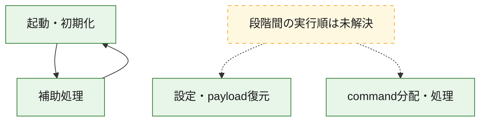
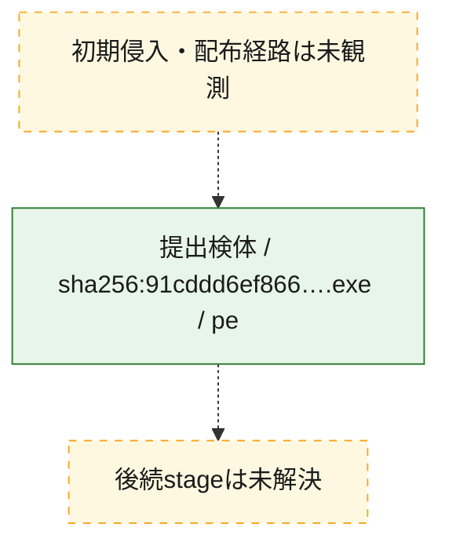
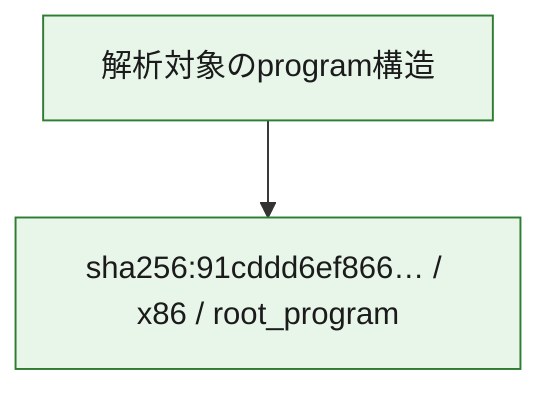

# 全体ロジック：91cddd6ef8669dce24436b541036e45c5cff93a018050c1719fb11c7947d6a8c

代表関数の静的証跡から、起動・初期化、設定・payload復元、command分配・処理の処理群を確認しました。

## 読み方

- phaseの掲載順は解析上の整理順です。observed_call_edgesがない段階間の実行順を断定しません。
- 図の実線は静的に観測した関係、点線と黄色のノードは未観測・未解決の関係を示します。
- 図は静的な要約であり、動的実行を再現するものではありません。
- 詳細な関数解説とfingerprintは[STATIC-LOGIC.md](STATIC-LOGIC.md)を参照してください。

## 静的可視化

### 実行フロー

### 感染チェーン

### モジュール関係

## 処理段階

### 1. 起動・初期化

entry pointから初期化と後続処理への移行を確認します。
確度: `confirmed_static_function_evidence`

- `91cddd6ef8669dce24436b541036e45c5cff93a018050c1719fb11c7947d6a8c:ghidra:1400ef380` — 初期化と主要処理への分岐を行う入口関数です。 状態: `succeeded`、選定理由: `entry_point`, `meaningful_symbol_name`, `probable_go_main_user_code`, `reviewed_call_centrality:33`, `role:entrypoint`

### 2. 設定・payload復元

設定、resource、payload、暗号化データの復元・変換を確認します。
確度: `confirmed_static_function_evidence`

- `91cddd6ef8669dce24436b541036e45c5cff93a018050c1719fb11c7947d6a8c:ghidra:140038880` — 暗号、hash、encoding、または復号処理に関係する関数です。 状態: `succeeded`、選定理由: `meaningful_symbol_name`, `reviewed_call_centrality:1`, `role:cryptographic_transform`
- `91cddd6ef8669dce24436b541036e45c5cff93a018050c1719fb11c7947d6a8c:ghidra:140038e40` — 暗号、hash、encoding、または復号処理に関係する関数です。 状態: `succeeded`、選定理由: `meaningful_symbol_name`, `reviewed_call_centrality:1`, `role:cryptographic_transform`
- `91cddd6ef8669dce24436b541036e45c5cff93a018050c1719fb11c7947d6a8c:ghidra:140052420` — 暗号、hash、encoding、または復号処理に関係する関数です。 状態: `succeeded`、選定理由: `meaningful_symbol_name`, `reviewed_call_centrality:1`, `role:cryptographic_transform`
- `91cddd6ef8669dce24436b541036e45c5cff93a018050c1719fb11c7947d6a8c:ghidra:1400529c0` — 暗号、hash、encoding、または復号処理に関係する関数です。 状態: `succeeded`、選定理由: `meaningful_symbol_name`, `reviewed_call_centrality:1`, `role:cryptographic_transform`
- `91cddd6ef8669dce24436b541036e45c5cff93a018050c1719fb11c7947d6a8c:ghidra:1400e7080` — 暗号、hash、encoding、または復号処理に関係する関数です。 状態: `succeeded`、選定理由: `meaningful_symbol_name`, `role:cryptographic_transform`
- `91cddd6ef8669dce24436b541036e45c5cff93a018050c1719fb11c7947d6a8c:ghidra:1400e7cc0` — 暗号、hash、encoding、または復号処理に関係する関数です。 状態: `succeeded`、選定理由: `meaningful_symbol_name`, `role:cryptographic_transform`

### 3. command分配・処理

受信commandやtaskの解釈、分配、個別handlerへの移行を確認します。
確度: `confirmed_static_function_evidence`

- `91cddd6ef8669dce24436b541036e45c5cff93a018050c1719fb11c7947d6a8c:ghidra:140010070` — commandの解釈、分配、または個別処理を担当する関数です。 状態: `succeeded`、選定理由: `meaningful_symbol_name`, `reviewed_call_centrality:6`, `role:command_dispatch_or_handler`
- `91cddd6ef8669dce24436b541036e45c5cff93a018050c1719fb11c7947d6a8c:ghidra:14001e810` — commandの解釈、分配、または個別処理を担当する関数です。 状態: `succeeded`、選定理由: `meaningful_symbol_name`, `role:command_dispatch_or_handler`
- `91cddd6ef8669dce24436b541036e45c5cff93a018050c1719fb11c7947d6a8c:ghidra:140023f60` — commandの解釈、分配、または個別処理を担当する関数です。 状態: `succeeded`、選定理由: `meaningful_symbol_name`, `reviewed_call_centrality:13`, `role:command_dispatch_or_handler`
- `91cddd6ef8669dce24436b541036e45c5cff93a018050c1719fb11c7947d6a8c:ghidra:1400e8590` — commandの解釈、分配、または個別処理を担当する関数です。 状態: `succeeded`、選定理由: `meaningful_symbol_name`, `reviewed_call_centrality:2`, `role:command_dispatch_or_handler`
- `91cddd6ef8669dce24436b541036e45c5cff93a018050c1719fb11c7947d6a8c:ghidra:1400e9e00` — commandの解釈、分配、または個別処理を担当する関数です。 状態: `succeeded`、選定理由: `meaningful_symbol_name`, `reviewed_call_centrality:1`, `role:command_dispatch_or_handler`

### 4. 補助処理

主要処理を支える一般内部関数またはlibrary処理を確認します。
確度: `confirmed_static_function_evidence_with_limits`

- `91cddd6ef8669dce24436b541036e45c5cff93a018050c1719fb11c7947d6a8c:ghidra:140001010` — 検体内部の一般処理を実装する関数です。 状態: `succeeded`、選定理由: `meaningful_symbol_name`
- `91cddd6ef8669dce24436b541036e45c5cff93a018050c1719fb11c7947d6a8c:ghidra:140001030` — 検体内部の一般処理を実装する関数です。 状態: `limited_bad_instruction_or_flow`、選定理由: `meaningful_symbol_name`, `reviewed_call_centrality:2`
- `91cddd6ef8669dce24436b541036e45c5cff93a018050c1719fb11c7947d6a8c:ghidra:140001460` — 検体内部の一般処理を実装する関数です。 状態: `succeeded`、選定理由: `meaningful_symbol_name`, `reviewed_call_centrality:30`
- `91cddd6ef8669dce24436b541036e45c5cff93a018050c1719fb11c7947d6a8c:ghidra:140001480` — 検体内部の一般処理を実装する関数です。 状態: `succeeded`、選定理由: `entry_point`, `meaningful_symbol_name`, `reviewed_call_centrality:30`
- `91cddd6ef8669dce24436b541036e45c5cff93a018050c1719fb11c7947d6a8c:ghidra:1400014a0` — 検体内部の一般処理を実装する関数です。 状態: `limited_bad_instruction_or_flow`、選定理由: `meaningful_symbol_name`, `reviewed_call_centrality:2`
- `91cddd6ef8669dce24436b541036e45c5cff93a018050c1719fb11c7947d6a8c:ghidra:1400014e0` — 検体内部の一般処理を実装する関数です。 状態: `succeeded`、選定理由: `meaningful_symbol_name`, `reviewed_call_centrality:3`
- `91cddd6ef8669dce24436b541036e45c5cff93a018050c1719fb11c7947d6a8c:ghidra:1400015a0` — 検体内部の一般処理を実装する関数です。 状態: `succeeded`、選定理由: `meaningful_symbol_name`, `reviewed_call_centrality:14`
- `91cddd6ef8669dce24436b541036e45c5cff93a018050c1719fb11c7947d6a8c:ghidra:140001620` — 検体内部の一般処理を実装する関数です。 状態: `succeeded`、選定理由: `meaningful_symbol_name`, `reviewed_call_centrality:3`
- `91cddd6ef8669dce24436b541036e45c5cff93a018050c1719fb11c7947d6a8c:ghidra:1400016d0` — 検体内部の一般処理を実装する関数です。 状態: `succeeded`、選定理由: `meaningful_symbol_name`, `reviewed_call_centrality:26`
- `91cddd6ef8669dce24436b541036e45c5cff93a018050c1719fb11c7947d6a8c:ghidra:140001790` — 検体内部の一般処理を実装する関数です。 状態: `succeeded`、選定理由: `meaningful_symbol_name`, `reviewed_call_centrality:22`
- `91cddd6ef8669dce24436b541036e45c5cff93a018050c1719fb11c7947d6a8c:ghidra:140001930` — 検体内部の一般処理を実装する関数です。 状態: `succeeded`、選定理由: `meaningful_symbol_name`, `reviewed_call_centrality:11`
- `91cddd6ef8669dce24436b541036e45c5cff93a018050c1719fb11c7947d6a8c:ghidra:140001be0` — 検体内部の一般処理を実装する関数です。 状態: `succeeded`、選定理由: `meaningful_symbol_name`, `reviewed_call_centrality:5`
- `91cddd6ef8669dce24436b541036e45c5cff93a018050c1719fb11c7947d6a8c:ghidra:140001c50` — 検体内部の一般処理を実装する関数です。 状態: `succeeded`、選定理由: `meaningful_symbol_name`, `reviewed_call_centrality:4`
- `91cddd6ef8669dce24436b541036e45c5cff93a018050c1719fb11c7947d6a8c:ghidra:140001cb0` — 検体内部の一般処理を実装する関数です。 状態: `succeeded`、選定理由: `meaningful_symbol_name`, `reviewed_call_centrality:17`
- `91cddd6ef8669dce24436b541036e45c5cff93a018050c1719fb11c7947d6a8c:ghidra:1400024c0` — 検体内部の一般処理を実装する関数です。 状態: `succeeded`、選定理由: `meaningful_symbol_name`
- `91cddd6ef8669dce24436b541036e45c5cff93a018050c1719fb11c7947d6a8c:ghidra:140002590` — 検体内部の一般処理を実装する関数です。 状態: `succeeded`、選定理由: `meaningful_symbol_name`
- `91cddd6ef8669dce24436b541036e45c5cff93a018050c1719fb11c7947d6a8c:ghidra:1400025f0` — 検体内部の一般処理を実装する関数です。 状態: `succeeded`、選定理由: `meaningful_symbol_name`, `reviewed_call_centrality:1`
- `91cddd6ef8669dce24436b541036e45c5cff93a018050c1719fb11c7947d6a8c:ghidra:1400026c0` — 検体内部の一般処理を実装する関数です。 状態: `succeeded`、選定理由: `meaningful_symbol_name`, `reviewed_call_centrality:1`
- `91cddd6ef8669dce24436b541036e45c5cff93a018050c1719fb11c7947d6a8c:ghidra:140002740` — 検体内部の一般処理を実装する関数です。 状態: `succeeded`、選定理由: `meaningful_symbol_name`
- `91cddd6ef8669dce24436b541036e45c5cff93a018050c1719fb11c7947d6a8c:ghidra:14001e580` — compiler生成処理または汎用library処理とみられる関数です。 状態: `limited_bad_instruction_or_flow`、選定理由: `entry_point`, `meaningful_symbol_name`, `reviewed_call_centrality:12`

## 観測したcall関係

- `91cddd6ef8669dce24436b541036e45c5cff93a018050c1719fb11c7947d6a8c:ghidra:140001460` → `91cddd6ef8669dce24436b541036e45c5cff93a018050c1719fb11c7947d6a8c:ghidra:1400ef380` （`support` → `startup`）
- `91cddd6ef8669dce24436b541036e45c5cff93a018050c1719fb11c7947d6a8c:ghidra:140001480` → `91cddd6ef8669dce24436b541036e45c5cff93a018050c1719fb11c7947d6a8c:ghidra:1400ef380` （`support` → `startup`）
- `91cddd6ef8669dce24436b541036e45c5cff93a018050c1719fb11c7947d6a8c:ghidra:1400026c0` → `91cddd6ef8669dce24436b541036e45c5cff93a018050c1719fb11c7947d6a8c:ghidra:1400025f0` （`support` → `support`）
- `91cddd6ef8669dce24436b541036e45c5cff93a018050c1719fb11c7947d6a8c:ghidra:1400ef380` → `91cddd6ef8669dce24436b541036e45c5cff93a018050c1719fb11c7947d6a8c:ghidra:140001790` （`startup` → `support`）
- `91cddd6ef8669dce24436b541036e45c5cff93a018050c1719fb11c7947d6a8c:ghidra:1400ef380` → `91cddd6ef8669dce24436b541036e45c5cff93a018050c1719fb11c7947d6a8c:ghidra:140001930` （`startup` → `support`）
- `91cddd6ef8669dce24436b541036e45c5cff93a018050c1719fb11c7947d6a8c:ghidra:1400ef380` → `91cddd6ef8669dce24436b541036e45c5cff93a018050c1719fb11c7947d6a8c:ghidra:140001cb0` （`startup` → `support`）
- `ghidra-function:021b2d390de32ec042b7a98e` → `ghidra-external:086210c72781a08300a1adf6` （`unclassified` → `unclassified`）
- `ghidra-function:021b2d390de32ec042b7a98e` → `ghidra-external:0bdf8b7aaf83e12b2d8f4074` （`unclassified` → `unclassified`）
- `ghidra-function:021b2d390de32ec042b7a98e` → `ghidra-external:0fb4237e0bb1be43345c748a` （`unclassified` → `unclassified`）
- `ghidra-function:021b2d390de32ec042b7a98e` → `ghidra-external:34ba8659adb427511e6c96d2` （`unclassified` → `unclassified`）
- `ghidra-function:021b2d390de32ec042b7a98e` → `ghidra-external:56a6e4f47efacbac9a37915e` （`unclassified` → `unclassified`）
- `ghidra-function:021b2d390de32ec042b7a98e` → `ghidra-external:5c0fa601f0112015f315109d` （`unclassified` → `unclassified`）
- `ghidra-function:021b2d390de32ec042b7a98e` → `ghidra-external:86b4a722b05f7fdb77e769c6` （`unclassified` → `unclassified`）
- `ghidra-function:021b2d390de32ec042b7a98e` → `ghidra-external:88fb9b69a429ba6e60afb703` （`unclassified` → `unclassified`）
- `ghidra-function:021b2d390de32ec042b7a98e` → `ghidra-external:8bcfb8314d6fbc2b45989127` （`unclassified` → `unclassified`）
- `ghidra-function:021b2d390de32ec042b7a98e` → `ghidra-external:8bdfb478e6ce5c290b5ede2c` （`unclassified` → `unclassified`）
- `ghidra-function:021b2d390de32ec042b7a98e` → `ghidra-external:8cbad5f2507f8b0d595de568` （`unclassified` → `unclassified`）
- `ghidra-function:021b2d390de32ec042b7a98e` → `ghidra-external:9207e52c8e54bd54235ad96a` （`unclassified` → `unclassified`）
- `ghidra-function:021b2d390de32ec042b7a98e` → `ghidra-external:a48688f949647ac07b7cb129` （`unclassified` → `unclassified`）
- `ghidra-function:021b2d390de32ec042b7a98e` → `ghidra-external:b723290df00226fbb5464dbe` （`unclassified` → `unclassified`）
- `ghidra-function:021b2d390de32ec042b7a98e` → `ghidra-external:ba026b31f9edddcf8094c98e` （`unclassified` → `unclassified`）
- `ghidra-function:021b2d390de32ec042b7a98e` → `ghidra-external:c8da4aa378ab34f36e2a85aa` （`unclassified` → `unclassified`）
- `ghidra-function:021b2d390de32ec042b7a98e` → `ghidra-external:d22753b0852e704525e92ee1` （`unclassified` → `unclassified`）
- `ghidra-function:021b2d390de32ec042b7a98e` → `ghidra-external:ede6251dae7de35b743538f9` （`unclassified` → `unclassified`）
- `ghidra-function:021b2d390de32ec042b7a98e` → `ghidra-external:efcfa46b2bf13502d6ec030a` （`unclassified` → `unclassified`）
- `ghidra-function:021b2d390de32ec042b7a98e` → `ghidra-function:54c5aabe073771ce90255580` （`unclassified` → `unclassified`）
- `ghidra-function:021b2d390de32ec042b7a98e` → `ghidra-function:7f120d908c08a9df262dd7fc` （`unclassified` → `unclassified`）
- `ghidra-function:021b2d390de32ec042b7a98e` → `ghidra-function:8c4e7928615ed5b77f225d76` （`unclassified` → `unclassified`）
- `ghidra-function:021b2d390de32ec042b7a98e` → `ghidra-function:9bd53fce5c2085bcdf30378a` （`unclassified` → `unclassified`）
- `ghidra-function:021b2d390de32ec042b7a98e` → `ghidra-function:a571691f1593a9b48017c1bb` （`unclassified` → `unclassified`）
- `ghidra-function:021b2d390de32ec042b7a98e` → `ghidra-function:b76b5fd1fde98fe39aa77b76` （`unclassified` → `unclassified`）
- `ghidra-function:021b2d390de32ec042b7a98e` → `ghidra-function:c5cd1b3beeb0e5083f02b503` （`unclassified` → `unclassified`）
- `ghidra-function:021b2d390de32ec042b7a98e` → `ghidra-function:f264fbf4c5e36176f3cb8245` （`unclassified` → `unclassified`）
- `ghidra-function:021b2d390de32ec042b7a98e` → `ghidra-function:fe2e70203a6ece4814e2202e` （`unclassified` → `unclassified`）
- `ghidra-function:0871a71d3b0b60051c33298d` → `ghidra-external:07c72a0d3c31f0cac4ae7ec6` （`unclassified` → `unclassified`）
- `ghidra-function:0871a71d3b0b60051c33298d` → `ghidra-external:11663b977f021f08a17514e0` （`unclassified` → `unclassified`）
- `ghidra-function:0871a71d3b0b60051c33298d` → `ghidra-external:1d9cde43412d716ecb7cab4a` （`unclassified` → `unclassified`）
- `ghidra-function:0871a71d3b0b60051c33298d` → `ghidra-external:3a3d454f5b673faba4a4170a` （`unclassified` → `unclassified`）
- `ghidra-function:0871a71d3b0b60051c33298d` → `ghidra-external:42c0827dba8d0a710fcb0bd4` （`unclassified` → `unclassified`）
- `ghidra-function:0871a71d3b0b60051c33298d` → `ghidra-external:5a8e2324b94a985e7c514e26` （`unclassified` → `unclassified`）
- `ghidra-function:0871a71d3b0b60051c33298d` → `ghidra-external:7a9d53ef97f4f68027a9cfdf` （`unclassified` → `unclassified`）
- `ghidra-function:0871a71d3b0b60051c33298d` → `ghidra-external:a8257627d82e2b275e7f7ce7` （`unclassified` → `unclassified`）
- `ghidra-function:0871a71d3b0b60051c33298d` → `ghidra-external:b58949d8fdc3871f36deba55` （`unclassified` → `unclassified`）
- `ghidra-function:0871a71d3b0b60051c33298d` → `ghidra-external:c3900b11f9e72351ecc14866` （`unclassified` → `unclassified`）
- `ghidra-function:0871a71d3b0b60051c33298d` → `ghidra-external:f3e4fc517627cb22028d790b` （`unclassified` → `unclassified`）
- `ghidra-function:0871a71d3b0b60051c33298d` → `ghidra-function:0554a62fbc4fa1c46b56df4d` （`unclassified` → `unclassified`）
- `ghidra-function:0871a71d3b0b60051c33298d` → `ghidra-function:361e90f04c593fdf66c7b6f9` （`unclassified` → `unclassified`）
- `ghidra-function:0871a71d3b0b60051c33298d` → `ghidra-function:5b282de3d2d11e80d9428bad` （`unclassified` → `unclassified`）
- `ghidra-function:0871a71d3b0b60051c33298d` → `ghidra-function:bee0c851a91d22ab8b8c211c` （`unclassified` → `unclassified`）
- `ghidra-function:0871a71d3b0b60051c33298d` → `ghidra-function:c6b534d1d7b8d412366e4f8c` （`unclassified` → `unclassified`）
- `ghidra-function:11a3c97017d0f430c7fdcaf9` → `ghidra-external:1719ef281ad3f277a8f7ab9d` （`unclassified` → `unclassified`）
- `ghidra-function:11a3c97017d0f430c7fdcaf9` → `ghidra-external:25a93e31989d737bb5eea259` （`unclassified` → `unclassified`）
- `ghidra-function:11a3c97017d0f430c7fdcaf9` → `ghidra-external:782bca2dacecec0812650f80` （`unclassified` → `unclassified`）
- `ghidra-function:11a3c97017d0f430c7fdcaf9` → `ghidra-external:9ad584303d3e57a39aa4c388` （`unclassified` → `unclassified`）
- `ghidra-function:11a3c97017d0f430c7fdcaf9` → `ghidra-function:28e2435c0477116bf95b30ae` （`unclassified` → `unclassified`）
- `ghidra-function:11a3c97017d0f430c7fdcaf9` → `ghidra-function:93930162c54ba9a807add560` （`unclassified` → `unclassified`）
- `ghidra-function:11a3c97017d0f430c7fdcaf9` → `ghidra-function:ac0cb95cdc8cc90726ee7d05` （`unclassified` → `unclassified`）
- `ghidra-function:11a3c97017d0f430c7fdcaf9` → `ghidra-function:b092ef592426eb835365b303` （`unclassified` → `unclassified`）
- `ghidra-function:11a3c97017d0f430c7fdcaf9` → `ghidra-function:b978c6a83d00f43513a59fcb` （`unclassified` → `unclassified`）
- `ghidra-function:3393b6e6d8a80791251d668e` → `ghidra-external:086210c72781a08300a1adf6` （`unclassified` → `unclassified`）
- `ghidra-function:3393b6e6d8a80791251d668e` → `ghidra-external:0bdf8b7aaf83e12b2d8f4074` （`unclassified` → `unclassified`）
- `ghidra-function:3393b6e6d8a80791251d668e` → `ghidra-external:0fb4237e0bb1be43345c748a` （`unclassified` → `unclassified`）
- `ghidra-function:3393b6e6d8a80791251d668e` → `ghidra-external:34ba8659adb427511e6c96d2` （`unclassified` → `unclassified`）
- `ghidra-function:3393b6e6d8a80791251d668e` → `ghidra-external:56a6e4f47efacbac9a37915e` （`unclassified` → `unclassified`）
- `ghidra-function:3393b6e6d8a80791251d668e` → `ghidra-external:5c0fa601f0112015f315109d` （`unclassified` → `unclassified`）
- `ghidra-function:3393b6e6d8a80791251d668e` → `ghidra-external:86b4a722b05f7fdb77e769c6` （`unclassified` → `unclassified`）
- `ghidra-function:3393b6e6d8a80791251d668e` → `ghidra-external:88fb9b69a429ba6e60afb703` （`unclassified` → `unclassified`）
- `ghidra-function:3393b6e6d8a80791251d668e` → `ghidra-external:8bcfb8314d6fbc2b45989127` （`unclassified` → `unclassified`）
- `ghidra-function:3393b6e6d8a80791251d668e` → `ghidra-external:8bdfb478e6ce5c290b5ede2c` （`unclassified` → `unclassified`）
- `ghidra-function:3393b6e6d8a80791251d668e` → `ghidra-external:8cbad5f2507f8b0d595de568` （`unclassified` → `unclassified`）
- `ghidra-function:3393b6e6d8a80791251d668e` → `ghidra-external:9207e52c8e54bd54235ad96a` （`unclassified` → `unclassified`）
- `ghidra-function:3393b6e6d8a80791251d668e` → `ghidra-external:a48688f949647ac07b7cb129` （`unclassified` → `unclassified`）
- `ghidra-function:3393b6e6d8a80791251d668e` → `ghidra-external:b723290df00226fbb5464dbe` （`unclassified` → `unclassified`）
- `ghidra-function:3393b6e6d8a80791251d668e` → `ghidra-external:ba026b31f9edddcf8094c98e` （`unclassified` → `unclassified`）
- `ghidra-function:3393b6e6d8a80791251d668e` → `ghidra-external:c8da4aa378ab34f36e2a85aa` （`unclassified` → `unclassified`）
- `ghidra-function:3393b6e6d8a80791251d668e` → `ghidra-external:d22753b0852e704525e92ee1` （`unclassified` → `unclassified`）
- `ghidra-function:3393b6e6d8a80791251d668e` → `ghidra-external:ede6251dae7de35b743538f9` （`unclassified` → `unclassified`）
- `ghidra-function:3393b6e6d8a80791251d668e` → `ghidra-external:efcfa46b2bf13502d6ec030a` （`unclassified` → `unclassified`）
- `ghidra-function:3393b6e6d8a80791251d668e` → `ghidra-function:54c5aabe073771ce90255580` （`unclassified` → `unclassified`）
- `ghidra-function:3393b6e6d8a80791251d668e` → `ghidra-function:7f120d908c08a9df262dd7fc` （`unclassified` → `unclassified`）
- `ghidra-function:3393b6e6d8a80791251d668e` → `ghidra-function:8c4e7928615ed5b77f225d76` （`unclassified` → `unclassified`）
- `ghidra-function:3393b6e6d8a80791251d668e` → `ghidra-function:9bd53fce5c2085bcdf30378a` （`unclassified` → `unclassified`）
- `ghidra-function:3393b6e6d8a80791251d668e` → `ghidra-function:a571691f1593a9b48017c1bb` （`unclassified` → `unclassified`）
- `ghidra-function:3393b6e6d8a80791251d668e` → `ghidra-function:b76b5fd1fde98fe39aa77b76` （`unclassified` → `unclassified`）
- `ghidra-function:3393b6e6d8a80791251d668e` → `ghidra-function:c5cd1b3beeb0e5083f02b503` （`unclassified` → `unclassified`）
- `ghidra-function:3393b6e6d8a80791251d668e` → `ghidra-function:f264fbf4c5e36176f3cb8245` （`unclassified` → `unclassified`）
- `ghidra-function:3393b6e6d8a80791251d668e` → `ghidra-function:fe2e70203a6ece4814e2202e` （`unclassified` → `unclassified`）
- `ghidra-function:4110e9857235ddd4c4b12dfc` → `ghidra-function:7e3ffc303ef7c55dc4479d76` （`unclassified` → `unclassified`）
- `ghidra-function:44305334bbc492724ccc0501` → `ghidra-external:b6674796d53b2529d9a8c01b` （`unclassified` → `unclassified`）
- `ghidra-function:461a3b7fb30753c431ace4dd` → `ghidra-external:86b4a722b05f7fdb77e769c6` （`unclassified` → `unclassified`）
- `ghidra-function:461a3b7fb30753c431ace4dd` → `ghidra-external:944cc9794737de2994c6c013` （`unclassified` → `unclassified`）
- `ghidra-function:461a3b7fb30753c431ace4dd` → `ghidra-external:fcce907a68d028a33c8dfed4` （`unclassified` → `unclassified`）
- `ghidra-function:491ab09f200f763832335182` → `ghidra-external:8ce66a0c892e80efcb69dc0a` （`unclassified` → `unclassified`）
- `ghidra-function:494975c0e7820a324fc58e08` → `ghidra-external:34ba8659adb427511e6c96d2` （`unclassified` → `unclassified`）
- `ghidra-function:494975c0e7820a324fc58e08` → `ghidra-external:47b639bef1c2ba12e97d0245` （`unclassified` → `unclassified`）
- `ghidra-function:494975c0e7820a324fc58e08` → `ghidra-external:5c0fa601f0112015f315109d` （`unclassified` → `unclassified`）
- `ghidra-function:494975c0e7820a324fc58e08` → `ghidra-external:ed9b1a6a90c04c3254855a86` （`unclassified` → `unclassified`）
- `ghidra-function:494975c0e7820a324fc58e08` → `ghidra-function:195543ec2608a7fb1d5cc439` （`unclassified` → `unclassified`）
- `ghidra-function:494975c0e7820a324fc58e08` → `ghidra-function:199eb5c5c8ff7256e5bf4f34` （`unclassified` → `unclassified`）
- `ghidra-function:494975c0e7820a324fc58e08` → `ghidra-function:72bca9e5782caa2432d0db96` （`unclassified` → `unclassified`）
- `ghidra-function:494975c0e7820a324fc58e08` → `ghidra-function:7f2daa254d6666855417a796` （`unclassified` → `unclassified`）
- `ghidra-function:494975c0e7820a324fc58e08` → `ghidra-function:b1143dbcbadcef0993651c6f` （`unclassified` → `unclassified`）
- `ghidra-function:494975c0e7820a324fc58e08` → `ghidra-function:cd2380c9716c1b2c4bccd8da` （`unclassified` → `unclassified`）
- `ghidra-function:651d43b6d5acf5ad0d73a225` → `ghidra-external:e00b76d29af35b4c7cd7c77e` （`unclassified` → `unclassified`）
- `ghidra-function:78c21a28c68b931973fa7ca3` → `ghidra-external:59ce9771e40e41642451fc0a` （`unclassified` → `unclassified`）
- `ghidra-function:78c21a28c68b931973fa7ca3` → `ghidra-external:86b4a722b05f7fdb77e769c6` （`unclassified` → `unclassified`）
- `ghidra-function:78c21a28c68b931973fa7ca3` → `ghidra-external:8d945cc446622ce3b534922a` （`unclassified` → `unclassified`）
- `ghidra-function:86f47dc5596f957180f57e2b` → `ghidra-external:277a340869ec3d48b0a5fa7d` （`unclassified` → `unclassified`）
- `ghidra-function:86f47dc5596f957180f57e2b` → `ghidra-external:34c481e919c01deae836aa4c` （`unclassified` → `unclassified`）
- `ghidra-function:86f47dc5596f957180f57e2b` → `ghidra-external:b5e18723fa41c7f73567d0fa` （`unclassified` → `unclassified`）
- `ghidra-function:86f47dc5596f957180f57e2b` → `ghidra-external:cca577c4d0ec77c8c132fa17` （`unclassified` → `unclassified`）
- `ghidra-function:86f47dc5596f957180f57e2b` → `ghidra-external:d092306501a35265d4edb2d8` （`unclassified` → `unclassified`）
- `ghidra-function:86f47dc5596f957180f57e2b` → `ghidra-function:048c820d38daa1c350937c78` （`unclassified` → `unclassified`）
- `ghidra-function:86f47dc5596f957180f57e2b` → `ghidra-function:09f9bbb6a4ef3c58f4f3310d` （`unclassified` → `unclassified`）
- `ghidra-function:86f47dc5596f957180f57e2b` → `ghidra-function:2c2b2552ebad702c16877f8d` （`unclassified` → `unclassified`）
- `ghidra-function:86f47dc5596f957180f57e2b` → `ghidra-function:5b699f0514efbfa8e6849c9d` （`unclassified` → `unclassified`）
- `ghidra-function:86f47dc5596f957180f57e2b` → `ghidra-function:7d0b729dab6026f4850e3f61` （`unclassified` → `unclassified`）
- `ghidra-function:86f47dc5596f957180f57e2b` → `ghidra-function:a12bbc4e7af1e316058d3c46` （`unclassified` → `unclassified`）
- `ghidra-function:86f47dc5596f957180f57e2b` → `ghidra-function:d517c306ff96212cc5857293` （`unclassified` → `unclassified`）
- `ghidra-function:89bbb4548dc57fc0910be4ca` → `ghidra-external:edfcfe46b9be44502ae808dc` （`unclassified` → `unclassified`）
- `ghidra-function:8f9e92452867941b1d2baa2d` → `ghidra-external:782bca2dacecec0812650f80` （`unclassified` → `unclassified`）
- `ghidra-function:8f9e92452867941b1d2baa2d` → `ghidra-external:d092306501a35265d4edb2d8` （`unclassified` → `unclassified`）
- `ghidra-function:8f9e92452867941b1d2baa2d` → `ghidra-function:e89b1107d0da2e2a29bb4522` （`unclassified` → `unclassified`）
- `ghidra-function:8f9e92452867941b1d2baa2d` → `ghidra-function:efd5c7300c9de5b790db32dd` （`unclassified` → `unclassified`）
- `ghidra-function:95e2981d7c6fe2bccad2ddfc` → `ghidra-external:c9aad63dcf3bc3525e32ff4c` （`unclassified` → `unclassified`）
- `ghidra-function:9bd53fce5c2085bcdf30378a` → `ghidra-external:0e5aacf4ff7fe88b9a3ac829` （`unclassified` → `unclassified`）
- `ghidra-function:9bd53fce5c2085bcdf30378a` → `ghidra-external:42c0827dba8d0a710fcb0bd4` （`unclassified` → `unclassified`）
- `ghidra-function:9bd53fce5c2085bcdf30378a` → `ghidra-external:58504c3bd8de95cba84499b9` （`unclassified` → `unclassified`）
- `ghidra-function:9bd53fce5c2085bcdf30378a` → `ghidra-external:86b4a722b05f7fdb77e769c6` （`unclassified` → `unclassified`）
- `ghidra-function:9bd53fce5c2085bcdf30378a` → `ghidra-external:8d945cc446622ce3b534922a` （`unclassified` → `unclassified`）
- `ghidra-function:9bd53fce5c2085bcdf30378a` → `ghidra-external:944cc9794737de2994c6c013` （`unclassified` → `unclassified`）
- `ghidra-function:9bd53fce5c2085bcdf30378a` → `ghidra-external:ad178fd6359b8166bbffeea2` （`unclassified` → `unclassified`）
- `ghidra-function:9bd53fce5c2085bcdf30378a` → `ghidra-external:db917c380c723adb1ab5d5b3` （`unclassified` → `unclassified`）
- `ghidra-function:9bd53fce5c2085bcdf30378a` → `ghidra-external:df1affa1b8210526eb2fd208` （`unclassified` → `unclassified`）
- `ghidra-function:9bd53fce5c2085bcdf30378a` → `ghidra-external:fe98f2a0c0dcefa7c21514b5` （`unclassified` → `unclassified`）
- `ghidra-function:9bd53fce5c2085bcdf30378a` → `ghidra-function:0105bc8a03e1fb5b9ccf131b` （`unclassified` → `unclassified`）
- `ghidra-function:9bd53fce5c2085bcdf30378a` → `ghidra-function:07fdd6a57f054f7001f77316` （`unclassified` → `unclassified`）
- `ghidra-function:9bd53fce5c2085bcdf30378a` → `ghidra-function:0871a71d3b0b60051c33298d` （`unclassified` → `unclassified`）
- `ghidra-function:9bd53fce5c2085bcdf30378a` → `ghidra-function:1b7ea3397bd1d7bb8168134b` （`unclassified` → `unclassified`）
- `ghidra-function:9bd53fce5c2085bcdf30378a` → `ghidra-function:1f17f5ed62ec63efb1e14afe` （`unclassified` → `unclassified`）
- `ghidra-function:9bd53fce5c2085bcdf30378a` → `ghidra-function:2ad7222f1b47414b7467f03d` （`unclassified` → `unclassified`）
- `ghidra-function:9bd53fce5c2085bcdf30378a` → `ghidra-function:345dc99724af9e08e4c9293b` （`unclassified` → `unclassified`）
- `ghidra-function:9bd53fce5c2085bcdf30378a` → `ghidra-function:48a0af51a90fb3fc74338f73` （`unclassified` → `unclassified`）
- `ghidra-function:9bd53fce5c2085bcdf30378a` → `ghidra-function:494975c0e7820a324fc58e08` （`unclassified` → `unclassified`）
- `ghidra-function:9bd53fce5c2085bcdf30378a` → `ghidra-function:5441a0f58156827e460e99c8` （`unclassified` → `unclassified`）
- `ghidra-function:9bd53fce5c2085bcdf30378a` → `ghidra-function:6f57456cf87f32a8ff37b767` （`unclassified` → `unclassified`）
- `ghidra-function:9bd53fce5c2085bcdf30378a` → `ghidra-function:7288a1d2a70b50a42efb8f0b` （`unclassified` → `unclassified`）
- `ghidra-function:9bd53fce5c2085bcdf30378a` → `ghidra-function:8c4e7928615ed5b77f225d76` （`unclassified` → `unclassified`）
- `ghidra-function:9bd53fce5c2085bcdf30378a` → `ghidra-function:93fb1b6f7f706855857f02ca` （`unclassified` → `unclassified`）
- `ghidra-function:9bd53fce5c2085bcdf30378a` → `ghidra-function:b902b0eec15db8c593a4922c` （`unclassified` → `unclassified`）
- `ghidra-function:9bd53fce5c2085bcdf30378a` → `ghidra-function:bee0c851a91d22ab8b8c211c` （`unclassified` → `unclassified`）
- `ghidra-function:9bd53fce5c2085bcdf30378a` → `ghidra-function:e24ad8427504721efe19bd37` （`unclassified` → `unclassified`）
- `ghidra-function:9bd53fce5c2085bcdf30378a` → `ghidra-function:f1bb6d4f98980bf97e9faaf8` （`unclassified` → `unclassified`）
- `ghidra-function:d6ebc6a64c50fbb619fd1b5b` → `ghidra-external:34ba8659adb427511e6c96d2` （`unclassified` → `unclassified`）
- `ghidra-function:d6ebc6a64c50fbb619fd1b5b` → `ghidra-external:47b639bef1c2ba12e97d0245` （`unclassified` → `unclassified`）
- `ghidra-function:d6ebc6a64c50fbb619fd1b5b` → `ghidra-external:59ce9771e40e41642451fc0a` （`unclassified` → `unclassified`）
- `ghidra-function:d6ebc6a64c50fbb619fd1b5b` → `ghidra-external:59e38408fd75a6d9de434025` （`unclassified` → `unclassified`）
- `ghidra-function:d6ebc6a64c50fbb619fd1b5b` → `ghidra-external:59f677c1d035676de7c9db25` （`unclassified` → `unclassified`）
- `ghidra-function:d6ebc6a64c50fbb619fd1b5b` → `ghidra-external:5c0fa601f0112015f315109d` （`unclassified` → `unclassified`）
- `ghidra-function:d6ebc6a64c50fbb619fd1b5b` → `ghidra-external:65c974d6920145a032a0d29e` （`unclassified` → `unclassified`）
- `ghidra-function:d6ebc6a64c50fbb619fd1b5b` → `ghidra-external:8d945cc446622ce3b534922a` （`unclassified` → `unclassified`）
- `ghidra-function:d6ebc6a64c50fbb619fd1b5b` → `ghidra-external:9207e52c8e54bd54235ad96a` （`unclassified` → `unclassified`）
- `ghidra-function:d6ebc6a64c50fbb619fd1b5b` → `ghidra-external:935ed003ad5c748622f88b71` （`unclassified` → `unclassified`）
- `ghidra-function:d6ebc6a64c50fbb619fd1b5b` → `ghidra-external:9832cd04afbfc2bfc0e084e0` （`unclassified` → `unclassified`）
- `ghidra-function:d6ebc6a64c50fbb619fd1b5b` → `ghidra-external:c3900b11f9e72351ecc14866` （`unclassified` → `unclassified`）
- `ghidra-function:d6ebc6a64c50fbb619fd1b5b` → `ghidra-external:ed9b1a6a90c04c3254855a86` （`unclassified` → `unclassified`）
- `ghidra-function:d6ebc6a64c50fbb619fd1b5b` → `ghidra-external:fcce907a68d028a33c8dfed4` （`unclassified` → `unclassified`）
- `ghidra-function:d6ebc6a64c50fbb619fd1b5b` → `ghidra-function:195543ec2608a7fb1d5cc439` （`unclassified` → `unclassified`）
- `ghidra-function:d6ebc6a64c50fbb619fd1b5b` → `ghidra-function:199eb5c5c8ff7256e5bf4f34` （`unclassified` → `unclassified`）
- `ghidra-function:d6ebc6a64c50fbb619fd1b5b` → `ghidra-function:72bca9e5782caa2432d0db96` （`unclassified` → `unclassified`）
- `ghidra-function:d6ebc6a64c50fbb619fd1b5b` → `ghidra-function:7d99bd0ec4a645206ce984ec` （`unclassified` → `unclassified`）
- `ghidra-function:d6ebc6a64c50fbb619fd1b5b` → `ghidra-function:7f2daa254d6666855417a796` （`unclassified` → `unclassified`）
- `ghidra-function:d6ebc6a64c50fbb619fd1b5b` → `ghidra-function:a2ea9b0b91a975db829c7f4a` （`unclassified` → `unclassified`）
- `ghidra-function:d6ebc6a64c50fbb619fd1b5b` → `ghidra-function:b1143dbcbadcef0993651c6f` （`unclassified` → `unclassified`）
- `ghidra-function:d6ebc6a64c50fbb619fd1b5b` → `ghidra-function:bee0c851a91d22ab8b8c211c` （`unclassified` → `unclassified`）
- `ghidra-function:d6ebc6a64c50fbb619fd1b5b` → `ghidra-function:c35159ce5840c8a297493439` （`unclassified` → `unclassified`）
- `ghidra-function:d6ebc6a64c50fbb619fd1b5b` → `ghidra-function:cd2380c9716c1b2c4bccd8da` （`unclassified` → `unclassified`）
- `ghidra-function:d6ebc6a64c50fbb619fd1b5b` → `ghidra-function:d34cdbfc156baf1ad050628a` （`unclassified` → `unclassified`）
- `ghidra-function:d79e6265605b8dd23d32098d` → `ghidra-external:9832cd04afbfc2bfc0e084e0` （`unclassified` → `unclassified`）
- `ghidra-function:d79e6265605b8dd23d32098d` → `ghidra-external:fcce907a68d028a33c8dfed4` （`unclassified` → `unclassified`）
- `ghidra-function:d79e6265605b8dd23d32098d` → `ghidra-external:fe98f2a0c0dcefa7c21514b5` （`unclassified` → `unclassified`）
- `ghidra-function:d79e6265605b8dd23d32098d` → `ghidra-function:07fdd6a57f054f7001f77316` （`unclassified` → `unclassified`）
- `ghidra-function:d79e6265605b8dd23d32098d` → `ghidra-function:565eb0c4956a7d503a2f2310` （`unclassified` → `unclassified`）
- `ghidra-function:e0ccbe8542be875ce4515bbb` → `ghidra-external:db917c380c723adb1ab5d5b3` （`unclassified` → `unclassified`）
- `ghidra-function:e0ccbe8542be875ce4515bbb` → `ghidra-external:dd8c091bc96c96750da94464` （`unclassified` → `unclassified`）
- `ghidra-function:e0ccbe8542be875ce4515bbb` → `ghidra-function:07fdd6a57f054f7001f77316` （`unclassified` → `unclassified`）
- `ghidra-function:e0ccbe8542be875ce4515bbb` → `ghidra-function:565eb0c4956a7d503a2f2310` （`unclassified` → `unclassified`）
- `ghidra-function:e24ad8427504721efe19bd37` → `ghidra-external:34ba8659adb427511e6c96d2` （`unclassified` → `unclassified`）
- `ghidra-function:e24ad8427504721efe19bd37` → `ghidra-external:47b639bef1c2ba12e97d0245` （`unclassified` → `unclassified`）
- `ghidra-function:e24ad8427504721efe19bd37` → `ghidra-external:59ce9771e40e41642451fc0a` （`unclassified` → `unclassified`）
- `ghidra-function:e24ad8427504721efe19bd37` → `ghidra-external:59f677c1d035676de7c9db25` （`unclassified` → `unclassified`）
- `ghidra-function:e24ad8427504721efe19bd37` → `ghidra-external:5c0fa601f0112015f315109d` （`unclassified` → `unclassified`）
- `ghidra-function:e24ad8427504721efe19bd37` → `ghidra-external:8d945cc446622ce3b534922a` （`unclassified` → `unclassified`）
- `ghidra-function:e24ad8427504721efe19bd37` → `ghidra-external:935ed003ad5c748622f88b71` （`unclassified` → `unclassified`）
- `ghidra-function:e24ad8427504721efe19bd37` → `ghidra-external:9832cd04afbfc2bfc0e084e0` （`unclassified` → `unclassified`）
- `ghidra-function:e24ad8427504721efe19bd37` → `ghidra-external:ed9b1a6a90c04c3254855a86` （`unclassified` → `unclassified`）
- `ghidra-function:e24ad8427504721efe19bd37` → `ghidra-external:fcce907a68d028a33c8dfed4` （`unclassified` → `unclassified`）
- `ghidra-function:e24ad8427504721efe19bd37` → `ghidra-function:195543ec2608a7fb1d5cc439` （`unclassified` → `unclassified`）
- `ghidra-function:e24ad8427504721efe19bd37` → `ghidra-function:199eb5c5c8ff7256e5bf4f34` （`unclassified` → `unclassified`）
- `ghidra-function:e24ad8427504721efe19bd37` → `ghidra-function:72bca9e5782caa2432d0db96` （`unclassified` → `unclassified`）
- 残り25件は`static-logic.json`に記録しています。

## 解析範囲と制約

- 選定外関数は全体inventoryへ残しますが、関数本体の個別解説対象にはしていません。
- indirect call、難読化、packer、VM、壊れたcontrol flowによりcall関係が欠落する場合があります。
- 文書は静的解析に基づき、検体実行や外部通信による動的確認は行っていません。
