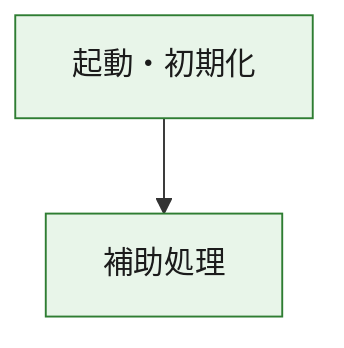
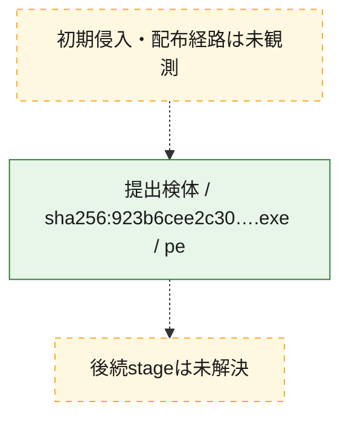
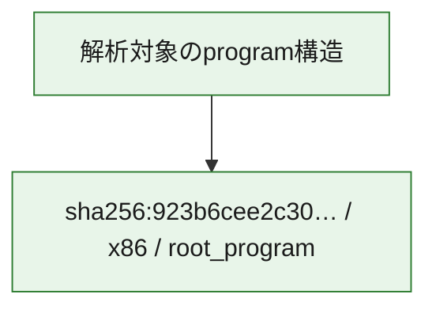

# 全体ロジック：923b6cee2c309853889d29309cf0abb0176def5e3b0144e2ae8cb6cc018c2448

代表関数の静的証跡から、起動・初期化の処理群を確認しました。

## 読み方

- phaseの掲載順は解析上の整理順です。observed_call_edgesがない段階間の実行順を断定しません。
- 図の実線は静的に観測した関係、点線と黄色のノードは未観測・未解決の関係を示します。
- 図は静的な要約であり、動的実行を再現するものではありません。
- 詳細な関数解説とfingerprintは[STATIC-LOGIC.md](STATIC-LOGIC.md)を参照してください。

## 静的可視化

### 実行フロー

### 感染チェーン

### モジュール関係

## 処理段階

### 1. 起動・初期化

entry pointから初期化と後続処理への移行を確認します。
確度: `confirmed_static_function_evidence`

- `923b6cee2c309853889d29309cf0abb0176def5e3b0144e2ae8cb6cc018c2448:ghidra:180001010` — 初期化と主要処理への分岐を行う入口関数です。 状態: `succeeded`、選定理由: `entry_point`, `meaningful_symbol_name`, `reviewed_call_centrality:22`, `role:entrypoint`, `small_program_complete_context`

### 2. 補助処理

主要処理を支える一般内部関数またはlibrary処理を確認します。
確度: `confirmed_static_function_evidence`

- `923b6cee2c309853889d29309cf0abb0176def5e3b0144e2ae8cb6cc018c2448:ghidra:180001240` — 検体内部の一般処理を実装する関数です。 状態: `succeeded`、選定理由: `context_representative`, `reviewed_call_centrality:2`, `small_program_complete_context`
- `923b6cee2c309853889d29309cf0abb0176def5e3b0144e2ae8cb6cc018c2448:ghidra:180001350` — 検体内部の一般処理を実装する関数です。 状態: `succeeded`、選定理由: `context_representative`, `reviewed_call_centrality:25`, `small_program_complete_context`
- `923b6cee2c309853889d29309cf0abb0176def5e3b0144e2ae8cb6cc018c2448:ghidra:180003780` — 検体内部の一般処理を実装する関数です。 状態: `succeeded`、選定理由: `context_representative`, `reviewed_call_centrality:2`, `small_program_complete_context`
- `923b6cee2c309853889d29309cf0abb0176def5e3b0144e2ae8cb6cc018c2448:ghidra:1800038e0` — 検体内部の一般処理を実装する関数です。 状態: `succeeded`、選定理由: `context_representative`, `reviewed_call_centrality:2`, `small_program_complete_context`

## 観測したcall関係

- `923b6cee2c309853889d29309cf0abb0176def5e3b0144e2ae8cb6cc018c2448:ghidra:180001010` → `923b6cee2c309853889d29309cf0abb0176def5e3b0144e2ae8cb6cc018c2448:ghidra:180001240` （`startup` → `support`）
- `923b6cee2c309853889d29309cf0abb0176def5e3b0144e2ae8cb6cc018c2448:ghidra:180001010` → `923b6cee2c309853889d29309cf0abb0176def5e3b0144e2ae8cb6cc018c2448:ghidra:180001350` （`startup` → `support`）
- `923b6cee2c309853889d29309cf0abb0176def5e3b0144e2ae8cb6cc018c2448:ghidra:180001350` → `923b6cee2c309853889d29309cf0abb0176def5e3b0144e2ae8cb6cc018c2448:ghidra:180001240` （`support` → `support`）
- `923b6cee2c309853889d29309cf0abb0176def5e3b0144e2ae8cb6cc018c2448:ghidra:180001350` → `923b6cee2c309853889d29309cf0abb0176def5e3b0144e2ae8cb6cc018c2448:ghidra:180003780` （`support` → `support`）
- `923b6cee2c309853889d29309cf0abb0176def5e3b0144e2ae8cb6cc018c2448:ghidra:180001350` → `923b6cee2c309853889d29309cf0abb0176def5e3b0144e2ae8cb6cc018c2448:ghidra:1800038e0` （`support` → `support`）
- `923b6cee2c309853889d29309cf0abb0176def5e3b0144e2ae8cb6cc018c2448:ghidra:180003780` → `923b6cee2c309853889d29309cf0abb0176def5e3b0144e2ae8cb6cc018c2448:ghidra:1800038e0` （`support` → `support`）
- `ghidra-function:2a0c062202095761df03cddf` → `ghidra-function:0f8dfa23faee325b49b209b4` （`unclassified` → `unclassified`）
- `ghidra-function:51d68fa473d3a7ec24cae412` → `ghidra-function:2829b2df750486afb2668c72` （`unclassified` → `unclassified`）
- `ghidra-function:51d68fa473d3a7ec24cae412` → `ghidra-function:357b009e3d7caa6119f8f02c` （`unclassified` → `unclassified`）
- `ghidra-function:51d68fa473d3a7ec24cae412` → `ghidra-function:3de100df3b351ae11c289bce` （`unclassified` → `unclassified`）
- `ghidra-function:51d68fa473d3a7ec24cae412` → `ghidra-function:46485727b2cdd55d44287e90` （`unclassified` → `unclassified`）
- `ghidra-function:51d68fa473d3a7ec24cae412` → `ghidra-function:549f22b254cc22d0ef5eed54` （`unclassified` → `unclassified`）
- `ghidra-function:51d68fa473d3a7ec24cae412` → `ghidra-function:5c481777da5c00cea62c83bb` （`unclassified` → `unclassified`）
- `ghidra-function:51d68fa473d3a7ec24cae412` → `ghidra-function:6cc4267827c3ee1d808cd2a3` （`unclassified` → `unclassified`）
- `ghidra-function:51d68fa473d3a7ec24cae412` → `ghidra-function:7c06d08a2d860cba00d64be7` （`unclassified` → `unclassified`）
- `ghidra-function:51d68fa473d3a7ec24cae412` → `ghidra-function:95586fdb998a67606ffe6806` （`unclassified` → `unclassified`）
- `ghidra-function:51d68fa473d3a7ec24cae412` → `ghidra-function:a5e6224b8b089b53b6aedb33` （`unclassified` → `unclassified`）
- `ghidra-function:51d68fa473d3a7ec24cae412` → `ghidra-function:bbf53f47aa2b13392397fa13` （`unclassified` → `unclassified`）
- `ghidra-function:51d68fa473d3a7ec24cae412` → `ghidra-function:cd7c73706e6e3c6d6cc702d2` （`unclassified` → `unclassified`）
- `ghidra-function:bbf53f47aa2b13392397fa13` → `ghidra-external:00419729d8b8c34661945ce3` （`unclassified` → `unclassified`）
- `ghidra-function:bbf53f47aa2b13392397fa13` → `ghidra-external:061721043a3a253e53be8d38` （`unclassified` → `unclassified`）
- `ghidra-function:bbf53f47aa2b13392397fa13` → `ghidra-external:0ad6e1a70f49c7b822b0b7ef` （`unclassified` → `unclassified`）
- `ghidra-function:bbf53f47aa2b13392397fa13` → `ghidra-external:0ed8e4409217a31292761ada` （`unclassified` → `unclassified`）
- `ghidra-function:bbf53f47aa2b13392397fa13` → `ghidra-external:14396f7c47cd7884106f4215` （`unclassified` → `unclassified`）
- `ghidra-function:bbf53f47aa2b13392397fa13` → `ghidra-external:1764e79bf678272b37070f08` （`unclassified` → `unclassified`）
- `ghidra-function:bbf53f47aa2b13392397fa13` → `ghidra-external:18f310835a59b5df5461b3e5` （`unclassified` → `unclassified`）
- `ghidra-function:bbf53f47aa2b13392397fa13` → `ghidra-external:395769cb5878542427763f58` （`unclassified` → `unclassified`）
- `ghidra-function:bbf53f47aa2b13392397fa13` → `ghidra-external:5ba5bd7a5619da40b0ad211e` （`unclassified` → `unclassified`）
- `ghidra-function:bbf53f47aa2b13392397fa13` → `ghidra-external:5fb47258f47c34af8cbd2eb5` （`unclassified` → `unclassified`）
- `ghidra-function:bbf53f47aa2b13392397fa13` → `ghidra-external:7cdc570f6a4bd0e7f317c805` （`unclassified` → `unclassified`）
- `ghidra-function:bbf53f47aa2b13392397fa13` → `ghidra-external:80992a5c477164f6946c83a1` （`unclassified` → `unclassified`）
- `ghidra-function:bbf53f47aa2b13392397fa13` → `ghidra-external:82373701ee6c23892981f5f1` （`unclassified` → `unclassified`）
- `ghidra-function:bbf53f47aa2b13392397fa13` → `ghidra-external:9ee642bbf95b4e003674890e` （`unclassified` → `unclassified`）
- `ghidra-function:bbf53f47aa2b13392397fa13` → `ghidra-external:9f521d3b11443b23fafc9a34` （`unclassified` → `unclassified`）
- `ghidra-function:bbf53f47aa2b13392397fa13` → `ghidra-external:a08921805fbfc089422c9e6c` （`unclassified` → `unclassified`）
- `ghidra-function:bbf53f47aa2b13392397fa13` → `ghidra-external:a70565e904c25259c8ff3829` （`unclassified` → `unclassified`）
- `ghidra-function:bbf53f47aa2b13392397fa13` → `ghidra-external:d11984941b015e6328026bb5` （`unclassified` → `unclassified`）
- `ghidra-function:bbf53f47aa2b13392397fa13` → `ghidra-external:eec1ec97f284315716b87b86` （`unclassified` → `unclassified`）
- `ghidra-function:bbf53f47aa2b13392397fa13` → `ghidra-external:ef2922aa1dd9f348a32f94a8` （`unclassified` → `unclassified`）
- `ghidra-function:bbf53f47aa2b13392397fa13` → `ghidra-external:ffaf4f0be1203a1f880ff99b` （`unclassified` → `unclassified`）
- `ghidra-function:bbf53f47aa2b13392397fa13` → `ghidra-function:0f8dfa23faee325b49b209b4` （`unclassified` → `unclassified`）
- `ghidra-function:bbf53f47aa2b13392397fa13` → `ghidra-function:2829b2df750486afb2668c72` （`unclassified` → `unclassified`）
- `ghidra-function:bbf53f47aa2b13392397fa13` → `ghidra-function:2a0c062202095761df03cddf` （`unclassified` → `unclassified`）

## 解析範囲と制約

- 選定外関数は全体inventoryへ残しますが、関数本体の個別解説対象にはしていません。
- indirect call、難読化、packer、VM、壊れたcontrol flowによりcall関係が欠落する場合があります。
- 文書は静的解析に基づき、検体実行や外部通信による動的確認は行っていません。
