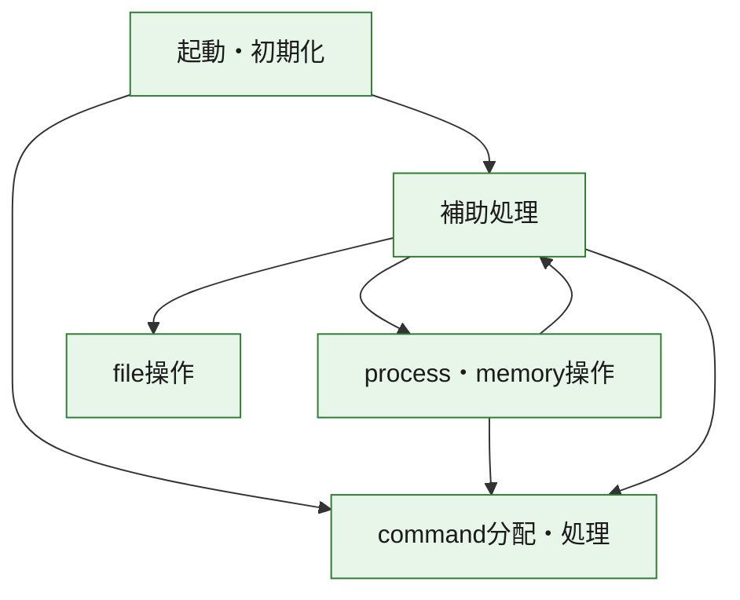
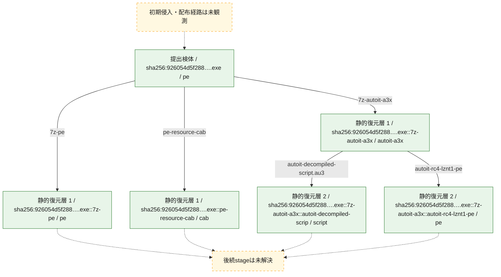
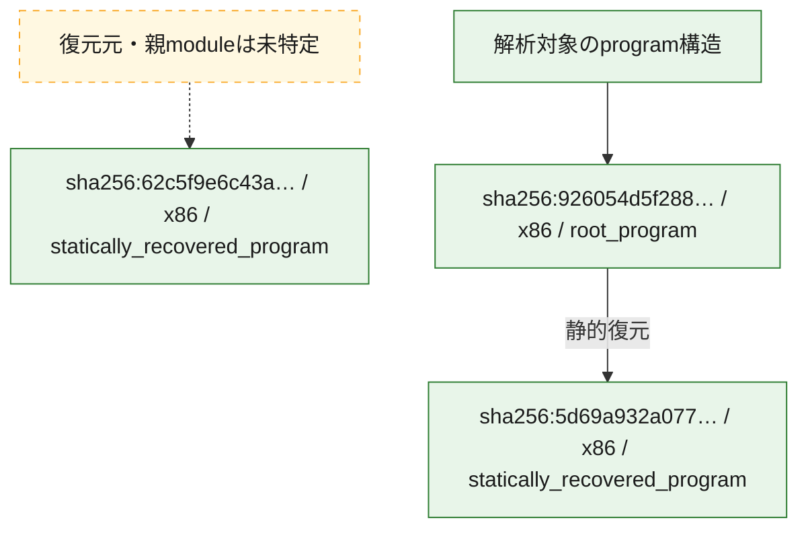

# 全体ロジック：926054d5f2882959f4747a04ed67d899c9983a8788660fbfe9a887164b411fdc

代表関数の静的証跡から、起動・初期化、process・memory操作、command分配・処理、file操作の処理群を確認しました。

## 読み方

- phaseの掲載順は解析上の整理順です。observed_call_edgesがない段階間の実行順を断定しません。
- 図の実線は静的に観測した関係、点線と黄色のノードは未観測・未解決の関係を示します。
- 図は静的な要約であり、動的実行を再現するものではありません。
- 詳細な関数解説とfingerprintは[STATIC-LOGIC.md](STATIC-LOGIC.md)を参照してください。

## 静的可視化

### 実行フロー

### 感染チェーン

### モジュール関係

## 処理段階

### 1. 起動・初期化

entry pointから初期化と後続処理への移行を確認します。
確度: `confirmed_static_function_evidence`

- `5d69a932a077fee044b193c28e84564143f5c7e51079ab48e88fef74ab0b77b7:ghidra:140024750` — 初期化と主要処理への分岐を行う入口関数です。 状態: `succeeded`、選定理由: `entry_point`, `meaningful_symbol_name`, `reviewed_call_centrality:22`, `role:entrypoint`
- `62c5f9e6c43ad4b4797ff53eae446ba02bf44d4ff02b350394d5e4575053109c:ghidra:140068380` — 初期化と主要処理への分岐を行う入口関数です。 状態: `succeeded`、選定理由: `entry_point`, `meaningful_symbol_name`, `reviewed_call_centrality:22`, `role:entrypoint`
- `926054d5f2882959f4747a04ed67d899c9983a8788660fbfe9a887164b411fdc:ghidra:1400079b0` — 初期化と主要処理への分岐を行う入口関数です。 状態: `succeeded`、選定理由: `entry_point`, `meaningful_symbol_name`, `reviewed_call_centrality:18`, `role:entrypoint`

### 2. process・memory操作

process、thread、module、memory操作と実行移行を確認します。
確度: `confirmed_static_function_evidence`

- `926054d5f2882959f4747a04ed67d899c9983a8788660fbfe9a887164b411fdc:ghidra:1400011c0` — process、thread、module、またはmemory操作に関係する関数です。 状態: `succeeded`、選定理由: `context_representative`, `reviewed_call_centrality:13`, `role:process_or_memory_operation`
- `926054d5f2882959f4747a04ed67d899c9983a8788660fbfe9a887164b411fdc:ghidra:140001c38` — process、thread、module、またはmemory操作に関係する関数です。 状態: `succeeded`、選定理由: `context_representative`, `reviewed_call_centrality:28`, `role:process_or_memory_operation`
- `926054d5f2882959f4747a04ed67d899c9983a8788660fbfe9a887164b411fdc:ghidra:140002e28` — process、thread、module、またはmemory操作に関係する関数です。 状態: `succeeded`、選定理由: `context_representative`, `reviewed_call_centrality:31`, `role:process_or_memory_operation`
- `926054d5f2882959f4747a04ed67d899c9983a8788660fbfe9a887164b411fdc:ghidra:140003720` — process、thread、module、またはmemory操作に関係する関数です。 状態: `succeeded`、選定理由: `context_representative`, `reviewed_call_centrality:22`, `role:process_or_memory_operation`

### 3. command分配・処理

受信commandやtaskの解釈、分配、個別handlerへの移行を確認します。
確度: `confirmed_static_function_evidence_with_limits`

- `5d69a932a077fee044b193c28e84564143f5c7e51079ab48e88fef74ab0b77b7:ghidra:14004afb0` — commandの解釈、分配、または個別処理を担当する関数です。 状態: `limited_bad_instruction_or_flow`、選定理由: `meaningful_symbol_name`, `reviewed_call_centrality:1`, `role:command_dispatch_or_handler`
- `62c5f9e6c43ad4b4797ff53eae446ba02bf44d4ff02b350394d5e4575053109c:ghidra:14007f760` — commandの解釈、分配、または個別処理を担当する関数です。 状態: `limited_bad_instruction_or_flow`、選定理由: `meaningful_symbol_name`, `reviewed_call_centrality:3`, `role:command_dispatch_or_handler`
- `926054d5f2882959f4747a04ed67d899c9983a8788660fbfe9a887164b411fdc:ghidra:1400082d0` — commandの解釈、分配、または個別処理を担当する関数です。 状態: `limited_bad_instruction_or_flow`、選定理由: `meaningful_symbol_name`, `reviewed_call_centrality:5`, `role:command_dispatch_or_handler`

### 4. file操作

fileやdirectoryの作成、読書き、削除を確認します。
確度: `confirmed_static_function_evidence`

- `926054d5f2882959f4747a04ed67d899c9983a8788660fbfe9a887164b411fdc:ghidra:140001f00` — fileまたはdirectoryの読書き・管理に関係する関数です。 状態: `succeeded`、選定理由: `context_representative`, `reviewed_call_centrality:19`, `role:file_operation`
- `926054d5f2882959f4747a04ed67d899c9983a8788660fbfe9a887164b411fdc:ghidra:1400030c4` — fileまたはdirectoryの読書き・管理に関係する関数です。 状態: `succeeded`、選定理由: `context_representative`, `reviewed_call_centrality:18`, `role:file_operation`

### 5. 補助処理

主要処理を支える一般内部関数またはlibrary処理を確認します。
確度: `confirmed_static_function_evidence_with_limits`

- `5d69a932a077fee044b193c28e84564143f5c7e51079ab48e88fef74ab0b77b7:ghidra:140001000` — 検体内部の一般処理を実装する関数です。 状態: `succeeded`、選定理由: `context_representative`, `reviewed_call_centrality:2`
- `5d69a932a077fee044b193c28e84564143f5c7e51079ab48e88fef74ab0b77b7:ghidra:14000102c` — 検体内部の一般処理を実装する関数です。 状態: `succeeded`、選定理由: `context_representative`, `reviewed_call_centrality:2`
- `5d69a932a077fee044b193c28e84564143f5c7e51079ab48e88fef74ab0b77b7:ghidra:140001048` — 検体内部の一般処理を実装する関数です。 状態: `succeeded`、選定理由: `context_representative`, `reviewed_call_centrality:2`
- `5d69a932a077fee044b193c28e84564143f5c7e51079ab48e88fef74ab0b77b7:ghidra:140001064` — 検体内部の一般処理を実装する関数です。 状態: `succeeded`、選定理由: `context_representative`, `reviewed_call_centrality:2`
- `5d69a932a077fee044b193c28e84564143f5c7e51079ab48e88fef74ab0b77b7:ghidra:140001080` — 検体内部の一般処理を実装する関数です。 状態: `succeeded`、選定理由: `context_representative`, `reviewed_call_centrality:2`
- `5d69a932a077fee044b193c28e84564143f5c7e51079ab48e88fef74ab0b77b7:ghidra:1400010b0` — 検体内部の一般処理を実装する関数です。 状態: `succeeded`、選定理由: `context_representative`, `reviewed_call_centrality:2`
- `5d69a932a077fee044b193c28e84564143f5c7e51079ab48e88fef74ab0b77b7:ghidra:1400010cc` — 検体内部の一般処理を実装する関数です。 状態: `succeeded`、選定理由: `context_representative`, `reviewed_call_centrality:2`
- `5d69a932a077fee044b193c28e84564143f5c7e51079ab48e88fef74ab0b77b7:ghidra:1400010e8` — 検体内部の一般処理を実装する関数です。 状態: `succeeded`、選定理由: `context_representative`, `reviewed_call_centrality:2`
- `5d69a932a077fee044b193c28e84564143f5c7e51079ab48e88fef74ab0b77b7:ghidra:140001104` — 検体内部の一般処理を実装する関数です。 状態: `succeeded`、選定理由: `context_representative`, `reviewed_call_centrality:2`
- `5d69a932a077fee044b193c28e84564143f5c7e51079ab48e88fef74ab0b77b7:ghidra:140001120` — 検体内部の一般処理を実装する関数です。 状態: `succeeded`、選定理由: `context_representative`, `reviewed_call_centrality:2`
- `5d69a932a077fee044b193c28e84564143f5c7e51079ab48e88fef74ab0b77b7:ghidra:140001140` — 検体内部の一般処理を実装する関数です。 状態: `succeeded`、選定理由: `context_representative`, `reviewed_call_centrality:9`
- `5d69a932a077fee044b193c28e84564143f5c7e51079ab48e88fef74ab0b77b7:ghidra:1400011c0` — 検体内部の一般処理を実装する関数です。 状態: `succeeded`、選定理由: `context_representative`, `reviewed_call_centrality:3`
- `5d69a932a077fee044b193c28e84564143f5c7e51079ab48e88fef74ab0b77b7:ghidra:14000120c` — 検体内部の一般処理を実装する関数です。 状態: `succeeded`、選定理由: `context_representative`, `reviewed_call_centrality:6`
- `5d69a932a077fee044b193c28e84564143f5c7e51079ab48e88fef74ab0b77b7:ghidra:140001328` — 検体内部の一般処理を実装する関数です。 状態: `succeeded`、選定理由: `context_representative`, `reviewed_call_centrality:3`
- `5d69a932a077fee044b193c28e84564143f5c7e51079ab48e88fef74ab0b77b7:ghidra:140001364` — 検体内部の一般処理を実装する関数です。 状態: `succeeded`、選定理由: `context_representative`, `reviewed_call_centrality:11`
- `5d69a932a077fee044b193c28e84564143f5c7e51079ab48e88fef74ab0b77b7:ghidra:1400014a0` — 検体内部の一般処理を実装する関数です。 状態: `limited_bad_instruction_or_flow`、選定理由: `context_representative`, `reviewed_call_centrality:4`
- `5d69a932a077fee044b193c28e84564143f5c7e51079ab48e88fef74ab0b77b7:ghidra:14000158c` — 検体内部の一般処理を実装する関数です。 状態: `succeeded`、選定理由: `context_representative`, `reviewed_call_centrality:4`
- `5d69a932a077fee044b193c28e84564143f5c7e51079ab48e88fef74ab0b77b7:ghidra:140001674` — 検体内部の一般処理を実装する関数です。 状態: `succeeded`、選定理由: `context_representative`, `reviewed_call_centrality:7`
- `5d69a932a077fee044b193c28e84564143f5c7e51079ab48e88fef74ab0b77b7:ghidra:140001750` — 検体内部の一般処理を実装する関数です。 状態: `succeeded`、選定理由: `context_representative`, `reviewed_call_centrality:4`
- `5d69a932a077fee044b193c28e84564143f5c7e51079ab48e88fef74ab0b77b7:ghidra:14000178c` — 検体内部の一般処理を実装する関数です。 状態: `succeeded`、選定理由: `context_representative`, `reviewed_call_centrality:17`
- `5d69a932a077fee044b193c28e84564143f5c7e51079ab48e88fef74ab0b77b7:ghidra:140001a18` — 検体内部の一般処理を実装する関数です。 状態: `succeeded`、選定理由: `context_representative`, `reviewed_call_centrality:3`
- `5d69a932a077fee044b193c28e84564143f5c7e51079ab48e88fef74ab0b77b7:ghidra:140001a5c` — 検体内部の一般処理を実装する関数です。 状態: `succeeded`、選定理由: `context_representative`, `reviewed_call_centrality:5`
- `5d69a932a077fee044b193c28e84564143f5c7e51079ab48e88fef74ab0b77b7:ghidra:140001b30` — 検体内部の一般処理を実装する関数です。 状態: `succeeded`、選定理由: `context_representative`, `reviewed_call_centrality:1`
- `5d69a932a077fee044b193c28e84564143f5c7e51079ab48e88fef74ab0b77b7:ghidra:140001b5c` — 検体内部の一般処理を実装する関数です。 状態: `succeeded`、選定理由: `context_representative`, `reviewed_call_centrality:3`
- `5d69a932a077fee044b193c28e84564143f5c7e51079ab48e88fef74ab0b77b7:ghidra:140001bb0` — 検体内部の一般処理を実装する関数です。 状態: `succeeded`、選定理由: `context_representative`, `reviewed_call_centrality:11`
- `5d69a932a077fee044b193c28e84564143f5c7e51079ab48e88fef74ab0b77b7:ghidra:140001bfc` — 検体内部の一般処理を実装する関数です。 状態: `succeeded`、選定理由: `context_representative`, `reviewed_call_centrality:25`
- `5d69a932a077fee044b193c28e84564143f5c7e51079ab48e88fef74ab0b77b7:ghidra:140001d9c` — 検体内部の一般処理を実装する関数です。 状態: `succeeded`、選定理由: `context_representative`, `reviewed_call_centrality:9`
- `5d69a932a077fee044b193c28e84564143f5c7e51079ab48e88fef74ab0b77b7:ghidra:140001dd0` — 検体内部の一般処理を実装する関数です。 状態: `succeeded`、選定理由: `context_representative`, `reviewed_call_centrality:5`
- `5d69a932a077fee044b193c28e84564143f5c7e51079ab48e88fef74ab0b77b7:ghidra:140001e64` — 検体内部の一般処理を実装する関数です。 状態: `succeeded`、選定理由: `context_representative`, `reviewed_call_centrality:8`
- `5d69a932a077fee044b193c28e84564143f5c7e51079ab48e88fef74ab0b77b7:ghidra:140023e1c` — 検体内部の一般処理を実装する関数です。 状態: `succeeded`、選定理由: `meaningful_symbol_name`
- `62c5f9e6c43ad4b4797ff53eae446ba02bf44d4ff02b350394d5e4575053109c:ghidra:140001000` — 検体内部の一般処理を実装する関数です。 状態: `succeeded`、選定理由: `context_representative`, `reviewed_call_centrality:1`
- `62c5f9e6c43ad4b4797ff53eae446ba02bf44d4ff02b350394d5e4575053109c:ghidra:140001060` — 検体内部の一般処理を実装する関数です。 状態: `succeeded`、選定理由: `context_representative`, `reviewed_call_centrality:2`
- `62c5f9e6c43ad4b4797ff53eae446ba02bf44d4ff02b350394d5e4575053109c:ghidra:140001100` — 検体内部の一般処理を実装する関数です。 状態: `succeeded`、選定理由: `context_representative`, `reviewed_call_centrality:3`
- `62c5f9e6c43ad4b4797ff53eae446ba02bf44d4ff02b350394d5e4575053109c:ghidra:140001120` — 検体内部の一般処理を実装する関数です。 状態: `succeeded`、選定理由: `context_representative`, `reviewed_call_centrality:1`
- `62c5f9e6c43ad4b4797ff53eae446ba02bf44d4ff02b350394d5e4575053109c:ghidra:140001160` — 検体内部の一般処理を実装する関数です。 状態: `succeeded`、選定理由: `context_representative`, `reviewed_call_centrality:1`
- `62c5f9e6c43ad4b4797ff53eae446ba02bf44d4ff02b350394d5e4575053109c:ghidra:1400011a0` — 検体内部の一般処理を実装する関数です。 状態: `succeeded`、選定理由: `context_representative`, `reviewed_call_centrality:2`
- `62c5f9e6c43ad4b4797ff53eae446ba02bf44d4ff02b350394d5e4575053109c:ghidra:1400011c0` — 検体内部の一般処理を実装する関数です。 状態: `succeeded`、選定理由: `context_representative`, `reviewed_call_centrality:5`
- `62c5f9e6c43ad4b4797ff53eae446ba02bf44d4ff02b350394d5e4575053109c:ghidra:140001320` — 検体内部の一般処理を実装する関数です。 状態: `failed`、選定理由: `context_representative`, `reviewed_call_centrality:1`
- `62c5f9e6c43ad4b4797ff53eae446ba02bf44d4ff02b350394d5e4575053109c:ghidra:1400110c0` — 検体内部の一般処理を実装する関数です。 状態: `succeeded`、選定理由: `context_representative`, `reviewed_call_centrality:4`
- `62c5f9e6c43ad4b4797ff53eae446ba02bf44d4ff02b350394d5e4575053109c:ghidra:140011170` — 検体内部の一般処理を実装する関数です。 状態: `succeeded`、選定理由: `context_representative`, `reviewed_call_centrality:4`
- `62c5f9e6c43ad4b4797ff53eae446ba02bf44d4ff02b350394d5e4575053109c:ghidra:140011220` — 検体内部の一般処理を実装する関数です。 状態: `succeeded`、選定理由: `context_representative`, `reviewed_call_centrality:4`
- `62c5f9e6c43ad4b4797ff53eae446ba02bf44d4ff02b350394d5e4575053109c:ghidra:1400112d0` — 検体内部の一般処理を実装する関数です。 状態: `succeeded`、選定理由: `context_representative`, `reviewed_call_centrality:4`
- `62c5f9e6c43ad4b4797ff53eae446ba02bf44d4ff02b350394d5e4575053109c:ghidra:140011380` — 検体内部の一般処理を実装する関数です。 状態: `succeeded`、選定理由: `context_representative`, `reviewed_call_centrality:4`
- `62c5f9e6c43ad4b4797ff53eae446ba02bf44d4ff02b350394d5e4575053109c:ghidra:140011430` — 検体内部の一般処理を実装する関数です。 状態: `succeeded`、選定理由: `context_representative`, `reviewed_call_centrality:4`
- `62c5f9e6c43ad4b4797ff53eae446ba02bf44d4ff02b350394d5e4575053109c:ghidra:1400114e0` — 検体内部の一般処理を実装する関数です。 状態: `succeeded`、選定理由: `context_representative`, `reviewed_call_centrality:4`
- `62c5f9e6c43ad4b4797ff53eae446ba02bf44d4ff02b350394d5e4575053109c:ghidra:140011590` — 検体内部の一般処理を実装する関数です。 状態: `succeeded`、選定理由: `context_representative`, `reviewed_call_centrality:4`
- `62c5f9e6c43ad4b4797ff53eae446ba02bf44d4ff02b350394d5e4575053109c:ghidra:140011640` — 検体内部の一般処理を実装する関数です。 状態: `succeeded`、選定理由: `context_representative`, `reviewed_call_centrality:4`
- `62c5f9e6c43ad4b4797ff53eae446ba02bf44d4ff02b350394d5e4575053109c:ghidra:1400116f0` — 検体内部の一般処理を実装する関数です。 状態: `succeeded`、選定理由: `context_representative`, `reviewed_call_centrality:4`
- `62c5f9e6c43ad4b4797ff53eae446ba02bf44d4ff02b350394d5e4575053109c:ghidra:1400117a0` — 検体内部の一般処理を実装する関数です。 状態: `succeeded`、選定理由: `context_representative`, `reviewed_call_centrality:4`
- `62c5f9e6c43ad4b4797ff53eae446ba02bf44d4ff02b350394d5e4575053109c:ghidra:140011850` — 検体内部の一般処理を実装する関数です。 状態: `succeeded`、選定理由: `context_representative`, `reviewed_call_centrality:4`
- `62c5f9e6c43ad4b4797ff53eae446ba02bf44d4ff02b350394d5e4575053109c:ghidra:140011900` — 検体内部の一般処理を実装する関数です。 状態: `succeeded`、選定理由: `context_representative`, `reviewed_call_centrality:4`
- `62c5f9e6c43ad4b4797ff53eae446ba02bf44d4ff02b350394d5e4575053109c:ghidra:1400119b0` — 検体内部の一般処理を実装する関数です。 状態: `succeeded`、選定理由: `context_representative`, `reviewed_call_centrality:4`
- `62c5f9e6c43ad4b4797ff53eae446ba02bf44d4ff02b350394d5e4575053109c:ghidra:140011a60` — 検体内部の一般処理を実装する関数です。 状態: `succeeded`、選定理由: `context_representative`, `reviewed_call_centrality:4`
- `62c5f9e6c43ad4b4797ff53eae446ba02bf44d4ff02b350394d5e4575053109c:ghidra:140011b10` — 検体内部の一般処理を実装する関数です。 状態: `succeeded`、選定理由: `context_representative`, `reviewed_call_centrality:4`
- `62c5f9e6c43ad4b4797ff53eae446ba02bf44d4ff02b350394d5e4575053109c:ghidra:140011bc0` — 検体内部の一般処理を実装する関数です。 状態: `succeeded`、選定理由: `context_representative`, `reviewed_call_centrality:4`
- `62c5f9e6c43ad4b4797ff53eae446ba02bf44d4ff02b350394d5e4575053109c:ghidra:140011c70` — 検体内部の一般処理を実装する関数です。 状態: `succeeded`、選定理由: `context_representative`, `reviewed_call_centrality:4`
- `62c5f9e6c43ad4b4797ff53eae446ba02bf44d4ff02b350394d5e4575053109c:ghidra:140011d20` — 検体内部の一般処理を実装する関数です。 状態: `succeeded`、選定理由: `context_representative`, `reviewed_call_centrality:4`
- `62c5f9e6c43ad4b4797ff53eae446ba02bf44d4ff02b350394d5e4575053109c:ghidra:140067f74` — compiler生成処理または汎用library処理とみられる関数です。 状態: `succeeded`、選定理由: `entry_point`, `meaningful_symbol_name`, `reviewed_call_centrality:1`
- `62c5f9e6c43ad4b4797ff53eae446ba02bf44d4ff02b350394d5e4575053109c:ghidra:140067fdc` — compiler生成処理または汎用library処理とみられる関数です。 状態: `succeeded`、選定理由: `entry_point`, `meaningful_symbol_name`, `reviewed_call_centrality:2`
- `62c5f9e6c43ad4b4797ff53eae446ba02bf44d4ff02b350394d5e4575053109c:ghidra:140068a88` — 検体内部の一般処理を実装する関数です。 状態: `succeeded`、選定理由: `meaningful_symbol_name`
- `926054d5f2882959f4747a04ed67d899c9983a8788660fbfe9a887164b411fdc:ghidra:140001144` — 検体内部の一般処理を実装する関数です。 状態: `succeeded`、選定理由: `context_representative`, `reviewed_call_centrality:6`
- `926054d5f2882959f4747a04ed67d899c9983a8788660fbfe9a887164b411fdc:ghidra:1400012c0` — 検体内部の一般処理を実装する関数です。 状態: `succeeded`、選定理由: `context_representative`, `reviewed_call_centrality:23`
- `926054d5f2882959f4747a04ed67d899c9983a8788660fbfe9a887164b411fdc:ghidra:140001490` — 検体内部の一般処理を実装する関数です。 状態: `succeeded`、選定理由: `context_representative`, `reviewed_call_centrality:12`
- `926054d5f2882959f4747a04ed67d899c9983a8788660fbfe9a887164b411fdc:ghidra:14000155c` — 検体内部の一般処理を実装する関数です。 状態: `succeeded`、選定理由: `context_representative`, `reviewed_call_centrality:2`
- `926054d5f2882959f4747a04ed67d899c9983a8788660fbfe9a887164b411fdc:ghidra:1400015f8` — 検体内部の一般処理を実装する関数です。 状態: `succeeded`、選定理由: `context_representative`, `reviewed_call_centrality:23`
- `926054d5f2882959f4747a04ed67d899c9983a8788660fbfe9a887164b411fdc:ghidra:140001b44` — 検体内部の一般処理を実装する関数です。 状態: `succeeded`、選定理由: `context_representative`, `reviewed_call_centrality:16`
- `926054d5f2882959f4747a04ed67d899c9983a8788660fbfe9a887164b411fdc:ghidra:1400020c0` — 検体内部の一般処理を実装する関数です。 状態: `succeeded`、選定理由: `context_representative`, `reviewed_call_centrality:13`
- `926054d5f2882959f4747a04ed67d899c9983a8788660fbfe9a887164b411fdc:ghidra:140002174` — 検体内部の一般処理を実装する関数です。 状態: `succeeded`、選定理由: `context_representative`, `reviewed_call_centrality:11`
- `926054d5f2882959f4747a04ed67d899c9983a8788660fbfe9a887164b411fdc:ghidra:14000229c` — 検体内部の一般処理を実装する関数です。 状態: `succeeded`、選定理由: `context_representative`, `reviewed_call_centrality:4`
- `926054d5f2882959f4747a04ed67d899c9983a8788660fbfe9a887164b411fdc:ghidra:140002324` — 検体内部の一般処理を実装する関数です。 状態: `succeeded`、選定理由: `context_representative`, `reviewed_call_centrality:3`
- `926054d5f2882959f4747a04ed67d899c9983a8788660fbfe9a887164b411fdc:ghidra:140002448` — 検体内部の一般処理を実装する関数です。 状態: `succeeded`、選定理由: `context_representative`, `reviewed_call_centrality:20`
- `926054d5f2882959f4747a04ed67d899c9983a8788660fbfe9a887164b411fdc:ghidra:140002628` — 検体内部の一般処理を実装する関数です。 状態: `succeeded`、選定理由: `context_representative`, `reviewed_call_centrality:16`
- `926054d5f2882959f4747a04ed67d899c9983a8788660fbfe9a887164b411fdc:ghidra:140002830` — 検体内部の一般処理を実装する関数です。 状態: `succeeded`、選定理由: `context_representative`, `reviewed_call_centrality:14`
- `926054d5f2882959f4747a04ed67d899c9983a8788660fbfe9a887164b411fdc:ghidra:1400029e4` — 検体内部の一般処理を実装する関数です。 状態: `succeeded`、選定理由: `context_representative`, `reviewed_call_centrality:18`
- `926054d5f2882959f4747a04ed67d899c9983a8788660fbfe9a887164b411fdc:ghidra:140002b24` — 検体内部の一般処理を実装する関数です。 状態: `succeeded`、選定理由: `context_representative`, `reviewed_call_centrality:27`
- `926054d5f2882959f4747a04ed67d899c9983a8788660fbfe9a887164b411fdc:ghidra:140003260` — 検体内部の一般処理を実装する関数です。 状態: `succeeded`、選定理由: `context_representative`, `reviewed_call_centrality:2`
- `926054d5f2882959f4747a04ed67d899c9983a8788660fbfe9a887164b411fdc:ghidra:1400032b0` — 検体内部の一般処理を実装する関数です。 状態: `succeeded`、選定理由: `context_representative`, `reviewed_call_centrality:19`
- `926054d5f2882959f4747a04ed67d899c9983a8788660fbfe9a887164b411fdc:ghidra:1400033c0` — 検体内部の一般処理を実装する関数です。 状態: `succeeded`、選定理由: `context_representative`, `reviewed_call_centrality:29`
- `926054d5f2882959f4747a04ed67d899c9983a8788660fbfe9a887164b411fdc:ghidra:140003680` — 検体内部の一般処理を実装する関数です。 状態: `succeeded`、選定理由: `context_representative`, `reviewed_call_centrality:11`
- `926054d5f2882959f4747a04ed67d899c9983a8788660fbfe9a887164b411fdc:ghidra:140003908` — 検体内部の一般処理を実装する関数です。 状態: `succeeded`、選定理由: `context_representative`, `reviewed_call_centrality:7`
- `926054d5f2882959f4747a04ed67d899c9983a8788660fbfe9a887164b411fdc:ghidra:1400039a0` — 検体内部の一般処理を実装する関数です。 状態: `succeeded`、選定理由: `context_representative`, `reviewed_call_centrality:12`
- `926054d5f2882959f4747a04ed67d899c9983a8788660fbfe9a887164b411fdc:ghidra:140003d0c` — 検体内部の一般処理を実装する関数です。 状態: `succeeded`、選定理由: `context_representative`, `reviewed_call_centrality:13`
- `926054d5f2882959f4747a04ed67d899c9983a8788660fbfe9a887164b411fdc:ghidra:140003e4c` — 検体内部の一般処理を実装する関数です。 状態: `succeeded`、選定理由: `context_representative`, `reviewed_call_centrality:32`
- `926054d5f2882959f4747a04ed67d899c9983a8788660fbfe9a887164b411fdc:ghidra:140008210` — 検体内部の一般処理を実装する関数です。 状態: `succeeded`、選定理由: `meaningful_symbol_name`

## 観測したcall関係

- `5d69a932a077fee044b193c28e84564143f5c7e51079ab48e88fef74ab0b77b7:ghidra:140001080` → `5d69a932a077fee044b193c28e84564143f5c7e51079ab48e88fef74ab0b77b7:ghidra:140001bfc` （`support` → `support`）
- `5d69a932a077fee044b193c28e84564143f5c7e51079ab48e88fef74ab0b77b7:ghidra:140001140` → `5d69a932a077fee044b193c28e84564143f5c7e51079ab48e88fef74ab0b77b7:ghidra:1400011c0` （`support` → `support`）
- `5d69a932a077fee044b193c28e84564143f5c7e51079ab48e88fef74ab0b77b7:ghidra:14000120c` → `5d69a932a077fee044b193c28e84564143f5c7e51079ab48e88fef74ab0b77b7:ghidra:140001328` （`support` → `support`）
- `5d69a932a077fee044b193c28e84564143f5c7e51079ab48e88fef74ab0b77b7:ghidra:140001750` → `5d69a932a077fee044b193c28e84564143f5c7e51079ab48e88fef74ab0b77b7:ghidra:140001d9c` （`support` → `support`）
- `5d69a932a077fee044b193c28e84564143f5c7e51079ab48e88fef74ab0b77b7:ghidra:140001750` → `5d69a932a077fee044b193c28e84564143f5c7e51079ab48e88fef74ab0b77b7:ghidra:140001dd0` （`support` → `support`）
- `5d69a932a077fee044b193c28e84564143f5c7e51079ab48e88fef74ab0b77b7:ghidra:14000178c` → `5d69a932a077fee044b193c28e84564143f5c7e51079ab48e88fef74ab0b77b7:ghidra:140001750` （`support` → `support`）
- `5d69a932a077fee044b193c28e84564143f5c7e51079ab48e88fef74ab0b77b7:ghidra:14000178c` → `5d69a932a077fee044b193c28e84564143f5c7e51079ab48e88fef74ab0b77b7:ghidra:140001a18` （`support` → `support`）
- `5d69a932a077fee044b193c28e84564143f5c7e51079ab48e88fef74ab0b77b7:ghidra:140001a5c` → `5d69a932a077fee044b193c28e84564143f5c7e51079ab48e88fef74ab0b77b7:ghidra:140001b5c` （`support` → `support`）
- `5d69a932a077fee044b193c28e84564143f5c7e51079ab48e88fef74ab0b77b7:ghidra:140001a5c` → `5d69a932a077fee044b193c28e84564143f5c7e51079ab48e88fef74ab0b77b7:ghidra:140001dd0` （`support` → `support`）
- `5d69a932a077fee044b193c28e84564143f5c7e51079ab48e88fef74ab0b77b7:ghidra:140001bb0` → `5d69a932a077fee044b193c28e84564143f5c7e51079ab48e88fef74ab0b77b7:ghidra:140001a5c` （`support` → `support`）
- `5d69a932a077fee044b193c28e84564143f5c7e51079ab48e88fef74ab0b77b7:ghidra:140001bb0` → `5d69a932a077fee044b193c28e84564143f5c7e51079ab48e88fef74ab0b77b7:ghidra:140001d9c` （`support` → `support`）
- `5d69a932a077fee044b193c28e84564143f5c7e51079ab48e88fef74ab0b77b7:ghidra:140001bb0` → `5d69a932a077fee044b193c28e84564143f5c7e51079ab48e88fef74ab0b77b7:ghidra:140001dd0` （`support` → `support`）
- `5d69a932a077fee044b193c28e84564143f5c7e51079ab48e88fef74ab0b77b7:ghidra:140001bb0` → `5d69a932a077fee044b193c28e84564143f5c7e51079ab48e88fef74ab0b77b7:ghidra:140001e64` （`support` → `support`）
- `5d69a932a077fee044b193c28e84564143f5c7e51079ab48e88fef74ab0b77b7:ghidra:140001bfc` → `5d69a932a077fee044b193c28e84564143f5c7e51079ab48e88fef74ab0b77b7:ghidra:140001674` （`support` → `support`）
- `5d69a932a077fee044b193c28e84564143f5c7e51079ab48e88fef74ab0b77b7:ghidra:140001d9c` → `5d69a932a077fee044b193c28e84564143f5c7e51079ab48e88fef74ab0b77b7:ghidra:140001dd0` （`support` → `support`）
- `5d69a932a077fee044b193c28e84564143f5c7e51079ab48e88fef74ab0b77b7:ghidra:140001e64` → `5d69a932a077fee044b193c28e84564143f5c7e51079ab48e88fef74ab0b77b7:ghidra:140001b5c` （`support` → `support`）
- `5d69a932a077fee044b193c28e84564143f5c7e51079ab48e88fef74ab0b77b7:ghidra:140024750` → `5d69a932a077fee044b193c28e84564143f5c7e51079ab48e88fef74ab0b77b7:ghidra:140001140` （`startup` → `support`）
- `5d69a932a077fee044b193c28e84564143f5c7e51079ab48e88fef74ab0b77b7:ghidra:140024750` → `5d69a932a077fee044b193c28e84564143f5c7e51079ab48e88fef74ab0b77b7:ghidra:14004afb0` （`startup` → `dispatch`）
- `62c5f9e6c43ad4b4797ff53eae446ba02bf44d4ff02b350394d5e4575053109c:ghidra:1400011c0` → `62c5f9e6c43ad4b4797ff53eae446ba02bf44d4ff02b350394d5e4575053109c:ghidra:140001320` （`support` → `support`）
- `62c5f9e6c43ad4b4797ff53eae446ba02bf44d4ff02b350394d5e4575053109c:ghidra:140067f74` → `62c5f9e6c43ad4b4797ff53eae446ba02bf44d4ff02b350394d5e4575053109c:ghidra:14007f760` （`support` → `dispatch`）
- `62c5f9e6c43ad4b4797ff53eae446ba02bf44d4ff02b350394d5e4575053109c:ghidra:140067fdc` → `62c5f9e6c43ad4b4797ff53eae446ba02bf44d4ff02b350394d5e4575053109c:ghidra:14007f760` （`support` → `dispatch`）
- `62c5f9e6c43ad4b4797ff53eae446ba02bf44d4ff02b350394d5e4575053109c:ghidra:140068380` → `62c5f9e6c43ad4b4797ff53eae446ba02bf44d4ff02b350394d5e4575053109c:ghidra:14007f760` （`startup` → `dispatch`）
- `926054d5f2882959f4747a04ed67d899c9983a8788660fbfe9a887164b411fdc:ghidra:1400011c0` → `926054d5f2882959f4747a04ed67d899c9983a8788660fbfe9a887164b411fdc:ghidra:1400082d0` （`execution` → `dispatch`）
- `926054d5f2882959f4747a04ed67d899c9983a8788660fbfe9a887164b411fdc:ghidra:1400012c0` → `926054d5f2882959f4747a04ed67d899c9983a8788660fbfe9a887164b411fdc:ghidra:1400011c0` （`support` → `execution`）
- `926054d5f2882959f4747a04ed67d899c9983a8788660fbfe9a887164b411fdc:ghidra:1400015f8` → `926054d5f2882959f4747a04ed67d899c9983a8788660fbfe9a887164b411fdc:ghidra:140001144` （`support` → `support`）
- `926054d5f2882959f4747a04ed67d899c9983a8788660fbfe9a887164b411fdc:ghidra:1400015f8` → `926054d5f2882959f4747a04ed67d899c9983a8788660fbfe9a887164b411fdc:ghidra:14000155c` （`support` → `support`）
- `926054d5f2882959f4747a04ed67d899c9983a8788660fbfe9a887164b411fdc:ghidra:1400015f8` → `926054d5f2882959f4747a04ed67d899c9983a8788660fbfe9a887164b411fdc:ghidra:140002830` （`support` → `support`）
- `926054d5f2882959f4747a04ed67d899c9983a8788660fbfe9a887164b411fdc:ghidra:140001c38` → `926054d5f2882959f4747a04ed67d899c9983a8788660fbfe9a887164b411fdc:ghidra:140001144` （`execution` → `support`）
- `926054d5f2882959f4747a04ed67d899c9983a8788660fbfe9a887164b411fdc:ghidra:140002174` → `926054d5f2882959f4747a04ed67d899c9983a8788660fbfe9a887164b411fdc:ghidra:1400020c0` （`support` → `support`）
- `926054d5f2882959f4747a04ed67d899c9983a8788660fbfe9a887164b411fdc:ghidra:140002324` → `926054d5f2882959f4747a04ed67d899c9983a8788660fbfe9a887164b411fdc:ghidra:140001144` （`support` → `support`）
- `926054d5f2882959f4747a04ed67d899c9983a8788660fbfe9a887164b411fdc:ghidra:140002628` → `926054d5f2882959f4747a04ed67d899c9983a8788660fbfe9a887164b411fdc:ghidra:140002448` （`support` → `support`）
- `926054d5f2882959f4747a04ed67d899c9983a8788660fbfe9a887164b411fdc:ghidra:1400029e4` → `926054d5f2882959f4747a04ed67d899c9983a8788660fbfe9a887164b411fdc:ghidra:140001b44` （`support` → `support`）
- `926054d5f2882959f4747a04ed67d899c9983a8788660fbfe9a887164b411fdc:ghidra:1400029e4` → `926054d5f2882959f4747a04ed67d899c9983a8788660fbfe9a887164b411fdc:ghidra:140002174` （`support` → `support`）
- `926054d5f2882959f4747a04ed67d899c9983a8788660fbfe9a887164b411fdc:ghidra:1400029e4` → `926054d5f2882959f4747a04ed67d899c9983a8788660fbfe9a887164b411fdc:ghidra:140002b24` （`support` → `support`）
- `926054d5f2882959f4747a04ed67d899c9983a8788660fbfe9a887164b411fdc:ghidra:1400029e4` → `926054d5f2882959f4747a04ed67d899c9983a8788660fbfe9a887164b411fdc:ghidra:140002e28` （`support` → `execution`）
- `926054d5f2882959f4747a04ed67d899c9983a8788660fbfe9a887164b411fdc:ghidra:1400029e4` → `926054d5f2882959f4747a04ed67d899c9983a8788660fbfe9a887164b411fdc:ghidra:1400030c4` （`support` → `file_activity`）
- `926054d5f2882959f4747a04ed67d899c9983a8788660fbfe9a887164b411fdc:ghidra:1400029e4` → `926054d5f2882959f4747a04ed67d899c9983a8788660fbfe9a887164b411fdc:ghidra:1400082d0` （`support` → `dispatch`）
- `926054d5f2882959f4747a04ed67d899c9983a8788660fbfe9a887164b411fdc:ghidra:140002b24` → `926054d5f2882959f4747a04ed67d899c9983a8788660fbfe9a887164b411fdc:ghidra:1400012c0` （`support` → `support`）
- `926054d5f2882959f4747a04ed67d899c9983a8788660fbfe9a887164b411fdc:ghidra:140002b24` → `926054d5f2882959f4747a04ed67d899c9983a8788660fbfe9a887164b411fdc:ghidra:140001f00` （`support` → `file_activity`）
- `926054d5f2882959f4747a04ed67d899c9983a8788660fbfe9a887164b411fdc:ghidra:140002b24` → `926054d5f2882959f4747a04ed67d899c9983a8788660fbfe9a887164b411fdc:ghidra:1400039a0` （`support` → `support`）
- `926054d5f2882959f4747a04ed67d899c9983a8788660fbfe9a887164b411fdc:ghidra:140002e28` → `926054d5f2882959f4747a04ed67d899c9983a8788660fbfe9a887164b411fdc:ghidra:140002174` （`execution` → `support`）
- `926054d5f2882959f4747a04ed67d899c9983a8788660fbfe9a887164b411fdc:ghidra:140002e28` → `926054d5f2882959f4747a04ed67d899c9983a8788660fbfe9a887164b411fdc:ghidra:140003d0c` （`execution` → `support`）
- `926054d5f2882959f4747a04ed67d899c9983a8788660fbfe9a887164b411fdc:ghidra:140002e28` → `926054d5f2882959f4747a04ed67d899c9983a8788660fbfe9a887164b411fdc:ghidra:140003e4c` （`execution` → `support`）
- `926054d5f2882959f4747a04ed67d899c9983a8788660fbfe9a887164b411fdc:ghidra:140002e28` → `926054d5f2882959f4747a04ed67d899c9983a8788660fbfe9a887164b411fdc:ghidra:1400082d0` （`execution` → `dispatch`）
- `926054d5f2882959f4747a04ed67d899c9983a8788660fbfe9a887164b411fdc:ghidra:1400030c4` → `926054d5f2882959f4747a04ed67d899c9983a8788660fbfe9a887164b411fdc:ghidra:140001f00` （`file_activity` → `file_activity`）
- `926054d5f2882959f4747a04ed67d899c9983a8788660fbfe9a887164b411fdc:ghidra:140003720` → `926054d5f2882959f4747a04ed67d899c9983a8788660fbfe9a887164b411fdc:ghidra:140003908` （`execution` → `support`）
- `926054d5f2882959f4747a04ed67d899c9983a8788660fbfe9a887164b411fdc:ghidra:1400039a0` → `926054d5f2882959f4747a04ed67d899c9983a8788660fbfe9a887164b411fdc:ghidra:140002628` （`support` → `support`）
- `926054d5f2882959f4747a04ed67d899c9983a8788660fbfe9a887164b411fdc:ghidra:140003e4c` → `926054d5f2882959f4747a04ed67d899c9983a8788660fbfe9a887164b411fdc:ghidra:140001144` （`support` → `support`）
- `926054d5f2882959f4747a04ed67d899c9983a8788660fbfe9a887164b411fdc:ghidra:140003e4c` → `926054d5f2882959f4747a04ed67d899c9983a8788660fbfe9a887164b411fdc:ghidra:1400015f8` （`support` → `support`）
- `926054d5f2882959f4747a04ed67d899c9983a8788660fbfe9a887164b411fdc:ghidra:140003e4c` → `926054d5f2882959f4747a04ed67d899c9983a8788660fbfe9a887164b411fdc:ghidra:1400082d0` （`support` → `dispatch`）
- `926054d5f2882959f4747a04ed67d899c9983a8788660fbfe9a887164b411fdc:ghidra:1400079b0` → `926054d5f2882959f4747a04ed67d899c9983a8788660fbfe9a887164b411fdc:ghidra:1400029e4` （`startup` → `support`）
- `926054d5f2882959f4747a04ed67d899c9983a8788660fbfe9a887164b411fdc:ghidra:1400079b0` → `926054d5f2882959f4747a04ed67d899c9983a8788660fbfe9a887164b411fdc:ghidra:1400082d0` （`startup` → `dispatch`）
- `ghidra-function:048a7309a0195967c08bb1aa` → `ghidra-function:0b4fa08026443a5233c268e2` （`unclassified` → `unclassified`）
- `ghidra-function:048a7309a0195967c08bb1aa` → `ghidra-function:1d61ba0dcbc7c3aa0d453d6c` （`unclassified` → `unclassified`）
- `ghidra-function:048a7309a0195967c08bb1aa` → `ghidra-function:59ea7ba6b6d7b19d8cbeb254` （`unclassified` → `unclassified`）
- `ghidra-function:048a7309a0195967c08bb1aa` → `ghidra-function:6700abbcd3c3c89807704f64` （`unclassified` → `unclassified`）
- `ghidra-function:048a7309a0195967c08bb1aa` → `ghidra-function:7b039148fe382b4aa12c6aba` （`unclassified` → `unclassified`）
- `ghidra-function:048a7309a0195967c08bb1aa` → `ghidra-function:831d19535699969efea8553f` （`unclassified` → `unclassified`）
- `ghidra-function:048a7309a0195967c08bb1aa` → `ghidra-function:a9459c1606c540d556aee225` （`unclassified` → `unclassified`）
- `ghidra-function:060c78bbf603f2c8413e0ce2` → `ghidra-function:141965be9cbed13a759d1748` （`unclassified` → `unclassified`）
- `ghidra-function:060c78bbf603f2c8413e0ce2` → `ghidra-function:397ed7544d56d8b1e06083cf` （`unclassified` → `unclassified`）
- `ghidra-function:060c78bbf603f2c8413e0ce2` → `ghidra-function:3f2240915501a6cf52578051` （`unclassified` → `unclassified`）
- `ghidra-function:060c78bbf603f2c8413e0ce2` → `ghidra-function:6a1cb66189252d8fb87d188f` （`unclassified` → `unclassified`）
- `ghidra-function:060c78bbf603f2c8413e0ce2` → `ghidra-function:6bca7443891f2b802b8cb4d7` （`unclassified` → `unclassified`）
- `ghidra-function:060c78bbf603f2c8413e0ce2` → `ghidra-function:9edf549a3d4613f6fb43b154` （`unclassified` → `unclassified`）
- `ghidra-function:060c78bbf603f2c8413e0ce2` → `ghidra-function:a9459c1606c540d556aee225` （`unclassified` → `unclassified`）
- `ghidra-function:060c78bbf603f2c8413e0ce2` → `ghidra-function:c92e65409be8d0e950a097ab` （`unclassified` → `unclassified`）
- `ghidra-function:082cbe67b1dc323cb043c29b` → `ghidra-function:6b8e0b949ff3aa37281c95df` （`unclassified` → `unclassified`）
- `ghidra-function:11457c58859625a28b91fec7` → `ghidra-external:3cc44cd02bbecce6259dff84` （`unclassified` → `unclassified`）
- `ghidra-function:11457c58859625a28b91fec7` → `ghidra-function:1690e30dbf3638076388b6d7` （`unclassified` → `unclassified`）
- `ghidra-function:11457c58859625a28b91fec7` → `ghidra-function:5c32d907717df418abc26902` （`unclassified` → `unclassified`）
- `ghidra-function:11457c58859625a28b91fec7` → `ghidra-function:94e17081977ae4ddf887f226` （`unclassified` → `unclassified`）
- `ghidra-function:11457c58859625a28b91fec7` → `ghidra-function:9edf549a3d4613f6fb43b154` （`unclassified` → `unclassified`）
- `ghidra-function:11457c58859625a28b91fec7` → `ghidra-function:a9459c1606c540d556aee225` （`unclassified` → `unclassified`）
- `ghidra-function:11457c58859625a28b91fec7` → `ghidra-function:b5dcb2dc2302de463515a71c` （`unclassified` → `unclassified`）
- `ghidra-function:11457c58859625a28b91fec7` → `ghidra-function:b79df354003413dd69fd406e` （`unclassified` → `unclassified`）
- `ghidra-function:11457c58859625a28b91fec7` → `ghidra-function:f42e768072154174ec03f130` （`unclassified` → `unclassified`）
- `ghidra-function:1453c4a3e6291dbb497975f2` → `ghidra-function:11457c58859625a28b91fec7` （`unclassified` → `unclassified`）
- `ghidra-function:1453c4a3e6291dbb497975f2` → `ghidra-function:1690e30dbf3638076388b6d7` （`unclassified` → `unclassified`）
- `ghidra-function:1453c4a3e6291dbb497975f2` → `ghidra-function:192d094467565861e2728c0a` （`unclassified` → `unclassified`）
- `ghidra-function:1453c4a3e6291dbb497975f2` → `ghidra-function:1c8d40d4f8e1c58527487ca3` （`unclassified` → `unclassified`）
- `ghidra-function:1453c4a3e6291dbb497975f2` → `ghidra-function:26a0d2d4f2bcaffa3a1bd4e7` （`unclassified` → `unclassified`）
- `ghidra-function:1453c4a3e6291dbb497975f2` → `ghidra-function:279b7faeeb2e5690c4043891` （`unclassified` → `unclassified`）
- `ghidra-function:1453c4a3e6291dbb497975f2` → `ghidra-function:498880c543b8ccec2cda0222` （`unclassified` → `unclassified`）
- `ghidra-function:1453c4a3e6291dbb497975f2` → `ghidra-function:5685e55c2ea44f2a007defa6` （`unclassified` → `unclassified`）
- `ghidra-function:1453c4a3e6291dbb497975f2` → `ghidra-function:58e99e43396a2ad25f830813` （`unclassified` → `unclassified`）
- `ghidra-function:1453c4a3e6291dbb497975f2` → `ghidra-function:94e17081977ae4ddf887f226` （`unclassified` → `unclassified`）
- `ghidra-function:1453c4a3e6291dbb497975f2` → `ghidra-function:9edf549a3d4613f6fb43b154` （`unclassified` → `unclassified`）
- `ghidra-function:1453c4a3e6291dbb497975f2` → `ghidra-function:a22be47d315ad31f4370259d` （`unclassified` → `unclassified`）
- `ghidra-function:15a87b145ac4739c1654c220` → `ghidra-function:75bf30d24feb67fbdbb79dd1` （`unclassified` → `unclassified`）
- `ghidra-function:165607c39a41f787a16dd154` → `ghidra-function:226b644aa6bb0118726c714e` （`unclassified` → `unclassified`）
- `ghidra-function:165607c39a41f787a16dd154` → `ghidra-function:77dd653687d5f65d1fd42e50` （`unclassified` → `unclassified`）
- `ghidra-function:165607c39a41f787a16dd154` → `ghidra-function:7bf19ee346b8568ea6f5e369` （`unclassified` → `unclassified`）
- `ghidra-function:165607c39a41f787a16dd154` → `ghidra-function:dd5123ba85e03690bda1ec18` （`unclassified` → `unclassified`）
- `ghidra-function:1742864a9135bfa8602539e7` → `ghidra-external:3cc44cd02bbecce6259dff84` （`unclassified` → `unclassified`）
- `ghidra-function:1742864a9135bfa8602539e7` → `ghidra-external:5e7a633c96a18f6e3d1859e5` （`unclassified` → `unclassified`）
- `ghidra-function:1742864a9135bfa8602539e7` → `ghidra-external:6303f2f02e906df6b7ca0a26` （`unclassified` → `unclassified`）
- `ghidra-function:1742864a9135bfa8602539e7` → `ghidra-function:0040e3b019b4ff8f7d5dc5ce` （`unclassified` → `unclassified`）
- `ghidra-function:1742864a9135bfa8602539e7` → `ghidra-function:0837b3517a4e38c3763dd085` （`unclassified` → `unclassified`）
- `ghidra-function:1742864a9135bfa8602539e7` → `ghidra-function:285077e82568c157bf220e84` （`unclassified` → `unclassified`）
- `ghidra-function:1742864a9135bfa8602539e7` → `ghidra-function:3d976911cb0a85db447672cc` （`unclassified` → `unclassified`）
- `ghidra-function:1742864a9135bfa8602539e7` → `ghidra-function:570f04914e12e4073ab212c0` （`unclassified` → `unclassified`）
- `ghidra-function:1742864a9135bfa8602539e7` → `ghidra-function:61497327670c283dacfafc89` （`unclassified` → `unclassified`）
- `ghidra-function:1742864a9135bfa8602539e7` → `ghidra-function:6ed1b33227ebece9aab78e34` （`unclassified` → `unclassified`）
- `ghidra-function:1742864a9135bfa8602539e7` → `ghidra-function:7b039148fe382b4aa12c6aba` （`unclassified` → `unclassified`）
- `ghidra-function:1742864a9135bfa8602539e7` → `ghidra-function:95306fd9814f045bafa92656` （`unclassified` → `unclassified`）
- `ghidra-function:1742864a9135bfa8602539e7` → `ghidra-function:9edf549a3d4613f6fb43b154` （`unclassified` → `unclassified`）
- `ghidra-function:1742864a9135bfa8602539e7` → `ghidra-function:a9459c1606c540d556aee225` （`unclassified` → `unclassified`）
- `ghidra-function:1742864a9135bfa8602539e7` → `ghidra-function:da171d5d0a322c413cdbed4e` （`unclassified` → `unclassified`）
- `ghidra-function:1742864a9135bfa8602539e7` → `ghidra-function:ef536f2f5235f55c7e63305c` （`unclassified` → `unclassified`）
- `ghidra-function:192d094467565861e2728c0a` → `ghidra-external:3cc44cd02bbecce6259dff84` （`unclassified` → `unclassified`）
- `ghidra-function:192d094467565861e2728c0a` → `ghidra-function:1c8d40d4f8e1c58527487ca3` （`unclassified` → `unclassified`）
- `ghidra-function:192d094467565861e2728c0a` → `ghidra-function:26a0d2d4f2bcaffa3a1bd4e7` （`unclassified` → `unclassified`）
- `ghidra-function:192d094467565861e2728c0a` → `ghidra-function:33493a0b0ab011bd850ffdfa` （`unclassified` → `unclassified`）
- `ghidra-function:192d094467565861e2728c0a` → `ghidra-function:432a8f34b86e9a0e4b62e3a6` （`unclassified` → `unclassified`）
- `ghidra-function:192d094467565861e2728c0a` → `ghidra-function:47a921c6026b9a5b8631c35d` （`unclassified` → `unclassified`）
- `ghidra-function:192d094467565861e2728c0a` → `ghidra-function:537ba414e55d0ea525c6a675` （`unclassified` → `unclassified`）
- `ghidra-function:192d094467565861e2728c0a` → `ghidra-function:5b865439f5f83418cabb6f97` （`unclassified` → `unclassified`）
- `ghidra-function:192d094467565861e2728c0a` → `ghidra-function:6059099cb142bc1478d89041` （`unclassified` → `unclassified`）
- `ghidra-function:192d094467565861e2728c0a` → `ghidra-function:62cacfa79323a7be19df568a` （`unclassified` → `unclassified`）
- `ghidra-function:192d094467565861e2728c0a` → `ghidra-function:6700abbcd3c3c89807704f64` （`unclassified` → `unclassified`）
- `ghidra-function:192d094467565861e2728c0a` → `ghidra-function:7b039148fe382b4aa12c6aba` （`unclassified` → `unclassified`）
- `ghidra-function:192d094467565861e2728c0a` → `ghidra-function:7e395851ac4abd95aad953d7` （`unclassified` → `unclassified`）
- `ghidra-function:192d094467565861e2728c0a` → `ghidra-function:88abae7d6415c391b6dd4cd6` （`unclassified` → `unclassified`）
- `ghidra-function:192d094467565861e2728c0a` → `ghidra-function:8af279f052a887007ebc1500` （`unclassified` → `unclassified`）
- `ghidra-function:192d094467565861e2728c0a` → `ghidra-function:9c305ba0b812ff20b76e3532` （`unclassified` → `unclassified`）
- `ghidra-function:192d094467565861e2728c0a` → `ghidra-function:9edf549a3d4613f6fb43b154` （`unclassified` → `unclassified`）
- `ghidra-function:192d094467565861e2728c0a` → `ghidra-function:a22be47d315ad31f4370259d` （`unclassified` → `unclassified`）
- `ghidra-function:192d094467565861e2728c0a` → `ghidra-function:a9459c1606c540d556aee225` （`unclassified` → `unclassified`）
- `ghidra-function:192d094467565861e2728c0a` → `ghidra-function:e0c3e6de75a514bcf8db8975` （`unclassified` → `unclassified`）
- `ghidra-function:192d094467565861e2728c0a` → `ghidra-function:eb5ff1681b8253f617310429` （`unclassified` → `unclassified`）
- `ghidra-function:192d094467565861e2728c0a` → `ghidra-function:f09699570d12ad86fe66c6a7` （`unclassified` → `unclassified`）
- `ghidra-function:192d094467565861e2728c0a` → `ghidra-function:fa4df89133df2a7eb645332a` （`unclassified` → `unclassified`）
- `ghidra-function:19bfdf90cb5e310193920277` → `ghidra-function:226b644aa6bb0118726c714e` （`unclassified` → `unclassified`）
- `ghidra-function:19bfdf90cb5e310193920277` → `ghidra-function:77dd653687d5f65d1fd42e50` （`unclassified` → `unclassified`）
- `ghidra-function:19bfdf90cb5e310193920277` → `ghidra-function:7bf19ee346b8568ea6f5e369` （`unclassified` → `unclassified`）
- `ghidra-function:19bfdf90cb5e310193920277` → `ghidra-function:dd5123ba85e03690bda1ec18` （`unclassified` → `unclassified`）
- `ghidra-function:19ff1afe9244e0f2551925c4` → `ghidra-function:57171acafaa2978e1abd2a01` （`unclassified` → `unclassified`）
- `ghidra-function:19ff1afe9244e0f2551925c4` → `ghidra-function:b3d1cce98e17307edefd3740` （`unclassified` → `unclassified`）
- `ghidra-function:1ae1a9a65c315911f5a1741d` → `ghidra-function:475e96a180dd64198bd11187` （`unclassified` → `unclassified`）
- `ghidra-function:1ae1a9a65c315911f5a1741d` → `ghidra-function:b3d1cce98e17307edefd3740` （`unclassified` → `unclassified`）
- `ghidra-function:21b2701b96aee510f0fe2947` → `ghidra-function:226b644aa6bb0118726c714e` （`unclassified` → `unclassified`）
- `ghidra-function:21b2701b96aee510f0fe2947` → `ghidra-function:77dd653687d5f65d1fd42e50` （`unclassified` → `unclassified`）
- `ghidra-function:21b2701b96aee510f0fe2947` → `ghidra-function:7bf19ee346b8568ea6f5e369` （`unclassified` → `unclassified`）
- `ghidra-function:21b2701b96aee510f0fe2947` → `ghidra-function:dd5123ba85e03690bda1ec18` （`unclassified` → `unclassified`）
- `ghidra-function:234dec66ed25803c121ffa2d` → `ghidra-function:482e9abb8cf38e8561922f0a` （`unclassified` → `unclassified`）
- `ghidra-function:234dec66ed25803c121ffa2d` → `ghidra-function:c1c461d8e142461f27545100` （`unclassified` → `unclassified`）
- `ghidra-function:234dec66ed25803c121ffa2d` → `ghidra-function:cd1a763b1bd75c1019a6e178` （`unclassified` → `unclassified`）
- `ghidra-function:277ef856e8a890118506aaee` → `ghidra-function:e5ad3492e7b86ff3004ed540` （`unclassified` → `unclassified`）
- `ghidra-function:27858e1df0e68cfebe50d8fd` → `ghidra-function:1c8d40d4f8e1c58527487ca3` （`unclassified` → `unclassified`）
- `ghidra-function:27858e1df0e68cfebe50d8fd` → `ghidra-function:26a0d2d4f2bcaffa3a1bd4e7` （`unclassified` → `unclassified`）
- `ghidra-function:27858e1df0e68cfebe50d8fd` → `ghidra-function:6059099cb142bc1478d89041` （`unclassified` → `unclassified`）
- `ghidra-function:27858e1df0e68cfebe50d8fd` → `ghidra-function:62cacfa79323a7be19df568a` （`unclassified` → `unclassified`）
- `ghidra-function:27858e1df0e68cfebe50d8fd` → `ghidra-function:7e9e0fc42f0f4da4d73f15ba` （`unclassified` → `unclassified`）
- `ghidra-function:27858e1df0e68cfebe50d8fd` → `ghidra-function:a9459c1606c540d556aee225` （`unclassified` → `unclassified`）
- `ghidra-function:27858e1df0e68cfebe50d8fd` → `ghidra-function:c2cf0a3880848d307a4dc59f` （`unclassified` → `unclassified`）
- `ghidra-function:279b7faeeb2e5690c4043891` → `ghidra-function:05fd287807769ef8e6e70641` （`unclassified` → `unclassified`）
- `ghidra-function:279b7faeeb2e5690c4043891` → `ghidra-function:1026c7a34a3a89f0b095fc6f` （`unclassified` → `unclassified`）
- `ghidra-function:279b7faeeb2e5690c4043891` → `ghidra-function:161b85b7d9841a6ce3d75a5e` （`unclassified` → `unclassified`）
- `ghidra-function:279b7faeeb2e5690c4043891` → `ghidra-function:282eebdf779d49caa1ade2f9` （`unclassified` → `unclassified`）
- `ghidra-function:279b7faeeb2e5690c4043891` → `ghidra-function:5942ce33c7344c79bc9e792d` （`unclassified` → `unclassified`）
- `ghidra-function:279b7faeeb2e5690c4043891` → `ghidra-function:7e395851ac4abd95aad953d7` （`unclassified` → `unclassified`）
- `ghidra-function:279b7faeeb2e5690c4043891` → `ghidra-function:a75ae3121ef730bfcd970356` （`unclassified` → `unclassified`）
- `ghidra-function:279b7faeeb2e5690c4043891` → `ghidra-function:a9459c1606c540d556aee225` （`unclassified` → `unclassified`）
- `ghidra-function:279b7faeeb2e5690c4043891` → `ghidra-function:ac459d19cc2a58fc844c3ac1` （`unclassified` → `unclassified`）
- `ghidra-function:279b7faeeb2e5690c4043891` → `ghidra-function:b4885416db6d101d3939c44d` （`unclassified` → `unclassified`）
- `ghidra-function:2a421a7d860ebe1b88facb60` → `ghidra-external:3cc44cd02bbecce6259dff84` （`unclassified` → `unclassified`）
- `ghidra-function:2a421a7d860ebe1b88facb60` → `ghidra-function:04a960ea7d74ab7af61f8bb7` （`unclassified` → `unclassified`）
- `ghidra-function:2a421a7d860ebe1b88facb60` → `ghidra-function:3396dda0c1b1de12e91e02f0` （`unclassified` → `unclassified`）
- `ghidra-function:2a421a7d860ebe1b88facb60` → `ghidra-function:3d944e2b74d81e15bd75a6bc` （`unclassified` → `unclassified`）
- `ghidra-function:2a421a7d860ebe1b88facb60` → `ghidra-function:4960dbd28912db09a6e60193` （`unclassified` → `unclassified`）
- `ghidra-function:2a421a7d860ebe1b88facb60` → `ghidra-function:4fce3796a1c752c034470a61` （`unclassified` → `unclassified`）
- `ghidra-function:2a421a7d860ebe1b88facb60` → `ghidra-function:570f04914e12e4073ab212c0` （`unclassified` → `unclassified`）
- `ghidra-function:2a421a7d860ebe1b88facb60` → `ghidra-function:59db03f8e2338eea1d340b25` （`unclassified` → `unclassified`）
- `ghidra-function:2a421a7d860ebe1b88facb60` → `ghidra-function:644fbf5d0ed12c5787e9cdd4` （`unclassified` → `unclassified`）
- `ghidra-function:2a421a7d860ebe1b88facb60` → `ghidra-function:7b039148fe382b4aa12c6aba` （`unclassified` → `unclassified`）
- `ghidra-function:2a421a7d860ebe1b88facb60` → `ghidra-function:9edf549a3d4613f6fb43b154` （`unclassified` → `unclassified`）
- `ghidra-function:2a421a7d860ebe1b88facb60` → `ghidra-function:b94318c8f112f67f8c5d4368` （`unclassified` → `unclassified`）
- `ghidra-function:2a421a7d860ebe1b88facb60` → `ghidra-function:c1100dd1b69677b7b1c23d35` （`unclassified` → `unclassified`）
- `ghidra-function:2a421a7d860ebe1b88facb60` → `ghidra-function:c98634d27bb986f5ce294128` （`unclassified` → `unclassified`）
- `ghidra-function:2a421a7d860ebe1b88facb60` → `ghidra-function:d88b53b9d457945d8c0ea14c` （`unclassified` → `unclassified`）
- `ghidra-function:2a421a7d860ebe1b88facb60` → `ghidra-function:eb5ff1681b8253f617310429` （`unclassified` → `unclassified`）
- `ghidra-function:2a421a7d860ebe1b88facb60` → `ghidra-function:ee22545343cc05217b79726c` （`unclassified` → `unclassified`）
- `ghidra-function:2a421a7d860ebe1b88facb60` → `ghidra-function:fb8dca8821e4031ef4ba2302` （`unclassified` → `unclassified`）
- `ghidra-function:2b5d8e9a5e207b10e1a2e345` → `ghidra-function:226b644aa6bb0118726c714e` （`unclassified` → `unclassified`）
- `ghidra-function:2b5d8e9a5e207b10e1a2e345` → `ghidra-function:77dd653687d5f65d1fd42e50` （`unclassified` → `unclassified`）
- `ghidra-function:2b5d8e9a5e207b10e1a2e345` → `ghidra-function:7bf19ee346b8568ea6f5e369` （`unclassified` → `unclassified`）
- `ghidra-function:2b5d8e9a5e207b10e1a2e345` → `ghidra-function:dd5123ba85e03690bda1ec18` （`unclassified` → `unclassified`）
- `ghidra-function:2c785faac801d9d02a8a5aae` → `ghidra-external:d0705fbdf1832e269f43b206` （`unclassified` → `unclassified`）
- `ghidra-function:2c785faac801d9d02a8a5aae` → `ghidra-function:32a048dbe5dda10a2021dd86` （`unclassified` → `unclassified`）
- `ghidra-function:2c785faac801d9d02a8a5aae` → `ghidra-function:7de127081ab36cc39dcc0351` （`unclassified` → `unclassified`）
- `ghidra-function:2ef585244847043ee27bd325` → `ghidra-function:b3d1cce98e17307edefd3740` （`unclassified` → `unclassified`）
- `ghidra-function:2ef585244847043ee27bd325` → `ghidra-function:ed742ef3a6efdcfe06536e52` （`unclassified` → `unclassified`）
- `ghidra-function:31ab8498c733e5155bdfff12` → `ghidra-external:7ded389b7f201c551c341f3f` （`unclassified` → `unclassified`）
- `ghidra-function:31ab8498c733e5155bdfff12` → `ghidra-external:d0705fbdf1832e269f43b206` （`unclassified` → `unclassified`）
- `ghidra-function:31ab8498c733e5155bdfff12` → `ghidra-function:32a048dbe5dda10a2021dd86` （`unclassified` → `unclassified`）
- `ghidra-function:31ab8498c733e5155bdfff12` → `ghidra-function:3a50d461ff8b8ab428ab76ff` （`unclassified` → `unclassified`）
- `ghidra-function:32a048dbe5dda10a2021dd86` → `ghidra-external:d0705fbdf1832e269f43b206` （`unclassified` → `unclassified`）
- `ghidra-function:32c6d7dd7977f4d06e2a1de1` → `ghidra-external:3cc44cd02bbecce6259dff84` （`unclassified` → `unclassified`）
- `ghidra-function:32c6d7dd7977f4d06e2a1de1` → `ghidra-function:234dec66ed25803c121ffa2d` （`unclassified` → `unclassified`）
- 残り399件は`static-logic.json`に記録しています。

## 解析範囲と制約

- 選定外関数は全体inventoryへ残しますが、関数本体の個別解説対象にはしていません。
- indirect call、難読化、packer、VM、壊れたcontrol flowによりcall関係が欠落する場合があります。
- 文書は静的解析に基づき、検体実行や外部通信による動的確認は行っていません。
