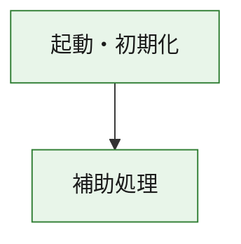
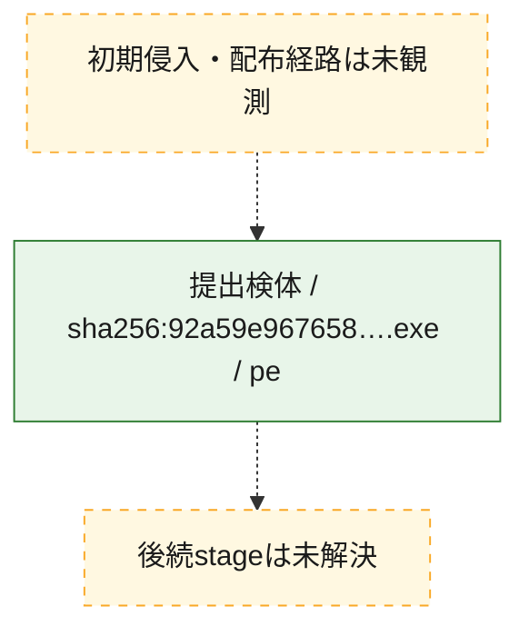
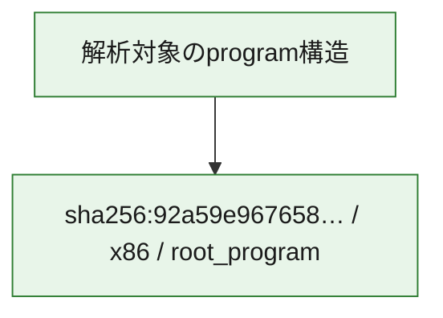

# 全体ロジック：92a59e9676580ceecffbf7248cbf52514fa867a8cb3c8b7f7f5a8d43e3cf0590

代表関数の静的証跡から、起動・初期化の処理群を確認しました。

## 読み方

- phaseの掲載順は解析上の整理順です。observed_call_edgesがない段階間の実行順を断定しません。
- 図の実線は静的に観測した関係、点線と黄色のノードは未観測・未解決の関係を示します。
- 図は静的な要約であり、動的実行を再現するものではありません。
- 詳細な関数解説とfingerprintは[STATIC-LOGIC.md](STATIC-LOGIC.md)を参照してください。

## 静的可視化

### 実行フロー

### 感染チェーン

### モジュール関係

## 処理段階

### 1. 起動・初期化

entry pointから初期化と後続処理への移行を確認します。
確度: `confirmed_static_function_evidence`

- `92a59e9676580ceecffbf7248cbf52514fa867a8cb3c8b7f7f5a8d43e3cf0590:ghidra:180001010` — 初期化と主要処理への分岐を行う入口関数です。 状態: `succeeded`、選定理由: `entry_point`, `meaningful_symbol_name`, `reviewed_call_centrality:22`, `role:entrypoint`, `small_program_complete_context`

### 2. 補助処理

主要処理を支える一般内部関数またはlibrary処理を確認します。
確度: `confirmed_static_function_evidence`

- `92a59e9676580ceecffbf7248cbf52514fa867a8cb3c8b7f7f5a8d43e3cf0590:ghidra:180001240` — 検体内部の一般処理を実装する関数です。 状態: `succeeded`、選定理由: `context_representative`, `reviewed_call_centrality:2`, `small_program_complete_context`
- `92a59e9676580ceecffbf7248cbf52514fa867a8cb3c8b7f7f5a8d43e3cf0590:ghidra:180001350` — 検体内部の一般処理を実装する関数です。 状態: `succeeded`、選定理由: `context_representative`, `reviewed_call_centrality:25`, `small_program_complete_context`
- `92a59e9676580ceecffbf7248cbf52514fa867a8cb3c8b7f7f5a8d43e3cf0590:ghidra:180003780` — 検体内部の一般処理を実装する関数です。 状態: `succeeded`、選定理由: `context_representative`, `reviewed_call_centrality:2`, `small_program_complete_context`
- `92a59e9676580ceecffbf7248cbf52514fa867a8cb3c8b7f7f5a8d43e3cf0590:ghidra:1800038e0` — 検体内部の一般処理を実装する関数です。 状態: `succeeded`、選定理由: `context_representative`, `reviewed_call_centrality:2`, `small_program_complete_context`

## 観測したcall関係

- `92a59e9676580ceecffbf7248cbf52514fa867a8cb3c8b7f7f5a8d43e3cf0590:ghidra:180001010` → `92a59e9676580ceecffbf7248cbf52514fa867a8cb3c8b7f7f5a8d43e3cf0590:ghidra:180001240` （`startup` → `support`）
- `92a59e9676580ceecffbf7248cbf52514fa867a8cb3c8b7f7f5a8d43e3cf0590:ghidra:180001010` → `92a59e9676580ceecffbf7248cbf52514fa867a8cb3c8b7f7f5a8d43e3cf0590:ghidra:180001350` （`startup` → `support`）
- `92a59e9676580ceecffbf7248cbf52514fa867a8cb3c8b7f7f5a8d43e3cf0590:ghidra:180001350` → `92a59e9676580ceecffbf7248cbf52514fa867a8cb3c8b7f7f5a8d43e3cf0590:ghidra:180001240` （`support` → `support`）
- `92a59e9676580ceecffbf7248cbf52514fa867a8cb3c8b7f7f5a8d43e3cf0590:ghidra:180001350` → `92a59e9676580ceecffbf7248cbf52514fa867a8cb3c8b7f7f5a8d43e3cf0590:ghidra:180003780` （`support` → `support`）
- `92a59e9676580ceecffbf7248cbf52514fa867a8cb3c8b7f7f5a8d43e3cf0590:ghidra:180001350` → `92a59e9676580ceecffbf7248cbf52514fa867a8cb3c8b7f7f5a8d43e3cf0590:ghidra:1800038e0` （`support` → `support`）
- `92a59e9676580ceecffbf7248cbf52514fa867a8cb3c8b7f7f5a8d43e3cf0590:ghidra:180003780` → `92a59e9676580ceecffbf7248cbf52514fa867a8cb3c8b7f7f5a8d43e3cf0590:ghidra:1800038e0` （`support` → `support`）
- `ghidra-function:14cd98b2bb23cf9d424cdb20` → `ghidra-function:1b7ecc8bfc0f37f508c49ac5` （`unclassified` → `unclassified`）
- `ghidra-function:5fa2d184ffbf3b397a7c30fb` → `ghidra-function:15220021f06944523f1ec7df` （`unclassified` → `unclassified`）
- `ghidra-function:5fa2d184ffbf3b397a7c30fb` → `ghidra-function:1ce1e56549170b713e959b67` （`unclassified` → `unclassified`）
- `ghidra-function:5fa2d184ffbf3b397a7c30fb` → `ghidra-function:2b206dcd167319f7a3bf2262` （`unclassified` → `unclassified`）
- `ghidra-function:5fa2d184ffbf3b397a7c30fb` → `ghidra-function:33022105267b106fad8c6d61` （`unclassified` → `unclassified`）
- `ghidra-function:5fa2d184ffbf3b397a7c30fb` → `ghidra-function:692d06d7400bb726f6330890` （`unclassified` → `unclassified`）
- `ghidra-function:5fa2d184ffbf3b397a7c30fb` → `ghidra-function:6af907dafc7ff6ecd28fefa3` （`unclassified` → `unclassified`）
- `ghidra-function:5fa2d184ffbf3b397a7c30fb` → `ghidra-function:74f8ebbe5a27ade6435c8f63` （`unclassified` → `unclassified`）
- `ghidra-function:5fa2d184ffbf3b397a7c30fb` → `ghidra-function:7662dba3f5976dd02d442d15` （`unclassified` → `unclassified`）
- `ghidra-function:5fa2d184ffbf3b397a7c30fb` → `ghidra-function:8df667a0704f7cb84dc56bc4` （`unclassified` → `unclassified`）
- `ghidra-function:5fa2d184ffbf3b397a7c30fb` → `ghidra-function:b06a18f787eafb9bbb8adf5f` （`unclassified` → `unclassified`）
- `ghidra-function:5fa2d184ffbf3b397a7c30fb` → `ghidra-function:ef2bd8a5717d09b8cbd8847b` （`unclassified` → `unclassified`）
- `ghidra-function:5fa2d184ffbf3b397a7c30fb` → `ghidra-function:f50ab68de5c7d9d63137ac84` （`unclassified` → `unclassified`）
- `ghidra-function:6af907dafc7ff6ecd28fefa3` → `ghidra-external:194f1d5976b5a74b31fcb517` （`unclassified` → `unclassified`）
- `ghidra-function:6af907dafc7ff6ecd28fefa3` → `ghidra-external:234d1f31bddbb9b945bb72ad` （`unclassified` → `unclassified`）
- `ghidra-function:6af907dafc7ff6ecd28fefa3` → `ghidra-external:240f33ceddcde2e64078e510` （`unclassified` → `unclassified`）
- `ghidra-function:6af907dafc7ff6ecd28fefa3` → `ghidra-external:29e4e0e6b6c124f4187ea660` （`unclassified` → `unclassified`）
- `ghidra-function:6af907dafc7ff6ecd28fefa3` → `ghidra-external:2a85149eff853dbbcf05eacb` （`unclassified` → `unclassified`）
- `ghidra-function:6af907dafc7ff6ecd28fefa3` → `ghidra-external:2d0b416d5529d821fdaf83e9` （`unclassified` → `unclassified`）
- `ghidra-function:6af907dafc7ff6ecd28fefa3` → `ghidra-external:317766ebad12b60c0346cc68` （`unclassified` → `unclassified`）
- `ghidra-function:6af907dafc7ff6ecd28fefa3` → `ghidra-external:4d750e8478a06107a4651df5` （`unclassified` → `unclassified`）
- `ghidra-function:6af907dafc7ff6ecd28fefa3` → `ghidra-external:7b58e4fd9ba6a663d4e0440a` （`unclassified` → `unclassified`）
- `ghidra-function:6af907dafc7ff6ecd28fefa3` → `ghidra-external:7c19f72fd614cc0e187d13ef` （`unclassified` → `unclassified`）
- `ghidra-function:6af907dafc7ff6ecd28fefa3` → `ghidra-external:7f9425f665c53845863ee2f0` （`unclassified` → `unclassified`）
- `ghidra-function:6af907dafc7ff6ecd28fefa3` → `ghidra-external:85e2193cf5e4efc4bf470d83` （`unclassified` → `unclassified`）
- `ghidra-function:6af907dafc7ff6ecd28fefa3` → `ghidra-external:aa04f6def0290bef64f027f6` （`unclassified` → `unclassified`）
- `ghidra-function:6af907dafc7ff6ecd28fefa3` → `ghidra-external:c39c315dca7902ed07a13ed4` （`unclassified` → `unclassified`）
- `ghidra-function:6af907dafc7ff6ecd28fefa3` → `ghidra-external:c663e63d58e31da67e06755e` （`unclassified` → `unclassified`）
- `ghidra-function:6af907dafc7ff6ecd28fefa3` → `ghidra-external:c82adcf416182bb26340ba2c` （`unclassified` → `unclassified`）
- `ghidra-function:6af907dafc7ff6ecd28fefa3` → `ghidra-external:dc977c7a608fc30b63ae7093` （`unclassified` → `unclassified`）
- `ghidra-function:6af907dafc7ff6ecd28fefa3` → `ghidra-external:dcdaf3e198adb51c9c8fd5ef` （`unclassified` → `unclassified`）
- `ghidra-function:6af907dafc7ff6ecd28fefa3` → `ghidra-external:df56c1d0befc0ddc7c36b377` （`unclassified` → `unclassified`）
- `ghidra-function:6af907dafc7ff6ecd28fefa3` → `ghidra-external:e51d39a3089a987a913b11ef` （`unclassified` → `unclassified`）
- `ghidra-function:6af907dafc7ff6ecd28fefa3` → `ghidra-external:f49f00a8ce9d9bcee747407e` （`unclassified` → `unclassified`）
- `ghidra-function:6af907dafc7ff6ecd28fefa3` → `ghidra-function:14cd98b2bb23cf9d424cdb20` （`unclassified` → `unclassified`）
- `ghidra-function:6af907dafc7ff6ecd28fefa3` → `ghidra-function:1b7ecc8bfc0f37f508c49ac5` （`unclassified` → `unclassified`）
- `ghidra-function:6af907dafc7ff6ecd28fefa3` → `ghidra-function:692d06d7400bb726f6330890` （`unclassified` → `unclassified`）

## 解析範囲と制約

- 選定外関数は全体inventoryへ残しますが、関数本体の個別解説対象にはしていません。
- indirect call、難読化、packer、VM、壊れたcontrol flowによりcall関係が欠落する場合があります。
- 文書は静的解析に基づき、検体実行や外部通信による動的確認は行っていません。
