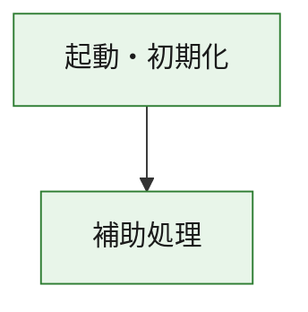
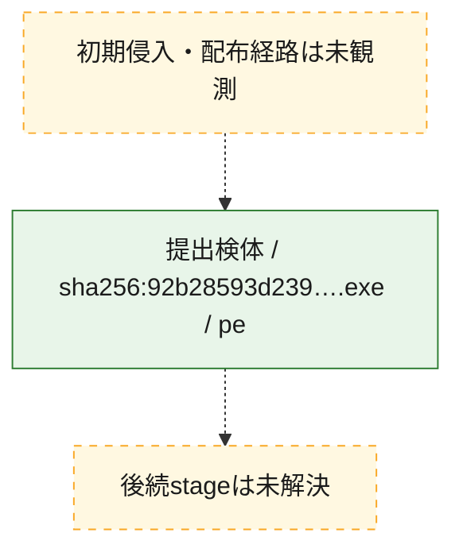
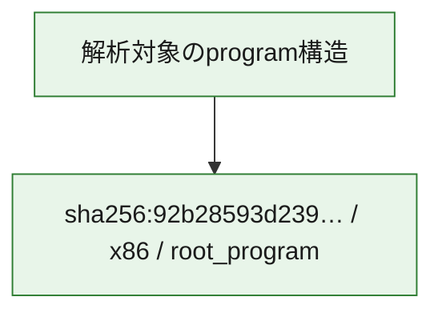

# 全体ロジック：92b28593d239a93d68e9bf136fdeb8559ff3ab9b99b24ab509cbcd60996292ed

代表関数の静的証跡から、起動・初期化の処理群を確認しました。

## 読み方

- phaseの掲載順は解析上の整理順です。observed_call_edgesがない段階間の実行順を断定しません。
- 図の実線は静的に観測した関係、点線と黄色のノードは未観測・未解決の関係を示します。
- 図は静的な要約であり、動的実行を再現するものではありません。
- 詳細な関数解説とfingerprintは[STATIC-LOGIC.md](STATIC-LOGIC.md)を参照してください。

## 静的可視化

### 実行フロー

### 感染チェーン

### モジュール関係

## 処理段階

### 1. 起動・初期化

entry pointから初期化と後続処理への移行を確認します。
確度: `confirmed_static_function_evidence`

- `92b28593d239a93d68e9bf136fdeb8559ff3ab9b99b24ab509cbcd60996292ed:ghidra:180001010` — 初期化と主要処理への分岐を行う入口関数です。 状態: `succeeded`、選定理由: `entry_point`, `meaningful_symbol_name`, `reviewed_call_centrality:22`, `role:entrypoint`, `small_program_complete_context`

### 2. 補助処理

主要処理を支える一般内部関数またはlibrary処理を確認します。
確度: `confirmed_static_function_evidence`

- `92b28593d239a93d68e9bf136fdeb8559ff3ab9b99b24ab509cbcd60996292ed:ghidra:180001240` — 検体内部の一般処理を実装する関数です。 状態: `succeeded`、選定理由: `context_representative`, `reviewed_call_centrality:2`, `small_program_complete_context`
- `92b28593d239a93d68e9bf136fdeb8559ff3ab9b99b24ab509cbcd60996292ed:ghidra:180001350` — 検体内部の一般処理を実装する関数です。 状態: `succeeded`、選定理由: `context_representative`, `reviewed_call_centrality:25`, `small_program_complete_context`
- `92b28593d239a93d68e9bf136fdeb8559ff3ab9b99b24ab509cbcd60996292ed:ghidra:180003780` — 検体内部の一般処理を実装する関数です。 状態: `succeeded`、選定理由: `context_representative`, `reviewed_call_centrality:2`, `small_program_complete_context`
- `92b28593d239a93d68e9bf136fdeb8559ff3ab9b99b24ab509cbcd60996292ed:ghidra:1800038e0` — 検体内部の一般処理を実装する関数です。 状態: `succeeded`、選定理由: `context_representative`, `reviewed_call_centrality:2`, `small_program_complete_context`

## 観測したcall関係

- `92b28593d239a93d68e9bf136fdeb8559ff3ab9b99b24ab509cbcd60996292ed:ghidra:180001010` → `92b28593d239a93d68e9bf136fdeb8559ff3ab9b99b24ab509cbcd60996292ed:ghidra:180001240` （`startup` → `support`）
- `92b28593d239a93d68e9bf136fdeb8559ff3ab9b99b24ab509cbcd60996292ed:ghidra:180001010` → `92b28593d239a93d68e9bf136fdeb8559ff3ab9b99b24ab509cbcd60996292ed:ghidra:180001350` （`startup` → `support`）
- `92b28593d239a93d68e9bf136fdeb8559ff3ab9b99b24ab509cbcd60996292ed:ghidra:180001350` → `92b28593d239a93d68e9bf136fdeb8559ff3ab9b99b24ab509cbcd60996292ed:ghidra:180001240` （`support` → `support`）
- `92b28593d239a93d68e9bf136fdeb8559ff3ab9b99b24ab509cbcd60996292ed:ghidra:180001350` → `92b28593d239a93d68e9bf136fdeb8559ff3ab9b99b24ab509cbcd60996292ed:ghidra:180003780` （`support` → `support`）
- `92b28593d239a93d68e9bf136fdeb8559ff3ab9b99b24ab509cbcd60996292ed:ghidra:180001350` → `92b28593d239a93d68e9bf136fdeb8559ff3ab9b99b24ab509cbcd60996292ed:ghidra:1800038e0` （`support` → `support`）
- `92b28593d239a93d68e9bf136fdeb8559ff3ab9b99b24ab509cbcd60996292ed:ghidra:180003780` → `92b28593d239a93d68e9bf136fdeb8559ff3ab9b99b24ab509cbcd60996292ed:ghidra:1800038e0` （`support` → `support`）
- `ghidra-function:14a429477f4bdee7f1d4b78c` → `ghidra-function:0471b83c062e76a98b76bafc` （`unclassified` → `unclassified`）
- `ghidra-function:14a429477f4bdee7f1d4b78c` → `ghidra-function:1fc82d017ec2cab25a0f2206` （`unclassified` → `unclassified`）
- `ghidra-function:14a429477f4bdee7f1d4b78c` → `ghidra-function:20ab7000548b9ff91613bf76` （`unclassified` → `unclassified`）
- `ghidra-function:14a429477f4bdee7f1d4b78c` → `ghidra-function:248b6c52281c6e5ae1def642` （`unclassified` → `unclassified`）
- `ghidra-function:14a429477f4bdee7f1d4b78c` → `ghidra-function:2bd7170dd9700d33abd50f59` （`unclassified` → `unclassified`）
- `ghidra-function:14a429477f4bdee7f1d4b78c` → `ghidra-function:5cc848ade1547a46110fc3e7` （`unclassified` → `unclassified`）
- `ghidra-function:14a429477f4bdee7f1d4b78c` → `ghidra-function:8468ebe9d52e305729b93cbc` （`unclassified` → `unclassified`）
- `ghidra-function:14a429477f4bdee7f1d4b78c` → `ghidra-function:8ce345e0c97ddda731494c63` （`unclassified` → `unclassified`）
- `ghidra-function:14a429477f4bdee7f1d4b78c` → `ghidra-function:9624cf64c5f3792ed4a582bf` （`unclassified` → `unclassified`）
- `ghidra-function:14a429477f4bdee7f1d4b78c` → `ghidra-function:999ced6892981d9a966603fe` （`unclassified` → `unclassified`）
- `ghidra-function:14a429477f4bdee7f1d4b78c` → `ghidra-function:cc8eac872691653368bf7fb3` （`unclassified` → `unclassified`）
- `ghidra-function:14a429477f4bdee7f1d4b78c` → `ghidra-function:d9d34f417d9e0395f05ace2a` （`unclassified` → `unclassified`）
- `ghidra-function:248b6c52281c6e5ae1def642` → `ghidra-external:1001965c8b3a27a2c49b46b6` （`unclassified` → `unclassified`）
- `ghidra-function:248b6c52281c6e5ae1def642` → `ghidra-external:2caebc87c3b6172e5b88ef98` （`unclassified` → `unclassified`）
- `ghidra-function:248b6c52281c6e5ae1def642` → `ghidra-external:320e5a6d8efc49cd181ff8a6` （`unclassified` → `unclassified`）
- `ghidra-function:248b6c52281c6e5ae1def642` → `ghidra-external:487b4805d121ea789d2fec9d` （`unclassified` → `unclassified`）
- `ghidra-function:248b6c52281c6e5ae1def642` → `ghidra-external:4fcb13e73e81a69468b9b6cf` （`unclassified` → `unclassified`）
- `ghidra-function:248b6c52281c6e5ae1def642` → `ghidra-external:536a09ee1988ff2e6e1df039` （`unclassified` → `unclassified`）
- `ghidra-function:248b6c52281c6e5ae1def642` → `ghidra-external:59cfe3b18d87b1ded1d5516d` （`unclassified` → `unclassified`）
- `ghidra-function:248b6c52281c6e5ae1def642` → `ghidra-external:628c8d8c6a389cef1c396d14` （`unclassified` → `unclassified`）
- `ghidra-function:248b6c52281c6e5ae1def642` → `ghidra-external:647242130f4cf94df787c4fc` （`unclassified` → `unclassified`）
- `ghidra-function:248b6c52281c6e5ae1def642` → `ghidra-external:67809f852f6be7bab1e6337a` （`unclassified` → `unclassified`）
- `ghidra-function:248b6c52281c6e5ae1def642` → `ghidra-external:68f5220bf99b34f244102c58` （`unclassified` → `unclassified`）
- `ghidra-function:248b6c52281c6e5ae1def642` → `ghidra-external:7707ec10b07956eeb7a3bc8a` （`unclassified` → `unclassified`）
- `ghidra-function:248b6c52281c6e5ae1def642` → `ghidra-external:7c82728ced9ed13f2c4da44a` （`unclassified` → `unclassified`）
- `ghidra-function:248b6c52281c6e5ae1def642` → `ghidra-external:91c11ddccf9810cf289b34c1` （`unclassified` → `unclassified`）
- `ghidra-function:248b6c52281c6e5ae1def642` → `ghidra-external:a11810080691f689de700ead` （`unclassified` → `unclassified`）
- `ghidra-function:248b6c52281c6e5ae1def642` → `ghidra-external:a80221297bb3d47755c85a01` （`unclassified` → `unclassified`）
- `ghidra-function:248b6c52281c6e5ae1def642` → `ghidra-external:bd12a9709df26dfe06d6924a` （`unclassified` → `unclassified`）
- `ghidra-function:248b6c52281c6e5ae1def642` → `ghidra-external:cda90e57c9b0d0e576a155fb` （`unclassified` → `unclassified`）
- `ghidra-function:248b6c52281c6e5ae1def642` → `ghidra-external:d0abbcd3e4cd7b85d69aedb2` （`unclassified` → `unclassified`）
- `ghidra-function:248b6c52281c6e5ae1def642` → `ghidra-external:d33a2a29aa4ed81b5c2ce678` （`unclassified` → `unclassified`）
- `ghidra-function:248b6c52281c6e5ae1def642` → `ghidra-external:f8d4bfcdf4e00083c6df35f8` （`unclassified` → `unclassified`）
- `ghidra-function:248b6c52281c6e5ae1def642` → `ghidra-function:0471b83c062e76a98b76bafc` （`unclassified` → `unclassified`）
- `ghidra-function:248b6c52281c6e5ae1def642` → `ghidra-function:04b5b9ac2ceddf571989d800` （`unclassified` → `unclassified`）
- `ghidra-function:248b6c52281c6e5ae1def642` → `ghidra-function:71a112818d26e98023f723de` （`unclassified` → `unclassified`）
- `ghidra-function:71a112818d26e98023f723de` → `ghidra-function:04b5b9ac2ceddf571989d800` （`unclassified` → `unclassified`）

## 解析範囲と制約

- 選定外関数は全体inventoryへ残しますが、関数本体の個別解説対象にはしていません。
- indirect call、難読化、packer、VM、壊れたcontrol flowによりcall関係が欠落する場合があります。
- 文書は静的解析に基づき、検体実行や外部通信による動的確認は行っていません。
