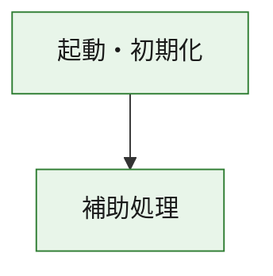
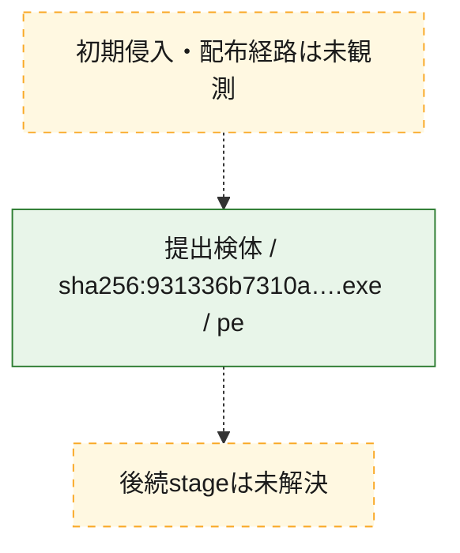
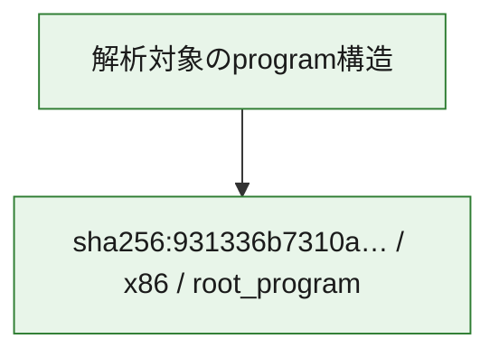

# 全体ロジック：931336b7310ada26d4d7320728ec81feda0f6c97d59df56d59263eb5c2b16f27

代表関数の静的証跡から、起動・初期化の処理群を確認しました。

## 読み方

- phaseの掲載順は解析上の整理順です。observed_call_edgesがない段階間の実行順を断定しません。
- 図の実線は静的に観測した関係、点線と黄色のノードは未観測・未解決の関係を示します。
- 図は静的な要約であり、動的実行を再現するものではありません。
- 詳細な関数解説とfingerprintは[STATIC-LOGIC.md](STATIC-LOGIC.md)を参照してください。

## 静的可視化

### 実行フロー

### 感染チェーン

### モジュール関係

## 処理段階

### 1. 起動・初期化

entry pointから初期化と後続処理への移行を確認します。
確度: `confirmed_static_function_evidence`

- `931336b7310ada26d4d7320728ec81feda0f6c97d59df56d59263eb5c2b16f27:ghidra:180001010` — 初期化と主要処理への分岐を行う入口関数です。 状態: `succeeded`、選定理由: `entry_point`, `meaningful_symbol_name`, `reviewed_call_centrality:22`, `role:entrypoint`, `small_program_complete_context`

### 2. 補助処理

主要処理を支える一般内部関数またはlibrary処理を確認します。
確度: `confirmed_static_function_evidence`

- `931336b7310ada26d4d7320728ec81feda0f6c97d59df56d59263eb5c2b16f27:ghidra:180001240` — 検体内部の一般処理を実装する関数です。 状態: `succeeded`、選定理由: `context_representative`, `reviewed_call_centrality:2`, `small_program_complete_context`
- `931336b7310ada26d4d7320728ec81feda0f6c97d59df56d59263eb5c2b16f27:ghidra:180001350` — 検体内部の一般処理を実装する関数です。 状態: `succeeded`、選定理由: `context_representative`, `reviewed_call_centrality:25`, `small_program_complete_context`
- `931336b7310ada26d4d7320728ec81feda0f6c97d59df56d59263eb5c2b16f27:ghidra:180003780` — 検体内部の一般処理を実装する関数です。 状態: `succeeded`、選定理由: `context_representative`, `reviewed_call_centrality:2`, `small_program_complete_context`
- `931336b7310ada26d4d7320728ec81feda0f6c97d59df56d59263eb5c2b16f27:ghidra:1800038e0` — 検体内部の一般処理を実装する関数です。 状態: `succeeded`、選定理由: `context_representative`, `reviewed_call_centrality:2`, `small_program_complete_context`

## 観測したcall関係

- `931336b7310ada26d4d7320728ec81feda0f6c97d59df56d59263eb5c2b16f27:ghidra:180001010` → `931336b7310ada26d4d7320728ec81feda0f6c97d59df56d59263eb5c2b16f27:ghidra:180001240` （`startup` → `support`）
- `931336b7310ada26d4d7320728ec81feda0f6c97d59df56d59263eb5c2b16f27:ghidra:180001010` → `931336b7310ada26d4d7320728ec81feda0f6c97d59df56d59263eb5c2b16f27:ghidra:180001350` （`startup` → `support`）
- `931336b7310ada26d4d7320728ec81feda0f6c97d59df56d59263eb5c2b16f27:ghidra:180001350` → `931336b7310ada26d4d7320728ec81feda0f6c97d59df56d59263eb5c2b16f27:ghidra:180001240` （`support` → `support`）
- `931336b7310ada26d4d7320728ec81feda0f6c97d59df56d59263eb5c2b16f27:ghidra:180001350` → `931336b7310ada26d4d7320728ec81feda0f6c97d59df56d59263eb5c2b16f27:ghidra:180003780` （`support` → `support`）
- `931336b7310ada26d4d7320728ec81feda0f6c97d59df56d59263eb5c2b16f27:ghidra:180001350` → `931336b7310ada26d4d7320728ec81feda0f6c97d59df56d59263eb5c2b16f27:ghidra:1800038e0` （`support` → `support`）
- `931336b7310ada26d4d7320728ec81feda0f6c97d59df56d59263eb5c2b16f27:ghidra:180003780` → `931336b7310ada26d4d7320728ec81feda0f6c97d59df56d59263eb5c2b16f27:ghidra:1800038e0` （`support` → `support`）
- `ghidra-function:10c025f5f9d9b6b8edbf76f5` → `ghidra-function:1558b2f42b8777f03488c674` （`unclassified` → `unclassified`）
- `ghidra-function:10c025f5f9d9b6b8edbf76f5` → `ghidra-function:1d80f2dbab70796e68e4c12d` （`unclassified` → `unclassified`）
- `ghidra-function:10c025f5f9d9b6b8edbf76f5` → `ghidra-function:40dd12c08d0ae422547c3139` （`unclassified` → `unclassified`）
- `ghidra-function:10c025f5f9d9b6b8edbf76f5` → `ghidra-function:43220299ac65430abf4f6080` （`unclassified` → `unclassified`）
- `ghidra-function:10c025f5f9d9b6b8edbf76f5` → `ghidra-function:44f04839c82c3e3d034c68aa` （`unclassified` → `unclassified`）
- `ghidra-function:10c025f5f9d9b6b8edbf76f5` → `ghidra-function:6cd10c7d53a66c5de66913ef` （`unclassified` → `unclassified`）
- `ghidra-function:10c025f5f9d9b6b8edbf76f5` → `ghidra-function:892f63d76a87bd53ea64869e` （`unclassified` → `unclassified`）
- `ghidra-function:10c025f5f9d9b6b8edbf76f5` → `ghidra-function:984c6de3c34a03f10a8f1238` （`unclassified` → `unclassified`）
- `ghidra-function:10c025f5f9d9b6b8edbf76f5` → `ghidra-function:a76d1c7ffd876831404165f6` （`unclassified` → `unclassified`）
- `ghidra-function:10c025f5f9d9b6b8edbf76f5` → `ghidra-function:a90a67d8b1d07fd18b6cc1b6` （`unclassified` → `unclassified`）
- `ghidra-function:10c025f5f9d9b6b8edbf76f5` → `ghidra-function:e554516a0171886d050296e7` （`unclassified` → `unclassified`）
- `ghidra-function:10c025f5f9d9b6b8edbf76f5` → `ghidra-function:e604192c78e565cea7f63a49` （`unclassified` → `unclassified`）
- `ghidra-function:1558b2f42b8777f03488c674` → `ghidra-external:0624fe1f801c1083b1f4d611` （`unclassified` → `unclassified`）
- `ghidra-function:1558b2f42b8777f03488c674` → `ghidra-external:06d7bac343ac2c1deed9b1c1` （`unclassified` → `unclassified`）
- `ghidra-function:1558b2f42b8777f03488c674` → `ghidra-external:1d1dd0513e6df8bcf735e2d3` （`unclassified` → `unclassified`）
- `ghidra-function:1558b2f42b8777f03488c674` → `ghidra-external:38585c3217af06d607aa4c2d` （`unclassified` → `unclassified`）
- `ghidra-function:1558b2f42b8777f03488c674` → `ghidra-external:39f51a9946f5f6607e6da22a` （`unclassified` → `unclassified`）
- `ghidra-function:1558b2f42b8777f03488c674` → `ghidra-external:43a34ded4410a21726cff319` （`unclassified` → `unclassified`）
- `ghidra-function:1558b2f42b8777f03488c674` → `ghidra-external:44912cb91a9cae7124becb75` （`unclassified` → `unclassified`）
- `ghidra-function:1558b2f42b8777f03488c674` → `ghidra-external:6933b28376b69043d708b32e` （`unclassified` → `unclassified`）
- `ghidra-function:1558b2f42b8777f03488c674` → `ghidra-external:704c590c4208e2ce72568d27` （`unclassified` → `unclassified`）
- `ghidra-function:1558b2f42b8777f03488c674` → `ghidra-external:78b8c46ebed6ce8550842c2f` （`unclassified` → `unclassified`）
- `ghidra-function:1558b2f42b8777f03488c674` → `ghidra-external:92e1b135d6608bbe7a291e39` （`unclassified` → `unclassified`）
- `ghidra-function:1558b2f42b8777f03488c674` → `ghidra-external:986579cacc3eaac1cf04af1b` （`unclassified` → `unclassified`）
- `ghidra-function:1558b2f42b8777f03488c674` → `ghidra-external:9914daf77468c5a3ca45b77c` （`unclassified` → `unclassified`）
- `ghidra-function:1558b2f42b8777f03488c674` → `ghidra-external:a311b2b8b571244b83f11af2` （`unclassified` → `unclassified`）
- `ghidra-function:1558b2f42b8777f03488c674` → `ghidra-external:a6fe48d5f57ded71353ea70c` （`unclassified` → `unclassified`）
- `ghidra-function:1558b2f42b8777f03488c674` → `ghidra-external:c9fbf8e4f1ec75d5e5e8b5ed` （`unclassified` → `unclassified`）
- `ghidra-function:1558b2f42b8777f03488c674` → `ghidra-external:d8632e54dead64808e540d11` （`unclassified` → `unclassified`）
- `ghidra-function:1558b2f42b8777f03488c674` → `ghidra-external:e33ca335638d465dfaaaf722` （`unclassified` → `unclassified`）
- `ghidra-function:1558b2f42b8777f03488c674` → `ghidra-external:e82c06caff1af14c65ef7035` （`unclassified` → `unclassified`）
- `ghidra-function:1558b2f42b8777f03488c674` → `ghidra-external:ef48248f197f559341bbf74e` （`unclassified` → `unclassified`）
- `ghidra-function:1558b2f42b8777f03488c674` → `ghidra-external:f39c6cfe5cc0e01153039477` （`unclassified` → `unclassified`）
- `ghidra-function:1558b2f42b8777f03488c674` → `ghidra-function:02df36eff0516dd14a715fe5` （`unclassified` → `unclassified`）
- `ghidra-function:1558b2f42b8777f03488c674` → `ghidra-function:6cd10c7d53a66c5de66913ef` （`unclassified` → `unclassified`）
- `ghidra-function:1558b2f42b8777f03488c674` → `ghidra-function:7192a78560f5b38f3cd2dbe4` （`unclassified` → `unclassified`）
- `ghidra-function:7192a78560f5b38f3cd2dbe4` → `ghidra-function:02df36eff0516dd14a715fe5` （`unclassified` → `unclassified`）

## 解析範囲と制約

- 選定外関数は全体inventoryへ残しますが、関数本体の個別解説対象にはしていません。
- indirect call、難読化、packer、VM、壊れたcontrol flowによりcall関係が欠落する場合があります。
- 文書は静的解析に基づき、検体実行や外部通信による動的確認は行っていません。
