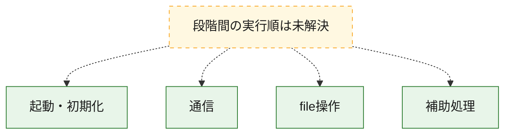
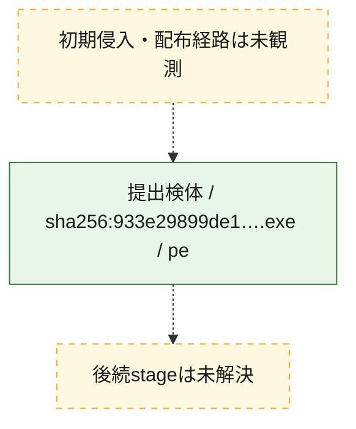
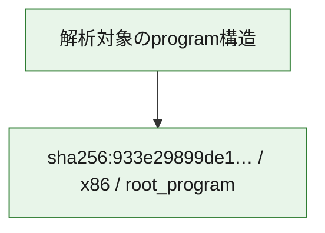

# 全体ロジック：933e29899de1ff32f50bf687c38835e4b2d3de29934cb66386948b4befd8e1cb

代表関数の静的証跡から、起動・初期化、通信、file操作の処理群を確認しました。

## 読み方

- phaseの掲載順は解析上の整理順です。observed_call_edgesがない段階間の実行順を断定しません。
- 図の実線は静的に観測した関係、点線と黄色のノードは未観測・未解決の関係を示します。
- 図は静的な要約であり、動的実行を再現するものではありません。
- 詳細な関数解説とfingerprintは[STATIC-LOGIC.md](STATIC-LOGIC.md)を参照してください。

## 静的可視化

### 実行フロー

### 感染チェーン

### モジュール関係

## 処理段階

### 1. 起動・初期化

entry pointから初期化と後続処理への移行を確認します。
確度: `confirmed_static_function_evidence_with_limits`

- `933e29899de1ff32f50bf687c38835e4b2d3de29934cb66386948b4befd8e1cb:ghidra:00422500` — 初期化と主要処理への分岐を行う入口関数です。 状態: `limited_bad_instruction_or_flow`、選定理由: `entry_point`, `meaningful_symbol_name`, `reviewed_call_centrality:28`, `role:entrypoint`

### 2. 通信

通信初期化、endpoint処理、送受信の役割を確認します。
確度: `confirmed_static_function_evidence`

- `933e29899de1ff32f50bf687c38835e4b2d3de29934cb66386948b4befd8e1cb:ghidra:00406ddc` — 通信初期化、送受信、またはendpoint処理に関係する関数です。 状態: `succeeded`、選定理由: `context_representative`, `reviewed_call_centrality:7`, `role:network_communication`
- `933e29899de1ff32f50bf687c38835e4b2d3de29934cb66386948b4befd8e1cb:ghidra:00406f0c` — 通信初期化、送受信、またはendpoint処理に関係する関数です。 状態: `succeeded`、選定理由: `context_representative`, `reviewed_call_centrality:43`, `role:network_communication`
- `933e29899de1ff32f50bf687c38835e4b2d3de29934cb66386948b4befd8e1cb:ghidra:00407b40` — 通信初期化、送受信、またはendpoint処理に関係する関数です。 状態: `succeeded`、選定理由: `context_representative`, `reviewed_call_centrality:7`, `role:network_communication`
- `933e29899de1ff32f50bf687c38835e4b2d3de29934cb66386948b4befd8e1cb:ghidra:00407be8` — 通信初期化、送受信、またはendpoint処理に関係する関数です。 状態: `succeeded`、選定理由: `context_representative`, `reviewed_call_centrality:20`, `role:network_communication`

### 3. file操作

fileやdirectoryの作成、読書き、削除を確認します。
確度: `confirmed_static_function_evidence`

- `933e29899de1ff32f50bf687c38835e4b2d3de29934cb66386948b4befd8e1cb:ghidra:00408160` — fileまたはdirectoryの読書き・管理に関係する関数です。 状態: `succeeded`、選定理由: `context_representative`, `reviewed_call_centrality:4`, `role:file_operation`

### 4. 補助処理

主要処理を支える一般内部関数またはlibrary処理を確認します。
確度: `confirmed_static_function_evidence`

- `933e29899de1ff32f50bf687c38835e4b2d3de29934cb66386948b4befd8e1cb:ghidra:00407f98` — 検体内部の一般処理を実装する関数です。 状態: `succeeded`、選定理由: `context_representative`, `reviewed_call_centrality:12`
- `933e29899de1ff32f50bf687c38835e4b2d3de29934cb66386948b4befd8e1cb:ghidra:00407ff8` — 検体内部の一般処理を実装する関数です。 状態: `succeeded`、選定理由: `context_representative`, `reviewed_call_centrality:6`
- `933e29899de1ff32f50bf687c38835e4b2d3de29934cb66386948b4befd8e1cb:ghidra:0040801c` — 検体内部の一般処理を実装する関数です。 状態: `succeeded`、選定理由: `context_representative`, `reviewed_call_centrality:5`
- `933e29899de1ff32f50bf687c38835e4b2d3de29934cb66386948b4befd8e1cb:ghidra:00408074` — 検体内部の一般処理を実装する関数です。 状態: `succeeded`、選定理由: `context_representative`, `reviewed_call_centrality:3`
- `933e29899de1ff32f50bf687c38835e4b2d3de29934cb66386948b4befd8e1cb:ghidra:004080f8` — 検体内部の一般処理を実装する関数です。 状態: `succeeded`、選定理由: `context_representative`, `reviewed_call_centrality:1`
- `933e29899de1ff32f50bf687c38835e4b2d3de29934cb66386948b4befd8e1cb:ghidra:004081ac` — 検体内部の一般処理を実装する関数です。 状態: `succeeded`、選定理由: `context_representative`, `reviewed_call_centrality:3`
- `933e29899de1ff32f50bf687c38835e4b2d3de29934cb66386948b4befd8e1cb:ghidra:00408228` — 検体内部の一般処理を実装する関数です。 状態: `succeeded`、選定理由: `context_representative`, `reviewed_call_centrality:2`
- `933e29899de1ff32f50bf687c38835e4b2d3de29934cb66386948b4befd8e1cb:ghidra:004082cc` — 検体内部の一般処理を実装する関数です。 状態: `succeeded`、選定理由: `context_representative`, `reviewed_call_centrality:3`
- `933e29899de1ff32f50bf687c38835e4b2d3de29934cb66386948b4befd8e1cb:ghidra:0040833c` — 検体内部の一般処理を実装する関数です。 状態: `succeeded`、選定理由: `context_representative`, `reviewed_call_centrality:2`
- `933e29899de1ff32f50bf687c38835e4b2d3de29934cb66386948b4befd8e1cb:ghidra:004083e0` — 検体内部の一般処理を実装する関数です。 状態: `succeeded`、選定理由: `context_representative`, `reviewed_call_centrality:4`
- `933e29899de1ff32f50bf687c38835e4b2d3de29934cb66386948b4befd8e1cb:ghidra:00408488` — 検体内部の一般処理を実装する関数です。 状態: `succeeded`、選定理由: `context_representative`, `reviewed_call_centrality:3`
- `933e29899de1ff32f50bf687c38835e4b2d3de29934cb66386948b4befd8e1cb:ghidra:0040851c` — 検体内部の一般処理を実装する関数です。 状態: `succeeded`、選定理由: `context_representative`, `reviewed_call_centrality:1`
- `933e29899de1ff32f50bf687c38835e4b2d3de29934cb66386948b4befd8e1cb:ghidra:00408574` — 検体内部の一般処理を実装する関数です。 状態: `succeeded`、選定理由: `context_representative`, `reviewed_call_centrality:3`
- `933e29899de1ff32f50bf687c38835e4b2d3de29934cb66386948b4befd8e1cb:ghidra:004085e8` — 検体内部の一般処理を実装する関数です。 状態: `succeeded`、選定理由: `context_representative`
- `933e29899de1ff32f50bf687c38835e4b2d3de29934cb66386948b4befd8e1cb:ghidra:00408638` — 検体内部の一般処理を実装する関数です。 状態: `succeeded`、選定理由: `context_representative`, `reviewed_call_centrality:2`
- `933e29899de1ff32f50bf687c38835e4b2d3de29934cb66386948b4befd8e1cb:ghidra:00408880` — 検体内部の一般処理を実装する関数です。 状態: `succeeded`、選定理由: `context_representative`
- `933e29899de1ff32f50bf687c38835e4b2d3de29934cb66386948b4befd8e1cb:ghidra:004088e8` — 検体内部の一般処理を実装する関数です。 状態: `succeeded`、選定理由: `context_representative`, `reviewed_call_centrality:3`
- `933e29899de1ff32f50bf687c38835e4b2d3de29934cb66386948b4befd8e1cb:ghidra:00408ac0` — 検体内部の一般処理を実装する関数です。 状態: `succeeded`、選定理由: `context_representative`, `reviewed_call_centrality:3`
- `933e29899de1ff32f50bf687c38835e4b2d3de29934cb66386948b4befd8e1cb:ghidra:00408c90` — 検体内部の一般処理を実装する関数です。 状態: `succeeded`、選定理由: `context_representative`, `reviewed_call_centrality:3`
- `933e29899de1ff32f50bf687c38835e4b2d3de29934cb66386948b4befd8e1cb:ghidra:00408dcc` — 検体内部の一般処理を実装する関数です。 状態: `succeeded`、選定理由: `context_representative`, `reviewed_call_centrality:4`
- `933e29899de1ff32f50bf687c38835e4b2d3de29934cb66386948b4befd8e1cb:ghidra:00408f10` — 検体内部の一般処理を実装する関数です。 状態: `succeeded`、選定理由: `context_representative`
- `933e29899de1ff32f50bf687c38835e4b2d3de29934cb66386948b4befd8e1cb:ghidra:00408ffc` — 検体内部の一般処理を実装する関数です。 状態: `succeeded`、選定理由: `context_representative`, `reviewed_call_centrality:2`
- `933e29899de1ff32f50bf687c38835e4b2d3de29934cb66386948b4befd8e1cb:ghidra:0040906c` — 検体内部の一般処理を実装する関数です。 状態: `succeeded`、選定理由: `context_representative`, `reviewed_call_centrality:2`
- `933e29899de1ff32f50bf687c38835e4b2d3de29934cb66386948b4befd8e1cb:ghidra:004090d8` — 検体内部の一般処理を実装する関数です。 状態: `succeeded`、選定理由: `context_representative`, `reviewed_call_centrality:1`
- `933e29899de1ff32f50bf687c38835e4b2d3de29934cb66386948b4befd8e1cb:ghidra:004090fc` — 検体内部の一般処理を実装する関数です。 状態: `succeeded`、選定理由: `context_representative`, `reviewed_call_centrality:1`
- `933e29899de1ff32f50bf687c38835e4b2d3de29934cb66386948b4befd8e1cb:ghidra:00409120` — 検体内部の一般処理を実装する関数です。 状態: `succeeded`、選定理由: `context_representative`, `reviewed_call_centrality:4`

## 観測したcall関係

- 代表関数間で直接解決できた呼出関係はありません。

## 解析範囲と制約

- 選定外関数は全体inventoryへ残しますが、関数本体の個別解説対象にはしていません。
- indirect call、難読化、packer、VM、壊れたcontrol flowによりcall関係が欠落する場合があります。
- 文書は静的解析に基づき、検体実行や外部通信による動的確認は行っていません。
