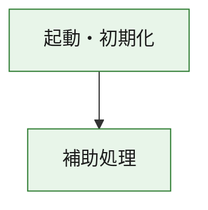
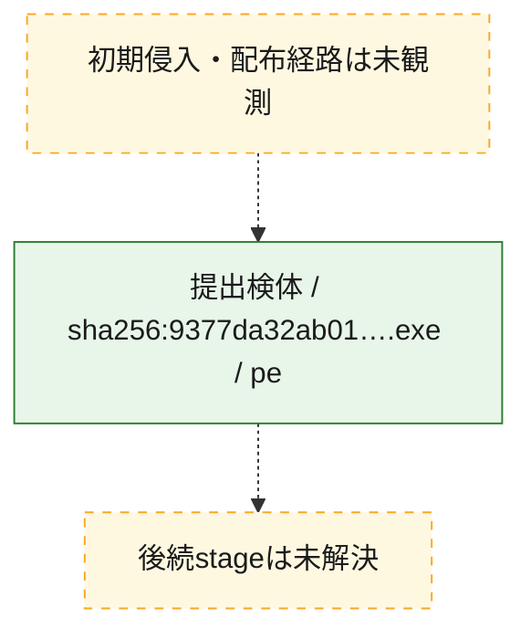
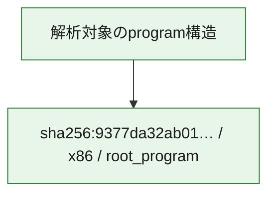

# 全体ロジック：9377da32ab019e87109ed438acb7889369c1249a0f2f92f5cd33eb3455165879

代表関数の静的証跡から、起動・初期化の処理群を確認しました。

## 読み方

- phaseの掲載順は解析上の整理順です。observed_call_edgesがない段階間の実行順を断定しません。
- 図の実線は静的に観測した関係、点線と黄色のノードは未観測・未解決の関係を示します。
- 図は静的な要約であり、動的実行を再現するものではありません。
- 詳細な関数解説とfingerprintは[STATIC-LOGIC.md](STATIC-LOGIC.md)を参照してください。

## 静的可視化

### 実行フロー

### 感染チェーン

### モジュール関係

## 処理段階

### 1. 起動・初期化

entry pointから初期化と後続処理への移行を確認します。
確度: `confirmed_static_function_evidence`

- `9377da32ab019e87109ed438acb7889369c1249a0f2f92f5cd33eb3455165879:ghidra:180001010` — 初期化と主要処理への分岐を行う入口関数です。 状態: `succeeded`、選定理由: `entry_point`, `meaningful_symbol_name`, `reviewed_call_centrality:22`, `role:entrypoint`, `small_program_complete_context`

### 2. 補助処理

主要処理を支える一般内部関数またはlibrary処理を確認します。
確度: `confirmed_static_function_evidence`

- `9377da32ab019e87109ed438acb7889369c1249a0f2f92f5cd33eb3455165879:ghidra:180001240` — 検体内部の一般処理を実装する関数です。 状態: `succeeded`、選定理由: `context_representative`, `reviewed_call_centrality:2`, `small_program_complete_context`
- `9377da32ab019e87109ed438acb7889369c1249a0f2f92f5cd33eb3455165879:ghidra:180001350` — 検体内部の一般処理を実装する関数です。 状態: `succeeded`、選定理由: `context_representative`, `reviewed_call_centrality:25`, `small_program_complete_context`
- `9377da32ab019e87109ed438acb7889369c1249a0f2f92f5cd33eb3455165879:ghidra:180003780` — 検体内部の一般処理を実装する関数です。 状態: `succeeded`、選定理由: `context_representative`, `reviewed_call_centrality:2`, `small_program_complete_context`
- `9377da32ab019e87109ed438acb7889369c1249a0f2f92f5cd33eb3455165879:ghidra:1800038e0` — 検体内部の一般処理を実装する関数です。 状態: `succeeded`、選定理由: `context_representative`, `reviewed_call_centrality:2`, `small_program_complete_context`

## 観測したcall関係

- `9377da32ab019e87109ed438acb7889369c1249a0f2f92f5cd33eb3455165879:ghidra:180001010` → `9377da32ab019e87109ed438acb7889369c1249a0f2f92f5cd33eb3455165879:ghidra:180001240` （`startup` → `support`）
- `9377da32ab019e87109ed438acb7889369c1249a0f2f92f5cd33eb3455165879:ghidra:180001010` → `9377da32ab019e87109ed438acb7889369c1249a0f2f92f5cd33eb3455165879:ghidra:180001350` （`startup` → `support`）
- `9377da32ab019e87109ed438acb7889369c1249a0f2f92f5cd33eb3455165879:ghidra:180001350` → `9377da32ab019e87109ed438acb7889369c1249a0f2f92f5cd33eb3455165879:ghidra:180001240` （`support` → `support`）
- `9377da32ab019e87109ed438acb7889369c1249a0f2f92f5cd33eb3455165879:ghidra:180001350` → `9377da32ab019e87109ed438acb7889369c1249a0f2f92f5cd33eb3455165879:ghidra:180003780` （`support` → `support`）
- `9377da32ab019e87109ed438acb7889369c1249a0f2f92f5cd33eb3455165879:ghidra:180001350` → `9377da32ab019e87109ed438acb7889369c1249a0f2f92f5cd33eb3455165879:ghidra:1800038e0` （`support` → `support`）
- `9377da32ab019e87109ed438acb7889369c1249a0f2f92f5cd33eb3455165879:ghidra:180003780` → `9377da32ab019e87109ed438acb7889369c1249a0f2f92f5cd33eb3455165879:ghidra:1800038e0` （`support` → `support`）
- `ghidra-function:4c7b3f5018e19e01a11c11ae` → `ghidra-external:0907ec39bec85cb5dc1d4cb2` （`unclassified` → `unclassified`）
- `ghidra-function:4c7b3f5018e19e01a11c11ae` → `ghidra-external:15880e7299d85d012846ab2a` （`unclassified` → `unclassified`）
- `ghidra-function:4c7b3f5018e19e01a11c11ae` → `ghidra-external:19c681e7b91be4d0be277d5a` （`unclassified` → `unclassified`）
- `ghidra-function:4c7b3f5018e19e01a11c11ae` → `ghidra-external:2285c00bd6bbf2c0fd578979` （`unclassified` → `unclassified`）
- `ghidra-function:4c7b3f5018e19e01a11c11ae` → `ghidra-external:286cbc070f545d51cb0964e2` （`unclassified` → `unclassified`）
- `ghidra-function:4c7b3f5018e19e01a11c11ae` → `ghidra-external:372d3dae57750c3bb2058ff7` （`unclassified` → `unclassified`）
- `ghidra-function:4c7b3f5018e19e01a11c11ae` → `ghidra-external:4087be859b6c7aa846122056` （`unclassified` → `unclassified`）
- `ghidra-function:4c7b3f5018e19e01a11c11ae` → `ghidra-external:449d2e65aff2a633fd783e50` （`unclassified` → `unclassified`）
- `ghidra-function:4c7b3f5018e19e01a11c11ae` → `ghidra-external:4bc842ac26a76764b2ee9baf` （`unclassified` → `unclassified`）
- `ghidra-function:4c7b3f5018e19e01a11c11ae` → `ghidra-external:4cc4fdb3c7d947597c69ccb4` （`unclassified` → `unclassified`）
- `ghidra-function:4c7b3f5018e19e01a11c11ae` → `ghidra-external:6508bf81fdae08c6e6f60525` （`unclassified` → `unclassified`）
- `ghidra-function:4c7b3f5018e19e01a11c11ae` → `ghidra-external:709f318c1d67034e12161c50` （`unclassified` → `unclassified`）
- `ghidra-function:4c7b3f5018e19e01a11c11ae` → `ghidra-external:70b6b662c32f19556a7741b5` （`unclassified` → `unclassified`）
- `ghidra-function:4c7b3f5018e19e01a11c11ae` → `ghidra-external:7ac261e7e4432288cfc2b4c3` （`unclassified` → `unclassified`）
- `ghidra-function:4c7b3f5018e19e01a11c11ae` → `ghidra-external:82a514db4a643a31a6a9c8a9` （`unclassified` → `unclassified`）
- `ghidra-function:4c7b3f5018e19e01a11c11ae` → `ghidra-external:98075aa9b4d15a42d7c23416` （`unclassified` → `unclassified`）
- `ghidra-function:4c7b3f5018e19e01a11c11ae` → `ghidra-external:9b470f8f87a8e972e30610b5` （`unclassified` → `unclassified`）
- `ghidra-function:4c7b3f5018e19e01a11c11ae` → `ghidra-external:cdb413c6eaa544c1513deb9e` （`unclassified` → `unclassified`）
- `ghidra-function:4c7b3f5018e19e01a11c11ae` → `ghidra-external:cdb433b81009f908981b155f` （`unclassified` → `unclassified`）
- `ghidra-function:4c7b3f5018e19e01a11c11ae` → `ghidra-external:ea0c230924cd968750bb4244` （`unclassified` → `unclassified`）
- `ghidra-function:4c7b3f5018e19e01a11c11ae` → `ghidra-external:fae00c9a177255d0760e2836` （`unclassified` → `unclassified`）
- `ghidra-function:4c7b3f5018e19e01a11c11ae` → `ghidra-function:5a38eb1cf49130f31085e387` （`unclassified` → `unclassified`）
- `ghidra-function:4c7b3f5018e19e01a11c11ae` → `ghidra-function:680a42e99c43d9fe88c286ab` （`unclassified` → `unclassified`）
- `ghidra-function:4c7b3f5018e19e01a11c11ae` → `ghidra-function:6ff7cec0083c7ba4e790117e` （`unclassified` → `unclassified`）
- `ghidra-function:5a38eb1cf49130f31085e387` → `ghidra-function:680a42e99c43d9fe88c286ab` （`unclassified` → `unclassified`）
- `ghidra-function:97d7a82c333ed0cb3136625e` → `ghidra-function:086c67f78fa2adbe44b7c843` （`unclassified` → `unclassified`）
- `ghidra-function:97d7a82c333ed0cb3136625e` → `ghidra-function:12269569a1fba5b77e17e018` （`unclassified` → `unclassified`）
- `ghidra-function:97d7a82c333ed0cb3136625e` → `ghidra-function:2bd5a910fb5f9b6c81a12340` （`unclassified` → `unclassified`）
- `ghidra-function:97d7a82c333ed0cb3136625e` → `ghidra-function:38d9d0df835dad006b32c9b0` （`unclassified` → `unclassified`）
- `ghidra-function:97d7a82c333ed0cb3136625e` → `ghidra-function:4c7b3f5018e19e01a11c11ae` （`unclassified` → `unclassified`）
- `ghidra-function:97d7a82c333ed0cb3136625e` → `ghidra-function:6ff7cec0083c7ba4e790117e` （`unclassified` → `unclassified`）
- `ghidra-function:97d7a82c333ed0cb3136625e` → `ghidra-function:a962d0388c2b400e19648dd9` （`unclassified` → `unclassified`）
- `ghidra-function:97d7a82c333ed0cb3136625e` → `ghidra-function:afd3c2d4c1d5960072e143c3` （`unclassified` → `unclassified`）
- `ghidra-function:97d7a82c333ed0cb3136625e` → `ghidra-function:bcca3e206284d0fe3a11b3fe` （`unclassified` → `unclassified`）
- `ghidra-function:97d7a82c333ed0cb3136625e` → `ghidra-function:cd8f4b707c96924b6e4baef5` （`unclassified` → `unclassified`）
- `ghidra-function:97d7a82c333ed0cb3136625e` → `ghidra-function:d421b1c151866e834c5ba92d` （`unclassified` → `unclassified`）
- `ghidra-function:97d7a82c333ed0cb3136625e` → `ghidra-function:ee37d749b7ff2e03d73cf480` （`unclassified` → `unclassified`）

## 解析範囲と制約

- 選定外関数は全体inventoryへ残しますが、関数本体の個別解説対象にはしていません。
- indirect call、難読化、packer、VM、壊れたcontrol flowによりcall関係が欠落する場合があります。
- 文書は静的解析に基づき、検体実行や外部通信による動的確認は行っていません。
