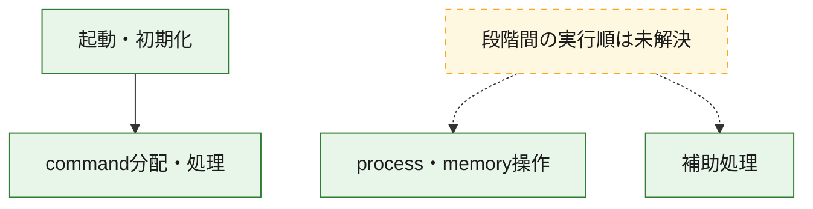
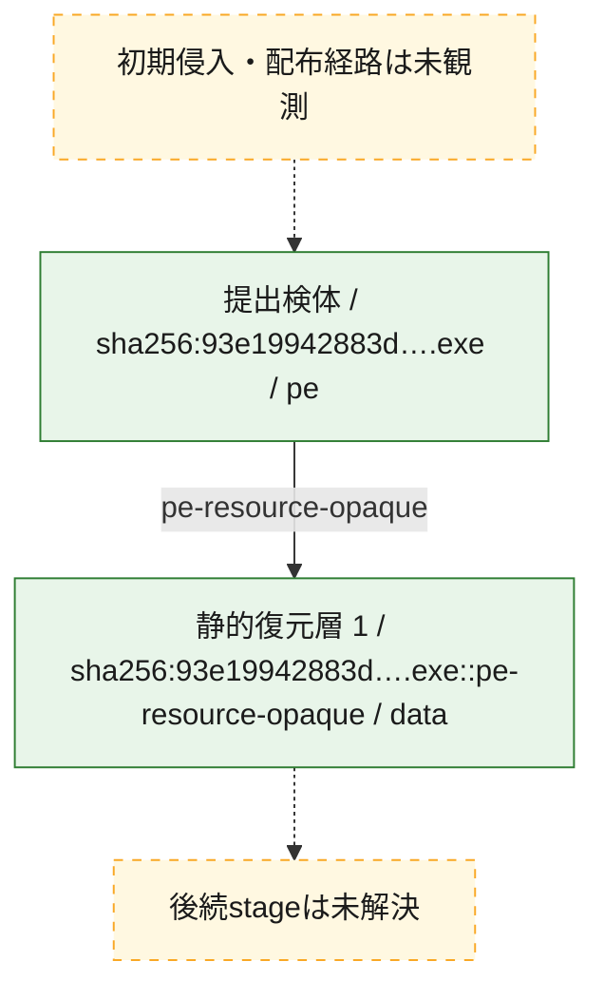
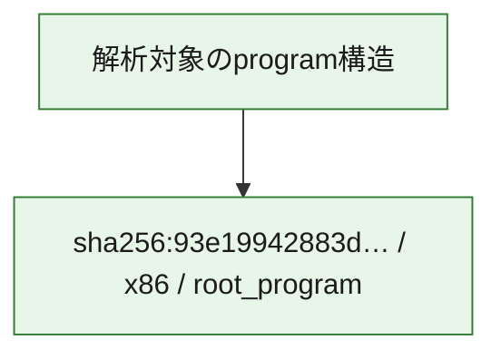

# 全体ロジック：93e19942883dfdbcf8eb4d2cec12ee758490114fc20d90dc86c601323a49d644

代表関数の静的証跡から、起動・初期化、process・memory操作、command分配・処理の処理群を確認しました。

## 読み方

- phaseの掲載順は解析上の整理順です。observed_call_edgesがない段階間の実行順を断定しません。
- 図の実線は静的に観測した関係、点線と黄色のノードは未観測・未解決の関係を示します。
- 図は静的な要約であり、動的実行を再現するものではありません。
- 詳細な関数解説とfingerprintは[STATIC-LOGIC.md](STATIC-LOGIC.md)を参照してください。

## 静的可視化

### 実行フロー

### 感染チェーン

### モジュール関係

## 処理段階

### 1. 起動・初期化

entry pointから初期化と後続処理への移行を確認します。
確度: `confirmed_static_function_evidence`

- `93e19942883dfdbcf8eb4d2cec12ee758490114fc20d90dc86c601323a49d644:ghidra:140005490` — 初期化と主要処理への分岐を行う入口関数です。 状態: `succeeded`、選定理由: `entry_point`, `meaningful_symbol_name`, `reviewed_call_centrality:21`, `role:entrypoint`

### 2. process・memory操作

process、thread、module、memory操作と実行移行を確認します。
確度: `confirmed_static_function_evidence`

- `93e19942883dfdbcf8eb4d2cec12ee758490114fc20d90dc86c601323a49d644:ghidra:140003474` — process、thread、module、またはmemory操作に関係する関数です。 状態: `succeeded`、選定理由: `context_representative`, `reviewed_call_centrality:13`, `role:process_or_memory_operation`

### 3. command分配・処理

受信commandやtaskの解釈、分配、個別handlerへの移行を確認します。
確度: `confirmed_static_function_evidence_with_limits`

- `93e19942883dfdbcf8eb4d2cec12ee758490114fc20d90dc86c601323a49d644:ghidra:140013760` — commandの解釈、分配、または個別処理を担当する関数です。 状態: `limited_bad_instruction_or_flow`、選定理由: `meaningful_symbol_name`, `reviewed_call_centrality:1`, `role:command_dispatch_or_handler`

### 4. 補助処理

主要処理を支える一般内部関数またはlibrary処理を確認します。
確度: `confirmed_static_function_evidence`

- `93e19942883dfdbcf8eb4d2cec12ee758490114fc20d90dc86c601323a49d644:ghidra:140001020` — 検体内部の一般処理を実装する関数です。 状態: `succeeded`、選定理由: `context_representative`, `reviewed_call_centrality:1`
- `93e19942883dfdbcf8eb4d2cec12ee758490114fc20d90dc86c601323a49d644:ghidra:140001054` — 検体内部の一般処理を実装する関数です。 状態: `succeeded`、選定理由: `context_representative`, `reviewed_call_centrality:1`
- `93e19942883dfdbcf8eb4d2cec12ee758490114fc20d90dc86c601323a49d644:ghidra:14000106c` — 検体内部の一般処理を実装する関数です。 状態: `succeeded`、選定理由: `context_representative`, `reviewed_call_centrality:6`
- `93e19942883dfdbcf8eb4d2cec12ee758490114fc20d90dc86c601323a49d644:ghidra:1400010a8` — 検体内部の一般処理を実装する関数です。 状態: `succeeded`、選定理由: `context_representative`, `reviewed_call_centrality:5`
- `93e19942883dfdbcf8eb4d2cec12ee758490114fc20d90dc86c601323a49d644:ghidra:140001168` — 検体内部の一般処理を実装する関数です。 状態: `succeeded`、選定理由: `context_representative`, `reviewed_call_centrality:5`
- `93e19942883dfdbcf8eb4d2cec12ee758490114fc20d90dc86c601323a49d644:ghidra:140001240` — 検体内部の一般処理を実装する関数です。 状態: `succeeded`、選定理由: `context_representative`, `reviewed_call_centrality:1`
- `93e19942883dfdbcf8eb4d2cec12ee758490114fc20d90dc86c601323a49d644:ghidra:14000126c` — 検体内部の一般処理を実装する関数です。 状態: `succeeded`、選定理由: `context_representative`, `reviewed_call_centrality:9`
- `93e19942883dfdbcf8eb4d2cec12ee758490114fc20d90dc86c601323a49d644:ghidra:1400014b0` — 検体内部の一般処理を実装する関数です。 状態: `succeeded`、選定理由: `context_representative`, `reviewed_call_centrality:1`
- `93e19942883dfdbcf8eb4d2cec12ee758490114fc20d90dc86c601323a49d644:ghidra:1400014e4` — 検体内部の一般処理を実装する関数です。 状態: `succeeded`、選定理由: `context_representative`, `reviewed_call_centrality:1`
- `93e19942883dfdbcf8eb4d2cec12ee758490114fc20d90dc86c601323a49d644:ghidra:140001520` — 検体内部の一般処理を実装する関数です。 状態: `succeeded`、選定理由: `context_representative`, `reviewed_call_centrality:1`
- `93e19942883dfdbcf8eb4d2cec12ee758490114fc20d90dc86c601323a49d644:ghidra:140001580` — 検体内部の一般処理を実装する関数です。 状態: `succeeded`、選定理由: `context_representative`, `reviewed_call_centrality:1`
- `93e19942883dfdbcf8eb4d2cec12ee758490114fc20d90dc86c601323a49d644:ghidra:1400015b4` — 検体内部の一般処理を実装する関数です。 状態: `succeeded`、選定理由: `context_representative`, `reviewed_call_centrality:1`
- `93e19942883dfdbcf8eb4d2cec12ee758490114fc20d90dc86c601323a49d644:ghidra:1400015f4` — 検体内部の一般処理を実装する関数です。 状態: `succeeded`、選定理由: `context_representative`, `reviewed_call_centrality:1`
- `93e19942883dfdbcf8eb4d2cec12ee758490114fc20d90dc86c601323a49d644:ghidra:140001690` — 検体内部の一般処理を実装する関数です。 状態: `succeeded`、選定理由: `context_representative`, `reviewed_call_centrality:2`
- `93e19942883dfdbcf8eb4d2cec12ee758490114fc20d90dc86c601323a49d644:ghidra:1400016d4` — 検体内部の一般処理を実装する関数です。 状態: `succeeded`、選定理由: `context_representative`, `reviewed_call_centrality:2`
- `93e19942883dfdbcf8eb4d2cec12ee758490114fc20d90dc86c601323a49d644:ghidra:140001750` — 検体内部の一般処理を実装する関数です。 状態: `succeeded`、選定理由: `context_representative`, `reviewed_call_centrality:2`
- `93e19942883dfdbcf8eb4d2cec12ee758490114fc20d90dc86c601323a49d644:ghidra:1400017f4` — 検体内部の一般処理を実装する関数です。 状態: `succeeded`、選定理由: `context_representative`, `reviewed_call_centrality:1`
- `93e19942883dfdbcf8eb4d2cec12ee758490114fc20d90dc86c601323a49d644:ghidra:140002dfc` — 検体内部の一般処理を実装する関数です。 状態: `succeeded`、選定理由: `context_representative`, `reviewed_call_centrality:1`
- `93e19942883dfdbcf8eb4d2cec12ee758490114fc20d90dc86c601323a49d644:ghidra:140002e48` — 検体内部の一般処理を実装する関数です。 状態: `succeeded`、選定理由: `context_representative`
- `93e19942883dfdbcf8eb4d2cec12ee758490114fc20d90dc86c601323a49d644:ghidra:1400033f8` — 検体内部の一般処理を実装する関数です。 状態: `succeeded`、選定理由: `context_representative`, `reviewed_call_centrality:1`
- `93e19942883dfdbcf8eb4d2cec12ee758490114fc20d90dc86c601323a49d644:ghidra:1400036a0` — 検体内部の一般処理を実装する関数です。 状態: `succeeded`、選定理由: `context_representative`, `reviewed_call_centrality:4`
- `93e19942883dfdbcf8eb4d2cec12ee758490114fc20d90dc86c601323a49d644:ghidra:1400036c0` — 検体内部の一般処理を実装する関数です。 状態: `succeeded`、選定理由: `context_representative`, `reviewed_call_centrality:3`
- `93e19942883dfdbcf8eb4d2cec12ee758490114fc20d90dc86c601323a49d644:ghidra:1400036d4` — 検体内部の一般処理を実装する関数です。 状態: `succeeded`、選定理由: `context_representative`, `reviewed_call_centrality:4`
- `93e19942883dfdbcf8eb4d2cec12ee758490114fc20d90dc86c601323a49d644:ghidra:1400036e8` — 検体内部の一般処理を実装する関数です。 状態: `succeeded`、選定理由: `context_representative`, `reviewed_call_centrality:8`
- `93e19942883dfdbcf8eb4d2cec12ee758490114fc20d90dc86c601323a49d644:ghidra:1400038c8` — 検体内部の一般処理を実装する関数です。 状態: `succeeded`、選定理由: `context_representative`, `reviewed_call_centrality:3`
- `93e19942883dfdbcf8eb4d2cec12ee758490114fc20d90dc86c601323a49d644:ghidra:140003940` — 検体内部の一般処理を実装する関数です。 状態: `succeeded`、選定理由: `context_representative`, `reviewed_call_centrality:4`
- `93e19942883dfdbcf8eb4d2cec12ee758490114fc20d90dc86c601323a49d644:ghidra:140003abc` — 検体内部の一般処理を実装する関数です。 状態: `succeeded`、選定理由: `context_representative`, `reviewed_call_centrality:2`
- `93e19942883dfdbcf8eb4d2cec12ee758490114fc20d90dc86c601323a49d644:ghidra:140003ad8` — 検体内部の一般処理を実装する関数です。 状態: `succeeded`、選定理由: `context_representative`, `reviewed_call_centrality:6`
- `93e19942883dfdbcf8eb4d2cec12ee758490114fc20d90dc86c601323a49d644:ghidra:140005b00` — 検体内部の一般処理を実装する関数です。 状態: `succeeded`、選定理由: `meaningful_symbol_name`

## 観測したcall関係

- `93e19942883dfdbcf8eb4d2cec12ee758490114fc20d90dc86c601323a49d644:ghidra:14000106c` → `93e19942883dfdbcf8eb4d2cec12ee758490114fc20d90dc86c601323a49d644:ghidra:1400036a0` （`support` → `support`）
- `93e19942883dfdbcf8eb4d2cec12ee758490114fc20d90dc86c601323a49d644:ghidra:1400010a8` → `93e19942883dfdbcf8eb4d2cec12ee758490114fc20d90dc86c601323a49d644:ghidra:14000106c` （`support` → `support`）
- `93e19942883dfdbcf8eb4d2cec12ee758490114fc20d90dc86c601323a49d644:ghidra:1400010a8` → `93e19942883dfdbcf8eb4d2cec12ee758490114fc20d90dc86c601323a49d644:ghidra:1400036c0` （`support` → `support`）
- `93e19942883dfdbcf8eb4d2cec12ee758490114fc20d90dc86c601323a49d644:ghidra:140001168` → `93e19942883dfdbcf8eb4d2cec12ee758490114fc20d90dc86c601323a49d644:ghidra:14000106c` （`support` → `support`）
- `93e19942883dfdbcf8eb4d2cec12ee758490114fc20d90dc86c601323a49d644:ghidra:140001168` → `93e19942883dfdbcf8eb4d2cec12ee758490114fc20d90dc86c601323a49d644:ghidra:1400036d4` （`support` → `support`）
- `93e19942883dfdbcf8eb4d2cec12ee758490114fc20d90dc86c601323a49d644:ghidra:14000126c` → `93e19942883dfdbcf8eb4d2cec12ee758490114fc20d90dc86c601323a49d644:ghidra:14000106c` （`support` → `support`）
- `93e19942883dfdbcf8eb4d2cec12ee758490114fc20d90dc86c601323a49d644:ghidra:14000126c` → `93e19942883dfdbcf8eb4d2cec12ee758490114fc20d90dc86c601323a49d644:ghidra:1400036d4` （`support` → `support`）
- `93e19942883dfdbcf8eb4d2cec12ee758490114fc20d90dc86c601323a49d644:ghidra:1400015f4` → `93e19942883dfdbcf8eb4d2cec12ee758490114fc20d90dc86c601323a49d644:ghidra:1400038c8` （`support` → `support`）
- `93e19942883dfdbcf8eb4d2cec12ee758490114fc20d90dc86c601323a49d644:ghidra:140001750` → `93e19942883dfdbcf8eb4d2cec12ee758490114fc20d90dc86c601323a49d644:ghidra:1400017f4` （`support` → `support`）
- `93e19942883dfdbcf8eb4d2cec12ee758490114fc20d90dc86c601323a49d644:ghidra:140001750` → `93e19942883dfdbcf8eb4d2cec12ee758490114fc20d90dc86c601323a49d644:ghidra:1400033f8` （`support` → `support`）
- `93e19942883dfdbcf8eb4d2cec12ee758490114fc20d90dc86c601323a49d644:ghidra:1400036e8` → `93e19942883dfdbcf8eb4d2cec12ee758490114fc20d90dc86c601323a49d644:ghidra:14000126c` （`support` → `support`）
- `93e19942883dfdbcf8eb4d2cec12ee758490114fc20d90dc86c601323a49d644:ghidra:1400036e8` → `93e19942883dfdbcf8eb4d2cec12ee758490114fc20d90dc86c601323a49d644:ghidra:140003ad8` （`support` → `support`）
- `93e19942883dfdbcf8eb4d2cec12ee758490114fc20d90dc86c601323a49d644:ghidra:140003ad8` → `93e19942883dfdbcf8eb4d2cec12ee758490114fc20d90dc86c601323a49d644:ghidra:1400016d4` （`support` → `support`）
- `93e19942883dfdbcf8eb4d2cec12ee758490114fc20d90dc86c601323a49d644:ghidra:140003ad8` → `93e19942883dfdbcf8eb4d2cec12ee758490114fc20d90dc86c601323a49d644:ghidra:140002dfc` （`support` → `support`）
- `93e19942883dfdbcf8eb4d2cec12ee758490114fc20d90dc86c601323a49d644:ghidra:140005490` → `93e19942883dfdbcf8eb4d2cec12ee758490114fc20d90dc86c601323a49d644:ghidra:140013760` （`startup` → `dispatch`）
- `ghidra-function:004ed752fe6eb12971376e37` → `ghidra-function:03c1bd5946a824fedd2a51c2` （`unclassified` → `unclassified`）
- `ghidra-function:0a5e1217fc35ff4070729b8a` → `ghidra-external:1f4ae4f49b79785e10db599c` （`unclassified` → `unclassified`）
- `ghidra-function:0a5e1217fc35ff4070729b8a` → `ghidra-external:6795cfc3d509546555cea3d0` （`unclassified` → `unclassified`）
- `ghidra-function:0a5e1217fc35ff4070729b8a` → `ghidra-external:9e4d5a0e9b5f5fef2c392eba` （`unclassified` → `unclassified`）
- `ghidra-function:0a5e1217fc35ff4070729b8a` → `ghidra-function:15088610ee8b446a0a8d9f39` （`unclassified` → `unclassified`）
- `ghidra-function:1bb692d6773bc4a8f0823cb7` → `ghidra-external:7a15b8e601b176a49c07d49f` （`unclassified` → `unclassified`）
- `ghidra-function:1bb692d6773bc4a8f0823cb7` → `ghidra-external:b371d1e86752a66d69734eb2` （`unclassified` → `unclassified`）
- `ghidra-function:1bb692d6773bc4a8f0823cb7` → `ghidra-function:0f1c45fbb73ea87afce255f6` （`unclassified` → `unclassified`）
- `ghidra-function:1bb692d6773bc4a8f0823cb7` → `ghidra-function:88d8594d835adbd9b7adfdbd` （`unclassified` → `unclassified`）
- `ghidra-function:1bb692d6773bc4a8f0823cb7` → `ghidra-function:d7fdd01ad33ae0ad292d3075` （`unclassified` → `unclassified`）
- `ghidra-function:24c9a067655c5526cc04431a` → `ghidra-external:1b4d69a064d19ae59c68f699` （`unclassified` → `unclassified`）
- `ghidra-function:3221b7849f1e0fa3d50c4aa6` → `ghidra-external:b371d1e86752a66d69734eb2` （`unclassified` → `unclassified`）
- `ghidra-function:3221b7849f1e0fa3d50c4aa6` → `ghidra-function:0f1c45fbb73ea87afce255f6` （`unclassified` → `unclassified`）
- `ghidra-function:3221b7849f1e0fa3d50c4aa6` → `ghidra-function:5b2524782cad10c17982183a` （`unclassified` → `unclassified`）
- `ghidra-function:3221b7849f1e0fa3d50c4aa6` → `ghidra-function:b9253b15851073a694c3ea11` （`unclassified` → `unclassified`）
- `ghidra-function:3221b7849f1e0fa3d50c4aa6` → `ghidra-function:d7fdd01ad33ae0ad292d3075` （`unclassified` → `unclassified`）
- `ghidra-function:3e9f51af331d8ffa8e5b4df7` → `ghidra-function:14c06785179faadd7a338482` （`unclassified` → `unclassified`）
- `ghidra-function:3e9f51af331d8ffa8e5b4df7` → `ghidra-function:29798803cd4637e8813b4c3c` （`unclassified` → `unclassified`）
- `ghidra-function:3e9f51af331d8ffa8e5b4df7` → `ghidra-function:55881f7fec72236a824b8322` （`unclassified` → `unclassified`）
- `ghidra-function:3e9f51af331d8ffa8e5b4df7` → `ghidra-function:982dcbbfe8e478b1f3dce7e4` （`unclassified` → `unclassified`）
- `ghidra-function:3e9f51af331d8ffa8e5b4df7` → `ghidra-function:b9253b15851073a694c3ea11` （`unclassified` → `unclassified`）
- `ghidra-function:3e9f51af331d8ffa8e5b4df7` → `ghidra-function:ba3f6b57f81a08572d939d91` （`unclassified` → `unclassified`）
- `ghidra-function:3e9f51af331d8ffa8e5b4df7` → `ghidra-function:f642bb260a92db6f9ab6c1df` （`unclassified` → `unclassified`）
- `ghidra-function:5b2524782cad10c17982183a` → `ghidra-external:b371d1e86752a66d69734eb2` （`unclassified` → `unclassified`）
- `ghidra-function:5b2524782cad10c17982183a` → `ghidra-function:f63dbdd471a366157a91cf94` （`unclassified` → `unclassified`）
- `ghidra-function:5f63713afecf3c0edd63014f` → `ghidra-function:79e9485ee457c4ffa9beb869` （`unclassified` → `unclassified`）
- `ghidra-function:79e9485ee457c4ffa9beb869` → `ghidra-external:423abe3149d5dbfb60750711` （`unclassified` → `unclassified`）
- `ghidra-function:79e9485ee457c4ffa9beb869` → `ghidra-function:f9618dbfee93ee3dcfbe3054` （`unclassified` → `unclassified`）
- `ghidra-function:7c46e17c6628aa31ae152f50` → `ghidra-function:b9253b15851073a694c3ea11` （`unclassified` → `unclassified`）
- `ghidra-function:88d8594d835adbd9b7adfdbd` → `ghidra-external:b371d1e86752a66d69734eb2` （`unclassified` → `unclassified`）
- `ghidra-function:88d8594d835adbd9b7adfdbd` → `ghidra-function:f63dbdd471a366157a91cf94` （`unclassified` → `unclassified`）
- `ghidra-function:8bfc57c12ab53221434f5204` → `ghidra-external:00378606aeacc3ff9e3ef6a0` （`unclassified` → `unclassified`）
- `ghidra-function:8bfc57c12ab53221434f5204` → `ghidra-external:4b8c763c8d54bf25297d55af` （`unclassified` → `unclassified`）
- `ghidra-function:8bfc57c12ab53221434f5204` → `ghidra-external:9a453123f035a948e28739e8` （`unclassified` → `unclassified`）
- `ghidra-function:8bfc57c12ab53221434f5204` → `ghidra-external:b371d1e86752a66d69734eb2` （`unclassified` → `unclassified`）
- `ghidra-function:8bfc57c12ab53221434f5204` → `ghidra-external:cfb7d26083f9a2ca5b81323c` （`unclassified` → `unclassified`）
- `ghidra-function:8bfc57c12ab53221434f5204` → `ghidra-external:f9c93bdfc947bfb3a092a4aa` （`unclassified` → `unclassified`）
- `ghidra-function:8bfc57c12ab53221434f5204` → `ghidra-external:fecbbc52a8aefbc01802a9d5` （`unclassified` → `unclassified`）
- `ghidra-function:8bfc57c12ab53221434f5204` → `ghidra-function:0e9b1b7af0f72f460fe8212b` （`unclassified` → `unclassified`）
- `ghidra-function:8bfc57c12ab53221434f5204` → `ghidra-function:194d6cd6e1dc1760b0ccb2ef` （`unclassified` → `unclassified`）
- `ghidra-function:8bfc57c12ab53221434f5204` → `ghidra-function:2be243359249bd71745ebdea` （`unclassified` → `unclassified`）
- `ghidra-function:8bfc57c12ab53221434f5204` → `ghidra-function:3d330038ec79b75b14877ccd` （`unclassified` → `unclassified`）
- `ghidra-function:8bfc57c12ab53221434f5204` → `ghidra-function:4370efd4c1eeb09ec3c037e7` （`unclassified` → `unclassified`）
- `ghidra-function:8bfc57c12ab53221434f5204` → `ghidra-function:587582f14801839cb5acd9b7` （`unclassified` → `unclassified`）
- `ghidra-function:8bfc57c12ab53221434f5204` → `ghidra-function:63cbf98a554b97ee8573b42a` （`unclassified` → `unclassified`）
- `ghidra-function:8bfc57c12ab53221434f5204` → `ghidra-function:686a60fe0fd4fd92123ff108` （`unclassified` → `unclassified`）
- `ghidra-function:8bfc57c12ab53221434f5204` → `ghidra-function:81a95c23e448e51f262536c9` （`unclassified` → `unclassified`）
- `ghidra-function:8bfc57c12ab53221434f5204` → `ghidra-function:a94519112b134a1aceb06b0c` （`unclassified` → `unclassified`）
- `ghidra-function:8bfc57c12ab53221434f5204` → `ghidra-function:b9b5624f6653f38b04def2ce` （`unclassified` → `unclassified`）
- `ghidra-function:8bfc57c12ab53221434f5204` → `ghidra-function:bc15471f8a7a51e3cce6fab4` （`unclassified` → `unclassified`）
- `ghidra-function:8bfc57c12ab53221434f5204` → `ghidra-function:e379464e555dbe113226443e` （`unclassified` → `unclassified`）
- `ghidra-function:8bfc57c12ab53221434f5204` → `ghidra-function:f40355ed5f4deb6c629eb24d` （`unclassified` → `unclassified`）
- `ghidra-function:914753565d1fdb901eae5521` → `ghidra-external:4d7add70eb89d6efe38f667a` （`unclassified` → `unclassified`）
- `ghidra-function:914753565d1fdb901eae5521` → `ghidra-external:51da74e8475299b57c8dbc4d` （`unclassified` → `unclassified`）
- `ghidra-function:914753565d1fdb901eae5521` → `ghidra-external:7a15b8e601b176a49c07d49f` （`unclassified` → `unclassified`）
- `ghidra-function:914753565d1fdb901eae5521` → `ghidra-external:b371d1e86752a66d69734eb2` （`unclassified` → `unclassified`）
- `ghidra-function:914753565d1fdb901eae5521` → `ghidra-external:fc538cbac55e442c4c9711b3` （`unclassified` → `unclassified`）
- `ghidra-function:914753565d1fdb901eae5521` → `ghidra-function:0f1c45fbb73ea87afce255f6` （`unclassified` → `unclassified`）
- `ghidra-function:914753565d1fdb901eae5521` → `ghidra-function:88d8594d835adbd9b7adfdbd` （`unclassified` → `unclassified`）
- `ghidra-function:914753565d1fdb901eae5521` → `ghidra-function:d7fdd01ad33ae0ad292d3075` （`unclassified` → `unclassified`）
- `ghidra-function:963cc7f575f3f995dfae5446` → `ghidra-external:7e82304d20f1bf8c20d7534a` （`unclassified` → `unclassified`）
- `ghidra-function:9979bd4c9ff0da31ee4177b9` → `ghidra-function:4e9146d0a6ef7e7bb2604a26` （`unclassified` → `unclassified`）
- `ghidra-function:9979bd4c9ff0da31ee4177b9` → `ghidra-function:da09997e28f8a99a46cf9e9f` （`unclassified` → `unclassified`）
- `ghidra-function:9b22e567280dece087d3bd7a` → `ghidra-function:6b48fe268c93414efcce46df` （`unclassified` → `unclassified`）
- `ghidra-function:a139f3b822ff154b1eca5c2f` → `ghidra-external:7a15b8e601b176a49c07d49f` （`unclassified` → `unclassified`）
- `ghidra-function:af073782b43e6afedfdb868f` → `ghidra-external:2ec27b7525caa2bd68dfc7dd` （`unclassified` → `unclassified`）
- `ghidra-function:af073782b43e6afedfdb868f` → `ghidra-external:b6f0b801598ad619d0e74a3c` （`unclassified` → `unclassified`）
- `ghidra-function:af073782b43e6afedfdb868f` → `ghidra-function:004ed752fe6eb12971376e37` （`unclassified` → `unclassified`）
- `ghidra-function:af073782b43e6afedfdb868f` → `ghidra-function:03c1bd5946a824fedd2a51c2` （`unclassified` → `unclassified`）
- `ghidra-function:af073782b43e6afedfdb868f` → `ghidra-function:8712d27eab9abac5c94d5256` （`unclassified` → `unclassified`）
- `ghidra-function:bb13ce86fc158d52450b46af` → `ghidra-function:6b48fe268c93414efcce46df` （`unclassified` → `unclassified`）
- `ghidra-function:bc2b2171830015ff3ebc1fac` → `ghidra-external:071c4ce827f96e516787d3e3` （`unclassified` → `unclassified`）
- `ghidra-function:bc2b2171830015ff3ebc1fac` → `ghidra-external:44ec6417d9dc2c9e77f17bb5` （`unclassified` → `unclassified`）
- `ghidra-function:bc2b2171830015ff3ebc1fac` → `ghidra-external:51da74e8475299b57c8dbc4d` （`unclassified` → `unclassified`）
- `ghidra-function:bc2b2171830015ff3ebc1fac` → `ghidra-function:15088610ee8b446a0a8d9f39` （`unclassified` → `unclassified`）
- `ghidra-function:bc2b2171830015ff3ebc1fac` → `ghidra-function:340683ebc782c12d23762bff` （`unclassified` → `unclassified`）
- `ghidra-function:bc2b2171830015ff3ebc1fac` → `ghidra-function:914753565d1fdb901eae5521` （`unclassified` → `unclassified`）
- `ghidra-function:bc2b2171830015ff3ebc1fac` → `ghidra-function:af073782b43e6afedfdb868f` （`unclassified` → `unclassified`）
- `ghidra-function:bc2b2171830015ff3ebc1fac` → `ghidra-function:bef406464da4be1bdd61cb37` （`unclassified` → `unclassified`）
- `ghidra-function:c1cd327a6bc4b394c4586d36` → `ghidra-external:51da74e8475299b57c8dbc4d` （`unclassified` → `unclassified`）
- `ghidra-function:c1cd327a6bc4b394c4586d36` → `ghidra-function:b7d7087d40fcb7c28afeb7ef` （`unclassified` → `unclassified`）
- `ghidra-function:caf39f0b47b4a971aeedd21d` → `ghidra-function:52166d2f4af2589814268236` （`unclassified` → `unclassified`）
- `ghidra-function:d0d3af4b75897e22b88e909f` → `ghidra-function:6b48fe268c93414efcce46df` （`unclassified` → `unclassified`）
- `ghidra-function:d7fdd01ad33ae0ad292d3075` → `ghidra-external:b371d1e86752a66d69734eb2` （`unclassified` → `unclassified`）
- `ghidra-function:d7fdd01ad33ae0ad292d3075` → `ghidra-function:0f1c45fbb73ea87afce255f6` （`unclassified` → `unclassified`）
- `ghidra-function:d7fdd01ad33ae0ad292d3075` → `ghidra-function:fa4304d8896ce420474326a6` （`unclassified` → `unclassified`）
- `ghidra-function:dc654b9b2a93c70015d09b26` → `ghidra-external:51da74e8475299b57c8dbc4d` （`unclassified` → `unclassified`）
- `ghidra-function:fa4304d8896ce420474326a6` → `ghidra-external:b371d1e86752a66d69734eb2` （`unclassified` → `unclassified`）
- `ghidra-function:fa4304d8896ce420474326a6` → `ghidra-external:c0e83ec010b77b36f3174e9b` （`unclassified` → `unclassified`）
- `ghidra-function:fa4304d8896ce420474326a6` → `ghidra-function:2ed4080b305fea18c1dcf40a` （`unclassified` → `unclassified`）

## 解析範囲と制約

- 選定外関数は全体inventoryへ残しますが、関数本体の個別解説対象にはしていません。
- indirect call、難読化、packer、VM、壊れたcontrol flowによりcall関係が欠落する場合があります。
- 文書は静的解析に基づき、検体実行や外部通信による動的確認は行っていません。
