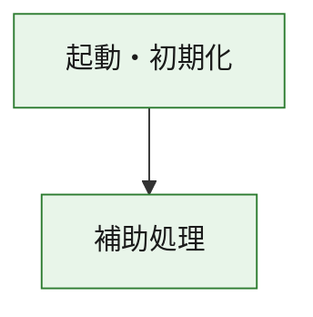
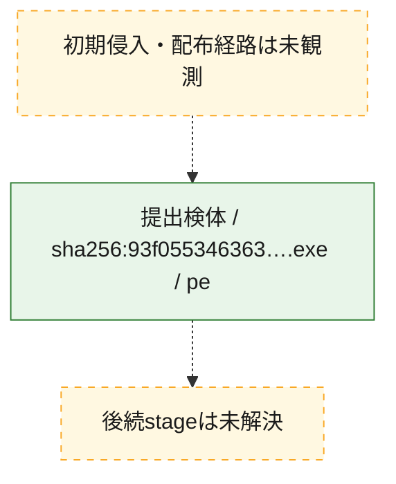
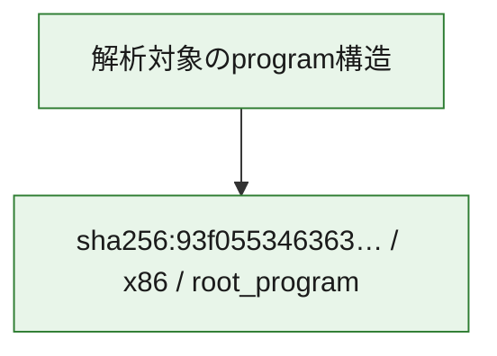

# 全体ロジック：93f055346363444efdc88f54190ba7c0e7aed67bd80c5029728cb4362700cc7a

代表関数の静的証跡から、起動・初期化の処理群を確認しました。

## 読み方

- phaseの掲載順は解析上の整理順です。observed_call_edgesがない段階間の実行順を断定しません。
- 図の実線は静的に観測した関係、点線と黄色のノードは未観測・未解決の関係を示します。
- 図は静的な要約であり、動的実行を再現するものではありません。
- 詳細な関数解説とfingerprintは[STATIC-LOGIC.md](STATIC-LOGIC.md)を参照してください。

## 静的可視化

### 実行フロー

### 感染チェーン

### モジュール関係

## 処理段階

### 1. 起動・初期化

entry pointから初期化と後続処理への移行を確認します。
確度: `confirmed_static_function_evidence`

- `93f055346363444efdc88f54190ba7c0e7aed67bd80c5029728cb4362700cc7a:ghidra:180001010` — 初期化と主要処理への分岐を行う入口関数です。 状態: `succeeded`、選定理由: `entry_point`, `meaningful_symbol_name`, `reviewed_call_centrality:22`, `role:entrypoint`, `small_program_complete_context`

### 2. 補助処理

主要処理を支える一般内部関数またはlibrary処理を確認します。
確度: `confirmed_static_function_evidence`

- `93f055346363444efdc88f54190ba7c0e7aed67bd80c5029728cb4362700cc7a:ghidra:180001240` — 検体内部の一般処理を実装する関数です。 状態: `succeeded`、選定理由: `context_representative`, `reviewed_call_centrality:2`, `small_program_complete_context`
- `93f055346363444efdc88f54190ba7c0e7aed67bd80c5029728cb4362700cc7a:ghidra:180001350` — 検体内部の一般処理を実装する関数です。 状態: `succeeded`、選定理由: `context_representative`, `reviewed_call_centrality:25`, `small_program_complete_context`
- `93f055346363444efdc88f54190ba7c0e7aed67bd80c5029728cb4362700cc7a:ghidra:180003780` — 検体内部の一般処理を実装する関数です。 状態: `succeeded`、選定理由: `context_representative`, `reviewed_call_centrality:2`, `small_program_complete_context`
- `93f055346363444efdc88f54190ba7c0e7aed67bd80c5029728cb4362700cc7a:ghidra:1800038e0` — 検体内部の一般処理を実装する関数です。 状態: `succeeded`、選定理由: `context_representative`, `reviewed_call_centrality:2`, `small_program_complete_context`

## 観測したcall関係

- `93f055346363444efdc88f54190ba7c0e7aed67bd80c5029728cb4362700cc7a:ghidra:180001010` → `93f055346363444efdc88f54190ba7c0e7aed67bd80c5029728cb4362700cc7a:ghidra:180001240` （`startup` → `support`）
- `93f055346363444efdc88f54190ba7c0e7aed67bd80c5029728cb4362700cc7a:ghidra:180001010` → `93f055346363444efdc88f54190ba7c0e7aed67bd80c5029728cb4362700cc7a:ghidra:180001350` （`startup` → `support`）
- `93f055346363444efdc88f54190ba7c0e7aed67bd80c5029728cb4362700cc7a:ghidra:180001350` → `93f055346363444efdc88f54190ba7c0e7aed67bd80c5029728cb4362700cc7a:ghidra:180001240` （`support` → `support`）
- `93f055346363444efdc88f54190ba7c0e7aed67bd80c5029728cb4362700cc7a:ghidra:180001350` → `93f055346363444efdc88f54190ba7c0e7aed67bd80c5029728cb4362700cc7a:ghidra:180003780` （`support` → `support`）
- `93f055346363444efdc88f54190ba7c0e7aed67bd80c5029728cb4362700cc7a:ghidra:180001350` → `93f055346363444efdc88f54190ba7c0e7aed67bd80c5029728cb4362700cc7a:ghidra:1800038e0` （`support` → `support`）
- `93f055346363444efdc88f54190ba7c0e7aed67bd80c5029728cb4362700cc7a:ghidra:180003780` → `93f055346363444efdc88f54190ba7c0e7aed67bd80c5029728cb4362700cc7a:ghidra:1800038e0` （`support` → `support`）
- `ghidra-function:37bec48c819467f21a5d4553` → `ghidra-external:0879a522279e6b6c406af6f6` （`unclassified` → `unclassified`）
- `ghidra-function:37bec48c819467f21a5d4553` → `ghidra-external:1e5baf305db1384d33034d9f` （`unclassified` → `unclassified`）
- `ghidra-function:37bec48c819467f21a5d4553` → `ghidra-external:209f965ee4dbc76eff7c0fc3` （`unclassified` → `unclassified`）
- `ghidra-function:37bec48c819467f21a5d4553` → `ghidra-external:2289bf0d4521e78f8180609e` （`unclassified` → `unclassified`）
- `ghidra-function:37bec48c819467f21a5d4553` → `ghidra-external:2719f0ecaf1eba1f6813b779` （`unclassified` → `unclassified`）
- `ghidra-function:37bec48c819467f21a5d4553` → `ghidra-external:2aa5323b9bda5a0bfaff8817` （`unclassified` → `unclassified`）
- `ghidra-function:37bec48c819467f21a5d4553` → `ghidra-external:2aac8fca6b2be0a8ad0890e6` （`unclassified` → `unclassified`）
- `ghidra-function:37bec48c819467f21a5d4553` → `ghidra-external:3b769ebdf58fb85e761cd7f9` （`unclassified` → `unclassified`）
- `ghidra-function:37bec48c819467f21a5d4553` → `ghidra-external:467a5c0b38042aeeaf14df97` （`unclassified` → `unclassified`）
- `ghidra-function:37bec48c819467f21a5d4553` → `ghidra-external:5b67d441c537c1c7062b5282` （`unclassified` → `unclassified`）
- `ghidra-function:37bec48c819467f21a5d4553` → `ghidra-external:6a6078247a07b83c5c48c306` （`unclassified` → `unclassified`）
- `ghidra-function:37bec48c819467f21a5d4553` → `ghidra-external:77d3ca63aa945e1a1546e003` （`unclassified` → `unclassified`）
- `ghidra-function:37bec48c819467f21a5d4553` → `ghidra-external:89c1fb0690b4aa126c4e9826` （`unclassified` → `unclassified`）
- `ghidra-function:37bec48c819467f21a5d4553` → `ghidra-external:a232e9a3b26dd981188e3995` （`unclassified` → `unclassified`）
- `ghidra-function:37bec48c819467f21a5d4553` → `ghidra-external:aa917c88a05624a2cb2d576e` （`unclassified` → `unclassified`）
- `ghidra-function:37bec48c819467f21a5d4553` → `ghidra-external:bb59ef00bd96a3957d679aa2` （`unclassified` → `unclassified`）
- `ghidra-function:37bec48c819467f21a5d4553` → `ghidra-external:c0c569b328dd08f657bf28a9` （`unclassified` → `unclassified`）
- `ghidra-function:37bec48c819467f21a5d4553` → `ghidra-external:c9ba809fd99326fd23cfe20b` （`unclassified` → `unclassified`）
- `ghidra-function:37bec48c819467f21a5d4553` → `ghidra-external:d7bd449031466df237c99142` （`unclassified` → `unclassified`）
- `ghidra-function:37bec48c819467f21a5d4553` → `ghidra-external:e720918adc630c85b31fefe0` （`unclassified` → `unclassified`）
- `ghidra-function:37bec48c819467f21a5d4553` → `ghidra-external:e9da6ddd9755ac12a5f7e552` （`unclassified` → `unclassified`）
- `ghidra-function:37bec48c819467f21a5d4553` → `ghidra-function:23c7098b1327ee45f36d1208` （`unclassified` → `unclassified`）
- `ghidra-function:37bec48c819467f21a5d4553` → `ghidra-function:44fc58e2443a2c17bf986008` （`unclassified` → `unclassified`）
- `ghidra-function:37bec48c819467f21a5d4553` → `ghidra-function:70086fa1253eb7762a0f1c90` （`unclassified` → `unclassified`）
- `ghidra-function:44fc58e2443a2c17bf986008` → `ghidra-function:23c7098b1327ee45f36d1208` （`unclassified` → `unclassified`）
- `ghidra-function:493d3f84a63700ffd8ff72c0` → `ghidra-function:00827dec54576a15b4be048c` （`unclassified` → `unclassified`）
- `ghidra-function:493d3f84a63700ffd8ff72c0` → `ghidra-function:03de84356e30336564948147` （`unclassified` → `unclassified`）
- `ghidra-function:493d3f84a63700ffd8ff72c0` → `ghidra-function:204a6b2bd38ce075e642f30e` （`unclassified` → `unclassified`）
- `ghidra-function:493d3f84a63700ffd8ff72c0` → `ghidra-function:2abbb5987566637c64c0674d` （`unclassified` → `unclassified`）
- `ghidra-function:493d3f84a63700ffd8ff72c0` → `ghidra-function:329e7ddd5ccecedabe6dfbd4` （`unclassified` → `unclassified`）
- `ghidra-function:493d3f84a63700ffd8ff72c0` → `ghidra-function:37bec48c819467f21a5d4553` （`unclassified` → `unclassified`）
- `ghidra-function:493d3f84a63700ffd8ff72c0` → `ghidra-function:498e41161c4255fd656b34b2` （`unclassified` → `unclassified`）
- `ghidra-function:493d3f84a63700ffd8ff72c0` → `ghidra-function:5535ecfdc325fad16c791deb` （`unclassified` → `unclassified`）
- `ghidra-function:493d3f84a63700ffd8ff72c0` → `ghidra-function:70086fa1253eb7762a0f1c90` （`unclassified` → `unclassified`）
- `ghidra-function:493d3f84a63700ffd8ff72c0` → `ghidra-function:79d4c069e73a4be0eaf5d86d` （`unclassified` → `unclassified`）
- `ghidra-function:493d3f84a63700ffd8ff72c0` → `ghidra-function:d02ae089d9a38e4600e635cc` （`unclassified` → `unclassified`）
- `ghidra-function:493d3f84a63700ffd8ff72c0` → `ghidra-function:d11e390c16781b01feebae57` （`unclassified` → `unclassified`）

## 解析範囲と制約

- 選定外関数は全体inventoryへ残しますが、関数本体の個別解説対象にはしていません。
- indirect call、難読化、packer、VM、壊れたcontrol flowによりcall関係が欠落する場合があります。
- 文書は静的解析に基づき、検体実行や外部通信による動的確認は行っていません。
