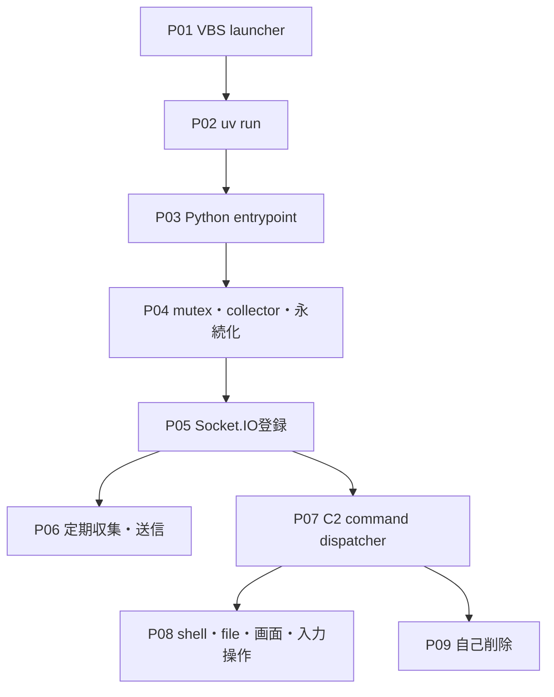
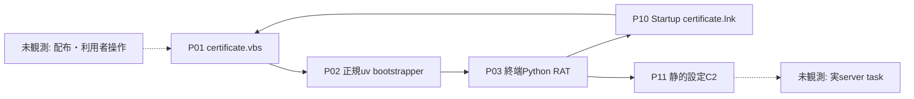
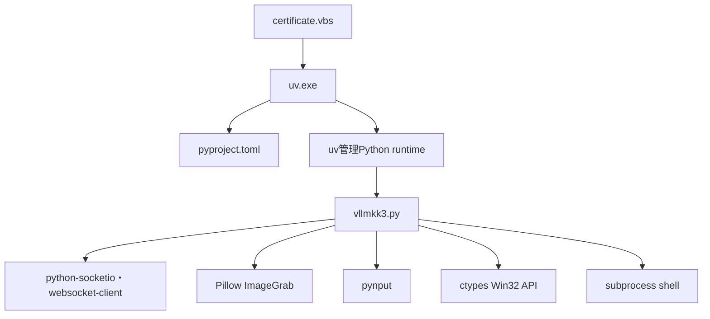

# 全体ロジック

図は静的sourceで確認したcall、event registration、bundle内関係だけを実線で示します。配布経路と実C2 taskは未観測です。

## 静的解析図

### 実行フロー

### 感染チェーン

### モジュール関係

## phase別評価

| phase | 状態 | 根拠 |
|---|---|---|
| P01 launcher | confirmed | VBS全文とcommand line |
| P02 runtime bootstrap | confirmed | `uv run`と`pyproject.toml` |
| P03 terminal payload | confirmed | Python sourceが全command handlerを実装 |
| P04 host initialization | confirmed | mutex、collector、永続化thread |
| P05 C2 registration | confirmed | Base64 URL復号とSocket.IO event |
| P06 periodic collection | confirmed | timer定数とthread loop |
| P07 command dispatch | confirmed | 全decorated receive event |
| P08 command effects | confirmed | Win32、file、subprocess処理 |
| P09 self removal | confirmed | uninstall handlerと一時VBS |
| U00 delivery | not_observed | 提供ZIP以前の経路なし |
| U01 live tasking | not_observed | C2へ接続していない |

## 比較プロファイル

| 軸 | このcase |
|---|---|
| 感染・復元層 | VBS→正規uv→Python source |
| 実行段階 | runtime bootstrap後にsourceを直接実行 |
| module構成 | 単一Python RATとPyPI依存package |
| 通信 | Python Socket.IO、WebSocket固定、event envelopeとbinary screen frame |
| 永続化 | Startup LNKを60秒周期で維持 |
| 能力 | keylogger、screen、input、shell、双方向file、自己削除 |
| code fingerprint | `static-logic.json`の101関数fingerprint |

## 他ケースとの比較

既知RAT一般との機能重複はありますが、現時点で同一ファミリーとする候補はありません。

- ValleyRAT候補は、正規 `uv.exe` 内部PEに対する自動detector反応だけで、終端Python sourceとのコード・設定・protocol一致がありません。
- Joyfill系Socket.IO RATはtransportカテゴリが共通ですが、このcaseとのexact hash、event名集合、配布chain、コードfingerprintの複数軸一致を確認していません。

単一のSocket.IO利用やRAT能力だけではファミリー、campaign、actorを同一視しません。
