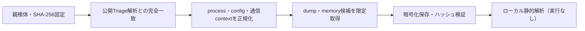

# Triage公開解析・後段取得証跡

## 完全ハッシュ一致

- [260924-y4lr6svyex](https://tria.ge/260924-y4lr6svyex): ファミリー候補 `vshell`、評価score `10`
- [260918-xywvhscc97](https://tria.ge/260918-xywvhscc97): ファミリー候補 `vshell`、評価score `10`

## プロセス・通信

- 観測process: `951ad97fb9095b03cf85689bab67a32c8d22e21f09095fce71d922fdd35578ee.exe, windows_amd64.exe`
- raw commandは保存せず、command SHA-256と処理patternだけをJSONへ保持します。
- sandbox background trafficは`context_only`であり、C2へ自動昇格しません。

- `8.160.179.135`（sandbox config候補）

## 後段取得物

- 取得できませんでした。

## 判定境界

Triage由来のfamily、process、config、通信は外部sandbox証跡です。Config extractorが返したendpointはC2候補として扱いますが、静的設定復元またはprocess帰属とprotocol応答が揃うまでは確認済みC2とはしません。取得成果物と検体は実行していません。
