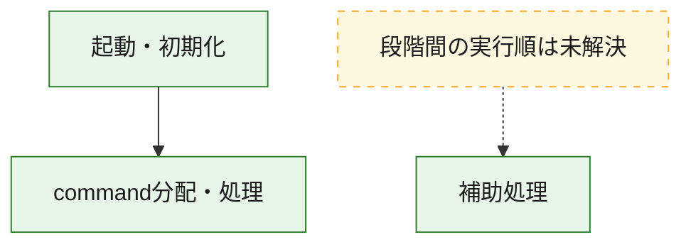
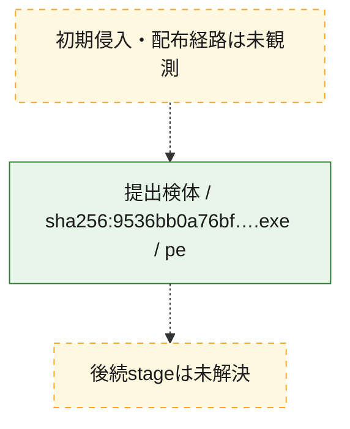
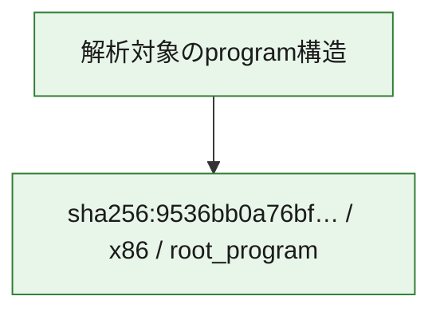

# 全体ロジック：9536bb0a76bf37fdc27861c3f6948a10f5a2c9a7ff1d26c3eb51b5770045d670

代表関数の静的証跡から、起動・初期化、command分配・処理の処理群を確認しました。

## 読み方

- phaseの掲載順は解析上の整理順です。observed_call_edgesがない段階間の実行順を断定しません。
- 図の実線は静的に観測した関係、点線と黄色のノードは未観測・未解決の関係を示します。
- 図は静的な要約であり、動的実行を再現するものではありません。
- 詳細な関数解説とfingerprintは[STATIC-LOGIC.md](STATIC-LOGIC.md)を参照してください。

## 静的可視化

### 実行フロー

### 感染チェーン

### モジュール関係

## 処理段階

### 1. 起動・初期化

entry pointから初期化と後続処理への移行を確認します。
確度: `confirmed_static_function_evidence`

- `9536bb0a76bf37fdc27861c3f6948a10f5a2c9a7ff1d26c3eb51b5770045d670:ghidra:14019b148` — 初期化と主要処理への分岐を行う入口関数です。 状態: `succeeded`、選定理由: `entry_point`, `meaningful_symbol_name`, `reviewed_call_centrality:22`, `role:entrypoint`

### 2. command分配・処理

受信commandやtaskの解釈、分配、個別handlerへの移行を確認します。
確度: `confirmed_static_function_evidence_with_limits`

- `9536bb0a76bf37fdc27861c3f6948a10f5a2c9a7ff1d26c3eb51b5770045d670:ghidra:1401ca460` — commandの解釈、分配、または個別処理を担当する関数です。 状態: `limited_bad_instruction_or_flow`、選定理由: `meaningful_symbol_name`, `reviewed_call_centrality:1`, `role:command_dispatch_or_handler`

### 3. 補助処理

主要処理を支える一般内部関数またはlibrary処理を確認します。
確度: `confirmed_static_function_evidence_with_limits`

- `9536bb0a76bf37fdc27861c3f6948a10f5a2c9a7ff1d26c3eb51b5770045d670:ghidra:140001000` — 検体内部の一般処理を実装する関数です。 状態: `succeeded`、選定理由: `context_representative`, `reviewed_call_centrality:2`
- `9536bb0a76bf37fdc27861c3f6948a10f5a2c9a7ff1d26c3eb51b5770045d670:ghidra:140001060` — 検体内部の一般処理を実装する関数です。 状態: `succeeded`、選定理由: `context_representative`, `reviewed_call_centrality:2`
- `9536bb0a76bf37fdc27861c3f6948a10f5a2c9a7ff1d26c3eb51b5770045d670:ghidra:1400010c0` — 検体内部の一般処理を実装する関数です。 状態: `succeeded`、選定理由: `context_representative`, `reviewed_call_centrality:2`
- `9536bb0a76bf37fdc27861c3f6948a10f5a2c9a7ff1d26c3eb51b5770045d670:ghidra:140001100` — 検体内部の一般処理を実装する関数です。 状態: `succeeded`、選定理由: `context_representative`, `reviewed_call_centrality:2`
- `9536bb0a76bf37fdc27861c3f6948a10f5a2c9a7ff1d26c3eb51b5770045d670:ghidra:140001140` — 検体内部の一般処理を実装する関数です。 状態: `succeeded`、選定理由: `context_representative`, `reviewed_call_centrality:2`
- `9536bb0a76bf37fdc27861c3f6948a10f5a2c9a7ff1d26c3eb51b5770045d670:ghidra:140001180` — 検体内部の一般処理を実装する関数です。 状態: `succeeded`、選定理由: `context_representative`, `reviewed_call_centrality:2`
- `9536bb0a76bf37fdc27861c3f6948a10f5a2c9a7ff1d26c3eb51b5770045d670:ghidra:1400011c0` — 検体内部の一般処理を実装する関数です。 状態: `succeeded`、選定理由: `context_representative`, `reviewed_call_centrality:2`
- `9536bb0a76bf37fdc27861c3f6948a10f5a2c9a7ff1d26c3eb51b5770045d670:ghidra:140001200` — 検体内部の一般処理を実装する関数です。 状態: `succeeded`、選定理由: `context_representative`, `reviewed_call_centrality:2`
- `9536bb0a76bf37fdc27861c3f6948a10f5a2c9a7ff1d26c3eb51b5770045d670:ghidra:140001240` — 検体内部の一般処理を実装する関数です。 状態: `succeeded`、選定理由: `context_representative`, `reviewed_call_centrality:2`
- `9536bb0a76bf37fdc27861c3f6948a10f5a2c9a7ff1d26c3eb51b5770045d670:ghidra:140001280` — 検体内部の一般処理を実装する関数です。 状態: `succeeded`、選定理由: `context_representative`, `reviewed_call_centrality:2`
- `9536bb0a76bf37fdc27861c3f6948a10f5a2c9a7ff1d26c3eb51b5770045d670:ghidra:1400012c0` — 検体内部の一般処理を実装する関数です。 状態: `succeeded`、選定理由: `context_representative`, `reviewed_call_centrality:2`
- `9536bb0a76bf37fdc27861c3f6948a10f5a2c9a7ff1d26c3eb51b5770045d670:ghidra:140001300` — 検体内部の一般処理を実装する関数です。 状態: `succeeded`、選定理由: `context_representative`, `reviewed_call_centrality:2`
- `9536bb0a76bf37fdc27861c3f6948a10f5a2c9a7ff1d26c3eb51b5770045d670:ghidra:140001350` — 検体内部の一般処理を実装する関数です。 状態: `succeeded`、選定理由: `context_representative`, `reviewed_call_centrality:2`
- `9536bb0a76bf37fdc27861c3f6948a10f5a2c9a7ff1d26c3eb51b5770045d670:ghidra:1400013e0` — 検体内部の一般処理を実装する関数です。 状態: `succeeded`、選定理由: `context_representative`, `reviewed_call_centrality:2`
- `9536bb0a76bf37fdc27861c3f6948a10f5a2c9a7ff1d26c3eb51b5770045d670:ghidra:140001450` — 検体内部の一般処理を実装する関数です。 状態: `succeeded`、選定理由: `context_representative`, `reviewed_call_centrality:2`
- `9536bb0a76bf37fdc27861c3f6948a10f5a2c9a7ff1d26c3eb51b5770045d670:ghidra:1400014ac` — 検体内部の一般処理を実装する関数です。 状態: `succeeded`、選定理由: `context_representative`, `reviewed_call_centrality:2`
- `9536bb0a76bf37fdc27861c3f6948a10f5a2c9a7ff1d26c3eb51b5770045d670:ghidra:1400014e4` — 検体内部の一般処理を実装する関数です。 状態: `succeeded`、選定理由: `context_representative`, `reviewed_call_centrality:2`
- `9536bb0a76bf37fdc27861c3f6948a10f5a2c9a7ff1d26c3eb51b5770045d670:ghidra:140001514` — 検体内部の一般処理を実装する関数です。 状態: `succeeded`、選定理由: `context_representative`, `reviewed_call_centrality:4`
- `9536bb0a76bf37fdc27861c3f6948a10f5a2c9a7ff1d26c3eb51b5770045d670:ghidra:1400015ac` — 検体内部の一般処理を実装する関数です。 状態: `succeeded`、選定理由: `context_representative`, `reviewed_call_centrality:2`
- `9536bb0a76bf37fdc27861c3f6948a10f5a2c9a7ff1d26c3eb51b5770045d670:ghidra:1400015cc` — 検体内部の一般処理を実装する関数です。 状態: `succeeded`、選定理由: `context_representative`, `reviewed_call_centrality:2`
- `9536bb0a76bf37fdc27861c3f6948a10f5a2c9a7ff1d26c3eb51b5770045d670:ghidra:14000161c` — 検体内部の一般処理を実装する関数です。 状態: `succeeded`、選定理由: `context_representative`, `reviewed_call_centrality:2`
- `9536bb0a76bf37fdc27861c3f6948a10f5a2c9a7ff1d26c3eb51b5770045d670:ghidra:140001678` — 検体内部の一般処理を実装する関数です。 状態: `succeeded`、選定理由: `context_representative`, `reviewed_call_centrality:2`
- `9536bb0a76bf37fdc27861c3f6948a10f5a2c9a7ff1d26c3eb51b5770045d670:ghidra:1400016a4` — 検体内部の一般処理を実装する関数です。 状態: `succeeded`、選定理由: `context_representative`, `reviewed_call_centrality:2`
- `9536bb0a76bf37fdc27861c3f6948a10f5a2c9a7ff1d26c3eb51b5770045d670:ghidra:140001720` — 検体内部の一般処理を実装する関数です。 状態: `limited_bad_instruction_or_flow`、選定理由: `context_representative`, `reviewed_call_centrality:3`
- `9536bb0a76bf37fdc27861c3f6948a10f5a2c9a7ff1d26c3eb51b5770045d670:ghidra:1400018a0` — 検体内部の一般処理を実装する関数です。 状態: `succeeded`、選定理由: `context_representative`, `reviewed_call_centrality:4`
- `9536bb0a76bf37fdc27861c3f6948a10f5a2c9a7ff1d26c3eb51b5770045d670:ghidra:1400019b0` — 検体内部の一般処理を実装する関数です。 状態: `succeeded`、選定理由: `context_representative`, `reviewed_call_centrality:1`
- `9536bb0a76bf37fdc27861c3f6948a10f5a2c9a7ff1d26c3eb51b5770045d670:ghidra:140001b30` — 検体内部の一般処理を実装する関数です。 状態: `succeeded`、選定理由: `context_representative`
- `9536bb0a76bf37fdc27861c3f6948a10f5a2c9a7ff1d26c3eb51b5770045d670:ghidra:140001b90` — 検体内部の一般処理を実装する関数です。 状態: `succeeded`、選定理由: `context_representative`
- `9536bb0a76bf37fdc27861c3f6948a10f5a2c9a7ff1d26c3eb51b5770045d670:ghidra:140001c10` — 検体内部の一般処理を実装する関数です。 状態: `succeeded`、選定理由: `context_representative`, `reviewed_call_centrality:1`
- `9536bb0a76bf37fdc27861c3f6948a10f5a2c9a7ff1d26c3eb51b5770045d670:ghidra:1400077e0` — 検体内部の一般処理を実装する関数です。 状態: `succeeded`、選定理由: `meaningful_symbol_name`

## 観測したcall関係

- `9536bb0a76bf37fdc27861c3f6948a10f5a2c9a7ff1d26c3eb51b5770045d670:ghidra:1400018a0` → `9536bb0a76bf37fdc27861c3f6948a10f5a2c9a7ff1d26c3eb51b5770045d670:ghidra:140001720` （`support` → `support`）
- `9536bb0a76bf37fdc27861c3f6948a10f5a2c9a7ff1d26c3eb51b5770045d670:ghidra:14019b148` → `9536bb0a76bf37fdc27861c3f6948a10f5a2c9a7ff1d26c3eb51b5770045d670:ghidra:1401ca460` （`startup` → `dispatch`）
- `ghidra-function:042621af256c9946ea8ee49d` → `ghidra-function:0a3dddb378af5ef00983c915` （`unclassified` → `unclassified`）
- `ghidra-function:0c4ab7e8626e24b968e6a6fd` → `ghidra-function:35ae9900c8af52a3cb2e7350` （`unclassified` → `unclassified`）
- `ghidra-function:0c4ab7e8626e24b968e6a6fd` → `ghidra-function:cd1e8b22469fd42fff83ebf0` （`unclassified` → `unclassified`）
- `ghidra-function:0dbcb57cb170e94af4c9ae74` → `ghidra-function:35ae9900c8af52a3cb2e7350` （`unclassified` → `unclassified`）
- `ghidra-function:0dbcb57cb170e94af4c9ae74` → `ghidra-function:bc9ba056db95fe7781e80009` （`unclassified` → `unclassified`）
- `ghidra-function:0e77bbecce7e67b723ffe2d4` → `ghidra-function:1bdc45d3906e55d15cb3cb18` （`unclassified` → `unclassified`）
- `ghidra-function:0e77bbecce7e67b723ffe2d4` → `ghidra-function:53906d25d98b23ea72f424e0` （`unclassified` → `unclassified`）
- `ghidra-function:0e77bbecce7e67b723ffe2d4` → `ghidra-function:bbdafb34682f0d6e1f6b020f` （`unclassified` → `unclassified`）
- `ghidra-function:0e77bbecce7e67b723ffe2d4` → `ghidra-function:e40b2ed1207a9dc1f3c9432d` （`unclassified` → `unclassified`）
- `ghidra-function:0facd20066e8916630c0f2e5` → `ghidra-function:35ae9900c8af52a3cb2e7350` （`unclassified` → `unclassified`）
- `ghidra-function:0facd20066e8916630c0f2e5` → `ghidra-function:b761e3360f6e59564d85ea75` （`unclassified` → `unclassified`）
- `ghidra-function:1f31c68e229b3d6158ad9748` → `ghidra-function:35ae9900c8af52a3cb2e7350` （`unclassified` → `unclassified`）
- `ghidra-function:1f31c68e229b3d6158ad9748` → `ghidra-function:b761e3360f6e59564d85ea75` （`unclassified` → `unclassified`）
- `ghidra-function:382bf456752349157d25f1ef` → `ghidra-function:35ae9900c8af52a3cb2e7350` （`unclassified` → `unclassified`）
- `ghidra-function:382bf456752349157d25f1ef` → `ghidra-function:b761e3360f6e59564d85ea75` （`unclassified` → `unclassified`）
- `ghidra-function:408990caf7de6dd1a782cccf` → `ghidra-function:35ae9900c8af52a3cb2e7350` （`unclassified` → `unclassified`）
- `ghidra-function:408990caf7de6dd1a782cccf` → `ghidra-function:b761e3360f6e59564d85ea75` （`unclassified` → `unclassified`）
- `ghidra-function:53906d25d98b23ea72f424e0` → `ghidra-function:2595fff40aae17d40e13b37e` （`unclassified` → `unclassified`）
- `ghidra-function:53906d25d98b23ea72f424e0` → `ghidra-function:c97608e6a79d5b4d2c0b762d` （`unclassified` → `unclassified`）
- `ghidra-function:53aad095d1971d329819705f` → `ghidra-function:35ae9900c8af52a3cb2e7350` （`unclassified` → `unclassified`）
- `ghidra-function:53aad095d1971d329819705f` → `ghidra-function:b761e3360f6e59564d85ea75` （`unclassified` → `unclassified`）
- `ghidra-function:551383610198385d64e613eb` → `ghidra-function:35ae9900c8af52a3cb2e7350` （`unclassified` → `unclassified`）
- `ghidra-function:551383610198385d64e613eb` → `ghidra-function:370872255b2d95225cd1aa3b` （`unclassified` → `unclassified`）
- `ghidra-function:5773abdacca8258a0c98b003` → `ghidra-function:35ae9900c8af52a3cb2e7350` （`unclassified` → `unclassified`）
- `ghidra-function:5773abdacca8258a0c98b003` → `ghidra-function:b761e3360f6e59564d85ea75` （`unclassified` → `unclassified`）
- `ghidra-function:6e75e67046779dc4ebe77a36` → `ghidra-function:2595fff40aae17d40e13b37e` （`unclassified` → `unclassified`）
- `ghidra-function:71bec2cb70942d633dddba00` → `ghidra-function:35ae9900c8af52a3cb2e7350` （`unclassified` → `unclassified`）
- `ghidra-function:71bec2cb70942d633dddba00` → `ghidra-function:bc9ba056db95fe7781e80009` （`unclassified` → `unclassified`）
- `ghidra-function:75139c52e6ec3197a9bf1abb` → `ghidra-function:35ae9900c8af52a3cb2e7350` （`unclassified` → `unclassified`）
- `ghidra-function:75139c52e6ec3197a9bf1abb` → `ghidra-function:966590573da31099ef02b5b9` （`unclassified` → `unclassified`）
- `ghidra-function:75e5330bc2e5b2cc1801c72a` → `ghidra-function:35ae9900c8af52a3cb2e7350` （`unclassified` → `unclassified`）
- `ghidra-function:75e5330bc2e5b2cc1801c72a` → `ghidra-function:b761e3360f6e59564d85ea75` （`unclassified` → `unclassified`）
- `ghidra-function:970fdc5191eb0956ad04a39a` → `ghidra-function:35ae9900c8af52a3cb2e7350` （`unclassified` → `unclassified`）
- `ghidra-function:970fdc5191eb0956ad04a39a` → `ghidra-function:370872255b2d95225cd1aa3b` （`unclassified` → `unclassified`）
- `ghidra-function:a2214cd59380d73716ddc372` → `ghidra-function:35ae9900c8af52a3cb2e7350` （`unclassified` → `unclassified`）
- `ghidra-function:a2214cd59380d73716ddc372` → `ghidra-function:b761e3360f6e59564d85ea75` （`unclassified` → `unclassified`）
- `ghidra-function:b4e83f7090e0ce9ee8bbf35a` → `ghidra-external:0898a20c377badd05f87df7a` （`unclassified` → `unclassified`）
- `ghidra-function:b4e83f7090e0ce9ee8bbf35a` → `ghidra-function:35ae9900c8af52a3cb2e7350` （`unclassified` → `unclassified`）
- `ghidra-function:b4e83f7090e0ce9ee8bbf35a` → `ghidra-function:4268c7f4088c37f6af3e4628` （`unclassified` → `unclassified`）
- `ghidra-function:b4e83f7090e0ce9ee8bbf35a` → `ghidra-function:ac43c63f0c826efbe57e04aa` （`unclassified` → `unclassified`）
- `ghidra-function:bfed794d1f9d8958c2e56fd2` → `ghidra-function:35ae9900c8af52a3cb2e7350` （`unclassified` → `unclassified`）
- `ghidra-function:bfed794d1f9d8958c2e56fd2` → `ghidra-function:b761e3360f6e59564d85ea75` （`unclassified` → `unclassified`）
- `ghidra-function:c6c08862cce1b28dd0e1ac0f` → `ghidra-function:35ae9900c8af52a3cb2e7350` （`unclassified` → `unclassified`）
- `ghidra-function:c6c08862cce1b28dd0e1ac0f` → `ghidra-function:370872255b2d95225cd1aa3b` （`unclassified` → `unclassified`）
- `ghidra-function:d28a17ce96b119f10ac13099` → `ghidra-function:35ae9900c8af52a3cb2e7350` （`unclassified` → `unclassified`）
- `ghidra-function:d28a17ce96b119f10ac13099` → `ghidra-function:370872255b2d95225cd1aa3b` （`unclassified` → `unclassified`）
- `ghidra-function:d7186fc9aa8e979b4047f4a3` → `ghidra-function:35ae9900c8af52a3cb2e7350` （`unclassified` → `unclassified`）
- `ghidra-function:d7186fc9aa8e979b4047f4a3` → `ghidra-function:bc9ba056db95fe7781e80009` （`unclassified` → `unclassified`）
- `ghidra-function:f054663b98d5545a7dbf8d14` → `ghidra-function:35ae9900c8af52a3cb2e7350` （`unclassified` → `unclassified`）
- `ghidra-function:f054663b98d5545a7dbf8d14` → `ghidra-function:6ae3c61728d6e146ea1373ba` （`unclassified` → `unclassified`）
- `ghidra-function:fb7870891b7dabe0ff036c87` → `ghidra-external:03953aa67f2b4cf029a0665f` （`unclassified` → `unclassified`）
- `ghidra-function:fb7870891b7dabe0ff036c87` → `ghidra-external:5649649c0629e57b8de4500b` （`unclassified` → `unclassified`）
- `ghidra-function:fb7870891b7dabe0ff036c87` → `ghidra-external:a07180dc38cbc8696ce1592d` （`unclassified` → `unclassified`）
- `ghidra-function:fb7870891b7dabe0ff036c87` → `ghidra-external:add5d0b907d6cd975dca9c58` （`unclassified` → `unclassified`）
- `ghidra-function:fb7870891b7dabe0ff036c87` → `ghidra-external:d534f99130bb53fd1059a656` （`unclassified` → `unclassified`）
- `ghidra-function:fb7870891b7dabe0ff036c87` → `ghidra-external:d58aa0d7b12a2c90adfa7b30` （`unclassified` → `unclassified`）
- `ghidra-function:fb7870891b7dabe0ff036c87` → `ghidra-external:ea29dfeffa7265fff0d32a77` （`unclassified` → `unclassified`）
- `ghidra-function:fb7870891b7dabe0ff036c87` → `ghidra-external:f80a4bfc14c465eeef33e978` （`unclassified` → `unclassified`）
- `ghidra-function:fb7870891b7dabe0ff036c87` → `ghidra-function:0fa136a42ed57c04105eeb67` （`unclassified` → `unclassified`）
- `ghidra-function:fb7870891b7dabe0ff036c87` → `ghidra-function:2ab3dd198a11f81c494f5409` （`unclassified` → `unclassified`）
- `ghidra-function:fb7870891b7dabe0ff036c87` → `ghidra-function:3026cdcebec0f6abee0fc334` （`unclassified` → `unclassified`）
- `ghidra-function:fb7870891b7dabe0ff036c87` → `ghidra-function:4c8acef07c649f8e6c708eef` （`unclassified` → `unclassified`）
- `ghidra-function:fb7870891b7dabe0ff036c87` → `ghidra-function:59c09214e2c6dbfab46ffe35` （`unclassified` → `unclassified`）
- `ghidra-function:fb7870891b7dabe0ff036c87` → `ghidra-function:5b602b5fc941ad8c1dd6e1ce` （`unclassified` → `unclassified`）
- `ghidra-function:fb7870891b7dabe0ff036c87` → `ghidra-function:6f0878076113e468122b9a4f` （`unclassified` → `unclassified`）
- `ghidra-function:fb7870891b7dabe0ff036c87` → `ghidra-function:8e5efece748efea0261110f1` （`unclassified` → `unclassified`）
- `ghidra-function:fb7870891b7dabe0ff036c87` → `ghidra-function:9433c69ab9b2be5bb7f90bb3` （`unclassified` → `unclassified`）
- `ghidra-function:fb7870891b7dabe0ff036c87` → `ghidra-function:a31adf5c553f3b6902e25e87` （`unclassified` → `unclassified`）
- `ghidra-function:fb7870891b7dabe0ff036c87` → `ghidra-function:a86508597efbbb05bdfa9efa` （`unclassified` → `unclassified`）
- `ghidra-function:fb7870891b7dabe0ff036c87` → `ghidra-function:adafcaf5e3c0c7c1c7192048` （`unclassified` → `unclassified`）
- `ghidra-function:fb7870891b7dabe0ff036c87` → `ghidra-function:b7e338548fcb3f4e89047555` （`unclassified` → `unclassified`）
- `ghidra-function:fb7870891b7dabe0ff036c87` → `ghidra-function:ffdd8b55581cb617687c9e23` （`unclassified` → `unclassified`）
- `ghidra-function:fbb8a603aa3ce852c68338ef` → `ghidra-function:35ae9900c8af52a3cb2e7350` （`unclassified` → `unclassified`）
- `ghidra-function:fbb8a603aa3ce852c68338ef` → `ghidra-function:cd1e8b22469fd42fff83ebf0` （`unclassified` → `unclassified`）
- `ghidra-function:fe133250fce0fc647a34ee95` → `ghidra-function:35ae9900c8af52a3cb2e7350` （`unclassified` → `unclassified`）
- `ghidra-function:fe133250fce0fc647a34ee95` → `ghidra-function:966590573da31099ef02b5b9` （`unclassified` → `unclassified`）
- `ghidra-function:ff23bf685780ef85feefb657` → `ghidra-function:35ae9900c8af52a3cb2e7350` （`unclassified` → `unclassified`）
- `ghidra-function:ff23bf685780ef85feefb657` → `ghidra-function:966590573da31099ef02b5b9` （`unclassified` → `unclassified`）

## 解析範囲と制約

- 選定外関数は全体inventoryへ残しますが、関数本体の個別解説対象にはしていません。
- indirect call、難読化、packer、VM、壊れたcontrol flowによりcall関係が欠落する場合があります。
- 文書は静的解析に基づき、検体実行や外部通信による動的確認は行っていません。
