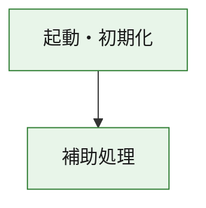
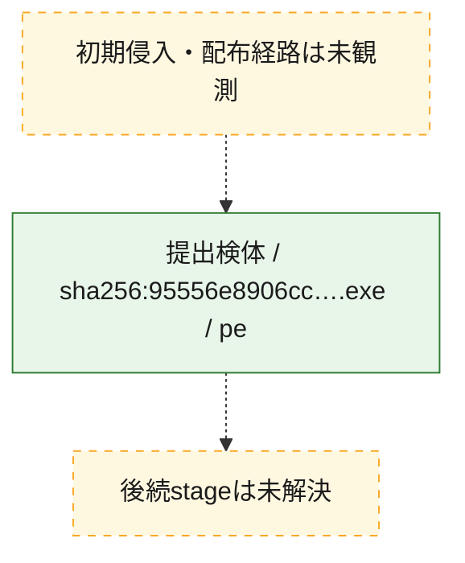
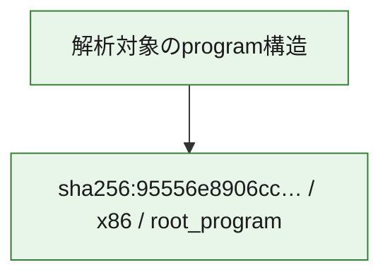

# 全体ロジック：95556e8906cc046c7904fc61f2837b68d679789b09f6e2a4133d687ee1436879

代表関数の静的証跡から、起動・初期化の処理群を確認しました。

## 読み方

- phaseの掲載順は解析上の整理順です。observed_call_edgesがない段階間の実行順を断定しません。
- 図の実線は静的に観測した関係、点線と黄色のノードは未観測・未解決の関係を示します。
- 図は静的な要約であり、動的実行を再現するものではありません。
- 詳細な関数解説とfingerprintは[STATIC-LOGIC.md](STATIC-LOGIC.md)を参照してください。

## 静的可視化

### 実行フロー

### 感染チェーン

### モジュール関係

## 処理段階

### 1. 起動・初期化

entry pointから初期化と後続処理への移行を確認します。
確度: `confirmed_static_function_evidence`

- `95556e8906cc046c7904fc61f2837b68d679789b09f6e2a4133d687ee1436879:ghidra:180001010` — 初期化と主要処理への分岐を行う入口関数です。 状態: `succeeded`、選定理由: `entry_point`, `meaningful_symbol_name`, `reviewed_call_centrality:22`, `role:entrypoint`, `small_program_complete_context`

### 2. 補助処理

主要処理を支える一般内部関数またはlibrary処理を確認します。
確度: `confirmed_static_function_evidence`

- `95556e8906cc046c7904fc61f2837b68d679789b09f6e2a4133d687ee1436879:ghidra:180001240` — 検体内部の一般処理を実装する関数です。 状態: `succeeded`、選定理由: `context_representative`, `reviewed_call_centrality:2`, `small_program_complete_context`
- `95556e8906cc046c7904fc61f2837b68d679789b09f6e2a4133d687ee1436879:ghidra:180001350` — 検体内部の一般処理を実装する関数です。 状態: `succeeded`、選定理由: `context_representative`, `reviewed_call_centrality:25`, `small_program_complete_context`
- `95556e8906cc046c7904fc61f2837b68d679789b09f6e2a4133d687ee1436879:ghidra:180003780` — 検体内部の一般処理を実装する関数です。 状態: `succeeded`、選定理由: `context_representative`, `reviewed_call_centrality:2`, `small_program_complete_context`
- `95556e8906cc046c7904fc61f2837b68d679789b09f6e2a4133d687ee1436879:ghidra:1800038e0` — 検体内部の一般処理を実装する関数です。 状態: `succeeded`、選定理由: `context_representative`, `reviewed_call_centrality:2`, `small_program_complete_context`

## 観測したcall関係

- `95556e8906cc046c7904fc61f2837b68d679789b09f6e2a4133d687ee1436879:ghidra:180001010` → `95556e8906cc046c7904fc61f2837b68d679789b09f6e2a4133d687ee1436879:ghidra:180001240` （`startup` → `support`）
- `95556e8906cc046c7904fc61f2837b68d679789b09f6e2a4133d687ee1436879:ghidra:180001010` → `95556e8906cc046c7904fc61f2837b68d679789b09f6e2a4133d687ee1436879:ghidra:180001350` （`startup` → `support`）
- `95556e8906cc046c7904fc61f2837b68d679789b09f6e2a4133d687ee1436879:ghidra:180001350` → `95556e8906cc046c7904fc61f2837b68d679789b09f6e2a4133d687ee1436879:ghidra:180001240` （`support` → `support`）
- `95556e8906cc046c7904fc61f2837b68d679789b09f6e2a4133d687ee1436879:ghidra:180001350` → `95556e8906cc046c7904fc61f2837b68d679789b09f6e2a4133d687ee1436879:ghidra:180003780` （`support` → `support`）
- `95556e8906cc046c7904fc61f2837b68d679789b09f6e2a4133d687ee1436879:ghidra:180001350` → `95556e8906cc046c7904fc61f2837b68d679789b09f6e2a4133d687ee1436879:ghidra:1800038e0` （`support` → `support`）
- `95556e8906cc046c7904fc61f2837b68d679789b09f6e2a4133d687ee1436879:ghidra:180003780` → `95556e8906cc046c7904fc61f2837b68d679789b09f6e2a4133d687ee1436879:ghidra:1800038e0` （`support` → `support`）
- `ghidra-function:38276548d94df5ecbb676714` → `ghidra-function:06c6d05b6878a90d6fc1c34b` （`unclassified` → `unclassified`）
- `ghidra-function:38276548d94df5ecbb676714` → `ghidra-function:256303d836f530b3a88f8132` （`unclassified` → `unclassified`）
- `ghidra-function:38276548d94df5ecbb676714` → `ghidra-function:2de6d0820273bca8b4b5b1ba` （`unclassified` → `unclassified`）
- `ghidra-function:38276548d94df5ecbb676714` → `ghidra-function:3354ac4b24dc69e377e44e8f` （`unclassified` → `unclassified`）
- `ghidra-function:38276548d94df5ecbb676714` → `ghidra-function:500154b5631dacb5ad1496d0` （`unclassified` → `unclassified`）
- `ghidra-function:38276548d94df5ecbb676714` → `ghidra-function:5910bb774cc05604ab2b8669` （`unclassified` → `unclassified`）
- `ghidra-function:38276548d94df5ecbb676714` → `ghidra-function:6a73f44956fec32e66fe98ab` （`unclassified` → `unclassified`）
- `ghidra-function:38276548d94df5ecbb676714` → `ghidra-function:8d1c30b8902b81d1cac44569` （`unclassified` → `unclassified`）
- `ghidra-function:38276548d94df5ecbb676714` → `ghidra-function:b42f14dd370f915df833d964` （`unclassified` → `unclassified`）
- `ghidra-function:38276548d94df5ecbb676714` → `ghidra-function:da82741449d779113eac2afd` （`unclassified` → `unclassified`）
- `ghidra-function:38276548d94df5ecbb676714` → `ghidra-function:e3af535f73420ff4cdb0e196` （`unclassified` → `unclassified`）
- `ghidra-function:38276548d94df5ecbb676714` → `ghidra-function:fcbadef54c649854976739a8` （`unclassified` → `unclassified`）
- `ghidra-function:8d1c30b8902b81d1cac44569` → `ghidra-external:18712f9472dc476630761c02` （`unclassified` → `unclassified`）
- `ghidra-function:8d1c30b8902b81d1cac44569` → `ghidra-external:199d7eb68f0538e45ff14cae` （`unclassified` → `unclassified`）
- `ghidra-function:8d1c30b8902b81d1cac44569` → `ghidra-external:2cb506b4e56a7f8ed8237cd4` （`unclassified` → `unclassified`）
- `ghidra-function:8d1c30b8902b81d1cac44569` → `ghidra-external:337ba0d418a212a1850ba3b2` （`unclassified` → `unclassified`）
- `ghidra-function:8d1c30b8902b81d1cac44569` → `ghidra-external:39a70611e1c09943f89a3284` （`unclassified` → `unclassified`）
- `ghidra-function:8d1c30b8902b81d1cac44569` → `ghidra-external:4e7dcd4c9cf2f4e68c761a5d` （`unclassified` → `unclassified`）
- `ghidra-function:8d1c30b8902b81d1cac44569` → `ghidra-external:51ceaf154af342f772deb827` （`unclassified` → `unclassified`）
- `ghidra-function:8d1c30b8902b81d1cac44569` → `ghidra-external:5f54ab07f467a22e0e32f108` （`unclassified` → `unclassified`）
- `ghidra-function:8d1c30b8902b81d1cac44569` → `ghidra-external:6e74238e52a0f5da3060b637` （`unclassified` → `unclassified`）
- `ghidra-function:8d1c30b8902b81d1cac44569` → `ghidra-external:88eaf918fb338561add7962d` （`unclassified` → `unclassified`）
- `ghidra-function:8d1c30b8902b81d1cac44569` → `ghidra-external:8a56a6f95263bced3148e869` （`unclassified` → `unclassified`）
- `ghidra-function:8d1c30b8902b81d1cac44569` → `ghidra-external:a0b452ae8c645b4ed56ddfbf` （`unclassified` → `unclassified`）
- `ghidra-function:8d1c30b8902b81d1cac44569` → `ghidra-external:abb00c1ee35aa2e19e19aa4c` （`unclassified` → `unclassified`）
- `ghidra-function:8d1c30b8902b81d1cac44569` → `ghidra-external:b4ad95765eae689c0495c4ec` （`unclassified` → `unclassified`）
- `ghidra-function:8d1c30b8902b81d1cac44569` → `ghidra-external:b8e74a19bc5d77ac3530ebdf` （`unclassified` → `unclassified`）
- `ghidra-function:8d1c30b8902b81d1cac44569` → `ghidra-external:c5f073c4cdc5f9f3a86f6649` （`unclassified` → `unclassified`）
- `ghidra-function:8d1c30b8902b81d1cac44569` → `ghidra-external:d55517789921899f13d838bc` （`unclassified` → `unclassified`）
- `ghidra-function:8d1c30b8902b81d1cac44569` → `ghidra-external:ef58a4038d3dce0d0c813ea3` （`unclassified` → `unclassified`）
- `ghidra-function:8d1c30b8902b81d1cac44569` → `ghidra-external:f11250f211ac8aa6c1621d72` （`unclassified` → `unclassified`）
- `ghidra-function:8d1c30b8902b81d1cac44569` → `ghidra-external:f1e2f5fd648d9d76d8c0780b` （`unclassified` → `unclassified`）
- `ghidra-function:8d1c30b8902b81d1cac44569` → `ghidra-external:f4eb007d027291037e4fc299` （`unclassified` → `unclassified`）
- `ghidra-function:8d1c30b8902b81d1cac44569` → `ghidra-function:5910bb774cc05604ab2b8669` （`unclassified` → `unclassified`）
- `ghidra-function:8d1c30b8902b81d1cac44569` → `ghidra-function:bc47f6db98d69fa52fa2bf3c` （`unclassified` → `unclassified`）
- `ghidra-function:8d1c30b8902b81d1cac44569` → `ghidra-function:c8f5da041e4b126bb4d60c54` （`unclassified` → `unclassified`）
- `ghidra-function:c8f5da041e4b126bb4d60c54` → `ghidra-function:bc47f6db98d69fa52fa2bf3c` （`unclassified` → `unclassified`）

## 解析範囲と制約

- 選定外関数は全体inventoryへ残しますが、関数本体の個別解説対象にはしていません。
- indirect call、難読化、packer、VM、壊れたcontrol flowによりcall関係が欠落する場合があります。
- 文書は静的解析に基づき、検体実行や外部通信による動的確認は行っていません。
