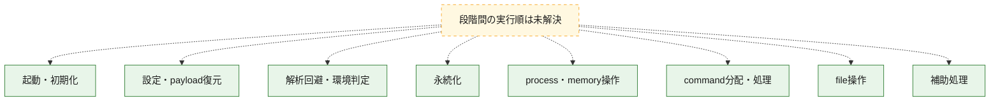
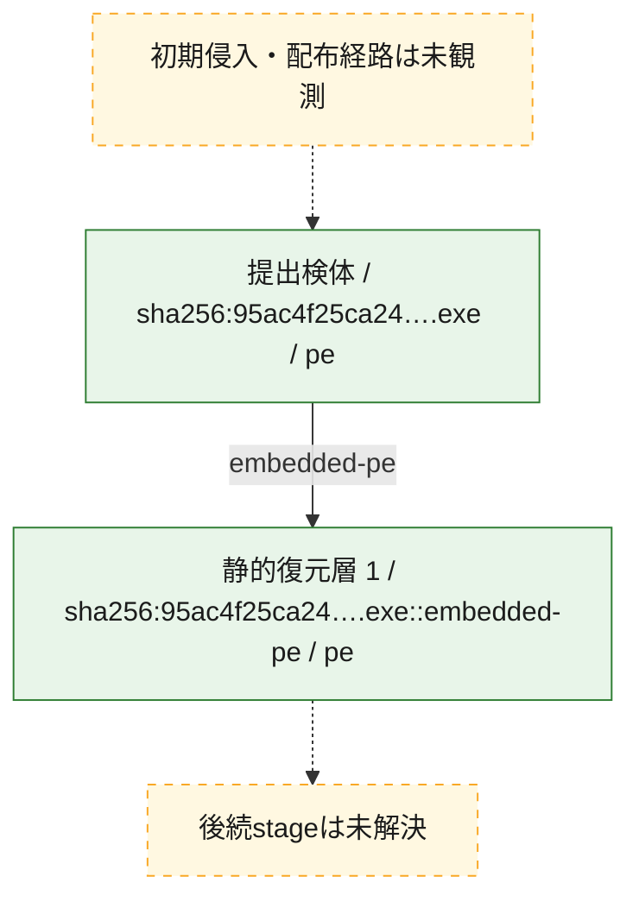
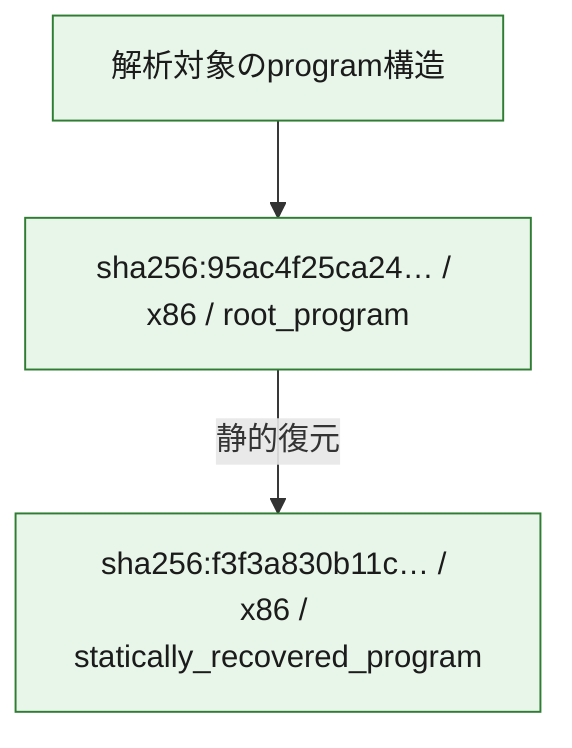

# 全体ロジック：95ac4f25ca24aab7a5a443b813a3f92f0bbbc0a431e5e75764609f9214c114b3

代表関数の静的証跡から、起動・初期化、設定・payload復元、解析回避・環境判定、永続化、process・memory操作、command分配・処理、file操作の処理群を確認しました。

## 読み方

- phaseの掲載順は解析上の整理順です。observed_call_edgesがない段階間の実行順を断定しません。
- 図の実線は静的に観測した関係、点線と黄色のノードは未観測・未解決の関係を示します。
- 図は静的な要約であり、動的実行を再現するものではありません。
- 詳細な関数解説とfingerprintは[STATIC-LOGIC.md](STATIC-LOGIC.md)を参照してください。

## 静的可視化

### 実行フロー

### 感染チェーン

### モジュール関係

## 処理段階

### 1. 起動・初期化

entry pointから初期化と後続処理への移行を確認します。
確度: `confirmed_static_function_evidence`

- `f3f3a830b11c742a91a52fc935ac4462128cec01588c20afdb36756867088ec7:ghidra:1400010f6` — 初期化と主要処理への分岐を行う入口関数です。 状態: `succeeded`、選定理由: `entry_point`, `meaningful_symbol_name`, `reviewed_call_centrality:1`, `role:entrypoint`
- `95ac4f25ca24aab7a5a443b813a3f92f0bbbc0a431e5e75764609f9214c114b3:cil:0x0600001a` — 初期化と主要処理への分岐を行う入口関数です。 状態: `succeeded`、選定理由: `entry_point`, `reviewed_call_centrality:8`

### 2. 設定・payload復元

設定、resource、payload、暗号化データの復元・変換を確認します。
確度: `confirmed_static_function_evidence`

- `95ac4f25ca24aab7a5a443b813a3f92f0bbbc0a431e5e75764609f9214c114b3:cil:0x0600001b` — 設定、resource、payloadなどの解析・変換を行う関数です。 状態: `succeeded`、選定理由: `reviewed_call_centrality:2`, `role:config_or_data_transform`
- `95ac4f25ca24aab7a5a443b813a3f92f0bbbc0a431e5e75764609f9214c114b3:cil:0x0600001c` — 設定、resource、payloadなどの解析・変換を行う関数です。 状態: `succeeded`、選定理由: `reviewed_call_centrality:6`, `role:config_or_data_transform`
- `95ac4f25ca24aab7a5a443b813a3f92f0bbbc0a431e5e75764609f9214c114b3:cil:0x0600001d` — 設定、resource、payloadなどの解析・変換を行う関数です。 状態: `succeeded`、選定理由: `role:config_or_data_transform`
- `95ac4f25ca24aab7a5a443b813a3f92f0bbbc0a431e5e75764609f9214c114b3:cil:0x0600001e` — 設定、resource、payloadなどの解析・変換を行う関数です。 状態: `succeeded`、選定理由: `role:config_or_data_transform`
- `95ac4f25ca24aab7a5a443b813a3f92f0bbbc0a431e5e75764609f9214c114b3:cil:0x0600001f` — 設定、resource、payloadなどの解析・変換を行う関数です。 状態: `succeeded`、選定理由: `reviewed_call_centrality:4`, `role:config_or_data_transform`
- `95ac4f25ca24aab7a5a443b813a3f92f0bbbc0a431e5e75764609f9214c114b3:cil:0x06000020` — 設定、resource、payloadなどの解析・変換を行う関数です。 状態: `succeeded`、選定理由: `reviewed_call_centrality:4`, `role:config_or_data_transform`
- `95ac4f25ca24aab7a5a443b813a3f92f0bbbc0a431e5e75764609f9214c114b3:cil:0x06000021` — 設定、resource、payloadなどの解析・変換を行う関数です。 状態: `succeeded`、選定理由: `reviewed_call_centrality:4`, `role:config_or_data_transform`
- `95ac4f25ca24aab7a5a443b813a3f92f0bbbc0a431e5e75764609f9214c114b3:cil:0x06000022` — 設定、resource、payloadなどの解析・変換を行う関数です。 状態: `succeeded`、選定理由: `role:config_or_data_transform`
- `95ac4f25ca24aab7a5a443b813a3f92f0bbbc0a431e5e75764609f9214c114b3:cil:0x06000023` — 設定、resource、payloadなどの解析・変換を行う関数です。 状態: `succeeded`、選定理由: `reviewed_call_centrality:4`, `role:config_or_data_transform`
- `95ac4f25ca24aab7a5a443b813a3f92f0bbbc0a431e5e75764609f9214c114b3:cil:0x06000024` — 設定、resource、payloadなどの解析・変換を行う関数です。 状態: `succeeded`、選定理由: `reviewed_call_centrality:2`, `role:config_or_data_transform`
- `95ac4f25ca24aab7a5a443b813a3f92f0bbbc0a431e5e75764609f9214c114b3:cil:0x06000025` — 設定、resource、payloadなどの解析・変換を行う関数です。 状態: `succeeded`、選定理由: `reviewed_call_centrality:4`, `role:config_or_data_transform`
- `95ac4f25ca24aab7a5a443b813a3f92f0bbbc0a431e5e75764609f9214c114b3:cil:0x0600003a` — 暗号、hash、encoding、または復号処理に関係する関数です。 状態: `succeeded`、選定理由: `reviewed_call_centrality:40`, `role:cryptographic_transform`

### 3. 解析回避・環境判定

debugger、sandbox、仮想環境、時間差などの判定を確認します。
確度: `confirmed_static_function_evidence`

- `f3f3a830b11c742a91a52fc935ac4462128cec01588c20afdb36756867088ec7:ghidra:140001154` — debugger、仮想環境、sandbox、または時間差の確認に関係する関数です。 状態: `succeeded`、選定理由: `context_representative`, `reviewed_call_centrality:19`, `role:anti_analysis`

### 4. 永続化

自動起動や永続化に関係する設定変更を確認します。
確度: `confirmed_static_function_evidence`

- `95ac4f25ca24aab7a5a443b813a3f92f0bbbc0a431e5e75764609f9214c114b3:cil:0x06000009` — 自動起動または永続化に関係する処理を含む関数です。 状態: `succeeded`、選定理由: `large_function:instructions=82`, `reviewed_call_centrality:28`, `role:persistence`
- `95ac4f25ca24aab7a5a443b813a3f92f0bbbc0a431e5e75764609f9214c114b3:cil:0x0600003b` — 自動起動または永続化に関係する処理を含む関数です。 状態: `succeeded`、選定理由: `large_function:instructions=69`, `reviewed_call_centrality:14`, `role:persistence`
- `95ac4f25ca24aab7a5a443b813a3f92f0bbbc0a431e5e75764609f9214c114b3:cil:0x0600003c` — 自動起動または永続化に関係する処理を含む関数です。 状態: `succeeded`、選定理由: `reviewed_call_centrality:12`, `role:persistence`
- `95ac4f25ca24aab7a5a443b813a3f92f0bbbc0a431e5e75764609f9214c114b3:cil:0x0600003d` — 自動起動または永続化に関係する処理を含む関数です。 状態: `succeeded`、選定理由: `reviewed_call_centrality:8`, `role:persistence`
- `95ac4f25ca24aab7a5a443b813a3f92f0bbbc0a431e5e75764609f9214c114b3:cil:0x0600003e` — 自動起動または永続化に関係する処理を含む関数です。 状態: `succeeded`、選定理由: `large_function:instructions=68`, `reviewed_call_centrality:14`, `role:persistence`
- `95ac4f25ca24aab7a5a443b813a3f92f0bbbc0a431e5e75764609f9214c114b3:cil:0x0600003f` — 自動起動または永続化に関係する処理を含む関数です。 状態: `succeeded`、選定理由: `reviewed_call_centrality:4`, `role:persistence`
- `95ac4f25ca24aab7a5a443b813a3f92f0bbbc0a431e5e75764609f9214c114b3:cil:0x06000040` — 自動起動または永続化に関係する処理を含む関数です。 状態: `succeeded`、選定理由: `role:persistence`

### 5. process・memory操作

process、thread、module、memory操作と実行移行を確認します。
確度: `confirmed_static_function_evidence`

- `f3f3a830b11c742a91a52fc935ac4462128cec01588c20afdb36756867088ec7:ghidra:1400015e0` — process、thread、module、またはmemory操作に関係する関数です。 状態: `succeeded`、選定理由: `context_representative`, `reviewed_call_centrality:7`, `role:process_or_memory_operation`
- `95ac4f25ca24aab7a5a443b813a3f92f0bbbc0a431e5e75764609f9214c114b3:cil:0x06000015` — process、thread、module、またはmemory操作に関係する関数です。 状態: `succeeded`、選定理由: `reviewed_call_centrality:2`, `role:process_or_memory_operation`
- `95ac4f25ca24aab7a5a443b813a3f92f0bbbc0a431e5e75764609f9214c114b3:cil:0x06000017` — process、thread、module、またはmemory操作に関係する関数です。 状態: `succeeded`、選定理由: `reviewed_call_centrality:8`, `role:process_or_memory_operation`

### 6. command分配・処理

受信commandやtaskの解釈、分配、個別handlerへの移行を確認します。
確度: `confirmed_static_function_evidence_with_limits`

- `f3f3a830b11c742a91a52fc935ac4462128cec01588c20afdb36756867088ec7:ghidra:1400016e0` — commandの解釈、分配、または個別処理を担当する関数です。 状態: `limited_bad_instruction_or_flow`、選定理由: `context_representative`, `reviewed_call_centrality:17`, `role:command_dispatch_or_handler`
- `95ac4f25ca24aab7a5a443b813a3f92f0bbbc0a431e5e75764609f9214c114b3:cil:0x06000007` — commandの解釈、分配、または個別処理を担当する関数です。 状態: `succeeded`、選定理由: `reviewed_call_centrality:8`, `role:command_dispatch_or_handler`
- `95ac4f25ca24aab7a5a443b813a3f92f0bbbc0a431e5e75764609f9214c114b3:cil:0x0600000a` — commandの解釈、分配、または個別処理を担当する関数です。 状態: `succeeded`、選定理由: `large_function:instructions=73`, `reviewed_call_centrality:22`, `role:command_dispatch_or_handler`
- `95ac4f25ca24aab7a5a443b813a3f92f0bbbc0a431e5e75764609f9214c114b3:cil:0x06000014` — commandの解釈、分配、または個別処理を担当する関数です。 状態: `succeeded`、選定理由: `large_function:instructions=502`, `reviewed_call_centrality:102`, `role:command_dispatch_or_handler`
- `95ac4f25ca24aab7a5a443b813a3f92f0bbbc0a431e5e75764609f9214c114b3:cil:0x06000033` — commandの解釈、分配、または個別処理を担当する関数です。 状態: `succeeded`、選定理由: `reviewed_call_centrality:16`, `role:command_dispatch_or_handler`

### 7. file操作

fileやdirectoryの作成、読書き、削除を確認します。
確度: `confirmed_static_function_evidence`

- `95ac4f25ca24aab7a5a443b813a3f92f0bbbc0a431e5e75764609f9214c114b3:cil:0x06000008` — fileまたはdirectoryの読書き・管理に関係する関数です。 状態: `succeeded`、選定理由: `reviewed_call_centrality:6`, `role:file_operation`
- `95ac4f25ca24aab7a5a443b813a3f92f0bbbc0a431e5e75764609f9214c114b3:cil:0x0600000e` — fileまたはdirectoryの読書き・管理に関係する関数です。 状態: `succeeded`、選定理由: `large_function:instructions=153`, `reviewed_call_centrality:40`, `role:file_operation`

### 8. 補助処理

主要処理を支える一般内部関数またはlibrary処理を確認します。
確度: `confirmed_static_function_evidence_with_limits`

- `f3f3a830b11c742a91a52fc935ac4462128cec01588c20afdb36756867088ec7:ghidra:140001000` — 検体内部の一般処理を実装する関数です。 状態: `succeeded`、選定理由: `context_representative`
- `f3f3a830b11c742a91a52fc935ac4462128cec01588c20afdb36756867088ec7:ghidra:140001017` — 検体内部の一般処理を実装する関数です。 状態: `succeeded`、選定理由: `context_representative`, `reviewed_call_centrality:6`
- `f3f3a830b11c742a91a52fc935ac4462128cec01588c20afdb36756867088ec7:ghidra:14000109a` — 検体内部の一般処理を実装する関数です。 状態: `succeeded`、選定理由: `context_representative`, `reviewed_call_centrality:1`
- `f3f3a830b11c742a91a52fc935ac4462128cec01588c20afdb36756867088ec7:ghidra:140001125` — 検体内部の一般処理を実装する関数です。 状態: `succeeded`、選定理由: `context_representative`, `reviewed_call_centrality:1`
- `f3f3a830b11c742a91a52fc935ac4462128cec01588c20afdb36756867088ec7:ghidra:140001378` — 検体内部の一般処理を実装する関数です。 状態: `succeeded`、選定理由: `context_representative`, `reviewed_call_centrality:2`
- `f3f3a830b11c742a91a52fc935ac4462128cec01588c20afdb36756867088ec7:ghidra:14000147c` — 検体内部の一般処理を実装する関数です。 状態: `succeeded`、選定理由: `context_representative`, `reviewed_call_centrality:4`
- `f3f3a830b11c742a91a52fc935ac4462128cec01588c20afdb36756867088ec7:ghidra:140001583` — 検体内部の一般処理を実装する関数です。 状態: `succeeded`、選定理由: `context_representative`, `reviewed_call_centrality:2`
- `f3f3a830b11c742a91a52fc935ac4462128cec01588c20afdb36756867088ec7:ghidra:1400015c0` — 検体内部の一般処理を実装する関数です。 状態: `succeeded`、選定理由: `context_representative`
- `f3f3a830b11c742a91a52fc935ac4462128cec01588c20afdb36756867088ec7:ghidra:1400015d0` — 検体内部の一般処理を実装する関数です。 状態: `succeeded`、選定理由: `context_representative`
- `f3f3a830b11c742a91a52fc935ac4462128cec01588c20afdb36756867088ec7:ghidra:140001690` — 検体内部の一般処理を実装する関数です。 状態: `limited_bad_instruction_or_flow`、選定理由: `context_representative`, `reviewed_call_centrality:2`
- `f3f3a830b11c742a91a52fc935ac4462128cec01588c20afdb36756867088ec7:ghidra:1400018b0` — 検体内部の一般処理を実装する関数です。 状態: `succeeded`、選定理由: `context_representative`
- `f3f3a830b11c742a91a52fc935ac4462128cec01588c20afdb36756867088ec7:ghidra:1400018ef` — 検体内部の一般処理を実装する関数です。 状態: `succeeded`、選定理由: `context_representative`, `reviewed_call_centrality:2`
- `f3f3a830b11c742a91a52fc935ac4462128cec01588c20afdb36756867088ec7:ghidra:140001967` — 検体内部の一般処理を実装する関数です。 状態: `succeeded`、選定理由: `context_representative`, `reviewed_call_centrality:2`
- `f3f3a830b11c742a91a52fc935ac4462128cec01588c20afdb36756867088ec7:ghidra:140001990` — 検体内部の一般処理を実装する関数です。 状態: `succeeded`、選定理由: `context_representative`, `reviewed_call_centrality:1`
- `f3f3a830b11c742a91a52fc935ac4462128cec01588c20afdb36756867088ec7:ghidra:1400019a0` — compiler生成処理または汎用library処理とみられる関数です。 状態: `succeeded`、選定理由: `entry_point`, `meaningful_symbol_name`, `reviewed_call_centrality:2`
- `f3f3a830b11c742a91a52fc935ac4462128cec01588c20afdb36756867088ec7:ghidra:140001a43` — 検体内部の一般処理を実装する関数です。 状態: `succeeded`、選定理由: `context_representative`
- `f3f3a830b11c742a91a52fc935ac4462128cec01588c20afdb36756867088ec7:ghidra:140001a60` — compiler生成処理または汎用library処理とみられる関数です。 状態: `succeeded`、選定理由: `entry_point`, `meaningful_symbol_name`, `reviewed_call_centrality:1`
- `f3f3a830b11c742a91a52fc935ac4462128cec01588c20afdb36756867088ec7:ghidra:140001ab0` — 検体内部の一般処理を実装する関数です。 状態: `succeeded`、選定理由: `context_representative`, `reviewed_call_centrality:2`
- `f3f3a830b11c742a91a52fc935ac4462128cec01588c20afdb36756867088ec7:ghidra:140001bd0` — 検体内部の一般処理を実装する関数です。 状態: `succeeded`、選定理由: `context_representative`, `reviewed_call_centrality:2`
- `f3f3a830b11c742a91a52fc935ac4462128cec01588c20afdb36756867088ec7:ghidra:140001be0` — 検体内部の一般処理を実装する関数です。 状態: `succeeded`、選定理由: `context_representative`, `reviewed_call_centrality:14`
- `f3f3a830b11c742a91a52fc935ac4462128cec01588c20afdb36756867088ec7:ghidra:140001c50` — 検体内部の一般処理を実装する関数です。 状態: `succeeded`、選定理由: `context_representative`, `reviewed_call_centrality:10`
- `f3f3a830b11c742a91a52fc935ac4462128cec01588c20afdb36756867088ec7:ghidra:140001f2f` — 検体内部の一般処理を実装する関数です。 状態: `succeeded`、選定理由: `context_representative`, `reviewed_call_centrality:3`
- `f3f3a830b11c742a91a52fc935ac4462128cec01588c20afdb36756867088ec7:ghidra:140002007` — 検体内部の一般処理を実装する関数です。 状態: `succeeded`、選定理由: `context_representative`, `reviewed_call_centrality:3`
- `f3f3a830b11c742a91a52fc935ac4462128cec01588c20afdb36756867088ec7:ghidra:14000204e` — 検体内部の一般処理を実装する関数です。 状態: `succeeded`、選定理由: `context_representative`, `reviewed_call_centrality:3`
- `f3f3a830b11c742a91a52fc935ac4462128cec01588c20afdb36756867088ec7:ghidra:1400023d8` — 検体内部の一般処理を実装する関数です。 状態: `succeeded`、選定理由: `context_representative`, `reviewed_call_centrality:5`
- `f3f3a830b11c742a91a52fc935ac4462128cec01588c20afdb36756867088ec7:ghidra:140002480` — 検体内部の一般処理を実装する関数です。 状態: `succeeded`、選定理由: `context_representative`
- `f3f3a830b11c742a91a52fc935ac4462128cec01588c20afdb36756867088ec7:ghidra:1400024ea` — 検体内部の一般処理を実装する関数です。 状態: `succeeded`、選定理由: `context_representative`, `reviewed_call_centrality:2`
- `f3f3a830b11c742a91a52fc935ac4462128cec01588c20afdb36756867088ec7:ghidra:140002520` — 検体内部の一般処理を実装する関数です。 状態: `succeeded`、選定理由: `context_representative`, `reviewed_call_centrality:2`
- `95ac4f25ca24aab7a5a443b813a3f92f0bbbc0a431e5e75764609f9214c114b3:cil:0x0600000b` — 検体内部の一般処理を実装する関数です。 状態: `succeeded`、選定理由: `reviewed_call_centrality:10`
- `95ac4f25ca24aab7a5a443b813a3f92f0bbbc0a431e5e75764609f9214c114b3:cil:0x0600000f` — 検体内部の一般処理を実装する関数です。 状態: `succeeded`、選定理由: `large_function:instructions=119`, `reviewed_call_centrality:36`
- `95ac4f25ca24aab7a5a443b813a3f92f0bbbc0a431e5e75764609f9214c114b3:cil:0x06000010` — 検体内部の一般処理を実装する関数です。 状態: `succeeded`、選定理由: `large_function:instructions=91`, `reviewed_call_centrality:20`
- `95ac4f25ca24aab7a5a443b813a3f92f0bbbc0a431e5e75764609f9214c114b3:cil:0x06000018` — 検体内部の一般処理を実装する関数です。 状態: `succeeded`、選定理由: `large_function:instructions=70`, `reviewed_call_centrality:22`

## 観測したcall関係

- 代表関数間で直接解決できた呼出関係はありません。

## 解析範囲と制約

- 選定外関数は全体inventoryへ残しますが、関数本体の個別解説対象にはしていません。
- indirect call、難読化、packer、VM、壊れたcontrol flowによりcall関係が欠落する場合があります。
- 文書は静的解析に基づき、検体実行や外部通信による動的確認は行っていません。
