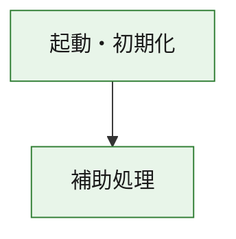
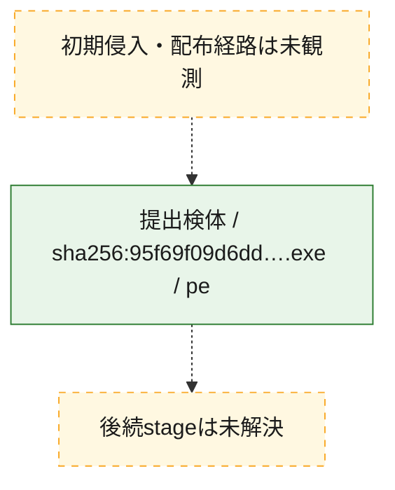
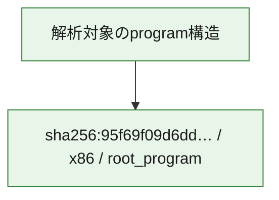

# 全体ロジック：95f69f09d6dd5e7df8497e24088f741d0530c83838b96d64b65f621de4d9c356

代表関数の静的証跡から、起動・初期化の処理群を確認しました。

## 読み方

- phaseの掲載順は解析上の整理順です。observed_call_edgesがない段階間の実行順を断定しません。
- 図の実線は静的に観測した関係、点線と黄色のノードは未観測・未解決の関係を示します。
- 図は静的な要約であり、動的実行を再現するものではありません。
- 詳細な関数解説とfingerprintは[STATIC-LOGIC.md](STATIC-LOGIC.md)を参照してください。

## 静的可視化

### 実行フロー

### 感染チェーン

### モジュール関係

## 処理段階

### 1. 起動・初期化

entry pointから初期化と後続処理への移行を確認します。
確度: `confirmed_static_function_evidence`

- `95f69f09d6dd5e7df8497e24088f741d0530c83838b96d64b65f621de4d9c356:ghidra:180001010` — 初期化と主要処理への分岐を行う入口関数です。 状態: `succeeded`、選定理由: `entry_point`, `meaningful_symbol_name`, `reviewed_call_centrality:22`, `role:entrypoint`, `small_program_complete_context`

### 2. 補助処理

主要処理を支える一般内部関数またはlibrary処理を確認します。
確度: `confirmed_static_function_evidence`

- `95f69f09d6dd5e7df8497e24088f741d0530c83838b96d64b65f621de4d9c356:ghidra:180001240` — 検体内部の一般処理を実装する関数です。 状態: `succeeded`、選定理由: `context_representative`, `reviewed_call_centrality:2`, `small_program_complete_context`
- `95f69f09d6dd5e7df8497e24088f741d0530c83838b96d64b65f621de4d9c356:ghidra:180001350` — 検体内部の一般処理を実装する関数です。 状態: `succeeded`、選定理由: `context_representative`, `reviewed_call_centrality:25`, `small_program_complete_context`
- `95f69f09d6dd5e7df8497e24088f741d0530c83838b96d64b65f621de4d9c356:ghidra:180003780` — 検体内部の一般処理を実装する関数です。 状態: `succeeded`、選定理由: `context_representative`, `reviewed_call_centrality:2`, `small_program_complete_context`
- `95f69f09d6dd5e7df8497e24088f741d0530c83838b96d64b65f621de4d9c356:ghidra:1800038e0` — 検体内部の一般処理を実装する関数です。 状態: `succeeded`、選定理由: `context_representative`, `reviewed_call_centrality:2`, `small_program_complete_context`

## 観測したcall関係

- `95f69f09d6dd5e7df8497e24088f741d0530c83838b96d64b65f621de4d9c356:ghidra:180001010` → `95f69f09d6dd5e7df8497e24088f741d0530c83838b96d64b65f621de4d9c356:ghidra:180001240` （`startup` → `support`）
- `95f69f09d6dd5e7df8497e24088f741d0530c83838b96d64b65f621de4d9c356:ghidra:180001010` → `95f69f09d6dd5e7df8497e24088f741d0530c83838b96d64b65f621de4d9c356:ghidra:180001350` （`startup` → `support`）
- `95f69f09d6dd5e7df8497e24088f741d0530c83838b96d64b65f621de4d9c356:ghidra:180001350` → `95f69f09d6dd5e7df8497e24088f741d0530c83838b96d64b65f621de4d9c356:ghidra:180001240` （`support` → `support`）
- `95f69f09d6dd5e7df8497e24088f741d0530c83838b96d64b65f621de4d9c356:ghidra:180001350` → `95f69f09d6dd5e7df8497e24088f741d0530c83838b96d64b65f621de4d9c356:ghidra:180003780` （`support` → `support`）
- `95f69f09d6dd5e7df8497e24088f741d0530c83838b96d64b65f621de4d9c356:ghidra:180001350` → `95f69f09d6dd5e7df8497e24088f741d0530c83838b96d64b65f621de4d9c356:ghidra:1800038e0` （`support` → `support`）
- `95f69f09d6dd5e7df8497e24088f741d0530c83838b96d64b65f621de4d9c356:ghidra:180003780` → `95f69f09d6dd5e7df8497e24088f741d0530c83838b96d64b65f621de4d9c356:ghidra:1800038e0` （`support` → `support`）
- `ghidra-function:02e4ba5e87b8a3968d2e629b` → `ghidra-external:0b6131307c161c561ca10dd3` （`unclassified` → `unclassified`）
- `ghidra-function:02e4ba5e87b8a3968d2e629b` → `ghidra-external:173b12717a39f0328287f0c5` （`unclassified` → `unclassified`）
- `ghidra-function:02e4ba5e87b8a3968d2e629b` → `ghidra-external:4393e024cb434686160e1967` （`unclassified` → `unclassified`）
- `ghidra-function:02e4ba5e87b8a3968d2e629b` → `ghidra-external:448246c1702820de60dff5d4` （`unclassified` → `unclassified`）
- `ghidra-function:02e4ba5e87b8a3968d2e629b` → `ghidra-external:46b419bc33ba522ec2a97e75` （`unclassified` → `unclassified`）
- `ghidra-function:02e4ba5e87b8a3968d2e629b` → `ghidra-external:51e46b077cf0f0c7e5e995aa` （`unclassified` → `unclassified`）
- `ghidra-function:02e4ba5e87b8a3968d2e629b` → `ghidra-external:5fec1f07b46294036804889b` （`unclassified` → `unclassified`）
- `ghidra-function:02e4ba5e87b8a3968d2e629b` → `ghidra-external:649719644b9a7d4d75bc71c5` （`unclassified` → `unclassified`）
- `ghidra-function:02e4ba5e87b8a3968d2e629b` → `ghidra-external:8b2b88a5e57e0806d81179b9` （`unclassified` → `unclassified`）
- `ghidra-function:02e4ba5e87b8a3968d2e629b` → `ghidra-external:9e2ddac26ec5e305f3aeda00` （`unclassified` → `unclassified`）
- `ghidra-function:02e4ba5e87b8a3968d2e629b` → `ghidra-external:a4990d8f6cfddb7f52629068` （`unclassified` → `unclassified`）
- `ghidra-function:02e4ba5e87b8a3968d2e629b` → `ghidra-external:b117f44a757fe215b5467a86` （`unclassified` → `unclassified`）
- `ghidra-function:02e4ba5e87b8a3968d2e629b` → `ghidra-external:b423935481c5bc646ec9f8b4` （`unclassified` → `unclassified`）
- `ghidra-function:02e4ba5e87b8a3968d2e629b` → `ghidra-external:bb55b4fae8ea0a772309199a` （`unclassified` → `unclassified`）
- `ghidra-function:02e4ba5e87b8a3968d2e629b` → `ghidra-external:bc743751dc000280e7285bfb` （`unclassified` → `unclassified`）
- `ghidra-function:02e4ba5e87b8a3968d2e629b` → `ghidra-external:d557cc5c11c5e5737f9ee816` （`unclassified` → `unclassified`）
- `ghidra-function:02e4ba5e87b8a3968d2e629b` → `ghidra-external:d8ab5277dc51030a1527378f` （`unclassified` → `unclassified`）
- `ghidra-function:02e4ba5e87b8a3968d2e629b` → `ghidra-external:e0d2074dfb295dfa202a0597` （`unclassified` → `unclassified`）
- `ghidra-function:02e4ba5e87b8a3968d2e629b` → `ghidra-external:e59585e39f644aecc512f892` （`unclassified` → `unclassified`）
- `ghidra-function:02e4ba5e87b8a3968d2e629b` → `ghidra-external:f66784ab704154909326abf0` （`unclassified` → `unclassified`）
- `ghidra-function:02e4ba5e87b8a3968d2e629b` → `ghidra-external:f9b796206095f0cb7b832559` （`unclassified` → `unclassified`）
- `ghidra-function:02e4ba5e87b8a3968d2e629b` → `ghidra-function:089e7fd7496b41ac20c8dbed` （`unclassified` → `unclassified`）
- `ghidra-function:02e4ba5e87b8a3968d2e629b` → `ghidra-function:b46dabd4b22e678f9438ae1e` （`unclassified` → `unclassified`）
- `ghidra-function:02e4ba5e87b8a3968d2e629b` → `ghidra-function:ee833117afae67454a024506` （`unclassified` → `unclassified`）
- `ghidra-function:1db1c2a90b991e2bcd768d5a` → `ghidra-function:015d3f96c8379f3c60b82f6f` （`unclassified` → `unclassified`）
- `ghidra-function:1db1c2a90b991e2bcd768d5a` → `ghidra-function:02e4ba5e87b8a3968d2e629b` （`unclassified` → `unclassified`）
- `ghidra-function:1db1c2a90b991e2bcd768d5a` → `ghidra-function:1a275d62287d23c9e8758fba` （`unclassified` → `unclassified`）
- `ghidra-function:1db1c2a90b991e2bcd768d5a` → `ghidra-function:24a083ee26af37516ba873ee` （`unclassified` → `unclassified`）
- `ghidra-function:1db1c2a90b991e2bcd768d5a` → `ghidra-function:79b9432399e34bcc22fc758d` （`unclassified` → `unclassified`）
- `ghidra-function:1db1c2a90b991e2bcd768d5a` → `ghidra-function:9491864647e948d3f886bf1b` （`unclassified` → `unclassified`）
- `ghidra-function:1db1c2a90b991e2bcd768d5a` → `ghidra-function:b46dabd4b22e678f9438ae1e` （`unclassified` → `unclassified`）
- `ghidra-function:1db1c2a90b991e2bcd768d5a` → `ghidra-function:b9c2e7d7463ad070f26da421` （`unclassified` → `unclassified`）
- `ghidra-function:1db1c2a90b991e2bcd768d5a` → `ghidra-function:bb84a740169a7b906e389831` （`unclassified` → `unclassified`）
- `ghidra-function:1db1c2a90b991e2bcd768d5a` → `ghidra-function:c30e3cc4bcd0d4c4d6ea59d0` （`unclassified` → `unclassified`）
- `ghidra-function:1db1c2a90b991e2bcd768d5a` → `ghidra-function:fbc407bc5d2d80fbbf0692fc` （`unclassified` → `unclassified`）
- `ghidra-function:1db1c2a90b991e2bcd768d5a` → `ghidra-function:fd4b03d35f6ee9bbb5150c95` （`unclassified` → `unclassified`）
- `ghidra-function:ee833117afae67454a024506` → `ghidra-function:089e7fd7496b41ac20c8dbed` （`unclassified` → `unclassified`）

## 解析範囲と制約

- 選定外関数は全体inventoryへ残しますが、関数本体の個別解説対象にはしていません。
- indirect call、難読化、packer、VM、壊れたcontrol flowによりcall関係が欠落する場合があります。
- 文書は静的解析に基づき、検体実行や外部通信による動的確認は行っていません。
