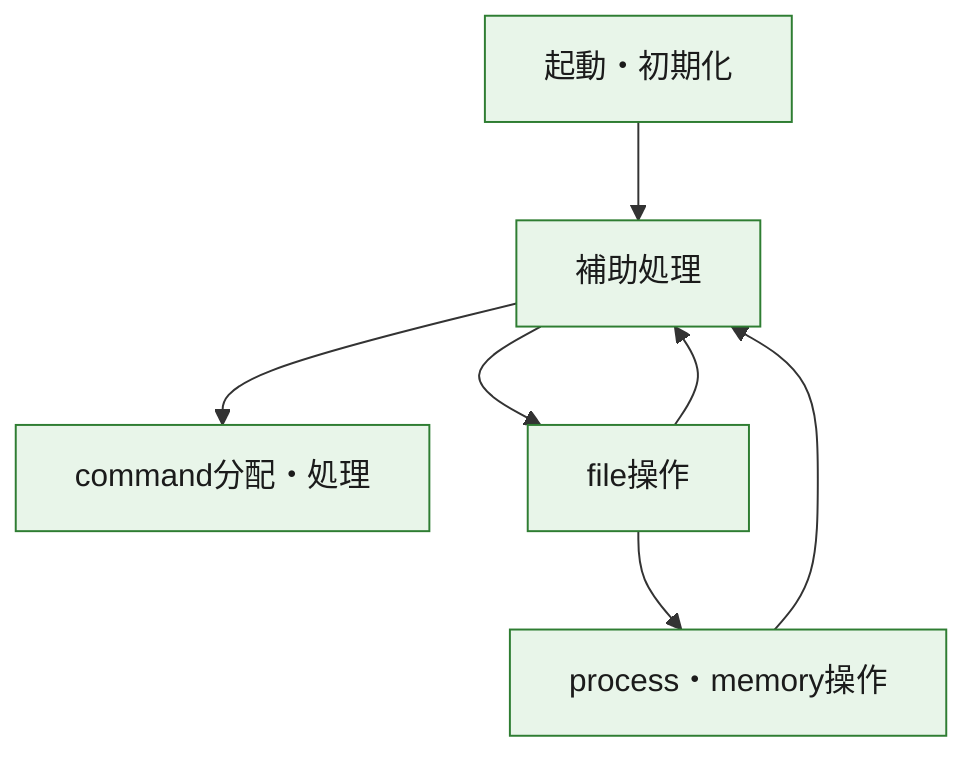
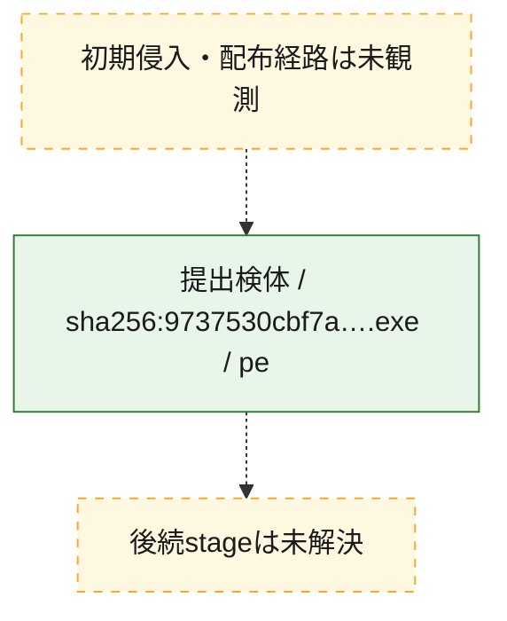
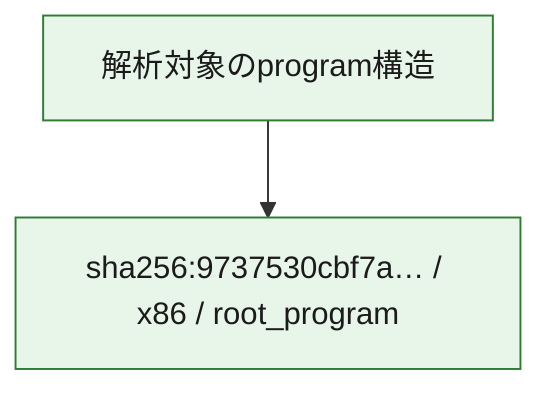

# 全体ロジック：9737530cbf7a92cf261dd1c875b8ee18cc32797aa5852eb4395ba06552dd7dd3

代表関数の静的証跡から、起動・初期化、process・memory操作、command分配・処理、file操作の処理群を確認しました。

## 読み方

- phaseの掲載順は解析上の整理順です。observed_call_edgesがない段階間の実行順を断定しません。
- 図の実線は静的に観測した関係、点線と黄色のノードは未観測・未解決の関係を示します。
- 図は静的な要約であり、動的実行を再現するものではありません。
- 詳細な関数解説とfingerprintは[STATIC-LOGIC.md](STATIC-LOGIC.md)を参照してください。

## 静的可視化

### 実行フロー

### 感染チェーン

### モジュール関係

## 処理段階

### 1. 起動・初期化

entry pointから初期化と後続処理への移行を確認します。
確度: `confirmed_static_function_evidence`

- `9737530cbf7a92cf261dd1c875b8ee18cc32797aa5852eb4395ba06552dd7dd3:ghidra:140001000` — 初期化と主要処理への分岐を行う入口関数です。 状態: `succeeded`、選定理由: `entry_point`, `meaningful_symbol_name`, `reviewed_call_centrality:1`, `role:entrypoint`, `small_program_complete_context`

### 2. process・memory操作

process、thread、module、memory操作と実行移行を確認します。
確度: `confirmed_static_function_evidence`

- `9737530cbf7a92cf261dd1c875b8ee18cc32797aa5852eb4395ba06552dd7dd3:ghidra:1400028d0` — process、thread、module、またはmemory操作に関係する関数です。 状態: `succeeded`、選定理由: `context_representative`, `reviewed_call_centrality:7`, `role:process_or_memory_operation`, `small_program_complete_context`
- `9737530cbf7a92cf261dd1c875b8ee18cc32797aa5852eb4395ba06552dd7dd3:ghidra:140004200` — process、thread、module、またはmemory操作に関係する関数です。 状態: `succeeded`、選定理由: `context_representative`, `reviewed_call_centrality:11`, `role:process_or_memory_operation`, `small_program_complete_context`

### 3. command分配・処理

受信commandやtaskの解釈、分配、個別handlerへの移行を確認します。
確度: `confirmed_static_function_evidence_with_limits`

- `9737530cbf7a92cf261dd1c875b8ee18cc32797aa5852eb4395ba06552dd7dd3:ghidra:140004ca0` — commandの解釈、分配、または個別処理を担当する関数です。 状態: `limited_bad_instruction_or_flow`、選定理由: `meaningful_symbol_name`, `reviewed_call_centrality:7`, `role:command_dispatch_or_handler`, `small_program_complete_context`

### 4. file操作

fileやdirectoryの作成、読書き、削除を確認します。
確度: `confirmed_static_function_evidence`

- `9737530cbf7a92cf261dd1c875b8ee18cc32797aa5852eb4395ba06552dd7dd3:ghidra:1400013e0` — fileまたはdirectoryの読書き・管理に関係する関数です。 状態: `succeeded`、選定理由: `context_representative`, `reviewed_call_centrality:36`, `role:file_operation`, `small_program_complete_context`

### 5. 補助処理

主要処理を支える一般内部関数またはlibrary処理を確認します。
確度: `confirmed_static_function_evidence_with_limits`

- `9737530cbf7a92cf261dd1c875b8ee18cc32797aa5852eb4395ba06552dd7dd3:ghidra:140001020` — 検体内部の一般処理を実装する関数です。 状態: `succeeded`、選定理由: `context_representative`, `reviewed_call_centrality:32`, `small_program_complete_context`
- `9737530cbf7a92cf261dd1c875b8ee18cc32797aa5852eb4395ba06552dd7dd3:ghidra:1400013a0` — 検体内部の一般処理を実装する関数です。 状態: `succeeded`、選定理由: `context_representative`, `reviewed_call_centrality:1`, `small_program_complete_context`
- `9737530cbf7a92cf261dd1c875b8ee18cc32797aa5852eb4395ba06552dd7dd3:ghidra:140002750` — 検体内部の一般処理を実装する関数です。 状態: `succeeded`、選定理由: `context_representative`, `reviewed_call_centrality:9`, `small_program_complete_context`
- `9737530cbf7a92cf261dd1c875b8ee18cc32797aa5852eb4395ba06552dd7dd3:ghidra:140002a20` — 検体内部の一般処理を実装する関数です。 状態: `succeeded`、選定理由: `context_representative`, `reviewed_call_centrality:1`, `small_program_complete_context`
- `9737530cbf7a92cf261dd1c875b8ee18cc32797aa5852eb4395ba06552dd7dd3:ghidra:140002a70` — 検体内部の一般処理を実装する関数です。 状態: `succeeded`、選定理由: `context_representative`, `reviewed_call_centrality:5`, `small_program_complete_context`
- `9737530cbf7a92cf261dd1c875b8ee18cc32797aa5852eb4395ba06552dd7dd3:ghidra:140002b50` — 検体内部の一般処理を実装する関数です。 状態: `succeeded`、選定理由: `context_representative`, `reviewed_call_centrality:11`, `small_program_complete_context`
- `9737530cbf7a92cf261dd1c875b8ee18cc32797aa5852eb4395ba06552dd7dd3:ghidra:140003ac0` — compiler生成処理または汎用library処理とみられる関数です。 状態: `succeeded`、選定理由: `entry_point`, `meaningful_symbol_name`, `reviewed_call_centrality:3`, `small_program_complete_context`
- `9737530cbf7a92cf261dd1c875b8ee18cc32797aa5852eb4395ba06552dd7dd3:ghidra:140003b60` — 検体内部の一般処理を実装する関数です。 状態: `succeeded`、選定理由: `context_representative`, `reviewed_call_centrality:1`, `small_program_complete_context`
- `9737530cbf7a92cf261dd1c875b8ee18cc32797aa5852eb4395ba06552dd7dd3:ghidra:140003bb0` — 検体内部の一般処理を実装する関数です。 状態: `limited_bad_instruction_or_flow`、選定理由: `context_representative`, `reviewed_call_centrality:3`, `small_program_complete_context`
- `9737530cbf7a92cf261dd1c875b8ee18cc32797aa5852eb4395ba06552dd7dd3:ghidra:140003c20` — 検体内部の一般処理を実装する関数です。 状態: `limited_bad_instruction_or_flow`、選定理由: `context_representative`, `reviewed_call_centrality:5`, `small_program_complete_context`
- `9737530cbf7a92cf261dd1c875b8ee18cc32797aa5852eb4395ba06552dd7dd3:ghidra:140003cb0` — 検体内部の一般処理を実装する関数です。 状態: `limited_bad_instruction_or_flow`、選定理由: `context_representative`, `reviewed_call_centrality:3`, `small_program_complete_context`
- `9737530cbf7a92cf261dd1c875b8ee18cc32797aa5852eb4395ba06552dd7dd3:ghidra:140003e10` — 検体内部の一般処理を実装する関数です。 状態: `succeeded`、選定理由: `context_representative`, `reviewed_call_centrality:1`, `small_program_complete_context`
- `9737530cbf7a92cf261dd1c875b8ee18cc32797aa5852eb4395ba06552dd7dd3:ghidra:140003e80` — 検体内部の一般処理を実装する関数です。 状態: `succeeded`、選定理由: `context_representative`, `reviewed_call_centrality:2`, `small_program_complete_context`
- `9737530cbf7a92cf261dd1c875b8ee18cc32797aa5852eb4395ba06552dd7dd3:ghidra:140003ef0` — 検体内部の一般処理を実装する関数です。 状態: `succeeded`、選定理由: `context_representative`, `reviewed_call_centrality:4`, `small_program_complete_context`
- `9737530cbf7a92cf261dd1c875b8ee18cc32797aa5852eb4395ba06552dd7dd3:ghidra:1400043a0` — 検体内部の一般処理を実装する関数です。 状態: `succeeded`、選定理由: `context_representative`, `reviewed_call_centrality:6`, `small_program_complete_context`
- `9737530cbf7a92cf261dd1c875b8ee18cc32797aa5852eb4395ba06552dd7dd3:ghidra:140004410` — 検体内部の一般処理を実装する関数です。 状態: `succeeded`、選定理由: `context_representative`, `reviewed_call_centrality:8`, `small_program_complete_context`
- `9737530cbf7a92cf261dd1c875b8ee18cc32797aa5852eb4395ba06552dd7dd3:ghidra:140004520` — 検体内部の一般処理を実装する関数です。 状態: `succeeded`、選定理由: `meaningful_symbol_name`, `small_program_complete_context`
- `9737530cbf7a92cf261dd1c875b8ee18cc32797aa5852eb4395ba06552dd7dd3:ghidra:140004530` — 検体内部の一般処理を実装する関数です。 状態: `succeeded`、選定理由: `context_representative`, `reviewed_call_centrality:7`, `small_program_complete_context`
- `9737530cbf7a92cf261dd1c875b8ee18cc32797aa5852eb4395ba06552dd7dd3:ghidra:1400045b0` — 検体内部の一般処理を実装する関数です。 状態: `succeeded`、選定理由: `context_representative`, `reviewed_call_centrality:5`, `small_program_complete_context`
- `9737530cbf7a92cf261dd1c875b8ee18cc32797aa5852eb4395ba06552dd7dd3:ghidra:1400045e0` — 検体内部の一般処理を実装する関数です。 状態: `succeeded`、選定理由: `context_representative`, `reviewed_call_centrality:5`, `small_program_complete_context`
- `9737530cbf7a92cf261dd1c875b8ee18cc32797aa5852eb4395ba06552dd7dd3:ghidra:140004650` — 検体内部の一般処理を実装する関数です。 状態: `succeeded`、選定理由: `context_representative`, `reviewed_call_centrality:5`, `small_program_complete_context`
- `9737530cbf7a92cf261dd1c875b8ee18cc32797aa5852eb4395ba06552dd7dd3:ghidra:1400046e0` — 検体内部の一般処理を実装する関数です。 状態: `succeeded`、選定理由: `context_representative`, `reviewed_call_centrality:15`, `small_program_complete_context`
- `9737530cbf7a92cf261dd1c875b8ee18cc32797aa5852eb4395ba06552dd7dd3:ghidra:140004880` — 検体内部の一般処理を実装する関数です。 状態: `succeeded`、選定理由: `context_representative`, `reviewed_call_centrality:5`, `small_program_complete_context`
- `9737530cbf7a92cf261dd1c875b8ee18cc32797aa5852eb4395ba06552dd7dd3:ghidra:140004940` — 検体内部の一般処理を実装する関数です。 状態: `succeeded`、選定理由: `context_representative`, `reviewed_call_centrality:2`, `small_program_complete_context`
- `9737530cbf7a92cf261dd1c875b8ee18cc32797aa5852eb4395ba06552dd7dd3:ghidra:140004ba0` — 検体内部の一般処理を実装する関数です。 状態: `succeeded`、選定理由: `context_representative`, `reviewed_call_centrality:1`, `small_program_complete_context`
- `9737530cbf7a92cf261dd1c875b8ee18cc32797aa5852eb4395ba06552dd7dd3:ghidra:140004c60` — 検体内部の一般処理を実装する関数です。 状態: `succeeded`、選定理由: `context_representative`, `reviewed_call_centrality:3`, `small_program_complete_context`

## 観測したcall関係

- `9737530cbf7a92cf261dd1c875b8ee18cc32797aa5852eb4395ba06552dd7dd3:ghidra:140001000` → `9737530cbf7a92cf261dd1c875b8ee18cc32797aa5852eb4395ba06552dd7dd3:ghidra:140001020` （`startup` → `support`）
- `9737530cbf7a92cf261dd1c875b8ee18cc32797aa5852eb4395ba06552dd7dd3:ghidra:140001020` → `9737530cbf7a92cf261dd1c875b8ee18cc32797aa5852eb4395ba06552dd7dd3:ghidra:140003c20` （`support` → `support`）
- `9737530cbf7a92cf261dd1c875b8ee18cc32797aa5852eb4395ba06552dd7dd3:ghidra:140001020` → `9737530cbf7a92cf261dd1c875b8ee18cc32797aa5852eb4395ba06552dd7dd3:ghidra:140003ef0` （`support` → `support`）
- `9737530cbf7a92cf261dd1c875b8ee18cc32797aa5852eb4395ba06552dd7dd3:ghidra:140001020` → `9737530cbf7a92cf261dd1c875b8ee18cc32797aa5852eb4395ba06552dd7dd3:ghidra:140004410` （`support` → `support`）
- `9737530cbf7a92cf261dd1c875b8ee18cc32797aa5852eb4395ba06552dd7dd3:ghidra:140001020` → `9737530cbf7a92cf261dd1c875b8ee18cc32797aa5852eb4395ba06552dd7dd3:ghidra:140004530` （`support` → `support`）
- `9737530cbf7a92cf261dd1c875b8ee18cc32797aa5852eb4395ba06552dd7dd3:ghidra:140001020` → `9737530cbf7a92cf261dd1c875b8ee18cc32797aa5852eb4395ba06552dd7dd3:ghidra:1400045b0` （`support` → `support`）
- `9737530cbf7a92cf261dd1c875b8ee18cc32797aa5852eb4395ba06552dd7dd3:ghidra:140001020` → `9737530cbf7a92cf261dd1c875b8ee18cc32797aa5852eb4395ba06552dd7dd3:ghidra:140004ca0` （`support` → `dispatch`）
- `9737530cbf7a92cf261dd1c875b8ee18cc32797aa5852eb4395ba06552dd7dd3:ghidra:1400013a0` → `9737530cbf7a92cf261dd1c875b8ee18cc32797aa5852eb4395ba06552dd7dd3:ghidra:140001020` （`support` → `support`）
- `9737530cbf7a92cf261dd1c875b8ee18cc32797aa5852eb4395ba06552dd7dd3:ghidra:1400013e0` → `9737530cbf7a92cf261dd1c875b8ee18cc32797aa5852eb4395ba06552dd7dd3:ghidra:140002750` （`file_activity` → `support`）
- `9737530cbf7a92cf261dd1c875b8ee18cc32797aa5852eb4395ba06552dd7dd3:ghidra:1400013e0` → `9737530cbf7a92cf261dd1c875b8ee18cc32797aa5852eb4395ba06552dd7dd3:ghidra:1400028d0` （`file_activity` → `execution`）
- `9737530cbf7a92cf261dd1c875b8ee18cc32797aa5852eb4395ba06552dd7dd3:ghidra:1400013e0` → `9737530cbf7a92cf261dd1c875b8ee18cc32797aa5852eb4395ba06552dd7dd3:ghidra:140002a70` （`file_activity` → `support`）
- `9737530cbf7a92cf261dd1c875b8ee18cc32797aa5852eb4395ba06552dd7dd3:ghidra:1400028d0` → `9737530cbf7a92cf261dd1c875b8ee18cc32797aa5852eb4395ba06552dd7dd3:ghidra:140002a20` （`execution` → `support`）
- `9737530cbf7a92cf261dd1c875b8ee18cc32797aa5852eb4395ba06552dd7dd3:ghidra:140003b60` → `9737530cbf7a92cf261dd1c875b8ee18cc32797aa5852eb4395ba06552dd7dd3:ghidra:140004ca0` （`support` → `dispatch`）
- `9737530cbf7a92cf261dd1c875b8ee18cc32797aa5852eb4395ba06552dd7dd3:ghidra:140003bb0` → `9737530cbf7a92cf261dd1c875b8ee18cc32797aa5852eb4395ba06552dd7dd3:ghidra:140004ca0` （`support` → `dispatch`）
- `9737530cbf7a92cf261dd1c875b8ee18cc32797aa5852eb4395ba06552dd7dd3:ghidra:140003c20` → `9737530cbf7a92cf261dd1c875b8ee18cc32797aa5852eb4395ba06552dd7dd3:ghidra:140004ca0` （`support` → `dispatch`）
- `9737530cbf7a92cf261dd1c875b8ee18cc32797aa5852eb4395ba06552dd7dd3:ghidra:140003cb0` → `9737530cbf7a92cf261dd1c875b8ee18cc32797aa5852eb4395ba06552dd7dd3:ghidra:140004ca0` （`support` → `dispatch`）
- `9737530cbf7a92cf261dd1c875b8ee18cc32797aa5852eb4395ba06552dd7dd3:ghidra:140003e10` → `9737530cbf7a92cf261dd1c875b8ee18cc32797aa5852eb4395ba06552dd7dd3:ghidra:140004ca0` （`support` → `dispatch`）
- `9737530cbf7a92cf261dd1c875b8ee18cc32797aa5852eb4395ba06552dd7dd3:ghidra:140003e80` → `9737530cbf7a92cf261dd1c875b8ee18cc32797aa5852eb4395ba06552dd7dd3:ghidra:140004880` （`support` → `support`）
- `9737530cbf7a92cf261dd1c875b8ee18cc32797aa5852eb4395ba06552dd7dd3:ghidra:140004200` → `9737530cbf7a92cf261dd1c875b8ee18cc32797aa5852eb4395ba06552dd7dd3:ghidra:1400043a0` （`execution` → `support`）
- `9737530cbf7a92cf261dd1c875b8ee18cc32797aa5852eb4395ba06552dd7dd3:ghidra:1400043a0` → `9737530cbf7a92cf261dd1c875b8ee18cc32797aa5852eb4395ba06552dd7dd3:ghidra:140004880` （`support` → `support`）
- `9737530cbf7a92cf261dd1c875b8ee18cc32797aa5852eb4395ba06552dd7dd3:ghidra:1400043a0` → `9737530cbf7a92cf261dd1c875b8ee18cc32797aa5852eb4395ba06552dd7dd3:ghidra:140004c60` （`support` → `support`）
- `9737530cbf7a92cf261dd1c875b8ee18cc32797aa5852eb4395ba06552dd7dd3:ghidra:140004410` → `9737530cbf7a92cf261dd1c875b8ee18cc32797aa5852eb4395ba06552dd7dd3:ghidra:1400013e0` （`support` → `file_activity`）
- `9737530cbf7a92cf261dd1c875b8ee18cc32797aa5852eb4395ba06552dd7dd3:ghidra:140004410` → `9737530cbf7a92cf261dd1c875b8ee18cc32797aa5852eb4395ba06552dd7dd3:ghidra:140003c20` （`support` → `support`）
- `9737530cbf7a92cf261dd1c875b8ee18cc32797aa5852eb4395ba06552dd7dd3:ghidra:1400045b0` → `9737530cbf7a92cf261dd1c875b8ee18cc32797aa5852eb4395ba06552dd7dd3:ghidra:140004880` （`support` → `support`）
- `9737530cbf7a92cf261dd1c875b8ee18cc32797aa5852eb4395ba06552dd7dd3:ghidra:1400046e0` → `9737530cbf7a92cf261dd1c875b8ee18cc32797aa5852eb4395ba06552dd7dd3:ghidra:140004ca0` （`support` → `dispatch`）
- `ghidra-function:06d0c08c8ef9161dd384aabf` → `ghidra-function:e38db7feeb4fab40feedba09` （`unclassified` → `unclassified`）
- `ghidra-function:1387d4b47fd82bf47e76a405` → `ghidra-external:9c91539f13c34744bdc6d9e0` （`unclassified` → `unclassified`）
- `ghidra-function:1387d4b47fd82bf47e76a405` → `ghidra-external:a34e6cfdec1517de073f2a06` （`unclassified` → `unclassified`）
- `ghidra-function:1c784dbf743e3fa2899ab9fd` → `ghidra-external:0e228125525f8d30724f01b2` （`unclassified` → `unclassified`）
- `ghidra-function:1c784dbf743e3fa2899ab9fd` → `ghidra-external:53ce4fb260dbef6962b4156f` （`unclassified` → `unclassified`）
- `ghidra-function:1c784dbf743e3fa2899ab9fd` → `ghidra-external:80eecc0ee6f24cca9c8615bc` （`unclassified` → `unclassified`）
- `ghidra-function:1c784dbf743e3fa2899ab9fd` → `ghidra-external:9cada631e6f53524bc106a2c` （`unclassified` → `unclassified`）
- `ghidra-function:1c784dbf743e3fa2899ab9fd` → `ghidra-external:a7c5a61bbfcdcaaba9cc35bb` （`unclassified` → `unclassified`）
- `ghidra-function:1c784dbf743e3fa2899ab9fd` → `ghidra-external:eb908c35ef44cca9a5c73fa7` （`unclassified` → `unclassified`）
- `ghidra-function:2230d26dadff2f22873cbcb1` → `ghidra-external:0cd4e32823110102b142f4c5` （`unclassified` → `unclassified`）
- `ghidra-function:2230d26dadff2f22873cbcb1` → `ghidra-external:3669586572e5d4dd9478edcd` （`unclassified` → `unclassified`）
- `ghidra-function:2230d26dadff2f22873cbcb1` → `ghidra-external:373eb50b5f27f1bf2c1fe9af` （`unclassified` → `unclassified`）
- `ghidra-function:2230d26dadff2f22873cbcb1` → `ghidra-external:4bb46ac08c5d658e4cc73701` （`unclassified` → `unclassified`）
- `ghidra-function:2230d26dadff2f22873cbcb1` → `ghidra-external:7263feef2f7b2fa627c4603c` （`unclassified` → `unclassified`）
- `ghidra-function:2230d26dadff2f22873cbcb1` → `ghidra-external:8ead4be5559d4e0cc093e52b` （`unclassified` → `unclassified`）
- `ghidra-function:2230d26dadff2f22873cbcb1` → `ghidra-external:d4c545fdb8d7f9ee271604b3` （`unclassified` → `unclassified`）
- `ghidra-function:2230d26dadff2f22873cbcb1` → `ghidra-external:d90d9a3f4ed5504abd011cfe` （`unclassified` → `unclassified`）
- `ghidra-function:3216aeb4eaa35e64d9e38191` → `ghidra-external:8ead4be5559d4e0cc093e52b` （`unclassified` → `unclassified`）
- `ghidra-function:3216aeb4eaa35e64d9e38191` → `ghidra-external:cc45db1f860db2acd63b0e15` （`unclassified` → `unclassified`）
- `ghidra-function:3216aeb4eaa35e64d9e38191` → `ghidra-function:0da841ec9965de4d283bb66f` （`unclassified` → `unclassified`）
- `ghidra-function:3216aeb4eaa35e64d9e38191` → `ghidra-function:1bee261c2d897e4a030241b8` （`unclassified` → `unclassified`）
- `ghidra-function:3216aeb4eaa35e64d9e38191` → `ghidra-function:8f9ff3af1abed83780e9fe0a` （`unclassified` → `unclassified`）
- `ghidra-function:3216aeb4eaa35e64d9e38191` → `ghidra-function:9dc521b681526c8a69390bfc` （`unclassified` → `unclassified`）
- `ghidra-function:3216aeb4eaa35e64d9e38191` → `ghidra-function:a42b4d39595e3c2e8c862fa6` （`unclassified` → `unclassified`）
- `ghidra-function:3216aeb4eaa35e64d9e38191` → `ghidra-function:e38db7feeb4fab40feedba09` （`unclassified` → `unclassified`）
- `ghidra-function:3216aeb4eaa35e64d9e38191` → `ghidra-function:e771ce1f0aed7779fc562ea0` （`unclassified` → `unclassified`）
- `ghidra-function:47da401779ee896d96176e08` → `ghidra-external:51885c0d42f73ce29c7716c3` （`unclassified` → `unclassified`）
- `ghidra-function:47da401779ee896d96176e08` → `ghidra-external:e3d8bebb717bded398cd65de` （`unclassified` → `unclassified`）
- `ghidra-function:539a036036c692c415e1bc41` → `ghidra-external:0cd4e32823110102b142f4c5` （`unclassified` → `unclassified`）
- `ghidra-function:539a036036c692c415e1bc41` → `ghidra-external:4bb46ac08c5d658e4cc73701` （`unclassified` → `unclassified`）
- `ghidra-function:539a036036c692c415e1bc41` → `ghidra-external:5112598c9bc9eb7ccd7e6c91` （`unclassified` → `unclassified`）
- `ghidra-function:539a036036c692c415e1bc41` → `ghidra-external:815ee6fb0d5dcd72d3162090` （`unclassified` → `unclassified`）
- `ghidra-function:539a036036c692c415e1bc41` → `ghidra-external:8ead4be5559d4e0cc093e52b` （`unclassified` → `unclassified`）
- `ghidra-function:539a036036c692c415e1bc41` → `ghidra-external:a9de9183aee0606046888813` （`unclassified` → `unclassified`）
- `ghidra-function:539a036036c692c415e1bc41` → `ghidra-external:d4c545fdb8d7f9ee271604b3` （`unclassified` → `unclassified`）
- `ghidra-function:539a036036c692c415e1bc41` → `ghidra-external:d694bc068eae91a50c6e6f67` （`unclassified` → `unclassified`）
- `ghidra-function:539a036036c692c415e1bc41` → `ghidra-function:2230d26dadff2f22873cbcb1` （`unclassified` → `unclassified`）
- `ghidra-function:539a036036c692c415e1bc41` → `ghidra-function:5703ccf5d09fcf5396a7f89c` （`unclassified` → `unclassified`）
- `ghidra-function:539a036036c692c415e1bc41` → `ghidra-function:63aef12f2b52320b68c65c4d` （`unclassified` → `unclassified`）
- `ghidra-function:539a036036c692c415e1bc41` → `ghidra-function:742e958190b6f9c4bf208109` （`unclassified` → `unclassified`）
- `ghidra-function:539a036036c692c415e1bc41` → `ghidra-function:7e6c4a1675109d7adabe66e2` （`unclassified` → `unclassified`）
- `ghidra-function:539a036036c692c415e1bc41` → `ghidra-function:8d6e1a4712f1bdfe29f2f5e6` （`unclassified` → `unclassified`）
- `ghidra-function:539a036036c692c415e1bc41` → `ghidra-function:8ffbe01f056f8d5c29a9dd4f` （`unclassified` → `unclassified`）
- `ghidra-function:539a036036c692c415e1bc41` → `ghidra-function:9f02b88e40eddde1618abd43` （`unclassified` → `unclassified`）
- `ghidra-function:539a036036c692c415e1bc41` → `ghidra-function:d9856179c592a5670cfb12d4` （`unclassified` → `unclassified`）
- `ghidra-function:539a036036c692c415e1bc41` → `ghidra-function:da6f1d1342564bea65d5b8c9` （`unclassified` → `unclassified`）
- `ghidra-function:539a036036c692c415e1bc41` → `ghidra-function:e2ca64e85da09c548a3fb117` （`unclassified` → `unclassified`）
- `ghidra-function:539a036036c692c415e1bc41` → `ghidra-function:eba922979aac32f51d02fe6a` （`unclassified` → `unclassified`）
- `ghidra-function:539a036036c692c415e1bc41` → `ghidra-function:ec732aa915767a27ee8eeae8` （`unclassified` → `unclassified`）
- `ghidra-function:539a036036c692c415e1bc41` → `ghidra-function:eddcae71b2b024befe5b6d59` （`unclassified` → `unclassified`）
- `ghidra-function:539a036036c692c415e1bc41` → `ghidra-function:f6ea878621205a095be059c0` （`unclassified` → `unclassified`）
- `ghidra-function:5f93a09e9054d336b390937a` → `ghidra-function:e38db7feeb4fab40feedba09` （`unclassified` → `unclassified`）
- `ghidra-function:6ae115d7f00137a37f59cf26` → `ghidra-external:ad9126cd2bd6b82405451bc9` （`unclassified` → `unclassified`）
- `ghidra-function:6ae115d7f00137a37f59cf26` → `ghidra-external:cc45db1f860db2acd63b0e15` （`unclassified` → `unclassified`）
- `ghidra-function:6ae115d7f00137a37f59cf26` → `ghidra-function:e38db7feeb4fab40feedba09` （`unclassified` → `unclassified`）
- `ghidra-function:708d81c8d231d20cc5edcdf0` → `ghidra-external:5112598c9bc9eb7ccd7e6c91` （`unclassified` → `unclassified`）
- `ghidra-function:708d81c8d231d20cc5edcdf0` → `ghidra-external:85e228d68df6135c40ff7bea` （`unclassified` → `unclassified`）
- `ghidra-function:708d81c8d231d20cc5edcdf0` → `ghidra-external:88f491311ca918a47a41fe58` （`unclassified` → `unclassified`）
- `ghidra-function:742e958190b6f9c4bf208109` → `ghidra-external:d694bc068eae91a50c6e6f67` （`unclassified` → `unclassified`）
- `ghidra-function:742e958190b6f9c4bf208109` → `ghidra-function:066c6f89de28b532bb8f3134` （`unclassified` → `unclassified`）
- `ghidra-function:742e958190b6f9c4bf208109` → `ghidra-function:8608444395e4d3c253ff022a` （`unclassified` → `unclassified`）
- `ghidra-function:742e958190b6f9c4bf208109` → `ghidra-function:97517e1b950b037e92dad723` （`unclassified` → `unclassified`）
- `ghidra-function:7662797c0b4f7e80e9deec94` → `ghidra-external:8ead4be5559d4e0cc093e52b` （`unclassified` → `unclassified`）
- `ghidra-function:7662797c0b4f7e80e9deec94` → `ghidra-function:8f9ff3af1abed83780e9fe0a` （`unclassified` → `unclassified`）
- `ghidra-function:7662797c0b4f7e80e9deec94` → `ghidra-function:a42b4d39595e3c2e8c862fa6` （`unclassified` → `unclassified`）
- `ghidra-function:87d83d1d648dd7745e0a1884` → `ghidra-external:85e228d68df6135c40ff7bea` （`unclassified` → `unclassified`）
- `ghidra-function:87d83d1d648dd7745e0a1884` → `ghidra-function:1bee261c2d897e4a030241b8` （`unclassified` → `unclassified`）
- `ghidra-function:8e4e7c397b0dc1c6dea625c5` → `ghidra-external:3a1136524b6f1eb9fbd72427` （`unclassified` → `unclassified`）
- `ghidra-function:8e4e7c397b0dc1c6dea625c5` → `ghidra-external:4bb46ac08c5d658e4cc73701` （`unclassified` → `unclassified`）
- `ghidra-function:8e4e7c397b0dc1c6dea625c5` → `ghidra-external:b8a637a05fc8fe29813a231f` （`unclassified` → `unclassified`）
- `ghidra-function:8e4e7c397b0dc1c6dea625c5` → `ghidra-external:d60fdcf0ff3200b4097f0cac` （`unclassified` → `unclassified`）
- `ghidra-function:8e4e7c397b0dc1c6dea625c5` → `ghidra-function:57e800911ab7aec65b1b6447` （`unclassified` → `unclassified`）
- `ghidra-function:8e4e7c397b0dc1c6dea625c5` → `ghidra-function:9e73cbf61b20e6d55670a31b` （`unclassified` → `unclassified`）
- `ghidra-function:8e4e7c397b0dc1c6dea625c5` → `ghidra-function:e771ce1f0aed7779fc562ea0` （`unclassified` → `unclassified`）
- `ghidra-function:8e4e7c397b0dc1c6dea625c5` → `ghidra-function:f3a9d6c911917d49bcd74123` （`unclassified` → `unclassified`）
- `ghidra-function:9420262d9e230033c02473fb` → `ghidra-external:fd4e0e4652a04f32ae0f801c` （`unclassified` → `unclassified`）
- `ghidra-function:9420262d9e230033c02473fb` → `ghidra-function:8f9ff3af1abed83780e9fe0a` （`unclassified` → `unclassified`）
- `ghidra-function:9420262d9e230033c02473fb` → `ghidra-function:a42b4d39595e3c2e8c862fa6` （`unclassified` → `unclassified`）
- `ghidra-function:972b26586aafcb3b2e70840f` → `ghidra-external:03688565a626865bef3bb0b8` （`unclassified` → `unclassified`）
- `ghidra-function:972b26586aafcb3b2e70840f` → `ghidra-external:0cd4e32823110102b142f4c5` （`unclassified` → `unclassified`）
- `ghidra-function:972b26586aafcb3b2e70840f` → `ghidra-external:291a3f0a34532b7044ae8d50` （`unclassified` → `unclassified`）
- `ghidra-function:972b26586aafcb3b2e70840f` → `ghidra-external:3a1136524b6f1eb9fbd72427` （`unclassified` → `unclassified`）
- `ghidra-function:972b26586aafcb3b2e70840f` → `ghidra-external:3b05159f5b46cb8a7a8a764a` （`unclassified` → `unclassified`）
- `ghidra-function:972b26586aafcb3b2e70840f` → `ghidra-external:4bb46ac08c5d658e4cc73701` （`unclassified` → `unclassified`）
- `ghidra-function:972b26586aafcb3b2e70840f` → `ghidra-external:748d05c08c194075dad9c876` （`unclassified` → `unclassified`）
- `ghidra-function:972b26586aafcb3b2e70840f` → `ghidra-external:81210c92b6a326100fe5bc5b` （`unclassified` → `unclassified`）
- `ghidra-function:972b26586aafcb3b2e70840f` → `ghidra-external:85e228d68df6135c40ff7bea` （`unclassified` → `unclassified`）
- `ghidra-function:972b26586aafcb3b2e70840f` → `ghidra-external:a0d041c4a8f51e26712c0580` （`unclassified` → `unclassified`）
- `ghidra-function:972b26586aafcb3b2e70840f` → `ghidra-external:a5c79828309ea54c4d432bdb` （`unclassified` → `unclassified`）
- `ghidra-function:972b26586aafcb3b2e70840f` → `ghidra-external:a712631b528c1c7b672bb94b` （`unclassified` → `unclassified`）
- `ghidra-function:972b26586aafcb3b2e70840f` → `ghidra-external:ab7b8e080ae8deea53470f53` （`unclassified` → `unclassified`）
- `ghidra-function:972b26586aafcb3b2e70840f` → `ghidra-external:b0c40ba15cb2aa5b54ea108f` （`unclassified` → `unclassified`）
- `ghidra-function:972b26586aafcb3b2e70840f` → `ghidra-external:bf06ad323c6422c05fc3c4f4` （`unclassified` → `unclassified`）
- `ghidra-function:972b26586aafcb3b2e70840f` → `ghidra-external:bf2c560befb07633d4acc84c` （`unclassified` → `unclassified`）
- `ghidra-function:972b26586aafcb3b2e70840f` → `ghidra-external:ca7786413b7d3a22d3792263` （`unclassified` → `unclassified`）
- `ghidra-function:972b26586aafcb3b2e70840f` → `ghidra-external:cc45db1f860db2acd63b0e15` （`unclassified` → `unclassified`）
- `ghidra-function:972b26586aafcb3b2e70840f` → `ghidra-external:e3d8bebb717bded398cd65de` （`unclassified` → `unclassified`）
- `ghidra-function:972b26586aafcb3b2e70840f` → `ghidra-external:fb564b414d0da72baf20a126` （`unclassified` → `unclassified`）
- `ghidra-function:972b26586aafcb3b2e70840f` → `ghidra-function:1c784dbf743e3fa2899ab9fd` （`unclassified` → `unclassified`）
- `ghidra-function:972b26586aafcb3b2e70840f` → `ghidra-function:708d81c8d231d20cc5edcdf0` （`unclassified` → `unclassified`）
- `ghidra-function:972b26586aafcb3b2e70840f` → `ghidra-function:ac8c56e185e76f5969b5048a` （`unclassified` → `unclassified`）
- `ghidra-function:972b26586aafcb3b2e70840f` → `ghidra-function:bda176ddaf04a1fcec5c7ea1` （`unclassified` → `unclassified`）
- `ghidra-function:972b26586aafcb3b2e70840f` → `ghidra-function:e36f51c790d6af0319b4704b` （`unclassified` → `unclassified`）
- `ghidra-function:972b26586aafcb3b2e70840f` → `ghidra-function:e38db7feeb4fab40feedba09` （`unclassified` → `unclassified`）
- `ghidra-function:972b26586aafcb3b2e70840f` → `ghidra-function:eba922979aac32f51d02fe6a` （`unclassified` → `unclassified`）
- `ghidra-function:972b26586aafcb3b2e70840f` → `ghidra-function:f93cff098f32fb4e7eecacfd` （`unclassified` → `unclassified`）
- `ghidra-function:9e73cbf61b20e6d55670a31b` → `ghidra-external:3a1136524b6f1eb9fbd72427` （`unclassified` → `unclassified`）
- `ghidra-function:9e73cbf61b20e6d55670a31b` → `ghidra-external:40acd1653fe7e417101f7716` （`unclassified` → `unclassified`）
- `ghidra-function:9e73cbf61b20e6d55670a31b` → `ghidra-external:751f5618b982dade963256f4` （`unclassified` → `unclassified`）
- `ghidra-function:9e73cbf61b20e6d55670a31b` → `ghidra-function:1387d4b47fd82bf47e76a405` （`unclassified` → `unclassified`）
- `ghidra-function:9e73cbf61b20e6d55670a31b` → `ghidra-function:c878ea4c69d455c07fbfe6a9` （`unclassified` → `unclassified`）
- `ghidra-function:9f02b88e40eddde1618abd43` → `ghidra-function:14fd6ebdbcc06f3884388fa6` （`unclassified` → `unclassified`）
- `ghidra-function:9f02b88e40eddde1618abd43` → `ghidra-function:eddcae71b2b024befe5b6d59` （`unclassified` → `unclassified`）
- `ghidra-function:a3f04f7974c5d65c5f3eafbf` → `ghidra-external:751f5618b982dade963256f4` （`unclassified` → `unclassified`）
- `ghidra-function:a3f04f7974c5d65c5f3eafbf` → `ghidra-function:1387d4b47fd82bf47e76a405` （`unclassified` → `unclassified`）
- `ghidra-function:b6ccc519693243ad62696233` → `ghidra-function:972b26586aafcb3b2e70840f` （`unclassified` → `unclassified`）
- `ghidra-function:bda176ddaf04a1fcec5c7ea1` → `ghidra-external:3a1136524b6f1eb9fbd72427` （`unclassified` → `unclassified`）
- `ghidra-function:bda176ddaf04a1fcec5c7ea1` → `ghidra-external:751f5618b982dade963256f4` （`unclassified` → `unclassified`）
- `ghidra-function:bda176ddaf04a1fcec5c7ea1` → `ghidra-external:7cbb80706cf8834378d8037d` （`unclassified` → `unclassified`）
- `ghidra-function:bda176ddaf04a1fcec5c7ea1` → `ghidra-function:1387d4b47fd82bf47e76a405` （`unclassified` → `unclassified`）
- `ghidra-function:c878ea4c69d455c07fbfe6a9` → `ghidra-external:9c91539f13c34744bdc6d9e0` （`unclassified` → `unclassified`）
- `ghidra-function:c878ea4c69d455c07fbfe6a9` → `ghidra-external:a34e6cfdec1517de073f2a06` （`unclassified` → `unclassified`）
- `ghidra-function:e08f49602909496df24169a9` → `ghidra-external:e3d8bebb717bded398cd65de` （`unclassified` → `unclassified`）
- `ghidra-function:e08f49602909496df24169a9` → `ghidra-function:014e93b398885bbd2d329b06` （`unclassified` → `unclassified`）
- `ghidra-function:e08f49602909496df24169a9` → `ghidra-function:3a58331b71e796faf18ffe46` （`unclassified` → `unclassified`）
- `ghidra-function:e08f49602909496df24169a9` → `ghidra-function:5a7c1c3e9051c922e397b061` （`unclassified` → `unclassified`）
- `ghidra-function:e08f49602909496df24169a9` → `ghidra-function:8ffbe01f056f8d5c29a9dd4f` （`unclassified` → `unclassified`）
- `ghidra-function:e08f49602909496df24169a9` → `ghidra-function:cfc1e83dc747528df6a87da6` （`unclassified` → `unclassified`）
- `ghidra-function:e36f51c790d6af0319b4704b` → `ghidra-external:2dbdb64c72d83466b06f75f6` （`unclassified` → `unclassified`）
- `ghidra-function:e36f51c790d6af0319b4704b` → `ghidra-function:539a036036c692c415e1bc41` （`unclassified` → `unclassified`）
- `ghidra-function:e36f51c790d6af0319b4704b` → `ghidra-function:5bc290f8869c80c895aef468` （`unclassified` → `unclassified`）
- `ghidra-function:e36f51c790d6af0319b4704b` → `ghidra-function:ade659477997c60702a82466` （`unclassified` → `unclassified`）
- `ghidra-function:e36f51c790d6af0319b4704b` → `ghidra-function:f93cff098f32fb4e7eecacfd` （`unclassified` → `unclassified`）
- `ghidra-function:f0989754004d89b071b30ae2` → `ghidra-external:85e228d68df6135c40ff7bea` （`unclassified` → `unclassified`）
- `ghidra-function:f3361563297fe67a743e97f8` → `ghidra-function:972b26586aafcb3b2e70840f` （`unclassified` → `unclassified`）
- `ghidra-function:f5ce79c338c0060222e2a59a` → `ghidra-function:c6bf0217987122b369b12ed2` （`unclassified` → `unclassified`）
- `ghidra-function:f5ce79c338c0060222e2a59a` → `ghidra-function:e38db7feeb4fab40feedba09` （`unclassified` → `unclassified`）
- `ghidra-function:f93cff098f32fb4e7eecacfd` → `ghidra-function:c6bf0217987122b369b12ed2` （`unclassified` → `unclassified`）
- `ghidra-function:f93cff098f32fb4e7eecacfd` → `ghidra-function:e38db7feeb4fab40feedba09` （`unclassified` → `unclassified`）

## 解析範囲と制約

- 選定外関数は全体inventoryへ残しますが、関数本体の個別解説対象にはしていません。
- indirect call、難読化、packer、VM、壊れたcontrol flowによりcall関係が欠落する場合があります。
- 文書は静的解析に基づき、検体実行や外部通信による動的確認は行っていません。
