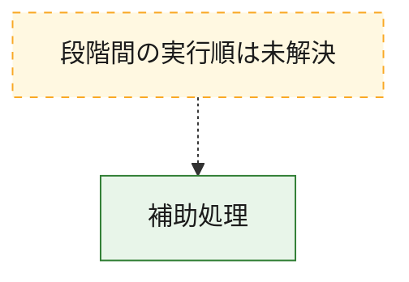
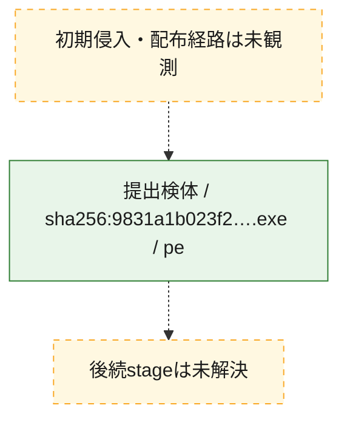
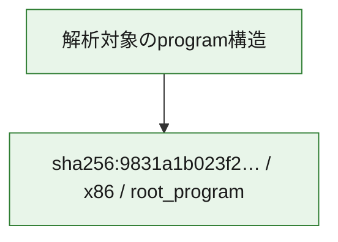

# 全体ロジック：9831a1b023f28b6cfd4c7c83099270aa48e43bf7bd8842e8858993abce86dc24

代表関数から主要なmalware処理段階を自動分類できませんでした。

## 読み方

- phaseの掲載順は解析上の整理順です。observed_call_edgesがない段階間の実行順を断定しません。
- 図の実線は静的に観測した関係、点線と黄色のノードは未観測・未解決の関係を示します。
- 図は静的な要約であり、動的実行を再現するものではありません。
- 詳細な関数解説とfingerprintは[STATIC-LOGIC.md](STATIC-LOGIC.md)を参照してください。

## 静的可視化

### 実行フロー

### 感染チェーン

### モジュール関係

## 処理段階

### 1. 補助処理

主要処理を支える一般内部関数またはlibrary処理を確認します。
確度: `confirmed_static_function_evidence_with_limits`

- `9831a1b023f28b6cfd4c7c83099270aa48e43bf7bd8842e8858993abce86dc24:ghidra:1400013c8` — 検体内部の一般処理を実装する関数です。 状態: `limited_bad_instruction_or_flow`、選定理由: `context_representative`, `reviewed_call_centrality:1`
- `9831a1b023f28b6cfd4c7c83099270aa48e43bf7bd8842e8858993abce86dc24:ghidra:140001578` — 検体内部の一般処理を実装する関数です。 状態: `limited_bad_instruction_or_flow`、選定理由: `context_representative`, `reviewed_call_centrality:1`
- `9831a1b023f28b6cfd4c7c83099270aa48e43bf7bd8842e8858993abce86dc24:ghidra:140001664` — 検体内部の一般処理を実装する関数です。 状態: `limited_bad_instruction_or_flow`、選定理由: `context_representative`, `reviewed_call_centrality:1`
- `9831a1b023f28b6cfd4c7c83099270aa48e43bf7bd8842e8858993abce86dc24:ghidra:1400018a8` — 検体内部の一般処理を実装する関数です。 状態: `limited_bad_instruction_or_flow`、選定理由: `context_representative`, `reviewed_call_centrality:1`
- `9831a1b023f28b6cfd4c7c83099270aa48e43bf7bd8842e8858993abce86dc24:ghidra:140001a8c` — 検体内部の一般処理を実装する関数です。 状態: `limited_bad_instruction_or_flow`、選定理由: `context_representative`, `reviewed_call_centrality:1`
- `9831a1b023f28b6cfd4c7c83099270aa48e43bf7bd8842e8858993abce86dc24:ghidra:1400021a0` — 検体内部の一般処理を実装する関数です。 状態: `limited_bad_instruction_or_flow`、選定理由: `context_representative`, `reviewed_call_centrality:1`
- `9831a1b023f28b6cfd4c7c83099270aa48e43bf7bd8842e8858993abce86dc24:ghidra:140002700` — 検体内部の一般処理を実装する関数です。 状態: `limited_bad_instruction_or_flow`、選定理由: `context_representative`, `reviewed_call_centrality:1`
- `9831a1b023f28b6cfd4c7c83099270aa48e43bf7bd8842e8858993abce86dc24:ghidra:140002a64` — 検体内部の一般処理を実装する関数です。 状態: `limited_bad_instruction_or_flow`、選定理由: `context_representative`, `reviewed_call_centrality:1`
- `9831a1b023f28b6cfd4c7c83099270aa48e43bf7bd8842e8858993abce86dc24:ghidra:140002b1c` — 検体内部の一般処理を実装する関数です。 状態: `limited_bad_instruction_or_flow`、選定理由: `context_representative`, `reviewed_call_centrality:1`
- `9831a1b023f28b6cfd4c7c83099270aa48e43bf7bd8842e8858993abce86dc24:ghidra:140002d38` — 検体内部の一般処理を実装する関数です。 状態: `limited_bad_instruction_or_flow`、選定理由: `context_representative`, `reviewed_call_centrality:1`
- `9831a1b023f28b6cfd4c7c83099270aa48e43bf7bd8842e8858993abce86dc24:ghidra:140002ec4` — 検体内部の一般処理を実装する関数です。 状態: `limited_bad_instruction_or_flow`、選定理由: `context_representative`, `reviewed_call_centrality:1`
- `9831a1b023f28b6cfd4c7c83099270aa48e43bf7bd8842e8858993abce86dc24:ghidra:1400030ac` — 検体内部の一般処理を実装する関数です。 状態: `limited_bad_instruction_or_flow`、選定理由: `context_representative`, `reviewed_call_centrality:1`
- `9831a1b023f28b6cfd4c7c83099270aa48e43bf7bd8842e8858993abce86dc24:ghidra:140003258` — 検体内部の一般処理を実装する関数です。 状態: `limited_bad_instruction_or_flow`、選定理由: `context_representative`, `reviewed_call_centrality:1`
- `9831a1b023f28b6cfd4c7c83099270aa48e43bf7bd8842e8858993abce86dc24:ghidra:1400038b0` — 検体内部の一般処理を実装する関数です。 状態: `limited_bad_instruction_or_flow`、選定理由: `context_representative`, `reviewed_call_centrality:1`
- `9831a1b023f28b6cfd4c7c83099270aa48e43bf7bd8842e8858993abce86dc24:ghidra:140003944` — 検体内部の一般処理を実装する関数です。 状態: `limited_bad_instruction_or_flow`、選定理由: `context_representative`, `reviewed_call_centrality:1`
- `9831a1b023f28b6cfd4c7c83099270aa48e43bf7bd8842e8858993abce86dc24:ghidra:1400039a0` — 検体内部の一般処理を実装する関数です。 状態: `limited_bad_instruction_or_flow`、選定理由: `context_representative`, `reviewed_call_centrality:1`
- `9831a1b023f28b6cfd4c7c83099270aa48e43bf7bd8842e8858993abce86dc24:ghidra:140003a84` — 検体内部の一般処理を実装する関数です。 状態: `limited_bad_instruction_or_flow`、選定理由: `context_representative`, `reviewed_call_centrality:1`
- `9831a1b023f28b6cfd4c7c83099270aa48e43bf7bd8842e8858993abce86dc24:ghidra:140003b0c` — 検体内部の一般処理を実装する関数です。 状態: `limited_bad_instruction_or_flow`、選定理由: `context_representative`, `reviewed_call_centrality:1`
- `9831a1b023f28b6cfd4c7c83099270aa48e43bf7bd8842e8858993abce86dc24:ghidra:140003b84` — 検体内部の一般処理を実装する関数です。 状態: `limited_bad_instruction_or_flow`、選定理由: `context_representative`, `reviewed_call_centrality:1`
- `9831a1b023f28b6cfd4c7c83099270aa48e43bf7bd8842e8858993abce86dc24:ghidra:140003c14` — 検体内部の一般処理を実装する関数です。 状態: `limited_bad_instruction_or_flow`、選定理由: `context_representative`, `reviewed_call_centrality:1`
- `9831a1b023f28b6cfd4c7c83099270aa48e43bf7bd8842e8858993abce86dc24:ghidra:140003ca4` — 検体内部の一般処理を実装する関数です。 状態: `limited_bad_instruction_or_flow`、選定理由: `context_representative`, `reviewed_call_centrality:1`
- `9831a1b023f28b6cfd4c7c83099270aa48e43bf7bd8842e8858993abce86dc24:ghidra:140003e28` — 検体内部の一般処理を実装する関数です。 状態: `limited_bad_instruction_or_flow`、選定理由: `context_representative`, `reviewed_call_centrality:1`
- `9831a1b023f28b6cfd4c7c83099270aa48e43bf7bd8842e8858993abce86dc24:ghidra:140004020` — 検体内部の一般処理を実装する関数です。 状態: `limited_bad_instruction_or_flow`、選定理由: `context_representative`, `reviewed_call_centrality:1`
- `9831a1b023f28b6cfd4c7c83099270aa48e43bf7bd8842e8858993abce86dc24:ghidra:14000453c` — 検体内部の一般処理を実装する関数です。 状態: `limited_bad_instruction_or_flow`、選定理由: `context_representative`, `reviewed_call_centrality:1`
- `9831a1b023f28b6cfd4c7c83099270aa48e43bf7bd8842e8858993abce86dc24:ghidra:1400047f0` — 検体内部の一般処理を実装する関数です。 状態: `limited_bad_instruction_or_flow`、選定理由: `context_representative`, `reviewed_call_centrality:1`
- `9831a1b023f28b6cfd4c7c83099270aa48e43bf7bd8842e8858993abce86dc24:ghidra:140004980` — 検体内部の一般処理を実装する関数です。 状態: `limited_bad_instruction_or_flow`、選定理由: `context_representative`, `reviewed_call_centrality:1`
- `9831a1b023f28b6cfd4c7c83099270aa48e43bf7bd8842e8858993abce86dc24:ghidra:140004ea4` — 検体内部の一般処理を実装する関数です。 状態: `limited_bad_instruction_or_flow`、選定理由: `context_representative`, `reviewed_call_centrality:1`
- `9831a1b023f28b6cfd4c7c83099270aa48e43bf7bd8842e8858993abce86dc24:ghidra:140004f10` — 検体内部の一般処理を実装する関数です。 状態: `limited_bad_instruction_or_flow`、選定理由: `context_representative`, `reviewed_call_centrality:1`
- `9831a1b023f28b6cfd4c7c83099270aa48e43bf7bd8842e8858993abce86dc24:ghidra:140004f5c` — 検体内部の一般処理を実装する関数です。 状態: `limited_bad_instruction_or_flow`、選定理由: `context_representative`, `reviewed_call_centrality:1`
- `9831a1b023f28b6cfd4c7c83099270aa48e43bf7bd8842e8858993abce86dc24:ghidra:140004fa8` — 検体内部の一般処理を実装する関数です。 状態: `limited_bad_instruction_or_flow`、選定理由: `context_representative`, `reviewed_call_centrality:1`
- `9831a1b023f28b6cfd4c7c83099270aa48e43bf7bd8842e8858993abce86dc24:ghidra:140005014` — 検体内部の一般処理を実装する関数です。 状態: `limited_bad_instruction_or_flow`、選定理由: `context_representative`, `reviewed_call_centrality:1`
- `9831a1b023f28b6cfd4c7c83099270aa48e43bf7bd8842e8858993abce86dc24:ghidra:140005060` — 検体内部の一般処理を実装する関数です。 状態: `limited_bad_instruction_or_flow`、選定理由: `context_representative`, `reviewed_call_centrality:1`

## 観測したcall関係

- `ghidra-function:019635d6685329d30588d986` → `ghidra-external:57f8835b769d13007588df43` （`unclassified` → `unclassified`）
- `ghidra-function:038e535d34bb11b05295f232` → `ghidra-external:57f8835b769d13007588df43` （`unclassified` → `unclassified`）
- `ghidra-function:045bea2e1e0d9c766296a584` → `ghidra-external:57f8835b769d13007588df43` （`unclassified` → `unclassified`）
- `ghidra-function:058adc67d5aa795b5f51c90c` → `ghidra-external:57f8835b769d13007588df43` （`unclassified` → `unclassified`）
- `ghidra-function:05e56d5196208709d54713bf` → `ghidra-external:57f8835b769d13007588df43` （`unclassified` → `unclassified`）
- `ghidra-function:1de83924cffe97f5051c6a29` → `ghidra-external:57f8835b769d13007588df43` （`unclassified` → `unclassified`）
- `ghidra-function:2dfd423332ba72f7bbfaf017` → `ghidra-external:57f8835b769d13007588df43` （`unclassified` → `unclassified`）
- `ghidra-function:3426192e19a145ec37ff956d` → `ghidra-external:57f8835b769d13007588df43` （`unclassified` → `unclassified`）
- `ghidra-function:354bc3500ba4995836677b9c` → `ghidra-external:57f8835b769d13007588df43` （`unclassified` → `unclassified`）
- `ghidra-function:472dd5cc9b14101d80d711eb` → `ghidra-external:57f8835b769d13007588df43` （`unclassified` → `unclassified`）
- `ghidra-function:51c09fdee5afb8ae8ff6ec93` → `ghidra-external:57f8835b769d13007588df43` （`unclassified` → `unclassified`）
- `ghidra-function:5b2e6558eb4032caf84d7c00` → `ghidra-external:57f8835b769d13007588df43` （`unclassified` → `unclassified`）
- `ghidra-function:61353e9451ecc29c8bdb49c6` → `ghidra-external:57f8835b769d13007588df43` （`unclassified` → `unclassified`）
- `ghidra-function:67f4f475bcb68c2f0d133c30` → `ghidra-external:57f8835b769d13007588df43` （`unclassified` → `unclassified`）
- `ghidra-function:771128c17f9b72a383cafa1f` → `ghidra-external:57f8835b769d13007588df43` （`unclassified` → `unclassified`）
- `ghidra-function:7cef1c6383dd97dd80dd912e` → `ghidra-external:57f8835b769d13007588df43` （`unclassified` → `unclassified`）
- `ghidra-function:9c2cebc3ad7ebde90c21e745` → `ghidra-external:57f8835b769d13007588df43` （`unclassified` → `unclassified`）
- `ghidra-function:9ca55f9c76567d0377fddb92` → `ghidra-external:57f8835b769d13007588df43` （`unclassified` → `unclassified`）
- `ghidra-function:9dc14d506e647bd6a0f85942` → `ghidra-external:57f8835b769d13007588df43` （`unclassified` → `unclassified`）
- `ghidra-function:a158822c8ec797372b85194b` → `ghidra-external:57f8835b769d13007588df43` （`unclassified` → `unclassified`）
- `ghidra-function:a7b707693b9fb1b62f498c60` → `ghidra-external:57f8835b769d13007588df43` （`unclassified` → `unclassified`）
- `ghidra-function:a7d56e49011c2676adbd0c1e` → `ghidra-external:57f8835b769d13007588df43` （`unclassified` → `unclassified`）
- `ghidra-function:ab5e551e0723833ad0826908` → `ghidra-external:57f8835b769d13007588df43` （`unclassified` → `unclassified`）
- `ghidra-function:c096c5b4a05899b5227caaac` → `ghidra-external:57f8835b769d13007588df43` （`unclassified` → `unclassified`）
- `ghidra-function:d0f594a5869319175e3bfcd8` → `ghidra-external:57f8835b769d13007588df43` （`unclassified` → `unclassified`）
- `ghidra-function:d1974ddc1bdfd7a9aec4453d` → `ghidra-external:57f8835b769d13007588df43` （`unclassified` → `unclassified`）
- `ghidra-function:e5a000987b96fb07a3a454bd` → `ghidra-external:57f8835b769d13007588df43` （`unclassified` → `unclassified`）
- `ghidra-function:e5ef5448670b3be43ac8b27d` → `ghidra-external:57f8835b769d13007588df43` （`unclassified` → `unclassified`）
- `ghidra-function:ef94cd80ef89b18de48fa44e` → `ghidra-external:57f8835b769d13007588df43` （`unclassified` → `unclassified`）
- `ghidra-function:f0fbc70477c56d1a7b2c0320` → `ghidra-external:57f8835b769d13007588df43` （`unclassified` → `unclassified`）
- `ghidra-function:f2d5b87e0e79f16f2a7383f5` → `ghidra-external:57f8835b769d13007588df43` （`unclassified` → `unclassified`）
- `ghidra-function:fc644e7ad6d64d2c9151fe36` → `ghidra-external:57f8835b769d13007588df43` （`unclassified` → `unclassified`）

## 解析範囲と制約

- 選定外関数は全体inventoryへ残しますが、関数本体の個別解説対象にはしていません。
- indirect call、難読化、packer、VM、壊れたcontrol flowによりcall関係が欠落する場合があります。
- 文書は静的解析に基づき、検体実行や外部通信による動的確認は行っていません。
