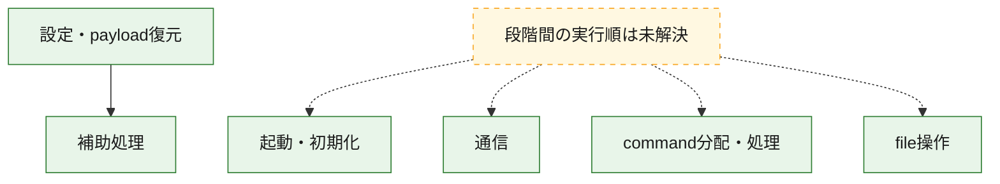
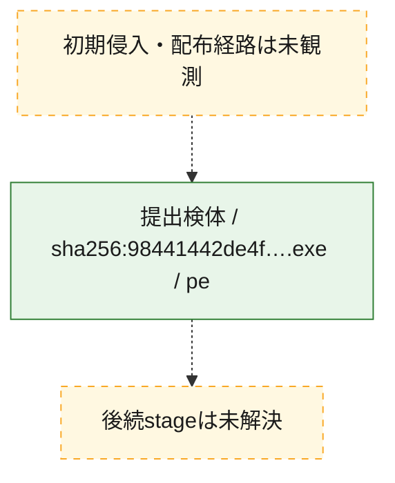
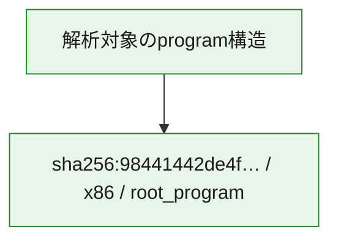

# 全体ロジック：98441442de4f74b035af7044472d762d7ee9bf013573c881b3b8d3cfdca46bbb

代表関数の静的証跡から、起動・初期化、設定・payload復元、通信、command分配・処理、file操作の処理群を確認しました。

## 読み方

- phaseの掲載順は解析上の整理順です。observed_call_edgesがない段階間の実行順を断定しません。
- 図の実線は静的に観測した関係、点線と黄色のノードは未観測・未解決の関係を示します。
- 図は静的な要約であり、動的実行を再現するものではありません。
- 詳細な関数解説とfingerprintは[STATIC-LOGIC.md](STATIC-LOGIC.md)を参照してください。

## 静的可視化

### 実行フロー

### 感染チェーン

### モジュール関係

## 処理段階

### 1. 起動・初期化

entry pointから初期化と後続処理への移行を確認します。
確度: `confirmed_static_function_evidence`

- `98441442de4f74b035af7044472d762d7ee9bf013573c881b3b8d3cfdca46bbb:ghidra:14033a450` — 初期化と主要処理への分岐を行う入口関数です。 状態: `succeeded`、選定理由: `entry_point`, `meaningful_symbol_name`, `reviewed_call_centrality:13`, `role:entrypoint`
- `98441442de4f74b035af7044472d762d7ee9bf013573c881b3b8d3cfdca46bbb:ghidra:14033a5f0` — 初期化と主要処理への分岐を行う入口関数です。 状態: `succeeded`、選定理由: `entry_point`, `meaningful_symbol_name`, `reviewed_call_centrality:11`, `role:entrypoint`
- `98441442de4f74b035af7044472d762d7ee9bf013573c881b3b8d3cfdca46bbb:ghidra:14033a770` — 初期化と主要処理への分岐を行う入口関数です。 状態: `succeeded`、選定理由: `entry_point`, `meaningful_symbol_name`, `reviewed_call_centrality:12`, `role:entrypoint`
- `98441442de4f74b035af7044472d762d7ee9bf013573c881b3b8d3cfdca46bbb:ghidra:14033a910` — 初期化と主要処理への分岐を行う入口関数です。 状態: `succeeded`、選定理由: `entry_point`, `meaningful_symbol_name`, `reviewed_call_centrality:4`, `role:entrypoint`
- `98441442de4f74b035af7044472d762d7ee9bf013573c881b3b8d3cfdca46bbb:ghidra:14033a9f0` — 初期化と主要処理への分岐を行う入口関数です。 状態: `succeeded`、選定理由: `entry_point`, `meaningful_symbol_name`, `reviewed_call_centrality:5`, `role:entrypoint`
- `98441442de4f74b035af7044472d762d7ee9bf013573c881b3b8d3cfdca46bbb:ghidra:14033aa70` — 初期化と主要処理への分岐を行う入口関数です。 状態: `succeeded`、選定理由: `entry_point`, `meaningful_symbol_name`, `reviewed_call_centrality:9`, `role:entrypoint`
- `98441442de4f74b035af7044472d762d7ee9bf013573c881b3b8d3cfdca46bbb:ghidra:14033abc0` — 初期化と主要処理への分岐を行う入口関数です。 状態: `succeeded`、選定理由: `entry_point`, `meaningful_symbol_name`, `reviewed_call_centrality:3`, `role:entrypoint`

### 2. 設定・payload復元

設定、resource、payload、暗号化データの復元・変換を確認します。
確度: `confirmed_static_function_evidence`

- `98441442de4f74b035af7044472d762d7ee9bf013573c881b3b8d3cfdca46bbb:ghidra:140097560` — 設定、resource、payloadなどの解析・変換を行う関数です。 状態: `succeeded`、選定理由: `entry_point`, `meaningful_symbol_name`, `reviewed_call_centrality:2`, `role:config_or_data_transform`
- `98441442de4f74b035af7044472d762d7ee9bf013573c881b3b8d3cfdca46bbb:ghidra:14029fc10` — 設定、resource、payloadなどの解析・変換を行う関数です。 状態: `succeeded`、選定理由: `entry_point`, `meaningful_symbol_name`, `reviewed_call_centrality:4`, `role:config_or_data_transform`
- `98441442de4f74b035af7044472d762d7ee9bf013573c881b3b8d3cfdca46bbb:ghidra:14029fc80` — 設定、resource、payloadなどの解析・変換を行う関数です。 状態: `succeeded`、選定理由: `entry_point`, `meaningful_symbol_name`, `reviewed_call_centrality:2`, `role:config_or_data_transform`
- `98441442de4f74b035af7044472d762d7ee9bf013573c881b3b8d3cfdca46bbb:ghidra:14029fd70` — 設定、resource、payloadなどの解析・変換を行う関数です。 状態: `succeeded`、選定理由: `entry_point`, `meaningful_symbol_name`, `reviewed_call_centrality:7`, `role:config_or_data_transform`
- `98441442de4f74b035af7044472d762d7ee9bf013573c881b3b8d3cfdca46bbb:ghidra:1402a1fe0` — 設定、resource、payloadなどの解析・変換を行う関数です。 状態: `succeeded`、選定理由: `entry_point`, `meaningful_symbol_name`, `reviewed_call_centrality:10`, `role:config_or_data_transform`
- `98441442de4f74b035af7044472d762d7ee9bf013573c881b3b8d3cfdca46bbb:ghidra:1402a2110` — 設定、resource、payloadなどの解析・変換を行う関数です。 状態: `succeeded`、選定理由: `entry_point`, `meaningful_symbol_name`, `reviewed_call_centrality:3`, `role:config_or_data_transform`
- `98441442de4f74b035af7044472d762d7ee9bf013573c881b3b8d3cfdca46bbb:ghidra:1402a2180` — 設定、resource、payloadなどの解析・変換を行う関数です。 状態: `succeeded`、選定理由: `entry_point`, `meaningful_symbol_name`, `reviewed_call_centrality:3`, `role:config_or_data_transform`
- `98441442de4f74b035af7044472d762d7ee9bf013573c881b3b8d3cfdca46bbb:ghidra:1402a22e0` — 設定、resource、payloadなどの解析・変換を行う関数です。 状態: `succeeded`、選定理由: `entry_point`, `meaningful_symbol_name`, `reviewed_call_centrality:3`, `role:config_or_data_transform`
- `98441442de4f74b035af7044472d762d7ee9bf013573c881b3b8d3cfdca46bbb:ghidra:1402a2380` — 設定、resource、payloadなどの解析・変換を行う関数です。 状態: `succeeded`、選定理由: `entry_point`, `meaningful_symbol_name`, `reviewed_call_centrality:3`, `role:config_or_data_transform`
- `98441442de4f74b035af7044472d762d7ee9bf013573c881b3b8d3cfdca46bbb:ghidra:1402a2420` — 設定、resource、payloadなどの解析・変換を行う関数です。 状態: `succeeded`、選定理由: `entry_point`, `meaningful_symbol_name`, `reviewed_call_centrality:3`, `role:config_or_data_transform`
- `98441442de4f74b035af7044472d762d7ee9bf013573c881b3b8d3cfdca46bbb:ghidra:1402a24d0` — 設定、resource、payloadなどの解析・変換を行う関数です。 状態: `succeeded`、選定理由: `entry_point`, `meaningful_symbol_name`, `reviewed_call_centrality:2`, `role:config_or_data_transform`
- `98441442de4f74b035af7044472d762d7ee9bf013573c881b3b8d3cfdca46bbb:ghidra:14033a160` — 設定、resource、payloadなどの解析・変換を行う関数です。 状態: `succeeded`、選定理由: `entry_point`, `meaningful_symbol_name`, `reviewed_call_centrality:7`, `role:config_or_data_transform`
- `98441442de4f74b035af7044472d762d7ee9bf013573c881b3b8d3cfdca46bbb:ghidra:140345e40` — 暗号、hash、encoding、または復号処理に関係する関数です。 状態: `succeeded`、選定理由: `entry_point`, `meaningful_symbol_name`, `reviewed_call_centrality:5`, `role:cryptographic_transform`

### 3. 通信

通信初期化、endpoint処理、送受信の役割を確認します。
確度: `confirmed_static_function_evidence`

- `98441442de4f74b035af7044472d762d7ee9bf013573c881b3b8d3cfdca46bbb:ghidra:1402c1d30` — 通信初期化、送受信、またはendpoint処理に関係する関数です。 状態: `succeeded`、選定理由: `entry_point`, `meaningful_symbol_name`, `reviewed_call_centrality:19`, `role:network_communication`
- `98441442de4f74b035af7044472d762d7ee9bf013573c881b3b8d3cfdca46bbb:ghidra:1402c50e0` — 通信初期化、送受信、またはendpoint処理に関係する関数です。 状態: `succeeded`、選定理由: `entry_point`, `meaningful_symbol_name`, `reviewed_call_centrality:16`, `role:network_communication`
- `98441442de4f74b035af7044472d762d7ee9bf013573c881b3b8d3cfdca46bbb:ghidra:1402d20f0` — 通信初期化、送受信、またはendpoint処理に関係する関数です。 状態: `succeeded`、選定理由: `entry_point`, `meaningful_symbol_name`, `reviewed_call_centrality:9`, `role:network_communication`
- `98441442de4f74b035af7044472d762d7ee9bf013573c881b3b8d3cfdca46bbb:ghidra:1402d4b80` — 通信初期化、送受信、またはendpoint処理に関係する関数です。 状態: `succeeded`、選定理由: `entry_point`, `meaningful_symbol_name`, `reviewed_call_centrality:1`, `role:network_communication`
- `98441442de4f74b035af7044472d762d7ee9bf013573c881b3b8d3cfdca46bbb:ghidra:1402d4d30` — 通信初期化、送受信、またはendpoint処理に関係する関数です。 状態: `succeeded`、選定理由: `entry_point`, `meaningful_symbol_name`, `reviewed_call_centrality:1`, `role:network_communication`
- `98441442de4f74b035af7044472d762d7ee9bf013573c881b3b8d3cfdca46bbb:ghidra:1402d4dc0` — 通信初期化、送受信、またはendpoint処理に関係する関数です。 状態: `succeeded`、選定理由: `entry_point`, `meaningful_symbol_name`, `reviewed_call_centrality:1`, `role:network_communication`

### 4. command分配・処理

受信commandやtaskの解釈、分配、個別handlerへの移行を確認します。
確度: `confirmed_static_function_evidence`

- `98441442de4f74b035af7044472d762d7ee9bf013573c881b3b8d3cfdca46bbb:ghidra:140097cc0` — commandの解釈、分配、または個別処理を担当する関数です。 状態: `succeeded`、選定理由: `entry_point`, `meaningful_symbol_name`, `reviewed_call_centrality:2`, `role:command_dispatch_or_handler`
- `98441442de4f74b035af7044472d762d7ee9bf013573c881b3b8d3cfdca46bbb:ghidra:14029de40` — commandの解釈、分配、または個別処理を担当する関数です。 状態: `succeeded`、選定理由: `entry_point`, `meaningful_symbol_name`, `reviewed_call_centrality:7`, `role:command_dispatch_or_handler`
- `98441442de4f74b035af7044472d762d7ee9bf013573c881b3b8d3cfdca46bbb:ghidra:14029f990` — commandの解釈、分配、または個別処理を担当する関数です。 状態: `succeeded`、選定理由: `entry_point`, `meaningful_symbol_name`, `reviewed_call_centrality:1`, `role:command_dispatch_or_handler`

### 5. file操作

fileやdirectoryの作成、読書き、削除を確認します。
確度: `confirmed_static_function_evidence`

- `98441442de4f74b035af7044472d762d7ee9bf013573c881b3b8d3cfdca46bbb:ghidra:1407ba7c0` — fileまたはdirectoryの読書き・管理に関係する関数です。 状態: `succeeded`、選定理由: `entry_point`, `meaningful_symbol_name`, `reviewed_call_centrality:6`, `role:file_operation`

### 6. 補助処理

主要処理を支える一般内部関数またはlibrary処理を確認します。
確度: `confirmed_static_function_evidence`

- `98441442de4f74b035af7044472d762d7ee9bf013573c881b3b8d3cfdca46bbb:ghidra:1400971a0` — 検体内部の一般処理を実装する関数です。 状態: `succeeded`、選定理由: `entry_point`, `meaningful_symbol_name`, `reviewed_call_centrality:1`
- `98441442de4f74b035af7044472d762d7ee9bf013573c881b3b8d3cfdca46bbb:ghidra:14125dea4` — compiler生成処理または汎用library処理とみられる関数です。 状態: `succeeded`、選定理由: `entry_point`, `meaningful_symbol_name`, `reviewed_call_centrality:1`

## 観測したcall関係

- `98441442de4f74b035af7044472d762d7ee9bf013573c881b3b8d3cfdca46bbb:ghidra:140097560` → `98441442de4f74b035af7044472d762d7ee9bf013573c881b3b8d3cfdca46bbb:ghidra:1400971a0` （`configuration` → `support`）
- `98441442de4f74b035af7044472d762d7ee9bf013573c881b3b8d3cfdca46bbb:ghidra:14033abc0` → `98441442de4f74b035af7044472d762d7ee9bf013573c881b3b8d3cfdca46bbb:ghidra:14033a450` （`startup` → `startup`）
- `98441442de4f74b035af7044472d762d7ee9bf013573c881b3b8d3cfdca46bbb:ghidra:14033abc0` → `98441442de4f74b035af7044472d762d7ee9bf013573c881b3b8d3cfdca46bbb:ghidra:14033aa70` （`startup` → `startup`）
- `ghidra-function:00d7a5d9c43d17d2b03357ce` → `ghidra-external:f8211e2d727c2eef7dfdaf01` （`unclassified` → `unclassified`）
- `ghidra-function:00d7a5d9c43d17d2b03357ce` → `ghidra-function:39ecd53f7567080f949d0035` （`unclassified` → `unclassified`）
- `ghidra-function:00d7a5d9c43d17d2b03357ce` → `ghidra-function:63a0ffab38284dbc4ea15a36` （`unclassified` → `unclassified`）
- `ghidra-function:0490a27f8ab5d809753c8cf5` → `ghidra-external:61dda0a8caf014f2a95f34db` （`unclassified` → `unclassified`）
- `ghidra-function:0490a27f8ab5d809753c8cf5` → `ghidra-function:4b9e7866447cfcf4b9fd46b2` （`unclassified` → `unclassified`）
- `ghidra-function:0a853d7441184172fce8108f` → `ghidra-external:c6777083108a3cfd82fcc01a` （`unclassified` → `unclassified`）
- `ghidra-function:0a853d7441184172fce8108f` → `ghidra-external:f8211e2d727c2eef7dfdaf01` （`unclassified` → `unclassified`）
- `ghidra-function:0a853d7441184172fce8108f` → `ghidra-function:034389a296f43add5e1d8e45` （`unclassified` → `unclassified`）
- `ghidra-function:0a853d7441184172fce8108f` → `ghidra-function:1703f58c86f6f561d1dc571e` （`unclassified` → `unclassified`）
- `ghidra-function:0a853d7441184172fce8108f` → `ghidra-function:1c7e8d28024cc4586e64214a` （`unclassified` → `unclassified`）
- `ghidra-function:0a853d7441184172fce8108f` → `ghidra-function:3abd36654d9424de8cad3859` （`unclassified` → `unclassified`）
- `ghidra-function:0a853d7441184172fce8108f` → `ghidra-function:3bcda15724faadebf94ec009` （`unclassified` → `unclassified`）
- `ghidra-function:0a853d7441184172fce8108f` → `ghidra-function:5d3c463906ff0ba1ee8d5b81` （`unclassified` → `unclassified`）
- `ghidra-function:0a853d7441184172fce8108f` → `ghidra-function:7759286769483cd2b2e2d6f4` （`unclassified` → `unclassified`）
- `ghidra-function:0a853d7441184172fce8108f` → `ghidra-function:917f54ec9e1080aca5229dff` （`unclassified` → `unclassified`）
- `ghidra-function:0a853d7441184172fce8108f` → `ghidra-function:97b161137f1c16d36b6bf0e4` （`unclassified` → `unclassified`）
- `ghidra-function:0a853d7441184172fce8108f` → `ghidra-function:cae309ba585321106e0bf419` （`unclassified` → `unclassified`）
- `ghidra-function:0d625935f31fbee915b81b2a` → `ghidra-external:2d529f6fafd9bdb6b6ae2457` （`unclassified` → `unclassified`）
- `ghidra-function:0d625935f31fbee915b81b2a` → `ghidra-external:55e111f5398c6728fb1fa954` （`unclassified` → `unclassified`）
- `ghidra-function:0d625935f31fbee915b81b2a` → `ghidra-external:c05e6b8a9d108ea52e35d708` （`unclassified` → `unclassified`）
- `ghidra-function:21157858e9851e03fc68397c` → `ghidra-function:034389a296f43add5e1d8e45` （`unclassified` → `unclassified`）
- `ghidra-function:21157858e9851e03fc68397c` → `ghidra-function:1703f58c86f6f561d1dc571e` （`unclassified` → `unclassified`）
- `ghidra-function:21157858e9851e03fc68397c` → `ghidra-function:1c7e8d28024cc4586e64214a` （`unclassified` → `unclassified`）
- `ghidra-function:21157858e9851e03fc68397c` → `ghidra-function:3bcda15724faadebf94ec009` （`unclassified` → `unclassified`）
- `ghidra-function:21157858e9851e03fc68397c` → `ghidra-function:7759286769483cd2b2e2d6f4` （`unclassified` → `unclassified`）
- `ghidra-function:2d0c400ada517240c8fe2660` → `ghidra-external:06b0dfd0e9c7618917bf95ec` （`unclassified` → `unclassified`）
- `ghidra-function:2d0c400ada517240c8fe2660` → `ghidra-external:2d529f6fafd9bdb6b6ae2457` （`unclassified` → `unclassified`）
- `ghidra-function:2d0c400ada517240c8fe2660` → `ghidra-external:a9001ef5efa02d205e6d3142` （`unclassified` → `unclassified`）
- `ghidra-function:31845037e1f6a450383d43c4` → `ghidra-external:32214af42a70d7b0f6726637` （`unclassified` → `unclassified`）
- `ghidra-function:31845037e1f6a450383d43c4` → `ghidra-external:bc62f012102e5616349ae0e2` （`unclassified` → `unclassified`）
- `ghidra-function:31845037e1f6a450383d43c4` → `ghidra-external:c3cc6442bfc9c029f9b79df0` （`unclassified` → `unclassified`）
- `ghidra-function:39ecd53f7567080f949d0035` → `ghidra-external:182b5ea3207e75034514ea64` （`unclassified` → `unclassified`）
- `ghidra-function:39ecd53f7567080f949d0035` → `ghidra-external:d1f685d6847176318a8167a9` （`unclassified` → `unclassified`）
- `ghidra-function:39ecd53f7567080f949d0035` → `ghidra-external:d45789038cc830576378a1e1` （`unclassified` → `unclassified`）
- `ghidra-function:39ecd53f7567080f949d0035` → `ghidra-external:f8211e2d727c2eef7dfdaf01` （`unclassified` → `unclassified`）
- `ghidra-function:39ecd53f7567080f949d0035` → `ghidra-function:034389a296f43add5e1d8e45` （`unclassified` → `unclassified`）
- `ghidra-function:39ecd53f7567080f949d0035` → `ghidra-function:1c7e8d28024cc4586e64214a` （`unclassified` → `unclassified`）
- `ghidra-function:39ecd53f7567080f949d0035` → `ghidra-function:3bcda15724faadebf94ec009` （`unclassified` → `unclassified`）
- `ghidra-function:39ecd53f7567080f949d0035` → `ghidra-function:f67e254668ee8ebcf105523f` （`unclassified` → `unclassified`）
- `ghidra-function:3f71effc9566126db708a74b` → `ghidra-function:9d362c2c3a3f33a2fcdf5da3` （`unclassified` → `unclassified`）
- `ghidra-function:4564b6572b182b0ee2f4f083` → `ghidra-external:2d529f6fafd9bdb6b6ae2457` （`unclassified` → `unclassified`）
- `ghidra-function:4564b6572b182b0ee2f4f083` → `ghidra-external:4477c58a1b5816f9ced7c509` （`unclassified` → `unclassified`）
- `ghidra-function:4836d29e18693620e13c80a1` → `ghidra-external:36f04e5ce036612cbeefe4b3` （`unclassified` → `unclassified`）
- `ghidra-function:4836d29e18693620e13c80a1` → `ghidra-external:4cc2cac63c30fd0f75ec3bd2` （`unclassified` → `unclassified`）
- `ghidra-function:4836d29e18693620e13c80a1` → `ghidra-external:85708e26bca67c9ff3a50f70` （`unclassified` → `unclassified`）
- `ghidra-function:4836d29e18693620e13c80a1` → `ghidra-external:8700d37e6a1bca406329de0a` （`unclassified` → `unclassified`）
- `ghidra-function:4836d29e18693620e13c80a1` → `ghidra-function:034389a296f43add5e1d8e45` （`unclassified` → `unclassified`）
- `ghidra-function:4836d29e18693620e13c80a1` → `ghidra-function:1c7e8d28024cc4586e64214a` （`unclassified` → `unclassified`）
- `ghidra-function:4836d29e18693620e13c80a1` → `ghidra-function:3bcda15724faadebf94ec009` （`unclassified` → `unclassified`）
- `ghidra-function:4f9b8f2e4e5e9c13a2bb61bb` → `ghidra-external:71afc16f1e4524248c5ef511` （`unclassified` → `unclassified`）
- `ghidra-function:4f9b8f2e4e5e9c13a2bb61bb` → `ghidra-external:76fdb393c36d9d19dab394da` （`unclassified` → `unclassified`）
- `ghidra-function:4f9b8f2e4e5e9c13a2bb61bb` → `ghidra-external:934e4fd38d3c5f12ff4a1467` （`unclassified` → `unclassified`）
- `ghidra-function:4f9b8f2e4e5e9c13a2bb61bb` → `ghidra-external:ac8fc7d98441feb546b0d253` （`unclassified` → `unclassified`）
- `ghidra-function:4f9b8f2e4e5e9c13a2bb61bb` → `ghidra-external:b0dd9b6c966eb66588b94ecf` （`unclassified` → `unclassified`）
- `ghidra-function:4f9b8f2e4e5e9c13a2bb61bb` → `ghidra-external:ce95c6111295e2115b46dfcf` （`unclassified` → `unclassified`）
- `ghidra-function:4f9b8f2e4e5e9c13a2bb61bb` → `ghidra-external:d85d2fc5fdd2dc3a809a58ad` （`unclassified` → `unclassified`）
- `ghidra-function:4f9b8f2e4e5e9c13a2bb61bb` → `ghidra-external:e5bd3065277e0848c6f00d18` （`unclassified` → `unclassified`）
- `ghidra-function:4f9b8f2e4e5e9c13a2bb61bb` → `ghidra-external:eda023084e7f769464ce7e63` （`unclassified` → `unclassified`）
- `ghidra-function:4f9b8f2e4e5e9c13a2bb61bb` → `ghidra-function:ebabdaf33247d2387492a1fa` （`unclassified` → `unclassified`）
- `ghidra-function:5acec795b0bafb5b2434c394` → `ghidra-external:57bed142bd22e97723b4bd2e` （`unclassified` → `unclassified`）
- `ghidra-function:5acec795b0bafb5b2434c394` → `ghidra-external:85e727c117cd08f21ab7c957` （`unclassified` → `unclassified`）
- `ghidra-function:63a0ffab38284dbc4ea15a36` → `ghidra-external:c6777083108a3cfd82fcc01a` （`unclassified` → `unclassified`）
- `ghidra-function:63a0ffab38284dbc4ea15a36` → `ghidra-external:f8211e2d727c2eef7dfdaf01` （`unclassified` → `unclassified`）
- `ghidra-function:63a0ffab38284dbc4ea15a36` → `ghidra-function:034389a296f43add5e1d8e45` （`unclassified` → `unclassified`）
- `ghidra-function:63a0ffab38284dbc4ea15a36` → `ghidra-function:1703f58c86f6f561d1dc571e` （`unclassified` → `unclassified`）
- `ghidra-function:63a0ffab38284dbc4ea15a36` → `ghidra-function:1c7e8d28024cc4586e64214a` （`unclassified` → `unclassified`）
- `ghidra-function:63a0ffab38284dbc4ea15a36` → `ghidra-function:3bcda15724faadebf94ec009` （`unclassified` → `unclassified`）
- `ghidra-function:63a0ffab38284dbc4ea15a36` → `ghidra-function:57c90ed1ec5be5061f940c3a` （`unclassified` → `unclassified`）
- `ghidra-function:63a0ffab38284dbc4ea15a36` → `ghidra-function:5d3c463906ff0ba1ee8d5b81` （`unclassified` → `unclassified`）
- `ghidra-function:63a0ffab38284dbc4ea15a36` → `ghidra-function:7759286769483cd2b2e2d6f4` （`unclassified` → `unclassified`）
- `ghidra-function:63a0ffab38284dbc4ea15a36` → `ghidra-function:917f54ec9e1080aca5229dff` （`unclassified` → `unclassified`）
- `ghidra-function:63a0ffab38284dbc4ea15a36` → `ghidra-function:97b161137f1c16d36b6bf0e4` （`unclassified` → `unclassified`）
- `ghidra-function:63a0ffab38284dbc4ea15a36` → `ghidra-function:cae309ba585321106e0bf419` （`unclassified` → `unclassified`）
- `ghidra-function:6d69c21d25c99e76bfa65a80` → `ghidra-external:b0dd9b6c966eb66588b94ecf` （`unclassified` → `unclassified`）
- `ghidra-function:6d69c21d25c99e76bfa65a80` → `ghidra-external:bb66b63f1ad15af0c86ac4f2` （`unclassified` → `unclassified`）
- `ghidra-function:6d69c21d25c99e76bfa65a80` → `ghidra-external:ce3af7817ba27877f50a213a` （`unclassified` → `unclassified`）
- `ghidra-function:6d69c21d25c99e76bfa65a80` → `ghidra-function:5725426aeb487e5b215cc739` （`unclassified` → `unclassified`）
- `ghidra-function:6d69c21d25c99e76bfa65a80` → `ghidra-function:797ee063da4459fef88c9ecc` （`unclassified` → `unclassified`）
- `ghidra-function:6d69c21d25c99e76bfa65a80` → `ghidra-function:ec3be3df2b98a59750edb4bc` （`unclassified` → `unclassified`）
- `ghidra-function:6d69c21d25c99e76bfa65a80` → `ghidra-function:ed27061a47bc85ccca2ee007` （`unclassified` → `unclassified`）
- `ghidra-function:6fd1f33879ca7690dba48715` → `ghidra-external:1fad4f3b24820fcb33172072` （`unclassified` → `unclassified`）
- `ghidra-function:6fd1f33879ca7690dba48715` → `ghidra-external:934e4fd38d3c5f12ff4a1467` （`unclassified` → `unclassified`）
- `ghidra-function:6fd1f33879ca7690dba48715` → `ghidra-external:ce95c6111295e2115b46dfcf` （`unclassified` → `unclassified`）
- `ghidra-function:6fd1f33879ca7690dba48715` → `ghidra-function:44c50f516ae18f0b3d809b3a` （`unclassified` → `unclassified`）
- `ghidra-function:7dd79eb31d6f80a369740b8d` → `ghidra-external:0516bd20856989ab31c7ac12` （`unclassified` → `unclassified`）
- `ghidra-function:7dd79eb31d6f80a369740b8d` → `ghidra-external:2d529f6fafd9bdb6b6ae2457` （`unclassified` → `unclassified`）
- `ghidra-function:7dd79eb31d6f80a369740b8d` → `ghidra-external:de6f56af4bdff34c6ef9a7e7` （`unclassified` → `unclassified`）
- `ghidra-function:8105d20ff923fb61162b00a2` → `ghidra-external:4754be19d5d58fe5d9b1583d` （`unclassified` → `unclassified`）
- `ghidra-function:85bf7a2a0f18827a1a7f4abf` → `ghidra-external:9c93aaf1c76f704b8ced07d1` （`unclassified` → `unclassified`）
- `ghidra-function:85bf7a2a0f18827a1a7f4abf` → `ghidra-function:0434194d636a2a30ccb373b9` （`unclassified` → `unclassified`）
- `ghidra-function:8a3ece25fe2a794855d3afcf` → `ghidra-function:4315ea8a03b3c94c8216bebd` （`unclassified` → `unclassified`）
- `ghidra-function:936d39ce8d89b65607442a12` → `ghidra-function:0b71892f2df59ccc820de08c` （`unclassified` → `unclassified`）
- `ghidra-function:970df872e693af11b38682a7` → `ghidra-external:2d529f6fafd9bdb6b6ae2457` （`unclassified` → `unclassified`）
- `ghidra-function:970df872e693af11b38682a7` → `ghidra-external:56cf3f5f30367734e4695341` （`unclassified` → `unclassified`）
- `ghidra-function:970df872e693af11b38682a7` → `ghidra-external:b06c192f0a55c0fab1b503e1` （`unclassified` → `unclassified`）
- `ghidra-function:a5352d99351f8df912de9976` → `ghidra-external:bb7f6e360c065a55564a13b4` （`unclassified` → `unclassified`）
- `ghidra-function:a5352d99351f8df912de9976` → `ghidra-external:da5da997d806a5ef4a767d56` （`unclassified` → `unclassified`）
- `ghidra-function:a5352d99351f8df912de9976` → `ghidra-function:7817928e220682876b1e903c` （`unclassified` → `unclassified`）
- `ghidra-function:a5352d99351f8df912de9976` → `ghidra-function:c8134f771b7891bc354510a6` （`unclassified` → `unclassified`）
- `ghidra-function:a5352d99351f8df912de9976` → `ghidra-function:d1c9073acbd84a67f7925add` （`unclassified` → `unclassified`）
- `ghidra-function:bd8a25490a4a2e1c5aa561ac` → `ghidra-function:38c29810c74e0de7f3bb78f4` （`unclassified` → `unclassified`）
- `ghidra-function:c11e6fa8b2bc18653730355e` → `ghidra-external:243fb477f07b745c0f1a5643` （`unclassified` → `unclassified`）
- `ghidra-function:c11e6fa8b2bc18653730355e` → `ghidra-external:90b0b88fffd4e4428f9145cc` （`unclassified` → `unclassified`）
- `ghidra-function:c11e6fa8b2bc18653730355e` → `ghidra-external:b0dd9b6c966eb66588b94ecf` （`unclassified` → `unclassified`）
- `ghidra-function:c11e6fa8b2bc18653730355e` → `ghidra-function:c05edbecdf11edf3e54a84d5` （`unclassified` → `unclassified`）
- `ghidra-function:c11e6fa8b2bc18653730355e` → `ghidra-function:c565f883e8804034ca71a78b` （`unclassified` → `unclassified`）
- `ghidra-function:c11e6fa8b2bc18653730355e` → `ghidra-function:c590ee21bf7351a2ee1d8d0b` （`unclassified` → `unclassified`）
- `ghidra-function:cc7467cab9413c6a9852c68e` → `ghidra-function:5d3c463906ff0ba1ee8d5b81` （`unclassified` → `unclassified`）
- `ghidra-function:cc7467cab9413c6a9852c68e` → `ghidra-function:917f54ec9e1080aca5229dff` （`unclassified` → `unclassified`）
- `ghidra-function:cc7467cab9413c6a9852c68e` → `ghidra-function:97b161137f1c16d36b6bf0e4` （`unclassified` → `unclassified`）
- `ghidra-function:cc7467cab9413c6a9852c68e` → `ghidra-function:cae309ba585321106e0bf419` （`unclassified` → `unclassified`）
- `ghidra-function:df0f82dc04c74f28338f3600` → `ghidra-external:98ca2be4ee5670b55c42d2e7` （`unclassified` → `unclassified`）
- `ghidra-function:df0f82dc04c74f28338f3600` → `ghidra-external:a12f43e0e251b3beab4dcfc8` （`unclassified` → `unclassified`）
- `ghidra-function:df0f82dc04c74f28338f3600` → `ghidra-external:b0dd9b6c966eb66588b94ecf` （`unclassified` → `unclassified`）
- `ghidra-function:df0f82dc04c74f28338f3600` → `ghidra-function:3c08d354f8fd41b1957d8548` （`unclassified` → `unclassified`）
- `ghidra-function:df0f82dc04c74f28338f3600` → `ghidra-function:47a51b72397b9eb41073f030` （`unclassified` → `unclassified`）
- `ghidra-function:df0f82dc04c74f28338f3600` → `ghidra-function:5725426aeb487e5b215cc739` （`unclassified` → `unclassified`）
- `ghidra-function:df0f82dc04c74f28338f3600` → `ghidra-function:665546e1623e88cfcaa21f14` （`unclassified` → `unclassified`）
- `ghidra-function:df0f82dc04c74f28338f3600` → `ghidra-function:797ee063da4459fef88c9ecc` （`unclassified` → `unclassified`）
- `ghidra-function:df0f82dc04c74f28338f3600` → `ghidra-function:7d128b1c7d00da13cbea8f97` （`unclassified` → `unclassified`）
- `ghidra-function:df0f82dc04c74f28338f3600` → `ghidra-function:d31e726c5669a9fdbd874d5b` （`unclassified` → `unclassified`）
- `ghidra-function:df0f82dc04c74f28338f3600` → `ghidra-function:daf9cec7314d286f484c80ad` （`unclassified` → `unclassified`）
- `ghidra-function:df0f82dc04c74f28338f3600` → `ghidra-function:ed27061a47bc85ccca2ee007` （`unclassified` → `unclassified`）
- `ghidra-function:e1a68b215fe0d5b6ea782185` → `ghidra-external:51e3d99b3f28fd02e640568d` （`unclassified` → `unclassified`）
- `ghidra-function:e1a68b215fe0d5b6ea782185` → `ghidra-external:b0dd9b6c966eb66588b94ecf` （`unclassified` → `unclassified`）
- `ghidra-function:e1a68b215fe0d5b6ea782185` → `ghidra-external:f11f9025bfbd11b09f283b33` （`unclassified` → `unclassified`）
- `ghidra-function:e1a68b215fe0d5b6ea782185` → `ghidra-external:f61f59308ca74b63bdf54b31` （`unclassified` → `unclassified`）
- `ghidra-function:e1a68b215fe0d5b6ea782185` → `ghidra-function:8ef47caba5977fa0672aea91` （`unclassified` → `unclassified`）
- `ghidra-function:e1a68b215fe0d5b6ea782185` → `ghidra-function:b6bccae81f8bc0cfc833f7c5` （`unclassified` → `unclassified`）
- `ghidra-function:e1a68b215fe0d5b6ea782185` → `ghidra-function:ba093b65a675839f280928cb` （`unclassified` → `unclassified`）
- `ghidra-function:e32e191e669e24413e362b22` → `ghidra-external:e726f41305e54966f8daee0c` （`unclassified` → `unclassified`）
- `ghidra-function:e32e191e669e24413e362b22` → `ghidra-function:0cb5b6c14a89277d0c40ce0b` （`unclassified` → `unclassified`）
- `ghidra-function:e32e191e669e24413e362b22` → `ghidra-function:2498e92b3218e3b73abcc23d` （`unclassified` → `unclassified`）
- `ghidra-function:e32e191e669e24413e362b22` → `ghidra-function:5725426aeb487e5b215cc739` （`unclassified` → `unclassified`）
- `ghidra-function:e32e191e669e24413e362b22` → `ghidra-function:58693ebbe7c1a615cac47e2a` （`unclassified` → `unclassified`）
- `ghidra-function:e32e191e669e24413e362b22` → `ghidra-function:5d6825055321e50340a74f16` （`unclassified` → `unclassified`）
- `ghidra-function:e32e191e669e24413e362b22` → `ghidra-function:617ae76de7d6a81f843da481` （`unclassified` → `unclassified`）
- `ghidra-function:e32e191e669e24413e362b22` → `ghidra-function:764bee0fd651a3f52a3ecddd` （`unclassified` → `unclassified`）
- `ghidra-function:e32e191e669e24413e362b22` → `ghidra-function:ab95fbfc7dafb91f0cc13d57` （`unclassified` → `unclassified`）
- `ghidra-function:e32e191e669e24413e362b22` → `ghidra-function:be0e5c9596a2971a0be3a648` （`unclassified` → `unclassified`）
- `ghidra-function:e32e191e669e24413e362b22` → `ghidra-function:c8134f771b7891bc354510a6` （`unclassified` → `unclassified`）
- `ghidra-function:ed7a63f0a51b31f40bc2c628` → `ghidra-external:c6777083108a3cfd82fcc01a` （`unclassified` → `unclassified`）
- `ghidra-function:ed7a63f0a51b31f40bc2c628` → `ghidra-external:f8211e2d727c2eef7dfdaf01` （`unclassified` → `unclassified`）
- `ghidra-function:ed7a63f0a51b31f40bc2c628` → `ghidra-function:034389a296f43add5e1d8e45` （`unclassified` → `unclassified`）
- `ghidra-function:ed7a63f0a51b31f40bc2c628` → `ghidra-function:1703f58c86f6f561d1dc571e` （`unclassified` → `unclassified`）
- `ghidra-function:ed7a63f0a51b31f40bc2c628` → `ghidra-function:1c7e8d28024cc4586e64214a` （`unclassified` → `unclassified`）
- `ghidra-function:ed7a63f0a51b31f40bc2c628` → `ghidra-function:3bcda15724faadebf94ec009` （`unclassified` → `unclassified`）
- `ghidra-function:ed7a63f0a51b31f40bc2c628` → `ghidra-function:5d3c463906ff0ba1ee8d5b81` （`unclassified` → `unclassified`）
- `ghidra-function:ed7a63f0a51b31f40bc2c628` → `ghidra-function:7759286769483cd2b2e2d6f4` （`unclassified` → `unclassified`）
- `ghidra-function:ed7a63f0a51b31f40bc2c628` → `ghidra-function:917f54ec9e1080aca5229dff` （`unclassified` → `unclassified`）
- `ghidra-function:ed7a63f0a51b31f40bc2c628` → `ghidra-function:97b161137f1c16d36b6bf0e4` （`unclassified` → `unclassified`）
- `ghidra-function:ed7a63f0a51b31f40bc2c628` → `ghidra-function:cae309ba585321106e0bf419` （`unclassified` → `unclassified`）
- `ghidra-function:f3a15dca67035d7b9362056a` → `ghidra-external:0a0b34869daf278848222081` （`unclassified` → `unclassified`）
- `ghidra-function:f3a15dca67035d7b9362056a` → `ghidra-external:58022e718158a5c2f4ed4c44` （`unclassified` → `unclassified`）
- `ghidra-function:f3a15dca67035d7b9362056a` → `ghidra-external:b0dd9b6c966eb66588b94ecf` （`unclassified` → `unclassified`）
- `ghidra-function:f3a15dca67035d7b9362056a` → `ghidra-function:43a267889aca81b3b8bb0418` （`unclassified` → `unclassified`）
- `ghidra-function:f3a15dca67035d7b9362056a` → `ghidra-function:58d6ae3a2585eb9ec8768dc4` （`unclassified` → `unclassified`）
- `ghidra-function:f3a15dca67035d7b9362056a` → `ghidra-function:c8134f771b7891bc354510a6` （`unclassified` → `unclassified`）
- `ghidra-function:f3a15dca67035d7b9362056a` → `ghidra-function:ebabdaf33247d2387492a1fa` （`unclassified` → `unclassified`）

## 解析範囲と制約

- 選定外関数は全体inventoryへ残しますが、関数本体の個別解説対象にはしていません。
- indirect call、難読化、packer、VM、壊れたcontrol flowによりcall関係が欠落する場合があります。
- 文書は静的解析に基づき、検体実行や外部通信による動的確認は行っていません。
