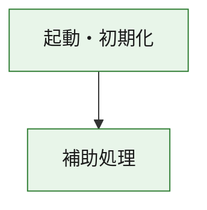
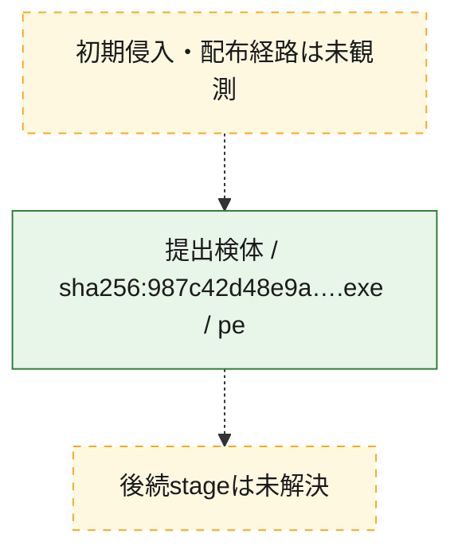
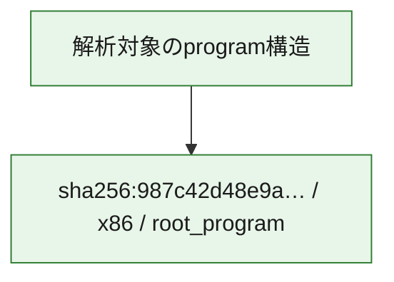

# 全体ロジック：987c42d48e9a78ed2ebc33b4d3b8dd6c1c17d01cd911ff6287fa5d878451b38d

代表関数の静的証跡から、起動・初期化の処理群を確認しました。

## 読み方

- phaseの掲載順は解析上の整理順です。observed_call_edgesがない段階間の実行順を断定しません。
- 図の実線は静的に観測した関係、点線と黄色のノードは未観測・未解決の関係を示します。
- 図は静的な要約であり、動的実行を再現するものではありません。
- 詳細な関数解説とfingerprintは[STATIC-LOGIC.md](STATIC-LOGIC.md)を参照してください。

## 静的可視化

### 実行フロー

### 感染チェーン

### モジュール関係

## 処理段階

### 1. 起動・初期化

entry pointから初期化と後続処理への移行を確認します。
確度: `confirmed_static_function_evidence`

- `987c42d48e9a78ed2ebc33b4d3b8dd6c1c17d01cd911ff6287fa5d878451b38d:ghidra:180001010` — 初期化と主要処理への分岐を行う入口関数です。 状態: `succeeded`、選定理由: `entry_point`, `meaningful_symbol_name`, `reviewed_call_centrality:22`, `role:entrypoint`, `small_program_complete_context`

### 2. 補助処理

主要処理を支える一般内部関数またはlibrary処理を確認します。
確度: `confirmed_static_function_evidence`

- `987c42d48e9a78ed2ebc33b4d3b8dd6c1c17d01cd911ff6287fa5d878451b38d:ghidra:180001240` — 検体内部の一般処理を実装する関数です。 状態: `succeeded`、選定理由: `context_representative`, `reviewed_call_centrality:2`, `small_program_complete_context`
- `987c42d48e9a78ed2ebc33b4d3b8dd6c1c17d01cd911ff6287fa5d878451b38d:ghidra:180001350` — 検体内部の一般処理を実装する関数です。 状態: `succeeded`、選定理由: `context_representative`, `reviewed_call_centrality:25`, `small_program_complete_context`
- `987c42d48e9a78ed2ebc33b4d3b8dd6c1c17d01cd911ff6287fa5d878451b38d:ghidra:180003780` — 検体内部の一般処理を実装する関数です。 状態: `succeeded`、選定理由: `context_representative`, `reviewed_call_centrality:2`, `small_program_complete_context`
- `987c42d48e9a78ed2ebc33b4d3b8dd6c1c17d01cd911ff6287fa5d878451b38d:ghidra:1800038e0` — 検体内部の一般処理を実装する関数です。 状態: `succeeded`、選定理由: `context_representative`, `reviewed_call_centrality:2`, `small_program_complete_context`

## 観測したcall関係

- `987c42d48e9a78ed2ebc33b4d3b8dd6c1c17d01cd911ff6287fa5d878451b38d:ghidra:180001010` → `987c42d48e9a78ed2ebc33b4d3b8dd6c1c17d01cd911ff6287fa5d878451b38d:ghidra:180001240` （`startup` → `support`）
- `987c42d48e9a78ed2ebc33b4d3b8dd6c1c17d01cd911ff6287fa5d878451b38d:ghidra:180001010` → `987c42d48e9a78ed2ebc33b4d3b8dd6c1c17d01cd911ff6287fa5d878451b38d:ghidra:180001350` （`startup` → `support`）
- `987c42d48e9a78ed2ebc33b4d3b8dd6c1c17d01cd911ff6287fa5d878451b38d:ghidra:180001350` → `987c42d48e9a78ed2ebc33b4d3b8dd6c1c17d01cd911ff6287fa5d878451b38d:ghidra:180001240` （`support` → `support`）
- `987c42d48e9a78ed2ebc33b4d3b8dd6c1c17d01cd911ff6287fa5d878451b38d:ghidra:180001350` → `987c42d48e9a78ed2ebc33b4d3b8dd6c1c17d01cd911ff6287fa5d878451b38d:ghidra:180003780` （`support` → `support`）
- `987c42d48e9a78ed2ebc33b4d3b8dd6c1c17d01cd911ff6287fa5d878451b38d:ghidra:180001350` → `987c42d48e9a78ed2ebc33b4d3b8dd6c1c17d01cd911ff6287fa5d878451b38d:ghidra:1800038e0` （`support` → `support`）
- `987c42d48e9a78ed2ebc33b4d3b8dd6c1c17d01cd911ff6287fa5d878451b38d:ghidra:180003780` → `987c42d48e9a78ed2ebc33b4d3b8dd6c1c17d01cd911ff6287fa5d878451b38d:ghidra:1800038e0` （`support` → `support`）
- `ghidra-function:0d7ade73fad700dd9eebab0d` → `ghidra-function:59f0556c4714d2890b540e45` （`unclassified` → `unclassified`）
- `ghidra-function:d049e418f0cfddb6925fa846` → `ghidra-external:1fbcfe6f400e0caf9994c3b9` （`unclassified` → `unclassified`）
- `ghidra-function:d049e418f0cfddb6925fa846` → `ghidra-external:2504994b21be715099765e71` （`unclassified` → `unclassified`）
- `ghidra-function:d049e418f0cfddb6925fa846` → `ghidra-external:2898ddcda0dec61f8f797847` （`unclassified` → `unclassified`）
- `ghidra-function:d049e418f0cfddb6925fa846` → `ghidra-external:4350ebc5997c430a85d024b8` （`unclassified` → `unclassified`）
- `ghidra-function:d049e418f0cfddb6925fa846` → `ghidra-external:52eebbceceadffe4bff72834` （`unclassified` → `unclassified`）
- `ghidra-function:d049e418f0cfddb6925fa846` → `ghidra-external:63b507b49c3f48aff614e47f` （`unclassified` → `unclassified`）
- `ghidra-function:d049e418f0cfddb6925fa846` → `ghidra-external:64eb3bb63b624f87de4b2f4b` （`unclassified` → `unclassified`）
- `ghidra-function:d049e418f0cfddb6925fa846` → `ghidra-external:6fff5bc25f0b8992b4b0d5cc` （`unclassified` → `unclassified`）
- `ghidra-function:d049e418f0cfddb6925fa846` → `ghidra-external:7dba316dcb7f99fd96104ac7` （`unclassified` → `unclassified`）
- `ghidra-function:d049e418f0cfddb6925fa846` → `ghidra-external:8876b5e47182717b28a9762d` （`unclassified` → `unclassified`）
- `ghidra-function:d049e418f0cfddb6925fa846` → `ghidra-external:88e094ddf39d8035eb3ec4b8` （`unclassified` → `unclassified`）
- `ghidra-function:d049e418f0cfddb6925fa846` → `ghidra-external:940e594aaed779873fead0ab` （`unclassified` → `unclassified`）
- `ghidra-function:d049e418f0cfddb6925fa846` → `ghidra-external:bc85c58eb40834d9fe6a044a` （`unclassified` → `unclassified`）
- `ghidra-function:d049e418f0cfddb6925fa846` → `ghidra-external:c01a10ef7011e45f72e18602` （`unclassified` → `unclassified`）
- `ghidra-function:d049e418f0cfddb6925fa846` → `ghidra-external:c6cbb75cafd55069a670aed2` （`unclassified` → `unclassified`）
- `ghidra-function:d049e418f0cfddb6925fa846` → `ghidra-external:e550f23f2a3b3205d7217220` （`unclassified` → `unclassified`）
- `ghidra-function:d049e418f0cfddb6925fa846` → `ghidra-external:eb453c56633894fc6d92c576` （`unclassified` → `unclassified`）
- `ghidra-function:d049e418f0cfddb6925fa846` → `ghidra-external:f5f23736f5adea6af1046f7a` （`unclassified` → `unclassified`）
- `ghidra-function:d049e418f0cfddb6925fa846` → `ghidra-external:f920086eb2d045d413b45739` （`unclassified` → `unclassified`）
- `ghidra-function:d049e418f0cfddb6925fa846` → `ghidra-external:fa3a37f75be8f4dbcbdad4eb` （`unclassified` → `unclassified`）
- `ghidra-function:d049e418f0cfddb6925fa846` → `ghidra-external:fd766a3d10c0f4360b3b5ae9` （`unclassified` → `unclassified`）
- `ghidra-function:d049e418f0cfddb6925fa846` → `ghidra-function:0d7ade73fad700dd9eebab0d` （`unclassified` → `unclassified`）
- `ghidra-function:d049e418f0cfddb6925fa846` → `ghidra-function:59f0556c4714d2890b540e45` （`unclassified` → `unclassified`）
- `ghidra-function:d049e418f0cfddb6925fa846` → `ghidra-function:cf772749f44d84aeef82b27a` （`unclassified` → `unclassified`）
- `ghidra-function:ec5976cb7cbe5336699e521d` → `ghidra-function:1c15011dc97feab3f5f98db7` （`unclassified` → `unclassified`）
- `ghidra-function:ec5976cb7cbe5336699e521d` → `ghidra-function:37a51ef043de30defaba95ec` （`unclassified` → `unclassified`）
- `ghidra-function:ec5976cb7cbe5336699e521d` → `ghidra-function:4e037f0af84e6806cb595941` （`unclassified` → `unclassified`）
- `ghidra-function:ec5976cb7cbe5336699e521d` → `ghidra-function:6d233d8b882591f433a036e1` （`unclassified` → `unclassified`）
- `ghidra-function:ec5976cb7cbe5336699e521d` → `ghidra-function:746fed9ccc5c78d09f774fee` （`unclassified` → `unclassified`）
- `ghidra-function:ec5976cb7cbe5336699e521d` → `ghidra-function:7e7abaa4e34dac7b3e36cb2c` （`unclassified` → `unclassified`）
- `ghidra-function:ec5976cb7cbe5336699e521d` → `ghidra-function:80a0cbf0a029ea8706e10d2c` （`unclassified` → `unclassified`）
- `ghidra-function:ec5976cb7cbe5336699e521d` → `ghidra-function:93821dd09bcb8898e6bd63f9` （`unclassified` → `unclassified`）
- `ghidra-function:ec5976cb7cbe5336699e521d` → `ghidra-function:b8dbd26faa8b2555758da377` （`unclassified` → `unclassified`）
- `ghidra-function:ec5976cb7cbe5336699e521d` → `ghidra-function:cf772749f44d84aeef82b27a` （`unclassified` → `unclassified`）
- `ghidra-function:ec5976cb7cbe5336699e521d` → `ghidra-function:d049e418f0cfddb6925fa846` （`unclassified` → `unclassified`）
- `ghidra-function:ec5976cb7cbe5336699e521d` → `ghidra-function:ea8405f76cb4cc5fb81d12d5` （`unclassified` → `unclassified`）

## 解析範囲と制約

- 選定外関数は全体inventoryへ残しますが、関数本体の個別解説対象にはしていません。
- indirect call、難読化、packer、VM、壊れたcontrol flowによりcall関係が欠落する場合があります。
- 文書は静的解析に基づき、検体実行や外部通信による動的確認は行っていません。
