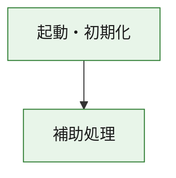
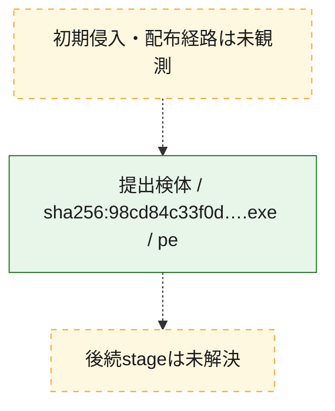
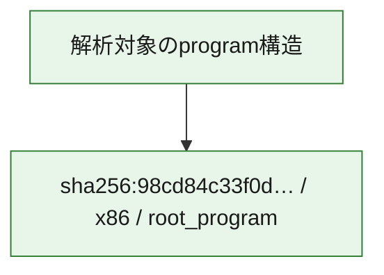

# 全体ロジック：98cd84c33f0d90b0b81f9d7a4c359d56477c9579dc5ee62a18c5a9484ad184f6

代表関数の静的証跡から、起動・初期化の処理群を確認しました。

## 読み方

- phaseの掲載順は解析上の整理順です。observed_call_edgesがない段階間の実行順を断定しません。
- 図の実線は静的に観測した関係、点線と黄色のノードは未観測・未解決の関係を示します。
- 図は静的な要約であり、動的実行を再現するものではありません。
- 詳細な関数解説とfingerprintは[STATIC-LOGIC.md](STATIC-LOGIC.md)を参照してください。

## 静的可視化

### 実行フロー

### 感染チェーン

### モジュール関係

## 処理段階

### 1. 起動・初期化

entry pointから初期化と後続処理への移行を確認します。
確度: `confirmed_static_function_evidence`

- `98cd84c33f0d90b0b81f9d7a4c359d56477c9579dc5ee62a18c5a9484ad184f6:ghidra:180001010` — 初期化と主要処理への分岐を行う入口関数です。 状態: `succeeded`、選定理由: `entry_point`, `meaningful_symbol_name`, `reviewed_call_centrality:22`, `role:entrypoint`, `small_program_complete_context`

### 2. 補助処理

主要処理を支える一般内部関数またはlibrary処理を確認します。
確度: `confirmed_static_function_evidence`

- `98cd84c33f0d90b0b81f9d7a4c359d56477c9579dc5ee62a18c5a9484ad184f6:ghidra:180001240` — 検体内部の一般処理を実装する関数です。 状態: `succeeded`、選定理由: `context_representative`, `reviewed_call_centrality:2`, `small_program_complete_context`
- `98cd84c33f0d90b0b81f9d7a4c359d56477c9579dc5ee62a18c5a9484ad184f6:ghidra:180001350` — 検体内部の一般処理を実装する関数です。 状態: `succeeded`、選定理由: `context_representative`, `reviewed_call_centrality:25`, `small_program_complete_context`
- `98cd84c33f0d90b0b81f9d7a4c359d56477c9579dc5ee62a18c5a9484ad184f6:ghidra:180003780` — 検体内部の一般処理を実装する関数です。 状態: `succeeded`、選定理由: `context_representative`, `reviewed_call_centrality:2`, `small_program_complete_context`
- `98cd84c33f0d90b0b81f9d7a4c359d56477c9579dc5ee62a18c5a9484ad184f6:ghidra:1800038e0` — 検体内部の一般処理を実装する関数です。 状態: `succeeded`、選定理由: `context_representative`, `reviewed_call_centrality:2`, `small_program_complete_context`

## 観測したcall関係

- `98cd84c33f0d90b0b81f9d7a4c359d56477c9579dc5ee62a18c5a9484ad184f6:ghidra:180001010` → `98cd84c33f0d90b0b81f9d7a4c359d56477c9579dc5ee62a18c5a9484ad184f6:ghidra:180001240` （`startup` → `support`）
- `98cd84c33f0d90b0b81f9d7a4c359d56477c9579dc5ee62a18c5a9484ad184f6:ghidra:180001010` → `98cd84c33f0d90b0b81f9d7a4c359d56477c9579dc5ee62a18c5a9484ad184f6:ghidra:180001350` （`startup` → `support`）
- `98cd84c33f0d90b0b81f9d7a4c359d56477c9579dc5ee62a18c5a9484ad184f6:ghidra:180001350` → `98cd84c33f0d90b0b81f9d7a4c359d56477c9579dc5ee62a18c5a9484ad184f6:ghidra:180001240` （`support` → `support`）
- `98cd84c33f0d90b0b81f9d7a4c359d56477c9579dc5ee62a18c5a9484ad184f6:ghidra:180001350` → `98cd84c33f0d90b0b81f9d7a4c359d56477c9579dc5ee62a18c5a9484ad184f6:ghidra:180003780` （`support` → `support`）
- `98cd84c33f0d90b0b81f9d7a4c359d56477c9579dc5ee62a18c5a9484ad184f6:ghidra:180001350` → `98cd84c33f0d90b0b81f9d7a4c359d56477c9579dc5ee62a18c5a9484ad184f6:ghidra:1800038e0` （`support` → `support`）
- `98cd84c33f0d90b0b81f9d7a4c359d56477c9579dc5ee62a18c5a9484ad184f6:ghidra:180003780` → `98cd84c33f0d90b0b81f9d7a4c359d56477c9579dc5ee62a18c5a9484ad184f6:ghidra:1800038e0` （`support` → `support`）
- `ghidra-function:a960c8b9c94d115715b313cd` → `ghidra-function:1ce9efbaaae16caac29c0629` （`unclassified` → `unclassified`）
- `ghidra-function:a960c8b9c94d115715b313cd` → `ghidra-function:2acffb01743bbe2f934368ed` （`unclassified` → `unclassified`）
- `ghidra-function:a960c8b9c94d115715b313cd` → `ghidra-function:361b4fa99b0b268c40da8eba` （`unclassified` → `unclassified`）
- `ghidra-function:a960c8b9c94d115715b313cd` → `ghidra-function:52c92fae6fe7a653d8dbbbb9` （`unclassified` → `unclassified`）
- `ghidra-function:a960c8b9c94d115715b313cd` → `ghidra-function:53b2783e3de7758221f0b9b2` （`unclassified` → `unclassified`）
- `ghidra-function:a960c8b9c94d115715b313cd` → `ghidra-function:59abc94482985c3c05e1d595` （`unclassified` → `unclassified`）
- `ghidra-function:a960c8b9c94d115715b313cd` → `ghidra-function:718d9136c40ef9b91c59693e` （`unclassified` → `unclassified`）
- `ghidra-function:a960c8b9c94d115715b313cd` → `ghidra-function:7cfed3ad9aef9c96a266944a` （`unclassified` → `unclassified`）
- `ghidra-function:a960c8b9c94d115715b313cd` → `ghidra-function:d4acab50a7c0f137a4369c3e` （`unclassified` → `unclassified`）
- `ghidra-function:a960c8b9c94d115715b313cd` → `ghidra-function:e2b84ce1c3bf46c8768b9aa5` （`unclassified` → `unclassified`）
- `ghidra-function:a960c8b9c94d115715b313cd` → `ghidra-function:f0db82b8feb7de7998ce91d2` （`unclassified` → `unclassified`）
- `ghidra-function:a960c8b9c94d115715b313cd` → `ghidra-function:f3260b220342114f18af6156` （`unclassified` → `unclassified`）
- `ghidra-function:bac5c0b719863d0897879adf` → `ghidra-function:ee1d4a3746af39421d99d3dc` （`unclassified` → `unclassified`）
- `ghidra-function:f0db82b8feb7de7998ce91d2` → `ghidra-external:0932b4505b1ebd97813ea0e5` （`unclassified` → `unclassified`）
- `ghidra-function:f0db82b8feb7de7998ce91d2` → `ghidra-external:226c921fff119cf3aa0f3bb0` （`unclassified` → `unclassified`）
- `ghidra-function:f0db82b8feb7de7998ce91d2` → `ghidra-external:2768d2aca2eb20149020d502` （`unclassified` → `unclassified`）
- `ghidra-function:f0db82b8feb7de7998ce91d2` → `ghidra-external:30494cc52d91ad35f267d2a7` （`unclassified` → `unclassified`）
- `ghidra-function:f0db82b8feb7de7998ce91d2` → `ghidra-external:387e2178a94ae65500cbdd44` （`unclassified` → `unclassified`）
- `ghidra-function:f0db82b8feb7de7998ce91d2` → `ghidra-external:3f3658d30ff25d0c7172d2b8` （`unclassified` → `unclassified`）
- `ghidra-function:f0db82b8feb7de7998ce91d2` → `ghidra-external:400231d4b0b4b7568c268ade` （`unclassified` → `unclassified`）
- `ghidra-function:f0db82b8feb7de7998ce91d2` → `ghidra-external:4df15c8fd8021de88828b8be` （`unclassified` → `unclassified`）
- `ghidra-function:f0db82b8feb7de7998ce91d2` → `ghidra-external:625c63e8215fc3a3fb003170` （`unclassified` → `unclassified`）
- `ghidra-function:f0db82b8feb7de7998ce91d2` → `ghidra-external:67016a02988c3b47d4e33201` （`unclassified` → `unclassified`）
- `ghidra-function:f0db82b8feb7de7998ce91d2` → `ghidra-external:73985edb0d6314ddeb3aedf9` （`unclassified` → `unclassified`）
- `ghidra-function:f0db82b8feb7de7998ce91d2` → `ghidra-external:83ebf80aa16f970c9169e6ca` （`unclassified` → `unclassified`）
- `ghidra-function:f0db82b8feb7de7998ce91d2` → `ghidra-external:88546363aa1944c230cc9034` （`unclassified` → `unclassified`）
- `ghidra-function:f0db82b8feb7de7998ce91d2` → `ghidra-external:8adac1c5d58f5c7b0c53c731` （`unclassified` → `unclassified`）
- `ghidra-function:f0db82b8feb7de7998ce91d2` → `ghidra-external:b76794f0a9113002095121a3` （`unclassified` → `unclassified`）
- `ghidra-function:f0db82b8feb7de7998ce91d2` → `ghidra-external:bbda8c4d22afccd383085262` （`unclassified` → `unclassified`）
- `ghidra-function:f0db82b8feb7de7998ce91d2` → `ghidra-external:cec83f1d9977c2a32f3e02eb` （`unclassified` → `unclassified`）
- `ghidra-function:f0db82b8feb7de7998ce91d2` → `ghidra-external:e126ffcc593d3a9d522af82c` （`unclassified` → `unclassified`）
- `ghidra-function:f0db82b8feb7de7998ce91d2` → `ghidra-external:e1689594fc03c03af31561b4` （`unclassified` → `unclassified`）
- `ghidra-function:f0db82b8feb7de7998ce91d2` → `ghidra-external:f4144e8ecf04fa2a6948b9fe` （`unclassified` → `unclassified`）
- `ghidra-function:f0db82b8feb7de7998ce91d2` → `ghidra-external:fc23233fa5c7e70b44d6b014` （`unclassified` → `unclassified`）
- `ghidra-function:f0db82b8feb7de7998ce91d2` → `ghidra-function:bac5c0b719863d0897879adf` （`unclassified` → `unclassified`）
- `ghidra-function:f0db82b8feb7de7998ce91d2` → `ghidra-function:e2b84ce1c3bf46c8768b9aa5` （`unclassified` → `unclassified`）
- `ghidra-function:f0db82b8feb7de7998ce91d2` → `ghidra-function:ee1d4a3746af39421d99d3dc` （`unclassified` → `unclassified`）

## 解析範囲と制約

- 選定外関数は全体inventoryへ残しますが、関数本体の個別解説対象にはしていません。
- indirect call、難読化、packer、VM、壊れたcontrol flowによりcall関係が欠落する場合があります。
- 文書は静的解析に基づき、検体実行や外部通信による動的確認は行っていません。
