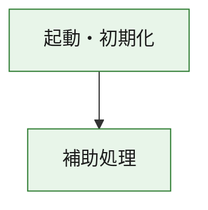
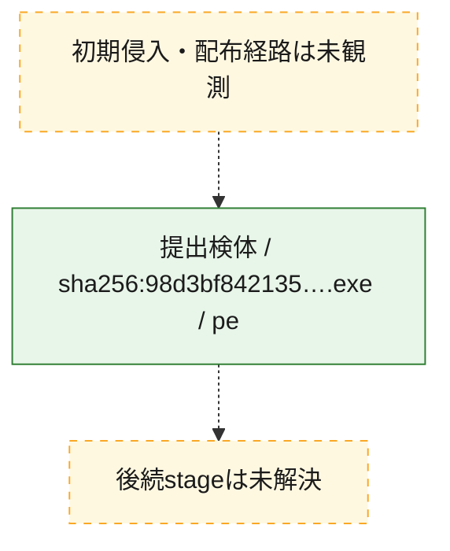
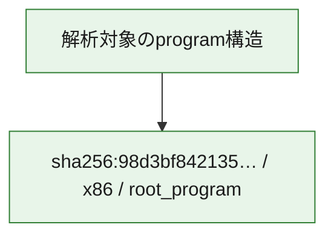

# 全体ロジック：98d3bf842135bd8ad5d4986d3ffaf04d75b057438f35819dc714799757c3a1bd

代表関数の静的証跡から、起動・初期化の処理群を確認しました。

## 読み方

- phaseの掲載順は解析上の整理順です。observed_call_edgesがない段階間の実行順を断定しません。
- 図の実線は静的に観測した関係、点線と黄色のノードは未観測・未解決の関係を示します。
- 図は静的な要約であり、動的実行を再現するものではありません。
- 詳細な関数解説とfingerprintは[STATIC-LOGIC.md](STATIC-LOGIC.md)を参照してください。

## 静的可視化

### 実行フロー

### 感染チェーン

### モジュール関係

## 処理段階

### 1. 起動・初期化

entry pointから初期化と後続処理への移行を確認します。
確度: `confirmed_static_function_evidence`

- `98d3bf842135bd8ad5d4986d3ffaf04d75b057438f35819dc714799757c3a1bd:ghidra:180001010` — 初期化と主要処理への分岐を行う入口関数です。 状態: `succeeded`、選定理由: `entry_point`, `meaningful_symbol_name`, `reviewed_call_centrality:22`, `role:entrypoint`, `small_program_complete_context`

### 2. 補助処理

主要処理を支える一般内部関数またはlibrary処理を確認します。
確度: `confirmed_static_function_evidence`

- `98d3bf842135bd8ad5d4986d3ffaf04d75b057438f35819dc714799757c3a1bd:ghidra:180001240` — 検体内部の一般処理を実装する関数です。 状態: `succeeded`、選定理由: `context_representative`, `reviewed_call_centrality:2`, `small_program_complete_context`
- `98d3bf842135bd8ad5d4986d3ffaf04d75b057438f35819dc714799757c3a1bd:ghidra:180001350` — 検体内部の一般処理を実装する関数です。 状態: `succeeded`、選定理由: `context_representative`, `reviewed_call_centrality:25`, `small_program_complete_context`
- `98d3bf842135bd8ad5d4986d3ffaf04d75b057438f35819dc714799757c3a1bd:ghidra:180003780` — 検体内部の一般処理を実装する関数です。 状態: `succeeded`、選定理由: `context_representative`, `reviewed_call_centrality:2`, `small_program_complete_context`
- `98d3bf842135bd8ad5d4986d3ffaf04d75b057438f35819dc714799757c3a1bd:ghidra:1800038e0` — 検体内部の一般処理を実装する関数です。 状態: `succeeded`、選定理由: `context_representative`, `reviewed_call_centrality:2`, `small_program_complete_context`

## 観測したcall関係

- `98d3bf842135bd8ad5d4986d3ffaf04d75b057438f35819dc714799757c3a1bd:ghidra:180001010` → `98d3bf842135bd8ad5d4986d3ffaf04d75b057438f35819dc714799757c3a1bd:ghidra:180001240` （`startup` → `support`）
- `98d3bf842135bd8ad5d4986d3ffaf04d75b057438f35819dc714799757c3a1bd:ghidra:180001010` → `98d3bf842135bd8ad5d4986d3ffaf04d75b057438f35819dc714799757c3a1bd:ghidra:180001350` （`startup` → `support`）
- `98d3bf842135bd8ad5d4986d3ffaf04d75b057438f35819dc714799757c3a1bd:ghidra:180001350` → `98d3bf842135bd8ad5d4986d3ffaf04d75b057438f35819dc714799757c3a1bd:ghidra:180001240` （`support` → `support`）
- `98d3bf842135bd8ad5d4986d3ffaf04d75b057438f35819dc714799757c3a1bd:ghidra:180001350` → `98d3bf842135bd8ad5d4986d3ffaf04d75b057438f35819dc714799757c3a1bd:ghidra:180003780` （`support` → `support`）
- `98d3bf842135bd8ad5d4986d3ffaf04d75b057438f35819dc714799757c3a1bd:ghidra:180001350` → `98d3bf842135bd8ad5d4986d3ffaf04d75b057438f35819dc714799757c3a1bd:ghidra:1800038e0` （`support` → `support`）
- `98d3bf842135bd8ad5d4986d3ffaf04d75b057438f35819dc714799757c3a1bd:ghidra:180003780` → `98d3bf842135bd8ad5d4986d3ffaf04d75b057438f35819dc714799757c3a1bd:ghidra:1800038e0` （`support` → `support`）
- `ghidra-function:7aa4de6247618fffc0b7dfaf` → `ghidra-function:0f52fa6f071f7109a19a7729` （`unclassified` → `unclassified`）
- `ghidra-function:7aa4de6247618fffc0b7dfaf` → `ghidra-function:2c1e06cf02c61999106b5426` （`unclassified` → `unclassified`）
- `ghidra-function:7aa4de6247618fffc0b7dfaf` → `ghidra-function:370485f15f29d98136dc32aa` （`unclassified` → `unclassified`）
- `ghidra-function:7aa4de6247618fffc0b7dfaf` → `ghidra-function:3cd6441b37ce8aa6b51998dc` （`unclassified` → `unclassified`）
- `ghidra-function:7aa4de6247618fffc0b7dfaf` → `ghidra-function:60d13b7a419e5d08e071a14b` （`unclassified` → `unclassified`）
- `ghidra-function:7aa4de6247618fffc0b7dfaf` → `ghidra-function:7ec514287f7ff6a46cb0b0f0` （`unclassified` → `unclassified`）
- `ghidra-function:7aa4de6247618fffc0b7dfaf` → `ghidra-function:8e6aa63c1ba5a1be02e4e421` （`unclassified` → `unclassified`）
- `ghidra-function:7aa4de6247618fffc0b7dfaf` → `ghidra-function:9410184c7614decfc7336517` （`unclassified` → `unclassified`）
- `ghidra-function:7aa4de6247618fffc0b7dfaf` → `ghidra-function:9b15f49973791ec5fcdd7357` （`unclassified` → `unclassified`）
- `ghidra-function:7aa4de6247618fffc0b7dfaf` → `ghidra-function:9b78e993f6265ae1a494dde9` （`unclassified` → `unclassified`）
- `ghidra-function:7aa4de6247618fffc0b7dfaf` → `ghidra-function:d2676c0dd3b7a756ac4e511e` （`unclassified` → `unclassified`）
- `ghidra-function:7aa4de6247618fffc0b7dfaf` → `ghidra-function:eba3b8f5454ffcc574caf590` （`unclassified` → `unclassified`）
- `ghidra-function:8e6aa63c1ba5a1be02e4e421` → `ghidra-external:0594ba62df8dc8cd7c6ac99c` （`unclassified` → `unclassified`）
- `ghidra-function:8e6aa63c1ba5a1be02e4e421` → `ghidra-external:0a67ce8f97e85921be6bf4af` （`unclassified` → `unclassified`）
- `ghidra-function:8e6aa63c1ba5a1be02e4e421` → `ghidra-external:0ad92d3a843140a6ff30b1f5` （`unclassified` → `unclassified`）
- `ghidra-function:8e6aa63c1ba5a1be02e4e421` → `ghidra-external:17999471597ad883cdbbf9d7` （`unclassified` → `unclassified`）
- `ghidra-function:8e6aa63c1ba5a1be02e4e421` → `ghidra-external:26b28ddd3bf875edf825fca7` （`unclassified` → `unclassified`）
- `ghidra-function:8e6aa63c1ba5a1be02e4e421` → `ghidra-external:53da35426cded51ae85a2bf6` （`unclassified` → `unclassified`）
- `ghidra-function:8e6aa63c1ba5a1be02e4e421` → `ghidra-external:5581a11a79f32a84cad6f2ab` （`unclassified` → `unclassified`）
- `ghidra-function:8e6aa63c1ba5a1be02e4e421` → `ghidra-external:6c1189e55a19c70f456f76fd` （`unclassified` → `unclassified`）
- `ghidra-function:8e6aa63c1ba5a1be02e4e421` → `ghidra-external:6e86934d7f73f2ce38e53bcc` （`unclassified` → `unclassified`）
- `ghidra-function:8e6aa63c1ba5a1be02e4e421` → `ghidra-external:8ab9fa668b36ae389a6df709` （`unclassified` → `unclassified`）
- `ghidra-function:8e6aa63c1ba5a1be02e4e421` → `ghidra-external:8b82aa2b6fdbb8caa8ee2985` （`unclassified` → `unclassified`）
- `ghidra-function:8e6aa63c1ba5a1be02e4e421` → `ghidra-external:92e7382a8e9f461dd94c487d` （`unclassified` → `unclassified`）
- `ghidra-function:8e6aa63c1ba5a1be02e4e421` → `ghidra-external:92eaf23caa691d8dea0a4644` （`unclassified` → `unclassified`）
- `ghidra-function:8e6aa63c1ba5a1be02e4e421` → `ghidra-external:9e5ab51f1f644ac5149ce82f` （`unclassified` → `unclassified`）
- `ghidra-function:8e6aa63c1ba5a1be02e4e421` → `ghidra-external:b1f8f6f53ac9f5b2d2555c8f` （`unclassified` → `unclassified`）
- `ghidra-function:8e6aa63c1ba5a1be02e4e421` → `ghidra-external:c1fa68a7e37cbb3a39bc571a` （`unclassified` → `unclassified`）
- `ghidra-function:8e6aa63c1ba5a1be02e4e421` → `ghidra-external:cc277707cfbfa42d0e160808` （`unclassified` → `unclassified`）
- `ghidra-function:8e6aa63c1ba5a1be02e4e421` → `ghidra-external:cc8a41390aef1c8a36d7f41f` （`unclassified` → `unclassified`）
- `ghidra-function:8e6aa63c1ba5a1be02e4e421` → `ghidra-external:de058fc79fe19a0a27bfee10` （`unclassified` → `unclassified`）
- `ghidra-function:8e6aa63c1ba5a1be02e4e421` → `ghidra-external:e76a030a19d412bffcae692e` （`unclassified` → `unclassified`）
- `ghidra-function:8e6aa63c1ba5a1be02e4e421` → `ghidra-external:f0c9c7d53d5a16490d1f0c5f` （`unclassified` → `unclassified`）
- `ghidra-function:8e6aa63c1ba5a1be02e4e421` → `ghidra-function:370485f15f29d98136dc32aa` （`unclassified` → `unclassified`）
- `ghidra-function:8e6aa63c1ba5a1be02e4e421` → `ghidra-function:d407dc7a3dd8c2aa2b7d2ac0` （`unclassified` → `unclassified`）
- `ghidra-function:8e6aa63c1ba5a1be02e4e421` → `ghidra-function:f19e0d2e0434ce182d9ea0af` （`unclassified` → `unclassified`）
- `ghidra-function:d407dc7a3dd8c2aa2b7d2ac0` → `ghidra-function:f19e0d2e0434ce182d9ea0af` （`unclassified` → `unclassified`）

## 解析範囲と制約

- 選定外関数は全体inventoryへ残しますが、関数本体の個別解説対象にはしていません。
- indirect call、難読化、packer、VM、壊れたcontrol flowによりcall関係が欠落する場合があります。
- 文書は静的解析に基づき、検体実行や外部通信による動的確認は行っていません。
