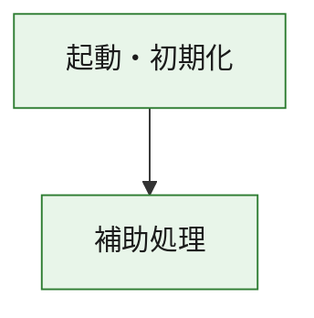
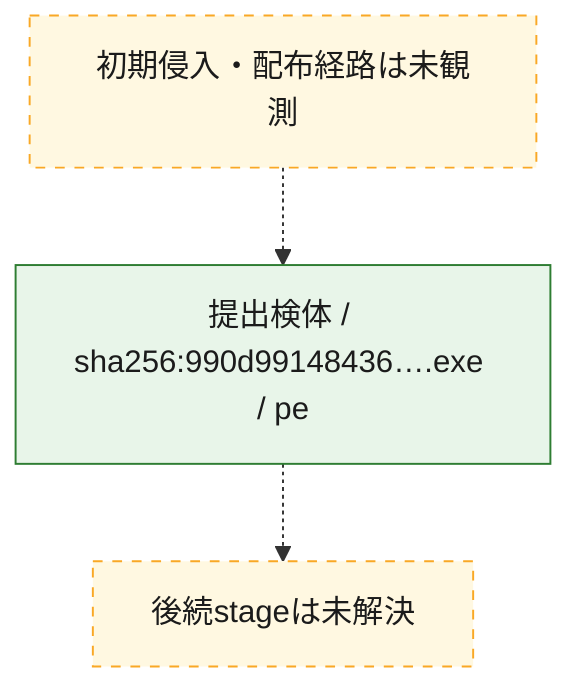
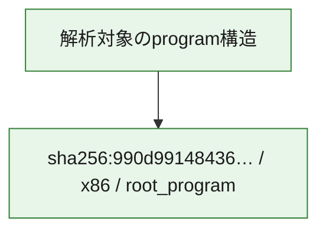

# 全体ロジック：990d9914843669dbf47e67b57456d5b81e9639f561b4c21f2ec74906840ec7a4

代表関数の静的証跡から、起動・初期化の処理群を確認しました。

## 読み方

- phaseの掲載順は解析上の整理順です。observed_call_edgesがない段階間の実行順を断定しません。
- 図の実線は静的に観測した関係、点線と黄色のノードは未観測・未解決の関係を示します。
- 図は静的な要約であり、動的実行を再現するものではありません。
- 詳細な関数解説とfingerprintは[STATIC-LOGIC.md](STATIC-LOGIC.md)を参照してください。

## 静的可視化

### 実行フロー

### 感染チェーン

### モジュール関係

## 処理段階

### 1. 起動・初期化

entry pointから初期化と後続処理への移行を確認します。
確度: `confirmed_static_function_evidence`

- `990d9914843669dbf47e67b57456d5b81e9639f561b4c21f2ec74906840ec7a4:ghidra:180001010` — 初期化と主要処理への分岐を行う入口関数です。 状態: `succeeded`、選定理由: `entry_point`, `meaningful_symbol_name`, `reviewed_call_centrality:22`, `role:entrypoint`, `small_program_complete_context`

### 2. 補助処理

主要処理を支える一般内部関数またはlibrary処理を確認します。
確度: `confirmed_static_function_evidence`

- `990d9914843669dbf47e67b57456d5b81e9639f561b4c21f2ec74906840ec7a4:ghidra:180001240` — 検体内部の一般処理を実装する関数です。 状態: `succeeded`、選定理由: `context_representative`, `reviewed_call_centrality:2`, `small_program_complete_context`
- `990d9914843669dbf47e67b57456d5b81e9639f561b4c21f2ec74906840ec7a4:ghidra:180001350` — 検体内部の一般処理を実装する関数です。 状態: `succeeded`、選定理由: `context_representative`, `reviewed_call_centrality:25`, `small_program_complete_context`
- `990d9914843669dbf47e67b57456d5b81e9639f561b4c21f2ec74906840ec7a4:ghidra:180003780` — 検体内部の一般処理を実装する関数です。 状態: `succeeded`、選定理由: `context_representative`, `reviewed_call_centrality:2`, `small_program_complete_context`
- `990d9914843669dbf47e67b57456d5b81e9639f561b4c21f2ec74906840ec7a4:ghidra:1800038e0` — 検体内部の一般処理を実装する関数です。 状態: `succeeded`、選定理由: `context_representative`, `reviewed_call_centrality:2`, `small_program_complete_context`

## 観測したcall関係

- `990d9914843669dbf47e67b57456d5b81e9639f561b4c21f2ec74906840ec7a4:ghidra:180001010` → `990d9914843669dbf47e67b57456d5b81e9639f561b4c21f2ec74906840ec7a4:ghidra:180001240` （`startup` → `support`）
- `990d9914843669dbf47e67b57456d5b81e9639f561b4c21f2ec74906840ec7a4:ghidra:180001010` → `990d9914843669dbf47e67b57456d5b81e9639f561b4c21f2ec74906840ec7a4:ghidra:180001350` （`startup` → `support`）
- `990d9914843669dbf47e67b57456d5b81e9639f561b4c21f2ec74906840ec7a4:ghidra:180001350` → `990d9914843669dbf47e67b57456d5b81e9639f561b4c21f2ec74906840ec7a4:ghidra:180001240` （`support` → `support`）
- `990d9914843669dbf47e67b57456d5b81e9639f561b4c21f2ec74906840ec7a4:ghidra:180001350` → `990d9914843669dbf47e67b57456d5b81e9639f561b4c21f2ec74906840ec7a4:ghidra:180003780` （`support` → `support`）
- `990d9914843669dbf47e67b57456d5b81e9639f561b4c21f2ec74906840ec7a4:ghidra:180001350` → `990d9914843669dbf47e67b57456d5b81e9639f561b4c21f2ec74906840ec7a4:ghidra:1800038e0` （`support` → `support`）
- `990d9914843669dbf47e67b57456d5b81e9639f561b4c21f2ec74906840ec7a4:ghidra:180003780` → `990d9914843669dbf47e67b57456d5b81e9639f561b4c21f2ec74906840ec7a4:ghidra:1800038e0` （`support` → `support`）
- `ghidra-function:0505210e0b0935ae5e496ec8` → `ghidra-function:2e65f65bb8f6298c18eb0b01` （`unclassified` → `unclassified`）
- `ghidra-function:10279aaf04197568f372d6a8` → `ghidra-external:005a3e943acee1794dbb904d` （`unclassified` → `unclassified`）
- `ghidra-function:10279aaf04197568f372d6a8` → `ghidra-external:037847ab982efe7445abc2be` （`unclassified` → `unclassified`）
- `ghidra-function:10279aaf04197568f372d6a8` → `ghidra-external:0b17997a326fbea069851a32` （`unclassified` → `unclassified`）
- `ghidra-function:10279aaf04197568f372d6a8` → `ghidra-external:167ce5001f5f538a23e5d239` （`unclassified` → `unclassified`）
- `ghidra-function:10279aaf04197568f372d6a8` → `ghidra-external:4c0681ecc0d76f1c06327051` （`unclassified` → `unclassified`）
- `ghidra-function:10279aaf04197568f372d6a8` → `ghidra-external:60a5421e9e59508206fe1b57` （`unclassified` → `unclassified`）
- `ghidra-function:10279aaf04197568f372d6a8` → `ghidra-external:614b0efba8f5d67326112024` （`unclassified` → `unclassified`）
- `ghidra-function:10279aaf04197568f372d6a8` → `ghidra-external:6dd9e4906acef29e8925541f` （`unclassified` → `unclassified`）
- `ghidra-function:10279aaf04197568f372d6a8` → `ghidra-external:6eed39480bc2198fbb8b76f0` （`unclassified` → `unclassified`）
- `ghidra-function:10279aaf04197568f372d6a8` → `ghidra-external:74089bb2b0ef9b47c20e421e` （`unclassified` → `unclassified`）
- `ghidra-function:10279aaf04197568f372d6a8` → `ghidra-external:786fa7d2cb20a516bec0b10b` （`unclassified` → `unclassified`）
- `ghidra-function:10279aaf04197568f372d6a8` → `ghidra-external:8125aab8eb9193760e392fb6` （`unclassified` → `unclassified`）
- `ghidra-function:10279aaf04197568f372d6a8` → `ghidra-external:913212bf32941a7575668f6e` （`unclassified` → `unclassified`）
- `ghidra-function:10279aaf04197568f372d6a8` → `ghidra-external:921f75eb6493a2e7bf53f2cf` （`unclassified` → `unclassified`）
- `ghidra-function:10279aaf04197568f372d6a8` → `ghidra-external:9b71de00b55e7f13d7333e18` （`unclassified` → `unclassified`）
- `ghidra-function:10279aaf04197568f372d6a8` → `ghidra-external:9d99d18895ada759d93157ef` （`unclassified` → `unclassified`）
- `ghidra-function:10279aaf04197568f372d6a8` → `ghidra-external:a02fdf330e361619879f2893` （`unclassified` → `unclassified`）
- `ghidra-function:10279aaf04197568f372d6a8` → `ghidra-external:a6a814a3d7f923071e6df7ff` （`unclassified` → `unclassified`）
- `ghidra-function:10279aaf04197568f372d6a8` → `ghidra-external:bd4cdb4fbf0ee4b65fce9590` （`unclassified` → `unclassified`）
- `ghidra-function:10279aaf04197568f372d6a8` → `ghidra-external:d8396ed40264889736eb2bba` （`unclassified` → `unclassified`）
- `ghidra-function:10279aaf04197568f372d6a8` → `ghidra-external:f95e2d2f0a7c15a771553f26` （`unclassified` → `unclassified`）
- `ghidra-function:10279aaf04197568f372d6a8` → `ghidra-function:0505210e0b0935ae5e496ec8` （`unclassified` → `unclassified`）
- `ghidra-function:10279aaf04197568f372d6a8` → `ghidra-function:2a9ee2325ce99a45b774e5f8` （`unclassified` → `unclassified`）
- `ghidra-function:10279aaf04197568f372d6a8` → `ghidra-function:2e65f65bb8f6298c18eb0b01` （`unclassified` → `unclassified`）
- `ghidra-function:33a72c8df74f5b6bb8ab0d20` → `ghidra-function:0164830b336921bf310518f0` （`unclassified` → `unclassified`）
- `ghidra-function:33a72c8df74f5b6bb8ab0d20` → `ghidra-function:05300a6f953691a81c7ca4f1` （`unclassified` → `unclassified`）
- `ghidra-function:33a72c8df74f5b6bb8ab0d20` → `ghidra-function:09453af6a78c0d5422ba7609` （`unclassified` → `unclassified`）
- `ghidra-function:33a72c8df74f5b6bb8ab0d20` → `ghidra-function:10279aaf04197568f372d6a8` （`unclassified` → `unclassified`）
- `ghidra-function:33a72c8df74f5b6bb8ab0d20` → `ghidra-function:2a9ee2325ce99a45b774e5f8` （`unclassified` → `unclassified`）
- `ghidra-function:33a72c8df74f5b6bb8ab0d20` → `ghidra-function:3b96fe9603199e1a131802eb` （`unclassified` → `unclassified`）
- `ghidra-function:33a72c8df74f5b6bb8ab0d20` → `ghidra-function:60594eb746148867a6f7da80` （`unclassified` → `unclassified`）
- `ghidra-function:33a72c8df74f5b6bb8ab0d20` → `ghidra-function:738b4031bd0a2cf7ecff6d80` （`unclassified` → `unclassified`）
- `ghidra-function:33a72c8df74f5b6bb8ab0d20` → `ghidra-function:8e82b94c572d92dc63a64fd8` （`unclassified` → `unclassified`）
- `ghidra-function:33a72c8df74f5b6bb8ab0d20` → `ghidra-function:a3b1983a60a4c31f82f5894f` （`unclassified` → `unclassified`）
- `ghidra-function:33a72c8df74f5b6bb8ab0d20` → `ghidra-function:c5bec3f9199783a8a3b5eea5` （`unclassified` → `unclassified`）
- `ghidra-function:33a72c8df74f5b6bb8ab0d20` → `ghidra-function:d3892ac2c8aeb9e17262846f` （`unclassified` → `unclassified`）

## 解析範囲と制約

- 選定外関数は全体inventoryへ残しますが、関数本体の個別解説対象にはしていません。
- indirect call、難読化、packer、VM、壊れたcontrol flowによりcall関係が欠落する場合があります。
- 文書は静的解析に基づき、検体実行や外部通信による動的確認は行っていません。
