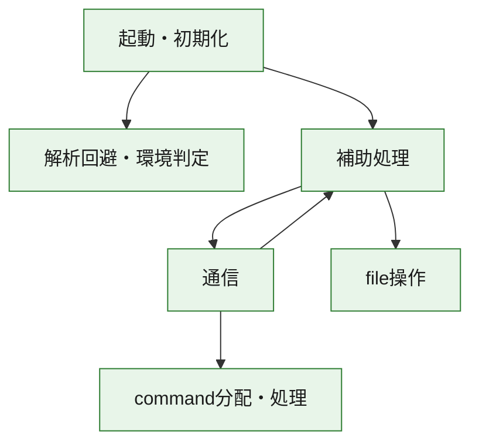
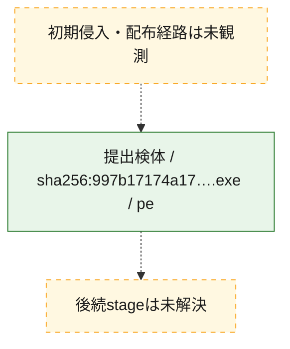
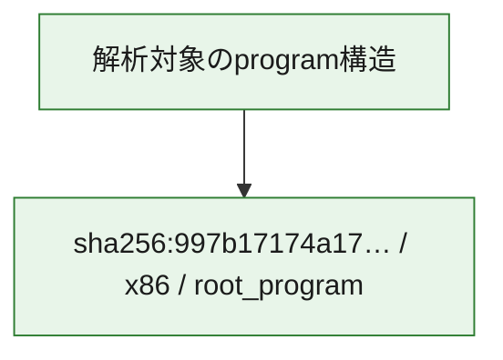

# 全体ロジック：997b17174a1794599ff328f246f5977d0f1bdee26f3d728dccfe808751e7f6c1

代表関数の静的証跡から、起動・初期化、解析回避・環境判定、通信、command分配・処理、file操作の処理群を確認しました。

## 読み方

- phaseの掲載順は解析上の整理順です。observed_call_edgesがない段階間の実行順を断定しません。
- 図の実線は静的に観測した関係、点線と黄色のノードは未観測・未解決の関係を示します。
- 図は静的な要約であり、動的実行を再現するものではありません。
- 詳細な関数解説とfingerprintは[STATIC-LOGIC.md](STATIC-LOGIC.md)を参照してください。

## 静的可視化

### 実行フロー

### 感染チェーン

### モジュール関係

## 処理段階

### 1. 起動・初期化

entry pointから初期化と後続処理への移行を確認します。
確度: `confirmed_static_function_evidence`

- `997b17174a1794599ff328f246f5977d0f1bdee26f3d728dccfe808751e7f6c1:ghidra:004018e5` — 初期化と主要処理への分岐を行う入口関数です。 状態: `succeeded`、選定理由: `call_graph_centrality:in=0,out=2`, `entry_point`, `meaningful_symbol_name`, `reviewed_call_centrality:2`, `role:entrypoint`, `small_program_complete_context`

### 2. 解析回避・環境判定

debugger、sandbox、仮想環境、時間差などの判定を確認します。
確度: `confirmed_static_function_evidence`

- `997b17174a1794599ff328f246f5977d0f1bdee26f3d728dccfe808751e7f6c1:ghidra:00401c68` — debugger、仮想環境、sandbox、または時間差の確認に関係する関数です。 状態: `succeeded`、選定理由: `call_graph_centrality:in=1,out=5`, `reviewed_call_centrality:11`, `reviewed_call_centrality:6`, `role:anti_analysis`, `small_program_complete_context`

### 3. 通信

通信初期化、endpoint処理、送受信の役割を確認します。
確度: `confirmed_static_function_evidence`

- `997b17174a1794599ff328f246f5977d0f1bdee26f3d728dccfe808751e7f6c1:ghidra:004010a8` — 通信初期化、送受信、またはendpoint処理に関係する関数です。 状態: `succeeded`、選定理由: `call_graph_centrality:in=1,out=17`, `large_function:instructions=187`, `reviewed_call_centrality:19`, `reviewed_call_centrality:29`, `role:network_communication`, `small_program_complete_context`

### 4. command分配・処理

受信commandやtaskの解釈、分配、個別handlerへの移行を確認します。
確度: `confirmed_static_function_evidence`

- `997b17174a1794599ff328f246f5977d0f1bdee26f3d728dccfe808751e7f6c1:ghidra:00401000` — commandの解釈、分配、または個別処理を担当する関数です。 状態: `succeeded`、選定理由: `call_graph_centrality:in=1,out=5`, `reviewed_call_centrality:10`, `reviewed_call_centrality:7`, `role:command_dispatch_or_handler`, `small_program_complete_context`

### 5. file操作

fileやdirectoryの作成、読書き、削除を確認します。
確度: `confirmed_static_function_evidence`

- `997b17174a1794599ff328f246f5977d0f1bdee26f3d728dccfe808751e7f6c1:ghidra:004012fb` — fileまたはdirectoryの読書き・管理に関係する関数です。 状態: `succeeded`、選定理由: `call_graph_centrality:in=1,out=5`, `reviewed_call_centrality:11`, `reviewed_call_centrality:7`, `role:file_operation`, `small_program_complete_context`
- `997b17174a1794599ff328f246f5977d0f1bdee26f3d728dccfe808751e7f6c1:ghidra:00401370` — fileまたはdirectoryの読書き・管理に関係する関数です。 状態: `succeeded`、選定理由: `call_graph_centrality:in=1,out=5`, `reviewed_call_centrality:11`, `reviewed_call_centrality:7`, `role:file_operation`, `small_program_complete_context`
- `997b17174a1794599ff328f246f5977d0f1bdee26f3d728dccfe808751e7f6c1:ghidra:004013e5` — fileまたはdirectoryの読書き・管理に関係する関数です。 状態: `succeeded`、選定理由: `call_graph_centrality:in=1,out=5`, `reviewed_call_centrality:11`, `reviewed_call_centrality:7`, `role:file_operation`, `small_program_complete_context`

### 6. 補助処理

主要処理を支える一般内部関数またはlibrary処理を確認します。
確度: `confirmed_static_function_evidence`

- `997b17174a1794599ff328f246f5977d0f1bdee26f3d728dccfe808751e7f6c1:ghidra:0040145a` — 検体内部の一般処理を実装する関数です。 状態: `succeeded`、選定理由: `call_graph_centrality:in=1,out=3`, `reviewed_call_centrality:5`, `reviewed_call_centrality:7`, `small_program_complete_context`
- `997b17174a1794599ff328f246f5977d0f1bdee26f3d728dccfe808751e7f6c1:ghidra:004014aa` — 検体内部の一般処理を実装する関数です。 状態: `succeeded`、選定理由: `call_graph_centrality:in=1,out=3`, `reviewed_call_centrality:4`, `reviewed_call_centrality:6`, `small_program_complete_context`
- `997b17174a1794599ff328f246f5977d0f1bdee26f3d728dccfe808751e7f6c1:ghidra:00401528` — 検体内部の一般処理を実装する関数です。 状態: `succeeded`、選定理由: `call_graph_centrality:in=1,out=7`, `reviewed_call_centrality:8`, `reviewed_call_centrality:9`, `small_program_complete_context`
- `997b17174a1794599ff328f246f5977d0f1bdee26f3d728dccfe808751e7f6c1:ghidra:004015b0` — compiler生成処理または汎用library処理とみられる関数です。 状態: `succeeded`、選定理由: `call_graph_centrality:in=1,out=0`, `meaningful_symbol_name`, `reviewed_call_centrality:1`, `small_program_complete_context`
- `997b17174a1794599ff328f246f5977d0f1bdee26f3d728dccfe808751e7f6c1:ghidra:00401626` — 検体内部の一般処理を実装する関数です。 状態: `succeeded`、選定理由: `call_graph_centrality:in=1,out=13`, `large_function:instructions=133`, `reviewed_call_centrality:14`, `reviewed_call_centrality:20`, `small_program_complete_context`
- `997b17174a1794599ff328f246f5977d0f1bdee26f3d728dccfe808751e7f6c1:ghidra:00401a60` — 検体内部の一般処理を実装する関数です。 状態: `succeeded`、選定理由: `call_graph_centrality:in=1,out=0`, `reviewed_call_centrality:1`, `small_program_complete_context`
- `997b17174a1794599ff328f246f5977d0f1bdee26f3d728dccfe808751e7f6c1:ghidra:00401aa0` — 検体内部の一般処理を実装する関数です。 状態: `succeeded`、選定理由: `call_graph_centrality:in=1,out=0`, `reviewed_call_centrality:1`, `small_program_complete_context`
- `997b17174a1794599ff328f246f5977d0f1bdee26f3d728dccfe808751e7f6c1:ghidra:00401af0` — 検体内部の一般処理を実装する関数です。 状態: `succeeded`、選定理由: `call_graph_centrality:in=1,out=2`, `reviewed_call_centrality:3`, `reviewed_call_centrality:4`, `small_program_complete_context`
- `997b17174a1794599ff328f246f5977d0f1bdee26f3d728dccfe808751e7f6c1:ghidra:00401bbc` — 検体内部の一般処理を実装する関数です。 状態: `succeeded`、選定理由: `call_graph_centrality:in=1,out=0`, `reviewed_call_centrality:1`, `small_program_complete_context`
- `997b17174a1794599ff328f246f5977d0f1bdee26f3d728dccfe808751e7f6c1:ghidra:00401c01` — compiler生成処理または汎用library処理とみられる関数です。 状態: `succeeded`、選定理由: `call_graph_centrality:in=1,out=0`, `meaningful_symbol_name`, `reviewed_call_centrality:1`, `small_program_complete_context`
- `997b17174a1794599ff328f246f5977d0f1bdee26f3d728dccfe808751e7f6c1:ghidra:00401c15` — 検体内部の一般処理を実装する関数です。 状態: `succeeded`、選定理由: `call_graph_centrality:in=0,out=1`, `reviewed_call_centrality:1`, `small_program_complete_context`

## 観測したcall関係

- `997b17174a1794599ff328f246f5977d0f1bdee26f3d728dccfe808751e7f6c1:ghidra:004010a8` → `997b17174a1794599ff328f246f5977d0f1bdee26f3d728dccfe808751e7f6c1:ghidra:00401000` （`communication` → `dispatch`）
- `997b17174a1794599ff328f246f5977d0f1bdee26f3d728dccfe808751e7f6c1:ghidra:004010a8` → `997b17174a1794599ff328f246f5977d0f1bdee26f3d728dccfe808751e7f6c1:ghidra:004015b0` （`communication` → `support`）
- `997b17174a1794599ff328f246f5977d0f1bdee26f3d728dccfe808751e7f6c1:ghidra:00401528` → `997b17174a1794599ff328f246f5977d0f1bdee26f3d728dccfe808751e7f6c1:ghidra:004010a8` （`support` → `communication`）
- `997b17174a1794599ff328f246f5977d0f1bdee26f3d728dccfe808751e7f6c1:ghidra:00401528` → `997b17174a1794599ff328f246f5977d0f1bdee26f3d728dccfe808751e7f6c1:ghidra:004012fb` （`support` → `file_activity`）
- `997b17174a1794599ff328f246f5977d0f1bdee26f3d728dccfe808751e7f6c1:ghidra:00401528` → `997b17174a1794599ff328f246f5977d0f1bdee26f3d728dccfe808751e7f6c1:ghidra:00401370` （`support` → `file_activity`）
- `997b17174a1794599ff328f246f5977d0f1bdee26f3d728dccfe808751e7f6c1:ghidra:00401528` → `997b17174a1794599ff328f246f5977d0f1bdee26f3d728dccfe808751e7f6c1:ghidra:004013e5` （`support` → `file_activity`）
- `997b17174a1794599ff328f246f5977d0f1bdee26f3d728dccfe808751e7f6c1:ghidra:00401528` → `997b17174a1794599ff328f246f5977d0f1bdee26f3d728dccfe808751e7f6c1:ghidra:0040145a` （`support` → `support`）
- `997b17174a1794599ff328f246f5977d0f1bdee26f3d728dccfe808751e7f6c1:ghidra:00401528` → `997b17174a1794599ff328f246f5977d0f1bdee26f3d728dccfe808751e7f6c1:ghidra:004014aa` （`support` → `support`）
- `997b17174a1794599ff328f246f5977d0f1bdee26f3d728dccfe808751e7f6c1:ghidra:00401626` → `997b17174a1794599ff328f246f5977d0f1bdee26f3d728dccfe808751e7f6c1:ghidra:00401528` （`support` → `support`）
- `997b17174a1794599ff328f246f5977d0f1bdee26f3d728dccfe808751e7f6c1:ghidra:00401626` → `997b17174a1794599ff328f246f5977d0f1bdee26f3d728dccfe808751e7f6c1:ghidra:00401af0` （`support` → `support`）
- `997b17174a1794599ff328f246f5977d0f1bdee26f3d728dccfe808751e7f6c1:ghidra:00401626` → `997b17174a1794599ff328f246f5977d0f1bdee26f3d728dccfe808751e7f6c1:ghidra:00401bbc` （`support` → `support`）
- `997b17174a1794599ff328f246f5977d0f1bdee26f3d728dccfe808751e7f6c1:ghidra:00401626` → `997b17174a1794599ff328f246f5977d0f1bdee26f3d728dccfe808751e7f6c1:ghidra:00401c01` （`support` → `support`）
- `997b17174a1794599ff328f246f5977d0f1bdee26f3d728dccfe808751e7f6c1:ghidra:004018e5` → `997b17174a1794599ff328f246f5977d0f1bdee26f3d728dccfe808751e7f6c1:ghidra:00401626` （`startup` → `support`）
- `997b17174a1794599ff328f246f5977d0f1bdee26f3d728dccfe808751e7f6c1:ghidra:004018e5` → `997b17174a1794599ff328f246f5977d0f1bdee26f3d728dccfe808751e7f6c1:ghidra:00401c68` （`startup` → `evasion`）
- `997b17174a1794599ff328f246f5977d0f1bdee26f3d728dccfe808751e7f6c1:ghidra:00401af0` → `997b17174a1794599ff328f246f5977d0f1bdee26f3d728dccfe808751e7f6c1:ghidra:00401a60` （`support` → `support`）
- `997b17174a1794599ff328f246f5977d0f1bdee26f3d728dccfe808751e7f6c1:ghidra:00401af0` → `997b17174a1794599ff328f246f5977d0f1bdee26f3d728dccfe808751e7f6c1:ghidra:00401aa0` （`support` → `support`）
- `ghidra-function:11cc1cc0fd125a86847f1cd6` → `ghidra-function:00947715fc451f1ab7762731` （`unclassified` → `unclassified`）
- `ghidra-function:11cc1cc0fd125a86847f1cd6` → `ghidra-function:23138367c6662d0f9332f5e3` （`unclassified` → `unclassified`）
- `ghidra-function:11cc1cc0fd125a86847f1cd6` → `ghidra-function:241562cbb12ee56958db9e0e` （`unclassified` → `unclassified`）
- `ghidra-function:11cc1cc0fd125a86847f1cd6` → `ghidra-function:26be98c24db190dfa3a2b9ee` （`unclassified` → `unclassified`）
- `ghidra-function:11cc1cc0fd125a86847f1cd6` → `ghidra-function:2a0ede9dc75f75290cb30aa9` （`unclassified` → `unclassified`）
- `ghidra-function:11cc1cc0fd125a86847f1cd6` → `ghidra-function:57411c6c028b504b7d77d8e4` （`unclassified` → `unclassified`）
- `ghidra-function:11cc1cc0fd125a86847f1cd6` → `ghidra-function:81db917f7bcfaf18f41a5665` （`unclassified` → `unclassified`）
- `ghidra-function:11cc1cc0fd125a86847f1cd6` → `ghidra-function:974741de73557480ecc9c737` （`unclassified` → `unclassified`）
- `ghidra-function:11cc1cc0fd125a86847f1cd6` → `ghidra-function:9c52d4f81ff0fb215b99005c` （`unclassified` → `unclassified`）
- `ghidra-function:11cc1cc0fd125a86847f1cd6` → `ghidra-function:a4f9b9ec4f59a97792ba80ca` （`unclassified` → `unclassified`）
- `ghidra-function:11cc1cc0fd125a86847f1cd6` → `ghidra-function:aa42d2e2478fea51944d0750` （`unclassified` → `unclassified`）
- `ghidra-function:11cc1cc0fd125a86847f1cd6` → `ghidra-function:c02fbda92e4f64291462b9ce` （`unclassified` → `unclassified`）
- `ghidra-function:11cc1cc0fd125a86847f1cd6` → `ghidra-function:c5ef5470642a819088cb211a` （`unclassified` → `unclassified`）
- `ghidra-function:241562cbb12ee56958db9e0e` → `ghidra-external:640dcb188fc356ff0bcabdc9` （`unclassified` → `unclassified`）
- `ghidra-function:241562cbb12ee56958db9e0e` → `ghidra-function:903da0ec3ca5e2744ab5e777` （`unclassified` → `unclassified`）
- `ghidra-function:241562cbb12ee56958db9e0e` → `ghidra-function:d4aac848f32b5e372179854f` （`unclassified` → `unclassified`）
- `ghidra-function:2d25270f492337217f5cf3c3` → `ghidra-external:640dcb188fc356ff0bcabdc9` （`unclassified` → `unclassified`）
- `ghidra-function:2d25270f492337217f5cf3c3` → `ghidra-function:3411f6f920197838c7b70a24` （`unclassified` → `unclassified`）
- `ghidra-function:2d25270f492337217f5cf3c3` → `ghidra-function:5fdc8411340e3715cd24bdf9` （`unclassified` → `unclassified`）
- `ghidra-function:2d25270f492337217f5cf3c3` → `ghidra-function:6b596a465984586ec51503ea` （`unclassified` → `unclassified`）
- `ghidra-function:2d25270f492337217f5cf3c3` → `ghidra-function:b86d20b5ff1646d0c72cf212` （`unclassified` → `unclassified`）
- `ghidra-function:2d25270f492337217f5cf3c3` → `ghidra-function:cdcdd26be7568c6059c3cf98` （`unclassified` → `unclassified`）
- `ghidra-function:454cabb13b6148c7a5bbf9eb` → `ghidra-function:11cc1cc0fd125a86847f1cd6` （`unclassified` → `unclassified`）
- `ghidra-function:454cabb13b6148c7a5bbf9eb` → `ghidra-function:7ae6b85005fd8d030c8ef30d` （`unclassified` → `unclassified`）
- `ghidra-function:4ce7ee8ab693459dc42cf7c6` → `ghidra-function:5da44ea6345eebbdd8e0ab20` （`unclassified` → `unclassified`）
- `ghidra-function:4ce7ee8ab693459dc42cf7c6` → `ghidra-function:b86d6f6929f0efb355b13f0b` （`unclassified` → `unclassified`）
- `ghidra-function:4ce7ee8ab693459dc42cf7c6` → `ghidra-function:d121686d60cfb79f60861c2a` （`unclassified` → `unclassified`）
- `ghidra-function:608bd16f6984573b47a81b18` → `ghidra-external:585d3c0f15d3465c1f5acf6f` （`unclassified` → `unclassified`）
- `ghidra-function:608bd16f6984573b47a81b18` → `ghidra-function:22493d9f2625f0050e68dd7b` （`unclassified` → `unclassified`）
- `ghidra-function:608bd16f6984573b47a81b18` → `ghidra-function:275ae9f5bf5c2cb6b05fc867` （`unclassified` → `unclassified`）
- `ghidra-function:608bd16f6984573b47a81b18` → `ghidra-function:34f333e411c5d5103e6afaa8` （`unclassified` → `unclassified`）
- `ghidra-function:608bd16f6984573b47a81b18` → `ghidra-function:5519f3fe5cb1967dd37c5d53` （`unclassified` → `unclassified`）
- `ghidra-function:608bd16f6984573b47a81b18` → `ghidra-function:57411c6c028b504b7d77d8e4` （`unclassified` → `unclassified`）
- `ghidra-function:608bd16f6984573b47a81b18` → `ghidra-function:5e7eadfea747f76117c27975` （`unclassified` → `unclassified`）
- `ghidra-function:608bd16f6984573b47a81b18` → `ghidra-function:5fdc8411340e3715cd24bdf9` （`unclassified` → `unclassified`）
- `ghidra-function:608bd16f6984573b47a81b18` → `ghidra-function:6dd4bbb06d2f319f318e42a1` （`unclassified` → `unclassified`）
- `ghidra-function:608bd16f6984573b47a81b18` → `ghidra-function:7d2242880a198861b9e45c2a` （`unclassified` → `unclassified`）
- `ghidra-function:608bd16f6984573b47a81b18` → `ghidra-function:7ddadae1fc7ebb95e0c6eafa` （`unclassified` → `unclassified`）
- `ghidra-function:608bd16f6984573b47a81b18` → `ghidra-function:8363e4b4a6cbfa6f9dbe1295` （`unclassified` → `unclassified`）
- `ghidra-function:608bd16f6984573b47a81b18` → `ghidra-function:acc3febaea806bd56208e03e` （`unclassified` → `unclassified`）
- `ghidra-function:608bd16f6984573b47a81b18` → `ghidra-function:acd4fd05e981e80be233b04f` （`unclassified` → `unclassified`）
- `ghidra-function:608bd16f6984573b47a81b18` → `ghidra-function:b6a52d96cd7a76bde11f25ba` （`unclassified` → `unclassified`）
- `ghidra-function:608bd16f6984573b47a81b18` → `ghidra-function:b86d20b5ff1646d0c72cf212` （`unclassified` → `unclassified`）
- `ghidra-function:608bd16f6984573b47a81b18` → `ghidra-function:cdcdd26be7568c6059c3cf98` （`unclassified` → `unclassified`）
- `ghidra-function:608bd16f6984573b47a81b18` → `ghidra-function:edfadd1d12a1aa037db1fbc3` （`unclassified` → `unclassified`）
- `ghidra-function:6af31827195f416db4faf410` → `ghidra-external:640dcb188fc356ff0bcabdc9` （`unclassified` → `unclassified`）
- `ghidra-function:6af31827195f416db4faf410` → `ghidra-function:3411f6f920197838c7b70a24` （`unclassified` → `unclassified`）
- `ghidra-function:6af31827195f416db4faf410` → `ghidra-function:5fdc8411340e3715cd24bdf9` （`unclassified` → `unclassified`）
- `ghidra-function:6af31827195f416db4faf410` → `ghidra-function:6b596a465984586ec51503ea` （`unclassified` → `unclassified`）
- `ghidra-function:6af31827195f416db4faf410` → `ghidra-function:b86d20b5ff1646d0c72cf212` （`unclassified` → `unclassified`）
- `ghidra-function:6af31827195f416db4faf410` → `ghidra-function:cdcdd26be7568c6059c3cf98` （`unclassified` → `unclassified`）
- `ghidra-function:7ae6b85005fd8d030c8ef30d` → `ghidra-function:3cc9522d1381b15193934075` （`unclassified` → `unclassified`）
- `ghidra-function:7ae6b85005fd8d030c8ef30d` → `ghidra-function:422eac9e769097eb55735fa0` （`unclassified` → `unclassified`）
- `ghidra-function:7ae6b85005fd8d030c8ef30d` → `ghidra-function:5e7eadfea747f76117c27975` （`unclassified` → `unclassified`）
- `ghidra-function:7ae6b85005fd8d030c8ef30d` → `ghidra-function:726bd986b868b0c7f2d6e709` （`unclassified` → `unclassified`）
- `ghidra-function:7ae6b85005fd8d030c8ef30d` → `ghidra-function:df7675f9cf533ad6075c01ec` （`unclassified` → `unclassified`）
- `ghidra-function:a4f9b9ec4f59a97792ba80ca` → `ghidra-function:2d25270f492337217f5cf3c3` （`unclassified` → `unclassified`）
- `ghidra-function:a4f9b9ec4f59a97792ba80ca` → `ghidra-function:4ce7ee8ab693459dc42cf7c6` （`unclassified` → `unclassified`）
- `ghidra-function:a4f9b9ec4f59a97792ba80ca` → `ghidra-function:57411c6c028b504b7d77d8e4` （`unclassified` → `unclassified`）
- `ghidra-function:a4f9b9ec4f59a97792ba80ca` → `ghidra-function:608bd16f6984573b47a81b18` （`unclassified` → `unclassified`）
- `ghidra-function:a4f9b9ec4f59a97792ba80ca` → `ghidra-function:6af31827195f416db4faf410` （`unclassified` → `unclassified`）
- `ghidra-function:a4f9b9ec4f59a97792ba80ca` → `ghidra-function:af7040d14af01cbddf18659d` （`unclassified` → `unclassified`）
- `ghidra-function:a4f9b9ec4f59a97792ba80ca` → `ghidra-function:beffdab4b70c81dba50cafaa` （`unclassified` → `unclassified`）
- `ghidra-function:a653bce2ab0527deae90166a` → `ghidra-function:e106e92a743702eb95608923` （`unclassified` → `unclassified`）
- `ghidra-function:acd4fd05e981e80be233b04f` → `ghidra-external:640dcb188fc356ff0bcabdc9` （`unclassified` → `unclassified`）
- `ghidra-function:acd4fd05e981e80be233b04f` → `ghidra-function:57411c6c028b504b7d77d8e4` （`unclassified` → `unclassified`）
- `ghidra-function:acd4fd05e981e80be233b04f` → `ghidra-function:5fdc8411340e3715cd24bdf9` （`unclassified` → `unclassified`）
- `ghidra-function:acd4fd05e981e80be233b04f` → `ghidra-function:b5d06874709ae48f2b2cc133` （`unclassified` → `unclassified`）
- `ghidra-function:acd4fd05e981e80be233b04f` → `ghidra-function:b86d6f6929f0efb355b13f0b` （`unclassified` → `unclassified`）
- `ghidra-function:acd4fd05e981e80be233b04f` → `ghidra-function:f5df9d14c5691ff45a49c5a1` （`unclassified` → `unclassified`）
- `ghidra-function:af7040d14af01cbddf18659d` → `ghidra-external:640dcb188fc356ff0bcabdc9` （`unclassified` → `unclassified`）
- `ghidra-function:af7040d14af01cbddf18659d` → `ghidra-function:3411f6f920197838c7b70a24` （`unclassified` → `unclassified`）
- `ghidra-function:af7040d14af01cbddf18659d` → `ghidra-function:5fdc8411340e3715cd24bdf9` （`unclassified` → `unclassified`）
- `ghidra-function:af7040d14af01cbddf18659d` → `ghidra-function:6b596a465984586ec51503ea` （`unclassified` → `unclassified`）
- `ghidra-function:af7040d14af01cbddf18659d` → `ghidra-function:b86d20b5ff1646d0c72cf212` （`unclassified` → `unclassified`）
- `ghidra-function:af7040d14af01cbddf18659d` → `ghidra-function:cdcdd26be7568c6059c3cf98` （`unclassified` → `unclassified`）
- `ghidra-function:beffdab4b70c81dba50cafaa` → `ghidra-external:fe4ee101df815206572981df` （`unclassified` → `unclassified`）
- `ghidra-function:beffdab4b70c81dba50cafaa` → `ghidra-function:3411f6f920197838c7b70a24` （`unclassified` → `unclassified`）
- `ghidra-function:beffdab4b70c81dba50cafaa` → `ghidra-function:b7979b1cdd0ce56feaa8d51d` （`unclassified` → `unclassified`）
- `ghidra-function:beffdab4b70c81dba50cafaa` → `ghidra-function:cdcdd26be7568c6059c3cf98` （`unclassified` → `unclassified`）

## 解析範囲と制約

- 選定外関数は全体inventoryへ残しますが、関数本体の個別解説対象にはしていません。
- indirect call、難読化、packer、VM、壊れたcontrol flowによりcall関係が欠落する場合があります。
- 文書は静的解析に基づき、検体実行や外部通信による動的確認は行っていません。
