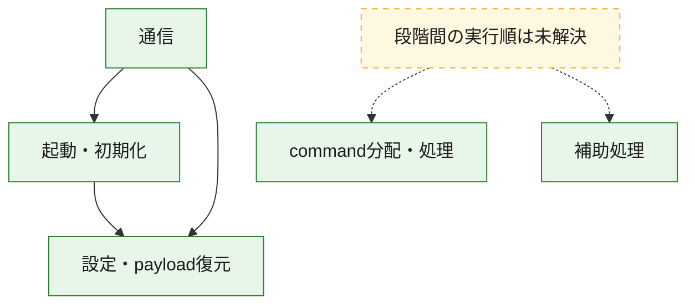
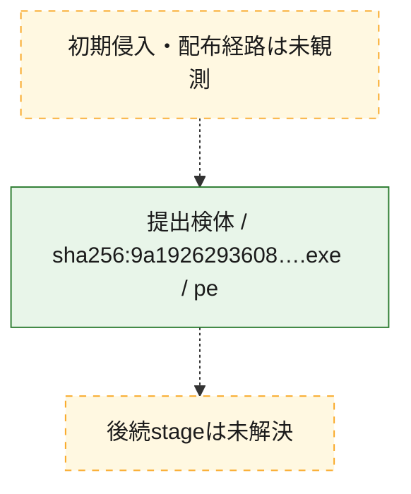
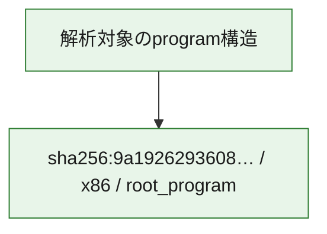

# 全体ロジック：9a192629360851d5af0db130ae75904f86b46e262631164502e1f9a0f8e1b1b0

代表関数の静的証跡から、起動・初期化、設定・payload復元、通信、command分配・処理の処理群を確認しました。

## 読み方

- phaseの掲載順は解析上の整理順です。observed_call_edgesがない段階間の実行順を断定しません。
- 図の実線は静的に観測した関係、点線と黄色のノードは未観測・未解決の関係を示します。
- 図は静的な要約であり、動的実行を再現するものではありません。
- 詳細な関数解説とfingerprintは[STATIC-LOGIC.md](STATIC-LOGIC.md)を参照してください。

## 静的可視化

### 実行フロー

### 感染チェーン

### モジュール関係

## 処理段階

### 1. 起動・初期化

entry pointから初期化と後続処理への移行を確認します。
確度: `confirmed_static_function_evidence`

- `9a192629360851d5af0db130ae75904f86b46e262631164502e1f9a0f8e1b1b0:ghidra:140009d17` — 初期化と主要処理への分岐を行う入口関数です。 状態: `succeeded`、選定理由: `entry_point`, `meaningful_symbol_name`, `reviewed_call_centrality:7`, `role:entrypoint`
- `9a192629360851d5af0db130ae75904f86b46e262631164502e1f9a0f8e1b1b0:ghidra:140010523` — 初期化と主要処理への分岐を行う入口関数です。 状態: `succeeded`、選定理由: `entry_point`, `meaningful_symbol_name`, `probable_go_main_user_code`, `reviewed_call_centrality:23`, `role:entrypoint`

### 2. 設定・payload復元

設定、resource、payload、暗号化データの復元・変換を確認します。
確度: `confirmed_static_function_evidence`

- `9a192629360851d5af0db130ae75904f86b46e262631164502e1f9a0f8e1b1b0:ghidra:1400016e1` — 設定、resource、payloadなどの解析・変換を行う関数です。 状態: `succeeded`、選定理由: `meaningful_symbol_name`, `reviewed_call_centrality:1`, `role:config_or_data_transform`
- `9a192629360851d5af0db130ae75904f86b46e262631164502e1f9a0f8e1b1b0:ghidra:140001c94` — 設定、resource、payloadなどの解析・変換を行う関数です。 状態: `succeeded`、選定理由: `meaningful_symbol_name`, `reviewed_call_centrality:1`, `role:config_or_data_transform`
- `9a192629360851d5af0db130ae75904f86b46e262631164502e1f9a0f8e1b1b0:ghidra:1400022ae` — 暗号、hash、encoding、または復号処理に関係する関数です。 状態: `succeeded`、選定理由: `meaningful_symbol_name`, `reviewed_call_centrality:4`, `role:cryptographic_transform`
- `9a192629360851d5af0db130ae75904f86b46e262631164502e1f9a0f8e1b1b0:ghidra:140002ecc` — 暗号、hash、encoding、または復号処理に関係する関数です。 状態: `succeeded`、選定理由: `meaningful_symbol_name`, `reviewed_call_centrality:4`, `role:cryptographic_transform`
- `9a192629360851d5af0db130ae75904f86b46e262631164502e1f9a0f8e1b1b0:ghidra:140002fb6` — 暗号、hash、encoding、または復号処理に関係する関数です。 状態: `succeeded`、選定理由: `meaningful_symbol_name`, `reviewed_call_centrality:12`, `role:cryptographic_transform`
- `9a192629360851d5af0db130ae75904f86b46e262631164502e1f9a0f8e1b1b0:ghidra:1400031e9` — 設定、resource、payloadなどの解析・変換を行う関数です。 状態: `succeeded`、選定理由: `meaningful_symbol_name`, `reviewed_call_centrality:13`, `role:config_or_data_transform`
- `9a192629360851d5af0db130ae75904f86b46e262631164502e1f9a0f8e1b1b0:ghidra:140003c95` — 設定、resource、payloadなどの解析・変換を行う関数です。 状態: `succeeded`、選定理由: `meaningful_symbol_name`, `reviewed_call_centrality:1`, `role:config_or_data_transform`
- `9a192629360851d5af0db130ae75904f86b46e262631164502e1f9a0f8e1b1b0:ghidra:140005261` — 設定、resource、payloadなどの解析・変換を行う関数です。 状態: `succeeded`、選定理由: `meaningful_symbol_name`, `reviewed_call_centrality:2`, `role:config_or_data_transform`
- `9a192629360851d5af0db130ae75904f86b46e262631164502e1f9a0f8e1b1b0:ghidra:140005dfb` — 暗号、hash、encoding、または復号処理に関係する関数です。 状態: `succeeded`、選定理由: `meaningful_symbol_name`, `reviewed_call_centrality:2`, `role:cryptographic_transform`
- `9a192629360851d5af0db130ae75904f86b46e262631164502e1f9a0f8e1b1b0:ghidra:140005f7d` — 設定、resource、payloadなどの解析・変換を行う関数です。 状態: `succeeded`、選定理由: `meaningful_symbol_name`, `reviewed_call_centrality:12`, `role:config_or_data_transform`
- `9a192629360851d5af0db130ae75904f86b46e262631164502e1f9a0f8e1b1b0:ghidra:1400064c3` — 設定、resource、payloadなどの解析・変換を行う関数です。 状態: `succeeded`、選定理由: `meaningful_symbol_name`, `reviewed_call_centrality:9`, `role:config_or_data_transform`
- `9a192629360851d5af0db130ae75904f86b46e262631164502e1f9a0f8e1b1b0:ghidra:140008467` — 設定、resource、payloadなどの解析・変換を行う関数です。 状態: `succeeded`、選定理由: `meaningful_symbol_name`, `reviewed_call_centrality:1`, `role:config_or_data_transform`
- `9a192629360851d5af0db130ae75904f86b46e262631164502e1f9a0f8e1b1b0:ghidra:14000a8ca` — 設定、resource、payloadなどの解析・変換を行う関数です。 状態: `succeeded`、選定理由: `meaningful_symbol_name`, `reviewed_call_centrality:7`, `role:config_or_data_transform`

### 3. 通信

通信初期化、endpoint処理、送受信の役割を確認します。
確度: `confirmed_static_function_evidence`

- `9a192629360851d5af0db130ae75904f86b46e262631164502e1f9a0f8e1b1b0:ghidra:140005b93` — 通信初期化、送受信、またはendpoint処理に関係する関数です。 状態: `succeeded`、選定理由: `meaningful_symbol_name`, `reviewed_call_centrality:3`, `role:network_communication`
- `9a192629360851d5af0db130ae75904f86b46e262631164502e1f9a0f8e1b1b0:ghidra:140006a82` — 通信初期化、送受信、またはendpoint処理に関係する関数です。 状態: `succeeded`、選定理由: `meaningful_symbol_name`, `reviewed_call_centrality:3`, `role:network_communication`
- `9a192629360851d5af0db130ae75904f86b46e262631164502e1f9a0f8e1b1b0:ghidra:14000782e` — 通信初期化、送受信、またはendpoint処理に関係する関数です。 状態: `succeeded`、選定理由: `meaningful_symbol_name`, `reviewed_call_centrality:3`, `role:network_communication`
- `9a192629360851d5af0db130ae75904f86b46e262631164502e1f9a0f8e1b1b0:ghidra:140009259` — 通信初期化、送受信、またはendpoint処理に関係する関数です。 状態: `succeeded`、選定理由: `meaningful_symbol_name`, `reviewed_call_centrality:20`, `role:network_communication`
- `9a192629360851d5af0db130ae75904f86b46e262631164502e1f9a0f8e1b1b0:ghidra:140009499` — 通信初期化、送受信、またはendpoint処理に関係する関数です。 状態: `succeeded`、選定理由: `meaningful_symbol_name`, `reviewed_call_centrality:5`, `role:network_communication`
- `9a192629360851d5af0db130ae75904f86b46e262631164502e1f9a0f8e1b1b0:ghidra:1400097f6` — 通信初期化、送受信、またはendpoint処理に関係する関数です。 状態: `succeeded`、選定理由: `meaningful_symbol_name`, `reviewed_call_centrality:3`, `role:network_communication`
- `9a192629360851d5af0db130ae75904f86b46e262631164502e1f9a0f8e1b1b0:ghidra:140009855` — 通信初期化、送受信、またはendpoint処理に関係する関数です。 状態: `succeeded`、選定理由: `meaningful_symbol_name`, `reviewed_call_centrality:4`, `role:network_communication`
- `9a192629360851d5af0db130ae75904f86b46e262631164502e1f9a0f8e1b1b0:ghidra:140009991` — 通信初期化、送受信、またはendpoint処理に関係する関数です。 状態: `succeeded`、選定理由: `meaningful_symbol_name`, `reviewed_call_centrality:9`, `role:network_communication`
- `9a192629360851d5af0db130ae75904f86b46e262631164502e1f9a0f8e1b1b0:ghidra:14000a105` — 通信初期化、送受信、またはendpoint処理に関係する関数です。 状態: `succeeded`、選定理由: `meaningful_symbol_name`, `reviewed_call_centrality:3`, `role:network_communication`
- `9a192629360851d5af0db130ae75904f86b46e262631164502e1f9a0f8e1b1b0:ghidra:14000a1f9` — 通信初期化、送受信、またはendpoint処理に関係する関数です。 状態: `succeeded`、選定理由: `meaningful_symbol_name`, `reviewed_call_centrality:15`, `role:network_communication`
- `9a192629360851d5af0db130ae75904f86b46e262631164502e1f9a0f8e1b1b0:ghidra:14000b767` — 通信初期化、送受信、またはendpoint処理に関係する関数です。 状態: `succeeded`、選定理由: `meaningful_symbol_name`, `reviewed_call_centrality:11`, `role:network_communication`

### 4. command分配・処理

受信commandやtaskの解釈、分配、個別handlerへの移行を確認します。
確度: `confirmed_static_function_evidence`

- `9a192629360851d5af0db130ae75904f86b46e262631164502e1f9a0f8e1b1b0:ghidra:14000b0a9` — commandの解釈、分配、または個別処理を担当する関数です。 状態: `succeeded`、選定理由: `meaningful_symbol_name`, `reviewed_call_centrality:5`, `role:command_dispatch_or_handler`
- `9a192629360851d5af0db130ae75904f86b46e262631164502e1f9a0f8e1b1b0:ghidra:14000b924` — commandの解釈、分配、または個別処理を担当する関数です。 状態: `succeeded`、選定理由: `meaningful_symbol_name`, `reviewed_call_centrality:5`, `role:command_dispatch_or_handler`
- `9a192629360851d5af0db130ae75904f86b46e262631164502e1f9a0f8e1b1b0:ghidra:14000bd2b` — commandの解釈、分配、または個別処理を担当する関数です。 状態: `succeeded`、選定理由: `meaningful_symbol_name`, `reviewed_call_centrality:7`, `role:command_dispatch_or_handler`

### 5. 補助処理

主要処理を支える一般内部関数またはlibrary処理を確認します。
確度: `confirmed_static_function_evidence`

- `9a192629360851d5af0db130ae75904f86b46e262631164502e1f9a0f8e1b1b0:ghidra:140001410` — 検体内部の一般処理を実装する関数です。 状態: `succeeded`、選定理由: `entry_point`, `meaningful_symbol_name`, `reviewed_call_centrality:1`
- `9a192629360851d5af0db130ae75904f86b46e262631164502e1f9a0f8e1b1b0:ghidra:140010cc0` — compiler生成処理または汎用library処理とみられる関数です。 状態: `succeeded`、選定理由: `entry_point`, `meaningful_symbol_name`, `reviewed_call_centrality:1`
- `9a192629360851d5af0db130ae75904f86b46e262631164502e1f9a0f8e1b1b0:ghidra:140010cf0` — compiler生成処理または汎用library処理とみられる関数です。 状態: `succeeded`、選定理由: `entry_point`, `meaningful_symbol_name`, `reviewed_call_centrality:2`

## 観測したcall関係

- `9a192629360851d5af0db130ae75904f86b46e262631164502e1f9a0f8e1b1b0:ghidra:140002fb6` → `9a192629360851d5af0db130ae75904f86b46e262631164502e1f9a0f8e1b1b0:ghidra:140002ecc` （`configuration` → `configuration`）
- `9a192629360851d5af0db130ae75904f86b46e262631164502e1f9a0f8e1b1b0:ghidra:1400031e9` → `9a192629360851d5af0db130ae75904f86b46e262631164502e1f9a0f8e1b1b0:ghidra:140002ecc` （`configuration` → `configuration`）
- `9a192629360851d5af0db130ae75904f86b46e262631164502e1f9a0f8e1b1b0:ghidra:140005dfb` → `9a192629360851d5af0db130ae75904f86b46e262631164502e1f9a0f8e1b1b0:ghidra:1400022ae` （`configuration` → `configuration`）
- `9a192629360851d5af0db130ae75904f86b46e262631164502e1f9a0f8e1b1b0:ghidra:1400064c3` → `9a192629360851d5af0db130ae75904f86b46e262631164502e1f9a0f8e1b1b0:ghidra:1400031e9` （`configuration` → `configuration`）
- `9a192629360851d5af0db130ae75904f86b46e262631164502e1f9a0f8e1b1b0:ghidra:1400064c3` → `9a192629360851d5af0db130ae75904f86b46e262631164502e1f9a0f8e1b1b0:ghidra:140005f7d` （`configuration` → `configuration`）
- `9a192629360851d5af0db130ae75904f86b46e262631164502e1f9a0f8e1b1b0:ghidra:140006a82` → `9a192629360851d5af0db130ae75904f86b46e262631164502e1f9a0f8e1b1b0:ghidra:140005b93` （`communication` → `communication`）
- `9a192629360851d5af0db130ae75904f86b46e262631164502e1f9a0f8e1b1b0:ghidra:140009499` → `9a192629360851d5af0db130ae75904f86b46e262631164502e1f9a0f8e1b1b0:ghidra:140009259` （`communication` → `communication`）
- `9a192629360851d5af0db130ae75904f86b46e262631164502e1f9a0f8e1b1b0:ghidra:140009991` → `9a192629360851d5af0db130ae75904f86b46e262631164502e1f9a0f8e1b1b0:ghidra:140002fb6` （`communication` → `configuration`）
- `9a192629360851d5af0db130ae75904f86b46e262631164502e1f9a0f8e1b1b0:ghidra:140009991` → `9a192629360851d5af0db130ae75904f86b46e262631164502e1f9a0f8e1b1b0:ghidra:1400097f6` （`communication` → `communication`）
- `9a192629360851d5af0db130ae75904f86b46e262631164502e1f9a0f8e1b1b0:ghidra:14000a1f9` → `9a192629360851d5af0db130ae75904f86b46e262631164502e1f9a0f8e1b1b0:ghidra:140009d17` （`communication` → `startup`）
- `9a192629360851d5af0db130ae75904f86b46e262631164502e1f9a0f8e1b1b0:ghidra:14000a1f9` → `9a192629360851d5af0db130ae75904f86b46e262631164502e1f9a0f8e1b1b0:ghidra:14000a105` （`communication` → `communication`）
- `9a192629360851d5af0db130ae75904f86b46e262631164502e1f9a0f8e1b1b0:ghidra:14000b767` → `9a192629360851d5af0db130ae75904f86b46e262631164502e1f9a0f8e1b1b0:ghidra:14000a1f9` （`communication` → `communication`）
- `9a192629360851d5af0db130ae75904f86b46e262631164502e1f9a0f8e1b1b0:ghidra:140010523` → `9a192629360851d5af0db130ae75904f86b46e262631164502e1f9a0f8e1b1b0:ghidra:1400064c3` （`startup` → `configuration`）
- `ghidra-function:033c14529afe3c2e0936bae2` → `ghidra-external:0a9a38c55f6f66bd9534099f` （`unclassified` → `unclassified`）
- `ghidra-function:033c14529afe3c2e0936bae2` → `ghidra-external:6f1ac632f7a21d3a47e4cad0` （`unclassified` → `unclassified`）
- `ghidra-function:033c14529afe3c2e0936bae2` → `ghidra-external:737f47c93f5cd4da368b80a1` （`unclassified` → `unclassified`）
- `ghidra-function:033c14529afe3c2e0936bae2` → `ghidra-external:96e6e0a23cc0ffbf8afa5cd2` （`unclassified` → `unclassified`）
- `ghidra-function:033c14529afe3c2e0936bae2` → `ghidra-external:a911c73d7b6e9508b75db822` （`unclassified` → `unclassified`）
- `ghidra-function:033c14529afe3c2e0936bae2` → `ghidra-external:c002e5631f6d8be7c51ed912` （`unclassified` → `unclassified`）
- `ghidra-function:033c14529afe3c2e0936bae2` → `ghidra-external:fcbb7d56a5877ef8a242c895` （`unclassified` → `unclassified`）
- `ghidra-function:03ddd29897230829363a6d41` → `ghidra-external:36be9b8b938132705abefc0c` （`unclassified` → `unclassified`）
- `ghidra-function:03ddd29897230829363a6d41` → `ghidra-external:6f1ac632f7a21d3a47e4cad0` （`unclassified` → `unclassified`）
- `ghidra-function:03ddd29897230829363a6d41` → `ghidra-external:76ffd79b86b04aaf67462231` （`unclassified` → `unclassified`）
- `ghidra-function:03ddd29897230829363a6d41` → `ghidra-external:a55001ba1a4c4f490f5a8c93` （`unclassified` → `unclassified`）
- `ghidra-function:03ddd29897230829363a6d41` → `ghidra-external:c002e5631f6d8be7c51ed912` （`unclassified` → `unclassified`）
- `ghidra-function:03ddd29897230829363a6d41` → `ghidra-function:23958c762dff90dfe5fa46e4` （`unclassified` → `unclassified`）
- `ghidra-function:03ddd29897230829363a6d41` → `ghidra-function:3629d77c2a6b3f93dffaf483` （`unclassified` → `unclassified`）
- `ghidra-function:03ddd29897230829363a6d41` → `ghidra-function:6537d6a7afd2db7c619ec0bd` （`unclassified` → `unclassified`）
- `ghidra-function:03ddd29897230829363a6d41` → `ghidra-function:b3a3d00fab10be42607f3fa5` （`unclassified` → `unclassified`）
- `ghidra-function:03ddd29897230829363a6d41` → `ghidra-function:cee1aa2ccc72b407017bacdb` （`unclassified` → `unclassified`）
- `ghidra-function:03ddd29897230829363a6d41` → `ghidra-function:e7fd9b9b0571bf22f118ddce` （`unclassified` → `unclassified`）
- `ghidra-function:05a583e5b59111c5fc7ad464` → `ghidra-external:96e6e0a23cc0ffbf8afa5cd2` （`unclassified` → `unclassified`）
- `ghidra-function:06d09d50c0647d1e5a48a790` → `ghidra-external:bc8bcf3a9ecca49aff2867f6` （`unclassified` → `unclassified`）
- `ghidra-function:06d09d50c0647d1e5a48a790` → `ghidra-function:902e456ba741cb1113cceb3d` （`unclassified` → `unclassified`）
- `ghidra-function:1161dcd1c0831aebb5258421` → `ghidra-external:24d3cee57743803c6a2b0ed9` （`unclassified` → `unclassified`）
- `ghidra-function:1161dcd1c0831aebb5258421` → `ghidra-external:5f9f81e80c6c25e94f67ebea` （`unclassified` → `unclassified`）
- `ghidra-function:12e05dbf31901b377a5f36e1` → `ghidra-external:5ed3876e9ca1bb2f6b5f17ee` （`unclassified` → `unclassified`）
- `ghidra-function:12e05dbf31901b377a5f36e1` → `ghidra-external:5f9f81e80c6c25e94f67ebea` （`unclassified` → `unclassified`）
- `ghidra-function:12e05dbf31901b377a5f36e1` → `ghidra-external:8e657b6ccef94ca41ac9f2a3` （`unclassified` → `unclassified`）
- `ghidra-function:12e05dbf31901b377a5f36e1` → `ghidra-function:0c50eca01be722779f3f75c2` （`unclassified` → `unclassified`）
- `ghidra-function:15cdcddf1d431daabc241f9f` → `ghidra-external:0a9a38c55f6f66bd9534099f` （`unclassified` → `unclassified`）
- `ghidra-function:15cdcddf1d431daabc241f9f` → `ghidra-external:24d3cee57743803c6a2b0ed9` （`unclassified` → `unclassified`）
- `ghidra-function:15cdcddf1d431daabc241f9f` → `ghidra-external:6f1ac632f7a21d3a47e4cad0` （`unclassified` → `unclassified`）
- `ghidra-function:15cdcddf1d431daabc241f9f` → `ghidra-external:ca5abcd30e571fc7285e7a14` （`unclassified` → `unclassified`）
- `ghidra-function:15cdcddf1d431daabc241f9f` → `ghidra-external:fcbb7d56a5877ef8a242c895` （`unclassified` → `unclassified`）
- `ghidra-function:15cdcddf1d431daabc241f9f` → `ghidra-function:03e61108e648c4396844d09a` （`unclassified` → `unclassified`）
- `ghidra-function:15cdcddf1d431daabc241f9f` → `ghidra-function:17ea33b89e6646d02c27518a` （`unclassified` → `unclassified`）
- `ghidra-function:15cdcddf1d431daabc241f9f` → `ghidra-function:3e4b885dfa2d59211fdad960` （`unclassified` → `unclassified`）
- `ghidra-function:15cdcddf1d431daabc241f9f` → `ghidra-function:413d636aace71c5b55a4c902` （`unclassified` → `unclassified`）
- `ghidra-function:15cdcddf1d431daabc241f9f` → `ghidra-function:8df57f2bb7d9e91539c7b269` （`unclassified` → `unclassified`）
- `ghidra-function:15cdcddf1d431daabc241f9f` → `ghidra-function:a0f38107cbc573094149409f` （`unclassified` → `unclassified`）
- `ghidra-function:15cdcddf1d431daabc241f9f` → `ghidra-function:c15eba11fdf3bd2d997fa697` （`unclassified` → `unclassified`）
- `ghidra-function:24825d7f26d34456ace4174a` → `ghidra-external:5f9f81e80c6c25e94f67ebea` （`unclassified` → `unclassified`）
- `ghidra-function:24825d7f26d34456ace4174a` → `ghidra-function:06d09d50c0647d1e5a48a790` （`unclassified` → `unclassified`）
- `ghidra-function:24825d7f26d34456ace4174a` → `ghidra-function:42fec07b298cf3b6ebcd0b50` （`unclassified` → `unclassified`）
- `ghidra-function:24825d7f26d34456ace4174a` → `ghidra-function:62f1268fc05c80782b8d1a0d` （`unclassified` → `unclassified`）
- `ghidra-function:24825d7f26d34456ace4174a` → `ghidra-function:78badda5fe3c5c6116299676` （`unclassified` → `unclassified`）
- `ghidra-function:24825d7f26d34456ace4174a` → `ghidra-function:81fac58b17a1d61debd67c0a` （`unclassified` → `unclassified`）
- `ghidra-function:24825d7f26d34456ace4174a` → `ghidra-function:87f37a0fb9e42f595ff97252` （`unclassified` → `unclassified`）
- `ghidra-function:24825d7f26d34456ace4174a` → `ghidra-function:8f59eb3691bf5ea4a4b6a6a3` （`unclassified` → `unclassified`）
- `ghidra-function:24825d7f26d34456ace4174a` → `ghidra-function:d9f2d2820178a203cd27a305` （`unclassified` → `unclassified`）
- `ghidra-function:285eed3d88e85d37a353c763` → `ghidra-external:8f604ffa37206c376e1771e6` （`unclassified` → `unclassified`）
- `ghidra-function:285eed3d88e85d37a353c763` → `ghidra-function:384ea583af2dda212761c2e0` （`unclassified` → `unclassified`）
- `ghidra-function:2c603a8ae47481993621c3d6` → `ghidra-external:23ebbca34bdb9d33a39f3f4b` （`unclassified` → `unclassified`）
- `ghidra-function:2c603a8ae47481993621c3d6` → `ghidra-external:6f1ac632f7a21d3a47e4cad0` （`unclassified` → `unclassified`）
- `ghidra-function:2c603a8ae47481993621c3d6` → `ghidra-external:76ffd79b86b04aaf67462231` （`unclassified` → `unclassified`）
- `ghidra-function:2c603a8ae47481993621c3d6` → `ghidra-external:a55001ba1a4c4f490f5a8c93` （`unclassified` → `unclassified`）
- `ghidra-function:2c603a8ae47481993621c3d6` → `ghidra-function:0c0af858ca6c368982df0b1a` （`unclassified` → `unclassified`）
- `ghidra-function:2c603a8ae47481993621c3d6` → `ghidra-function:1df22550e8cfc0fe2eb5b7d4` （`unclassified` → `unclassified`）
- `ghidra-function:2c603a8ae47481993621c3d6` → `ghidra-function:20aa40d6b7f581a5d19cb97f` （`unclassified` → `unclassified`）
- `ghidra-function:2c603a8ae47481993621c3d6` → `ghidra-function:25afd4aa5d26baa2240c911c` （`unclassified` → `unclassified`）
- `ghidra-function:2c603a8ae47481993621c3d6` → `ghidra-function:348a8a5d732ef04f43e462e7` （`unclassified` → `unclassified`）
- `ghidra-function:2c603a8ae47481993621c3d6` → `ghidra-function:4567b798085792be7b943574` （`unclassified` → `unclassified`）
- `ghidra-function:2c603a8ae47481993621c3d6` → `ghidra-function:4ef73ed07237d86dd2ac7b80` （`unclassified` → `unclassified`）
- `ghidra-function:2c603a8ae47481993621c3d6` → `ghidra-function:573a509aafb1037ae0ac555e` （`unclassified` → `unclassified`）
- `ghidra-function:2c603a8ae47481993621c3d6` → `ghidra-function:5a6767d2e3bdc87c25b62984` （`unclassified` → `unclassified`）
- `ghidra-function:2c603a8ae47481993621c3d6` → `ghidra-function:5d7b0d8d44886a46774f95f7` （`unclassified` → `unclassified`）
- `ghidra-function:2c603a8ae47481993621c3d6` → `ghidra-function:81fac58b17a1d61debd67c0a` （`unclassified` → `unclassified`）
- `ghidra-function:2c603a8ae47481993621c3d6` → `ghidra-function:891fafab27a4591b57fa83fe` （`unclassified` → `unclassified`）
- `ghidra-function:2c603a8ae47481993621c3d6` → `ghidra-function:a1f5bda22e66897ebe5a210f` （`unclassified` → `unclassified`）
- `ghidra-function:2c603a8ae47481993621c3d6` → `ghidra-function:ce93439e650b04993d196a71` （`unclassified` → `unclassified`）
- `ghidra-function:2c603a8ae47481993621c3d6` → `ghidra-function:e97084b2fee3c2690125b01f` （`unclassified` → `unclassified`）
- `ghidra-function:2c603a8ae47481993621c3d6` → `ghidra-function:f9cc5461389b30873585763d` （`unclassified` → `unclassified`）
- `ghidra-function:2e2aad534846fd63239d8318` → `ghidra-external:36be9b8b938132705abefc0c` （`unclassified` → `unclassified`）
- `ghidra-function:2e2aad534846fd63239d8318` → `ghidra-external:c002e5631f6d8be7c51ed912` （`unclassified` → `unclassified`）
- `ghidra-function:2e2aad534846fd63239d8318` → `ghidra-function:6537d6a7afd2db7c619ec0bd` （`unclassified` → `unclassified`）
- `ghidra-function:2e2aad534846fd63239d8318` → `ghidra-function:b3a3d00fab10be42607f3fa5` （`unclassified` → `unclassified`）
- `ghidra-function:2e2aad534846fd63239d8318` → `ghidra-function:cee1aa2ccc72b407017bacdb` （`unclassified` → `unclassified`）
- `ghidra-function:2ef19e1077ed0a7a813ec20b` → `ghidra-external:0c831e567fe7d62c2be12f83` （`unclassified` → `unclassified`）
- `ghidra-function:2ef19e1077ed0a7a813ec20b` → `ghidra-external:1b4e2e9dee6d6216977b3623` （`unclassified` → `unclassified`）
- `ghidra-function:2ef19e1077ed0a7a813ec20b` → `ghidra-external:29fd38619e476a78ab40af2a` （`unclassified` → `unclassified`）
- `ghidra-function:2ef19e1077ed0a7a813ec20b` → `ghidra-external:5ed3876e9ca1bb2f6b5f17ee` （`unclassified` → `unclassified`）
- `ghidra-function:2ef19e1077ed0a7a813ec20b` → `ghidra-external:5f9f81e80c6c25e94f67ebea` （`unclassified` → `unclassified`）
- `ghidra-function:2ef19e1077ed0a7a813ec20b` → `ghidra-external:6f1ac632f7a21d3a47e4cad0` （`unclassified` → `unclassified`）
- `ghidra-function:2ef19e1077ed0a7a813ec20b` → `ghidra-external:c002e5631f6d8be7c51ed912` （`unclassified` → `unclassified`）
- `ghidra-function:2ef19e1077ed0a7a813ec20b` → `ghidra-external:e148e5e8be57ed3ebc663d12` （`unclassified` → `unclassified`）
- `ghidra-function:2ef19e1077ed0a7a813ec20b` → `ghidra-function:02d1e40b7b02bfead57f21c1` （`unclassified` → `unclassified`）
- `ghidra-function:2ef19e1077ed0a7a813ec20b` → `ghidra-function:1161dcd1c0831aebb5258421` （`unclassified` → `unclassified`）
- `ghidra-function:2ef19e1077ed0a7a813ec20b` → `ghidra-function:6628e09da2bba0e5d22f1e5c` （`unclassified` → `unclassified`）
- `ghidra-function:2ef19e1077ed0a7a813ec20b` → `ghidra-function:bdca33cda1881993ed78e335` （`unclassified` → `unclassified`）
- `ghidra-function:2ef19e1077ed0a7a813ec20b` → `ghidra-function:ec39baea29122ef8bb6e6e2a` （`unclassified` → `unclassified`）
- `ghidra-function:35765ecc74b8d9f9aae6a8ae` → `ghidra-function:a67471a84414bb2904f934af` （`unclassified` → `unclassified`）
- `ghidra-function:35765ecc74b8d9f9aae6a8ae` → `ghidra-function:cefae8cf411e1f974d38e5e7` （`unclassified` → `unclassified`）
- `ghidra-function:35765ecc74b8d9f9aae6a8ae` → `ghidra-function:f12e1e13a7d2b304d16151c1` （`unclassified` → `unclassified`）
- `ghidra-function:379fc53e231ccd8cf26fdc27` → `ghidra-function:eec27e419eacfc042c1f8ca2` （`unclassified` → `unclassified`）
- `ghidra-function:4332fa92d7848e5956d2044d` → `ghidra-external:a757ae344cbe9b06ff8b3f90` （`unclassified` → `unclassified`）
- `ghidra-function:4332fa92d7848e5956d2044d` → `ghidra-external:c002e5631f6d8be7c51ed912` （`unclassified` → `unclassified`）
- `ghidra-function:53b974c734dd6733892f330d` → `ghidra-external:6f1ac632f7a21d3a47e4cad0` （`unclassified` → `unclassified`）
- `ghidra-function:53b974c734dd6733892f330d` → `ghidra-function:15cdcddf1d431daabc241f9f` （`unclassified` → `unclassified`）
- `ghidra-function:53b974c734dd6733892f330d` → `ghidra-function:6628e09da2bba0e5d22f1e5c` （`unclassified` → `unclassified`）
- `ghidra-function:53b974c734dd6733892f330d` → `ghidra-function:951aff8667c7dce996a1ab9c` （`unclassified` → `unclassified`）
- `ghidra-function:6c7e2cdfc3c1661a4945777b` → `ghidra-external:a55001ba1a4c4f490f5a8c93` （`unclassified` → `unclassified`）
- `ghidra-function:6c7e2cdfc3c1661a4945777b` → `ghidra-function:2eb901cad519c0785efad035` （`unclassified` → `unclassified`）
- `ghidra-function:6c7e2cdfc3c1661a4945777b` → `ghidra-function:db7ab1e15c3716a4a8fcfc92` （`unclassified` → `unclassified`）
- `ghidra-function:73f48ac14d78be900fa4f5de` → `ghidra-external:36be9b8b938132705abefc0c` （`unclassified` → `unclassified`）
- `ghidra-function:73f48ac14d78be900fa4f5de` → `ghidra-external:c002e5631f6d8be7c51ed912` （`unclassified` → `unclassified`）
- `ghidra-function:73f48ac14d78be900fa4f5de` → `ghidra-function:23958c762dff90dfe5fa46e4` （`unclassified` → `unclassified`）
- `ghidra-function:73f48ac14d78be900fa4f5de` → `ghidra-function:6537d6a7afd2db7c619ec0bd` （`unclassified` → `unclassified`）
- `ghidra-function:73f48ac14d78be900fa4f5de` → `ghidra-function:b3a3d00fab10be42607f3fa5` （`unclassified` → `unclassified`）
- `ghidra-function:7f104fef37cfd239229ad551` → `ghidra-external:03e0d80e85cc251b3af0dd4b` （`unclassified` → `unclassified`）
- `ghidra-function:7f104fef37cfd239229ad551` → `ghidra-external:0c3a07458ea19e34b7da666e` （`unclassified` → `unclassified`）
- `ghidra-function:7f104fef37cfd239229ad551` → `ghidra-external:282f9731d78a9a030ab083fb` （`unclassified` → `unclassified`）
- `ghidra-function:7f104fef37cfd239229ad551` → `ghidra-external:33581bf0032010af0b314f72` （`unclassified` → `unclassified`）
- `ghidra-function:7f104fef37cfd239229ad551` → `ghidra-external:5ed3876e9ca1bb2f6b5f17ee` （`unclassified` → `unclassified`）
- `ghidra-function:7f104fef37cfd239229ad551` → `ghidra-external:98bce6acef26f826d4cb262f` （`unclassified` → `unclassified`）
- `ghidra-function:7f104fef37cfd239229ad551` → `ghidra-external:c002e5631f6d8be7c51ed912` （`unclassified` → `unclassified`）
- `ghidra-function:7f104fef37cfd239229ad551` → `ghidra-function:198dc5567f1ab2f450509ae6` （`unclassified` → `unclassified`）
- `ghidra-function:7f104fef37cfd239229ad551` → `ghidra-function:443529184624c84e2dd145f8` （`unclassified` → `unclassified`）
- `ghidra-function:7f104fef37cfd239229ad551` → `ghidra-function:68649ab4c902d4d77b087e6b` （`unclassified` → `unclassified`）
- `ghidra-function:7f104fef37cfd239229ad551` → `ghidra-function:cba546e2bd8cadf008ecb2f9` （`unclassified` → `unclassified`）
- `ghidra-function:7f104fef37cfd239229ad551` → `ghidra-function:dede63e6d3669dc860c676df` （`unclassified` → `unclassified`）
- `ghidra-function:87944579c861ce685ecde647` → `ghidra-function:384ea583af2dda212761c2e0` （`unclassified` → `unclassified`）
- `ghidra-function:87f37a0fb9e42f595ff97252` → `ghidra-external:03e0d80e85cc251b3af0dd4b` （`unclassified` → `unclassified`）
- `ghidra-function:87f37a0fb9e42f595ff97252` → `ghidra-external:0c3a07458ea19e34b7da666e` （`unclassified` → `unclassified`）
- `ghidra-function:87f37a0fb9e42f595ff97252` → `ghidra-external:282f9731d78a9a030ab083fb` （`unclassified` → `unclassified`）
- `ghidra-function:87f37a0fb9e42f595ff97252` → `ghidra-external:5ed3876e9ca1bb2f6b5f17ee` （`unclassified` → `unclassified`）
- `ghidra-function:87f37a0fb9e42f595ff97252` → `ghidra-external:98bce6acef26f826d4cb262f` （`unclassified` → `unclassified`）
- `ghidra-function:87f37a0fb9e42f595ff97252` → `ghidra-function:198dc5567f1ab2f450509ae6` （`unclassified` → `unclassified`）
- `ghidra-function:87f37a0fb9e42f595ff97252` → `ghidra-function:25afd4aa5d26baa2240c911c` （`unclassified` → `unclassified`）
- `ghidra-function:87f37a0fb9e42f595ff97252` → `ghidra-function:443529184624c84e2dd145f8` （`unclassified` → `unclassified`）
- `ghidra-function:87f37a0fb9e42f595ff97252` → `ghidra-function:68649ab4c902d4d77b087e6b` （`unclassified` → `unclassified`）
- `ghidra-function:87f37a0fb9e42f595ff97252` → `ghidra-function:cba546e2bd8cadf008ecb2f9` （`unclassified` → `unclassified`）
- `ghidra-function:87f37a0fb9e42f595ff97252` → `ghidra-function:dede63e6d3669dc860c676df` （`unclassified` → `unclassified`）
- `ghidra-function:8ff0455637b15ab216628a08` → `ghidra-function:68987c84bc27145bc44c6f4e` （`unclassified` → `unclassified`）
- `ghidra-function:a656508b34ebadb8f828ffef` → `ghidra-function:26c6372d32654e48cacfbae3` （`unclassified` → `unclassified`）
- `ghidra-function:a656508b34ebadb8f828ffef` → `ghidra-function:2ef19e1077ed0a7a813ec20b` （`unclassified` → `unclassified`）
- `ghidra-function:a656508b34ebadb8f828ffef` → `ghidra-function:36048d26ebaa23accb13ebe5` （`unclassified` → `unclassified`）
- `ghidra-function:a656508b34ebadb8f828ffef` → `ghidra-function:42fec07b298cf3b6ebcd0b50` （`unclassified` → `unclassified`）
- `ghidra-function:a656508b34ebadb8f828ffef` → `ghidra-function:481f3327dde622988e3ac2c9` （`unclassified` → `unclassified`）
- `ghidra-function:a656508b34ebadb8f828ffef` → `ghidra-function:746fe4f7b9cab9604608d7c6` （`unclassified` → `unclassified`）
- `ghidra-function:a656508b34ebadb8f828ffef` → `ghidra-function:78badda5fe3c5c6116299676` （`unclassified` → `unclassified`）
- `ghidra-function:a656508b34ebadb8f828ffef` → `ghidra-function:81fac58b17a1d61debd67c0a` （`unclassified` → `unclassified`）
- `ghidra-function:a656508b34ebadb8f828ffef` → `ghidra-function:d9f2d2820178a203cd27a305` （`unclassified` → `unclassified`）
- `ghidra-function:a656508b34ebadb8f828ffef` → `ghidra-function:f5bc3f9276efa39fcb01cc00` （`unclassified` → `unclassified`）
- `ghidra-function:a656508b34ebadb8f828ffef` → `ghidra-function:fb6bbb4305b3d172a45786c0` （`unclassified` → `unclassified`）
- `ghidra-function:be1ae4a458b666ba3e7459af` → `ghidra-function:26c6372d32654e48cacfbae3` （`unclassified` → `unclassified`）
- `ghidra-function:be1ae4a458b666ba3e7459af` → `ghidra-function:42fec07b298cf3b6ebcd0b50` （`unclassified` → `unclassified`）
- `ghidra-function:be1ae4a458b666ba3e7459af` → `ghidra-function:78badda5fe3c5c6116299676` （`unclassified` → `unclassified`）
- `ghidra-function:be1ae4a458b666ba3e7459af` → `ghidra-function:81fac58b17a1d61debd67c0a` （`unclassified` → `unclassified`）
- `ghidra-function:be1ae4a458b666ba3e7459af` → `ghidra-function:c92a7e1a72eb2e3cb8222204` （`unclassified` → `unclassified`）
- `ghidra-function:be1ae4a458b666ba3e7459af` → `ghidra-function:d9f2d2820178a203cd27a305` （`unclassified` → `unclassified`）
- `ghidra-function:be1ae4a458b666ba3e7459af` → `ghidra-function:f5bc3f9276efa39fcb01cc00` （`unclassified` → `unclassified`）
- `ghidra-function:ce93439e650b04993d196a71` → `ghidra-external:24d3cee57743803c6a2b0ed9` （`unclassified` → `unclassified`）
- `ghidra-function:ce93439e650b04993d196a71` → `ghidra-external:5f9f81e80c6c25e94f67ebea` （`unclassified` → `unclassified`）
- `ghidra-function:ce93439e650b04993d196a71` → `ghidra-external:6f1ac632f7a21d3a47e4cad0` （`unclassified` → `unclassified`）
- `ghidra-function:ce93439e650b04993d196a71` → `ghidra-function:03ddd29897230829363a6d41` （`unclassified` → `unclassified`）
- `ghidra-function:ce93439e650b04993d196a71` → `ghidra-function:6628e09da2bba0e5d22f1e5c` （`unclassified` → `unclassified`）
- `ghidra-function:ce93439e650b04993d196a71` → `ghidra-function:7f104fef37cfd239229ad551` （`unclassified` → `unclassified`）
- `ghidra-function:ce93439e650b04993d196a71` → `ghidra-function:951aff8667c7dce996a1ab9c` （`unclassified` → `unclassified`）
- `ghidra-function:db7ab1e15c3716a4a8fcfc92` → `ghidra-function:2d900fccd3b6007f187d2e4e` （`unclassified` → `unclassified`）
- `ghidra-function:db7ab1e15c3716a4a8fcfc92` → `ghidra-function:7b403990bd84aade438ce224` （`unclassified` → `unclassified`）
- `ghidra-function:dba00ccd803b9e1ee988947f` → `ghidra-external:5ed3876e9ca1bb2f6b5f17ee` （`unclassified` → `unclassified`）
- `ghidra-function:dba00ccd803b9e1ee988947f` → `ghidra-external:c002e5631f6d8be7c51ed912` （`unclassified` → `unclassified`）
- `ghidra-function:dba00ccd803b9e1ee988947f` → `ghidra-function:ad3e9fa626022bb1f5f05fb7` （`unclassified` → `unclassified`）
- `ghidra-function:dd424d8ce06fdec5bcc6b5e0` → `ghidra-function:35765ecc74b8d9f9aae6a8ae` （`unclassified` → `unclassified`）
- `ghidra-function:dd424d8ce06fdec5bcc6b5e0` → `ghidra-function:6f4062dc8c6bb0ca7b8ad978` （`unclassified` → `unclassified`）
- `ghidra-function:dede63e6d3669dc860c676df` → `ghidra-function:198dc5567f1ab2f450509ae6` （`unclassified` → `unclassified`）
- `ghidra-function:dede63e6d3669dc860c676df` → `ghidra-function:cba546e2bd8cadf008ecb2f9` （`unclassified` → `unclassified`）
- `ghidra-function:dfd3c8ed5458ec6b0a097bed` → `ghidra-function:839c841b3f62bf0cb02f22a8` （`unclassified` → `unclassified`）
- `ghidra-function:ec39baea29122ef8bb6e6e2a` → `ghidra-external:151b6c4b510e82df9f3c496e` （`unclassified` → `unclassified`）
- `ghidra-function:ec39baea29122ef8bb6e6e2a` → `ghidra-external:a757ae344cbe9b06ff8b3f90` （`unclassified` → `unclassified`）
- `ghidra-function:ec39baea29122ef8bb6e6e2a` → `ghidra-external:c002e5631f6d8be7c51ed912` （`unclassified` → `unclassified`）
- `ghidra-function:ec39baea29122ef8bb6e6e2a` → `ghidra-external:cee1c39a1e99d9020b0459eb` （`unclassified` → `unclassified`）
- `ghidra-function:ec39baea29122ef8bb6e6e2a` → `ghidra-function:8bb684ce74f5cb5911e686b6` （`unclassified` → `unclassified`）
- `ghidra-function:ec39baea29122ef8bb6e6e2a` → `ghidra-function:ee42e08a147af889bbf307d4` （`unclassified` → `unclassified`）
- `ghidra-function:fcbcb0a489555bb105cce21e` → `ghidra-function:4c625614061355ddd64ad10e` （`unclassified` → `unclassified`）

## 解析範囲と制約

- 選定外関数は全体inventoryへ残しますが、関数本体の個別解説対象にはしていません。
- indirect call、難読化、packer、VM、壊れたcontrol flowによりcall関係が欠落する場合があります。
- 文書は静的解析に基づき、検体実行や外部通信による動的確認は行っていません。
