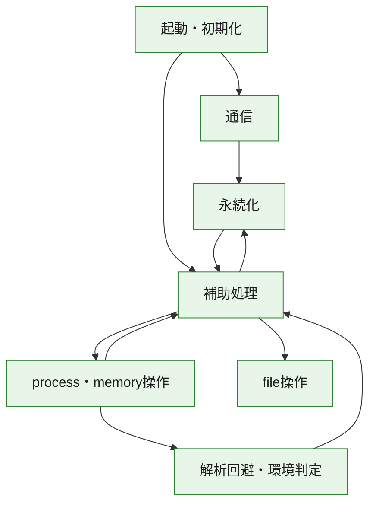
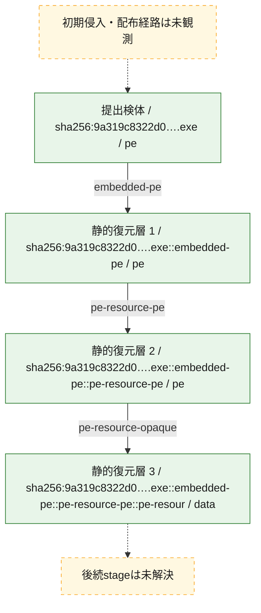
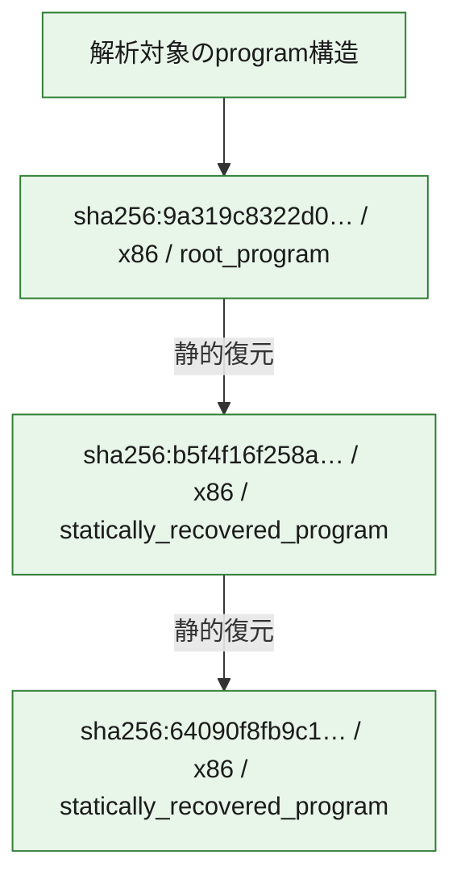

# 全体ロジック：9a319c8322d0ffe5697114504a6cb900d7731d83714504c4a82e1bd1c0e71887

代表関数の静的証跡から、起動・初期化、解析回避・環境判定、永続化、process・memory操作、通信、file操作の処理群を確認しました。

## 読み方

- phaseの掲載順は解析上の整理順です。observed_call_edgesがない段階間の実行順を断定しません。
- 図の実線は静的に観測した関係、点線と黄色のノードは未観測・未解決の関係を示します。
- 図は静的な要約であり、動的実行を再現するものではありません。
- 詳細な関数解説とfingerprintは[STATIC-LOGIC.md](STATIC-LOGIC.md)を参照してください。

## 静的可視化

### 実行フロー

### 感染チェーン

### モジュール関係

## 処理段階

### 1. 起動・初期化

entry pointから初期化と後続処理への移行を確認します。
確度: `confirmed_static_function_evidence`

- `64090f8fb9c1931b79ee4847819ba6d12c1c70cfce171dadaf34b04580c00911:ghidra:004077ba` — 初期化と主要処理への分岐を行う入口関数です。 状態: `succeeded`、選定理由: `call_graph_centrality:in=0,out=2`, `entry_point`, `large_function:instructions=111`, `meaningful_symbol_name`, `reviewed_call_centrality:2`, `reviewed_call_centrality:21`, `role:entrypoint`, `small_program_complete_context`
- `b5f4f16f258a35ba154013123990f956fd761209892d170d9edea7cf4390d3ec:ghidra:00409a16` — 初期化と主要処理への分岐を行う入口関数です。 状態: `succeeded`、選定理由: `call_graph_centrality:in=0,out=13`, `entry_point`, `large_function:instructions=111`, `meaningful_symbol_name`, `reviewed_call_centrality:13`, `reviewed_call_centrality:21`, `role:entrypoint`, `small_program_complete_context`
- `9a319c8322d0ffe5697114504a6cb900d7731d83714504c4a82e1bd1c0e71887:ghidra:1800015ec` — 初期化と主要処理への分岐を行う入口関数です。 状態: `succeeded`、選定理由: `entry_point`, `meaningful_symbol_name`, `reviewed_call_centrality:4`, `role:entrypoint`

### 2. 解析回避・環境判定

debugger、sandbox、仮想環境、時間差などの判定を確認します。
確度: `confirmed_static_function_evidence`

- `9a319c8322d0ffe5697114504a6cb900d7731d83714504c4a82e1bd1c0e71887:ghidra:180002448` — debugger、仮想環境、sandbox、または時間差の確認に関係する関数です。 状態: `succeeded`、選定理由: `context_representative`, `reviewed_call_centrality:14`, `role:anti_analysis`

### 3. 永続化

自動起動や永続化に関係する設定変更を確認します。
確度: `confirmed_static_function_evidence`

- `b5f4f16f258a35ba154013123990f956fd761209892d170d9edea7cf4390d3ec:ghidra:00407c40` — 自動起動または永続化に関係する処理を含む関数です。 状態: `succeeded`、選定理由: `call_graph_centrality:in=1,out=5`, `entry_reachable_call_depth:4`, `reviewed_call_centrality:11`, `reviewed_call_centrality:6`, `role:persistence`, `small_program_complete_context`
- `b5f4f16f258a35ba154013123990f956fd761209892d170d9edea7cf4390d3ec:ghidra:00408090` — 自動起動または永続化に関係する処理を含む関数です。 状態: `succeeded`、選定理由: `call_graph_centrality:in=1,out=8`, `entry_reachable_call_depth:2`, `reviewed_call_centrality:15`, `reviewed_call_centrality:9`, `role:persistence`, `small_program_complete_context`

### 4. process・memory操作

process、thread、module、memory操作と実行移行を確認します。
確度: `confirmed_static_function_evidence_with_limits`

- `9a319c8322d0ffe5697114504a6cb900d7731d83714504c4a82e1bd1c0e71887:ghidra:1800010f8` — process、thread、module、またはmemory操作に関係する関数です。 状態: `succeeded`、選定理由: `context_representative`, `reviewed_call_centrality:6`, `role:process_or_memory_operation`
- `9a319c8322d0ffe5697114504a6cb900d7731d83714504c4a82e1bd1c0e71887:ghidra:180002594` — process、thread、module、またはmemory操作に関係する関数です。 状態: `limited_bad_instruction_or_flow`、選定理由: `context_representative`, `reviewed_call_centrality:6`, `role:process_or_memory_operation`

### 5. 通信

通信初期化、endpoint処理、送受信の役割を確認します。
確度: `confirmed_static_function_evidence`

- `b5f4f16f258a35ba154013123990f956fd761209892d170d9edea7cf4390d3ec:ghidra:00408140` — 通信初期化、送受信、またはendpoint処理に関係する関数です。 状態: `succeeded`、選定理由: `call_graph_centrality:in=1,out=4`, `entry_reachable_call_depth:1`, `reviewed_call_centrality:5`, `reviewed_call_centrality:8`, `role:network_communication`, `small_program_complete_context`

### 6. file操作

fileやdirectoryの作成、読書き、削除を確認します。
確度: `confirmed_static_function_evidence`

- `9a319c8322d0ffe5697114504a6cb900d7731d83714504c4a82e1bd1c0e71887:ghidra:180001014` — fileまたはdirectoryの読書き・管理に関係する関数です。 状態: `succeeded`、選定理由: `context_representative`, `reviewed_call_centrality:16`, `role:file_operation`

### 7. 補助処理

主要処理を支える一般内部関数またはlibrary処理を確認します。
確度: `confirmed_static_function_evidence`

- `b5f4f16f258a35ba154013123990f956fd761209892d170d9edea7cf4390d3ec:ghidra:00407ce0` — 検体内部の一般処理を実装する関数です。 状態: `succeeded`、選定理由: `call_graph_centrality:in=1,out=8`, `entry_reachable_call_depth:4`, `large_function:instructions=175`, `reviewed_call_centrality:17`, `reviewed_call_centrality:9`, `small_program_complete_context`
- `b5f4f16f258a35ba154013123990f956fd761209892d170d9edea7cf4390d3ec:ghidra:00407f20` — 検体内部の一般処理を実装する関数です。 状態: `succeeded`、選定理由: `call_graph_centrality:in=1,out=2`, `entry_reachable_call_depth:3`, `reviewed_call_centrality:3`, `small_program_complete_context`
- `b5f4f16f258a35ba154013123990f956fd761209892d170d9edea7cf4390d3ec:ghidra:00407fa0` — 検体内部の一般処理を実装する関数です。 状態: `succeeded`、選定理由: `call_graph_centrality:in=1,out=1`, `entry_reachable_call_depth:3`, `reviewed_call_centrality:2`, `reviewed_call_centrality:3`, `small_program_complete_context`
- `b5f4f16f258a35ba154013123990f956fd761209892d170d9edea7cf4390d3ec:ghidra:00409b8c` — 検体内部の一般処理を実装する関数です。 状態: `succeeded`、選定理由: `call_graph_centrality:in=1,out=1`, `entry_reachable_call_depth:1`, `reviewed_call_centrality:2`, `small_program_complete_context`
- `b5f4f16f258a35ba154013123990f956fd761209892d170d9edea7cf4390d3ec:ghidra:00409ba1` — 検体内部の一般処理を実装する関数です。 状態: `succeeded`、選定理由: `call_graph_centrality:in=1,out=0`, `entry_reachable_call_depth:1`, `reviewed_call_centrality:1`, `small_program_complete_context`
- `9a319c8322d0ffe5697114504a6cb900d7731d83714504c4a82e1bd1c0e71887:ghidra:1800011a4` — 検体内部の一般処理を実装する関数です。 状態: `succeeded`、選定理由: `entry_point`, `meaningful_symbol_name`, `reviewed_call_centrality:3`
- `9a319c8322d0ffe5697114504a6cb900d7731d83714504c4a82e1bd1c0e71887:ghidra:1800011f0` — 検体内部の一般処理を実装する関数です。 状態: `succeeded`、選定理由: `context_representative`, `reviewed_call_centrality:5`
- `9a319c8322d0ffe5697114504a6cb900d7731d83714504c4a82e1bd1c0e71887:ghidra:1800012dc` — 検体内部の一般処理を実装する関数です。 状態: `succeeded`、選定理由: `context_representative`, `reviewed_call_centrality:6`
- `9a319c8322d0ffe5697114504a6cb900d7731d83714504c4a82e1bd1c0e71887:ghidra:18000137c` — 検体内部の一般処理を実装する関数です。 状態: `succeeded`、選定理由: `context_representative`, `reviewed_call_centrality:25`
- `9a319c8322d0ffe5697114504a6cb900d7731d83714504c4a82e1bd1c0e71887:ghidra:1800014d0` — 検体内部の一般処理を実装する関数です。 状態: `succeeded`、選定理由: `context_representative`, `reviewed_call_centrality:3`
- `9a319c8322d0ffe5697114504a6cb900d7731d83714504c4a82e1bd1c0e71887:ghidra:18000162c` — 検体内部の一般処理を実装する関数です。 状態: `succeeded`、選定理由: `context_representative`, `reviewed_call_centrality:9`
- `9a319c8322d0ffe5697114504a6cb900d7731d83714504c4a82e1bd1c0e71887:ghidra:1800017bc` — 検体内部の一般処理を実装する関数です。 状態: `succeeded`、選定理由: `context_representative`, `reviewed_call_centrality:4`
- `9a319c8322d0ffe5697114504a6cb900d7731d83714504c4a82e1bd1c0e71887:ghidra:180001860` — 検体内部の一般処理を実装する関数です。 状態: `succeeded`、選定理由: `context_representative`, `reviewed_call_centrality:4`
- `9a319c8322d0ffe5697114504a6cb900d7731d83714504c4a82e1bd1c0e71887:ghidra:1800018a8` — 検体内部の一般処理を実装する関数です。 状態: `succeeded`、選定理由: `context_representative`, `reviewed_call_centrality:2`
- `9a319c8322d0ffe5697114504a6cb900d7731d83714504c4a82e1bd1c0e71887:ghidra:1800018fc` — 検体内部の一般処理を実装する関数です。 状態: `succeeded`、選定理由: `context_representative`, `reviewed_call_centrality:2`
- `9a319c8322d0ffe5697114504a6cb900d7731d83714504c4a82e1bd1c0e71887:ghidra:180001994` — 検体内部の一般処理を実装する関数です。 状態: `succeeded`、選定理由: `context_representative`, `reviewed_call_centrality:19`
- `9a319c8322d0ffe5697114504a6cb900d7731d83714504c4a82e1bd1c0e71887:ghidra:1800025c8` — 検体内部の一般処理を実装する関数です。 状態: `succeeded`、選定理由: `context_representative`, `reviewed_call_centrality:5`
- `9a319c8322d0ffe5697114504a6cb900d7731d83714504c4a82e1bd1c0e71887:ghidra:180002638` — 検体内部の一般処理を実装する関数です。 状態: `succeeded`、選定理由: `context_representative`, `reviewed_call_centrality:3`
- `9a319c8322d0ffe5697114504a6cb900d7731d83714504c4a82e1bd1c0e71887:ghidra:1800026a0` — 検体内部の一般処理を実装する関数です。 状態: `succeeded`、選定理由: `context_representative`, `reviewed_call_centrality:5`
- `9a319c8322d0ffe5697114504a6cb900d7731d83714504c4a82e1bd1c0e71887:ghidra:1800026c0` — 検体内部の一般処理を実装する関数です。 状態: `succeeded`、選定理由: `context_representative`, `reviewed_call_centrality:1`
- `9a319c8322d0ffe5697114504a6cb900d7731d83714504c4a82e1bd1c0e71887:ghidra:1800026e0` — 検体内部の一般処理を実装する関数です。 状態: `succeeded`、選定理由: `context_representative`, `reviewed_call_centrality:2`
- `9a319c8322d0ffe5697114504a6cb900d7731d83714504c4a82e1bd1c0e71887:ghidra:180002728` — 検体内部の一般処理を実装する関数です。 状態: `succeeded`、選定理由: `context_representative`, `reviewed_call_centrality:5`
- `9a319c8322d0ffe5697114504a6cb900d7731d83714504c4a82e1bd1c0e71887:ghidra:180002938` — 検体内部の一般処理を実装する関数です。 状態: `succeeded`、選定理由: `context_representative`, `reviewed_call_centrality:7`
- `9a319c8322d0ffe5697114504a6cb900d7731d83714504c4a82e1bd1c0e71887:ghidra:180002960` — 検体内部の一般処理を実装する関数です。 状態: `succeeded`、選定理由: `context_representative`, `reviewed_call_centrality:8`
- `9a319c8322d0ffe5697114504a6cb900d7731d83714504c4a82e1bd1c0e71887:ghidra:180002a18` — 検体内部の一般処理を実装する関数です。 状態: `succeeded`、選定理由: `context_representative`, `reviewed_call_centrality:17`
- `9a319c8322d0ffe5697114504a6cb900d7731d83714504c4a82e1bd1c0e71887:ghidra:180002a9c` — 検体内部の一般処理を実装する関数です。 状態: `succeeded`、選定理由: `context_representative`, `reviewed_call_centrality:3`
- `9a319c8322d0ffe5697114504a6cb900d7731d83714504c4a82e1bd1c0e71887:ghidra:180002ac0` — 検体内部の一般処理を実装する関数です。 状態: `succeeded`、選定理由: `context_representative`, `reviewed_call_centrality:8`
- `9a319c8322d0ffe5697114504a6cb900d7731d83714504c4a82e1bd1c0e71887:ghidra:180002bf4` — 検体内部の一般処理を実装する関数です。 状態: `succeeded`、選定理由: `context_representative`, `reviewed_call_centrality:6`
- `9a319c8322d0ffe5697114504a6cb900d7731d83714504c4a82e1bd1c0e71887:ghidra:180002c34` — 検体内部の一般処理を実装する関数です。 状態: `succeeded`、選定理由: `context_representative`, `reviewed_call_centrality:12`
- `9a319c8322d0ffe5697114504a6cb900d7731d83714504c4a82e1bd1c0e71887:ghidra:180002cb8` — 検体内部の一般処理を実装する関数です。 状態: `succeeded`、選定理由: `context_representative`, `reviewed_call_centrality:11`
- `9a319c8322d0ffe5697114504a6cb900d7731d83714504c4a82e1bd1c0e71887:ghidra:180002cf8` — 検体内部の一般処理を実装する関数です。 状態: `succeeded`、選定理由: `context_representative`, `reviewed_call_centrality:4`
- `9a319c8322d0ffe5697114504a6cb900d7731d83714504c4a82e1bd1c0e71887:ghidra:180002d78` — 検体内部の一般処理を実装する関数です。 状態: `succeeded`、選定理由: `context_representative`, `reviewed_call_centrality:6`

## 観測したcall関係

- `9a319c8322d0ffe5697114504a6cb900d7731d83714504c4a82e1bd1c0e71887:ghidra:1800010f8` → `9a319c8322d0ffe5697114504a6cb900d7731d83714504c4a82e1bd1c0e71887:ghidra:1800011f0` （`execution` → `support`）
- `9a319c8322d0ffe5697114504a6cb900d7731d83714504c4a82e1bd1c0e71887:ghidra:1800011a4` → `9a319c8322d0ffe5697114504a6cb900d7731d83714504c4a82e1bd1c0e71887:ghidra:180001014` （`support` → `file_activity`）
- `9a319c8322d0ffe5697114504a6cb900d7731d83714504c4a82e1bd1c0e71887:ghidra:1800011a4` → `9a319c8322d0ffe5697114504a6cb900d7731d83714504c4a82e1bd1c0e71887:ghidra:1800010f8` （`support` → `execution`）
- `9a319c8322d0ffe5697114504a6cb900d7731d83714504c4a82e1bd1c0e71887:ghidra:1800011a4` → `9a319c8322d0ffe5697114504a6cb900d7731d83714504c4a82e1bd1c0e71887:ghidra:1800012dc` （`support` → `support`）
- `9a319c8322d0ffe5697114504a6cb900d7731d83714504c4a82e1bd1c0e71887:ghidra:1800012dc` → `9a319c8322d0ffe5697114504a6cb900d7731d83714504c4a82e1bd1c0e71887:ghidra:1800011f0` （`support` → `support`）
- `9a319c8322d0ffe5697114504a6cb900d7731d83714504c4a82e1bd1c0e71887:ghidra:1800012dc` → `9a319c8322d0ffe5697114504a6cb900d7731d83714504c4a82e1bd1c0e71887:ghidra:18000162c` （`support` → `support`）
- `9a319c8322d0ffe5697114504a6cb900d7731d83714504c4a82e1bd1c0e71887:ghidra:1800012dc` → `9a319c8322d0ffe5697114504a6cb900d7731d83714504c4a82e1bd1c0e71887:ghidra:180001994` （`support` → `support`）
- `9a319c8322d0ffe5697114504a6cb900d7731d83714504c4a82e1bd1c0e71887:ghidra:1800012dc` → `9a319c8322d0ffe5697114504a6cb900d7731d83714504c4a82e1bd1c0e71887:ghidra:180002638` （`support` → `support`）
- `9a319c8322d0ffe5697114504a6cb900d7731d83714504c4a82e1bd1c0e71887:ghidra:1800012dc` → `9a319c8322d0ffe5697114504a6cb900d7731d83714504c4a82e1bd1c0e71887:ghidra:1800026a0` （`support` → `support`）
- `9a319c8322d0ffe5697114504a6cb900d7731d83714504c4a82e1bd1c0e71887:ghidra:18000137c` → `9a319c8322d0ffe5697114504a6cb900d7731d83714504c4a82e1bd1c0e71887:ghidra:180002938` （`support` → `support`）
- `9a319c8322d0ffe5697114504a6cb900d7731d83714504c4a82e1bd1c0e71887:ghidra:18000137c` → `9a319c8322d0ffe5697114504a6cb900d7731d83714504c4a82e1bd1c0e71887:ghidra:180002960` （`support` → `support`）
- `9a319c8322d0ffe5697114504a6cb900d7731d83714504c4a82e1bd1c0e71887:ghidra:18000137c` → `9a319c8322d0ffe5697114504a6cb900d7731d83714504c4a82e1bd1c0e71887:ghidra:180002bf4` （`support` → `support`）
- `9a319c8322d0ffe5697114504a6cb900d7731d83714504c4a82e1bd1c0e71887:ghidra:18000137c` → `9a319c8322d0ffe5697114504a6cb900d7731d83714504c4a82e1bd1c0e71887:ghidra:180002c34` （`support` → `support`）
- `9a319c8322d0ffe5697114504a6cb900d7731d83714504c4a82e1bd1c0e71887:ghidra:18000137c` → `9a319c8322d0ffe5697114504a6cb900d7731d83714504c4a82e1bd1c0e71887:ghidra:180002cb8` （`support` → `support`）
- `9a319c8322d0ffe5697114504a6cb900d7731d83714504c4a82e1bd1c0e71887:ghidra:18000137c` → `9a319c8322d0ffe5697114504a6cb900d7731d83714504c4a82e1bd1c0e71887:ghidra:180002d78` （`support` → `support`）
- `9a319c8322d0ffe5697114504a6cb900d7731d83714504c4a82e1bd1c0e71887:ghidra:1800014d0` → `9a319c8322d0ffe5697114504a6cb900d7731d83714504c4a82e1bd1c0e71887:ghidra:18000137c` （`support` → `support`）
- `9a319c8322d0ffe5697114504a6cb900d7731d83714504c4a82e1bd1c0e71887:ghidra:1800015ec` → `9a319c8322d0ffe5697114504a6cb900d7731d83714504c4a82e1bd1c0e71887:ghidra:18000137c` （`startup` → `support`）
- `9a319c8322d0ffe5697114504a6cb900d7731d83714504c4a82e1bd1c0e71887:ghidra:18000162c` → `9a319c8322d0ffe5697114504a6cb900d7731d83714504c4a82e1bd1c0e71887:ghidra:1800026a0` （`support` → `support`）
- `9a319c8322d0ffe5697114504a6cb900d7731d83714504c4a82e1bd1c0e71887:ghidra:1800017bc` → `9a319c8322d0ffe5697114504a6cb900d7731d83714504c4a82e1bd1c0e71887:ghidra:180002a9c` （`support` → `support`）
- `9a319c8322d0ffe5697114504a6cb900d7731d83714504c4a82e1bd1c0e71887:ghidra:180001860` → `9a319c8322d0ffe5697114504a6cb900d7731d83714504c4a82e1bd1c0e71887:ghidra:18000162c` （`support` → `support`）
- `9a319c8322d0ffe5697114504a6cb900d7731d83714504c4a82e1bd1c0e71887:ghidra:1800018a8` → `9a319c8322d0ffe5697114504a6cb900d7731d83714504c4a82e1bd1c0e71887:ghidra:180001860` （`support` → `support`）
- `9a319c8322d0ffe5697114504a6cb900d7731d83714504c4a82e1bd1c0e71887:ghidra:1800018fc` → `9a319c8322d0ffe5697114504a6cb900d7731d83714504c4a82e1bd1c0e71887:ghidra:180001860` （`support` → `support`）
- `9a319c8322d0ffe5697114504a6cb900d7731d83714504c4a82e1bd1c0e71887:ghidra:180001994` → `9a319c8322d0ffe5697114504a6cb900d7731d83714504c4a82e1bd1c0e71887:ghidra:1800017bc` （`support` → `support`）
- `9a319c8322d0ffe5697114504a6cb900d7731d83714504c4a82e1bd1c0e71887:ghidra:180001994` → `9a319c8322d0ffe5697114504a6cb900d7731d83714504c4a82e1bd1c0e71887:ghidra:180001860` （`support` → `support`）
- `9a319c8322d0ffe5697114504a6cb900d7731d83714504c4a82e1bd1c0e71887:ghidra:180001994` → `9a319c8322d0ffe5697114504a6cb900d7731d83714504c4a82e1bd1c0e71887:ghidra:1800018a8` （`support` → `support`）
- `9a319c8322d0ffe5697114504a6cb900d7731d83714504c4a82e1bd1c0e71887:ghidra:180001994` → `9a319c8322d0ffe5697114504a6cb900d7731d83714504c4a82e1bd1c0e71887:ghidra:1800018fc` （`support` → `support`）
- `9a319c8322d0ffe5697114504a6cb900d7731d83714504c4a82e1bd1c0e71887:ghidra:180001994` → `9a319c8322d0ffe5697114504a6cb900d7731d83714504c4a82e1bd1c0e71887:ghidra:180002638` （`support` → `support`）
- `9a319c8322d0ffe5697114504a6cb900d7731d83714504c4a82e1bd1c0e71887:ghidra:180001994` → `9a319c8322d0ffe5697114504a6cb900d7731d83714504c4a82e1bd1c0e71887:ghidra:1800026a0` （`support` → `support`）
- `9a319c8322d0ffe5697114504a6cb900d7731d83714504c4a82e1bd1c0e71887:ghidra:180001994` → `9a319c8322d0ffe5697114504a6cb900d7731d83714504c4a82e1bd1c0e71887:ghidra:180002cb8` （`support` → `support`）
- `9a319c8322d0ffe5697114504a6cb900d7731d83714504c4a82e1bd1c0e71887:ghidra:180001994` → `9a319c8322d0ffe5697114504a6cb900d7731d83714504c4a82e1bd1c0e71887:ghidra:180002cf8` （`support` → `support`）
- `9a319c8322d0ffe5697114504a6cb900d7731d83714504c4a82e1bd1c0e71887:ghidra:180002448` → `9a319c8322d0ffe5697114504a6cb900d7731d83714504c4a82e1bd1c0e71887:ghidra:1800011f0` （`evasion` → `support`）
- `9a319c8322d0ffe5697114504a6cb900d7731d83714504c4a82e1bd1c0e71887:ghidra:180002594` → `9a319c8322d0ffe5697114504a6cb900d7731d83714504c4a82e1bd1c0e71887:ghidra:180002448` （`execution` → `evasion`）
- `9a319c8322d0ffe5697114504a6cb900d7731d83714504c4a82e1bd1c0e71887:ghidra:1800025c8` → `9a319c8322d0ffe5697114504a6cb900d7731d83714504c4a82e1bd1c0e71887:ghidra:180002594` （`support` → `execution`）
- `9a319c8322d0ffe5697114504a6cb900d7731d83714504c4a82e1bd1c0e71887:ghidra:180002638` → `9a319c8322d0ffe5697114504a6cb900d7731d83714504c4a82e1bd1c0e71887:ghidra:1800025c8` （`support` → `support`）
- `9a319c8322d0ffe5697114504a6cb900d7731d83714504c4a82e1bd1c0e71887:ghidra:1800026a0` → `9a319c8322d0ffe5697114504a6cb900d7731d83714504c4a82e1bd1c0e71887:ghidra:180002a18` （`support` → `support`）
- `9a319c8322d0ffe5697114504a6cb900d7731d83714504c4a82e1bd1c0e71887:ghidra:1800026c0` → `9a319c8322d0ffe5697114504a6cb900d7731d83714504c4a82e1bd1c0e71887:ghidra:180002a18` （`support` → `support`）
- `9a319c8322d0ffe5697114504a6cb900d7731d83714504c4a82e1bd1c0e71887:ghidra:1800026e0` → `9a319c8322d0ffe5697114504a6cb900d7731d83714504c4a82e1bd1c0e71887:ghidra:180002a18` （`support` → `support`）
- `9a319c8322d0ffe5697114504a6cb900d7731d83714504c4a82e1bd1c0e71887:ghidra:180002938` → `9a319c8322d0ffe5697114504a6cb900d7731d83714504c4a82e1bd1c0e71887:ghidra:180002cb8` （`support` → `support`）
- `9a319c8322d0ffe5697114504a6cb900d7731d83714504c4a82e1bd1c0e71887:ghidra:180002a18` → `9a319c8322d0ffe5697114504a6cb900d7731d83714504c4a82e1bd1c0e71887:ghidra:180002960` （`support` → `support`）
- `9a319c8322d0ffe5697114504a6cb900d7731d83714504c4a82e1bd1c0e71887:ghidra:180002a18` → `9a319c8322d0ffe5697114504a6cb900d7731d83714504c4a82e1bd1c0e71887:ghidra:180002cb8` （`support` → `support`）
- `9a319c8322d0ffe5697114504a6cb900d7731d83714504c4a82e1bd1c0e71887:ghidra:180002a18` → `9a319c8322d0ffe5697114504a6cb900d7731d83714504c4a82e1bd1c0e71887:ghidra:180002d78` （`support` → `support`）
- `9a319c8322d0ffe5697114504a6cb900d7731d83714504c4a82e1bd1c0e71887:ghidra:180002a9c` → `9a319c8322d0ffe5697114504a6cb900d7731d83714504c4a82e1bd1c0e71887:ghidra:180002a18` （`support` → `support`）
- `9a319c8322d0ffe5697114504a6cb900d7731d83714504c4a82e1bd1c0e71887:ghidra:180002ac0` → `9a319c8322d0ffe5697114504a6cb900d7731d83714504c4a82e1bd1c0e71887:ghidra:180002cb8` （`support` → `support`）
- `9a319c8322d0ffe5697114504a6cb900d7731d83714504c4a82e1bd1c0e71887:ghidra:180002bf4` → `9a319c8322d0ffe5697114504a6cb900d7731d83714504c4a82e1bd1c0e71887:ghidra:180002ac0` （`support` → `support`）
- `9a319c8322d0ffe5697114504a6cb900d7731d83714504c4a82e1bd1c0e71887:ghidra:180002c34` → `9a319c8322d0ffe5697114504a6cb900d7731d83714504c4a82e1bd1c0e71887:ghidra:180002938` （`support` → `support`）
- `9a319c8322d0ffe5697114504a6cb900d7731d83714504c4a82e1bd1c0e71887:ghidra:180002c34` → `9a319c8322d0ffe5697114504a6cb900d7731d83714504c4a82e1bd1c0e71887:ghidra:180002960` （`support` → `support`）
- `9a319c8322d0ffe5697114504a6cb900d7731d83714504c4a82e1bd1c0e71887:ghidra:180002c34` → `9a319c8322d0ffe5697114504a6cb900d7731d83714504c4a82e1bd1c0e71887:ghidra:180002d78` （`support` → `support`）
- `9a319c8322d0ffe5697114504a6cb900d7731d83714504c4a82e1bd1c0e71887:ghidra:180002cb8` → `9a319c8322d0ffe5697114504a6cb900d7731d83714504c4a82e1bd1c0e71887:ghidra:1800026a0` （`support` → `support`）
- `b5f4f16f258a35ba154013123990f956fd761209892d170d9edea7cf4390d3ec:ghidra:00407f20` → `b5f4f16f258a35ba154013123990f956fd761209892d170d9edea7cf4390d3ec:ghidra:00407c40` （`support` → `persistence`）
- `b5f4f16f258a35ba154013123990f956fd761209892d170d9edea7cf4390d3ec:ghidra:00407f20` → `b5f4f16f258a35ba154013123990f956fd761209892d170d9edea7cf4390d3ec:ghidra:00407ce0` （`support` → `support`）
- `b5f4f16f258a35ba154013123990f956fd761209892d170d9edea7cf4390d3ec:ghidra:00408090` → `b5f4f16f258a35ba154013123990f956fd761209892d170d9edea7cf4390d3ec:ghidra:00407f20` （`persistence` → `support`）
- `b5f4f16f258a35ba154013123990f956fd761209892d170d9edea7cf4390d3ec:ghidra:00408090` → `b5f4f16f258a35ba154013123990f956fd761209892d170d9edea7cf4390d3ec:ghidra:00407fa0` （`persistence` → `support`）
- `b5f4f16f258a35ba154013123990f956fd761209892d170d9edea7cf4390d3ec:ghidra:00408140` → `b5f4f16f258a35ba154013123990f956fd761209892d170d9edea7cf4390d3ec:ghidra:00408090` （`communication` → `persistence`）
- `b5f4f16f258a35ba154013123990f956fd761209892d170d9edea7cf4390d3ec:ghidra:00409a16` → `b5f4f16f258a35ba154013123990f956fd761209892d170d9edea7cf4390d3ec:ghidra:00408140` （`startup` → `communication`）
- `b5f4f16f258a35ba154013123990f956fd761209892d170d9edea7cf4390d3ec:ghidra:00409a16` → `b5f4f16f258a35ba154013123990f956fd761209892d170d9edea7cf4390d3ec:ghidra:00409b8c` （`startup` → `support`）
- `b5f4f16f258a35ba154013123990f956fd761209892d170d9edea7cf4390d3ec:ghidra:00409a16` → `b5f4f16f258a35ba154013123990f956fd761209892d170d9edea7cf4390d3ec:ghidra:00409ba1` （`startup` → `support`）
- `ghidra-function:0749e1862916dabf9fb249f8` → `ghidra-function:5a068a81f994e05102282cfa` （`unclassified` → `unclassified`）
- `ghidra-function:0749e1862916dabf9fb249f8` → `ghidra-function:74b515f87f3e939052fd2c14` （`unclassified` → `unclassified`）
- `ghidra-function:07cd0e7695dd62880a78e18f` → `ghidra-function:10361ec87f78e48a0c592326` （`unclassified` → `unclassified`）
- `ghidra-function:07cd0e7695dd62880a78e18f` → `ghidra-function:446f25f157a08b710cb3fef9` （`unclassified` → `unclassified`）
- `ghidra-function:07cd0e7695dd62880a78e18f` → `ghidra-function:66f7688da81d22c9ac0fdc12` （`unclassified` → `unclassified`）
- `ghidra-function:07cd0e7695dd62880a78e18f` → `ghidra-function:c4f899dcbb7c8eb2d436d5e6` （`unclassified` → `unclassified`）
- `ghidra-function:07cd0e7695dd62880a78e18f` → `ghidra-function:e2e60a820056a8b9d3f6f828` （`unclassified` → `unclassified`）
- `ghidra-function:0fb4e5cbfbb0372ad7f3611d` → `ghidra-function:e2e60a820056a8b9d3f6f828` （`unclassified` → `unclassified`）
- `ghidra-function:0fd429ae359ce9cbb6945d48` → `ghidra-function:22058e8c4d651207039d2eb9` （`unclassified` → `unclassified`）
- `ghidra-function:0fd429ae359ce9cbb6945d48` → `ghidra-function:3097b9af240e9ec7093e7caf` （`unclassified` → `unclassified`）
- `ghidra-function:0fd429ae359ce9cbb6945d48` → `ghidra-function:36b706da6d4b37c133da16d2` （`unclassified` → `unclassified`）
- `ghidra-function:0fd429ae359ce9cbb6945d48` → `ghidra-function:446d181250a512f0b64d922f` （`unclassified` → `unclassified`）
- `ghidra-function:0fd429ae359ce9cbb6945d48` → `ghidra-function:a3d9092018b36b2a20cb86ab` （`unclassified` → `unclassified`）
- `ghidra-function:0fd429ae359ce9cbb6945d48` → `ghidra-function:a3f611fcd4083698a2269c73` （`unclassified` → `unclassified`）
- `ghidra-function:0fd429ae359ce9cbb6945d48` → `ghidra-function:cde4d23055e027ae26943b85` （`unclassified` → `unclassified`）
- `ghidra-function:0fd429ae359ce9cbb6945d48` → `ghidra-function:dd762ed38d3777bcc696b040` （`unclassified` → `unclassified`）
- `ghidra-function:10361ec87f78e48a0c592326` → `ghidra-function:7d8e682f9ab1e60095f24aef` （`unclassified` → `unclassified`）
- `ghidra-function:14d3bfd10ea0ae9494454967` → `ghidra-external:174571576e0d1c20859d5a8d` （`unclassified` → `unclassified`）
- `ghidra-function:14d3bfd10ea0ae9494454967` → `ghidra-function:10361ec87f78e48a0c592326` （`unclassified` → `unclassified`）
- `ghidra-function:14d3bfd10ea0ae9494454967` → `ghidra-function:5031b546211543b65bdda74e` （`unclassified` → `unclassified`）
- `ghidra-function:14d3bfd10ea0ae9494454967` → `ghidra-function:eb3005f4e077ef9ce78ac396` （`unclassified` → `unclassified`）
- `ghidra-function:1a4f4d84fc686fce73f6bee6` → `ghidra-function:0fb4e5cbfbb0372ad7f3611d` （`unclassified` → `unclassified`）
- `ghidra-function:1d4768788cd754c08884cf1e` → `ghidra-external:86e4e07c10387c88d9d4f906` （`unclassified` → `unclassified`）
- `ghidra-function:1d4768788cd754c08884cf1e` → `ghidra-external:8a3eb98d251507c91a6348b8` （`unclassified` → `unclassified`）
- `ghidra-function:1d4768788cd754c08884cf1e` → `ghidra-external:a13c48cbfd79e2663357bf10` （`unclassified` → `unclassified`）
- `ghidra-function:1d4768788cd754c08884cf1e` → `ghidra-external:d5ef1eb506357e56e0b51f2c` （`unclassified` → `unclassified`）
- `ghidra-function:1d4768788cd754c08884cf1e` → `ghidra-function:14d3bfd10ea0ae9494454967` （`unclassified` → `unclassified`）
- `ghidra-function:1d4768788cd754c08884cf1e` → `ghidra-function:1ed8e85f8c6b858518c83de7` （`unclassified` → `unclassified`）
- `ghidra-function:1d4768788cd754c08884cf1e` → `ghidra-function:9887376c4f867bc2398ca39b` （`unclassified` → `unclassified`）
- `ghidra-function:205d3d61662bbfedca5ddaf8` → `ghidra-function:0fb4e5cbfbb0372ad7f3611d` （`unclassified` → `unclassified`）
- `ghidra-function:2561000de2cf212b3877fd02` → `ghidra-external:c511113016740d66e86d5aea` （`unclassified` → `unclassified`）
- `ghidra-function:2561000de2cf212b3877fd02` → `ghidra-external:e52aa37c2ffb528c526eaff4` （`unclassified` → `unclassified`）
- `ghidra-function:2561000de2cf212b3877fd02` → `ghidra-function:58e4173b95df5b52883f4d95` （`unclassified` → `unclassified`）
- `ghidra-function:2b97e5d01d08bf819e56bbe1` → `ghidra-external:1569f2bd3caf4b67a29780a8` （`unclassified` → `unclassified`）
- `ghidra-function:2b97e5d01d08bf819e56bbe1` → `ghidra-external:db39f206bd467859ffcfcbb3` （`unclassified` → `unclassified`）
- `ghidra-function:2b97e5d01d08bf819e56bbe1` → `ghidra-external:ebfde6908b8408287d2b01d1` （`unclassified` → `unclassified`）
- `ghidra-function:2b97e5d01d08bf819e56bbe1` → `ghidra-function:03613ea6c59c1e597ec61ebb` （`unclassified` → `unclassified`）
- `ghidra-function:2b97e5d01d08bf819e56bbe1` → `ghidra-function:268adcdd96877ee83c0025cd` （`unclassified` → `unclassified`）
- `ghidra-function:2b97e5d01d08bf819e56bbe1` → `ghidra-function:66f7688da81d22c9ac0fdc12` （`unclassified` → `unclassified`）
- `ghidra-function:2b97e5d01d08bf819e56bbe1` → `ghidra-function:91e54267da3412d13ac03c91` （`unclassified` → `unclassified`）
- `ghidra-function:2b97e5d01d08bf819e56bbe1` → `ghidra-function:ab6aad977af819a57dfbb66c` （`unclassified` → `unclassified`）
- `ghidra-function:2b97e5d01d08bf819e56bbe1` → `ghidra-function:fc7741b49ecba81c1045fe35` （`unclassified` → `unclassified`）
- `ghidra-function:36b706da6d4b37c133da16d2` → `ghidra-function:a638af81771304ee689cd2a6` （`unclassified` → `unclassified`）
- `ghidra-function:36b706da6d4b37c133da16d2` → `ghidra-function:d68a8836a9aa26070336e4a5` （`unclassified` → `unclassified`）
- `ghidra-function:41ef9234e51b358a443578dc` → `ghidra-function:00c3d21bf10fd8adaf6fee2c` （`unclassified` → `unclassified`）
- `ghidra-function:41ef9234e51b358a443578dc` → `ghidra-function:0749e1862916dabf9fb249f8` （`unclassified` → `unclassified`）
- `ghidra-function:41ef9234e51b358a443578dc` → `ghidra-function:2325a144f4dd4c96282681d8` （`unclassified` → `unclassified`）
- `ghidra-function:41ef9234e51b358a443578dc` → `ghidra-function:4b86821c786f9cc93e37bb8b` （`unclassified` → `unclassified`）
- `ghidra-function:41ef9234e51b358a443578dc` → `ghidra-function:bd0ff183417630e7f1cd9625` （`unclassified` → `unclassified`）
- `ghidra-function:41ef9234e51b358a443578dc` → `ghidra-function:d105b064e284b05b8063823d` （`unclassified` → `unclassified`）
- `ghidra-function:41ef9234e51b358a443578dc` → `ghidra-function:ef536772a09ab035b41cab2f` （`unclassified` → `unclassified`）
- `ghidra-function:41ef9234e51b358a443578dc` → `ghidra-function:f32f51b2b0688ee027e24baf` （`unclassified` → `unclassified`）
- `ghidra-function:446f25f157a08b710cb3fef9` → `ghidra-function:fff5fa83818a47dd4b608a66` （`unclassified` → `unclassified`）
- `ghidra-function:48dfc0a8d416ed042c9c2faa` → `ghidra-external:174571576e0d1c20859d5a8d` （`unclassified` → `unclassified`）
- `ghidra-function:48dfc0a8d416ed042c9c2faa` → `ghidra-function:7d8e682f9ab1e60095f24aef` （`unclassified` → `unclassified`）
- `ghidra-function:516ce85ef9d1cfa1c18bb783` → `ghidra-function:20065c1f28a6da08957c924d` （`unclassified` → `unclassified`）
- `ghidra-function:516ce85ef9d1cfa1c18bb783` → `ghidra-function:43237264c9f8ab07c649b47c` （`unclassified` → `unclassified`）
- `ghidra-function:516ce85ef9d1cfa1c18bb783` → `ghidra-function:66f7688da81d22c9ac0fdc12` （`unclassified` → `unclassified`）
- `ghidra-function:51bef0d7d8fd87a4c2452e1d` → `ghidra-function:6fc233d8bdc2ba4aa22e9ee7` （`unclassified` → `unclassified`）
- `ghidra-function:58e4173b95df5b52883f4d95` → `ghidra-external:57fca11ba8259e2f02487da8` （`unclassified` → `unclassified`）
- `ghidra-function:58e4173b95df5b52883f4d95` → `ghidra-external:9f1649bd492d1bfcd185387b` （`unclassified` → `unclassified`）
- `ghidra-function:58e4173b95df5b52883f4d95` → `ghidra-function:00c3d21bf10fd8adaf6fee2c` （`unclassified` → `unclassified`）
- `ghidra-function:58e4173b95df5b52883f4d95` → `ghidra-function:063ffe1a4bd46f1714acd759` （`unclassified` → `unclassified`）
- `ghidra-function:58e4173b95df5b52883f4d95` → `ghidra-function:0749e1862916dabf9fb249f8` （`unclassified` → `unclassified`）
- `ghidra-function:58e4173b95df5b52883f4d95` → `ghidra-function:0870cdcc2c1891e2d6f8a220` （`unclassified` → `unclassified`）
- `ghidra-function:58e4173b95df5b52883f4d95` → `ghidra-function:14d3bfd10ea0ae9494454967` （`unclassified` → `unclassified`）
- `ghidra-function:58e4173b95df5b52883f4d95` → `ghidra-function:30f95bda8f2cc17c9bb95001` （`unclassified` → `unclassified`）
- `ghidra-function:58e4173b95df5b52883f4d95` → `ghidra-function:3f3c4988b9014aa2e4e31e35` （`unclassified` → `unclassified`）
- `ghidra-function:58e4173b95df5b52883f4d95` → `ghidra-function:3fc2890151049d7571761a6c` （`unclassified` → `unclassified`）
- `ghidra-function:58e4173b95df5b52883f4d95` → `ghidra-function:41ef9234e51b358a443578dc` （`unclassified` → `unclassified`）
- `ghidra-function:58e4173b95df5b52883f4d95` → `ghidra-function:4b86821c786f9cc93e37bb8b` （`unclassified` → `unclassified`）
- `ghidra-function:58e4173b95df5b52883f4d95` → `ghidra-function:5e438cac5882bb4ac7274c17` （`unclassified` → `unclassified`）
- `ghidra-function:58e4173b95df5b52883f4d95` → `ghidra-function:689d0f745db56e30987ef42b` （`unclassified` → `unclassified`）
- `ghidra-function:58e4173b95df5b52883f4d95` → `ghidra-function:8ebd944fc034c4829b1ddce0` （`unclassified` → `unclassified`）
- `ghidra-function:58e4173b95df5b52883f4d95` → `ghidra-function:a90ed6ca9f6998a4e4626e70` （`unclassified` → `unclassified`）
- `ghidra-function:58e4173b95df5b52883f4d95` → `ghidra-function:bd0ff183417630e7f1cd9625` （`unclassified` → `unclassified`）
- `ghidra-function:58e4173b95df5b52883f4d95` → `ghidra-function:d365e94dd60ae4bf6f652f6b` （`unclassified` → `unclassified`）
- `ghidra-function:58e4173b95df5b52883f4d95` → `ghidra-function:ef536772a09ab035b41cab2f` （`unclassified` → `unclassified`）
- `ghidra-function:58e4173b95df5b52883f4d95` → `ghidra-function:f5f1da6e0f07310d9cbed8c7` （`unclassified` → `unclassified`）
- `ghidra-function:5ba3437aca37ff17cc8669b0` → `ghidra-function:078d863748aba1d3f0892848` （`unclassified` → `unclassified`）
- `ghidra-function:5ba3437aca37ff17cc8669b0` → `ghidra-function:0fd429ae359ce9cbb6945d48` （`unclassified` → `unclassified`）
- `ghidra-function:5ba3437aca37ff17cc8669b0` → `ghidra-function:297b971f217cbc2b20e5c4dc` （`unclassified` → `unclassified`）
- `ghidra-function:5ba3437aca37ff17cc8669b0` → `ghidra-function:32119e972028da92b31b5439` （`unclassified` → `unclassified`）
- `ghidra-function:5daa8a3f1bf41b2e4d89e4e4` → `ghidra-function:8d5556d891ccdf6f698501a8` （`unclassified` → `unclassified`）
- `ghidra-function:5e7a3a0901bfddbc47aa4847` → `ghidra-function:071c7987ce2a3f96351daae1` （`unclassified` → `unclassified`）
- `ghidra-function:5e7a3a0901bfddbc47aa4847` → `ghidra-function:2b97e5d01d08bf819e56bbe1` （`unclassified` → `unclassified`）
- `ghidra-function:5e7a3a0901bfddbc47aa4847` → `ghidra-function:96ef9b53da26fddd307400ec` （`unclassified` → `unclassified`）
- `ghidra-function:66f7688da81d22c9ac0fdc12` → `ghidra-external:8a3eb98d251507c91a6348b8` （`unclassified` → `unclassified`）
- `ghidra-function:66f7688da81d22c9ac0fdc12` → `ghidra-external:a13c48cbfd79e2663357bf10` （`unclassified` → `unclassified`）
- `ghidra-function:6fc233d8bdc2ba4aa22e9ee7` → `ghidra-function:729c5e5a5e8065978e59c022` （`unclassified` → `unclassified`）
- `ghidra-function:6fc233d8bdc2ba4aa22e9ee7` → `ghidra-function:7748b6c462efc8dac6fe656b` （`unclassified` → `unclassified`）
- `ghidra-function:6fc233d8bdc2ba4aa22e9ee7` → `ghidra-function:efce5d7f1eb934769be67106` （`unclassified` → `unclassified`）
- `ghidra-function:7748b6c462efc8dac6fe656b` → `ghidra-function:f53960b3d76216d038fd144e` （`unclassified` → `unclassified`）
- `ghidra-function:7d8e682f9ab1e60095f24aef` → `ghidra-function:00c3d21bf10fd8adaf6fee2c` （`unclassified` → `unclassified`）
- `ghidra-function:7d8e682f9ab1e60095f24aef` → `ghidra-function:0749e1862916dabf9fb249f8` （`unclassified` → `unclassified`）
- `ghidra-function:7d8e682f9ab1e60095f24aef` → `ghidra-function:14d3bfd10ea0ae9494454967` （`unclassified` → `unclassified`）
- `ghidra-function:7d8e682f9ab1e60095f24aef` → `ghidra-function:4b86821c786f9cc93e37bb8b` （`unclassified` → `unclassified`）
- `ghidra-function:7d8e682f9ab1e60095f24aef` → `ghidra-function:5031b546211543b65bdda74e` （`unclassified` → `unclassified`）
- `ghidra-function:7d8e682f9ab1e60095f24aef` → `ghidra-function:5512e10ae32ef0fc1c693936` （`unclassified` → `unclassified`）
- `ghidra-function:7d8e682f9ab1e60095f24aef` → `ghidra-function:6e075349717af86a9cf2f36e` （`unclassified` → `unclassified`）
- `ghidra-function:7d8e682f9ab1e60095f24aef` → `ghidra-function:ef536772a09ab035b41cab2f` （`unclassified` → `unclassified`）
- `ghidra-function:7dbcc8b76fd54a023181a1e1` → `ghidra-function:7d8e682f9ab1e60095f24aef` （`unclassified` → `unclassified`）
- `ghidra-function:7e185b2a7bd545dbc2cfd260` → `ghidra-external:2c590e47fd50795a8bf06d7b` （`unclassified` → `unclassified`）
- `ghidra-function:7e185b2a7bd545dbc2cfd260` → `ghidra-function:43237264c9f8ab07c649b47c` （`unclassified` → `unclassified`）
- `ghidra-function:7e185b2a7bd545dbc2cfd260` → `ghidra-function:6bc2f848fd579a60c1972569` （`unclassified` → `unclassified`）
- `ghidra-function:7e185b2a7bd545dbc2cfd260` → `ghidra-function:6fe4b2f26a1b3baf2fe7d77f` （`unclassified` → `unclassified`）
- `ghidra-function:7e185b2a7bd545dbc2cfd260` → `ghidra-function:b3f7dbebbea5dfba55449443` （`unclassified` → `unclassified`）
- `ghidra-function:7e185b2a7bd545dbc2cfd260` → `ghidra-function:c10f19330a67c8c16f1948ed` （`unclassified` → `unclassified`）
- `ghidra-function:7e185b2a7bd545dbc2cfd260` → `ghidra-function:efaa34d3a2909b75c5c1a3ef` （`unclassified` → `unclassified`）
- `ghidra-function:7e185b2a7bd545dbc2cfd260` → `ghidra-function:f69ab0cd044192ce3cc5b592` （`unclassified` → `unclassified`）
- `ghidra-function:88e808509d22f35673ad00c2` → `ghidra-function:22c47e9667a22086991e8997` （`unclassified` → `unclassified`）
- `ghidra-function:88e808509d22f35673ad00c2` → `ghidra-function:42ae9ac4c086a76bddbd6b4a` （`unclassified` → `unclassified`）
- `ghidra-function:88e808509d22f35673ad00c2` → `ghidra-function:4b705410b6b7690a8bd8af75` （`unclassified` → `unclassified`）
- `ghidra-function:88e808509d22f35673ad00c2` → `ghidra-function:5092fbb2b0eca5a7a0c92f7b` （`unclassified` → `unclassified`）
- `ghidra-function:88e808509d22f35673ad00c2` → `ghidra-function:53f4bbe92a3f6b62432ca366` （`unclassified` → `unclassified`）
- `ghidra-function:88e808509d22f35673ad00c2` → `ghidra-function:5ba3437aca37ff17cc8669b0` （`unclassified` → `unclassified`）
- `ghidra-function:88e808509d22f35673ad00c2` → `ghidra-function:5daa8a3f1bf41b2e4d89e4e4` （`unclassified` → `unclassified`）
- `ghidra-function:88e808509d22f35673ad00c2` → `ghidra-function:64d95aa3b43afe5aa95d9826` （`unclassified` → `unclassified`）
- `ghidra-function:88e808509d22f35673ad00c2` → `ghidra-function:6dc2e0778df7bf03705bd3e1` （`unclassified` → `unclassified`）
- `ghidra-function:88e808509d22f35673ad00c2` → `ghidra-function:8c383fdaba9e8bb13da7d90e` （`unclassified` → `unclassified`）
- `ghidra-function:88e808509d22f35673ad00c2` → `ghidra-function:93ebce5f51541e2046754066` （`unclassified` → `unclassified`）
- `ghidra-function:88e808509d22f35673ad00c2` → `ghidra-function:b39468f970a12f4a934ace96` （`unclassified` → `unclassified`）
- `ghidra-function:88e808509d22f35673ad00c2` → `ghidra-function:f8b5dd5dd8bce28813e66afc` （`unclassified` → `unclassified`）
- `ghidra-function:8da08bf87ebce8139a7decd5` → `ghidra-function:3c76154a8cb54104385dc1ee` （`unclassified` → `unclassified`）
- `ghidra-function:8da08bf87ebce8139a7decd5` → `ghidra-function:99f2126613f159e6d709f70d` （`unclassified` → `unclassified`）
- `ghidra-function:8da08bf87ebce8139a7decd5` → `ghidra-function:d22279309e5e9136231663be` （`unclassified` → `unclassified`）
- `ghidra-function:94bd672634a2b55bd764a1df` → `ghidra-external:c511113016740d66e86d5aea` （`unclassified` → `unclassified`）
- `ghidra-function:94bd672634a2b55bd764a1df` → `ghidra-external:e52aa37c2ffb528c526eaff4` （`unclassified` → `unclassified`）
- `ghidra-function:94bd672634a2b55bd764a1df` → `ghidra-function:4785c9b3661c892382346be9` （`unclassified` → `unclassified`）
- `ghidra-function:94bd672634a2b55bd764a1df` → `ghidra-function:58e4173b95df5b52883f4d95` （`unclassified` → `unclassified`）
- `ghidra-function:a3d9092018b36b2a20cb86ab` → `ghidra-function:3c4cf47b1535ce13589d4854` （`unclassified` → `unclassified`）
- `ghidra-function:a638af81771304ee689cd2a6` → `ghidra-function:060a53ac311597db6ff316e6` （`unclassified` → `unclassified`）
- `ghidra-function:a638af81771304ee689cd2a6` → `ghidra-function:446d181250a512f0b64d922f` （`unclassified` → `unclassified`）
- `ghidra-function:a638af81771304ee689cd2a6` → `ghidra-function:52942cee02be9e71bf32ca42` （`unclassified` → `unclassified`）
- `ghidra-function:a638af81771304ee689cd2a6` → `ghidra-function:7ab9a866d65a746003a36b39` （`unclassified` → `unclassified`）
- `ghidra-function:a638af81771304ee689cd2a6` → `ghidra-function:dd762ed38d3777bcc696b040` （`unclassified` → `unclassified`）
- `ghidra-function:a90ed6ca9f6998a4e4626e70` → `ghidra-function:1d4768788cd754c08884cf1e` （`unclassified` → `unclassified`）
- `ghidra-function:a90ed6ca9f6998a4e4626e70` → `ghidra-function:4b86821c786f9cc93e37bb8b` （`unclassified` → `unclassified`）
- `ghidra-function:a90ed6ca9f6998a4e4626e70` → `ghidra-function:6e075349717af86a9cf2f36e` （`unclassified` → `unclassified`）
- `ghidra-function:bd0ff183417630e7f1cd9625` → `ghidra-function:14d3bfd10ea0ae9494454967` （`unclassified` → `unclassified`）
- `ghidra-function:bd0ff183417630e7f1cd9625` → `ghidra-function:9f7bbc32cd0448344c79bd2e` （`unclassified` → `unclassified`）
- `ghidra-function:bd0ff183417630e7f1cd9625` → `ghidra-function:ddd511fc4609576423a64e7b` （`unclassified` → `unclassified`）
- `ghidra-function:c4f899dcbb7c8eb2d436d5e6` → `ghidra-external:2c590e47fd50795a8bf06d7b` （`unclassified` → `unclassified`）
- `ghidra-function:c4f899dcbb7c8eb2d436d5e6` → `ghidra-external:a856f6d51fefcec67182e5a6` （`unclassified` → `unclassified`）
- 残り62件は`static-logic.json`に記録しています。

## 解析範囲と制約

- 選定外関数は全体inventoryへ残しますが、関数本体の個別解説対象にはしていません。
- indirect call、難読化、packer、VM、壊れたcontrol flowによりcall関係が欠落する場合があります。
- 文書は静的解析に基づき、検体実行や外部通信による動的確認は行っていません。
