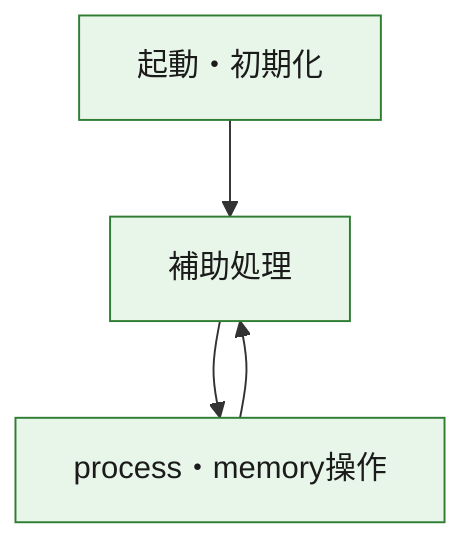
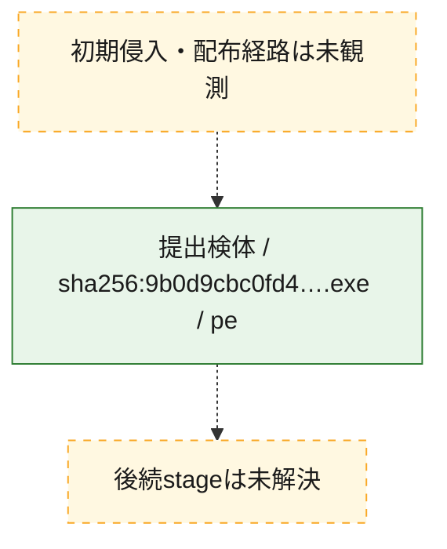
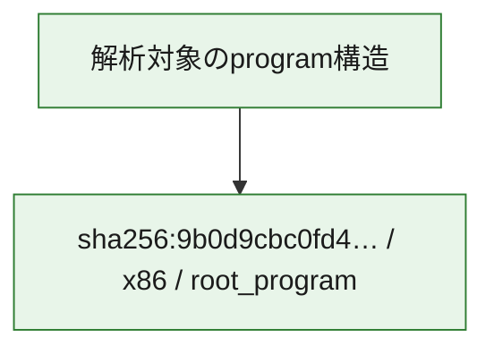

# 全体ロジック：9b0d9cbc0fd4a7bae8b78a15dfbe63052779414ad725845732c4a0083008da69

代表関数の静的証跡から、起動・初期化、process・memory操作の処理群を確認しました。

## 読み方

- phaseの掲載順は解析上の整理順です。observed_call_edgesがない段階間の実行順を断定しません。
- 図の実線は静的に観測した関係、点線と黄色のノードは未観測・未解決の関係を示します。
- 図は静的な要約であり、動的実行を再現するものではありません。
- 詳細な関数解説とfingerprintは[STATIC-LOGIC.md](STATIC-LOGIC.md)を参照してください。

## 静的可視化

### 実行フロー

### 感染チェーン

### モジュール関係

## 処理段階

### 1. 起動・初期化

entry pointから初期化と後続処理への移行を確認します。
確度: `confirmed_static_function_evidence`

- `9b0d9cbc0fd4a7bae8b78a15dfbe63052779414ad725845732c4a0083008da69:ghidra:3a4da1320` — 初期化と主要処理への分岐を行う入口関数です。 状態: `succeeded`、選定理由: `entry_point`, `meaningful_symbol_name`, `reviewed_call_centrality:5`, `role:entrypoint`

### 2. process・memory操作

process、thread、module、memory操作と実行移行を確認します。
確度: `confirmed_static_function_evidence`

- `9b0d9cbc0fd4a7bae8b78a15dfbe63052779414ad725845732c4a0083008da69:ghidra:3a4da1466` — process、thread、module、またはmemory操作に関係する関数です。 状態: `succeeded`、選定理由: `context_representative`, `reviewed_call_centrality:14`, `role:process_or_memory_operation`
- `9b0d9cbc0fd4a7bae8b78a15dfbe63052779414ad725845732c4a0083008da69:ghidra:3a4da1a00` — process、thread、module、またはmemory操作に関係する関数です。 状態: `succeeded`、選定理由: `context_representative`, `reviewed_call_centrality:16`, `role:process_or_memory_operation`
- `9b0d9cbc0fd4a7bae8b78a15dfbe63052779414ad725845732c4a0083008da69:ghidra:3a4da1a70` — process、thread、module、またはmemory操作に関係する関数です。 状態: `succeeded`、選定理由: `context_representative`, `reviewed_call_centrality:12`, `role:process_or_memory_operation`

### 3. 補助処理

主要処理を支える一般内部関数またはlibrary処理を確認します。
確度: `confirmed_static_function_evidence_with_limits`

- `9b0d9cbc0fd4a7bae8b78a15dfbe63052779414ad725845732c4a0083008da69:ghidra:3a4da1000` — 検体内部の一般処理を実装する関数です。 状態: `limited_bad_instruction_or_flow`、選定理由: `context_representative`, `reviewed_call_centrality:2`
- `9b0d9cbc0fd4a7bae8b78a15dfbe63052779414ad725845732c4a0083008da69:ghidra:3a4da1010` — 検体内部の一般処理を実装する関数です。 状態: `succeeded`、選定理由: `context_representative`, `reviewed_call_centrality:15`
- `9b0d9cbc0fd4a7bae8b78a15dfbe63052779414ad725845732c4a0083008da69:ghidra:3a4da11c0` — 検体内部の一般処理を実装する関数です。 状態: `succeeded`、選定理由: `context_representative`, `reviewed_call_centrality:5`
- `9b0d9cbc0fd4a7bae8b78a15dfbe63052779414ad725845732c4a0083008da69:ghidra:3a4da1340` — 検体内部の一般処理を実装する関数です。 状態: `limited_bad_instruction_or_flow`、選定理由: `context_representative`, `reviewed_call_centrality:2`
- `9b0d9cbc0fd4a7bae8b78a15dfbe63052779414ad725845732c4a0083008da69:ghidra:3a4da1350` — 検体内部の一般処理を実装する関数です。 状態: `limited_bad_instruction_or_flow`、選定理由: `context_representative`, `reviewed_call_centrality:2`
- `9b0d9cbc0fd4a7bae8b78a15dfbe63052779414ad725845732c4a0083008da69:ghidra:3a4da1360` — 検体内部の一般処理を実装する関数です。 状態: `succeeded`、選定理由: `context_representative`
- `9b0d9cbc0fd4a7bae8b78a15dfbe63052779414ad725845732c4a0083008da69:ghidra:3a4da1370` — 検体内部の一般処理を実装する関数です。 状態: `succeeded`、選定理由: `context_representative`, `reviewed_call_centrality:1`
- `9b0d9cbc0fd4a7bae8b78a15dfbe63052779414ad725845732c4a0083008da69:ghidra:3a4da13be` — 検体内部の一般処理を実装する関数です。 状態: `succeeded`、選定理由: `context_representative`, `reviewed_call_centrality:4`
- `9b0d9cbc0fd4a7bae8b78a15dfbe63052779414ad725845732c4a0083008da69:ghidra:3a4da145f` — 検体内部の一般処理を実装する関数です。 状態: `succeeded`、選定理由: `context_representative`, `reviewed_call_centrality:1`
- `9b0d9cbc0fd4a7bae8b78a15dfbe63052779414ad725845732c4a0083008da69:ghidra:3a4da1816` — 検体内部の一般処理を実装する関数です。 状態: `succeeded`、選定理由: `entry_point`, `meaningful_symbol_name`, `reviewed_call_centrality:1`
- `9b0d9cbc0fd4a7bae8b78a15dfbe63052779414ad725845732c4a0083008da69:ghidra:3a4da1860` — 検体内部の一般処理を実装する関数です。 状態: `succeeded`、選定理由: `context_representative`
- `9b0d9cbc0fd4a7bae8b78a15dfbe63052779414ad725845732c4a0083008da69:ghidra:3a4da18b0` — 検体内部の一般処理を実装する関数です。 状態: `limited_bad_instruction_or_flow`、選定理由: `context_representative`, `reviewed_call_centrality:2`
- `9b0d9cbc0fd4a7bae8b78a15dfbe63052779414ad725845732c4a0083008da69:ghidra:3a4da1930` — 検体内部の一般処理を実装する関数です。 状態: `limited_bad_instruction_or_flow`、選定理由: `context_representative`, `reviewed_call_centrality:5`
- `9b0d9cbc0fd4a7bae8b78a15dfbe63052779414ad725845732c4a0083008da69:ghidra:3a4da1950` — compiler生成処理または汎用library処理とみられる関数です。 状態: `succeeded`、選定理由: `entry_point`, `meaningful_symbol_name`, `reviewed_call_centrality:7`
- `9b0d9cbc0fd4a7bae8b78a15dfbe63052779414ad725845732c4a0083008da69:ghidra:3a4da1970` — compiler生成処理または汎用library処理とみられる関数です。 状態: `succeeded`、選定理由: `entry_point`, `meaningful_symbol_name`, `reviewed_call_centrality:4`
- `9b0d9cbc0fd4a7bae8b78a15dfbe63052779414ad725845732c4a0083008da69:ghidra:3a4da19f0` — 検体内部の一般処理を実装する関数です。 状態: `succeeded`、選定理由: `context_representative`
- `9b0d9cbc0fd4a7bae8b78a15dfbe63052779414ad725845732c4a0083008da69:ghidra:3a4da1be0` — 検体内部の一般処理を実装する関数です。 状態: `succeeded`、選定理由: `context_representative`, `reviewed_call_centrality:6`
- `9b0d9cbc0fd4a7bae8b78a15dfbe63052779414ad725845732c4a0083008da69:ghidra:3a4da1f60` — 検体内部の一般処理を実装する関数です。 状態: `limited_bad_instruction_or_flow`、選定理由: `context_representative`, `reviewed_call_centrality:10`
- `9b0d9cbc0fd4a7bae8b78a15dfbe63052779414ad725845732c4a0083008da69:ghidra:3a4da1fe0` — 検体内部の一般処理を実装する関数です。 状態: `succeeded`、選定理由: `context_representative`, `reviewed_call_centrality:5`
- `9b0d9cbc0fd4a7bae8b78a15dfbe63052779414ad725845732c4a0083008da69:ghidra:3a4da2050` — 検体内部の一般処理を実装する関数です。 状態: `succeeded`、選定理由: `context_representative`, `reviewed_call_centrality:5`
- `9b0d9cbc0fd4a7bae8b78a15dfbe63052779414ad725845732c4a0083008da69:ghidra:3a4da20f0` — 検体内部の一般処理を実装する関数です。 状態: `succeeded`、選定理由: `context_representative`, `reviewed_call_centrality:7`
- `9b0d9cbc0fd4a7bae8b78a15dfbe63052779414ad725845732c4a0083008da69:ghidra:3a4da2200` — 検体内部の一般処理を実装する関数です。 状態: `succeeded`、選定理由: `context_representative`
- `9b0d9cbc0fd4a7bae8b78a15dfbe63052779414ad725845732c4a0083008da69:ghidra:3a4da2230` — 検体内部の一般処理を実装する関数です。 状態: `succeeded`、選定理由: `context_representative`
- `9b0d9cbc0fd4a7bae8b78a15dfbe63052779414ad725845732c4a0083008da69:ghidra:3a4da2280` — 検体内部の一般処理を実装する関数です。 状態: `succeeded`、選定理由: `context_representative`, `reviewed_call_centrality:2`
- `9b0d9cbc0fd4a7bae8b78a15dfbe63052779414ad725845732c4a0083008da69:ghidra:3a4da2320` — 検体内部の一般処理を実装する関数です。 状態: `succeeded`、選定理由: `context_representative`, `reviewed_call_centrality:2`
- `9b0d9cbc0fd4a7bae8b78a15dfbe63052779414ad725845732c4a0083008da69:ghidra:3a4da23a0` — 検体内部の一般処理を実装する関数です。 状態: `succeeded`、選定理由: `context_representative`, `reviewed_call_centrality:4`
- `9b0d9cbc0fd4a7bae8b78a15dfbe63052779414ad725845732c4a0083008da69:ghidra:3a4da23e0` — 検体内部の一般処理を実装する関数です。 状態: `succeeded`、選定理由: `context_representative`
- `9b0d9cbc0fd4a7bae8b78a15dfbe63052779414ad725845732c4a0083008da69:ghidra:3a4da2460` — 検体内部の一般処理を実装する関数です。 状態: `succeeded`、選定理由: `context_representative`, `reviewed_call_centrality:3`

## 観測したcall関係

- `9b0d9cbc0fd4a7bae8b78a15dfbe63052779414ad725845732c4a0083008da69:ghidra:3a4da1010` → `9b0d9cbc0fd4a7bae8b78a15dfbe63052779414ad725845732c4a0083008da69:ghidra:3a4da1930` （`support` → `support`）
- `9b0d9cbc0fd4a7bae8b78a15dfbe63052779414ad725845732c4a0083008da69:ghidra:3a4da1010` → `9b0d9cbc0fd4a7bae8b78a15dfbe63052779414ad725845732c4a0083008da69:ghidra:3a4da1970` （`support` → `support`）
- `9b0d9cbc0fd4a7bae8b78a15dfbe63052779414ad725845732c4a0083008da69:ghidra:3a4da1010` → `9b0d9cbc0fd4a7bae8b78a15dfbe63052779414ad725845732c4a0083008da69:ghidra:3a4da1be0` （`support` → `support`）
- `9b0d9cbc0fd4a7bae8b78a15dfbe63052779414ad725845732c4a0083008da69:ghidra:3a4da11c0` → `9b0d9cbc0fd4a7bae8b78a15dfbe63052779414ad725845732c4a0083008da69:ghidra:3a4da1010` （`support` → `support`）
- `9b0d9cbc0fd4a7bae8b78a15dfbe63052779414ad725845732c4a0083008da69:ghidra:3a4da11c0` → `9b0d9cbc0fd4a7bae8b78a15dfbe63052779414ad725845732c4a0083008da69:ghidra:3a4da1930` （`support` → `support`）
- `9b0d9cbc0fd4a7bae8b78a15dfbe63052779414ad725845732c4a0083008da69:ghidra:3a4da11c0` → `9b0d9cbc0fd4a7bae8b78a15dfbe63052779414ad725845732c4a0083008da69:ghidra:3a4da1be0` （`support` → `support`）
- `9b0d9cbc0fd4a7bae8b78a15dfbe63052779414ad725845732c4a0083008da69:ghidra:3a4da1320` → `9b0d9cbc0fd4a7bae8b78a15dfbe63052779414ad725845732c4a0083008da69:ghidra:3a4da1010` （`startup` → `support`）
- `9b0d9cbc0fd4a7bae8b78a15dfbe63052779414ad725845732c4a0083008da69:ghidra:3a4da1320` → `9b0d9cbc0fd4a7bae8b78a15dfbe63052779414ad725845732c4a0083008da69:ghidra:3a4da1930` （`startup` → `support`）
- `9b0d9cbc0fd4a7bae8b78a15dfbe63052779414ad725845732c4a0083008da69:ghidra:3a4da1320` → `9b0d9cbc0fd4a7bae8b78a15dfbe63052779414ad725845732c4a0083008da69:ghidra:3a4da1be0` （`startup` → `support`）
- `9b0d9cbc0fd4a7bae8b78a15dfbe63052779414ad725845732c4a0083008da69:ghidra:3a4da13be` → `9b0d9cbc0fd4a7bae8b78a15dfbe63052779414ad725845732c4a0083008da69:ghidra:3a4da1370` （`support` → `support`）
- `9b0d9cbc0fd4a7bae8b78a15dfbe63052779414ad725845732c4a0083008da69:ghidra:3a4da1466` → `9b0d9cbc0fd4a7bae8b78a15dfbe63052779414ad725845732c4a0083008da69:ghidra:3a4da13be` （`execution` → `support`）
- `9b0d9cbc0fd4a7bae8b78a15dfbe63052779414ad725845732c4a0083008da69:ghidra:3a4da1466` → `9b0d9cbc0fd4a7bae8b78a15dfbe63052779414ad725845732c4a0083008da69:ghidra:3a4da145f` （`execution` → `support`）
- `9b0d9cbc0fd4a7bae8b78a15dfbe63052779414ad725845732c4a0083008da69:ghidra:3a4da1816` → `9b0d9cbc0fd4a7bae8b78a15dfbe63052779414ad725845732c4a0083008da69:ghidra:3a4da1466` （`support` → `execution`）
- `9b0d9cbc0fd4a7bae8b78a15dfbe63052779414ad725845732c4a0083008da69:ghidra:3a4da1950` → `9b0d9cbc0fd4a7bae8b78a15dfbe63052779414ad725845732c4a0083008da69:ghidra:3a4da1f60` （`support` → `support`）
- `9b0d9cbc0fd4a7bae8b78a15dfbe63052779414ad725845732c4a0083008da69:ghidra:3a4da1a00` → `9b0d9cbc0fd4a7bae8b78a15dfbe63052779414ad725845732c4a0083008da69:ghidra:3a4da2320` （`execution` → `support`）
- `9b0d9cbc0fd4a7bae8b78a15dfbe63052779414ad725845732c4a0083008da69:ghidra:3a4da1a00` → `9b0d9cbc0fd4a7bae8b78a15dfbe63052779414ad725845732c4a0083008da69:ghidra:3a4da23a0` （`execution` → `support`）
- `9b0d9cbc0fd4a7bae8b78a15dfbe63052779414ad725845732c4a0083008da69:ghidra:3a4da1a00` → `9b0d9cbc0fd4a7bae8b78a15dfbe63052779414ad725845732c4a0083008da69:ghidra:3a4da2460` （`execution` → `support`）
- `9b0d9cbc0fd4a7bae8b78a15dfbe63052779414ad725845732c4a0083008da69:ghidra:3a4da1a70` → `9b0d9cbc0fd4a7bae8b78a15dfbe63052779414ad725845732c4a0083008da69:ghidra:3a4da1a00` （`execution` → `execution`）
- `9b0d9cbc0fd4a7bae8b78a15dfbe63052779414ad725845732c4a0083008da69:ghidra:3a4da1a70` → `9b0d9cbc0fd4a7bae8b78a15dfbe63052779414ad725845732c4a0083008da69:ghidra:3a4da2320` （`execution` → `support`）
- `9b0d9cbc0fd4a7bae8b78a15dfbe63052779414ad725845732c4a0083008da69:ghidra:3a4da1a70` → `9b0d9cbc0fd4a7bae8b78a15dfbe63052779414ad725845732c4a0083008da69:ghidra:3a4da23a0` （`execution` → `support`）
- `9b0d9cbc0fd4a7bae8b78a15dfbe63052779414ad725845732c4a0083008da69:ghidra:3a4da1a70` → `9b0d9cbc0fd4a7bae8b78a15dfbe63052779414ad725845732c4a0083008da69:ghidra:3a4da2460` （`execution` → `support`）
- `9b0d9cbc0fd4a7bae8b78a15dfbe63052779414ad725845732c4a0083008da69:ghidra:3a4da1be0` → `9b0d9cbc0fd4a7bae8b78a15dfbe63052779414ad725845732c4a0083008da69:ghidra:3a4da23a0` （`support` → `support`）
- `9b0d9cbc0fd4a7bae8b78a15dfbe63052779414ad725845732c4a0083008da69:ghidra:3a4da20f0` → `9b0d9cbc0fd4a7bae8b78a15dfbe63052779414ad725845732c4a0083008da69:ghidra:3a4da1f60` （`support` → `support`）
- `ghidra-function:1879d8c96ec262ba77e4d7b0` → `ghidra-function:18bc8e659b162b72ba83996b` （`unclassified` → `unclassified`）
- `ghidra-function:1879d8c96ec262ba77e4d7b0` → `ghidra-function:49ed2600ce6609e01f429251` （`unclassified` → `unclassified`）
- `ghidra-function:1879d8c96ec262ba77e4d7b0` → `ghidra-function:870bfb9669dae17b275dccf3` （`unclassified` → `unclassified`）
- `ghidra-function:1879d8c96ec262ba77e4d7b0` → `ghidra-function:9870e4add53125d952f27c9a` （`unclassified` → `unclassified`）
- `ghidra-function:1879d8c96ec262ba77e4d7b0` → `ghidra-function:ba399b3b13809b68e4eec3b8` （`unclassified` → `unclassified`）
- `ghidra-function:18bc8e659b162b72ba83996b` → `ghidra-external:2d8440847235e07620175faa` （`unclassified` → `unclassified`）
- `ghidra-function:18bc8e659b162b72ba83996b` → `ghidra-external:f3afaf32d5a1c80298d5a411` （`unclassified` → `unclassified`）
- `ghidra-function:18bc8e659b162b72ba83996b` → `ghidra-function:40869bae685f360f47b58c15` （`unclassified` → `unclassified`）
- `ghidra-function:1abc641a129f091eb5f4385b` → `ghidra-function:22115bd1884be3fe406acb11` （`unclassified` → `unclassified`）
- `ghidra-function:27614ea0abc0fc191a228c22` → `ghidra-external:c9e7859de42bd7654d27f0e8` （`unclassified` → `unclassified`）
- `ghidra-function:27614ea0abc0fc191a228c22` → `ghidra-external:ed3ff4fc632277fe7aa886ee` （`unclassified` → `unclassified`）
- `ghidra-function:27614ea0abc0fc191a228c22` → `ghidra-function:229fa415dfd64cf3cb9dfb64` （`unclassified` → `unclassified`）
- `ghidra-function:40869bae685f360f47b58c15` → `ghidra-external:f3afaf32d5a1c80298d5a411` （`unclassified` → `unclassified`）
- `ghidra-function:417f806b4a690672e17d78e9` → `ghidra-external:09cd83bf57f15e0276c1369c` （`unclassified` → `unclassified`）
- `ghidra-function:417f806b4a690672e17d78e9` → `ghidra-external:2d8440847235e07620175faa` （`unclassified` → `unclassified`）
- `ghidra-function:417f806b4a690672e17d78e9` → `ghidra-external:36935b63a5644073817cac79` （`unclassified` → `unclassified`）
- `ghidra-function:417f806b4a690672e17d78e9` → `ghidra-external:ec8d93b9b3ebad0da689ac31` （`unclassified` → `unclassified`）
- `ghidra-function:417f806b4a690672e17d78e9` → `ghidra-external:f3afaf32d5a1c80298d5a411` （`unclassified` → `unclassified`）
- `ghidra-function:417f806b4a690672e17d78e9` → `ghidra-function:0166fc919653f2cb81076e9b` （`unclassified` → `unclassified`）
- `ghidra-function:417f806b4a690672e17d78e9` → `ghidra-function:0a45670e293e143245495ba0` （`unclassified` → `unclassified`）
- `ghidra-function:417f806b4a690672e17d78e9` → `ghidra-function:40869bae685f360f47b58c15` （`unclassified` → `unclassified`）
- `ghidra-function:417f806b4a690672e17d78e9` → `ghidra-function:447ab60c288b3e74be27f3bc` （`unclassified` → `unclassified`）
- `ghidra-function:417f806b4a690672e17d78e9` → `ghidra-function:824c61f108b2aaa80f036e4b` （`unclassified` → `unclassified`）
- `ghidra-function:417f806b4a690672e17d78e9` → `ghidra-function:9650c990b3fe9e008056fca6` （`unclassified` → `unclassified`）
- `ghidra-function:417f806b4a690672e17d78e9` → `ghidra-function:a4ee142d90573d063b3a7ef0` （`unclassified` → `unclassified`）
- `ghidra-function:46c463ac7bb5b63786a6ba93` → `ghidra-external:ed3ff4fc632277fe7aa886ee` （`unclassified` → `unclassified`）
- `ghidra-function:46c463ac7bb5b63786a6ba93` → `ghidra-external:f0a2fb6ec4d2f383a2578b54` （`unclassified` → `unclassified`）
- `ghidra-function:49ed2600ce6609e01f429251` → `ghidra-function:22115bd1884be3fe406acb11` （`unclassified` → `unclassified`）
- `ghidra-function:515e888c052bc7c07b9f62b3` → `ghidra-external:d1d23ca67ff61ffce4b9a79b` （`unclassified` → `unclassified`）
- `ghidra-function:515e888c052bc7c07b9f62b3` → `ghidra-function:6eea540df2d506e7df1d3893` （`unclassified` → `unclassified`）
- `ghidra-function:515e888c052bc7c07b9f62b3` → `ghidra-function:ba12a857b8290f07b616de28` （`unclassified` → `unclassified`）
- `ghidra-function:515e888c052bc7c07b9f62b3` → `ghidra-function:e3e362667fb56b52742767dd` （`unclassified` → `unclassified`）
- `ghidra-function:515e888c052bc7c07b9f62b3` → `ghidra-function:e401e737b9f316426e2828e4` （`unclassified` → `unclassified`）
- `ghidra-function:5244a1d0e70b815f636b8da2` → `ghidra-external:f3afaf32d5a1c80298d5a411` （`unclassified` → `unclassified`）
- `ghidra-function:5244a1d0e70b815f636b8da2` → `ghidra-function:6eea540df2d506e7df1d3893` （`unclassified` → `unclassified`）
- `ghidra-function:582911d4494f5f5fbb3159a7` → `ghidra-external:2d8440847235e07620175faa` （`unclassified` → `unclassified`）
- `ghidra-function:582911d4494f5f5fbb3159a7` → `ghidra-external:f3afaf32d5a1c80298d5a411` （`unclassified` → `unclassified`）
- `ghidra-function:582911d4494f5f5fbb3159a7` → `ghidra-function:0166fc919653f2cb81076e9b` （`unclassified` → `unclassified`）
- `ghidra-function:582911d4494f5f5fbb3159a7` → `ghidra-function:0a45670e293e143245495ba0` （`unclassified` → `unclassified`）
- `ghidra-function:582911d4494f5f5fbb3159a7` → `ghidra-function:40869bae685f360f47b58c15` （`unclassified` → `unclassified`）
- `ghidra-function:582911d4494f5f5fbb3159a7` → `ghidra-function:417f806b4a690672e17d78e9` （`unclassified` → `unclassified`）
- `ghidra-function:582911d4494f5f5fbb3159a7` → `ghidra-function:447ab60c288b3e74be27f3bc` （`unclassified` → `unclassified`）
- `ghidra-function:582911d4494f5f5fbb3159a7` → `ghidra-function:9650c990b3fe9e008056fca6` （`unclassified` → `unclassified`）
- `ghidra-function:582911d4494f5f5fbb3159a7` → `ghidra-function:a4ee142d90573d063b3a7ef0` （`unclassified` → `unclassified`）
- `ghidra-function:6cc817ece836c2b13c9b6313` → `ghidra-function:f9d6f92d385bd0734d27f2f0` （`unclassified` → `unclassified`）
- `ghidra-function:870bfb9669dae17b275dccf3` → `ghidra-external:15dfe5d0e1cd0946dc0487b3` （`unclassified` → `unclassified`）
- `ghidra-function:870bfb9669dae17b275dccf3` → `ghidra-external:4c2a64e48e6141d25939bf59` （`unclassified` → `unclassified`）
- `ghidra-function:870bfb9669dae17b275dccf3` → `ghidra-external:d5f2ec9cead3478f48e671fc` （`unclassified` → `unclassified`）
- `ghidra-function:870bfb9669dae17b275dccf3` → `ghidra-external:dc0249eed2cda307d026cc73` （`unclassified` → `unclassified`）
- `ghidra-function:870bfb9669dae17b275dccf3` → `ghidra-external:f0520acdc53aa99730bdf4df` （`unclassified` → `unclassified`）
- `ghidra-function:870bfb9669dae17b275dccf3` → `ghidra-function:002628289f378840284156aa` （`unclassified` → `unclassified`）
- `ghidra-function:870bfb9669dae17b275dccf3` → `ghidra-function:18bc8e659b162b72ba83996b` （`unclassified` → `unclassified`）
- `ghidra-function:870bfb9669dae17b275dccf3` → `ghidra-function:49ed2600ce6609e01f429251` （`unclassified` → `unclassified`）
- `ghidra-function:870bfb9669dae17b275dccf3` → `ghidra-function:5244a1d0e70b815f636b8da2` （`unclassified` → `unclassified`）
- `ghidra-function:870bfb9669dae17b275dccf3` → `ghidra-function:8810979a0d523e26a308c0d2` （`unclassified` → `unclassified`）
- `ghidra-function:870bfb9669dae17b275dccf3` → `ghidra-function:9870e4add53125d952f27c9a` （`unclassified` → `unclassified`）
- `ghidra-function:870bfb9669dae17b275dccf3` → `ghidra-function:ba399b3b13809b68e4eec3b8` （`unclassified` → `unclassified`）
- `ghidra-function:9035fb5d13aee93971d3d601` → `ghidra-external:d1d23ca67ff61ffce4b9a79b` （`unclassified` → `unclassified`）
- `ghidra-function:9035fb5d13aee93971d3d601` → `ghidra-function:d208c8b1e34e7a29e444e552` （`unclassified` → `unclassified`）
- `ghidra-function:9035fb5d13aee93971d3d601` → `ghidra-function:f08812ef190aeec3ceda456f` （`unclassified` → `unclassified`）
- `ghidra-function:a33fe1a453693d1b9b684a8d` → `ghidra-external:564273e9aace39a3a2a56715` （`unclassified` → `unclassified`）
- `ghidra-function:a33fe1a453693d1b9b684a8d` → `ghidra-function:d208c8b1e34e7a29e444e552` （`unclassified` → `unclassified`）
- `ghidra-function:a33fe1a453693d1b9b684a8d` → `ghidra-function:f08812ef190aeec3ceda456f` （`unclassified` → `unclassified`）
- `ghidra-function:a4ee142d90573d063b3a7ef0` → `ghidra-external:f3afaf32d5a1c80298d5a411` （`unclassified` → `unclassified`）
- `ghidra-function:b2ae56832625fcb41a3e949a` → `ghidra-function:22115bd1884be3fe406acb11` （`unclassified` → `unclassified`）
- `ghidra-function:cb150c18a51789b9a9362f3b` → `ghidra-external:d1d23ca67ff61ffce4b9a79b` （`unclassified` → `unclassified`）
- `ghidra-function:cb150c18a51789b9a9362f3b` → `ghidra-function:6eea540df2d506e7df1d3893` （`unclassified` → `unclassified`）
- `ghidra-function:cb150c18a51789b9a9362f3b` → `ghidra-function:ba12a857b8290f07b616de28` （`unclassified` → `unclassified`）
- `ghidra-function:cb150c18a51789b9a9362f3b` → `ghidra-function:e3e362667fb56b52742767dd` （`unclassified` → `unclassified`）
- `ghidra-function:cb150c18a51789b9a9362f3b` → `ghidra-function:e401e737b9f316426e2828e4` （`unclassified` → `unclassified`）
- `ghidra-function:d5098b1b47409439a52f3416` → `ghidra-function:3d11761b8bc2dea0481ef150` （`unclassified` → `unclassified`）
- `ghidra-function:e401e737b9f316426e2828e4` → `ghidra-function:447ab60c288b3e74be27f3bc` （`unclassified` → `unclassified`）
- `ghidra-function:e401e737b9f316426e2828e4` → `ghidra-function:b564f4ce5827754205fff959` （`unclassified` → `unclassified`）
- `ghidra-function:e401e737b9f316426e2828e4` → `ghidra-function:d208c8b1e34e7a29e444e552` （`unclassified` → `unclassified`）
- `ghidra-function:e401e737b9f316426e2828e4` → `ghidra-function:f08812ef190aeec3ceda456f` （`unclassified` → `unclassified`）
- `ghidra-function:f9d6f92d385bd0734d27f2f0` → `ghidra-external:0ce916b09f9047c4abc28ca7` （`unclassified` → `unclassified`）
- `ghidra-function:f9d6f92d385bd0734d27f2f0` → `ghidra-external:2d8440847235e07620175faa` （`unclassified` → `unclassified`）
- `ghidra-function:f9d6f92d385bd0734d27f2f0` → `ghidra-external:a7a5ee0e58999c617640b3e0` （`unclassified` → `unclassified`）
- `ghidra-function:f9d6f92d385bd0734d27f2f0` → `ghidra-external:c9e7859de42bd7654d27f0e8` （`unclassified` → `unclassified`）
- `ghidra-function:f9d6f92d385bd0734d27f2f0` → `ghidra-external:d1d23ca67ff61ffce4b9a79b` （`unclassified` → `unclassified`）
- `ghidra-function:f9d6f92d385bd0734d27f2f0` → `ghidra-external:ed3ff4fc632277fe7aa886ee` （`unclassified` → `unclassified`）
- `ghidra-function:f9d6f92d385bd0734d27f2f0` → `ghidra-external:fdc6bbcbf529138fab3e5cc4` （`unclassified` → `unclassified`）
- `ghidra-function:f9d6f92d385bd0734d27f2f0` → `ghidra-function:04b71d6b22518ba976b3042b` （`unclassified` → `unclassified`）
- `ghidra-function:f9d6f92d385bd0734d27f2f0` → `ghidra-function:15623787132f571c061b5098` （`unclassified` → `unclassified`）
- `ghidra-function:f9d6f92d385bd0734d27f2f0` → `ghidra-function:27614ea0abc0fc191a228c22` （`unclassified` → `unclassified`）
- `ghidra-function:f9d6f92d385bd0734d27f2f0` → `ghidra-function:d68064260afaa258ddb24e4d` （`unclassified` → `unclassified`）
- `ghidra-function:fac59484424a92e4fdddbc52` → `ghidra-function:22115bd1884be3fe406acb11` （`unclassified` → `unclassified`）
- `ghidra-function:fadfcf7c13c71e752bd1cd8d` → `ghidra-function:18bc8e659b162b72ba83996b` （`unclassified` → `unclassified`）
- `ghidra-function:fadfcf7c13c71e752bd1cd8d` → `ghidra-function:49ed2600ce6609e01f429251` （`unclassified` → `unclassified`）
- `ghidra-function:fadfcf7c13c71e752bd1cd8d` → `ghidra-function:870bfb9669dae17b275dccf3` （`unclassified` → `unclassified`）
- `ghidra-function:fadfcf7c13c71e752bd1cd8d` → `ghidra-function:9870e4add53125d952f27c9a` （`unclassified` → `unclassified`）
- `ghidra-function:fadfcf7c13c71e752bd1cd8d` → `ghidra-function:ba399b3b13809b68e4eec3b8` （`unclassified` → `unclassified`）

## 解析範囲と制約

- 選定外関数は全体inventoryへ残しますが、関数本体の個別解説対象にはしていません。
- indirect call、難読化、packer、VM、壊れたcontrol flowによりcall関係が欠落する場合があります。
- 文書は静的解析に基づき、検体実行や外部通信による動的確認は行っていません。
