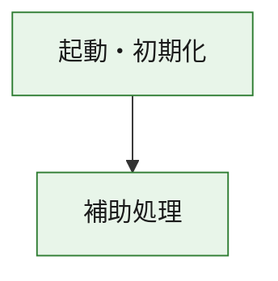
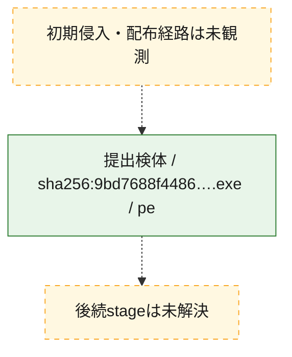
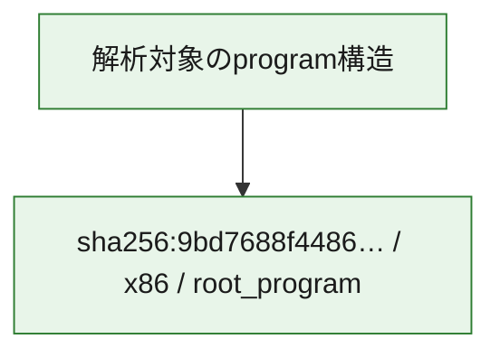

# 全体ロジック：9bd7688f44865542baad99bb150aa0d2983cb31e95d749f1277093c9f93c1c4f

代表関数の静的証跡から、起動・初期化の処理群を確認しました。

## 読み方

- phaseの掲載順は解析上の整理順です。observed_call_edgesがない段階間の実行順を断定しません。
- 図の実線は静的に観測した関係、点線と黄色のノードは未観測・未解決の関係を示します。
- 図は静的な要約であり、動的実行を再現するものではありません。
- 詳細な関数解説とfingerprintは[STATIC-LOGIC.md](STATIC-LOGIC.md)を参照してください。

## 静的可視化

### 実行フロー

### 感染チェーン

### モジュール関係

## 処理段階

### 1. 起動・初期化

entry pointから初期化と後続処理への移行を確認します。
確度: `confirmed_static_function_evidence`

- `9bd7688f44865542baad99bb150aa0d2983cb31e95d749f1277093c9f93c1c4f:ghidra:180001010` — 初期化と主要処理への分岐を行う入口関数です。 状態: `succeeded`、選定理由: `entry_point`, `meaningful_symbol_name`, `reviewed_call_centrality:22`, `role:entrypoint`, `small_program_complete_context`

### 2. 補助処理

主要処理を支える一般内部関数またはlibrary処理を確認します。
確度: `confirmed_static_function_evidence`

- `9bd7688f44865542baad99bb150aa0d2983cb31e95d749f1277093c9f93c1c4f:ghidra:180001240` — 検体内部の一般処理を実装する関数です。 状態: `succeeded`、選定理由: `context_representative`, `reviewed_call_centrality:2`, `small_program_complete_context`
- `9bd7688f44865542baad99bb150aa0d2983cb31e95d749f1277093c9f93c1c4f:ghidra:180001350` — 検体内部の一般処理を実装する関数です。 状態: `succeeded`、選定理由: `context_representative`, `reviewed_call_centrality:25`, `small_program_complete_context`
- `9bd7688f44865542baad99bb150aa0d2983cb31e95d749f1277093c9f93c1c4f:ghidra:180003780` — 検体内部の一般処理を実装する関数です。 状態: `succeeded`、選定理由: `context_representative`, `reviewed_call_centrality:2`, `small_program_complete_context`
- `9bd7688f44865542baad99bb150aa0d2983cb31e95d749f1277093c9f93c1c4f:ghidra:1800038e0` — 検体内部の一般処理を実装する関数です。 状態: `succeeded`、選定理由: `context_representative`, `reviewed_call_centrality:2`, `small_program_complete_context`

## 観測したcall関係

- `9bd7688f44865542baad99bb150aa0d2983cb31e95d749f1277093c9f93c1c4f:ghidra:180001010` → `9bd7688f44865542baad99bb150aa0d2983cb31e95d749f1277093c9f93c1c4f:ghidra:180001240` （`startup` → `support`）
- `9bd7688f44865542baad99bb150aa0d2983cb31e95d749f1277093c9f93c1c4f:ghidra:180001010` → `9bd7688f44865542baad99bb150aa0d2983cb31e95d749f1277093c9f93c1c4f:ghidra:180001350` （`startup` → `support`）
- `9bd7688f44865542baad99bb150aa0d2983cb31e95d749f1277093c9f93c1c4f:ghidra:180001350` → `9bd7688f44865542baad99bb150aa0d2983cb31e95d749f1277093c9f93c1c4f:ghidra:180001240` （`support` → `support`）
- `9bd7688f44865542baad99bb150aa0d2983cb31e95d749f1277093c9f93c1c4f:ghidra:180001350` → `9bd7688f44865542baad99bb150aa0d2983cb31e95d749f1277093c9f93c1c4f:ghidra:180003780` （`support` → `support`）
- `9bd7688f44865542baad99bb150aa0d2983cb31e95d749f1277093c9f93c1c4f:ghidra:180001350` → `9bd7688f44865542baad99bb150aa0d2983cb31e95d749f1277093c9f93c1c4f:ghidra:1800038e0` （`support` → `support`）
- `9bd7688f44865542baad99bb150aa0d2983cb31e95d749f1277093c9f93c1c4f:ghidra:180003780` → `9bd7688f44865542baad99bb150aa0d2983cb31e95d749f1277093c9f93c1c4f:ghidra:1800038e0` （`support` → `support`）
- `ghidra-function:2b3ce732fa1cd84648b5e2fd` → `ghidra-function:0b9f005c49e20ee6767251ee` （`unclassified` → `unclassified`）
- `ghidra-function:2b3ce732fa1cd84648b5e2fd` → `ghidra-function:16525be0113e2e4e458ba4e0` （`unclassified` → `unclassified`）
- `ghidra-function:2b3ce732fa1cd84648b5e2fd` → `ghidra-function:38006c5f3a71b783f0685ae3` （`unclassified` → `unclassified`）
- `ghidra-function:2b3ce732fa1cd84648b5e2fd` → `ghidra-function:3a5cc935a1d2de03fd2b0811` （`unclassified` → `unclassified`）
- `ghidra-function:2b3ce732fa1cd84648b5e2fd` → `ghidra-function:47a3f058cf91becb5ebe619f` （`unclassified` → `unclassified`）
- `ghidra-function:2b3ce732fa1cd84648b5e2fd` → `ghidra-function:95a4d92b844a5762221d8599` （`unclassified` → `unclassified`）
- `ghidra-function:2b3ce732fa1cd84648b5e2fd` → `ghidra-function:97b2eea2ab25143d51690fdc` （`unclassified` → `unclassified`）
- `ghidra-function:2b3ce732fa1cd84648b5e2fd` → `ghidra-function:a433068384f6b7c683625b1f` （`unclassified` → `unclassified`）
- `ghidra-function:2b3ce732fa1cd84648b5e2fd` → `ghidra-function:b2acae9f3469a1fe06851e32` （`unclassified` → `unclassified`）
- `ghidra-function:2b3ce732fa1cd84648b5e2fd` → `ghidra-function:c0bc872d5eed3466f19ea8ff` （`unclassified` → `unclassified`）
- `ghidra-function:2b3ce732fa1cd84648b5e2fd` → `ghidra-function:da98fe8debeb8488982599e9` （`unclassified` → `unclassified`）
- `ghidra-function:2b3ce732fa1cd84648b5e2fd` → `ghidra-function:ebd62893d3554935c50e4126` （`unclassified` → `unclassified`）
- `ghidra-function:5d1c4cd2c8b7b1dbf2de38f6` → `ghidra-function:9643280301fa8661cea0279b` （`unclassified` → `unclassified`）
- `ghidra-function:da98fe8debeb8488982599e9` → `ghidra-external:095ef0675506c3879b46c294` （`unclassified` → `unclassified`）
- `ghidra-function:da98fe8debeb8488982599e9` → `ghidra-external:0c0a501d393abd88f93b553e` （`unclassified` → `unclassified`）
- `ghidra-function:da98fe8debeb8488982599e9` → `ghidra-external:17322df7e70f30976372e8e6` （`unclassified` → `unclassified`）
- `ghidra-function:da98fe8debeb8488982599e9` → `ghidra-external:2173f750327e529b8da22e9c` （`unclassified` → `unclassified`）
- `ghidra-function:da98fe8debeb8488982599e9` → `ghidra-external:22db927acdc394b7ceb7dd73` （`unclassified` → `unclassified`）
- `ghidra-function:da98fe8debeb8488982599e9` → `ghidra-external:27dc11ebe53447b3557bab0c` （`unclassified` → `unclassified`）
- `ghidra-function:da98fe8debeb8488982599e9` → `ghidra-external:2ff105be9ca1b9a57085a762` （`unclassified` → `unclassified`）
- `ghidra-function:da98fe8debeb8488982599e9` → `ghidra-external:4806def906a829a049aaeb35` （`unclassified` → `unclassified`）
- `ghidra-function:da98fe8debeb8488982599e9` → `ghidra-external:54388591b61b22bf4812aba6` （`unclassified` → `unclassified`）
- `ghidra-function:da98fe8debeb8488982599e9` → `ghidra-external:5728c53cb31eac3f335c24d2` （`unclassified` → `unclassified`）
- `ghidra-function:da98fe8debeb8488982599e9` → `ghidra-external:8420d42b2567bb05c797f61c` （`unclassified` → `unclassified`）
- `ghidra-function:da98fe8debeb8488982599e9` → `ghidra-external:8432758d4735101f8119ba33` （`unclassified` → `unclassified`）
- `ghidra-function:da98fe8debeb8488982599e9` → `ghidra-external:87486e319befd4cbb4cc9703` （`unclassified` → `unclassified`）
- `ghidra-function:da98fe8debeb8488982599e9` → `ghidra-external:934da45485dbea675c600760` （`unclassified` → `unclassified`）
- `ghidra-function:da98fe8debeb8488982599e9` → `ghidra-external:ae9a5be9f12eabe0edec088a` （`unclassified` → `unclassified`）
- `ghidra-function:da98fe8debeb8488982599e9` → `ghidra-external:bb6553d4f6096f9e40368e2e` （`unclassified` → `unclassified`）
- `ghidra-function:da98fe8debeb8488982599e9` → `ghidra-external:e17c11135b866357879e6d0f` （`unclassified` → `unclassified`）
- `ghidra-function:da98fe8debeb8488982599e9` → `ghidra-external:e92ce8d41d80087cc682bd4c` （`unclassified` → `unclassified`）
- `ghidra-function:da98fe8debeb8488982599e9` → `ghidra-external:f00e1f036fcbfef796006263` （`unclassified` → `unclassified`）
- `ghidra-function:da98fe8debeb8488982599e9` → `ghidra-external:f1596f22e8bbc9943acfb902` （`unclassified` → `unclassified`）
- `ghidra-function:da98fe8debeb8488982599e9` → `ghidra-external:facb4a378889c89fd0fc4afa` （`unclassified` → `unclassified`）
- `ghidra-function:da98fe8debeb8488982599e9` → `ghidra-function:5d1c4cd2c8b7b1dbf2de38f6` （`unclassified` → `unclassified`）
- `ghidra-function:da98fe8debeb8488982599e9` → `ghidra-function:9643280301fa8661cea0279b` （`unclassified` → `unclassified`）
- `ghidra-function:da98fe8debeb8488982599e9` → `ghidra-function:b2acae9f3469a1fe06851e32` （`unclassified` → `unclassified`）

## 解析範囲と制約

- 選定外関数は全体inventoryへ残しますが、関数本体の個別解説対象にはしていません。
- indirect call、難読化、packer、VM、壊れたcontrol flowによりcall関係が欠落する場合があります。
- 文書は静的解析に基づき、検体実行や外部通信による動的確認は行っていません。
